# ABAQUS技巧：Python脚本批量创建分析步 - P1 - CAE陈一栎 - BV1ciiceREJr

给大家录制一期用Python脚本批量创建，分析过的一个教程吧，呃这个教程以这个隧道为例，因为我们在隧道建模的过程中，会有非常多的开发部，可能会有几十个上百个甚至更多，我们如果说一个一个点击创建啊。

一个一个分析不去创建，非常非常的浪费时间，而且我们这个分析部是一个重复的一个操作，他的分析部的设置是一样的，那么这时候我们就可以用呃，Python脚本呢来实现这个分析，或的批量化的一个设置。

提高我们的效率，节约我们的时间啊，也避免了出错，我们首先看这个模型啊，他第一个是定力分析部是吧，剩下的从一一到一四十九，全都是这个普通的静力通用分析部。

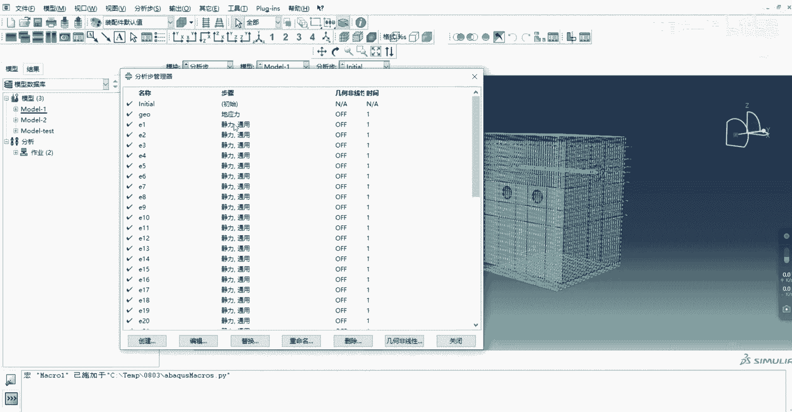

精力分析部，它的初始增量不是0。1是非对称，普通的静力通用初始0。1也是非对称是吧。

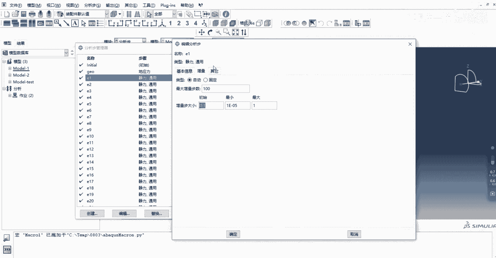

没有其他什么设置。

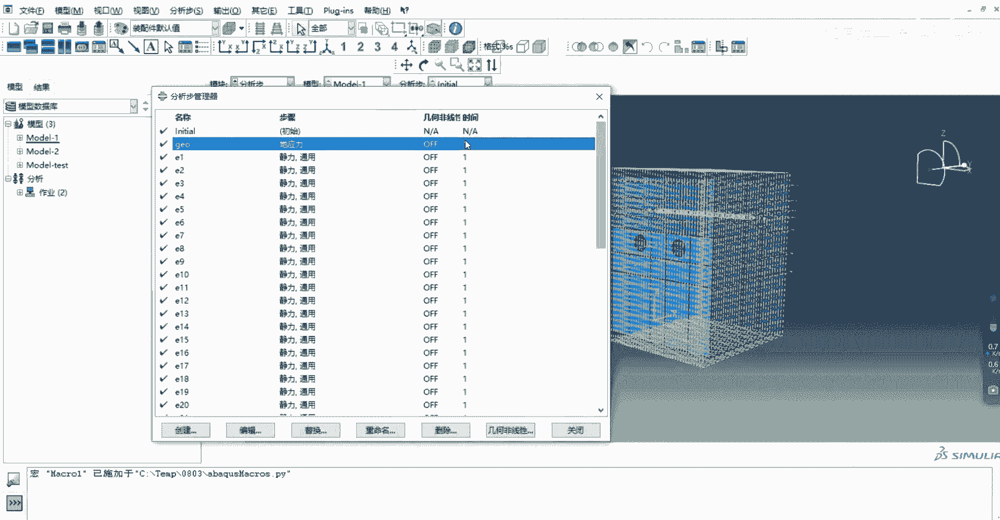

然后我们先把这些分析部给删掉。

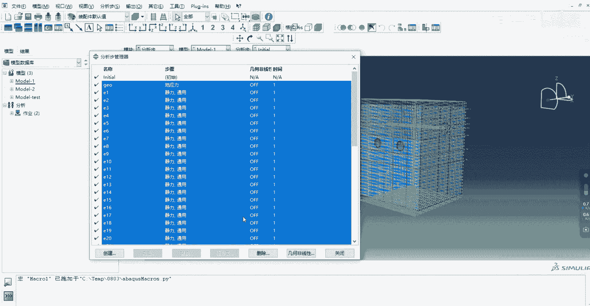

然后带大家一步一步的去演示，给大家演示一下，额是这个分析部这个的这个批量化创建脚本的，是如何如何写的，我们点击这个文件，点击宏管理器创建，给大家讲一下这个这个功能是干嘛的，这个创建宏吧。

这个创建宏就是创建一个脚本，能把你进行的操作给录制下来，但是他录我们录制的东西肯定是有限的，你跑的这个分析部分肯定是很多的，我们额想要通过创建一两个分析步。

把这个把这个操作啊录制到这个Python语言中啊，然后通过对这个Python语言进行的修改，来实现批量化，现在我们操作一下，点击继续，首先我们创建一个定应力分析部。

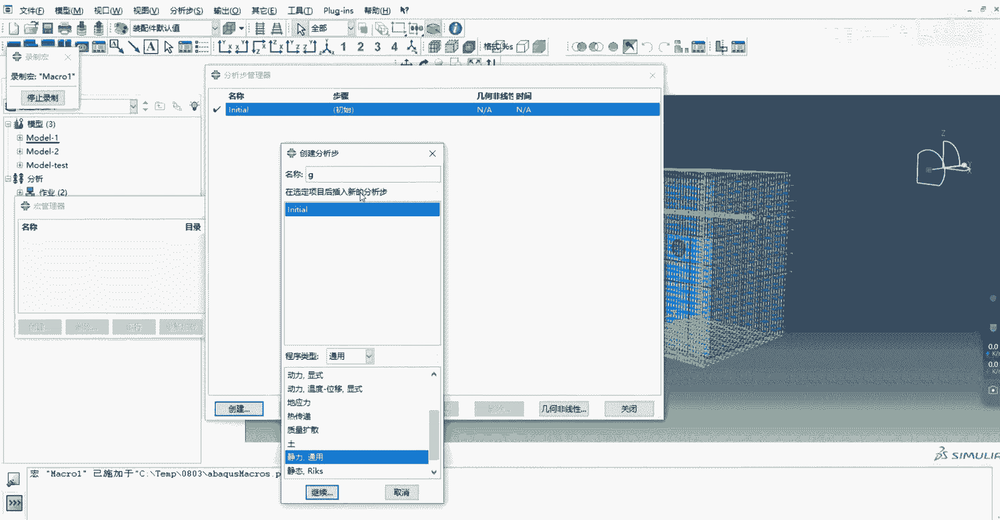

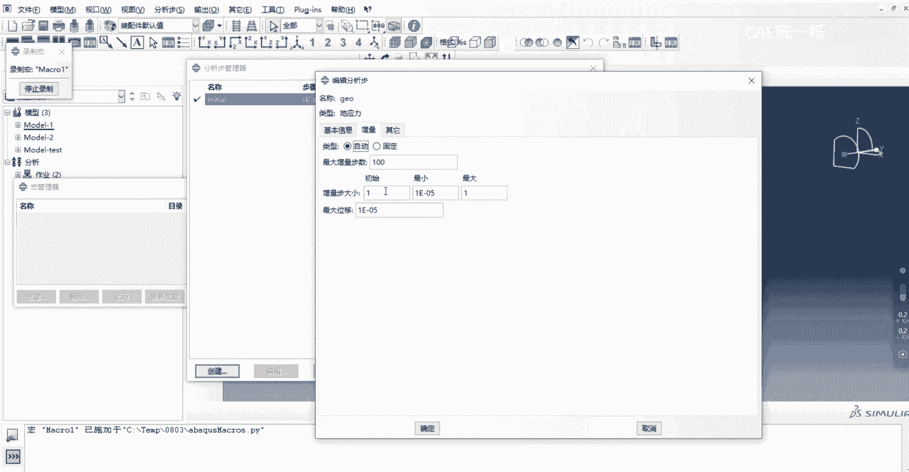

初始0。1F称我们再创建，这个静力通用分析部。

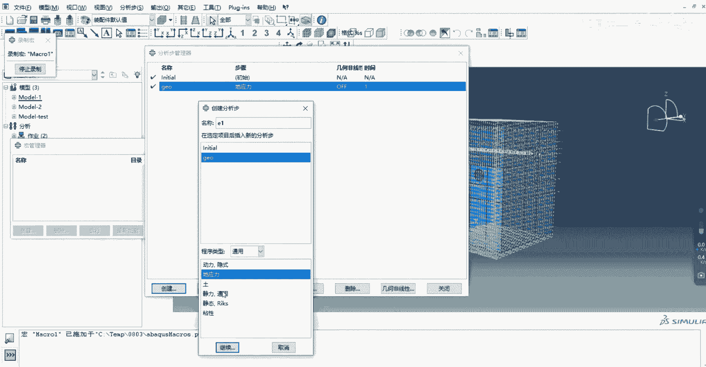

同样的也是非对称，好我们点击确定。

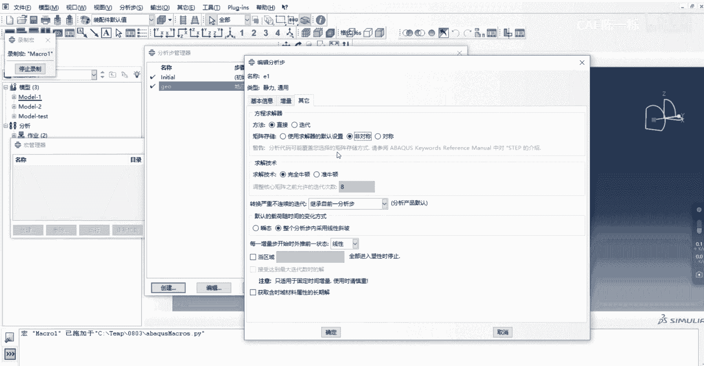

第三呃，第二个一二。

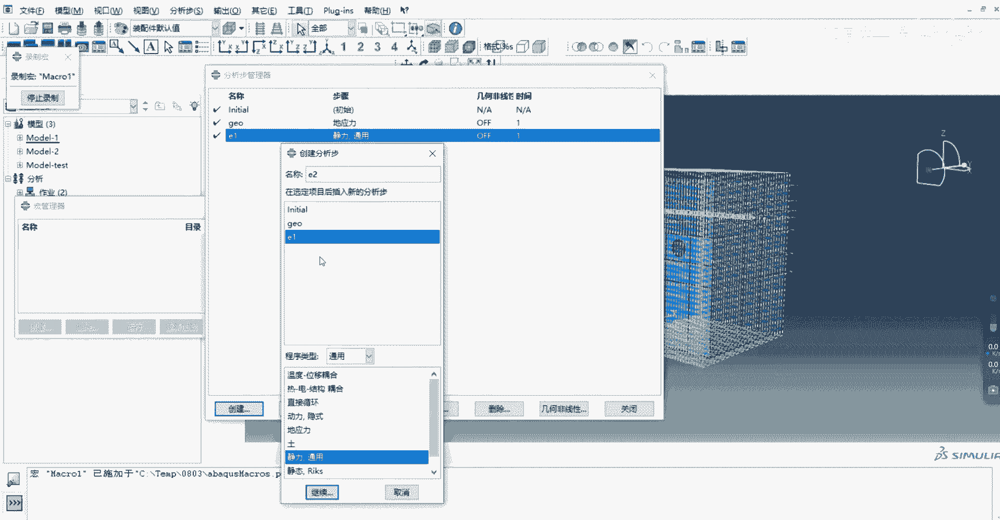

初始0。1非对称好。

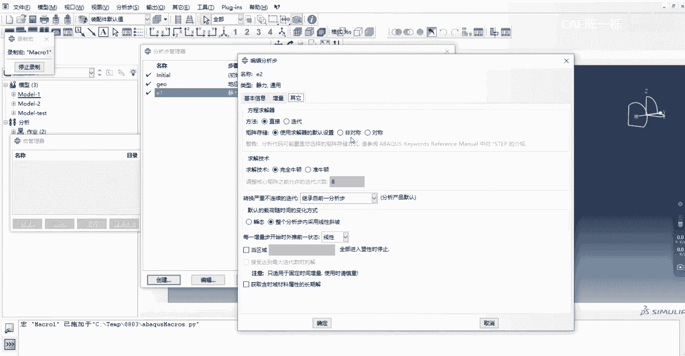

我们点击停止录制，停止录制之后，我们来到目标文件夹。

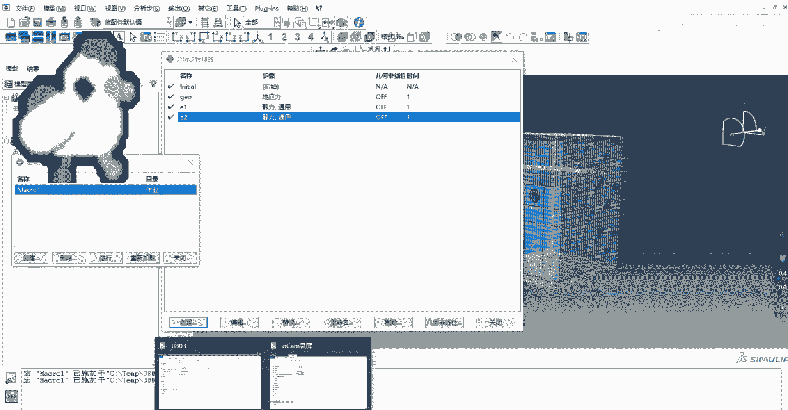

找到这个点PY文件，这个就是我们刚才录制的脚本，我们通过文本或者是编辑器也给它打开，可以看到这个这个脚本啊。

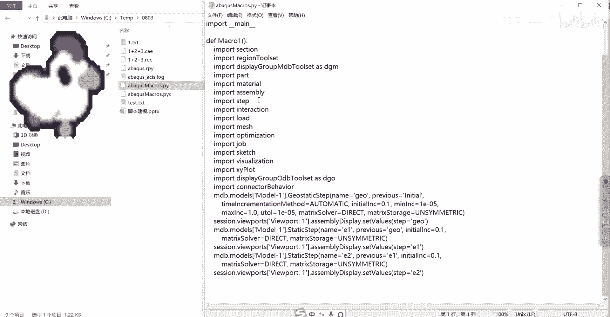

这就是完整的脚本，但是有些是我们不需要的。

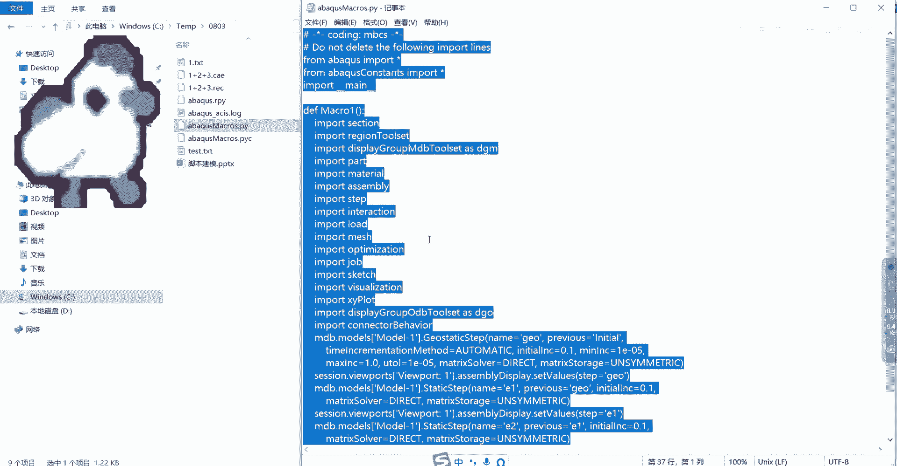

我们点击CTRLVCTRLC复制复制到一个记事本中，我们来看一下这个语句啊，首先这个Python规定信号后面的是不被读取的，就是你信号后面无论写什么无所谓，不会被这个不会被识别到，然后前面这几个语句。

就是相当于这个把这个Python导入进去，就是相当于这个接口吧，如果说你不输入这几个语句，你直接输入这个Python的程序的话，它是识别不出来的，然后下面是一些这个功能啊，就是阿布克斯里面的几个功能。

比如说什么创建创建部件的材料的，装配的分析部的，就是把可能要用的功能全部给导入进去，然后接下来下面再到调用，它就不会出现不识别的情况，然后接下来我们把这个我们不需要这个函数，我们把这个函数给删掉。

然后前面的空格我们也需要全部给删掉，因为这个空格是因为它创建一个函数，所以这个函数下面都缩进了，我们不需要我们不需要这个函数，所以前面空格必须要删掉，不然的话他是会报错的。

好接下来我们来看这个这个程序啊，首先，首先第一行就是我们创建这个定力分析部，是吧，定这个分析部的名字，goo前面那个分析部initial啊，自动初始0。1啊，最小一一负五，这都体现在这里面了。

我们把这个嗯，第二行和第三行都给它弄到一起去，我要让它连续啊，这三行其实是一句话，我们把它写在一起，像这个什么session，这是没有用的，我们可以把它删掉，这个，这个但是在删的时候注意啊，别别删多了。

别删错了，给他，然后这个也同理啊，要把它弄到前面去，这个也是一样，嗯这是创建第应力分析部，然后这个分析部就是创建了我们的一一分析部，就是第一个精力通用分析部，name11是吧，前一个分析部GU。

然后这个分析部初始的增量部对吧，然后非对称，然后都体现在这里面，然后从这往后我们就要把这个语句给循环起来，我们要加一个for循环是吧，用英文书法，For i，For，看一下。

For i in range，你把这个复制一下，就是这个I从这个二开始，每次增加一可以增加到49，这个50是不包含里面的，就是23451直到49，这是这个循环，然后下面这个创建分析步骤。

我们这里就要改了，这就不是E2了，这应该是EI了，我们把这个二删掉，空格加上空格，然后这个I呀是个字符串，我们用个字符串的函数SSTR，然后后面这个就不是E1了是吧，就是EI减一，我们把这个一删掉。

把这个给粘贴过去，这里改成I减一。

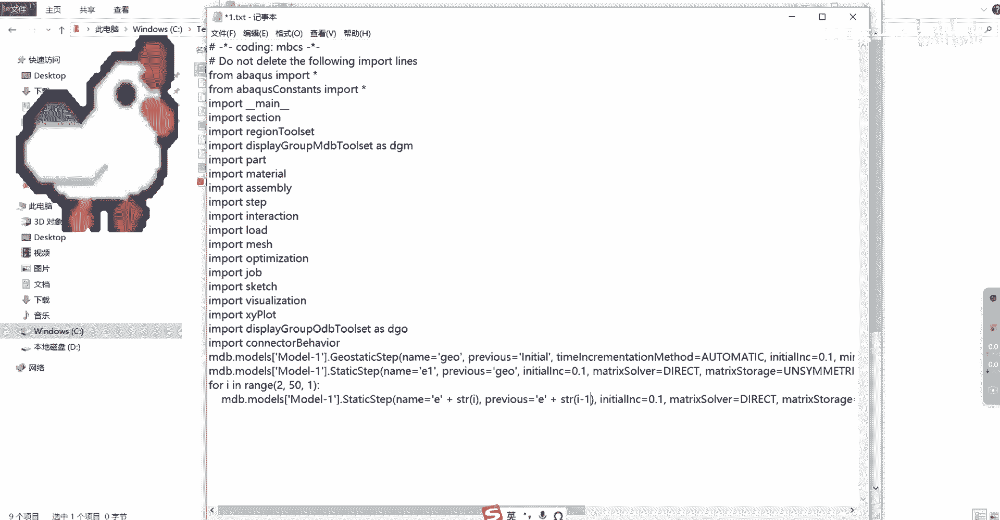

然后这个分析部的程序就这样了，我们把它复制下来，我们导入一下试试看会不会出现什么问题。

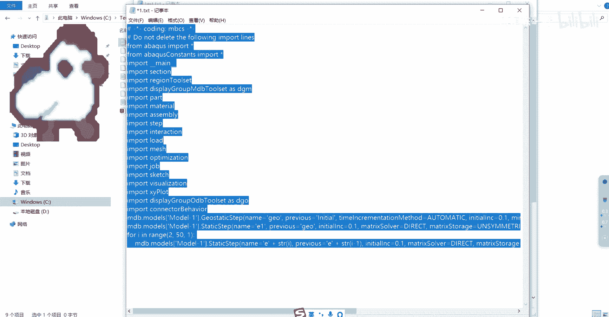

我们来到来到这里啊，我们来粘贴一下，然后按着这个enter啊，他每次不动的时候就按enter好，可以看到这个程序运行的没有问题啊。

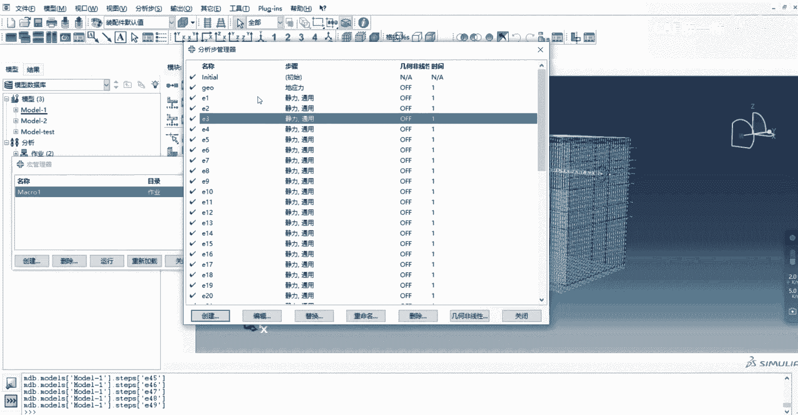

刚才是吧，创建了49个，如果说是吧，你不是49，那就增加这里，假如说你要创建100个分析库，那这里就是101啊。

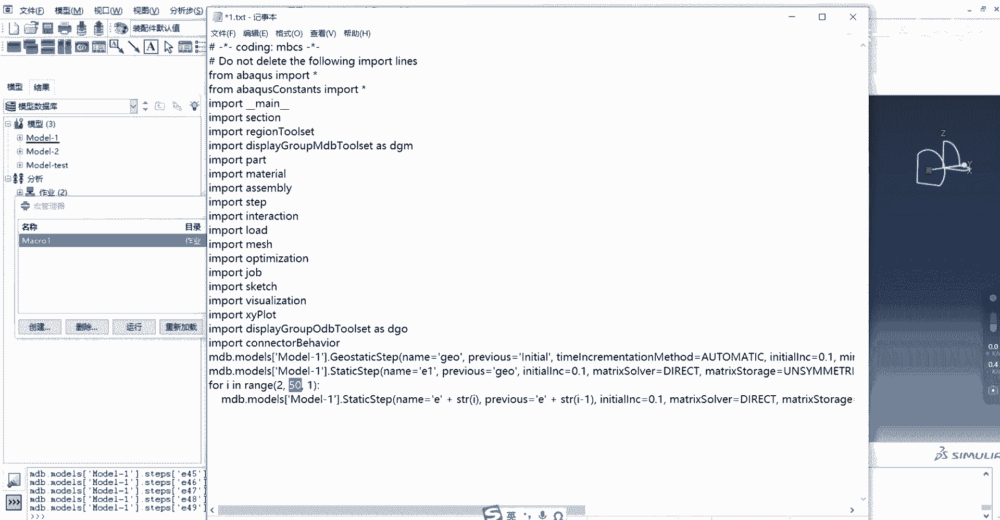

它这个可以叠加的。

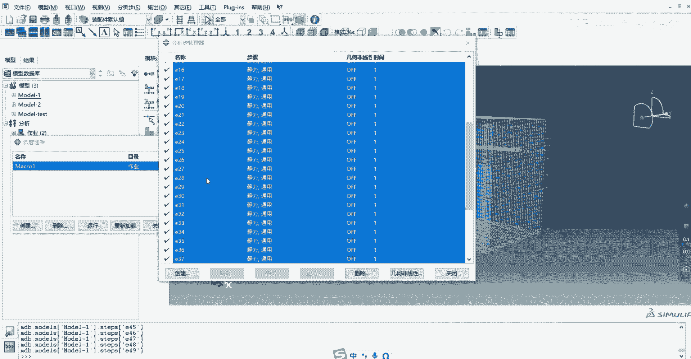

这个不用删，你直接重写就行，他就创建了100一个哎，创建100个对吧，这个分析部这个脚本还是比较简单的，大家可以这个试着去练习一下好吧。

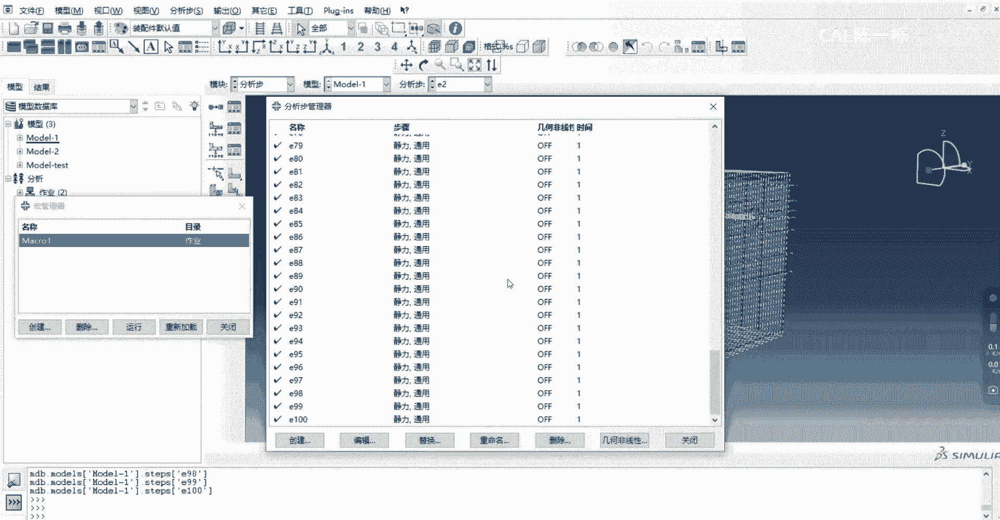