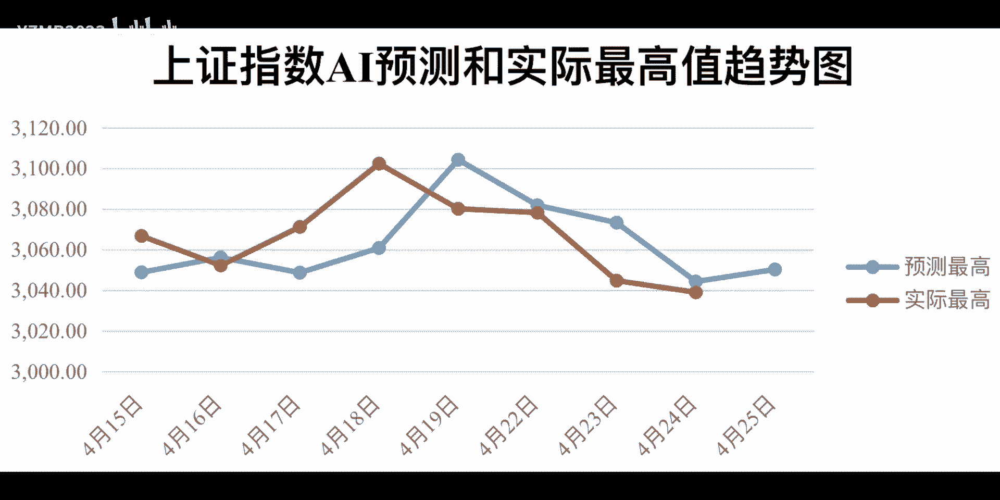
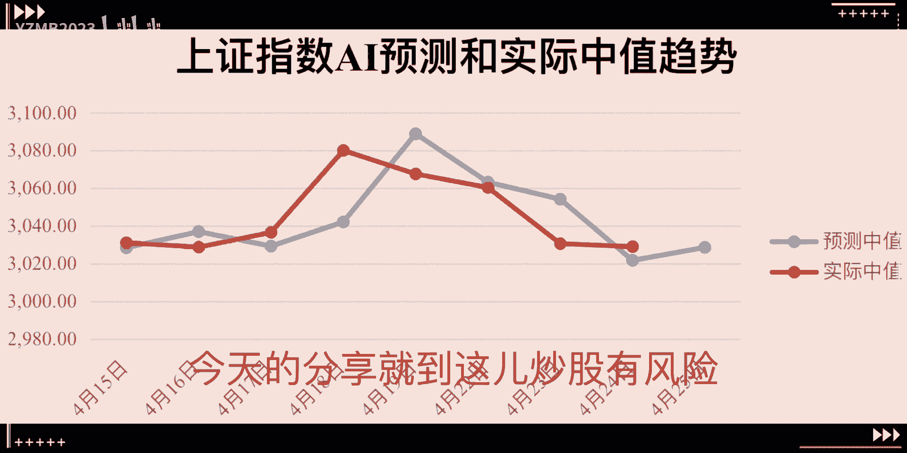
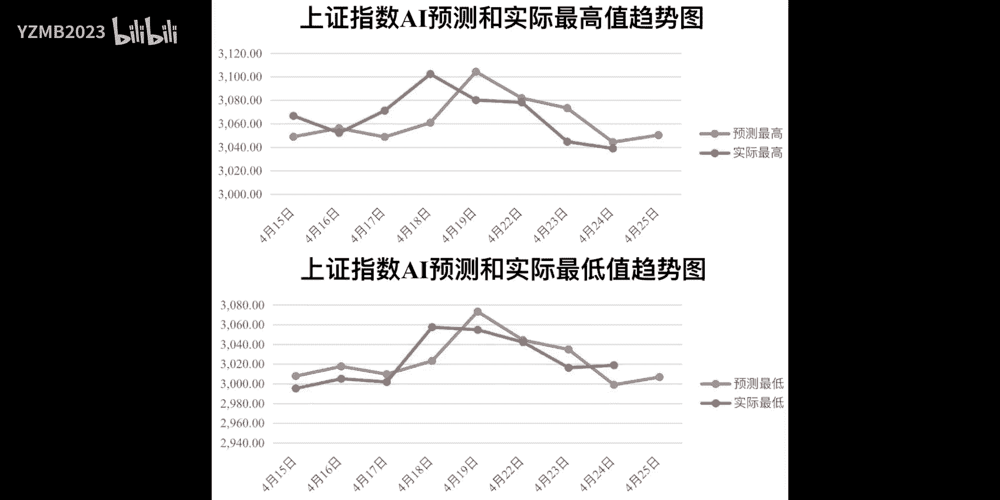

# AI 助力量化交易：炒股新策略 - P1 - YZMB2023 - BV16b421Y72E

嘿各位股友，今天咱们来聊聊，怎么用AI预测和量化交易来炒股，首先AI预测就像是航海时的潮汐表，能帮咱们预测明天股票的最高价和最低价，这玩意用到了一大堆历史数据和机器学习算法，虽然不能保证百分之百准。

但至少能给咱们指个大概方向，有了方向，咱们就得定个计划，也就是量化交易策略，这个策略得根据AI的预测来，比如预测价格会涨，咱们就计划买入，预测价格会跌，咱们就计划卖出，这个策略就像航海图的清清楚楚。

明明白白，接下来咱们得把策略变成电脑能懂的代码，Python这玩意现在可火了，处理数据特别厉害，写交易代码再合适，不过写好代码咱们还不能急着用，得先试试看，这就叫回测，用历史数据来模拟一下策略的效果。

如果回测结果不错，咱们再试试模拟交易，就像在海上试航一样，熟悉熟悉操作，当然了，炒股得注意风险，得像航海一样准备着安全帽，这安全帽就是止损点，万一市场风浪不变，咱们得及时止损，保护本金。

最后市场是会变的，咱们的策略也得跟着变，得定期看看策略的效果，根据市场情况和AI的预测来调整策略，总之AI预测和量化交易结合起来，就像是给咱们的炒股之旅装了个智能导航系统，用好了。

咱们就能在股市这个大海里稳稳当当的航行，不管市场怎么变，咱们都能从容应对行了，今天的分享就到这儿，炒股有风险。

