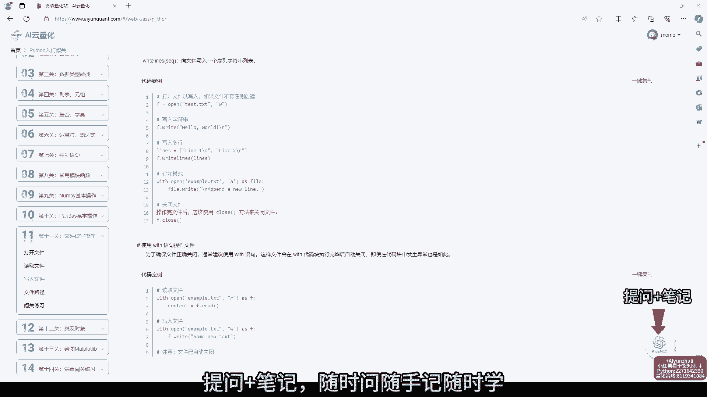
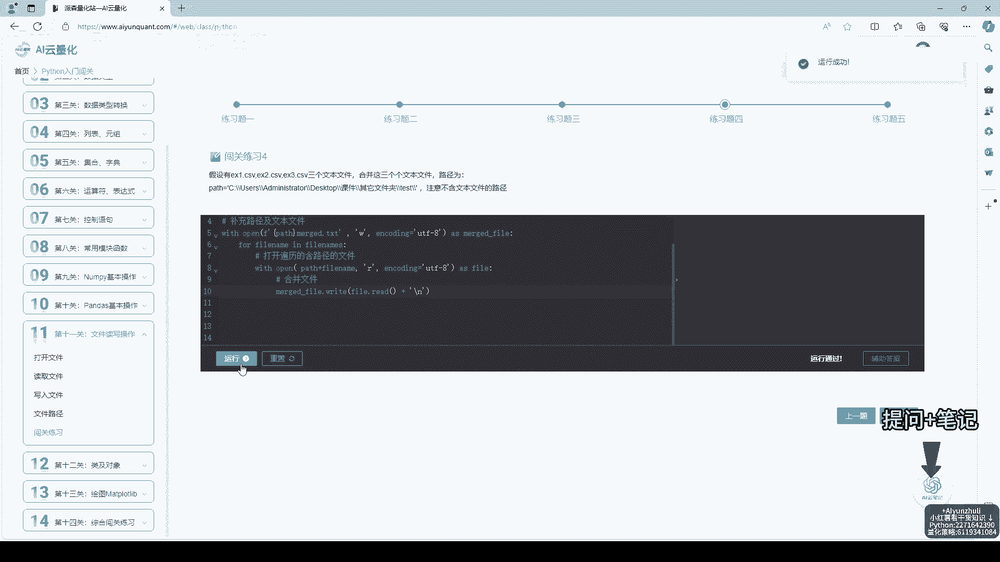
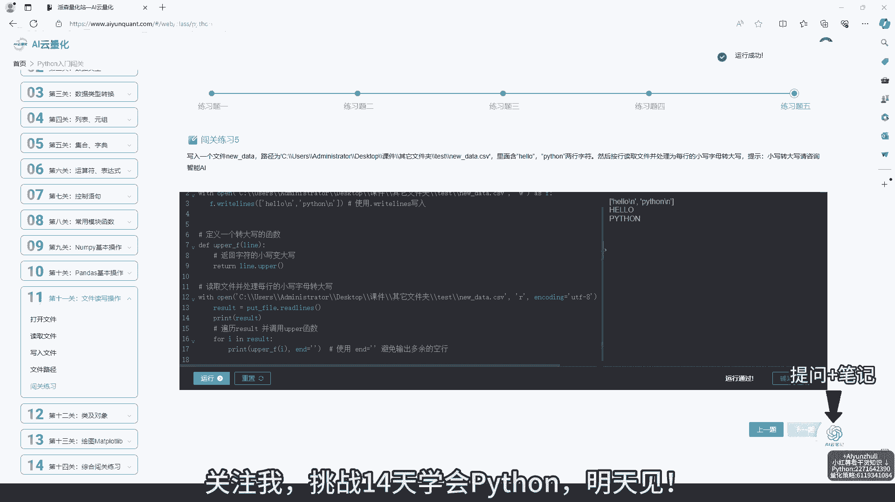

# AI云量化-第11关：文件读写操作，python量化策略代码学习 - P1 - Python量化云编程 - BV13n4y197CD

挑战14天学会PYON，今天学习的是第11关，文件读写操作，知识点讲解很详细，并且配备代码案例，欢迎评论区交流学习哈，每一关都配备综合闯关练习题，不会的问题可以问问右下角I云笔记，提问加笔记，随时问。

随手记。

随时学，视频原音倍速了，大家要好好学习哈，有问题可以私信我，想一起打卡学习的小伙伴可以找我进群，和我一起来做题吧，看看自己掌握多少知识，代码错误，不要着急，仔细检查哈，网站配备小程序。

利用碎片化时间刷题，右下角还有免费干货知识，大家可以去看看，闯关练习题，综合前面所学知识，辅助答案讲解详细，网站还有量化策略，代码，证券数学，计算机等知识可以学习，还有丰富代码案例库，来右下角找我吧。

视频原音倍速了，大家要好好学习哈，下面跟我一起沉浸式学习拍咱们吧。

不会的问题可以问问右下角艾云笔记提问，加笔记，随时问，随手记，随时学，视频原音倍速了，大家要好好学习哈，有问题可以私信我，想一起打卡学习的小伙伴可以找我进群，今天的视频就到这里了，大家要好好学习哈。

不要忘记复盘知识点，关注我，挑战14天，学会派残。

