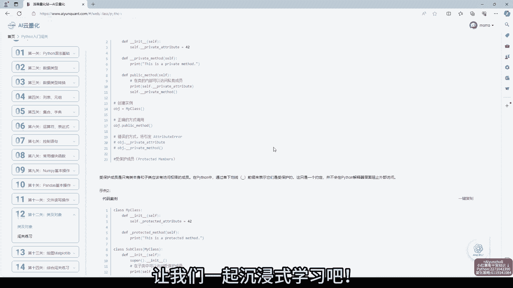
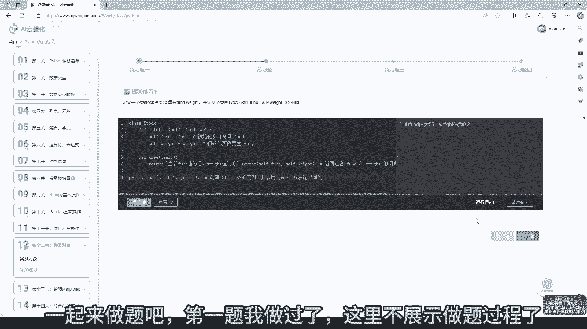
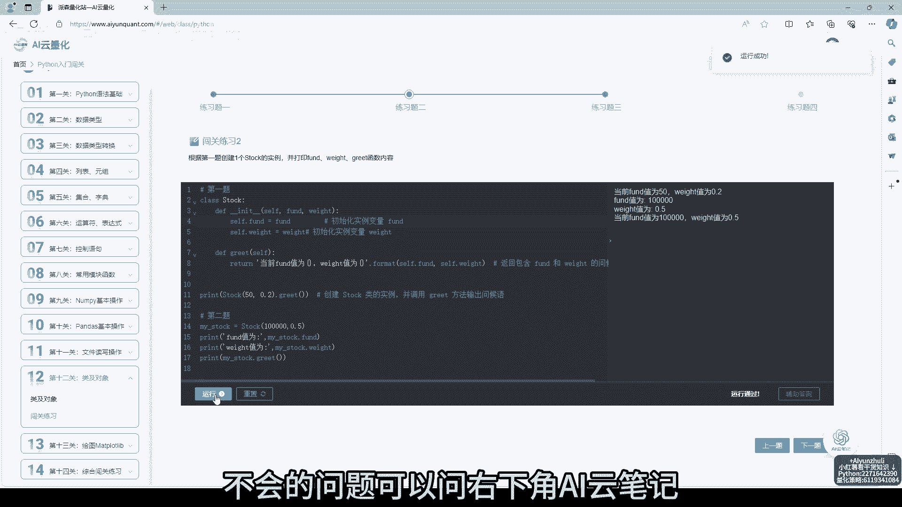
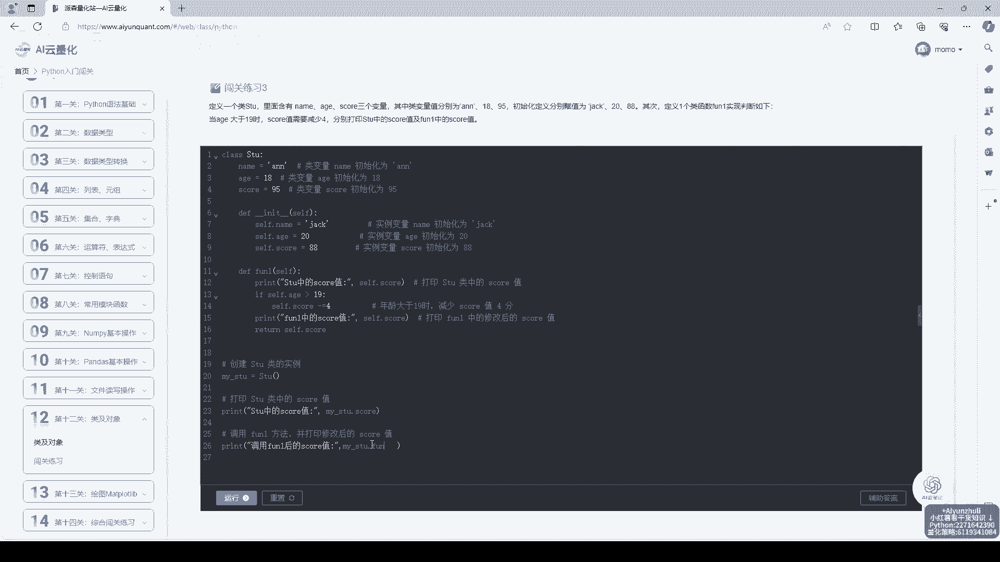
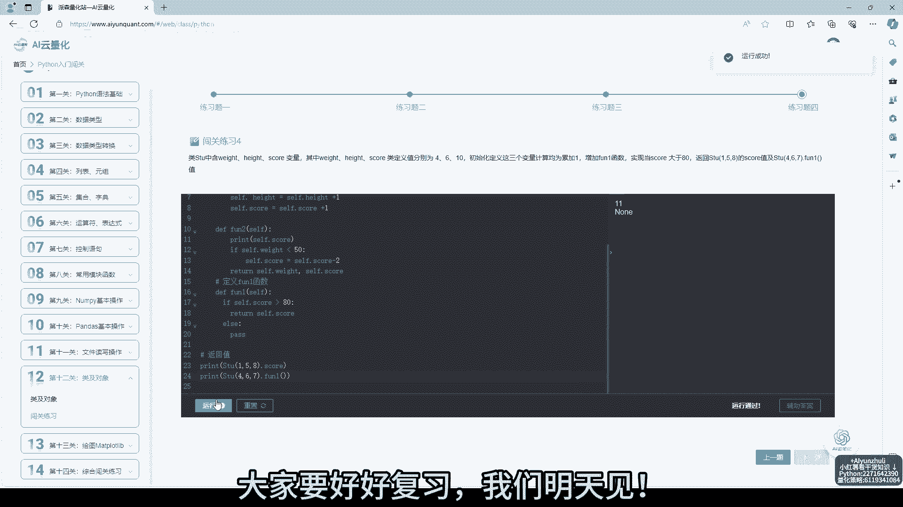

# AI云量化-第12关：类及对象，python量化策略代码学习 - P1 - Python量化云编程 - BV1uM4m1z7Uo

挑战14天学会Python，今天学习第12关，累及对象，还有两天就能学完内容，大家有没有好好复习呢，网站知识很丰富，每个知识点配备代码案例，让我们一起沉浸式学习吧。

视频原音倍速了，大家要好好学习哈，一起来做题吧。

第一题我做过了，这里不展示做题过程了，大家可以看看习题自己掌握如何，不会的问题可以问右下角嗨云笔记。

提问加笔记功能，随时问，随手记，随时学，右下角还有免费干货知识，大家可以利用碎片化时间看看网站，还有量化策略，代码正确数学，计算机等知识可以学习。

今天的视频就到这里了，关注我，挑战14天学会Python，大家要好好复习。

