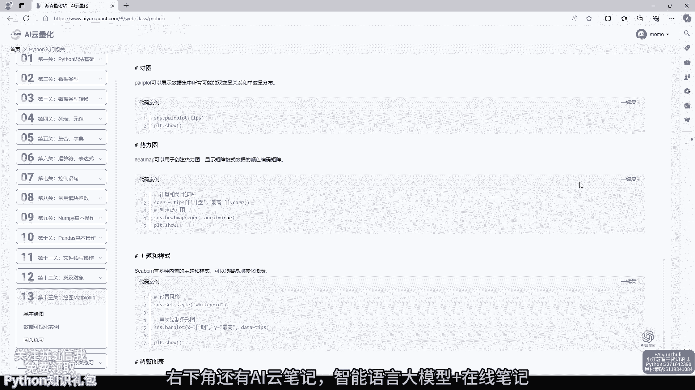
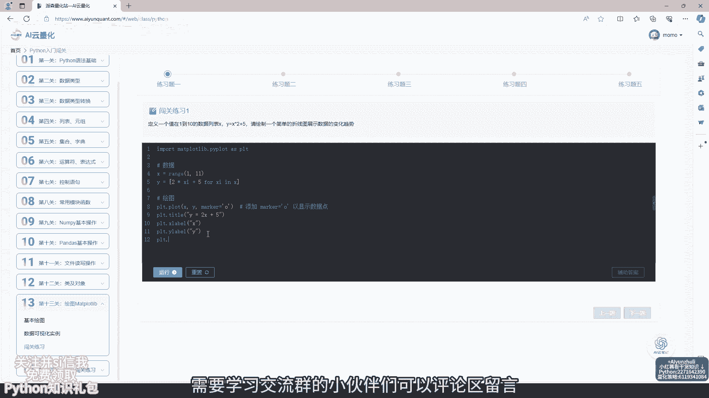
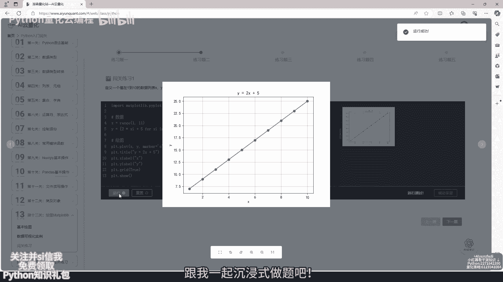
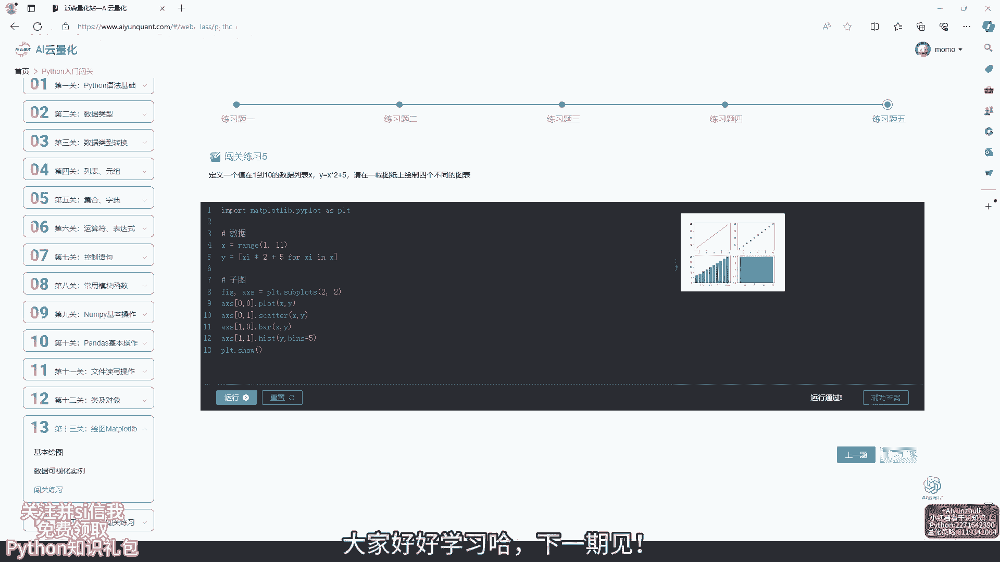

# AI云量化-第13关：绘图Matplotlib，python量化策略代码学习 - P1 - Python量化云编程 - BV1C7421R7mQ

挑战14天学会Python入门，今天学习第13关绘图，mat特拉特lip已经学习13天了，进度还是很快的，大家有没有认真复习呢，关注并私信我，免费领取拍奖礼包，网站还有量化策略，代码证券数学。

计算机等知识课程，还配备小程序，可利用碎片化时间学习，每个知识点都配备代码案例讲解，非常详细，右下角还有嗨云笔记，智能语言大模型加在线笔记。

不会的问题可以问问A小助手，在线笔记，遇到问题随手记，随时看，随时学，右下角还有更多干货知识讲解，有问题也可以评论区留言哈，需要学习交流群的小伙伴们可以评论区留言。

跟我一起沉浸式做题吧。

在线代码编辑器不用下载安装学习更方便，闯关练习，综合前面所学知识，看看自己掌握多少知识吧，视频原音倍速了，大家要好好学习哈，不会的习题可以查看辅助答案，答案讲解非常详细，欢迎评论区交流学习哈。

下面跟我一起沉浸式学习吧，今天的视频就到这里了，关注我，挑战14天学会Python，大家好好学习哈。

