# AI云量化-第5关：集合、字典，python量化策略代码学习 - P1 - Python量化云编程 - BV1kb421q7nj

♪ 如果说白云总是缠绕着天空 ♪，♪ 那么我做你的彩虹 ♪。

♪ 如果说月亮是颗夜空的瞳孔 ♪，♪ 那么我做你的烟火 ♪，♪ 我想环游整片星空 ♪，♪ 找到你的星球 ♪，♪ 摘下换你的笑容 ♪，♪ 穿过了银河的尽头 ♪，♪ 带着我的温柔 ♪。

♪ 终点在你的心上降落 ♪，♪ 如果说白云总是缠绕着天空 ♪，♪ 那么我做你的彩虹 ♪，♪ 如果说月亮是颗夜空的瞳孔 ♪。

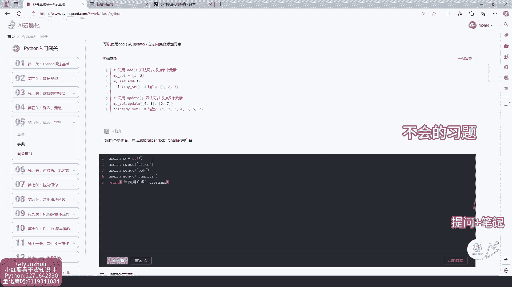

♪ 那么我做你的烟火 ♪。

♪ 我想环游整片星空 ♪，♪ 找到你的星球 ♪，♪ 摘下换你的笑容 ♪。

♪ 穿过了银河的尽头 ♪。

♪ 带着我的温柔 ♪，♪ 终点在你的心上降落 ♪。

♪ 我想环游整片星空 ♪，♪ 找到你的星球 ♪，♪ 摘下换你的笑容 ♪，♪ 穿过了银河的尽头 ♪，♪ 带着我的温柔 ♪，♪ 终点在你的心上降落 ♪，♪ 我想环游整片星空 ♪，♪ 找到你的星球 ♪。

♪ 摘下换你的笑容 ♪，♪ 穿过了银河的尽头 ♪，♪ 带着我的温柔 ♪，♪ 终点在你的心上降落 ♪，♪ 银河的尽头是你的眼眸 ♪，♪ 照亮了整片星空 ♪，♪ 如果说白云总是缠绕着天空 ♪。

♪ 那么我做你的彩虹 ♪，♪ 如果说月亮是颗夜空的瞳孔 ♪，♪ 那么我做你的烟火 ♪，♪ 我想环游整片星空 ♪，♪ 找到你的星球 ♪，♪ 摘下换你的笑容 ♪，♪ 穿过了银河的尽头 ♪。

♪ 带着我的温柔 ♪，♪ 终点在你的心上降落 ♪，♪ 如果说白云总是缠绕着天空 ♪，♪ 那么我做你的彩虹 ♪，♪ 如果说月亮是颗夜空的瞳孔 ♪，♪ 那么我做你的烟火 ♪，♪ 我想环游整片星空 ♪。

♪ 找到你的星球 ♪，♪ 摘下换你的笑容 ♪。

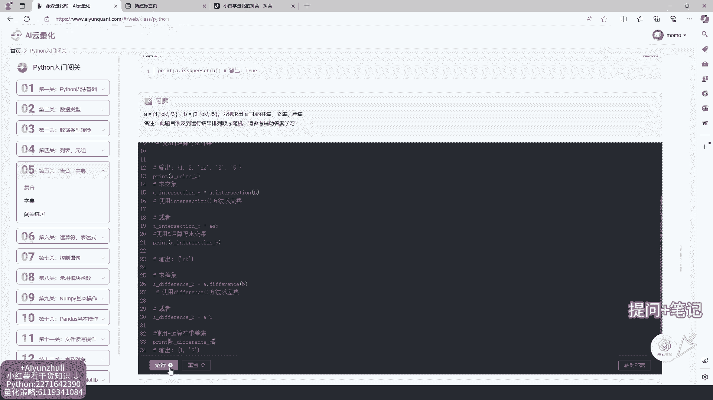

♪ 穿过了银河的尽头 ♪，♪ 带着我的温柔 ♪，♪ 终点在你的心上降落 ♪，♪ 我想环游整片星空 ♪，♪ 找到你的星球 ♪，♪ 摘下换你的笑容 ♪，♪ 穿过了银河的尽头 ♪，♪ 带着我的温柔 ♪。

♪ 终点在你的心上降落 ♪，♪ 我想环游整片星空 ♪，♪ 找到你的星球 ♪，♪ 摘下换你的笑容 ♪，♪ 穿过了银河的尽头 ♪，♪ 带着我的温柔 ♪。

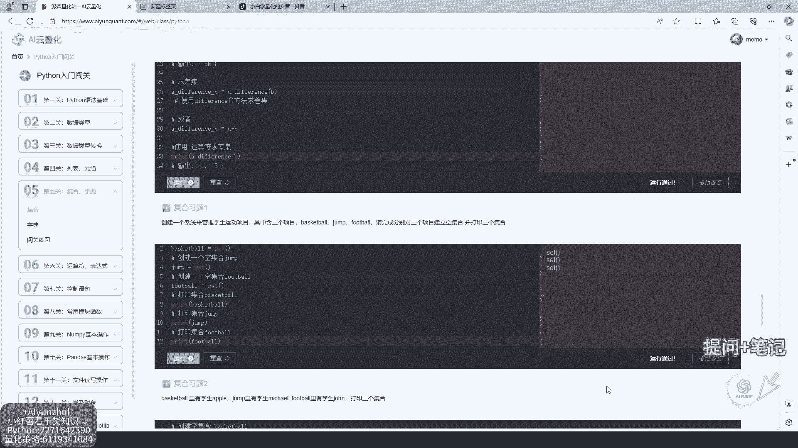

♪ 终点在你的心上降落 ♪，♪ 银河的尽头是你的眼眸 ♪，♪ 照亮了整片星空 ♪，♪ 如果说白云总是缠绕着天空 ♪。

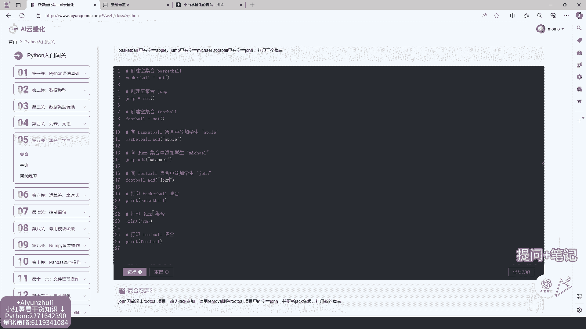

♪ 那么我做你的彩虹 ♪，♪ 如果说月亮是颗夜空的瞳孔 ♪，♪ 那么我做你的烟火 ♪，♪ 我想环游整片星空 ♪，♪ 找到你的星球 ♪，♪ 摘下换你的笑容 ♪，♪ 穿过了银河的尽头 ♪。

♪ 带着我的温柔 ♪，♪ 终点在你的心上降落 ♪。

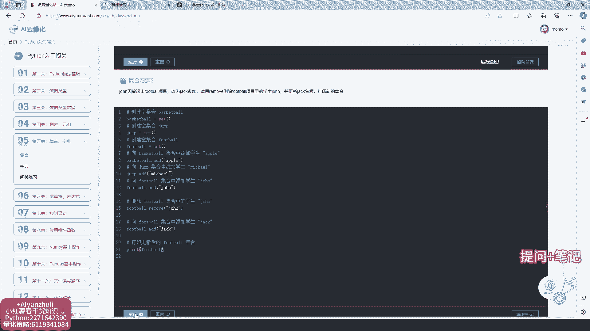

♪ 如果说白云总是缠绕着天空 ♪，♪ 那么我做你的彩虹 ♪，♪ 如果说月亮是颗夜空的瞳孔 ♪，♪ 那么我做你的烟火 ♪，♪ 我想环游整片星空 ♪，♪ 找到你的星球 ♪。

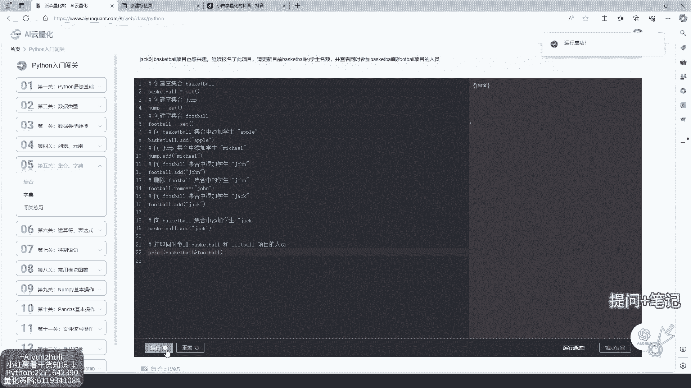

♪ 摘下换你的笑容 ♪，♪ 穿过了银河的尽头 ♪，♪ 带着我的温柔 ♪，♪ 终点在你的心上降落 ♪，♪ 我想环游整片星空 ♪，♪ 找到你的星球 ♪，♪ 摘下换你的笑容 ♪，♪ 穿过了银河的尽头 ♪。

♪ 带着我的温柔 ♪，♪ 终点在你的心上降落 ♪。

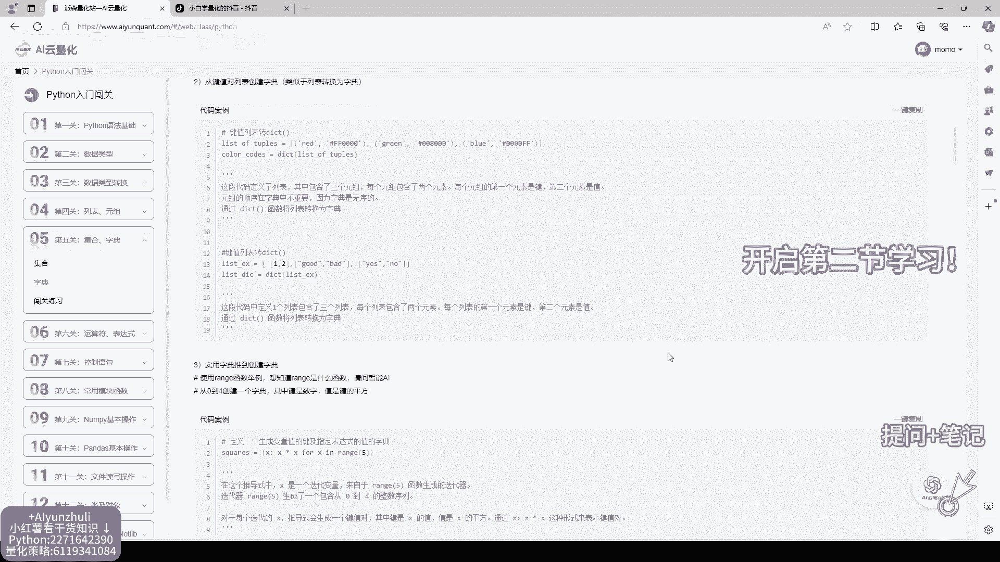

♪ 我想环游整片星空 ♪，♪ 找到你的星球 ♪，♪ 摘下换你的笑容 ♪，♪ 穿过了银河的尽头 ♪，♪ 带着我的温柔 ♪，♪ 终点在你的心上降落 ♪，♪ 银河的尽头是你的眼眸 ♪，♪ 照亮了整片星空 ♪。

♪ 如果说白云总是缠绕着天空 ♪。

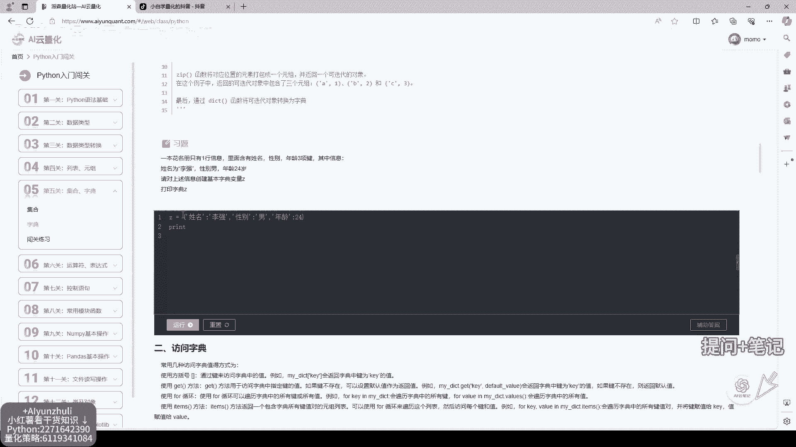

♪ 那么我做你的彩虹 ♪。

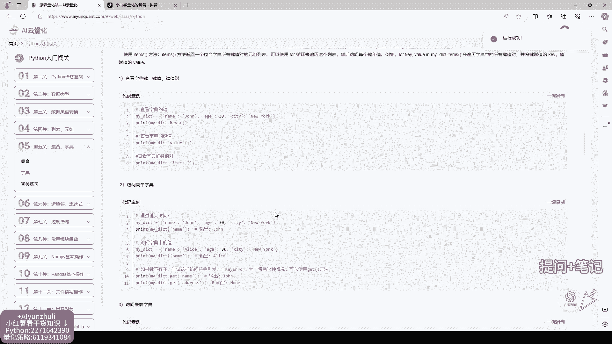

♪ 如果说月亮是颗夜空的瞳孔 ♪，♪ 那么我做你的烟火 ♪，♪ 我想环游整片星空 ♪，♪ 找到你的星球 ♪，♪ 摘下换你的笑容 ♪，♪ 穿过了银河的尽头 ♪，♪ 带着我的温柔 ♪。

♪ 终点在你的心上降落 ♪，♪ 如果说白云总是缠绕着天空 ♪，♪ 那么我做你的彩虹 ♪，♪ 如果说月亮是颗夜空的瞳孔 ♪，♪ 那么我做你的烟火 ♪，♪ 我想环游整片星空 ♪，♪ 找到你的星球 ♪。

♪ 摘下换你的笑容 ♪，♪ 穿过了银河的尽头 ♪，♪ 带着我的温柔 ♪，♪ 终点在你的心上降落 ♪，♪ 我想环游整片星空 ♪。

♪ 找到你的星球 ♪，♪ 摘下换你的笑容 ♪，♪ 穿过了银河的尽头 ♪，♪ 带着我的温柔 ♪，♪ 终点在你的心上降落 ♪，♪ 我想环游整片星空 ♪，♪ 找到你的星球 ♪，♪ 摘下换你的笑容 ♪。

♪ 穿过了银河的尽头 ♪，♪ 带着我的温柔 ♪，♪ 终点在你的心上降落 ♪，♪ 银河的尽头是你的眼眸 ♪，♪ 照亮了整片星空 ♪。

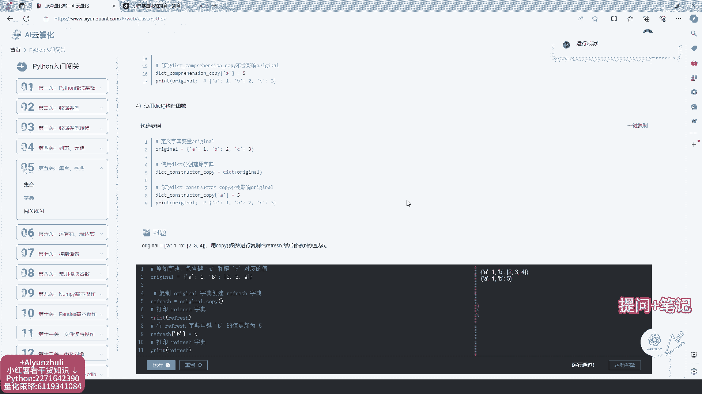

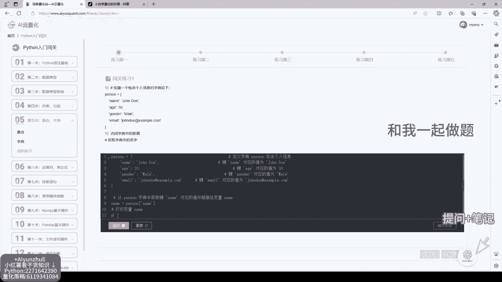

♪ 如果说白云总是缠绕着天空 ♪，♪ 那么我做你的彩虹 ♪，♪ 如果说月亮是颗夜空的瞳孔 ♪，♪ 那么我做你的烟火 ♪，♪ 我想环游整片星空 ♪，♪ 找到你的星球 ♪，♪ 摘下换你的笑容 ♪。

♪ 穿过了银河的尽头 ♪，♪ 带着我的温柔 ♪，♪ 终点在你的心上降落 ♪，♪ 如果说白云总是缠绕着天空 ♪，♪ 那么我做你的彩虹 ♪，♪ 如果说月亮是颗夜空的瞳孔 ♪，♪ 那么我做你的烟火 ♪。

♪ 我想环游整片星空 ♪，♪ 找到你的星球 ♪，♪ 摘下换你的笑容 ♪，♪ 穿过了银河的尽头 ♪，♪ 带着我的温柔 ♪。

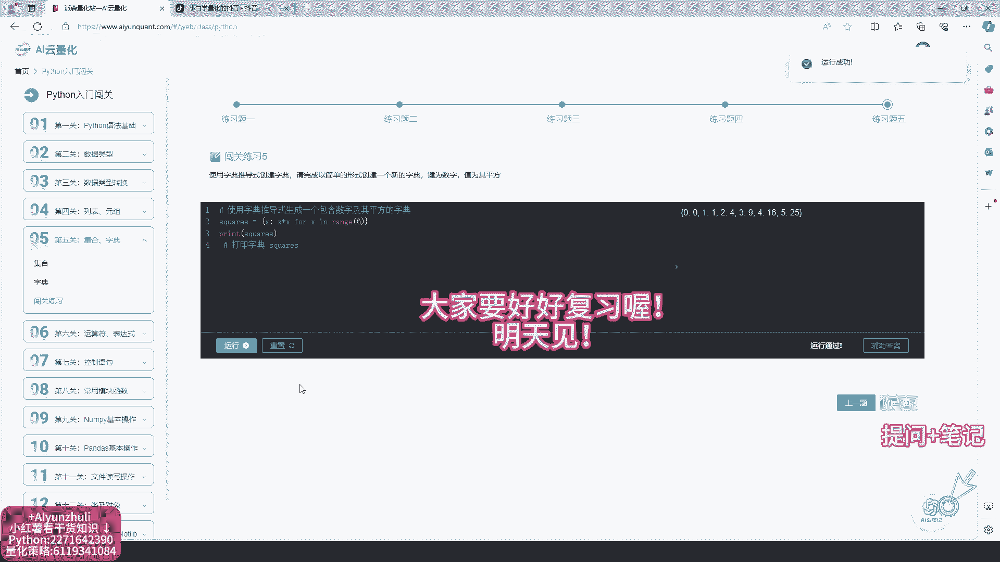