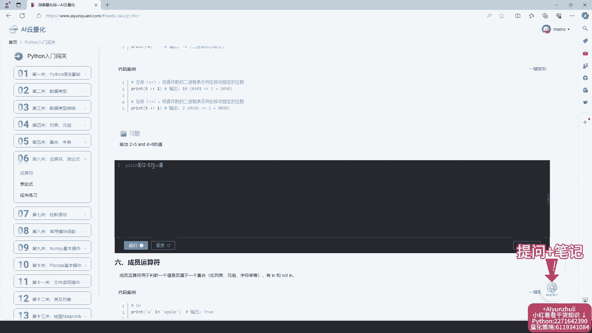
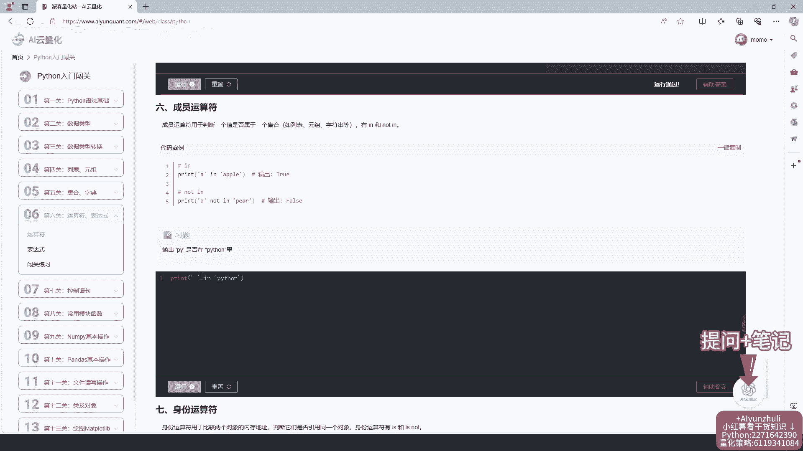
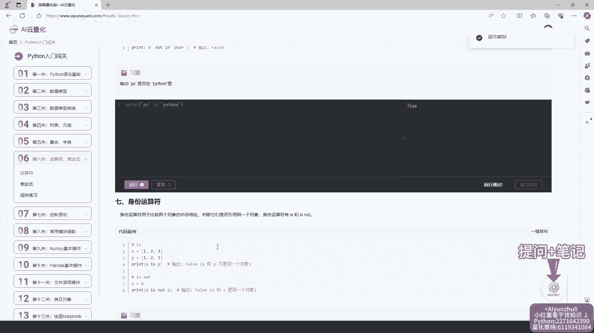
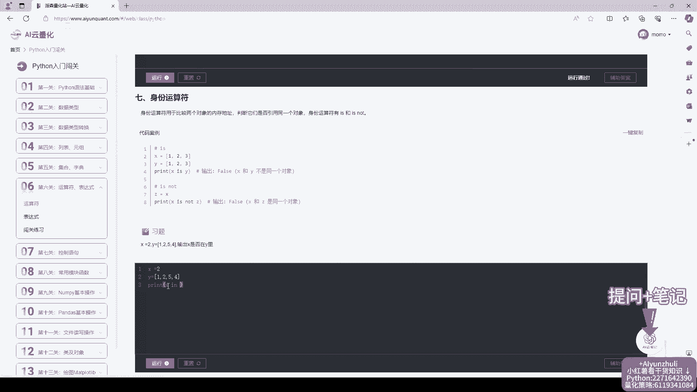
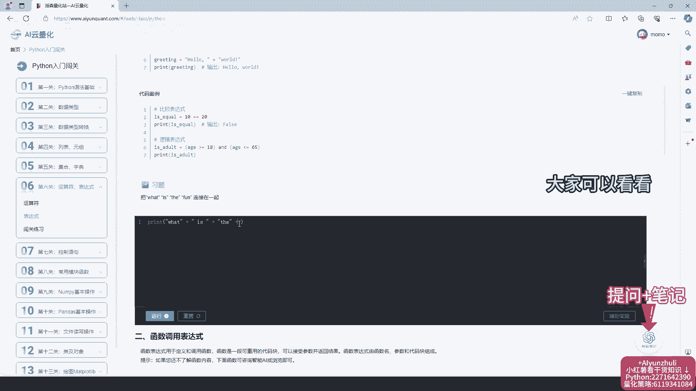
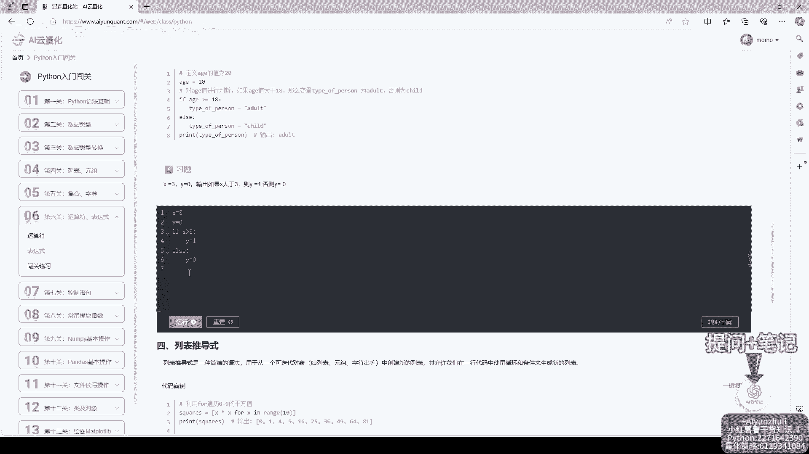
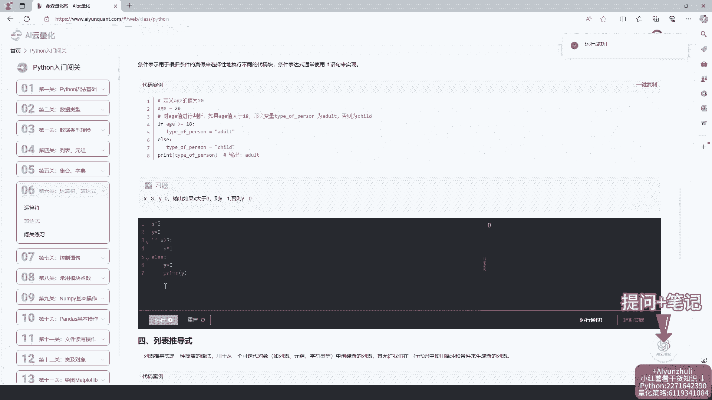
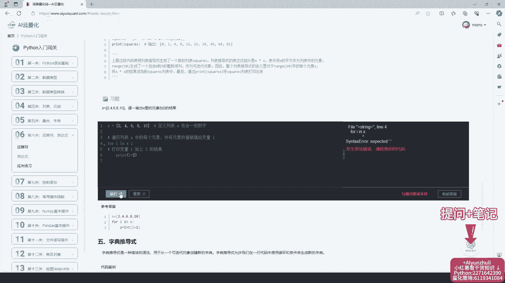
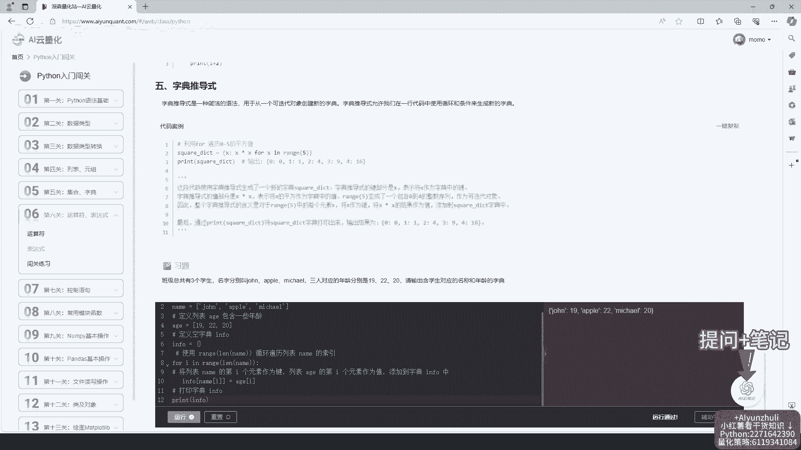
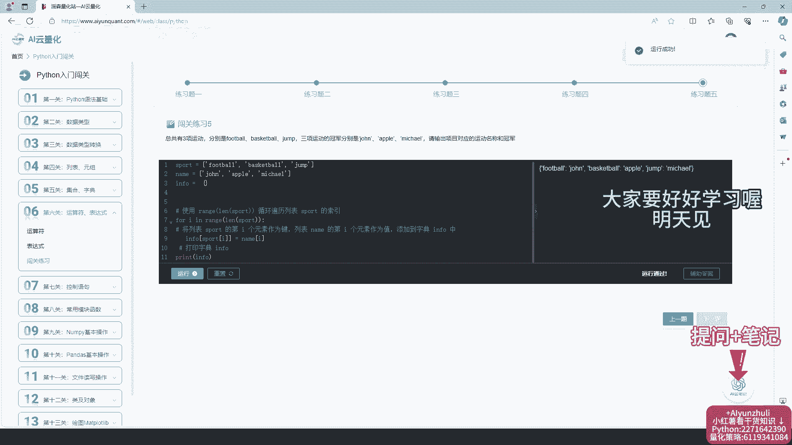

# AI云量化-第6关运算符、表达式，python量化策略代码学习 - P1 - Python量化云编程 - BV1vw4m1S7j1

挑战14天学会Python，今天学习第六关运算符表达式，视频原音倍速了，大家要好好学习哦，同款课程加右下角，每个知识点配备代码案例，在线代码编程器无需下载，安装右下角配备AI云笔记。

语言大模型加在线笔记功能，随手记随时学，特别方便，还有量化策略，代码，数学计算机等干货知识都有哦。

知识和案例都很详细。

开始第二节学习，每天学习后要复盘哈，右下角还有干货分享，大家可以看看。

接下来一起沉浸式学习吧。

运行错误检查代码，查找原因，不会可以查看辅助答案，右下角还有AI原笔记功能，AI小助手帮你解答，在线笔记，帮你记录错题。

开始练习闯关，练习综合前面所学知识，和我一起做题，看看掌握多少知识吧，接下来一起沉浸式做题，检查错误，查找原因，修改代码后记得运行哦，对照答案查找错误，修改后运行最后一题跟着下来，学习效率也很高。

关注我，挑战14天学会Python，大家要好好学习哦。

