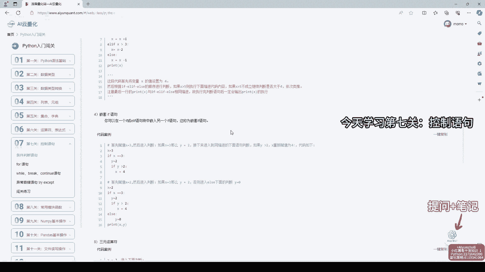
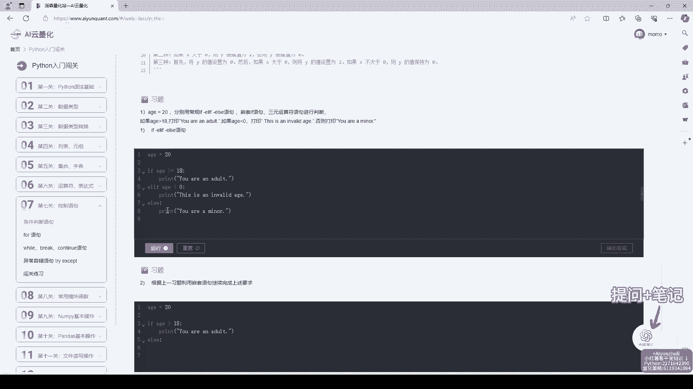
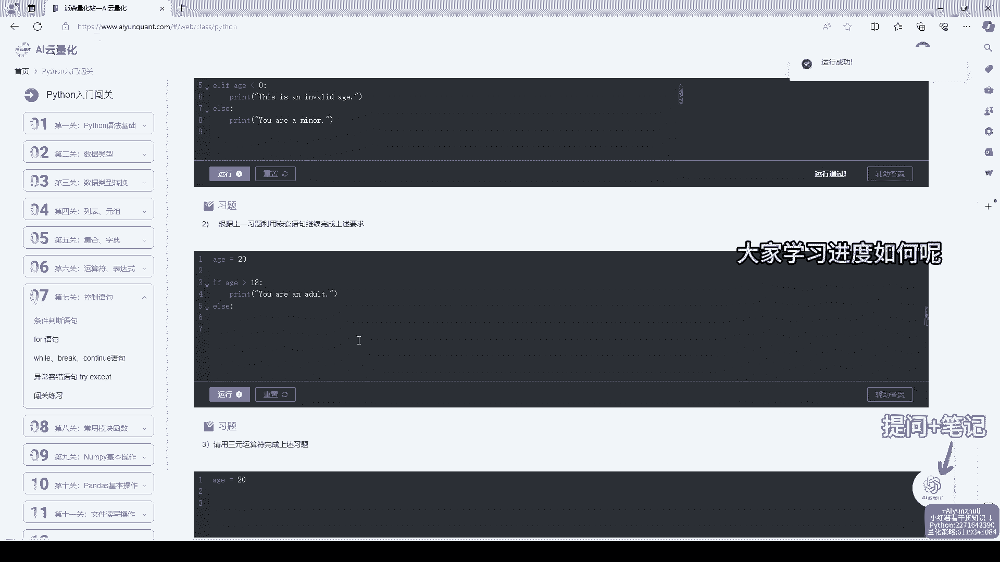
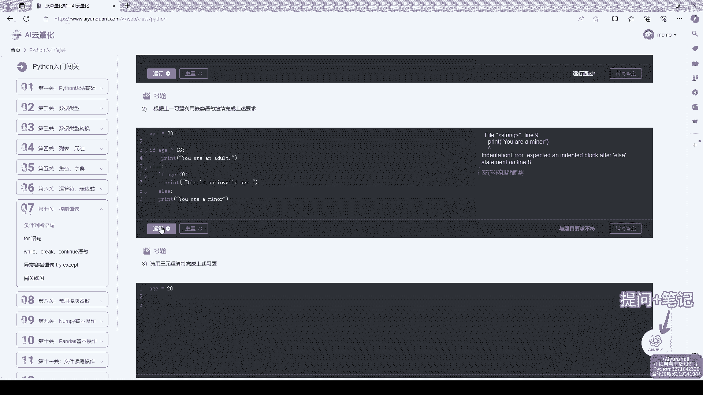
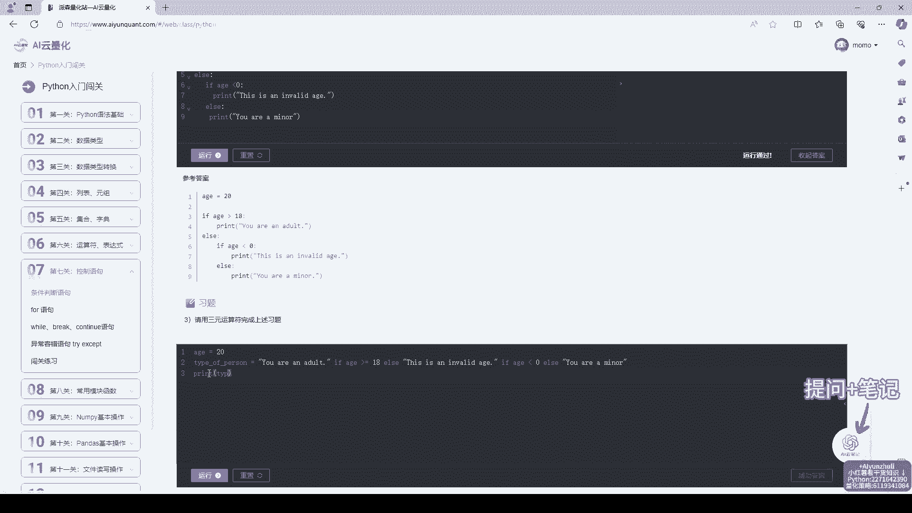
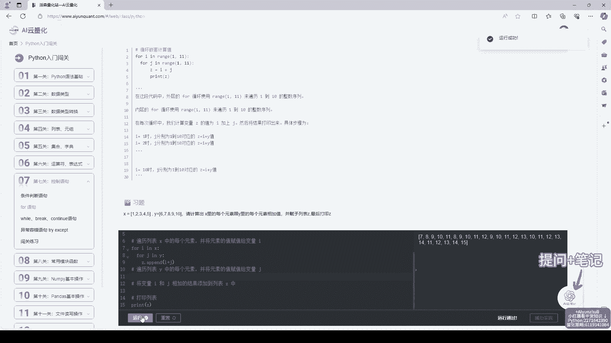
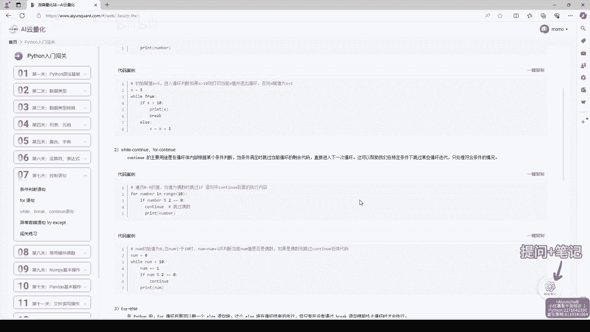
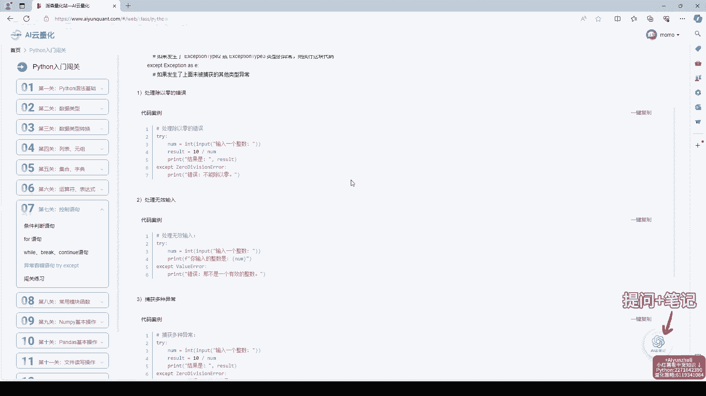
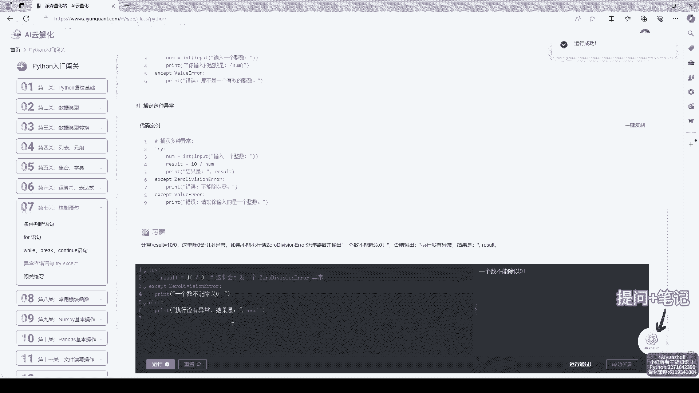
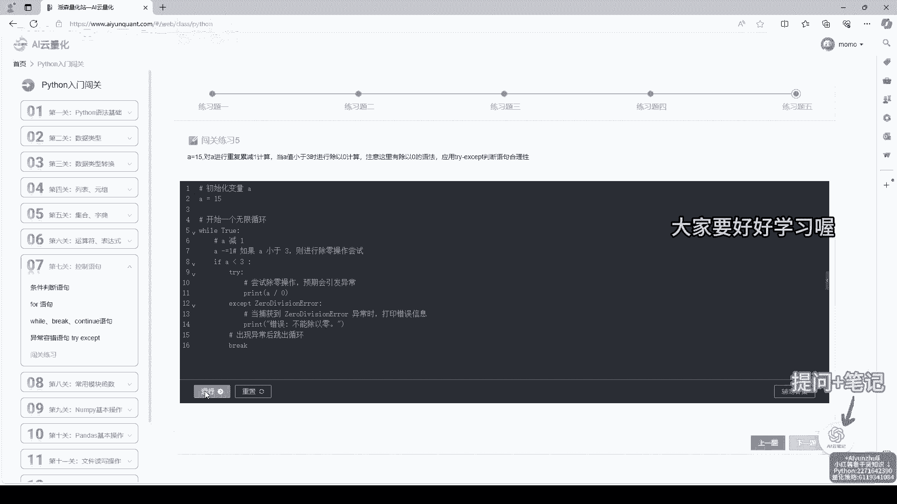

# AI云量化-第7关：控制语句，python量化策略代码学习 - P1 - Python量化云编程 - BV1qzKZeMENu

挑战14天学会Python，今天学习第七关控制语句。

已经学习python1周了，每天都有在进步。

欢迎评论区交流学习哦。

知识讲解很丰富，每个知识点都有代码案例，右下角还有干货知识，一起沉浸式做题吧。

右下角配备AI云笔记，有问题问问AI小助手吧。

还有笔记功能等你来使用哦，在线笔记随手记，随时学。

视频原音倍速了，大家要好好学习。

代码编辑器不用下载安装，直接本地敲代码学习，非常方便。

不方便使用电脑，还有小程序哦，AI量化云，碎片化时间学习，量化策略代码，数学计算机知识学习，这里全都有喔，不会的练习题可以查看辅助答案，答案非常详细，和我一起沉浸式学习吧，关注我。

挑战14天学会Python，今天的内容就到这里了，大家要好好学习哦。

