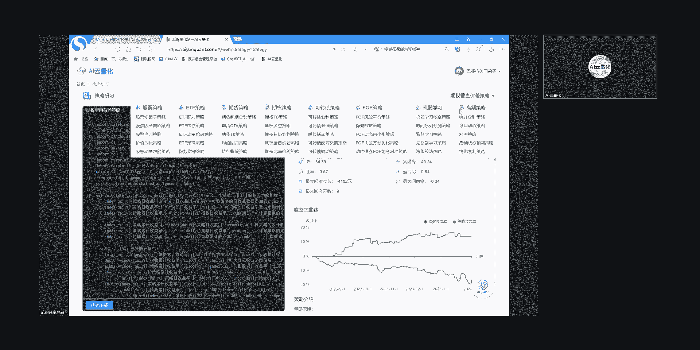
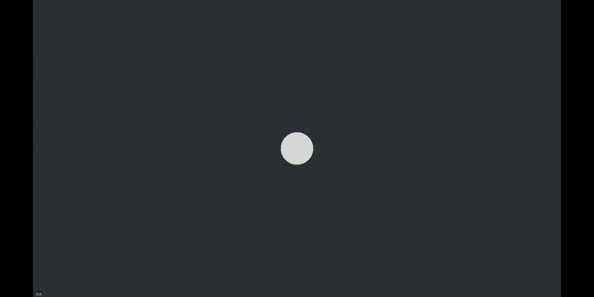
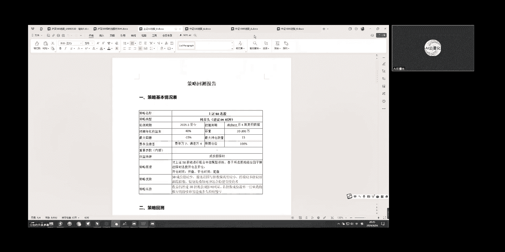
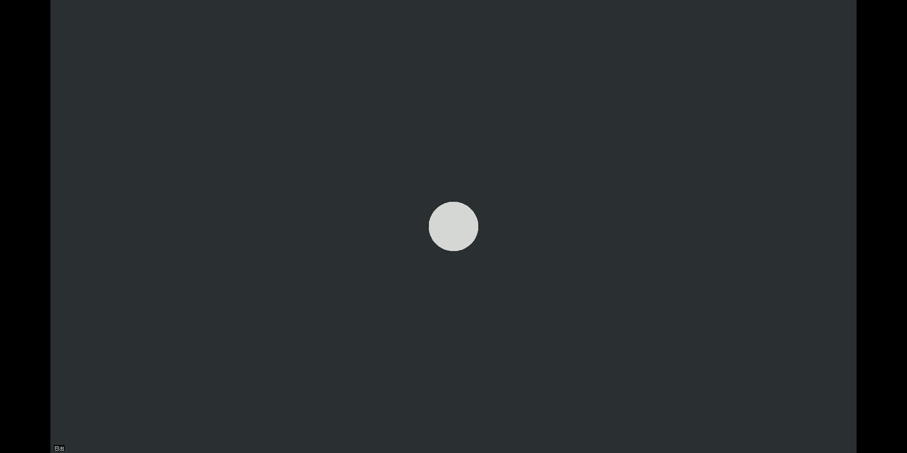
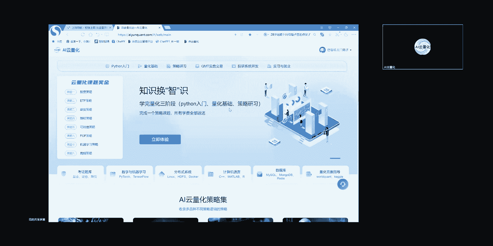

# AI云量化-量化策略代码学习，金融科技人才共建 - P1 - 量化策略学习 - BV1dx4y1n7WB

大家好，我是策略经理日清，现在我来为大家讲解AI云量化平台，关于量化内容介绍主要包括Python入门，量化入门和策略研习三部分嗯，Python在Python入门这这一块内容的话呃。

目前的话就是相对于其他软件，Python在量化研究领域中扮演了极其重要的角色，它主要是得益于它用户的广泛性，还有强大的数据处理能力，丰富的库支持，就比如量化研究常常涉及到的，处理数据的相关的库。

Pandas snapping，还有呃关于算法的机器学习，skyline库，还有计算指标的TLIB库等，以及它相对简洁的语法，使其成为金融工程算法交易，资产管理等领域的首选编程语言。

那么Python入门章节，就主要涉及到以下这么几部分啊，我我大概讲解一下基本啊，这些章节他们的一些的的的一些主要内容呃，前面第一道相关，主要是掌握基本语法中的如变量，数据类型及转换。

就了解了解基本的语法形式及简单的一个应用，4~5官主要是学习数据结构，结合前相关内容，可以了解到他们的特点和适用场景，这对于处理应用数据至关重要，6~7关为啊，运算符。

表达式和控制语句是简单程序编写的基础，到这一关的话，就我们可以实现写一个简单的程序触发，第八关为常用函数模块，可以学习如何定义和使用函数，以及PYPYTHON库里面的内置的一些常用函数。

这对于后期我们写代码，可以提高代码的复用性和可维护性，这章节也可以理解为前面1~7关内容的啊，递进学习，第9~10关呢则是着重于学习量化中常用的，处理数据的两个库，我们开头也讲过的啊。

NP和pandas在量化工作中，通常是使用其清洗数据以及计算指标来用的，第11关就是学习，如何处理程序中可能会出现的错误异常，以及如何在Python中进行文件读写操作啊。

这是进行数据处理和持久化储存时的必备技能，第12关的类对象是结合啊，第八关函数定义，更深一步的将数据和操作封装起来，使得Python程序更容易维护拓展和重用嗯，比如我们在运行策略的时候。

同一份数据啊需要运行多个策略的信号触发，那么这时候就是需要共享很多的数据内容嗯，这时候我们来定义类，就能够提高代码的模块性和灵活性，13关呢则是一个基础的绘图，通常就是需要了解策略的净值。

以及啊与指数或者你自选的标的股，驰啊等对比的走势，最后一贯只是通过前面13关的内容，案例化分解学习，用来巩固拍摄用于量化学习的大致流程内容，整体的Python入门的嗯，各个方面的学习啊。

我们就是学员不仅是可以掌握Python的一个，基本语法和编程技巧，还可了解如何使用这些知识，在量化研究中的应用，就为后续的金融工程，算法，交易和资产配置管理等领域进行量化研究，奠定一个坚实的编程基础。

那么现在我们呃班总你你放到那个量化入门嗯，对接下来我们是讲解一下量化入门的内容，量化交易入门的学习内容，就需要从基础的编程和理论知识开始编程，就我们刚才是推荐了Python。

然后逐步深入到更专业的策略和工具的应用，这一部分内容主要是分为数据获取处理因子，特征分析回撤编程性能优化及策略优化部分，就他具体的啊相关关节这章节内容来看的话，嗯内容中第1~2关是数据获取及清洗内容。

掌握数据的采集，清洗处理和储存知识，是进行有效量化分析的基础，第3~4关为基础的因子介绍，及常用的统计基础理论，因为量化交易更多的是依赖于数学和统计方法，来分析数据和建模啊。

因而掌握高掌握高数就高等数学里面含概率论，统计线性代数，还有相关的其他，比如物理专业等，这种优化理论知识，是有利于后续因子挖掘和算法优化，第五关则介绍常用的因子分析法。

因此分析在量化投资中的应用比较普遍，而且它的方向是多方面的，因子分析的一个好处就是啊有助于简化复杂性，揭示隐藏的市场力量，为投资决策提供定量的支持，然而他的嗯，因此分析也有局限性，包括对历史数据的依赖。

可能的过度拟合，以及难以捕捉市场结构变化等问题，因此对因子使用时，是需要结合符合投资逻辑的市场经验，以及其他分析算法来补充，第6~7关啊，为从简单到复杂的回测的介绍着手。

与我们强调的独立完成回撤能力的啊，回撤编写要素，让学员了解并掌握回撤的一个运行机制，8~9关呢为策略的性能评估及优化要素，策略回测完成之后，用哪些指标来评判策略好坏，以及如何优化策略来达到优化指标。

减少拟合效果，最后一关则是学员在嗯独立回测中，就常常出现的错误，这种就基本是针对小白，小白在写独立回测中会常犯的一些错误，然后以一些案例展示分析嗯，综合而言的话，量化研究是作为一门融合啊，像金融知识。

数学模型，统计分析和计算机技术的一个高级形式，它要求嗯学员是具备跨学科的一个知识和技能，通过以上的这种提到的系统性的学习过程，那么学员能够从数据的基础处理开始，一步步深入到因子分析，策略回测。

性能评估与优化等更高级的一个领域，未来随着量化交易领域的不断进步和发展，而发展，我们是会探索更多新的策略模型，还有风险管理工具，这个时候就是要求我们在学习和实践中，要不断地探索和创新。

以适应不断变化的市场环境，嗯最后我们讲的是自律研习，这类研习，它是进一步强化了独立回测的内容流程，每个策略研习都包含了数据采集，清洗模型，信号触发撮合方式，这里是默认试价单及回测结果。

根据量化投资公司常配置的大类品种，就分为股票含ETF期货期权，可转债ff类策略啊，还展示了量化算法的积极学习方向策略，如时间序列预测嗯，监督无监督学习医生算法，实际应用中还会包括向量机，贝叶斯，决策树。

随机森林等，结合多学科的一个交叉算法，这里还提供了就是按交易频率划分的高频策略，我们通常啊定义高频策略，就是说你用深度数据或者用TIG数据，以及分钟数据的高触发，这些都定义为高频策略策略研习，整体。

它不仅包含了单方向的做多或做空策略回测，也包含了多空一体回撤啊，常用的比如说配对我做多啊，一堆古驰做空，一对古驰有融券的前提下，或者说我做多嗯，IH做空IC等等，还有这种多空方向。

它不仅支持单品种的回撤，如果只做一只股票，或者以一个期货品种，也支持组合框架回撤，如果我一堆股票的买卖等，整个内容流程，对于学员后续策略开发不仅是比较通俗易懂，而且二次加工上手十分便捷嗯。

不过算法各有千秋，特别是想要复杂的下下单算法，如做市商的那种方式，或者说不是很符合投资逻辑的，比如一分钟下单多次，立马撤单又下单等，这种他是是是需要对代码的一个熟练掌握运用，自行编写。

我我讲的内容就基本结束了，谢谢大家聆听，好的好的，那感谢日清的分享嗯，接下来由项目经理星光介绍关于策略编写，数据获取策略回测以及策略平台等事项。

好我结束共享屏幕，喂星光，OK共享啊。

待会秋雨解答一下群里那个同学的问题，就是说因子分析主要是计量经济学模型嘛，这会待会秋雨发群里就行了，呃然后我来说一下今天我要讲的部分内容，就是我们学习的步骤，刚才我们策略研究员已经说了。

就是说我们要先学Python量化和策略研习，一定要按照一定的步骤，嗯东遥把他额把策略研究员拉进群，就是说我我们在掌握Python技能的啊，你拉进群就行了啊，有问题的话，我们都可以发到群里。

我们策略研究员会做解答呃，然后我我们掌握一定Python技能了之后，学习量化基础，也其实这块量化基础就是用Python语言，把经济学的一些东西展示出来，包括数据获取啊，数据存储啊，因子分析啊。

因子统计啊，特征啊，还有回测框架啊，这块是简单的告诉我们量化啊的一个，用Python表达出来怎么表达，然后这一块我们放的主要的部分，是这块策略研习里面的策略案例，我们包含了大概40个不同的品种。

我们里面有很多算法是比较好的，但是它是比市面上一般的，就是说呃常见的双均线啊，一些海归策略稍微好一些，但它并不适用于实盘策略，实盘策略的话，需，就是大家可以在我们这个基础上进行，算法的优化。

还有就是算法的调整，然后进入仿真交易啊，模拟交易啊，然后最后再选有选择的进入实盘交易，这是给大家提供学习的案例，并不是告诉大家说，这些都可以拿来做做交易的策略额，然后下一步讲到就是我们学习的重点。

就是我们不同的同学有不同的短板和优势，我们应该放在我们补短板上，比如说有些同学他是数学模型比较好，但是金融知识欠缺，它可以从我们考证题库啊，从这个量化基础方面来获取，金融方面的基本知识。

然后因为数学的一般会涉及到Python和呃，数学公式，数学模型都有了，只需要增加金融基础知识就好了，然后金融学的话就需要增加这个Python的技能，以及策略研习这一块的案例，然后来达到一定的要求。

然后如果是纯小白的话，那我建议的话就只能从Python基础呃入门，按照我们规划的这个步骤学习学Python，学量化学策略研习，我们学习的目标的话，就是使大家能够达到独立编写策略的要求，独立编写策略要求。

我们后期只要有学员达到策略研习的阶段，就是说前两阶段已经学完，Python的量化已经学完，达到策略研习的时候，我们会安排一个统一的会议，让我们的一个QD就策呃，就技术支持人员来教大家统一的本地化部署呃。

能够本地化写回测策略，甚至说这些策略代码下载下去，能够本地化实现，为什么一定要让我们的人来帮你们安装呢，如果你们不是计算机专业的学生，你们在安装Python的第三方库，在调试的时候会遇到很多困难。

这对于新手小白来说，浪费了大量不必要的时间，我们统一安排好，统一部署好，而且大家在使用Python的过程中，包括pycharm vs code，或者说jubeat hub之类。

遇到任何问题都可以发到群里，我们会有技术人员帮大家统一解答，就是说啊非必要的金融的一些计算机知识，我们有计算机专业的呃，程序员来帮大家解答，然后我们达到学习目标之后，我们需要就说编写独立的策略策略。

那这块我会给大家讲几个，我们策略报告的模板，比如说我们后期去面试的时候，我们需要提交我们的策略回测报告呃，比如说策略模名称，策略类型，回测周期，预期年化收益率，最大回撤就会有一个策略的基本情况表。

然后后面附上他的一个回测曲线，收益曲线会有曲线月度收益啊，策略收益呀，然后我这样的话，他有些是关于股票的，有些是关于ETF的，然后我需要说的就是最容易出成果的，就是做指数类的策略，指数增强啊。

或者指数择时啊，因为如果你作为一个新手的策略研究员，入职了，你写了一个策略，最后大盘涨了，然后你的策略很不幸，然后涨的没有大盘多，或者说跌了，那这样的话对于与客户，第一个对于客户或者对领导交代是不好的。

所以说基本的功能就是，你对指数的策略有足够的了解，就是说当你入职到工作岗位的时候，领导找你要策略的时候，你首先提供的应该是指数类的策略，加对称类的策略，就是稳定的策略会比较好一些。

然后后面的话就是我们面试进阶的要求，我们后期达到就是能够提供，独立的策略报告的时候，我们会统一安排大家进行面试，来入职前的面试，然后最好是两个及两个以上策略类别的策略，就是我们正面会有这个课题。

就最好是能够在这里面选两个或两个以上，如果你只懂股票策略的话，当股票的大环境不好的时候，那这时候的话有可能你入职的机构，要想做期货策略，或者想做期权策略，然后你又不懂，又要花时间来学习的话，就会比较慢。

最好的是当公司的主导的策略，方向发生变化的时候，我们的能力能跟得上公司的变化，然后再一个的话就是最好在学习的过程中，能形成自己的策略库和因子库额，最基本的要求就是能够展示回测效果，就是说能够出回测报告。

能够展示回测效果，能够展示回测效果，然后再次一点的就是再好一点的要求的话，就是能你的策略能够接受仿真交易，有仿真交易的一个交易报告，我们后期大概是一个月到一个半月左右的时候。

大家学习一个月到一个半月左右的一个期间，我们会提供一个策略平台供大家进行仿真交易，但前提是大家能够独立写策略，才能进行仿真交易，如果你没有策略的话，给你一个法律交易平台，没办法部署你的策略。

然后最好的面试效果的话，就是我有实盘交易效果，就说我有哪怕10万，20万或者几10万，一个资金在实盘中运行的一个收益的效果，这样对你从事这个行业找工作是最有利的，就是说如果你有了实盘交易效果的时候。

你的学历啊，你的技能啊什么的，公司可以完全不考虑直接入职，但如果没有的情况，你就仿真交易效果或者只有回测效果的时候，这时候公司还会考虑你的学历，你的工作经验以及其他的要求。

所以说我们希望最基本的是大家都有，大家在进行下一轮面试的时候，能够提供仿真交易的效果，这个就比较好了，然后实盘交易效果的话是特别优秀的呃，人才才能展示呃，我我要分享的是这么多，剩下的交给我们范总来讲了。

嗯好的那个那感谢星光的分享。

接下来我我讲一下我们学习的注意事项。

以及规范要求这一块呃，第一个我要讲的就是我们学习的周期和规划，这块啊我们大概是三个阶段，Python入门量化基础策略研习，那这个Python入门的话大概是两周时间，量化基础呢大概是两周时间。

策略研习这一块呢是一个月的时间，也就是集中学习时间，大概两个月时间就把这三个阶段学会，那第二个我要讲的就是，我们要做到学习过程中的进度可视化，嗯就是说你们在闯关的过程中，每一关每一关大关后面有五道小题。

当你把这五道小题做完以后，你这边可以把这个截图截一下图发到群里面，就是呃你做的不管哪一关，做完以后，每一道都有，然后你在这边截一个图，就是发到群里面，呃这样有利于针对大家的进度。

做出相应的一个会议讲解的安排，以及如果有进度慢的学员的话，我们也好及时跟进好吧，一个可视化的要求，第三个呢要讲的就是，我们学习过程中遇到的问题怎么办，嗯我们首先在闯关的过程中遇到问题的话。

我不建议先你直接就去点辅助答案，我们这边有一个AI云笔记，这个呢是接了人工智能大语言模型的，嗯如果说你们在遇到问题的时候，你们可以把这个问题输入到这个框里面，然后进行一个解答，如果他给出你的答案。

你觉得很满意的话，你也可以把它保存成笔记，保存在这里，等你回头有哦，有需要再回头看的时候，你可以把这个笔记翻出来，那对于他给你的答案呢，你在这边如果还是能看得懂，那你就直接就得到了一个相应的反馈。

如果看不懂的话，这个时候你再点辅助答案，如果辅助答案出来了以后呢，你这边还是不是很明白，或者还需要呃，有问题的话，这个时候我们就可以发到群里面，发到群里面呃，有专人进行解答。

以及周会例会上我们也会有专门的答疑，嗯这是遇到问题的时候，第四个呢我们就讲一下我们的周会时间，我刚才也跟大家聊了一下，就说大家的一个时间的一个安排，我们就把我们的周会定在每周三晚上八点嗯。

我们会安排策略经理，项目经理进群给大家做集中答疑以及讲解，那如果说额当天如果有比如说遇到节假日，或者说有大大多数人的时间上有冲突的话，那我们可能推迟到九点这种情况，那所以就是每周三的八点。

我们就为我们的一个例会和周会。

这就是以上我要讲的四点好，那感谢大家的参会。

