# AI在金融界的热门应用【Python金融分析量化交易】从基础原理到案例实战，同济大佬手把手教学_亚马逊股价预测＼股票池筛选 - P41：2-Alphalens工具包介绍 - 迪哥AI课堂 - BV1zK421v7e1

然后一会儿啊我们在做的过程当中，而不是在我们这个notebook当中去写啊，是在我们的平台当中啊，平台当中去写，一会儿大家演示一下在平台当中啊，咱们怎么写，因为这里啊咱想去拿一些指标，太麻烦了。

咱一会直接到平台当中去做，让我先把这个再介绍完，然后咱们就写代码，还有个东西啊，就给大家介绍，就是叫做阿尔法LZ啊，这个东西很好用啊，相当于就是接下来我们所有的计算操作，以及所有的画图操作啊，你省事了。

你不用自己去做了，有现成的工具包帮我们去完成。

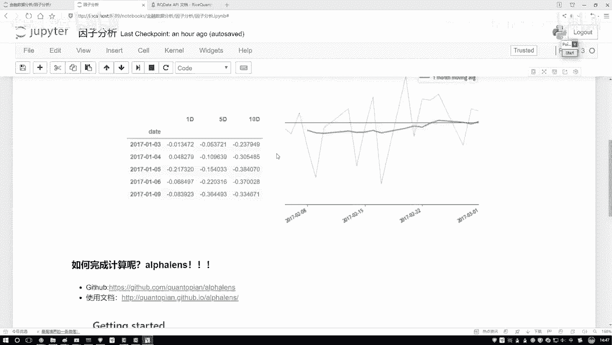

我们点开看一下吧，点进去看一下，这个是他GITHUB的链接啊。

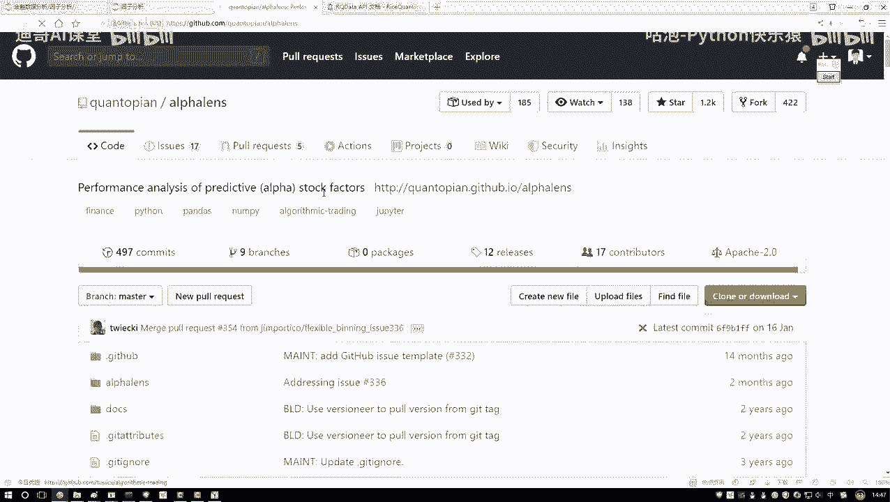

这个阿尔法，然后呢他就是专门去做这个因子分析的，但是它里边功能可能是比较多的，呃咱们这节课可能给大家讲一些最核心的，然后剩下其他的，大家就是可以自己按照自己的喜好了，然后大家用这个工具包啊。

就是第一步啊，你需要去先装一下，装这个工具包其实很简单，你看他这个我这个链接给大家列出来了，一个是他GITHUB的一个网址，一个是它的一个使用文档，在他GITHUB当中啊。

他会告诉你怎么样去安装p IP store一下，说不就行了，打开你的account permit里边pip install一下啊，这就完事了，安装非常简单，但是大家其实你也可以不用去装了。

因为一会儿我们是用人家现成的平台，软件已经帮我们装好了，如果大家想在本地玩，那你自己装一下，然后装完之后呢，我建议这样就是可以看一看它的一个使用文档，然后他的一些sample建议大家看什么。

你可以看一看，这里它有很多个小例子吧。

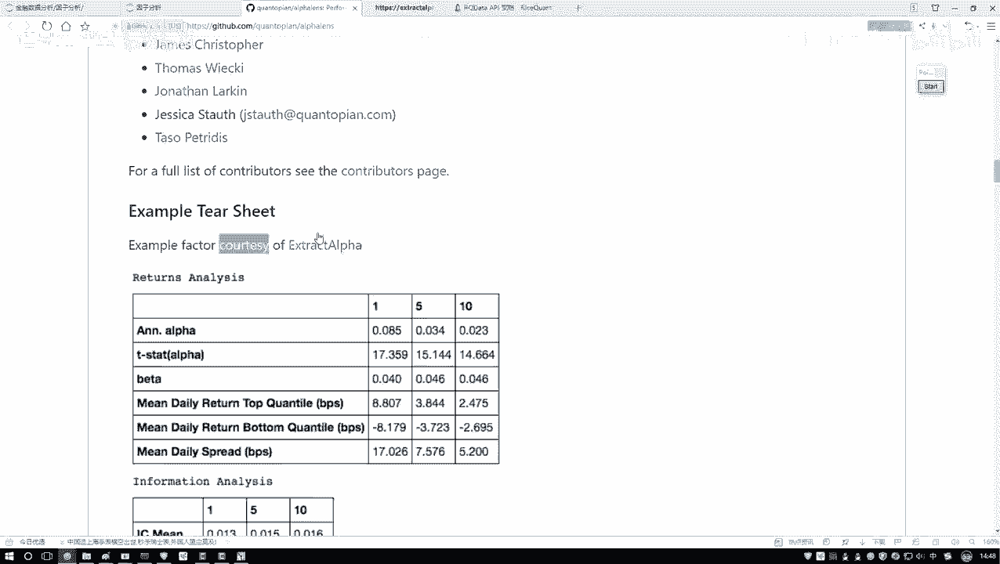

你点进去之后啊，这一块啊，哦哦不是不看这个。

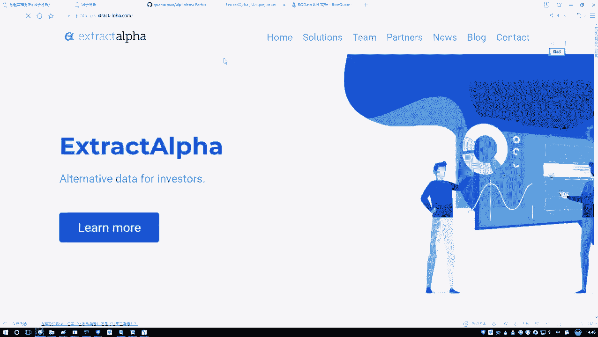

看这里看这里有一个我找一找。

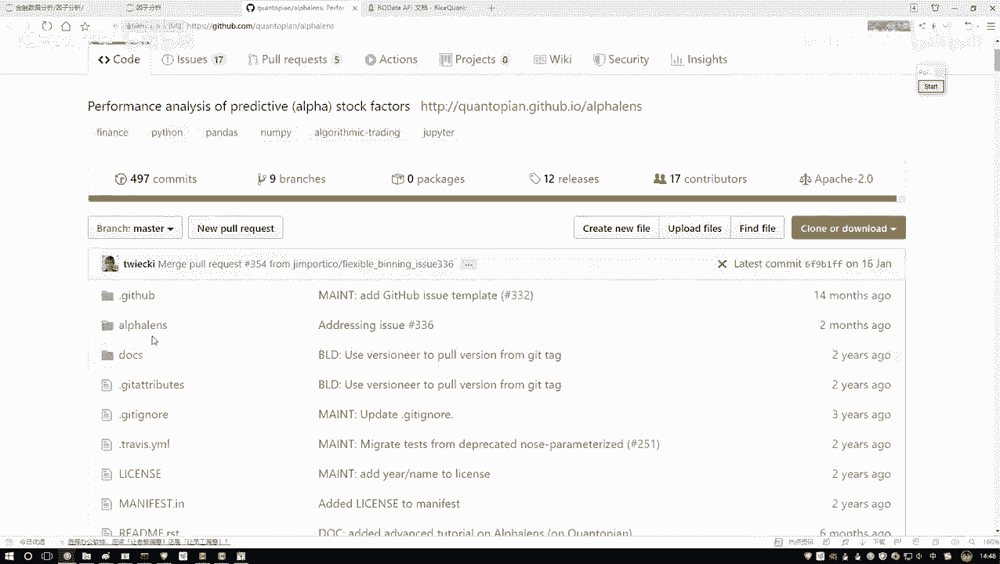

有一些文档在这些数据文档当中啊，它会有哎，不是这里在他的，我看看这个啊。

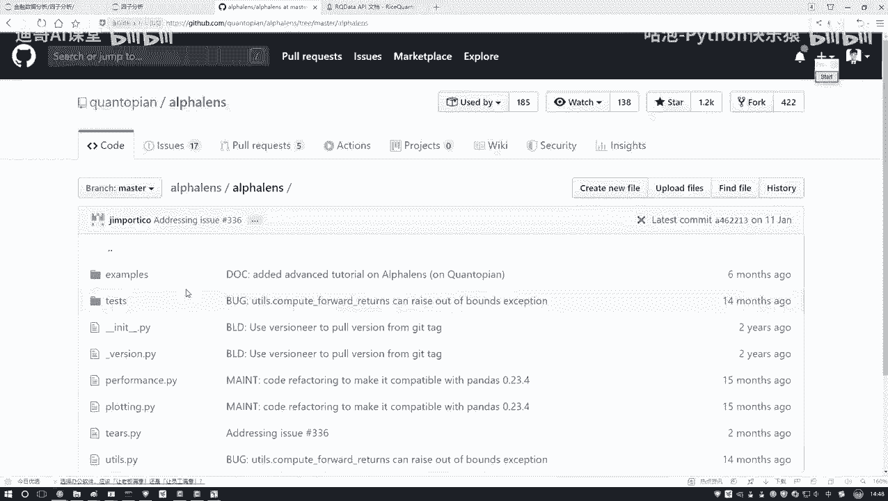

也三跑这里了，在这里它有一些呃写得还不错的一些示例文档，相当于啊就是教你一些诶最基本的使用方法，然后大家如果说你想看这些文档来，去简单学一下也行，或者说一会听我讲也行，我这些东西哪来的。

基本上所有东西都是参考人家的一个，官方的小例子啊。

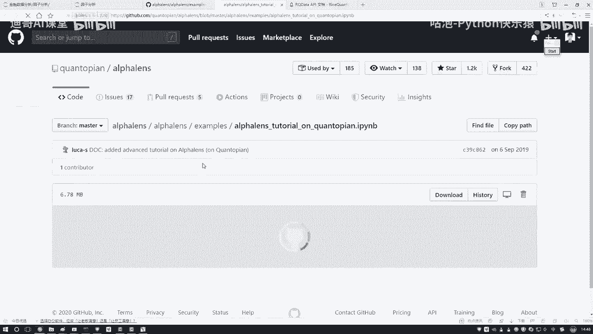

看一看他怎么去做的，然后我照着人家学一学，我再怎么给大家去讲啊，其实啊就是我觉得最好的学习东西，就是官方文档，还有一些官方的小例子，这里啊他介绍的比较详细，咱们内容啊相当于就是把他给你介绍的。

到时候给大家去说啊，这些图什么意思，把他给你介绍这些所有东西啊，咱们给大家总结起来了啊，然后咱们一步一步照着去做，这里它有一个非常详细的小例子呃，我不给大家一个去读了，读的太花太太花时间了。

你想深入去学习，你可以去看一看他的一些具体的一些描述，如果说呢你想只唉只想去做，咱们课程当中要完成任务，看我给大家准备了一个小例子，给大家准备的案例就行了，这个是他的一个文档里面教程还是不错的。

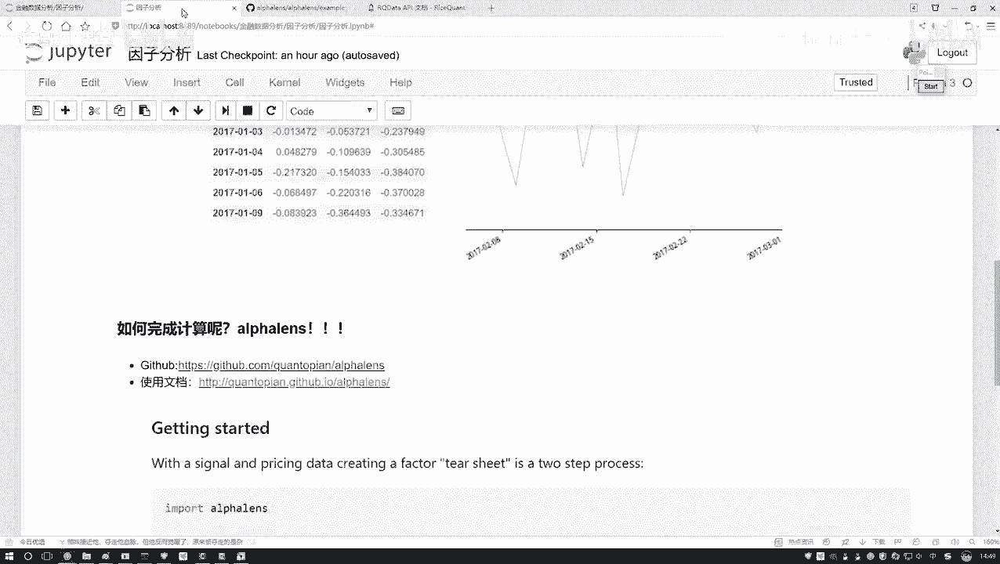

然后呢第二个还有使用文档，使用文档就是它的一些API说明了，点进去之后你可以看一下，在这里诶它会有一些简单的介绍，然后下面还有一些呃就是基本说明吧，到这里你想看他的一些各种各样的API。

其实我们主要的就用这几个，你想看的时候，这块有些说明啊，看他听他说也行。

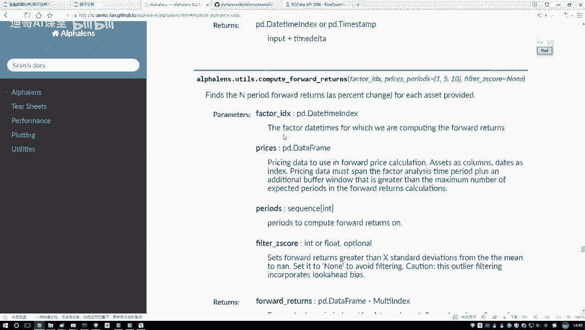

然后一会儿听我说也行啊，这是人家的一个文档，然后大家用的时候啊，这是唉先把这个简单看一下就行，知道有一个叫阿尔法learn的东西，帮助我们去计算啊，我们要的比如说这个C值，比如说我们要画这个图。

这个是一会儿啊咱要用到的一个工具，然后介绍另一个呃，还有工具啊，在这里在这个这个就是进入到我们pi当中了吧，在这个平台当中啊，咱之前是不是说我们去新建一个策略，然后我们去跑一些回测啊。

啊今天咱们先不用跑回测，因为我们现在要干什么，对我们数据来做一些分析，对我们数据做一些处理的操作吧，在这里啊咱们来看这块啊，有这个有叫做一个投资研究啊，就是左在左边的时候有个东西叫投资研究。

再来点一下就进入到你的策略当中，然后这块有投资研究，咱不跑回测了，所以说点进来点开一下，看一看，点开之后呢，他这块哎，你看像不像跟我们那个notebook启动的画面一样的，好了，这里我说我新建一个。

新建一个python3，新建一个意思啊。

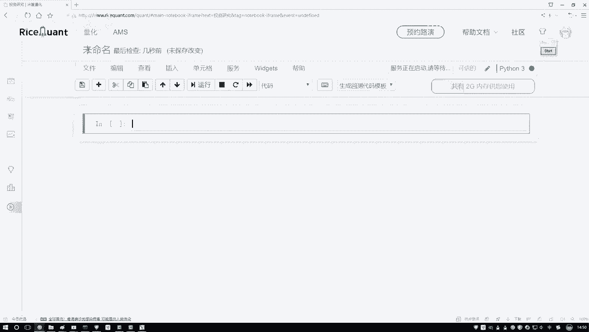

就是说这里哎你去啊，在人家的一个服务器上去写啊，因为你在自己电脑上去写，你数据获取不了啊，必须在人家服务上去写行了，咱俩写一下吧，这个我们就叫做一个因子分析好。

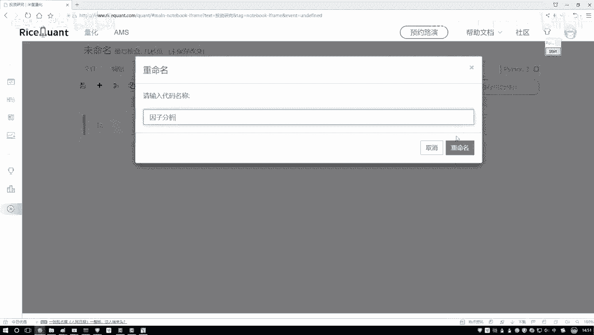

然后重命名一下，在这里呢我们需要一会儿呃，就是一会儿咱们代码在这里写啊，到时候我会把代码拷贝给大家一份，到时候大家用的时候啊，你可以去上传到，或者是你复制到你的这个平台当中。

或者说照着咱们视频S1线也行，这个是一会儿啊，我们要用到的一个写代码的工具啊，其实说白了就是在人家服务器上去写啊。

