# AI在金融界的热门应用【Python金融分析量化交易】从基础原理到案例实战，同济大佬手把手教学_亚马逊股价预测＼股票池筛选 - P60：3-KMEANS迭代可视化展示 - 迪哥AI课堂 - BV1zK421v7e1

那咱们再来看一下，就是对于这个k min算法它的一个聚类的时候，它的一个可视化效果是长什么样子，根据啊，咱们刚才给大家讲那个流程啊，大家可以想一想，我这个KP算法它的流程长什么样呢。

这回咱们再来实际的啊，再通过它真实的聚类的时候。

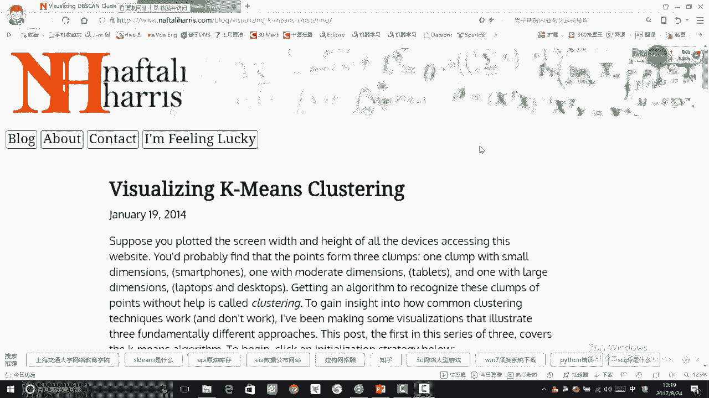

它的一个状态来看一下，那这个界面就是一个老外啊。

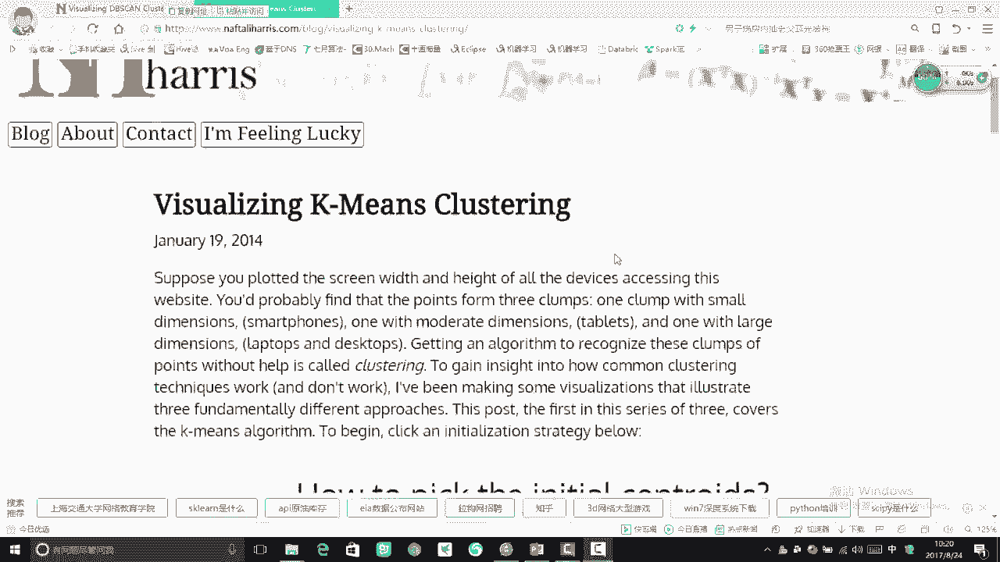

做了一个网页版的一个k means，在这里呢他可以做一些可视化展示啊，咱们先来观察一下，然后这个东西怎么用啊，怎么用，到时候网址我已经复制到这个PPT当中了。

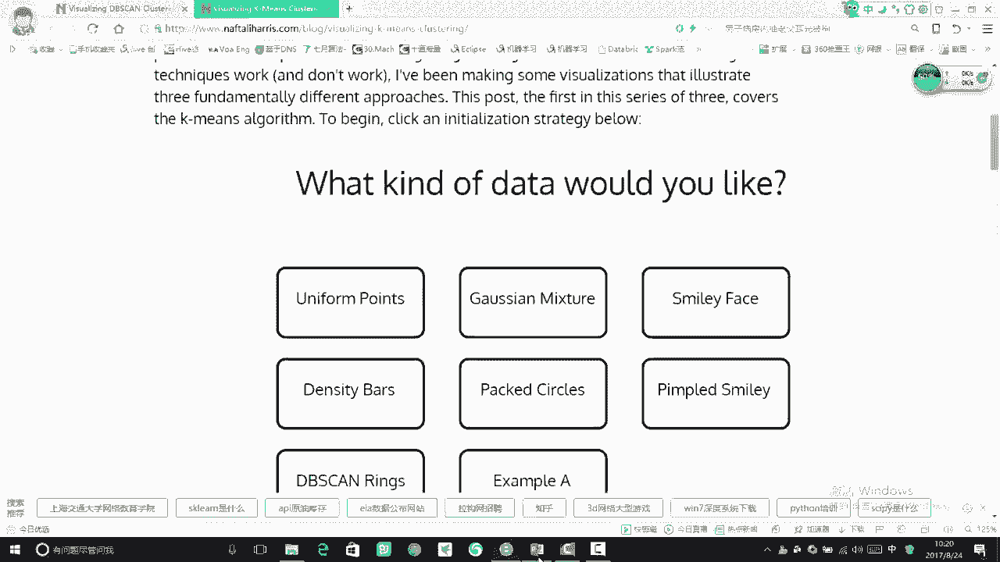

然后到时候把PPT发给大家，大家可以直接登录那个网址，可以看一下k miss。

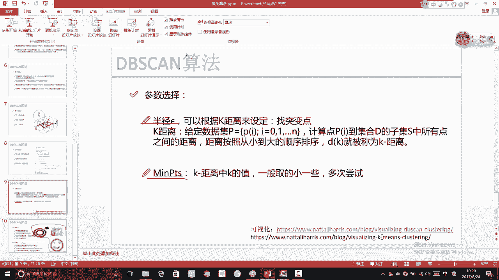

还有DBC啊，它的一个可视化的一个效果，在这里啊，就是我们可以选择一个数据集啊，比如说咱们随便选一个吧，选这个数据集之后啊，然后在这里它有一个选项。

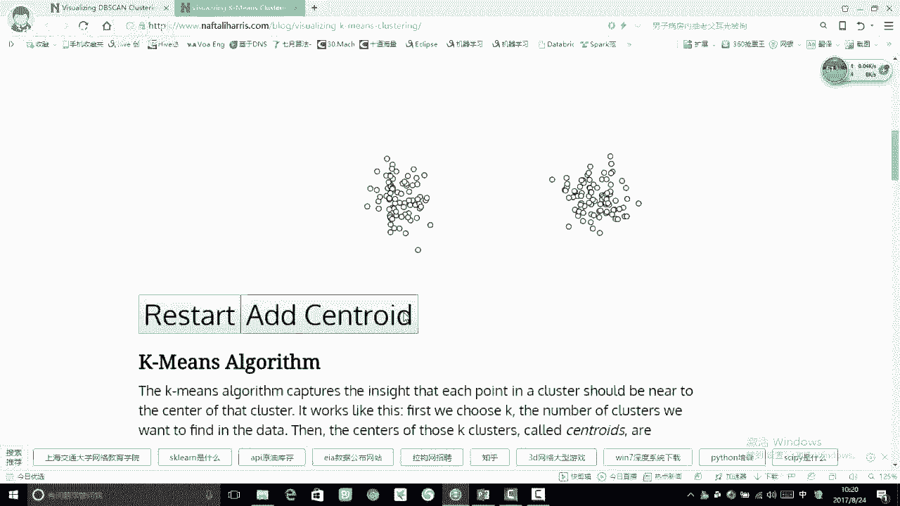

这个选项都比较简单，这个选项啊就是说I的一个就是一个中心点。

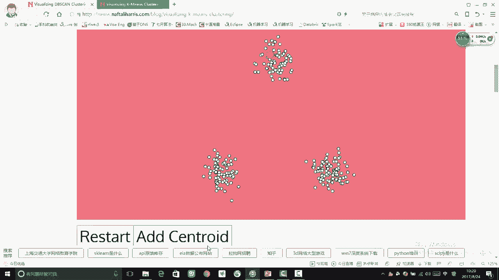

然后呢这里啊我们看大概是三个类别吧，所以说第一个点，第二点，第三个点，这三个点都是随机的，我就是添加上去的吧，所以说啊咱们第一步是随机添加了三个点，然后呢我勾一下，就是我去进行一个迭代了。

咱们来点看一下，我勾一下，就是说现在呢嗯在我这三个点看来啊，就是哪些点是属于绿色的，因为哪些点离绿色比较近，都算了一个距离之后，我认为啊这些点都是属于绿色的，然后哪些点属于红色的，哪些点属于蓝色的。

这是我第一步吧，找出来三个中心点，然后分别把它们进行一个归属，然后要干什么，我去更新我的中心点吧。

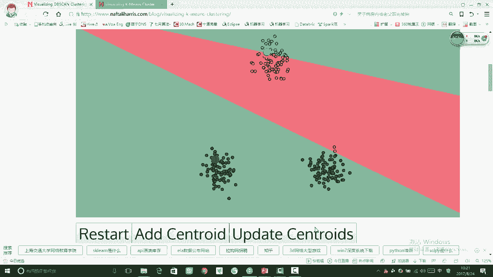

咱们来看更新一下，更新中心点之后啊，我们来看就是现在是不是嗯，中心点发生了一个变化了，中心点发生了一个变化之后，我们要干什么，中心点怎么变的，基于我当前列数据去变吧，中心点发生了一个变化之后。

然后呢我给这个点重新的安排一下吧，咱们再来点一下，重新安排一下啊，然后这块他们看一下，原来这块是有一个红色的吧，现在变成绿色了吧，然后呢这三点完之后，我再更新一下我的一个中心点。

再更新中心点变到这个位置，然后再去啊安排一下再更新，再安排再更新再安排，那现在大家可以看到一个结果什么样，我们现在结果跟我们目标是不一样的吧，我的目的是希望把这三堆，这明显不就三对吗，上边左边右边。

但是呢他虽然说是一个三堆，但是我给它锯成几对啊，我给锯成两堆，我在无论怎么的点下去，你看它更新了吗，不更新了，饱和了，这就结束了，所以说啊K面算法最大的一个问题在哪里啊，他对初值的影响是非常非常大的。

一个初始值做不好，它会使得你最终结果也做不好，这个就是给大家证明一下km算法，它的一个初始值是很重要的，也就是说大家在做k miss的一个实验的时候，咱们可以做多次，然后取它的一个平均值。

因为每一次都是随机选值，每一次得到一个醋都是不一样的，这个是K命算法最大的一个问题，之前啊就是之前一开始的时候，几年前我是这么认为的，我认为k means啊，就是无论他因为是不断迭代下去吗。

我认为他就是无论是怎么选数值，最后迭代完肯定都是一样的，然后我拿那个sk learn做实验的时候，就发现诶，为什么每一次差异有这么大呀，每次差异其实有，因为连数据集比较难，每一次差异都比较大。

所以说当时我看完之后，我就反应过来了，因为初值啊会对结果产生一个非常大的影响啊。

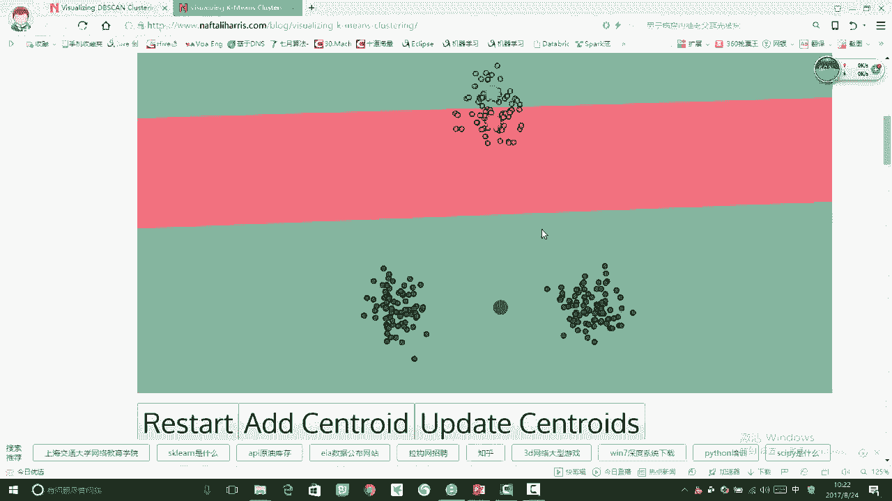

只有这样一个例子，咱们再restart一下，然后重新来观察一下。

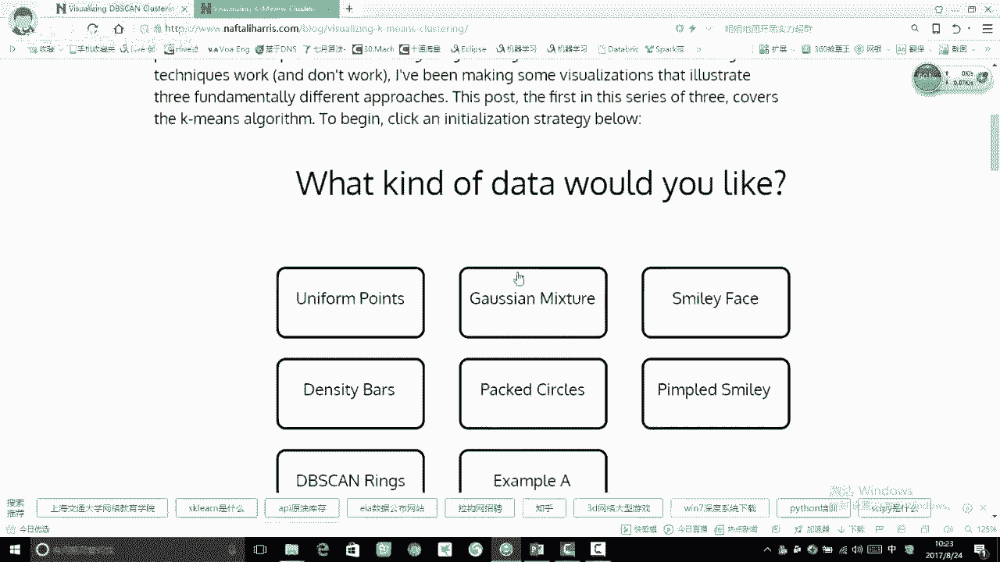

还是要这样一个例子，然后我随机的还是选择三个初始化一点，假设说哎呀这个vs2点其实也不是太好，咱们来看一下吧，如果说这三个初始化点它的一个效果什么样，咱们勾一下更新啊，resign更新更新诶。

这个就可以吧，这回就把我们三个数据点进行了一个更，新完之后就得到了这三个醋吧，也就是说啊，我们来看跟刚才的结果是不一样的吧，不同的一个初始点，对我的结果会产生比较大的影响啊，现在就不能动了。

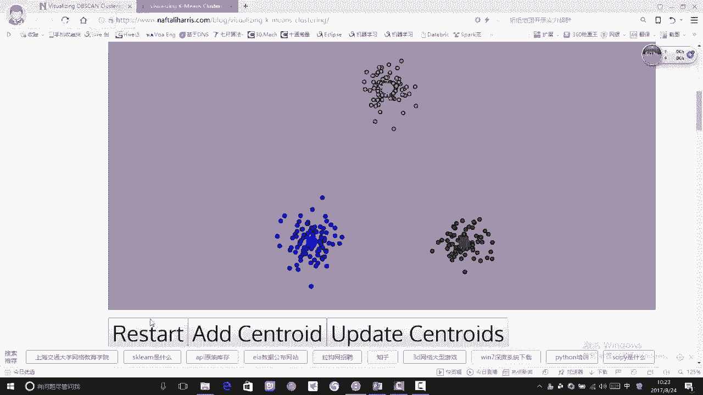

然后再start一下，咱们再来看一遍，再玩一下这个东西，然后爱的三个点。

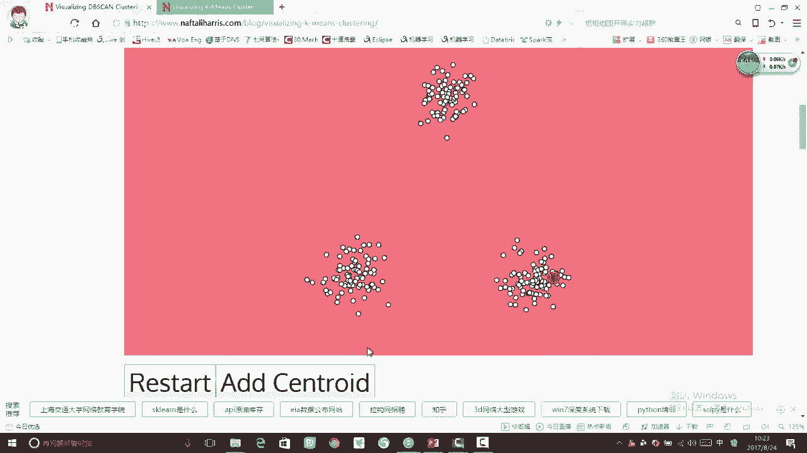

这三个点来看一下吧，这个应该肯定也是可以的，这个勾一下，然后update一下，再go再update，这就是我得出来的三个点，基本情况下它都会得到一个准确的，但是有些时候它的一个效果。

可能还会根据初始值的不同发生一个变化的。

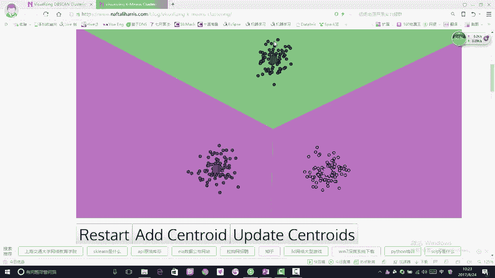

然后咱们再来看一下，就是我换一种点吧，我换这个点来看一下这个点当中啊，我在就是一个笑点嘛，咱们来看一下，对于这种比较不规则的一个数据啊，它能不能够给它锯出来一个结果的。

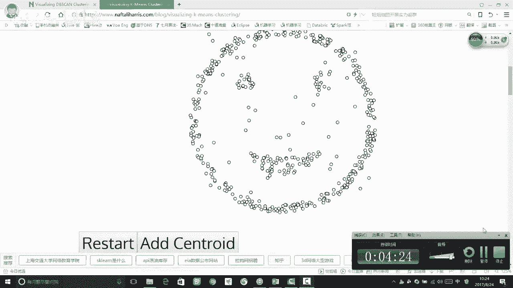

咱们来看我一看，一共一共几个，一共几个错啊，我大致想一想。

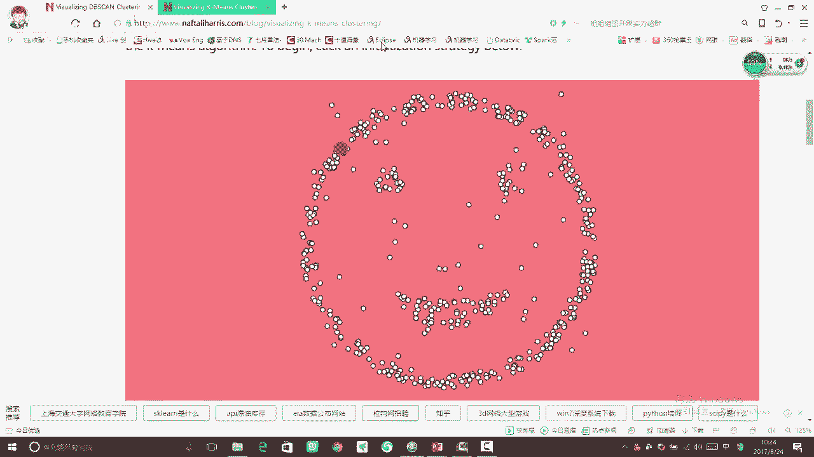

外层是一圈，然后两个眼睛，一个嘴一共有四个吧，咱们加上四个点啊。

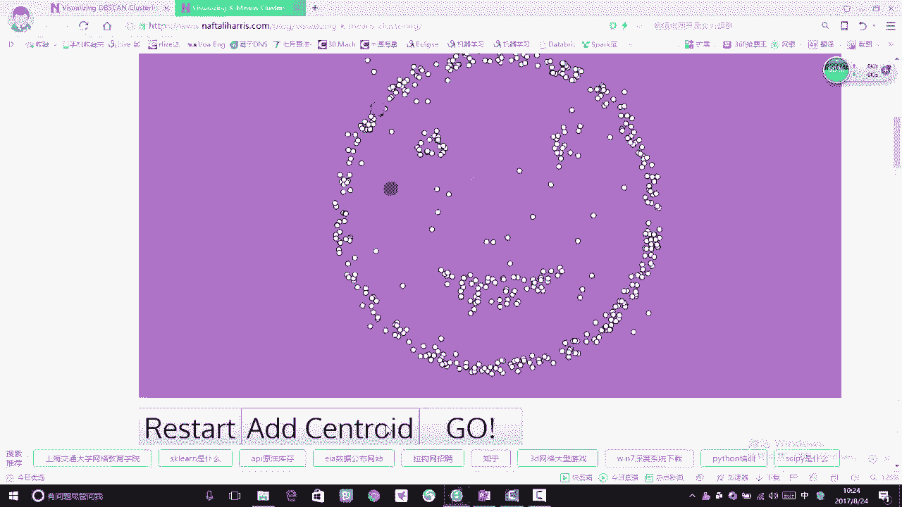

1234啊，加上四个点，然后去勾一下吧，然后去更新，然后去重新的安排一下，然后更新重新安排更新，重新安排更新重新安排，咱们来看啊，就是聚类结果基本上到这就差不多了。

因为k miss是基于距离进行这样的一个聚类嘛，所以说啊现在只是进行一个微小的改变了，那我们先来看这个聚类效果怎么样，这个聚类效果是一般的吧，因为我现在聚类完之后啊，对于每一个点来说嗯。

它属于的一个类别跟我想象的不一样吧，我想象的是呀，嘴是一个两个眼睛是一个这个外层圈是一个。

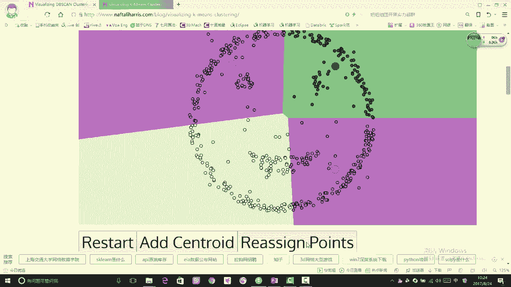

但是呢他没有达到这样一个效果，这个是跟初始值有关吗，跟初始值没关，咱们再来运行一下。

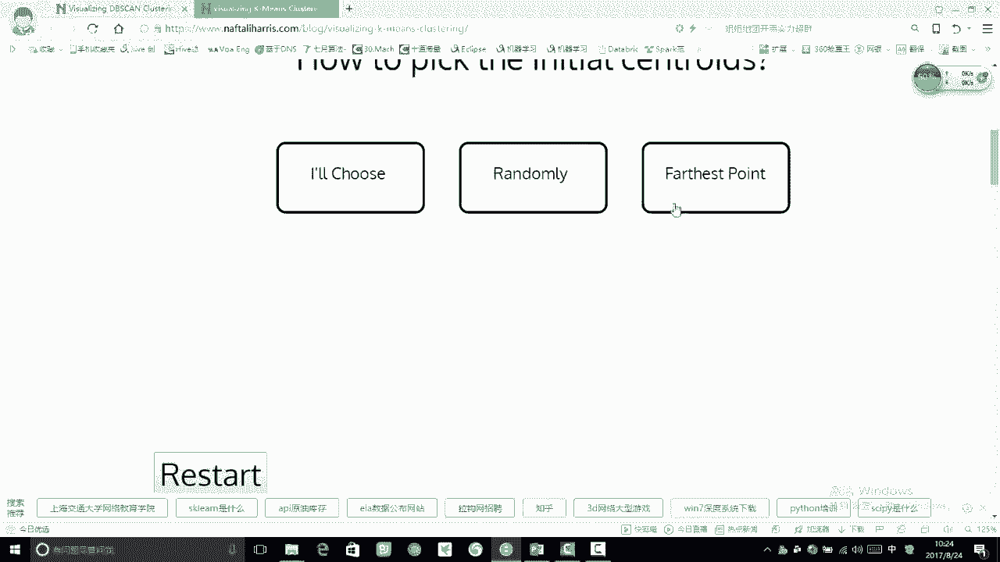

我们再来看随机的加上四个点，然后无论你怎么过下去啊，基本上都是这样的，我们来看就是现在虽然说四个点，初始位置改变了，这个醋也改变了吧，原来这个醋不是这个样子的，现在这个醋又变化了吧。

也就是说对于当前这个数据集来说啊，初始点不同，这个醋完全就变了吧，好像就像旋转了一个圈儿似的，他这个醋完全发生了一个变化，这个就是说啊对于一些一些不规则的点吧。

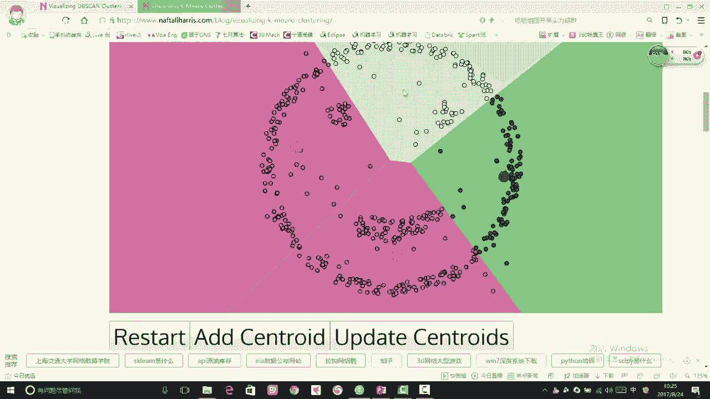

我们可以面试做起来的效果不是那么好的，咱们再来随便找一个吧，再来找个这个东西，这个东西我来看一下这个东西，问题来了，现在最大的问题就是说哎呀你说它是几个醋啊，不好说呀，你说它是三个醋也能分。

你说这四个醋也能分五个，六个甚至八个都是可以的吧。

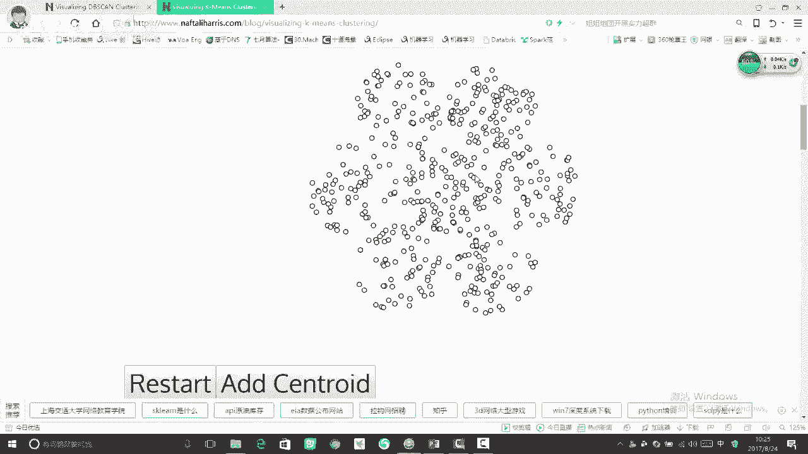

那咱们来看当我三个出的时候怎么样，这是我三个错的时候，然后去更新更新更新啊，大概可能是得到这样的一个样子，这是我三个错的时候，哎看起来好像有点这个意思啊，哎左边是一个右上角。

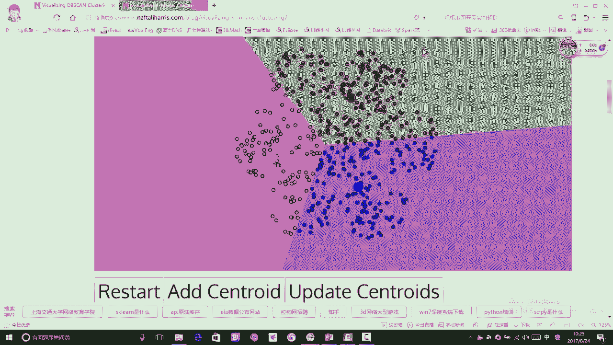

然后右下角又是一个，那当我们来看一下，当我这个东西啊，我是一个就是还是这个东西啊。

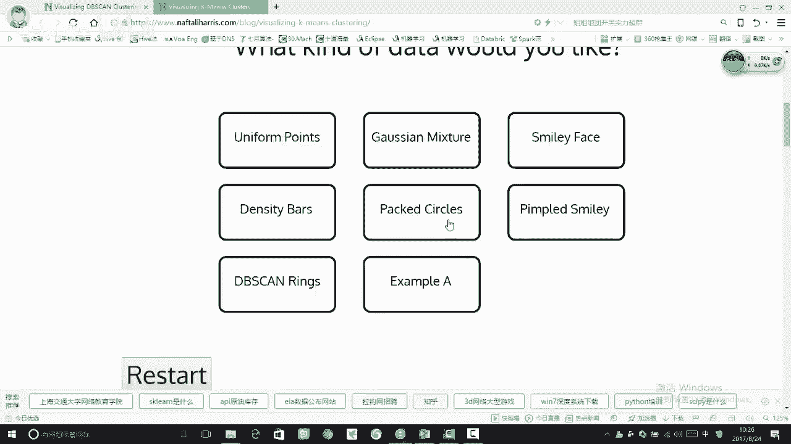

当我醋多的时候，它又会发生什么样的变化，当我是1234，我看一下123456，我再来一个吧，再来个时候咱们来再去够一下，再去看一下，当我是多个醋的时候，好像也能划分出来这样一个醋吧，也是有意义的。

那也就是说对于KB来说这样一个数据集，哎呀我到底分成多少速合适啊，分成多少个簇，分成现在123456分成六个醋，看起来也没有什么太大问题啊，那你分成八个醋好像也没那么大问题啊。

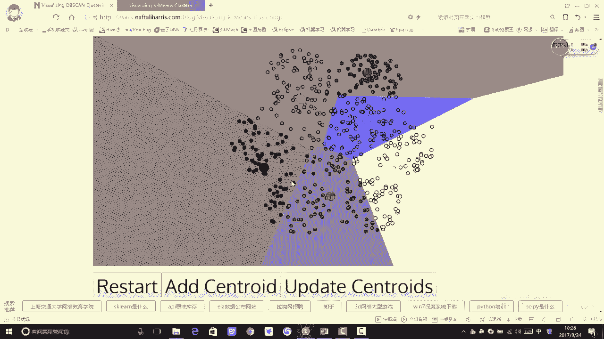

那到底分成多少多少个啊，这个就比较难去看了，所以说对于当前的这样的一个任务来说呀，嗯我们是很难去指定这样的一个K值的。

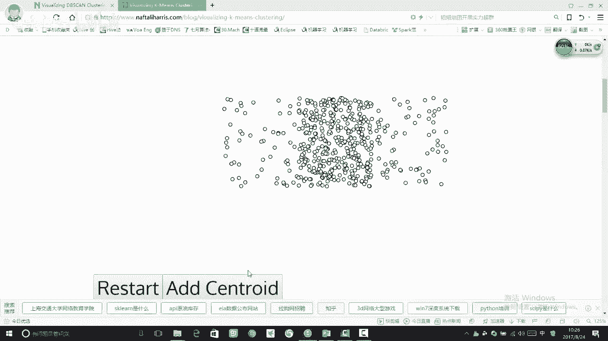

这里我比如说我随便指定三个吧，可以分成，我们看一下它会分成啥样，跟我想象的不一样，我想象的是左边是一个，中间是一个，右边是一个，但是呢它是基于这种方式进行一个划分的啊。

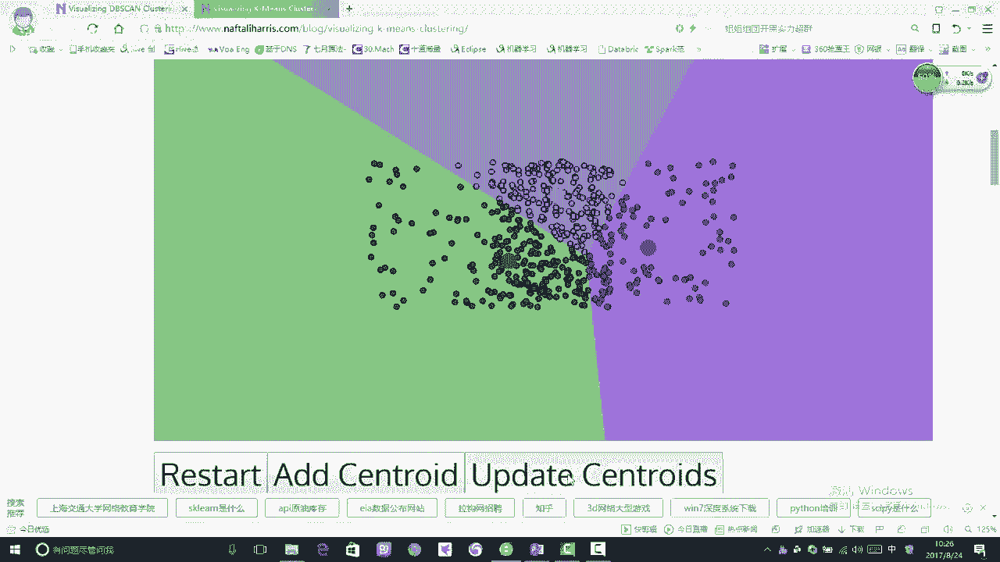

现在就更新不动了，再玩一遍哈，这个网址到已经发给大家了，到时候大家都可以自己玩。

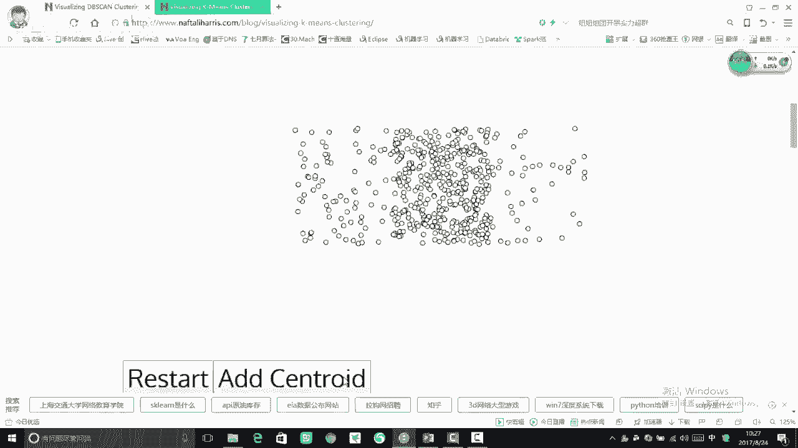

还是来三个点吧，再购一下啊，这个完之后又变成这个样子了，所以说啊大家可以看到，就是说这个k means，对初值的一个影响是非常大的，不同的初值聚类完结果都是不一样的，当你想使用这个聚类算法的时候。

你也得想一想，就是嗯当我用这样一个聚类的时候，他对我初值竟然这么敏感，我是不是得做个十组八组的，然后取一个平均啊，就是说对于每个点它这次可能是绿色的，下次别出蓝色了，下次变成红色了，我可以取个平均啊。

k miss我们要做多变的k means。

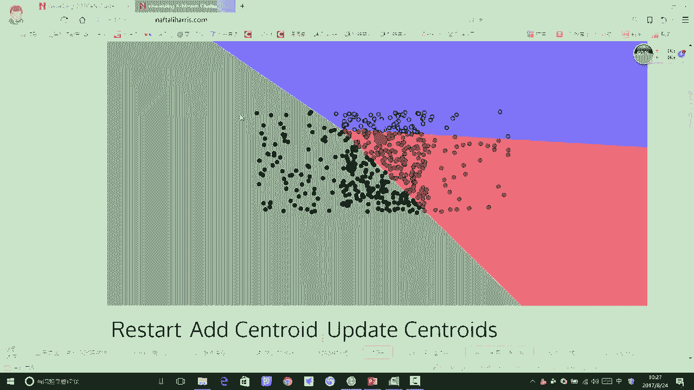

对初值的一个稳定性是非常差的，那这个就是给大家看了一下。

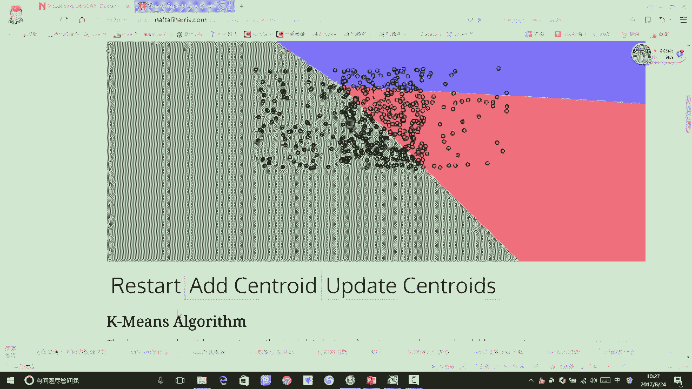

我们这个K面算法，它的一个可视化的一个效果是长什么样子的，然后这里啊他还有一些其他比较好玩的东西啊，这个就给大家一个展示了。

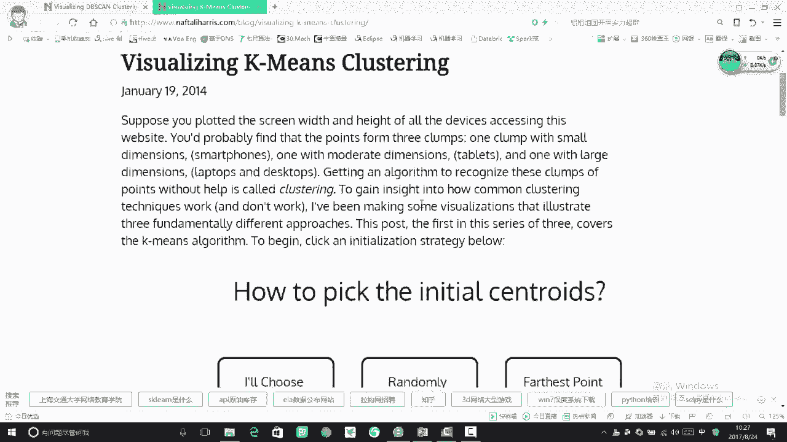

这个也是个老外啊，给给大家做的这样的一个可视化的一个展示，然后下面还有一个k means的介绍，基本上跟我差不多的对，反正都是英文的，大家感兴趣可以看一下，我是觉得这个可是画的比较好玩的。

给大家来演示一下。