# AI量化中最好用的排序学习算法：StockRanker的多模型组合 - P1 - BigQuant量化投资 - BV1DS421X7dV

今天的主题是基于star cranker的多模型组合，并且策略一二下单金额，分别总金额的40%和60%呃，如何写一个组合策略，策略一和策略二都是基于STOLER模型，且策略一二下单金额。

分别是总金额的40%和5%，60%呃，这边的话我写了一个demo，我们可以看一下这个demo。

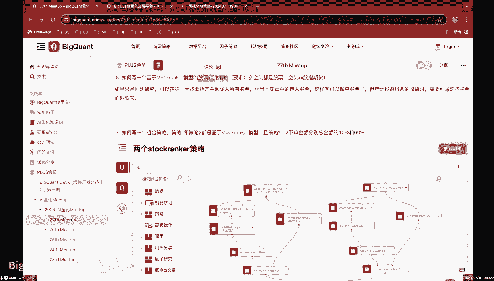

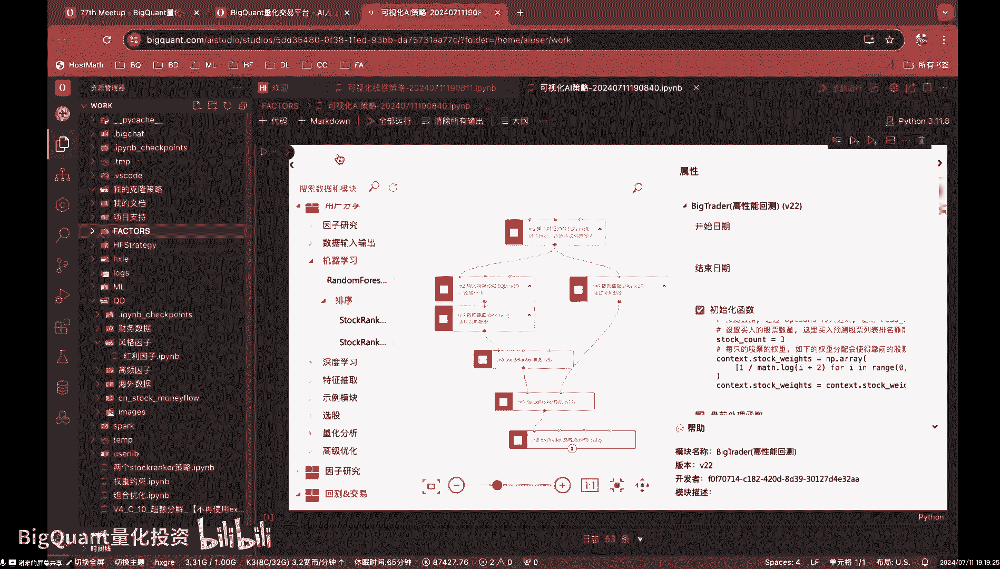

额这就是我写的一个简单的demo哈。

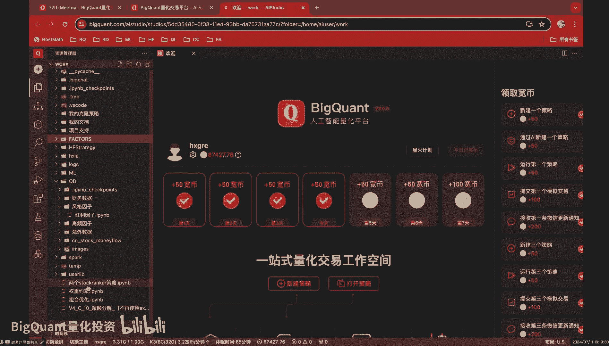

其实这个思想也比较简单，因为我们只要嗯只要知道，其实10store rank哈，就是这个store这个诶这个STORANK模型，这个模板策略的话，其实他最终输入过来的这个东西就是一个data free。

我们可以运行一下，他其实最终输入过来的这个这个东西，就输出出来的一个输出给我们这个回撤引擎的，就是一个data free，它的这个data free呢就是呃标注了每天每只股，每只每只股票的一个得分。

那么我们只需要相当于你这里有两。

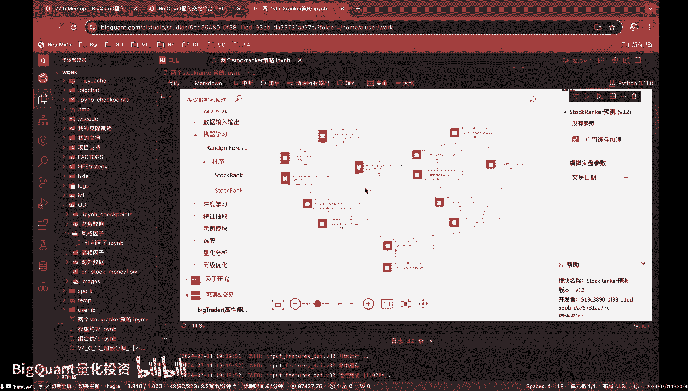

我们只需要构建两个这样的一个STO端和模型，跟它相关的一个输出的一个得分。

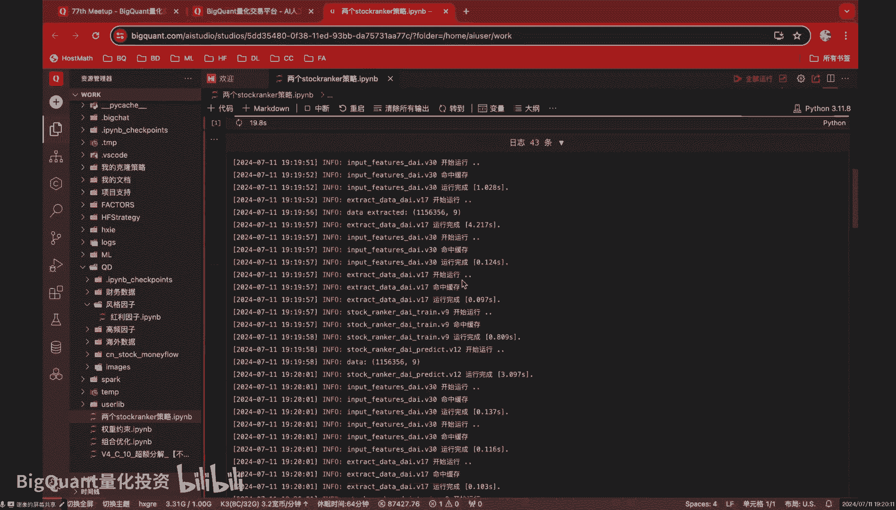

然后把这两个东西结合起来，喂给我们的一个big trader，这个回车引擎，然后具体的操作的话，我们在这个trader里面再去给大家细聊。

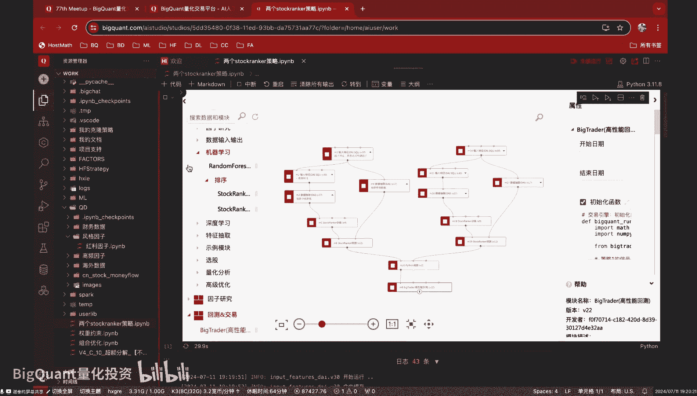

我们先看一下呃，整个的一个这个逻辑。

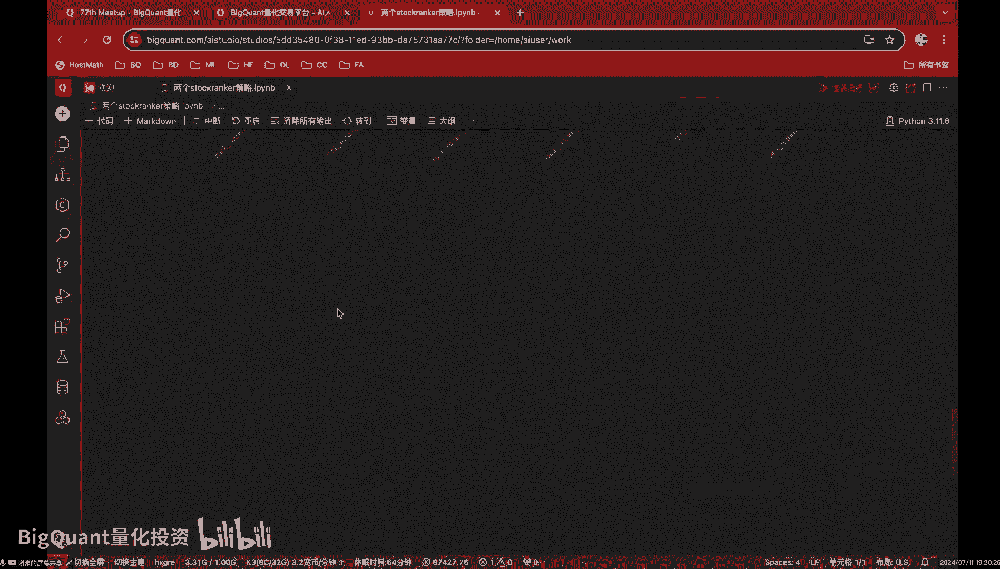

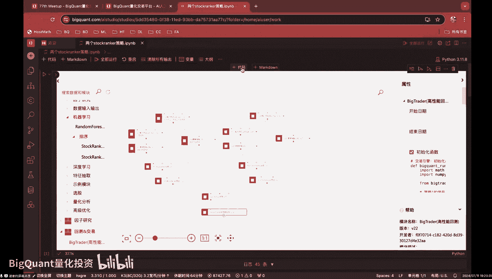

呃比如说这个的话，我就是把额那个我们的模板策略，把它的因子分成了两个部分，这个是第一个，相当于是第一个第一个策略的特征。

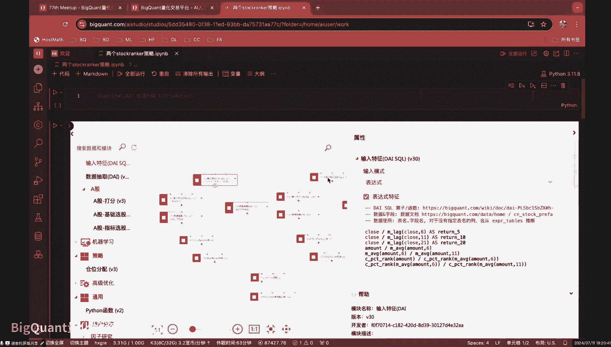

然后这个是第二个第二个策略的特征，它是两两个特征，两个不同的特征集的。

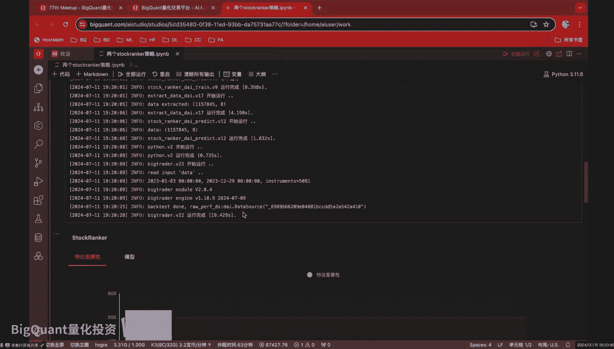

我们来看一下这个第一个策略，这个第一个STOLER的这个这个输出值。

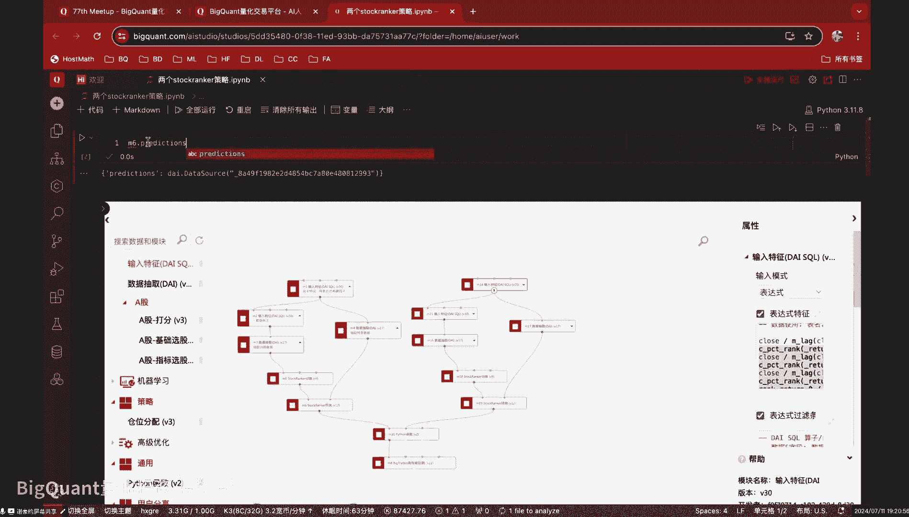

那么这个就是我们第一个策略，相当于我们第一个策略，给每只股票的一个打分吧，比如说1月3号这支股票可能排名第一，他的分数是这样子，然后这个是让我们看一下D这个19，这个模块的输出值啊，这个就是第二个策略。

相对第二个策略的一个额一个得分，然后包括我们后面会基于这个得分。

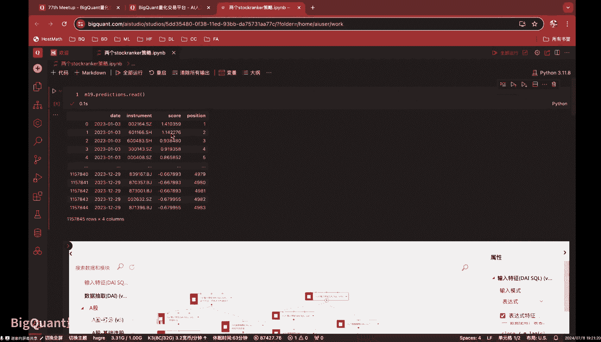

去进行一个买卖操作，然后我们把这两个data free哈，呃用这个Python函数进行一个封装，封装成一个相当于封装成一个东西，就像我们有相当于这前面这是第一个策略，然后这是第二个策略。

然后我们把第一个策略的输出，跟第二个策略输出合在一起，然后丢给我们的big trader引擎，这样的话在big tree里面再去把，对不对，这两个呃这两个输出进行不同的处理的话，就可以实现我们刚才说的。

相当于两个策略合在一起的这样一个操作，我们看一下这个Python函数其实很简单，那就是把我们的呃两个策略，两个store rank的这样模型的输出值呃，拼在了一起，拼成了一个一个字典，然后这个字典的话。

这个是第一个模型的输出值，看吧这第一个模型的输出值，然后这是第二个模型的输出值，然后这个的话是我们回撤的时候，会用到的一些参数，这个是开始时间，结束时间跟那个我们的股票池。

然后我们后面的话就相当于把这个，把这个这个字典丢给了我们的回撤参数，然后回收参数在回车引擎里面的话，我们在基于这两个相对，你把它这你把这两个这两个data，他free这两个数据集当做策略。

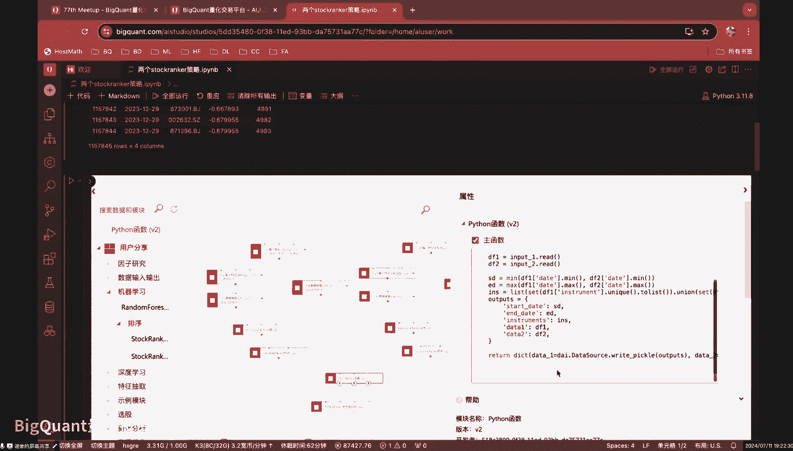

然后再基于这两个数据集进行一个操作就行了，我们看一下我们具体怎么做的，然后我们在我在初始化函数里面呢，相当于比如说这个就是我们策略一的信号是吧，我把这个context它的一个信号信号。

这个数据啊赋予给这个变量，这个是我们策略二的型号，然后我们设置了两个变量，这个位置一就是我们策略一的嗯，刚才说的刚才说的那个40%，它的金额只是总只是总金额的40%，但这个是策略二的总金额的40%。

那这个的话就是我们相当于把相当于得到了，策略一的呃信号跟他的跟他的那个那个占比，然后这个的话就是我们策略二的信号跟占比，然后我们在每天交易的时候呢，其实就记就是去处理这两个data free。

我们看一下，那比如说每天的这个K线交易里面呢，我就比如这个的话，就是我把额信策略一的信号的，当天的数据拿出来，然后这一行代码就是我们把策略二的，当天的那个预测的那些预测值。

或者说我们的信号拿出来分成两个变量，然后这里的话我交易的话都是啊，这里是卖出好，我们来看直接看买入吧，然后这里就是生成订单，比如说第一个策略的第一个策略的买入，就是我把这个额。

这个就是我的第一个策略的买入数据集，稍等一下，我先看下小新，哎大家能听到我的声音吗，可以啊可以了哈好，那我就接着讲啊，其实就是我们刚才讲到了哈，就是我们在每个K线处理函数里面，我获得了我第一个策略的呃。

这个信号跟第二个策略的信号，然后我在这里买入的话呢，我就是呃第一个策略的信号，我会去去循环这个每这里这个信号里面的，这些股票，相当于我的待买入的股票标的，然后我再对每一只股票买入的时候呢。

我成了一个weight，就是比如说他这个这个金额，比如说是100万到我这里的话，就会就会乘以一个0。4，就相当于是买40万，这样的话就实现了我们刚才说的，第一个策略是买四40%，然后第二个策略的话。

我成了我成了第二个策略的一个权重，就是60%，相当于我在第二个第二个信号的这些，这些里面的话，他的买入金额的话再乘以个0。6，这样的话就是第二个策略的一个买入，然后这样的话就能实现我们刚才说到的呃。

两个store rank结合起来，两个是每个是多端口，是一个策略，然后在回车里面的话，按照40%跟60%的这样一个金额，进行一个买卖的一个操作。

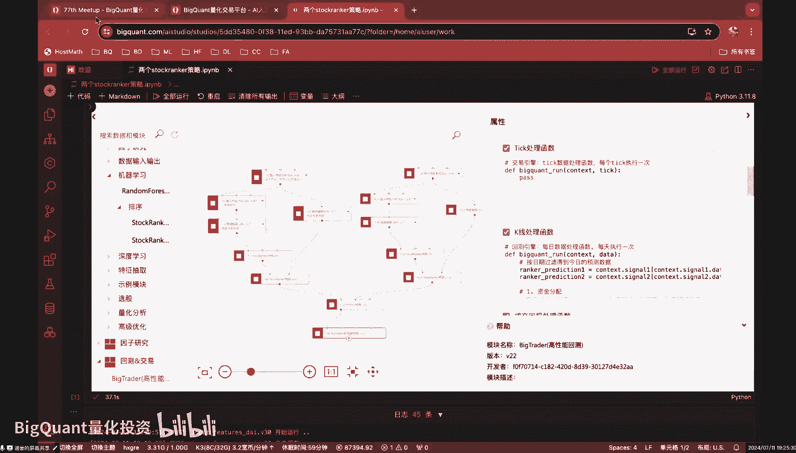

好的，那么这个就是我们说的，我们可以很简单的通过这样的方式，相当于模拟出两个store rank的这样一个策略，然后把它结合起来，然后下单金额，分别是总金额的40%和60%。

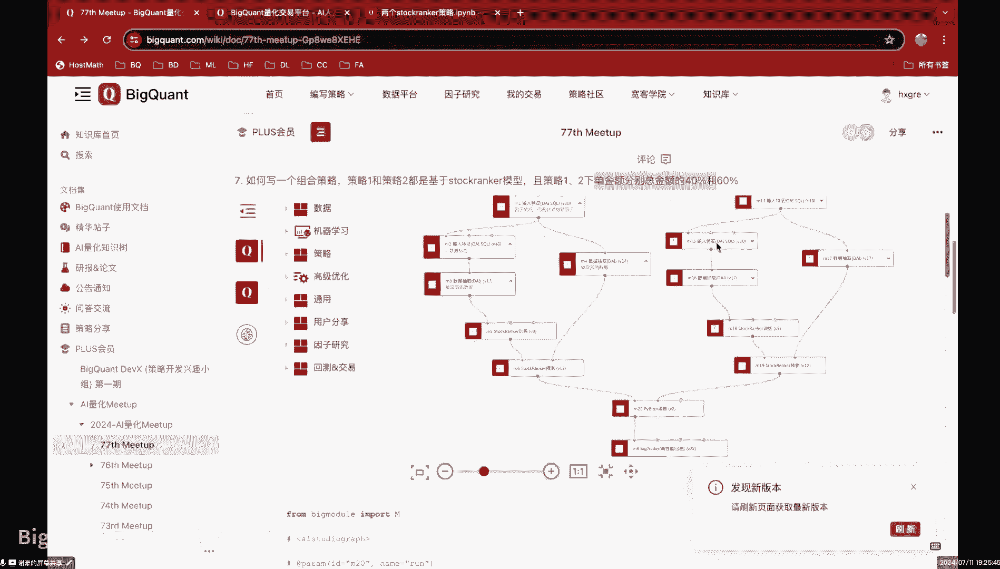

今天的主题是基于star cranker的多模型组合，并且策略一二下单金额。