# Akshare 分时成交数据接口 - P1 - 老湾python量化交易 - BV12m421g7yB

之前发过一期古案于ak share工具包的视频，ak share是PYESTON爬虫的工具包。

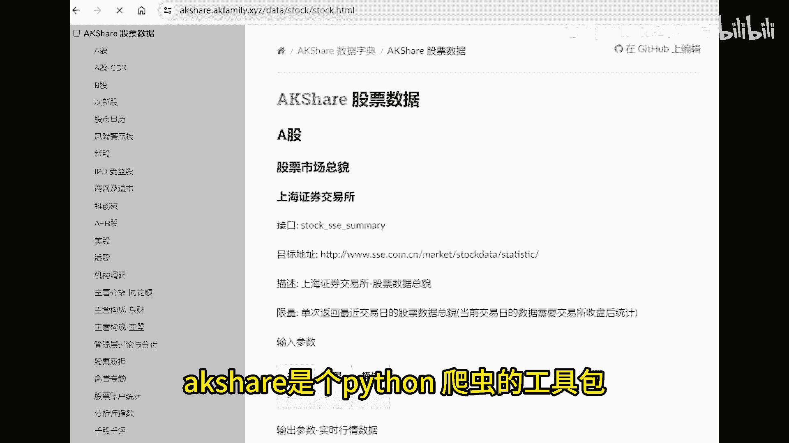

但你是不是只用来抓K线，抓筹码。

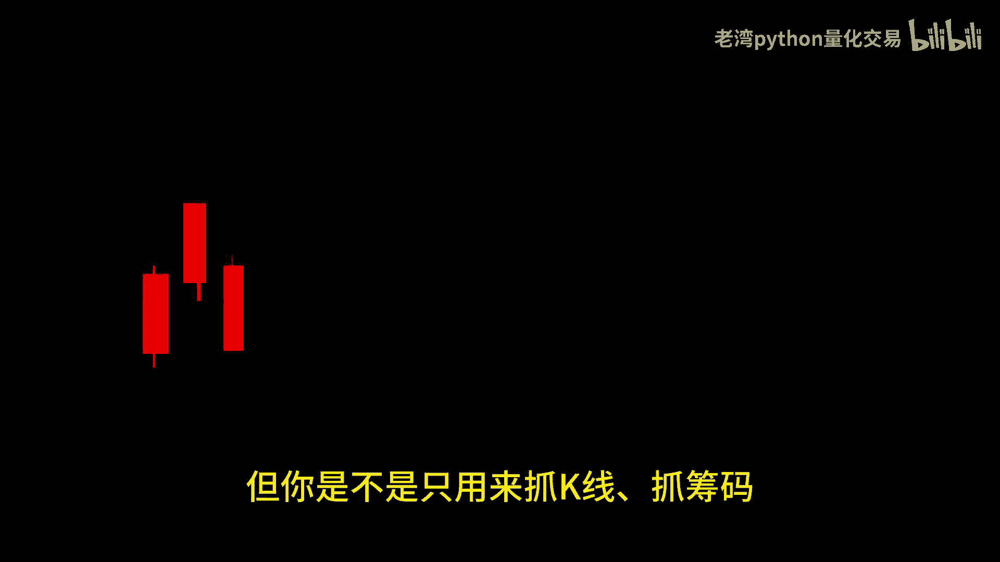

还有抓财包而已呢，ak share里面有许多你意想不到的好用数据。

今天要介绍的数据是分时成交明细，股票交易的成交明细分为分时成交明细，含有除比成交明细两种数据，一般普通的股票行情软件。

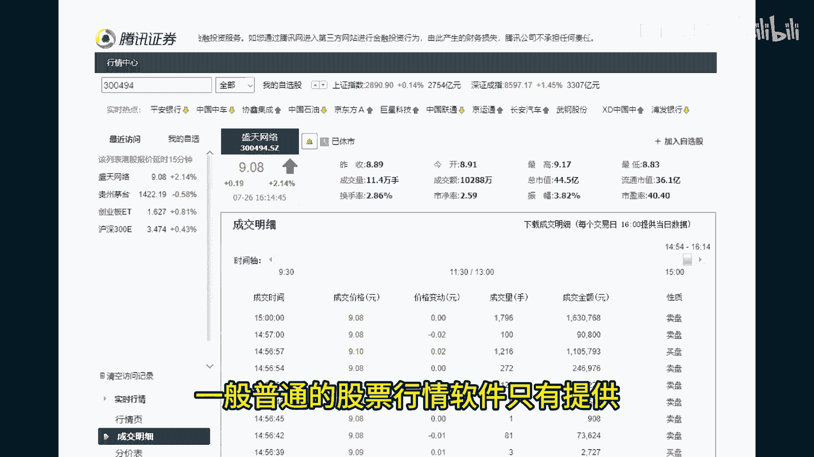

只有提供分时成交明细的数据，而主笔成交明细的数据，只有在其勤用nevel two功能时才未显现。

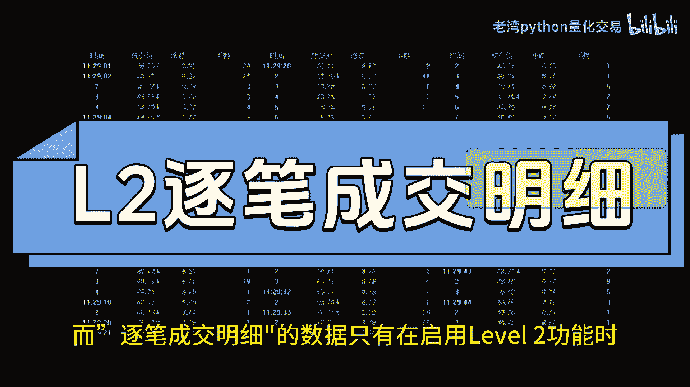

足比成交数据能够显示每笔成交的价格，还有该笔成交是主动买入或者是主动卖出，主动交易可以理解为交易者的积极程度，如果你要追涨停，应该会用涨停价敲入。

如果您要止损，大概持位用跌停价直接敲出，当市场趋势比较明显。

或者有机构储利，或者是背后有大兄弟要进场的时候，由于他们的资金量比较庞大，不会用挂单的方式来委托下单，一方面，挂单量会被市场交易者，透过上下十档的委托信息提前得知。

再者这样的挂单效率太低了，俺下班你都想摆不晚，因此这些大资金会用比较高的价格多次的扫盘，一般市场账出现上下横盘的时候，买盘成交，还有卖盘成交的比例会在一一上下左右波动，当市场有大资金进场。

开始出现趋势的时候，这比例会出提早出现信号，因此汇总一段时间内摆盘，还有卖盘成交的比例。

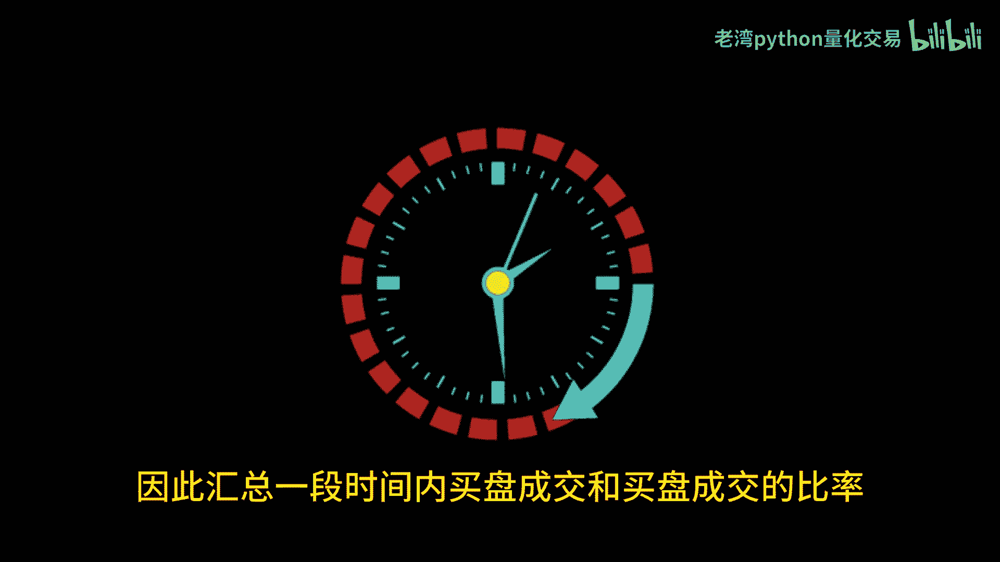

比如34分钟，5分钟就能估算出背后大资金的意向动态啊。

这边顺便吐槽一下，A股市场对于量化交易有诸多的限制。

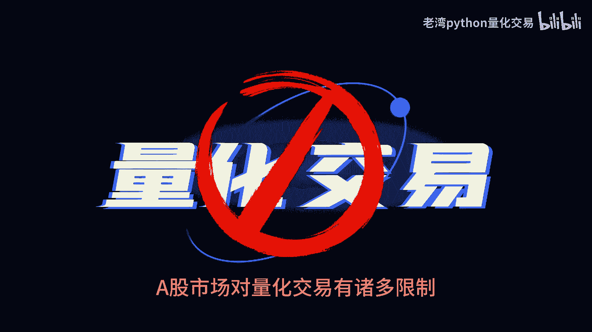

A股市场的雷柏兔接口，需要付费升级才能够接入的，而且韦多单只能看到上下十档。

但在某些市场里面，这些数据都却是开户就能够用API直接接入免费。

而且是毫秒等级的更新数据，分时成交明细则则是逐笔交易的市场配送，一般A股贸易软件里面都会提供这个数据，首先我们要了解一下分时成交明细的规则，交易所是每三秒钟向用户发送一次热数据。

数据中包含的过去三秒内的交易情况，没有成交的话就会发送信息，所以每分钟最多推送20组数据，其中所显示的买盘或者是卖盘，则是取决过去三秒内的最后一笔交易，如果想要估算市场资金的动态。

以买卖盘的机器程度很不差钱的话，肯定是直接接入a b two的足笔交易数据。

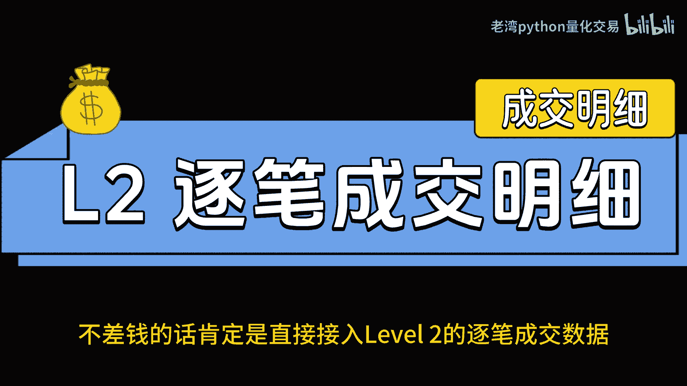

来估算实时的买盘，还有卖盘的比例作为实盘交易的参考。

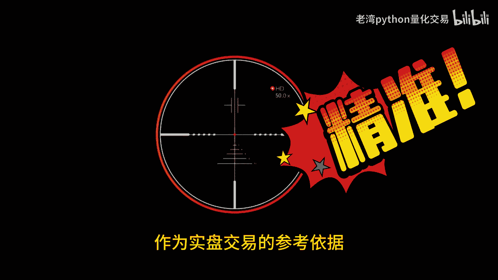

但在白嫖的大原则，此下能最简单的方式是透过apa shell上面的接口。

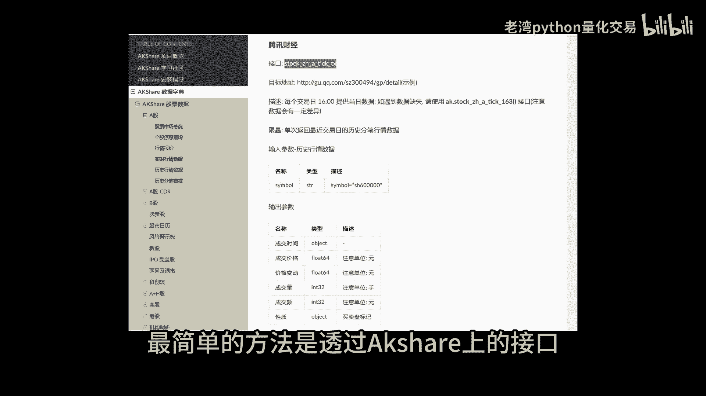

下载分时成交明细图，的，右边是首期app上面推送沪深300ETF的成交明细，间隔是每三秒推送一次，除了成交价格，成交所速之外，还有主动买入，主动卖出了标签。

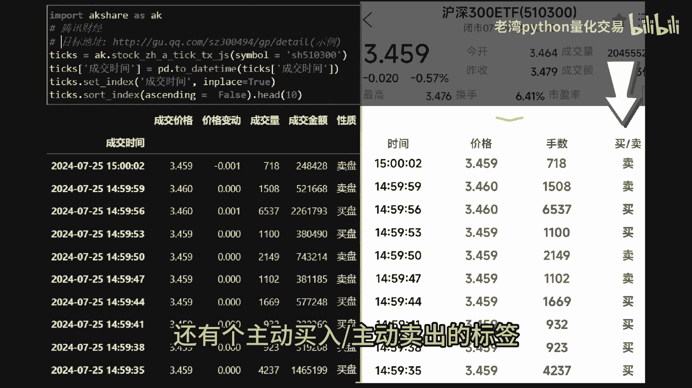

理解了买卖盘的底层逻辑，加上盘中能够取得的实时数据，便能够设计一些观察指标以及进出场的信号，在搭配盘中量比指标这些信号之后呢，便能够看到深一层的交易信息，我们来看一下这个例子。

这是今天的盘中信息，最近成交量一直在萎缩，对于大兄弟或者是大资金来说。

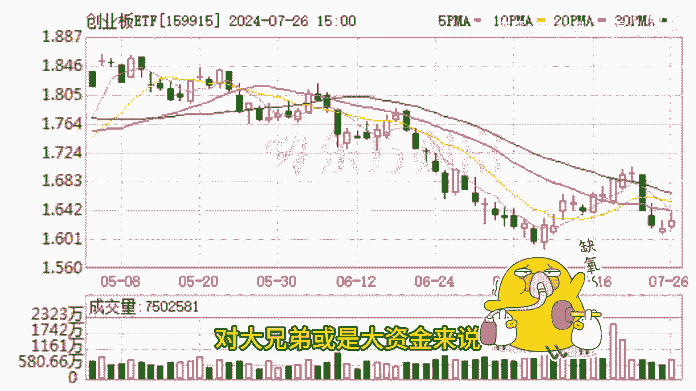

只要有一点点的资金，就能够在盘中轻轻松松的拉盘。

今天在10：30左右时候，市场的成交量比下滑到了0。8左右，原本在一上校徘徊的买盘，卖盘比率库达拉升到了时候，接下来的进攻也都维持到了三倍左右，接下来10：30到11：30之间呢。

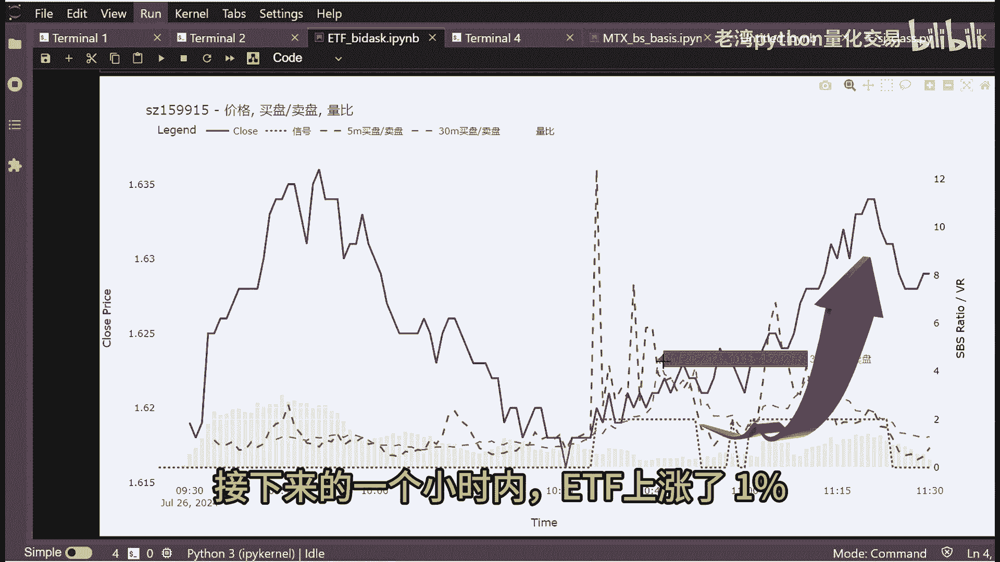

整个ETF上涨了1%，K线数据比较容易图像化，比较容易让人理解。

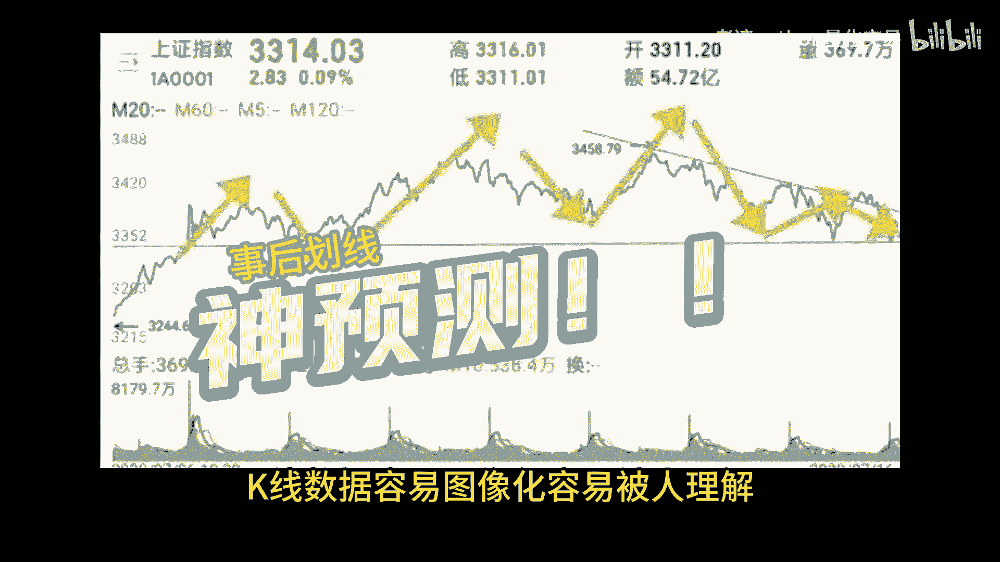

但农业理解不代表背后的逻辑和理性，交易的本质无非是买跟卖。

K线呢只是交易后的结果，中间有太多的交易信息被K线约所扯弃掉了，而分时成交数据能够更直接接近交易者的气度，当然如果你不差钱，不差技术的话，就搞个雷柏兔足比成交的数据接口吧，今天的分享先到这边。

如果你喜欢我的视频的话，投币点赞加关注。