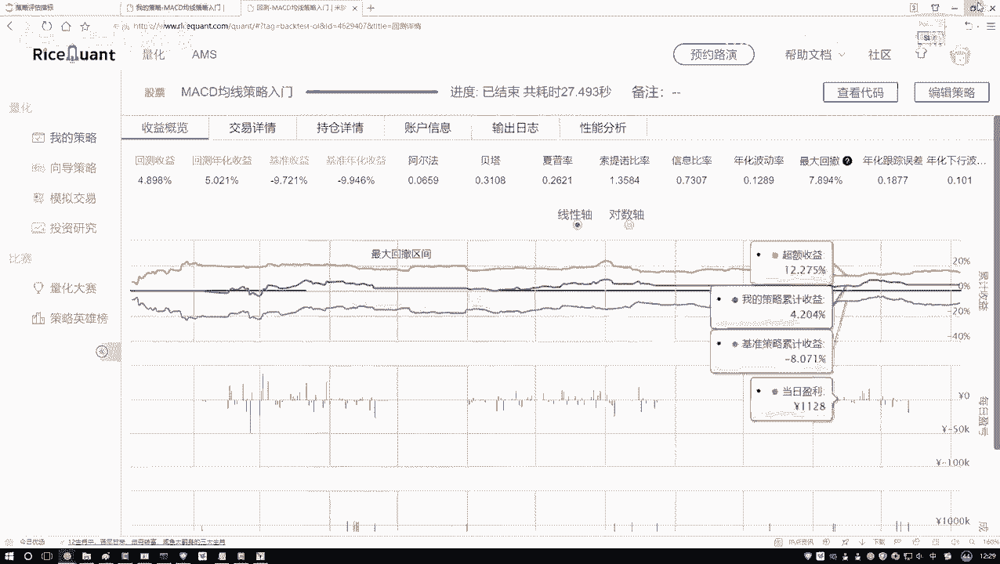
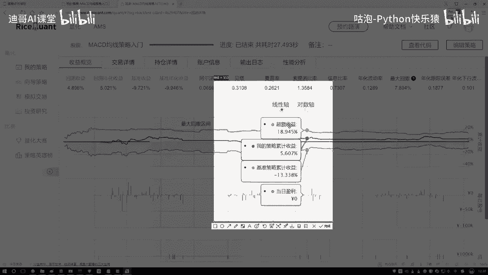
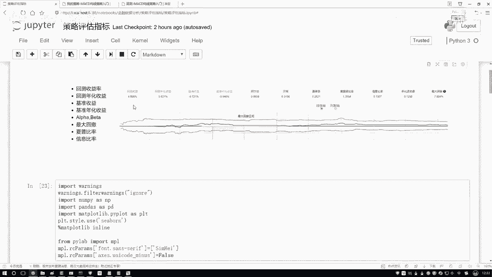

# B站强推！基于Python机器学习的金融分析量化交易实战居然被同济大佬老如此通俗易懂的讲解出来，三小时即可吃透！ - P20：5-阿尔法与贝塔概述 - 迪哥AI课堂 - BV1hZ421W7u8

最后啊咱们再来说一下这个阿尔法，还有贝塔啊，其实就是在我们测试当中啊，还有两个值，你看这里一个阿尔法，一个贝塔吧，啊咱们再来说一说呃，阿尔法贝塔是这样一件事啊，就是呃好比说吧，你现在赚钱了。

那你这个钱是怎么赚的呢，我说你赚这个钱啊，啊是分成两部分，反正你说你写了一套代码，写了一套策略，或者说你去选了一些股票吧，啊做一些事情赚这个钱分为两部分，一部分呢是说哎呀现在整体这个市场。

那大环境就好的，那大环境好，那自然你就能赚钱吧，啊就是说一部分是跟这个市场啊相关的，那另一部分呢我说呀另一部分可能这样，它跟市场不是太相关，跟你的一个努力是相关的，比如说你每天都在去考察各个公司诶。

考察他们当中财务啊，或者这个信息那个信息哎，或者他们的一些公司的运营，公司状况之类的，你独具慧眼了，然后呢你去发现了一下哎呀，当前这个我该怎么去操作，能够使得我去赚钱啊，相当于你有两部分。

一部分是跟大市场大环境相关的，另一部分呢是跟你的策略啊，跟你的一个敏锐的观察力啊，或者是跟你的一个手法吧相关的啊，组成两部分可以吧，好了，我们所谓的一个阿尔法和贝塔。

就是分别去衡量我刚才说的这两部分的啊，来看一下吧，它的一个定义说这个阿尔法啊，它叫做一个呃，不用管它几个定义了，叫非系统性风险，其实他就是这样一件事啊，它描述的是就是呃你的一个投资吧。

或者是你的一些策略，或者是你做了一些什么事儿啊，与市场的波动是无关的啊，就是大市场大环境怎么样，跟你做这件事跟他没关，主要是你自己努力来的，所以说一般是用它衡量你的策略诶，怎么样。

这有个指标叫做一个阿尔法，然后呢还有个指标叫贝塔，贝塔是这样，贝塔就是说你现在啊就是跟大六混呗，啊跟大六混你也能挣钱，跟大六混，可能就是大大大市场它的一个走势表示啊，就是投资的一个技能的风险啊。

就反映了你的一个策略对大盘的一个敏感性吧，就是说白了就是市场收益啊，它是跟这个贝塔是挂钩的，超额收益是跟这个阿尔法相挂钩的，我解释一下什么叫市场收益，看这个图吧，这个图这个图当中，你看这里是不是这样啊。

我看哎这这这这都怎么还有负的。

来随便我哦，这还不太好截图，这样咱随便截一个位置来看这个位置吧，你看现在有什么，现在这里有有一个点叫做我的策略收益，是不是啊，就是你现在做了一件事，然后你的一个收益多少，然后基准策略收益。

基准策略收益就是像我刚才说的，这是个大环境，这个大市场，比如说你的一个啊几百股票，三百五百的股票，然后他的一个指数整体的一个走势可以吧，相当于就是大环境它的一个走势，那这里呢还有什么，还有一个超额收益。

超额收益是什么，就是用你的一个策略减去哎市场的走势，通过你哎是因为你的策略，你的努力所带来的收益叫做超额收益啊，所以这里咱们就把这个蓝色的哎，现在鼠标在这个位置，你就当做是市场啊它的一个大环境。

然后这块啊就这块的策略的不管了，超额收益就是我们独具慧眼，咱得到的哎我想要的一个结果。

那在这个任务当中呢，你看超额收益是什么，通过你的策略带来的是不是市场收益呢，就是你跟着大盘走，它所带来的一个收益吧，所以此时啊我说最终我们的一个总收益，还有把它比作成两部分，一个是市场收益。

一个是超额收益啊，然后市场收益啊它有个系数，贝塔超额收益，它有个系数阿尔法，其实哎你说这两个东西，就贝塔阿尔法怎么求出来的呀，你看它像什么，我说这个东西啊，它是Y就是就是一个回归方程，可以吧。

在这个回归方程当中啊，有两个什么，有一个贝塔，有一个阿尔法，我让你把这个因子给它求解出来，是不能去解呀，咱们可以按解线性方程的方法把它解出来吧，当然这个只是其中一种做法啊。

等后续咱们来说因子策略分析的时候，哎给大家专门去讲啊，这些具体啊，我们这个策略该怎么去办，现在啊大家只需要知道有这么两点就行了，一个叫啊这个贝塔贝塔意思啊，就是说哎这个东西它是跟市场相关的。

然后阿尔法这个东西是跟市场无关的，其实你要干什么，你说我们目的是干什么，我目的是赚钱是吧，你说市场哎你能改吗，就前面这个东西他爱谁谁吧，为什么这么说啊，市场这个东西啊，说白了你无能为力吧，你改变不了啊。

你也没那个本事，所以说我们的关注点在于什么，你就关注点就在于怎么样获取一个超额收益吧，这是我们的一个目标，所以说啊通常情况下咱更关注什么，我们的一个阿尔法吧，怎么样获取更多的超额收益。

这是我想要去做的啊，行了，就是简单了解一下，先了解一下这个阿尔法和贝塔，它表示的都是哎，哪两哪两个层面的一个意思就行了，后续咱们再详细去说吧，好了，这里给大家看了一下，就是呃在我们这个指标当中啊。

有一些常见的啊，我都给大家举个例子，咱们来简单唠一唠公式，不用去记啊，记完了后面你也你也忘了，你就知道哎，比如说这样一个什么最大回撤，或者一个下午比率，一说到哎你知道什么意思就行了啊。

不用去记它的一个公式，Python实现简单点也行，因为实际咱用过程当中啊，基本上也不自己去写啊，有很多工具包，以及呢这些现成这些平台能帮我们去做吧，啊这块还有基准收益，基准收益咱我记得好像之前忘说了。

基本收益，这样基本收就像我刚才说的，就是啊你什么都不做啊，你跟着大盘玩，然后他的一个它的一个收益的结果，那你看你什么都不做的时候可能怎么样，还是个负的啊，我们要做的就是去获得它的一个我超额收益啊，行了。

这里给大家解释了一下，就是在策略评估当中啊，一些我们的评估。

