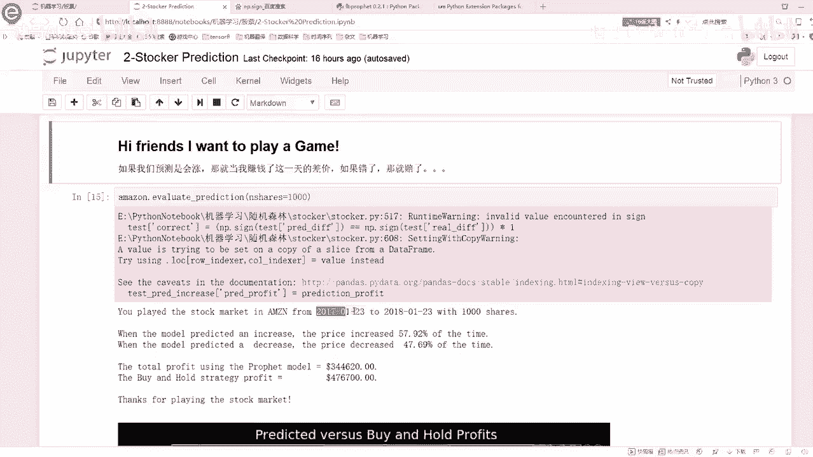
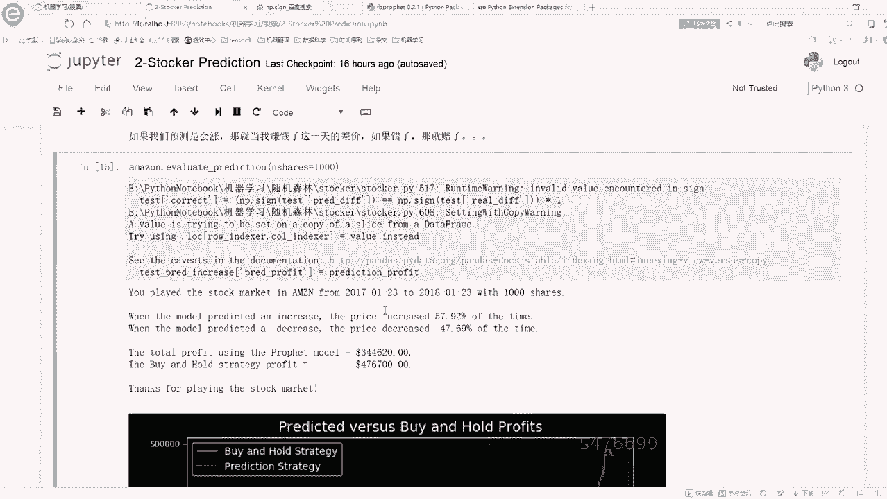
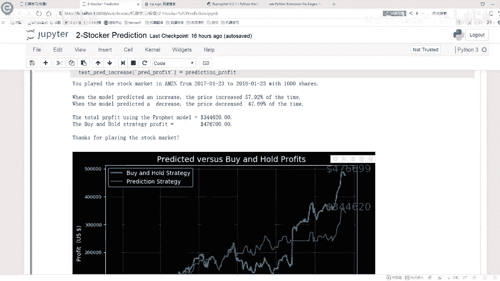
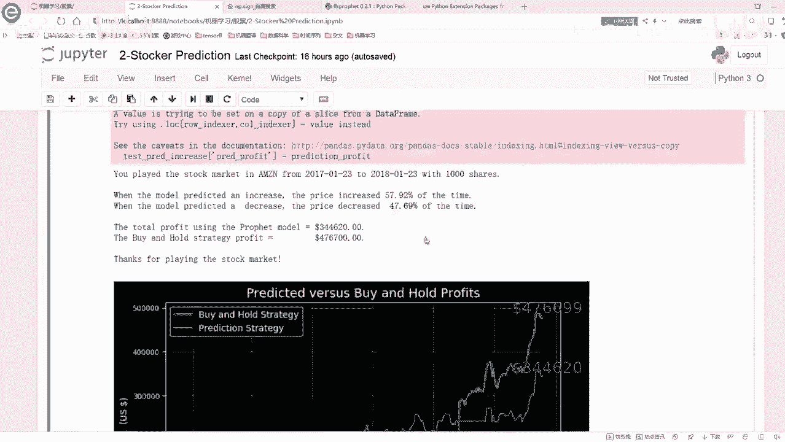
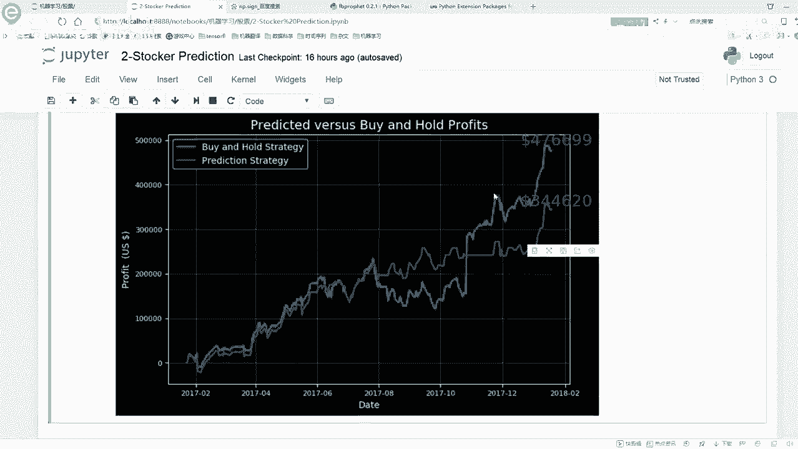
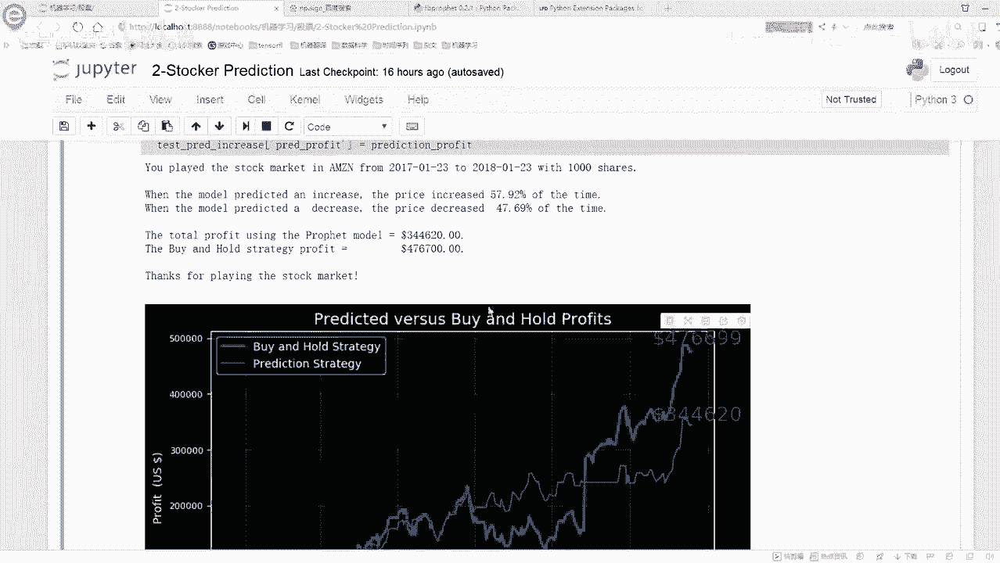
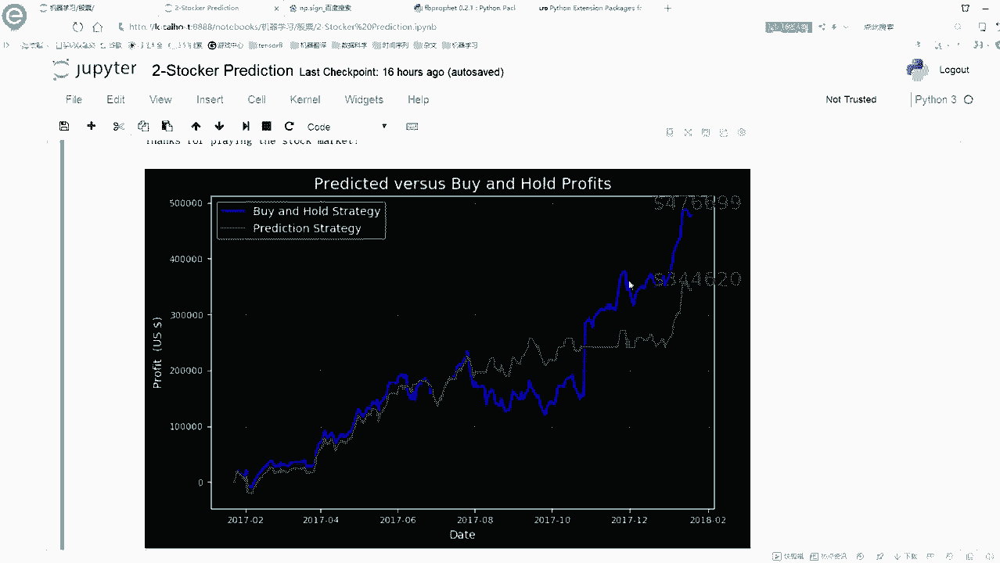
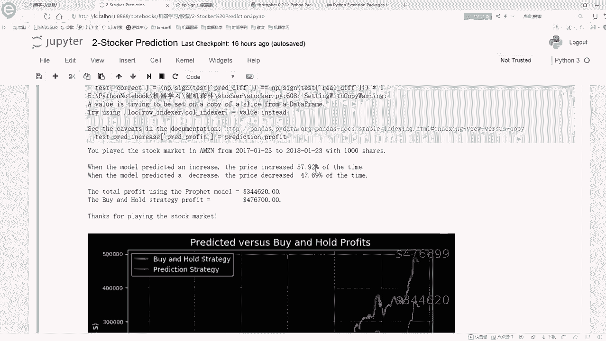
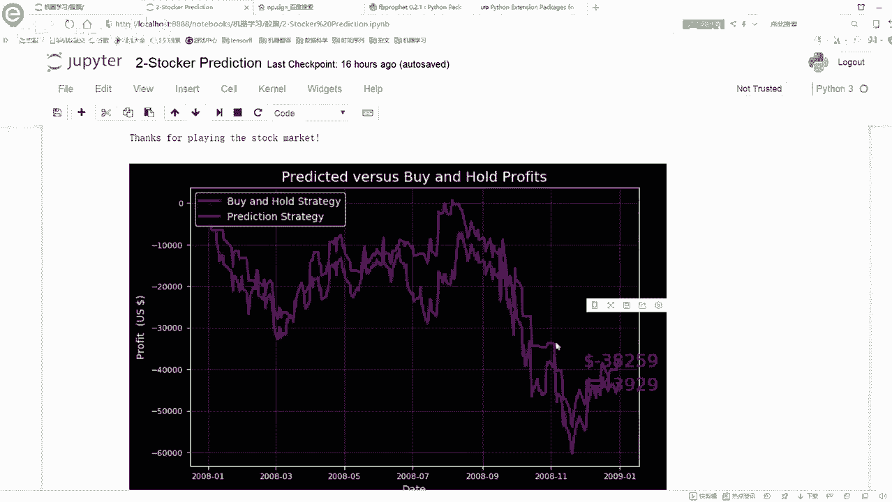
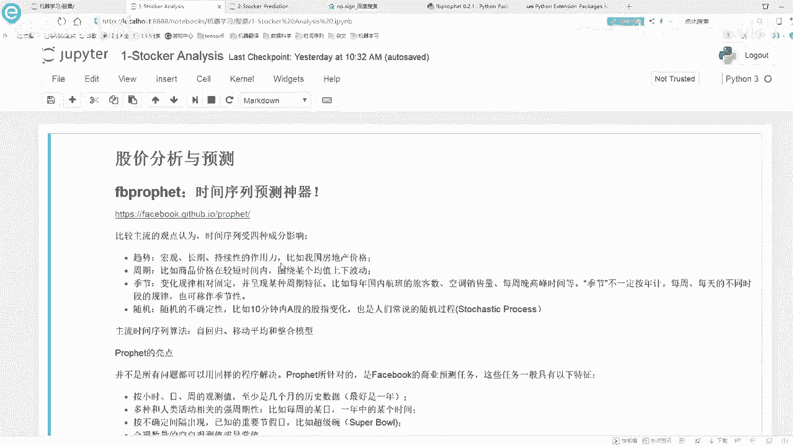

# B站强推！基于Python机器学习的金融分析量化交易实战居然被同济大佬老如此通俗易懂的讲解出来，三小时即可吃透！ - P6：5-突变点调参 - 迪哥AI课堂 - BV1hZ421W7u8

接下来啊咱们就来看一下哪些参数啊，会对我结果产生一个影响，咱们先来说最主要的就是这个change point，Change in point，在这里我们可以来进行有一个指标来进行衡量。

它这个指标呢叫做一个scale值啊，它的意思先给大家解释一下，就是说这个参数啊，它指定了我突变点的一个权重，你看这里写了这个参数，他说的是突变点的一个权重，那权重是什么意思啊。

那是不是说当你给一个突变点较大的权重模型，就会更重视它这个意思啊，那所以说现在呢，如果说我当我把权重设置大了一些模型呢，就会更符合于我当前的训练的一个数据吧，因为你看啊就是模型当中我随便找，就这个图吧。

模型当中这个突变点我给它较大权重诶，咱们的模型就非常重视这个突变点，就得去学这样的一个突变的一个趋势吧，那这个时候你可以想当你训练级的时候，去学了这些非常非常多的一个突变的一个事情。

而且呢你给它赋予了较大的权重，那明显发生一件事是什么，这个时候你在训练的时候，你的一个过敏和风险太大了吧，因为咱们啊是完全按照训练集当中，这些突变点去训练当前这个模型的，所以说呢还有这样一个问题。

哎呀权重大了，咱们现在是能够更符合于我的数据集，但是呢这个过拟合风险啊，它又更高了一些，这是第一个问题，那你说权重小了呢，权重小了呀，模型可能就欠拟合了，他可能就是比较保守的。

你看这个这个就是说嗯这里啊就是我用这个FACEBOOK，它这个框架里边它是有个默认值啊，这个突变点它的权重我看了一下这个代码，默认的是设置成了0。05，默认设置成0。05还是比较小的一个值啊。

就说明它这里诶对突变点没有那么敏感，没有那么敏感，情况下它当前咱们去做这个训练，他就可能有些图片信息啊，没有把握的那么多，那接下来它这个模型的一个趋势，还是比较平稳的一个趋势。

你看我就是我这块做了一些实验，我发现了，就是你这个突变点如果说设置的比较大，那它可能就是诶它跟你这个模型啊，它吻合程度非常高，但是呢它这个过拟合风险也很大，但是如果说你把这个图片点设置比较小。

他这个过拟合程度啊没有那么大，但是呢它这个模型始终比较保守啊，就是这个意思，然后呢为了给大家解释这个事啊，咱就实际来看一下吧，这块呢我就是选了四组参数啊，再来看一下这四组参数啊，对结果影响怎么样。

就是咱们的这个train point的它的一个权重值，然后呢有什么0。0010。005，0。10。2啊，这几个值，然后把这行代码我得去给他拿过来，为大家在这里啊，咱还是按照咱这个思路啊。

还得去debug来看一遍，然后我看一下这个东西，这东西就不要了，然后我再看一下哦，这这这东西还要，然后就就拿这几个来说吧，debug一下，然后这块它debug，然后这块我不跟大家尬聊了。

然后看一下咱这个图啊，这个图当中啊，就是画出来这样一个趋势啊，就是你看这个黑色的还是我的一个真实点，然后呢分别有几种不同的线条啊，都画出来了，咱的一个就是最终的一个预测值。

因为在这里相当于我要建立四个模型啊，每个模型它的结果都是不一样的，因为他们选择的参数是不一样的，有这个比较大的一个，有比较大的一个就是权重点，权重也有比较小的权重啊。

咱们来先给大家说一下它的代码是怎么做的，然后咱们来分析一下这个图，首先呢这个东西一样的，就是还是啊把我的一个学员数据集给拿到手，从这个15年到这个17年的嘛，然后这里就是我写for循环。

对于每一种这个权重，每一种权重不同的时候，我们要干什么，我们在这里去设置一下当前我的一个权重量，等于我接下来复制这个指标，复制完之后呢，然后我再去create下这个model。

create model的时候，他就会帮我去用新的一个嗯，参数来进行一个赋值，然后呢在这里就是我make一下，就是我去指定一下，咱接下来预测180天的一个数据，然后呢去预测一下吧，这样可能会稍微慢一些。

哎呀这块稍微等一下，然后预测完之后，预测完之后啊，在这里就是呃我去把当前的一个预测结果，然后往里去填充，然后一步一步的去填充，填充完之后呢，这是完成第一个，然后这个复循环咱就不看了，他有第二个，第三个。

第四个，这个意思啊，就是说在这里，我们就一也一个一个参数去建立模型，一个参数，一个参数去得到我最终的一个结果，得到最终结果之后，然后你看什么，在这块就是先是整体的把我要画的图啊，都给他画出来。

先把这个就是真实的情况，train的一个结果把它画出来，就是我的一个观测值嘛，这是一个真实的情况，然后呢我接下来不是画了四个模型吗，复循环当中啊，有几个模型就画几个呗，这不就一样了吗，照样画我这个图。

照样画咱当前的这个区间，然后呢把这个结果显示出来啊，这块还在执行，最后呢我就把这个图返回去，这就完事了吧，所以说啊在这里没有什么太多的操作，只是说看我看一下这个做挑哪，这块就算咱就不等他了。

不等他这块去执行了，直接给大家看这个结果吧，直接看的结果哎，这块说要运行完了，直接看一下这个结果，其实在这里啊之前也一样的，下面你看就到了这个画图这块操作了吗，复习当中你画几个图啊。

最终它就是不断去迭代，完事就完了，你看一共四个图吧，然后搜一下呀，这个数还没显示出来，那咱在这看吧，在这看吧，就是这几个图嘛，咱们来对比一下，先看这个蓝色的，蓝色的是非常小的一个这个这个图片点权重。

你看啊非常小的一个推荐权重，你看它整体的一个趋势啊，这个蓝色的整体的趋势长什么样子，它这个整体趋势啊，是不是说他就是你看一些突变点，他根本就没有表现出来吧，而且这块明显他是下降了。

这块他预测确实是上升的，所以说就是当你用一个小的突变点，权重的时候啊，最大的一个问题就是，在这里他没办法去捕捉到，咱完整的一个训练集当中信息是长什么样子，你看这是对于一个小的图片也全中。

你看它是这个样子，没有去捕捉到太多信息，那最终预测的结果呢，你看他也是非常平稳的一个趋势吧，就像是一条线似的，所以说非常小的值啊，像我刚才说的，他是一个圈子太小了，模型可能欠拟合。

就达不到咱们预期的一个要求了，然后再稍微大点呢，看这个红色的红色的是不是，你看我这个拟合效果，是不是，咱就来拿拿这个拟合效果来说，这个蓝色的感觉是非常差的吧，红色的你看这个红色的0。05，A默认值是0。

05，稍微好一些吧，你看红色稍微好一些，但是呢最终结果也是没有直线的往上升上去，然后呢再大一点，这个灰色的，还有这个黄色，就看这黄色的吧，比较大的比较大的情况，你看这个黄色的它明显的一个趋势啊。

就是跟其他线条相比啊，他就是你看就在这个点来说，红色的它上升到最高点了吗，没有吧，黄色的上升到最高点了，就是它在捕捉你训练集的时候，它会捕捉的更强烈一些，尤其是它会更好地去发现你这些突变点，在什么位置。

那这里呢，你看它可以把咱们的整个的训练集当中啊，所有点基本上都能捕捉到，然后呢按照这个趋势，他今晚上去预测，你看红色的预测的更高一些，因为他发现了当前这块突变的这样一个趋势，它会预测的更高一些。

这个呢就是咱们当前给大家说了一下，我的一个change point啊，它这个参数对结果的一个影响，其实这个参数啊对结果影响是非常大的，在这里我们也主要调节的就是这个参数最明显。

你就看这个蓝色和这个黄色吧，太明显了吧，这个蓝色的不咋地，这个黄色的拟合的非常好，但是呢它可能会有些过拟合的问题，在这里哈我就看了啊，默认参数我给大家说了，它是0。05，它是在这些之间的。

蓝色的线和黄色的线啊，它们都是一个呃比较比较特别的哈，一个是铅笔盒，一个是可能有一些过拟合这样的一条线，然后呢我们来进行一个评估吧，来进行一个评估的时候，这块这个这个我就不不跳了，往里边跳给大家看了。

这一样的，其实这里就算了这样一个事啊，就是这个CP啊，就是train points，这个train points就代表CP，它分别有0。00100。05，0。10。2几个值吧。

然后我们可以看下它的一个train error，还有它的一个test error，我们就是呃range这个东西啊，就是咱们的一个就是一个嗯y hat。

一个lower和y hat oper之间的一个差异值，这个咱们先不管啊，咱们就看这个TRAERROR和test error就行了，其实我主要关心的就是这个test error吧。

因为train error对我来说可能没那么重要，因为我要预测的是一个时间序列嘛，时间序列啊，串上的error可能就是没那么重要，但是我要关心的一定是test一个error，明显的一个趋势是什么样。

true error明显要比这个test error要小很多吧，这也是时间序列问题啊，本身就难解决的一件事，因为你要预测的是用自回归模型，预测在之后的一个时间点，这个东西啊，我就就就从我就是一一听。

我就觉得这东西可能不太靠谱，所以说咱这个test erroa，相对来说都是偏高一些的，这个都是蛮蛮正常的，比纯error高一高一些的话，然后来看吧，随着我这个CP值增加增大。

那这个train erro肯定出现一种趋势，什么CP值越大，100%的这个TRAERR值会越来越小，因为CP代表着你的一个过敏，就是过越大，就是权重负的越多，才能更好的去拟合这个训练数据吧。

这是啊咱大家呈现出来这种情况，然后呢这个test error，这个test error咱来看这里呢它也是逐渐降低的吧，那这里你说对于这几个参数来说啊，你选择哪一个比较合适啊，我肯定选0。2的，为什么。

因为0。2的对应的一个test error，它是等于127。60的这个test error值啊，它是比较低的，所以说呢在这里我们是选择咱们test error，最低的那个参数的。

它相当于啊就帮我进行了一个评估，这样一个操作，你看在这里画了一个图TRERROR，这TRERRO下降多明显是吧，然后呢这个test error它也是在进行一个下降的吧，然后这块它可能还进行。

有一个稍微点的一个上升啊，这个趋势都蛮正常的，咱只需要找最终的一个test error，值最低的那个就可以了，拿最低的当成是一个当前的指标，那现在我看这个趋势好像是他没准，就是当我把这个呃CP值啊。

就新POINS值再增大的时候，它没准还能下降是吧，那一会儿我们再来看一下，我们再增大点儿，它还能不能再下降一些，在这块呢咱们来试一下，更大的，咱们来看一下，就是更大的一些CP的值，你看我从0。20。

25开始啊，0。250。4，然后一直干到0。8，这些值都比较大啊，再来看一下它的一个结果啊，然后这里咱们来画一下这个图啊，然后还是进行预测啊，这个道理都是一样的，这里咱们就不给大家多说了。

然后CPI的值对应着一个TRAERR，你看都是比较低的，TRERR还在下降，然后呢，这个test error从这个114，一直下降到了67是吧，而最低可能66，可能到这呢趋于一个差不多的一个位置了。

在这里咱们就来看吧，我的一个test error，最低是中间这个是002还是等于多少，是0。7，这个吧最低是0。7，这个吧，也就是说现在呢当我调参的时候，发现了我选择这样一些值啊，都会达到不同的效果。

但是呢达到这个0。7的时候，当前效果应该是最好的，现在咱这个指标值是等于66，也就是说达到一个历史最低点吧，这样啊，我们就把最终的一个啊参数结果选出来了，我们选什么呢，就选这个0。7就可以了吧。

这个就跟大家说了一下，咱们的team point这个参数该怎么调，以及呢，它会对我的结果产生着一个什么样的影响的，然后呢我们再来评估一下模型吧，在评估模型的时候啊，就是还是这一天啊。

就是你看当我选择一个新的参数的时候，原来咱们的一个预测值1263，真实值呢1294这个东西啊，差的怎么样，差的就是没有那么多了吧，所以说啊，这个就是说当我们用一个新的参数的时候，我们去测试的时候。

哎咱们效果是比之前能够强一些的，达到了这样一个结果，然后呢拆线之后啊，可以画这样一个图，画这样一个图之后呢，就是从这开始去预测啊，咱当前的一个结果值是等于多少的，然后这块我们有啊。

这块我们是用一个evolution，从这个U23到18年的一个U23，得到了这样最终的一个结果值，然后呢P完模型之后啊，咱主要是调这个顺序框子，然后接下来再给大家看一个好玩的一个事吧。

这个呢就是在这里啊，我们就是给大家准备了这样一个函数，这个函数啊，就是说我们可以去也玩儿一个小的游戏，那这个模型呢就给大家先讲到这里，然后就是如果说大家对模型当中啊有哪些知识。

哎我们就是可以说就是我在这里啊，只给大家概述了一下这个模型，我们基本上的一个使用的方法，以及呢我们这样的一个案例啊，咱们是怎么去做的，预测最终的一个结果值，如果大家还是想把这个东西做得更深。

想去深入了解其中的每一个细节，那最好的方法在哪里呢，最好的方法就在它的一个官网当中，最开始的时候给大家给出来他那个GITHUB，那个GITHUB的一个链接吧，那里面呢他有详细的介绍给你讲，每一个参数。

每一个功能是什么样，其实这些东西哪来的这些东西啊，也都是从那个他在官网当中啊，去介绍来的这个模型，你说让我自己从头到尾到尾去用，我哪会用这个东西啊，我也不知道它是什么。

我也都是在这个官网当中一步步去看的，所以说大家在使用的时候，最好能结合它的官网一步一步看，他会告诉你每个指标什么意思，告诉你完什么意思之后啊，那你说你怎么能知道他这个东西说的，是不是这么意思啊。

它实际表达什么样啊，我们自己动手实验的，试一试不就知道了吗，最好实际动手参考他的文档，我们自己实际动手做一些小例子小demo，然后就能掌握这个库啊，咱们该怎么去用的。

然后这块就是啊还friends want to play game啊，这里就是我是比较愿意看那什么，我是比较愿意看那个那个那个什么那个叫什么，那个那个哎呀，电锯惊魂啊。

都想了半天没想起这个名电锯惊魂是吧，总爱说这句话，电锯惊魂八，我还没来得及去看，哎之前那个第一部到第七部啊，我之前有一段时间啊，就是实在是没事干，一天看一部，第一天看一，明天看二，后天看三，一步一步看。

看了七部之后，然后然后过下个月又没啥看了，再从头到尾看一遍吧，我就觉着自己看这东西啊，感觉蛮爽的，我也不知道我这个心里是不是有病啊，然后再来看这么个事啊，就是说如果说我现在要预测呃。

一个我买股票能不能挣到钱，这个时候怎么办呢，这个时候咱们来试一下吧，如果我们预测是一个涨，那我就当咱们这么玩，就是说如果说我预测涨，那我就赚到这天差价，如果说我预测错了，那我就赔了，我预测涨。

我就是相当于预测我就去挣这个钱，预测错我预测赔我就是没赚这个钱，就是这个意思，我们是一天一天的去赚这个差价的，这个也不给大家在代码当中实际去看了，这相当于是一个小玩具哦。

比如在这里我们就指定了从这个17年哎。

不不不从这个啊，这从这个17年123，到这个18年1月23，我们在这里预测了一下，我有57。92%，预测的是涨，预测对了，47。69%预测跌，预测对了，这里就是我们的一个差异啊，还是接近于50%是吧。

所以说股票这个东西啊，到底它是可不可以预测的这个东西啊，我看好多研究金融的人啊，都在研究这个东西，能不能构建一个自动化的一个交易模型，然后帮你挣这个钱，我觉得是不太可能的，这东西啊一旦要做出来了。

我觉着这个市场啊，没准儿他就已经是要倒闭了，这个东西。

而且这东西你估计你也预测不了太准，基本上还是有一些瓶颈，有些局限的。

然后这里咱们来看吧，比如说在这里我可以按照我的一个所有的获率，Band hold，就是我买然后卖买卖，然后预测涨，我就买预测跌，我就我就我就我就给他卖了，就是不留了，今天这样呢我可以得到一个利润啊。

就是在这一年当中能赚多少钱，给大家总共的去看了一下，当前的这样的一个结果。

所以呢咱们就可以把这个预测的情况和真实情，况给它给它画出来是吧，给他画出来之后，就可以来去预测我实际的一个指标啊，是长什么样子了，绿绿色呢是我的一个预测的一个趋势，黄蓝色呢是我的一个版啊，就是买。

然后并且保留下来的这样的一个方法。

这样呢我都可以赚到钱，两种方案啊，就是大家可以在代码当中啊，拿这个eclipse或者PX。

自己实际动手看一遍这个东西啊，它是怎么去做的，最终呢我就得到了一个结果的一个值这块。

这个简单给大家说吧，这也没什么太多技术性的东西啊，这块就是我们的也能挣钱。

在这个17年到18年你去买能挣钱，那换个时间点呢，08年到09年呢。

你要买它就是个赔钱的一个趋势了，这个就给大家说了一下，咱们的一个啊，还有这样一个小工具啊，我们可以预测一下，按照时间点来说，可以这是指买多少份股票啊。

他是能挣钱还是能赔钱这样一个意思，然后呢预测未来十天的一个价格。

这也很简单啊，你把这个date指定下去，他就会帮你预测出来，接下来的一个十天的一个价格嘛，你看这块他又帮你预测出来了一个十天的价格，然后是它有它有一个外害的一个lower。

WEI的一个就是一个up er，还有这样一个lower，就两个时间点嘛，以及i y hat实际的指标值，这些啊就是我们预测的一个结果，预测未来的一个价格，然后下面呢我们还可以预测的更多一些啊。

预测的更多一些，我们可以你看这预测多少，一直到这个二零预测三个月，预测三个月，你可以把这些东西都画出来吗，都画出来之后啊，其实随着时间的一个推移越来，你肯定这个模型是越来越不确定。

咱当前这个值到底是取多少了，这个呢就跟大家说了一下，咱们当前啊就是这个啊FACEBOOK它的这个模型，他是怎么样帮我从头到尾啊，去完成这样一个时间序列的一个预测，在这里呢我们是拿一个股票数据集啊。

来给大家进行分析的，如果说大家呢有其他数据集，其他数据集可能来说还没有，没找到一些数据集啊，反正这里用股票数据集，我觉着还是蛮好的，因为他时间也不用处理了，数值也有了，而且比较方便就能获取到，这里。

就是我们可以直接用一个股票数据来玩，这样一个事，如果说你有其他数据集呢，照样你都可以来试一下，用我当前这个框架，能不能帮我把这个时间序列哎，预测的还不错，然后给大家又简单说了一下他的一个参数啊。

该怎么调，其实point子主要是这个属性，它会对我结果产生一个什么样的影响，那关于啊这个股票分析啊，还有预测的这个工作啊。

