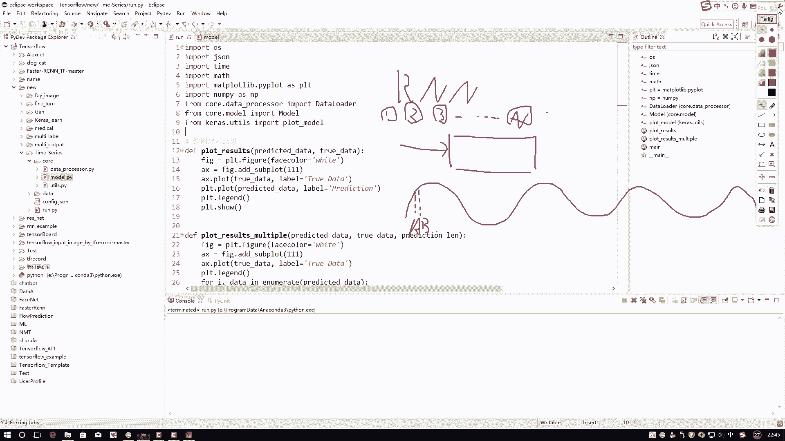
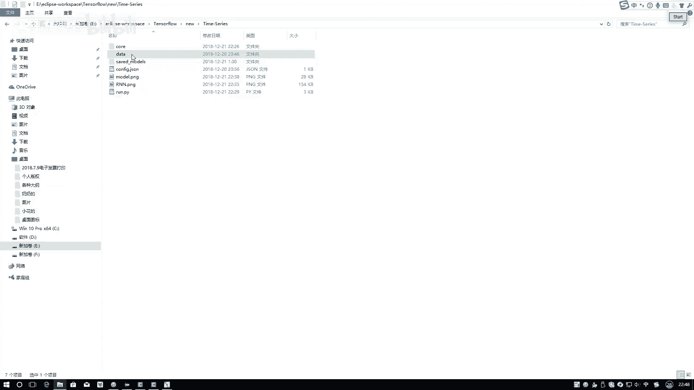
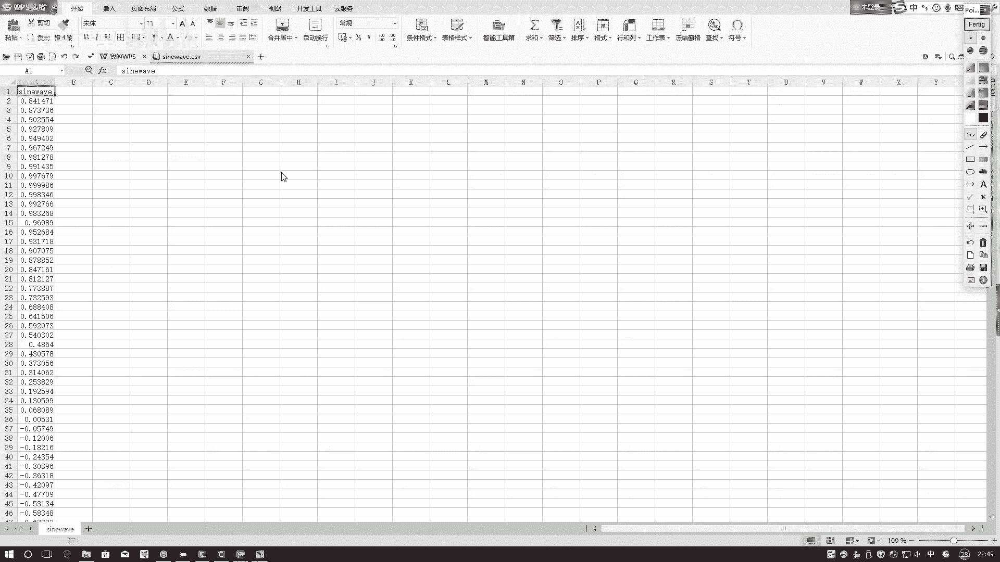
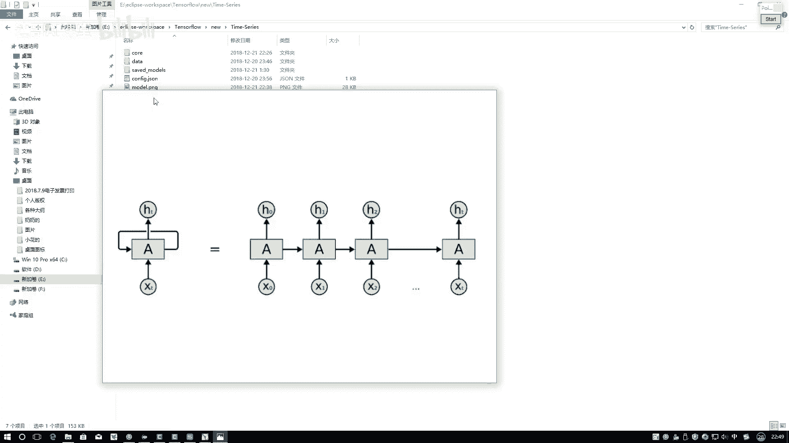
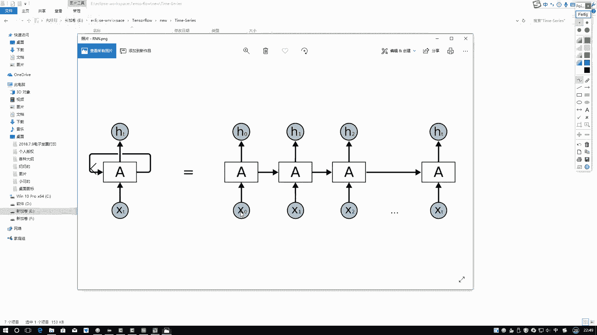
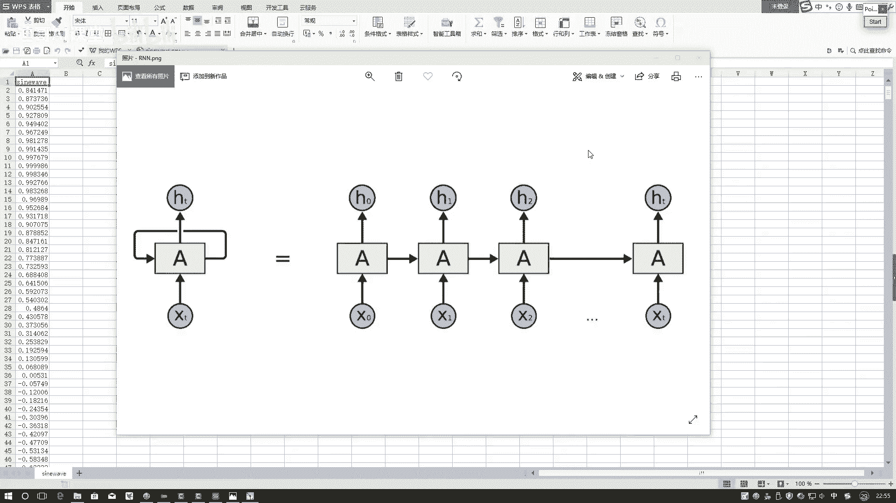

# B站强推！基于Python机器学习的金融分析量化交易实战居然被同济大佬老如此通俗易懂的讲解出来，三小时即可吃透！ - P64：1-时间序列模型 - 迪哥AI课堂 - BV1hZ421W7u8

这节课呀咱们再来说一下在深度学习当中啊，另外的一个分支叫做递归神经网络，也就是我们通常所说的这个RN，之前我们讲的都是跟图像识别相关的吧，或者是一些数值数据啊，或者是一些图像数据。

这回啊我们要做的是另外一件事嗯，还有一类数据啊，我们可以把它当做是一个时间序列数据，那我先问大家一个问题啊，什么叫做一个时间序列呢，说白了就是我们现在这个神经网络，我们在之前看的时候，是不是说啊。

我说第一个数据来了，那第一个数据自己玩自己的，第二数据来之后呢，他也自己玩自己的第三个，一直到第N个，是不是说它们之间没有任何的相关性啊，那如果说现在这个事变了，我说啊一和二之间可能有联系。

二呢会随着一的变化产生一些影响，三呢会跟一和二也有一些关系，说白了就是前面的会对后面产生一个影响，那这些数据啊在我们实际生活当中啊，是不是也挺常见的，比如说咱们今天啊，比如咱们第一个要说的吧。

第一个要说的比较简单，咱们先来去做一个正弦的一个序列，也就是啊对于这样一个正弦函数，你看它是按照一个规律进行浮动的吧，按照这个规律啊，你看比如说当前我说这个点这个A点吧，和他下一个点呃。

这个下的下一个点可能画的间距有点大，下一个点B点，它们之间必然会有些联系吧，点L前后之间都有这样的联系，那你说我们再用以前的CN，或者是再用以前的那个传统神经网络，是不是就有点有点不太一样了。

它会把不同的数据点啊，考虑成它们是独立无关的吧，这个也是传统机器学习算法它的一个基本定义，就是要求样本之间啊是一个独立独立无关的，但是呢我们的RN网络啊能处理的更多，它能做这个时间序列这个事。

大家啊对于这个时间序列啊，应该是不局限于啊，光是我们这些数值数据，比如说像我说的这些正正弦数据，正弦数据它无非就是一个坐标点吗，那还有什么数据啊，还有一些文本数据吧，比如说我说一句话。

咱们今天来上课来讲递归神经网络，是不是我说咱们今天来上课，然后去讲什么东西，也是有一个就是前后的顺序吧，不能说低位神经网络今天来讲，咱们这就不对了吧，也就是说啊，我们正常的一些文本数据。

也需要考虑前后之间的一个关系，所以说啊，这个递归神经网络更广泛地应用于啊，各种各样的文本分析当中，对文本数据进行建模，写文本数据当中啊，本身就有前后这样一个关系，今天啊咱们就来看一下嗯。

怎么样在这个KO的工具包当中啊，把这个RN给它做出来，以及呢，我们还要把时间序列这个东西给它考虑进去，说白了就两个事儿，时间序列数据怎么准备，网络模型怎么搭建，接下来训练出来一个合适的结果，这就可以了。

这个就是咱们今天的一个目标嗯。

首先啊咱们还是先来看第一个事儿呃，第一个事给大家先看下数据啊。

我们第一份数据啊比较简单啊，就是这样一个一列数据，这一列数据啊，如果说给它画出来，就像刚才说的，它是什么，它是这样的一个正弦数据，画出来就是这个这样的一个结果，然后呢你看啊这是一个每一个个点吧。

然后每一个点是不是右边它对应着一个值啊，我们可以把它当成是我该画的，这样这样一个正弦数据，说白了就是你要给我预测什么，做一个预测任务呗，基于前面的数据去预测一下，接下来下面的一个数据的结果是等于多少的。

这个就是我们要去做的一件事了，或者说这样我们现在你想你在做预测的时候，是不是说按照我们RN网络。

我这里要给给大家再看一下这个网络结构，最终结果在这个RN点PNG当中啊。

我给它稍微的放大一点，是不是说这点，比如说这个X0对照我们数据来吧。

你看这里哎点开这里是我们的网络结构吧，那X0是什么，X0我们可以想一想，现在我要输入的是不是一个序列数据啊，在这里你看对于一个余弦来说，哎呀你怎么样构造一个时间序列啊，它每一个位置只是一个值而已啊。

那你说我说这是第零个值哎，这是第一个，咱如果说索引从零开始啊，这是第零个位置，我说这个位置他是第50个位置，我把前面这0~50哎，这个数据拿过来，我是不是相当于有50个数据了，50个数据。

那是不是50个值啊，我要通过前面五十五十个值去预测一下，我说问你对这个第50一个值等于多少，是不是也可以啊，这是第一个事，然后呢，接下来哎我说我现在又换一种方法，我说啊现在从这个1~51，它们这块是一。

这块是51，我说啊这个1~51是我下一组序列，我要让你问你这52号这个值是什么，是不是也可以啊，所以说啊咱们现在啊要做一件事，就是基于啊前面的一个序列，而不是简简单单前面的一个值，注意点，这是一个值吧。

这也是一个值，但是呢我们需要自己做一个组合，这个组合啊没有一个限制，可能有同学说哎呀，我拿十个数当成一组，然后预测第11个在滑动窗口再拿下十个，预测下一个都行啊，在这里选的窗口是暂时定义成50。

到时候大家也可以看一看我的一个窗口啊，大一点好还是小一点好，那它这个窗口大小，对应着咱们这个图当中哪一部分啊，你看这里X012等XT吧，这个位置如果说写一下，按照咱这个数来写吧，它是顶多少0。84吧。

下一个数呢是0。87，再下一个数是0。90点点点，一直点到哪啊，可能是第50个，在这里，反正就是一直找第50个，第50个什么我们就不管了，反正就是一个值，在这里我们来看对于这个网络当中啊。

你想哎当我们在做一个网络的时候，我希望大家先明白第一件事，第一件事是什么，第一件事你需要给我搞清楚一点，就是咱们的模型啊，输入要求是什么格式，咱就是从这张图上来看，首先第一点你是不是得告诉我。

X0到XT都是什么东西啊，那我问大家一个事儿，这里比如说现在我说一个序列长度是十个长度，我说下一个序列长度啊，它是20个长度，可以吗，可以做这个事吗，不可以吧，为什么，因为首先啊你要定义网络结构。

一旦你的网络结构定义出来之后，所要求每次输入大小必须都是完全一致的，你说不一致，不好意思不行，对于文本来说也是一样的，你说一句话，有的一句话，咱们今天上课，咱们今天上课三个词吧，那换一句话。

咱们今天下午打篮球，咱们今天下午打篮球，五个词吧，一个三个词，一个五个词可以吗，也是不行的，你需要给他们统一在一起，按照多退少补的原则，如果说诶五个词，那我如果说选四个的话，都统一成四个。

那五个词我以最后一个去掉，给它做一个截断，三个词呢最后补零进行填充，是不是也可以啊，这个都是一些啊常规的做法了，但是啊在咱们这个任务当中啊，我们涉及不到多退少补，我们先设计一个窗口。

所有窗口长度我们暂时都定义成是50的，所以说第一点低调有什么，你需要告诉我你的输入有个什么东西，50吧，一会代码当中啊，不一定是50啊，我先先随便举个例子啊，然后接下来。

接下来你说前面这个50表示着咱们叫什么，我们叫做一个时间不长，或者叫做一个time type值，top step这个值啊，它就相当于你X0到XT哎，一共有多少个这个意思，取的序列长度是有多大的。

接下来X0到XT每一个位置，X0123，一直到T它是不是都是实际的一个数据，在咱们这个任务当中，你看X0多少，0。84是一个值吧，注意点它是什么一个值，X1呢，0。87，注意点它也是一个值。

X二一直XT都是一个值，所以说我们每一个维度它都是一个值，那它是不是应该是一个一呀，在这里啊，不一定所有东西都是一，可能大家会认为那一个输入那不就是个一吗，在这里不一定的，每一个输入它不光可能是一。

可能是一些大点数也可以，我举个例子，比如说咱们说一些文本，我说第一个词啊，它是一个我们首先计算机不认识我们这个词吧，那我们这个词，我们可不可以转换成一个300维的一个向量，可以吧，如果说它是文本数据。

你看到的它这块就不是一个一，而是一个300了，所以啊第一步你需要先想清楚了，我们的数据结构当中啊，就是输入的数据结构当中，每一个维度都表示什么样的一个含义，前面这个拜仁size咱就不说了，咱们做一个P。

咱们暂时先当一个样本，一个样本来，但是大家一定要理解这个time step，一个50什么意思，这个一表示什么意思，在咱们任务当中取50为一个窗口，有X0到X50，这个啊X0到49吧，这个意思。

然后呢一表示这X0是一个数，X1也是一个数，它不是一个向量，所以啊我希望大家先清楚一点，我们有了数据之后，要构造一个什么样的输入结构以后啊，大家做事情我也建议这样，咱们最好倒着去推看一下你的网络模型。

它要求输入是什么，咱呢按照它的输入要求把数据做出来，是不是就能训练了，所以说啊咱一定啊得想清楚。

