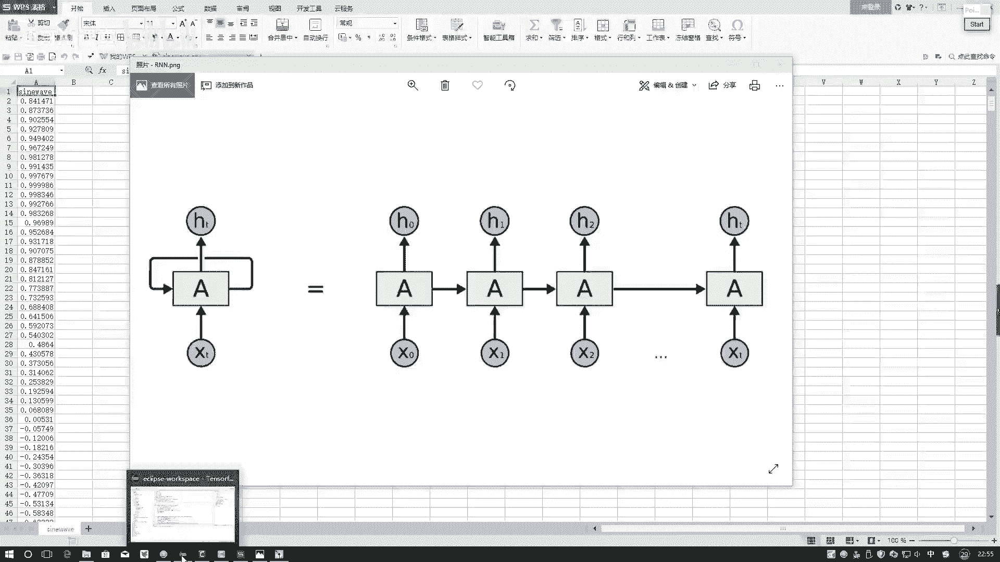
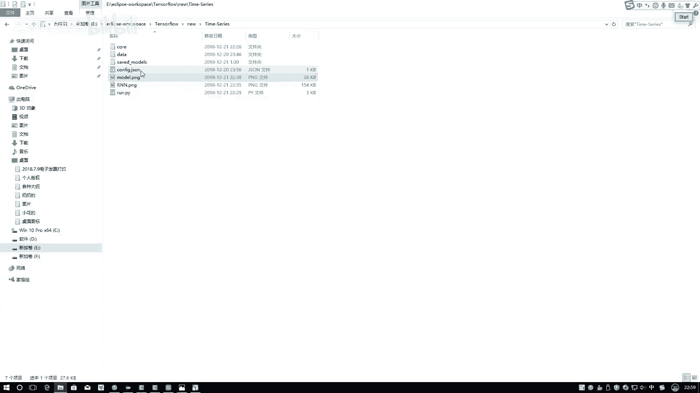
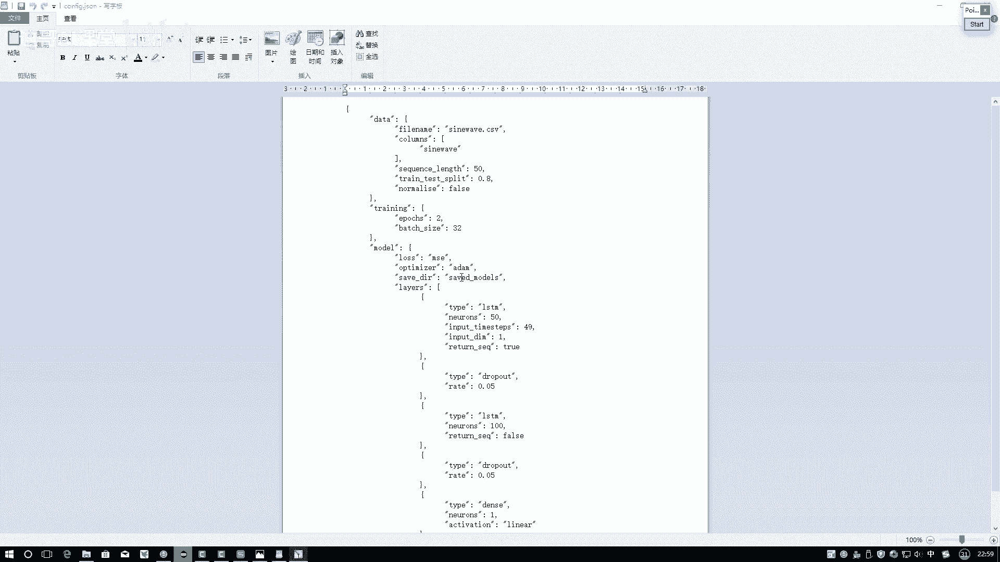
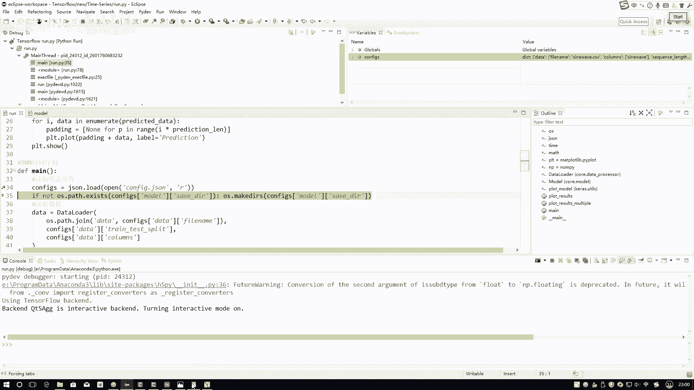
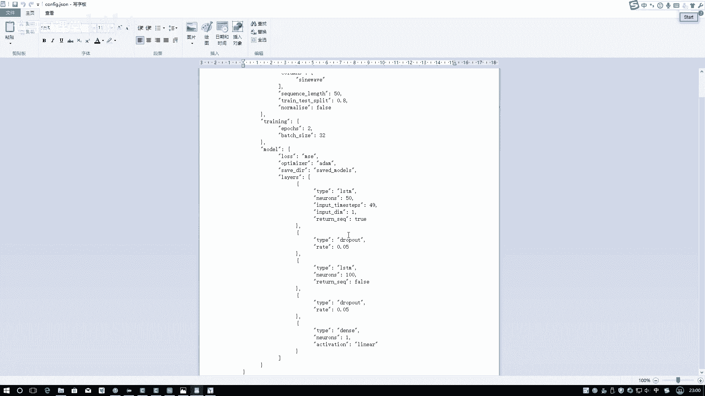
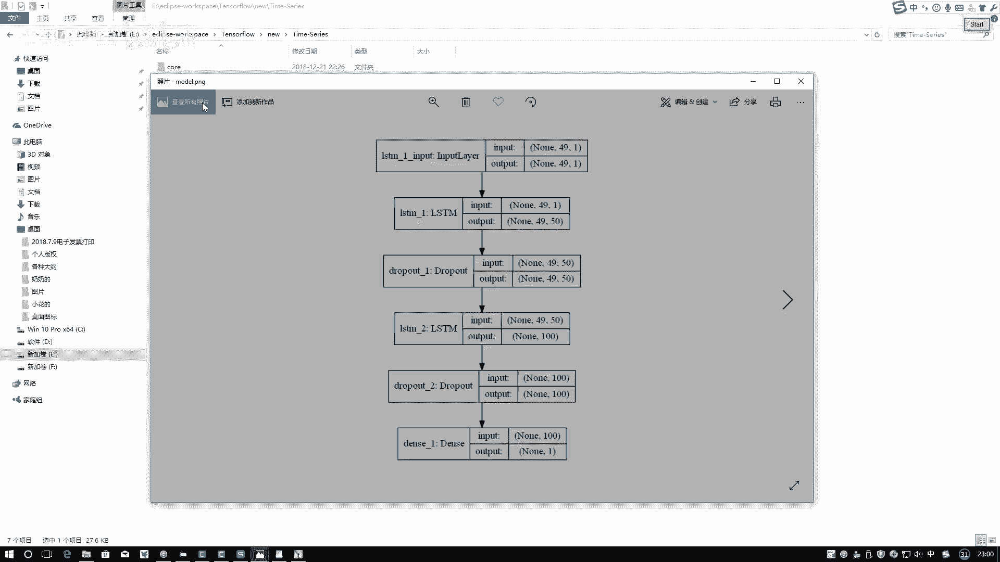
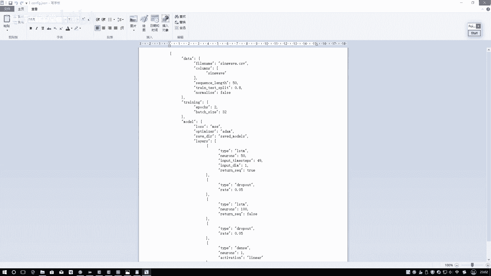
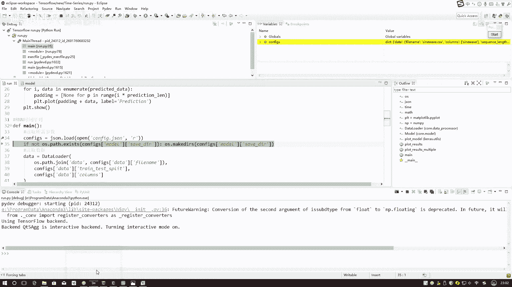

# B站强推！基于Python机器学习的金融分析量化交易实战居然被同济大佬老如此通俗易懂的讲解出来，三小时即可吃透！ - P65：2-网络结构与参数定义 - 迪哥AI课堂 - BV1hZ421W7u8

然后行啊，事儿已经给大家说完了，接下来按照咱们常规常规这个做法怎么做，所以大家从头到尾debug，看一下我们的一个整体的一个思路，是长什么样子，在我debug之前，我建议大家看第一个事。

就是我们的网络结构图呃，这个网络结构图还是在这里，到时候大家在执行代码的时候，你可以自己先去run一下，在转的过程当中啊，这里我们来看呃，在这块有一个函数是吧，叫做一个pro model。

它会把你的网络结构图画出来，所以啊它是在你写完代码之后，定义好了模型，你才能把这个东西啊给它画出来，这里啊咱直接来看吧，首先我的一个输入啊，这里我定义成个49。

就相当于每一个type type值就是一个序列，它是49的，然后呢这个一表示什么，表示着它当前是一个值吧，这是我的一个输入啊，然后呢我经过了STM网络，在这里啊，你看我写个L1，我写一个L2。

我们堆叠这个STM，它相当于就是RTM，相当于是RN的一种变形体吧，它加入了一个记忆和遗忘的一个模块吧，在这里啊我们就暂时把它当成RM模块也可以，然后呢这个L1L2相当于什么，我不光堆叠一层吧。

我可以堆叠多层，首先我第一步先把这一个值哎我转成什么，因为这是一个中间结果，可以转换成一个50维的一个向量吧，但是在这里啊大家需要注意一点，就是嗯当我们在输出的时候，可能大家需要注意点。

有些时候我们需要什么，有些时候我们只需要最终的一个结果，HT是不是就足够了，你说这个H0到H2呃，到到HT减一吧，这中间结果我们需要吗，很多时候都是不需要的，这个到时候大家根据我们自己。

实际任务去指定啊，这第一步我得到了一个中间的一个销量结果啊，这是他这个四十九五十的，接下来照泡的，这就不说了，下面一层我再加上一个STM，把它干什么，再转换成一个特征吧，50枚，我觉得可能还不够了。

此时输入是不是四十九五十啊，这个50表示什么，这49先表示什么，49个，我的一个时间不长，TAPTAP值50呢，每一个时间不长，它就不是一个值，而是转换成50维的一个向量了，下面我转成什么。

转换成一个100维的一个向量吧，在这里啊，100维的向量，但是啊大家注意点这个100维的向量，你看它是什么，它前面还有这个49吗，49表示什么意思啊，咱们回到这个图当中来看一下。

首先哎这里首先第一个位置，你看你所有中间结果是不是可以拿出来，在第一层L1当中，我们是不是把每一个中间结果都拿出来了，但是呢在第二层我这个L2当中，这L1至L2在二当中我取了什么。

是不是只取最后的一个结果，没说把所有的时间不长都拿出来吧，相当于什么，相当于啊第二次，那第二次相当于是快，就就是LTM当中最后一层呗，最后一层当中我只要它的一个输出结果。

所有中间结果对我来说我是不需要的，只需要一个最终结果，那一个向量就可以了，那最终啊是不是说我现在我输入了49个，时间不长，我想预测一下，就是输了是零，别别别直接写49了，输是零一点点点点点，一直到49。

是不是，然后呢我需要预测什么，第50步等于多少吧，所以说最后要预测结果是什么，相当于是一个回归任务，要预测一个值吧，在这里一个值我们最后连了一个全连接层输出，结果是几啊，就是一个一维的吧。

一个一维的相当于什么，它就是一个值，在这里这个值就是我们进行了一次预测任务，去测一下基于当前的这么一个序列，看一下下一个时都就是下一个呃，时间不长，它的一个值是等于多少的，在这里啊。

建议大家通俗解释了一下我们整个网络模型，它从整体上的一个定义，接下来我们要做的事情其实很简单，就是按照我们定义，按照该压的数据，以及呢梳理一下我们整体要做的一个东西，咱把代码给它写出来，这就OK了行了。

咱们来看吧啊，在在这里还给大家介绍另外一个东西呃，首先咱进入debug模块吧，然后一然后边进入边给大家说，在这里啊，就是这是我们的数据，这是我们整个的一个文件夹，叫做一个time series。

我们时间序列，还有这个configure点JASON。

我们点开啊，看一下在这里呃，这个有点小，是不是没关系啊，小小吧，我们直接来看吧，第一个就是在这里我们所有的一些参数啊。

还有网络结构的定义全是在这里进行，就是填在这里进行嗯，展示的，我们可以先执行一下，第一步，我用JASON点load一下，相当于要我去把它读进来，是不是你看叫configure，点JASON是吧。

我先读进来给大家看一下它是什么，首先啊它是一个字典结构，把我所有这个东西按照字典格式读进来了，我看这里啊，这里看有点小，咱在这个TXT当中去看吧。

首先你需要指定一些东西啊，这个到时候大家可以暂时先不用去改啊，等后续你要用的时候，你可以再去改，首先你的一个data，你的一个文件夹的一个名字，在这里，名字里的已经给大家写好了，然后呢序列的一个长度。

还有呢我们数据集的一个切分，在这里都写出来了，训练的时候做几个epoch，每一个epoch它的一就是每一次迭代，它的一个半ch size都写好了吧，这个任务啊由于比较简单啊。

所以说咱两个epoch就已经足够了，接下来写网络模型，你的一个loss function回归吧，然后呢优化器模型保存的位置，下面定义网络的层。

定义网络层，你就这样保罗这个层，你点开打开这个model。

点PNG打开这个东西，然后呢再对照着再对照着这个来，咱就可以来看一下他俩就是一个事吧，我把它移右边吧，呃这是这有这点障碍行，这样能看到他俩就是完全按照这个去写的，首先第一个层是什么，是LSTM层吧。

第二个层什么招ROPOUT，招PO完什么又LSTM吧，最后又招P最后一个全连接吧，参数都是对应起来的吧，第一个STM输入的一个时间不长，49吧，输入的一个维度都是一个值吧，然后呢它中间那个隐藏成员50。

表示着我要得到50维的一个向量吧，下面下面再连LSTM，再连STM当中，你看我指定了一个东西，这是什么return什么一个序列吧，指定成true相当于什么，哎，为什么这块指定是true啊。

主定成true会得到什么东西，在这里这东西指定成true得到的是什么，这个东西吧，四十九五十会把整个序列，所有的结果都返回回去吧，你看再看下面这个，这是L1，这是L2，我指定成一个false。

返回的是什么，就是最后的一个值吧，所以说啊当大家到时候自己玩的时候注意点啊，你中间的时候就是这个东西，反正得跟你自己定义来哦，你看你这一块它是中间结果，你想把序列全部返回去的时候，你把序列执行成处值。

到最后一步的时候，你说前面中间结果对我来说没啥用了，指定个false，只要是最后结果就可以了吧，最后连全连接层，全连接层输出结果是几啊，回归任务要预测一个值吧，最后是一个一，这是不是就完事了。

这个啊就是我们这个嗯configure呃，呃就是configure jason当中啊，它是怎么去定义的，定义了一下，我们一会儿啊要训练网络当中啊，所有的参数在这里去写了。

到时候大家如果说你想把这个结构进行改变，你可以用这种JSON格式，或者用命令行输入参数的格式，或者直接这里在代码中写好都行啊。

不限制我们自己去定义任何的结构啊，这个只跟大家说一下。

