# B站强推！基于Python机器学习的金融分析量化交易实战居然被同济大佬老如此通俗易懂的讲解出来，三小时即可吃透！ - P66：3-构建LSTM模型 - 迪哥AI课堂 - BV1hZ421W7u8

行了，第一步把我的所需的所有参数啊都拿到手了，下面接下来咱们第一步。

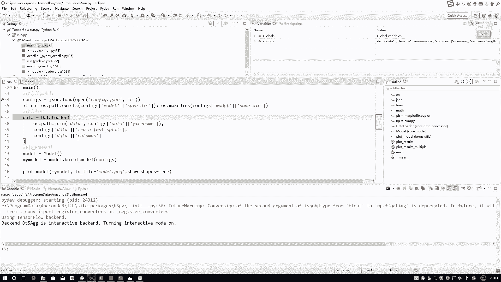

是不是我先得把数据读进来啊，咱这个数据data文件夹下。

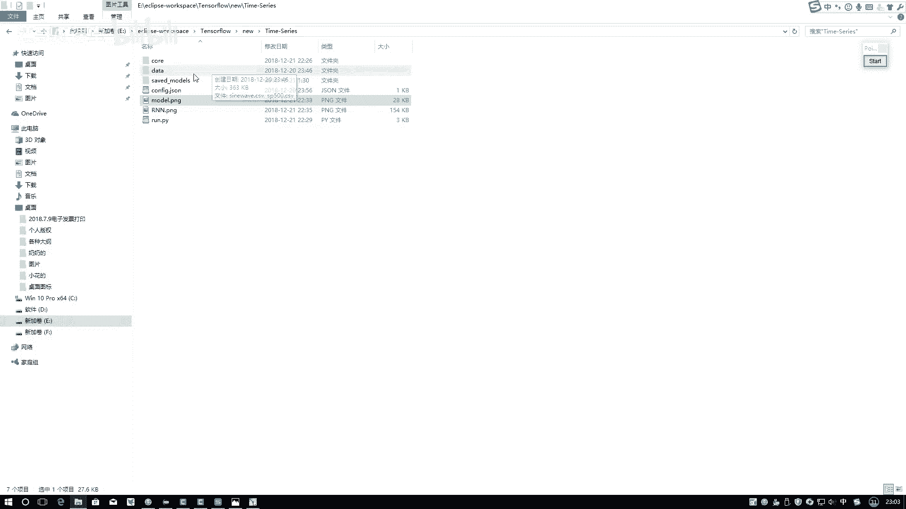

是不是有一个我们的正弦的一个曲线，这个点CSV啊。

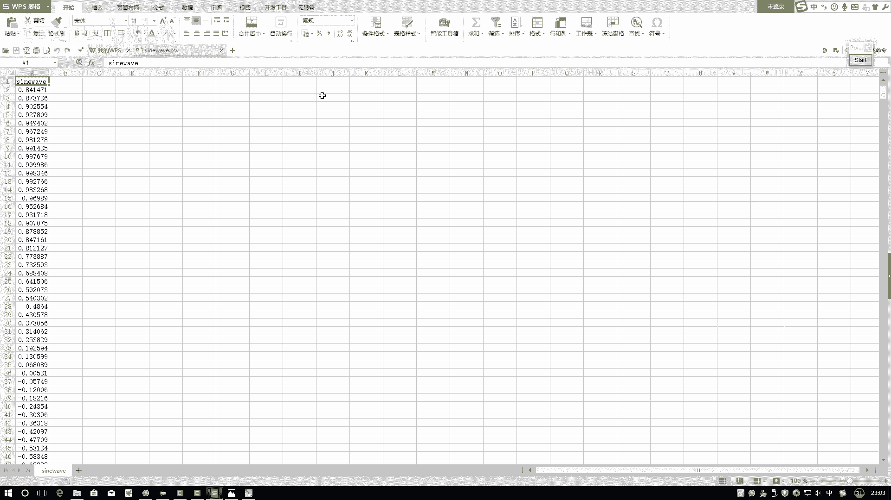

咱呀就通过它把数据先读进来，在这里我们F5跳进去啊，怎么跳，这来了哦，我先走出去，这个跳到一个工具包当中了行，然后在这里先进入到我们的数据预处理模块。

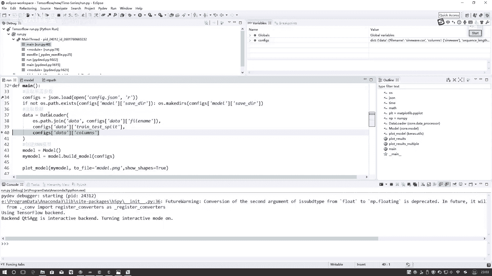

注意点啊，就在这里，我VRR当中啊，还有什么还有工具包啊，工具包当中有一个数据预处理，在这里啊。

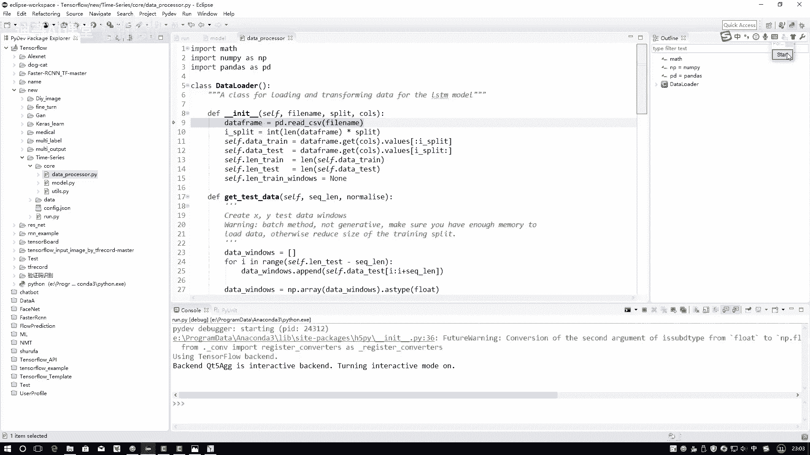

是先进入到数据预处理模块下，在这里我们要去对数据啊先进行一个读取，首先用pandas点RECSV指定好它的路径，先把数据给它读进来，读建数据，data frame格式，第一个它是索引。

第二个是它的一个实际的值吧，这是我的一个数据，一共呢咱有5000条数据，首先第一步要把我的数据集切分成测试集，还有训练集切分的一个比例，随意啊，在这里咱先按照呃0。8作为训练集，0。2作为测试集。

那也就是四千一千这样一个比例好了，电影顺序当中，这就是我们前4000个数据，在这里你看通过一个索引从冒号到4000吧，先把前4000个数据拿过来组成一起，这是一个序列吗，这是前4000个数据，然后呢。

这是后1000个测试的数据，完事了，你看这个哎值呢4000，这值1000。

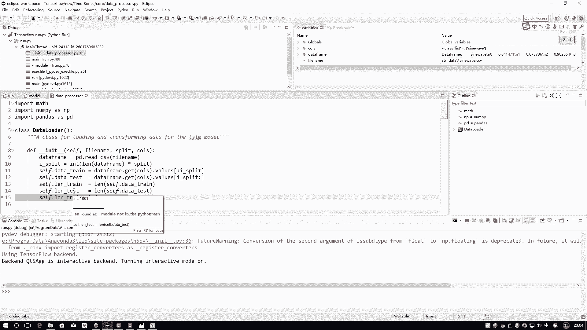

完事儿了吧，这是我们当前我的一个数据行了，先把data读进来了啊，这是我的一个数据读好了，接下来我们先在这里要去构建我的一个模型了，构建模型过程当中啊，先指定好构建模型的方法。

接下来啊这里这个model注意点，我自己定义了一个类啊，在这个model当中有很多实现的函数，就是首先我定一个model，这个model用一个序列的模式来进行定义，就是点ADD点二的。

咱一会儿往里一顿去加这里边这些函数啊，一会儿咱要去用核心的就是这个build model，在这里我们跳入到就是先把这个类实例化出来，用这个类去调用我build model这个方法。

并且把我所需要的所有的配置参数传进去，就可以了，来看一下，在这里啊，你可以指定它需要花费的时间，指不指行都行，这个好，首先第一步，第一步我要去创建什么，创建层，就创建我的一个呃网络结构吧。

在创建网络结构的过程当中啊。

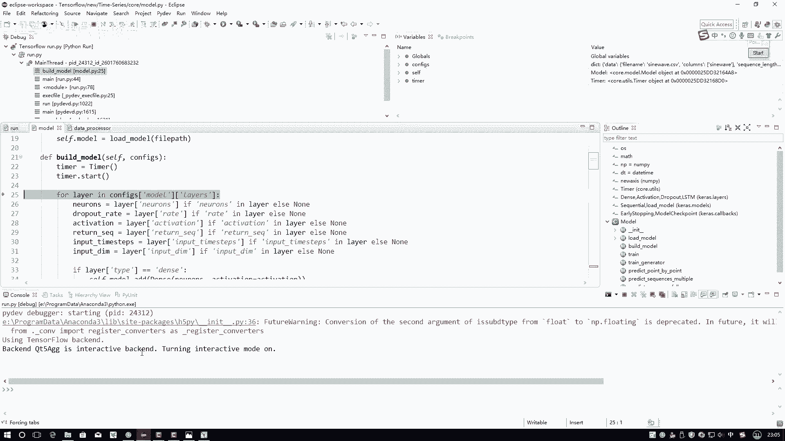

咱是不是说所有结构的定义写到哪儿了，写到了这个configure点JASON文件当中吧，这篇当中你看这个model里边是不是有layers啊，layers是不是按顺序去写的，第一层LTM。

第二层JPSTM全连接是不是是按顺序写的。

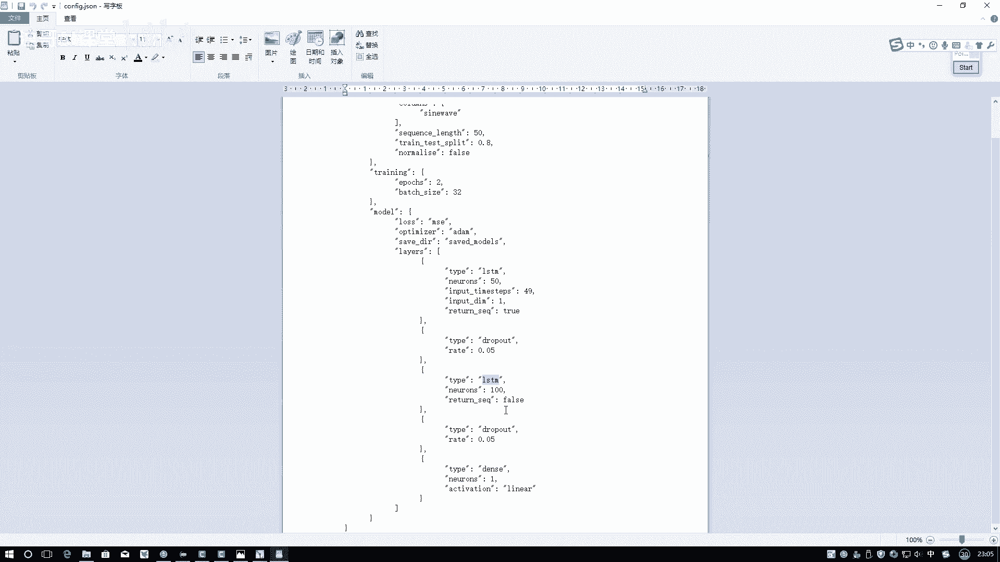

按顺序去写的时候，你就可以for循环一个一个调用了，首先在configure当中，models你看在这里找吧，configure当中models layers当中第一个什么TM吧。

所以说第一个层你看这里也写了STM，50个神经元时间不长，49每一个输入它都是一个值，返回所有序列为true，这是我当前所需的参数吧，用这些参数我来构建网络，这就可以了，首先第一步拿拿参数。

第一个参数隐藏车间数量等于50，先拿到手招pot啊，这个这个这个值啊，这个值没指定是吧，没指定，咱在这里先暂时用一个乱值来去，当然后呢激活函数这里也没指定，这个是个数值，这是49，这是一个一。

咱现在等于是定好了吧，如果说在这里进行了判断，因为啊咱们那个JS当中啊。

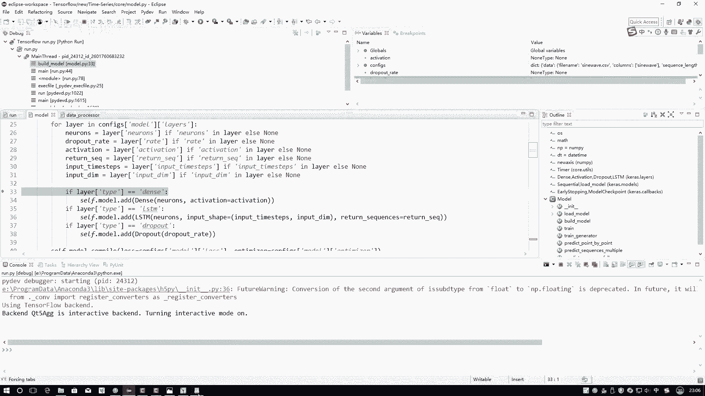

有三种格式吧，RSTM第一种招炮的，第二种还有一个全连接。

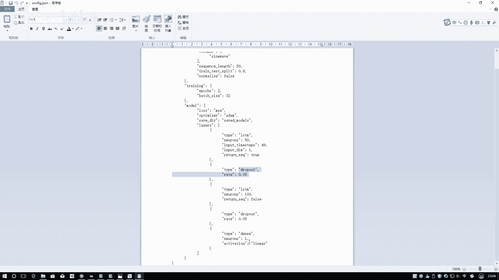

第三种是不是，如果说它是什么，在这里往下去判断，第一个判断应该是STM吧，那我就把LTM网络加进去，这就可以了，这RTM在哪来的，在这里它呀给大家看一下位置就可以了，在这个位置当中啊。

有这里KOS当中啊，类似当中你可以直接把STM调进来，到时候大家如果说你对这个东西啊不太熟悉呃，咱可以回头啊翻一翻人家API文档，这点我就不给大家就一个去看了，那直接来用就可以了，选指定几个东西啊。

第一个东西隐藏成全员数量是50，你input一个shape值在这里啊，input shape值，注意谁在前面，谁在后面啊，input step值就是time step，我的时间不长，49在前面。

然后逗号这是几啊，一吧是我像我刚才说的，咱跟当前构造的一个数据结构应该长什么样子，接下来指定好要返回全部序列的一个结果吧。

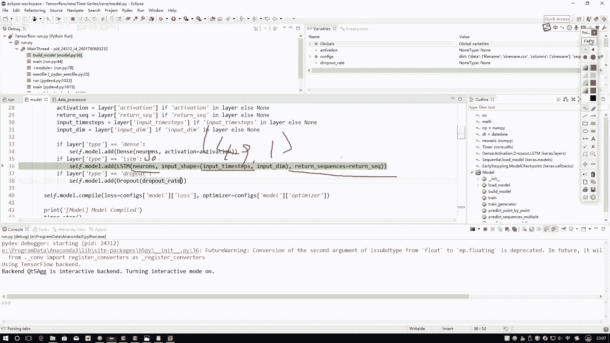

现在第一个层是不是加完了，第一层加完之后加第二个层，第二层当中叫什么，看一下列表当中有照pot吧，此时有照PO的，那前面这些东西都是乱值吧，只有招炮这个东西有值吧，等于等于就是你到时候自己来设置吧。

看什么值合适，在这里啊，就是暂时随便写纸都可以的，这个任务比较简单，如果说是任务比较难了，还得自己慢慢来去调一调这个东西行，然后在这里照pod，跳到这里是不是加上一个照pot就完事了啊。

在这里加上了一个照pot，第三个层又连STM吧，又连TM是不是还是重新走一遍啊，在这里又走LSTM吧，最后一个层是不是也一样的，相当于啊在你的JASON文件当中，你把所有的结构都列好了之后。

它呀就会一步一步去走，这就完事了，这一步咱就走完了，把所有层都定义好了吧，定义好了之后，这个model当中啊，现在我是不是说最后的时候我ADD完最后一层了，咱整个结构就出来了。

出来之后定义一下我训练的一个方法，loss function自己来去指定一下，在这里是不是用MC去做的奥特曼ZOR，用ADMAM去做的吧，行咱现在就已经做什么，咱现在就已经把这个模型全部做好了。

然后这一块其实这样就是你不返回啊，这个cf点model啊，其实也行啊，在这里，因为我是直接的去build了一下这个model，我是在这里啊，直接都就是把这些东西都写完了吧。

server model直接艾特进去了吧。

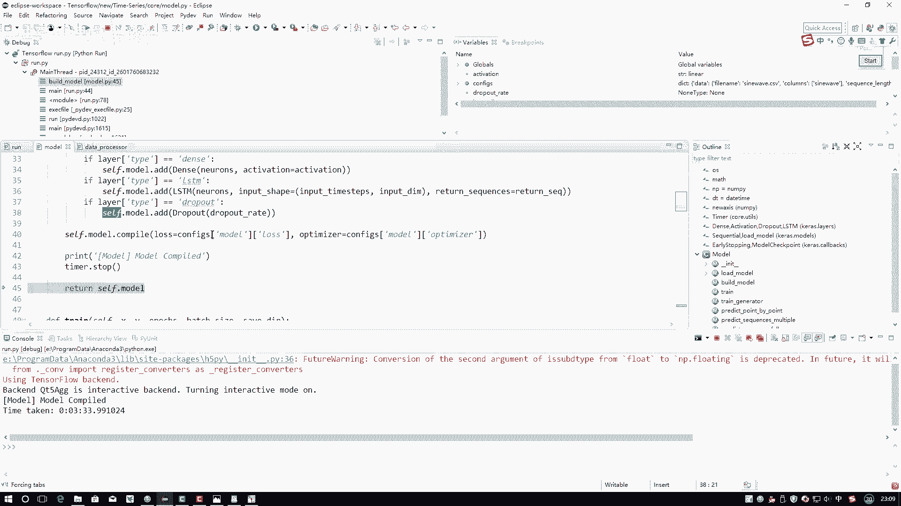

return回去啊，他是为了这个东西啊，你看return回去，我为了指定一个值，叫一个my model，我是为了画图进行操作的，如果说你要不进行画图操作这个东西啊。

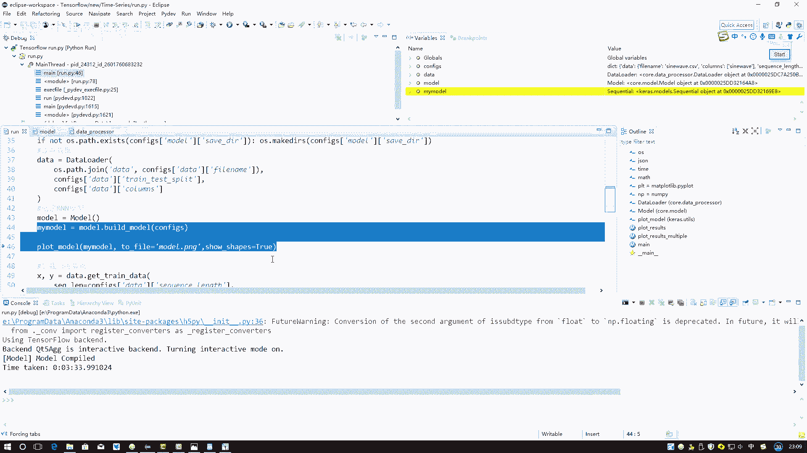

这一步其实你都可以省略掉哈，也也是可以的，在这一步当中，但是我们要画图，所以说那把这个model传进去。

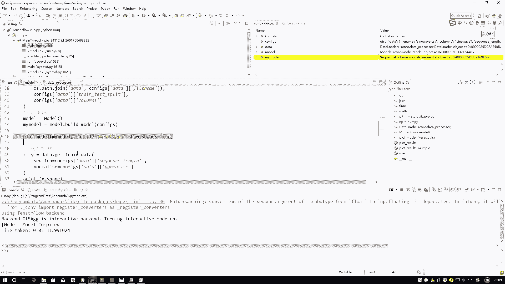