# B站强推！基于Python机器学习的金融分析量化交易实战居然被同济大佬老如此通俗易懂的讲解出来，三小时即可吃透！ - P69：6-股票数据预测 - 迪哥AI课堂 - BV1hZ421W7u8

接下来我们还可以把这个LTL网络模型，以及我们刚才说的咱们时间序列怎么做用，用到一个真实的数据当中，比如说啊，咱们现在给大家打开的这个股票数据嗯，谢谢大家看一下吧，这股票数据当中啊有几个指标呃。

估计大家应该大概也都玩过这个东西吧，第一个是我的一个开盘价，然后呢最高价最低价以及啊收盘价，还有一个交易的数量，这个就是我们现在拿到几项指标，哎，之前咱们说在做时间序列的时候，我们之前传进来的数据。

它是不是对于那个正弦函数啊，它是不是只是一个值啊，那对于这里边来说，是不是说现在我们能应用的一个条件更多了，尽量能够更丰富一些啊，一会儿啊我会给大家演示一下呃，怎么样去用一个单特征，还可以用多特征啊。

一起来去做这个时间序列，然后呢这个数据啊，可能大家觉着哎呀股票市场我真能够预测出来，接下来它的一个实际的走势吗。

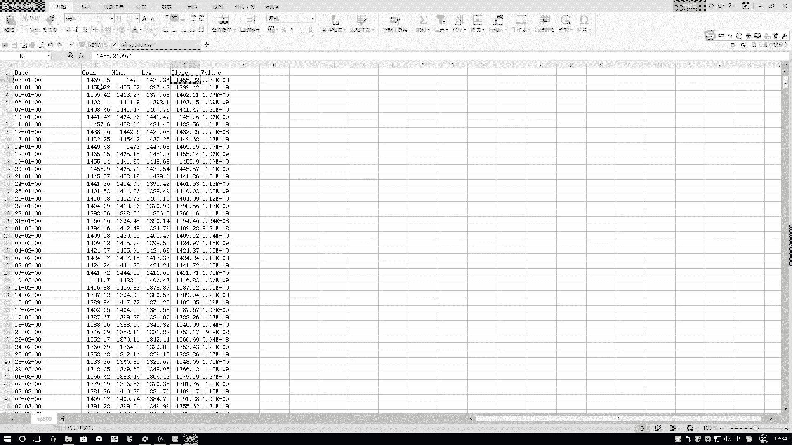

现在大家看一下它的大致的一个结果图吧，哦在这里嗯我点开看一下啊，这个啊这个大家先不用管啊，这个预测的，因为这个预测相当于是做了简单的一件事，我们就看一下股票大致的一个走势，其实按通过它的走势可以看出来。

基本上没有什么太大的一个规律吧，不像咱们之前所说的那个正弦函数，那个正弦函数啊，基本上就是按照这个规律，按照这个模式去做的，所以说啊你要机器学习，学习起来时候还比较容易。

但是对于啊这些没有一些实际规律的时候，你让他再去做预测，尤其是再让他去做一个长序列预测，比如说在这里下面咱们要做一个呃，就是跟咱们之前方法一样，也要做一个从当前这50点开始，让他接下来预测后50个点。

它的一个走势预测，结果可能来说效果不是那么特别的好，这个给大家演示了一下基本它的一个效果呃，咱们这个问咱们这个问题啊，不光是要给大家解决啊，什么股市预测的问题，主要给大家说一说啊。

就是当我们拿到了一份实际数据之后啊，我们该怎么样定义模型哎，怎么样把输入和输出啊给它做出来，这个是我们重点，到时候啊等大家拿到自己数据之后，我们再再做一些其他的处理操作。

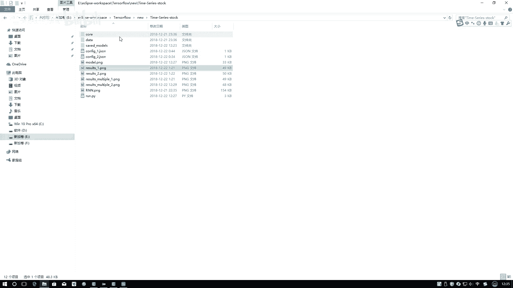

这些都是需要去做的，我们先说第一点，我们来观察一下以前啊我们说那个正弦函数，它是不是说它的取值范围都在一定范围区间上，然后来进行一个浮动的，但是呢对于我们这个任务来说，它好像有点特别了。

你看这个任务来说，它里边取值范围不是那么特别固定吧，浮动啊有些时候比较大，有些时候比较小，那你说我们需不需要对数据做一些。

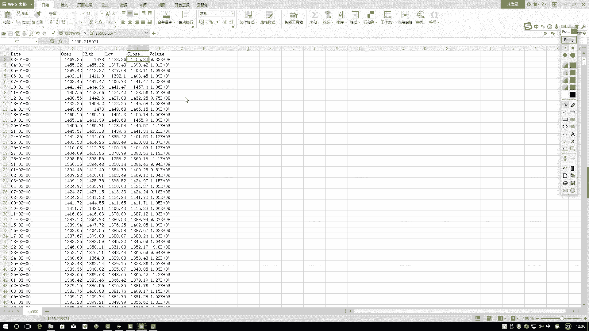

预处理的操作呢，这个反正我现在也不知道啊，咱们来试一试吧。

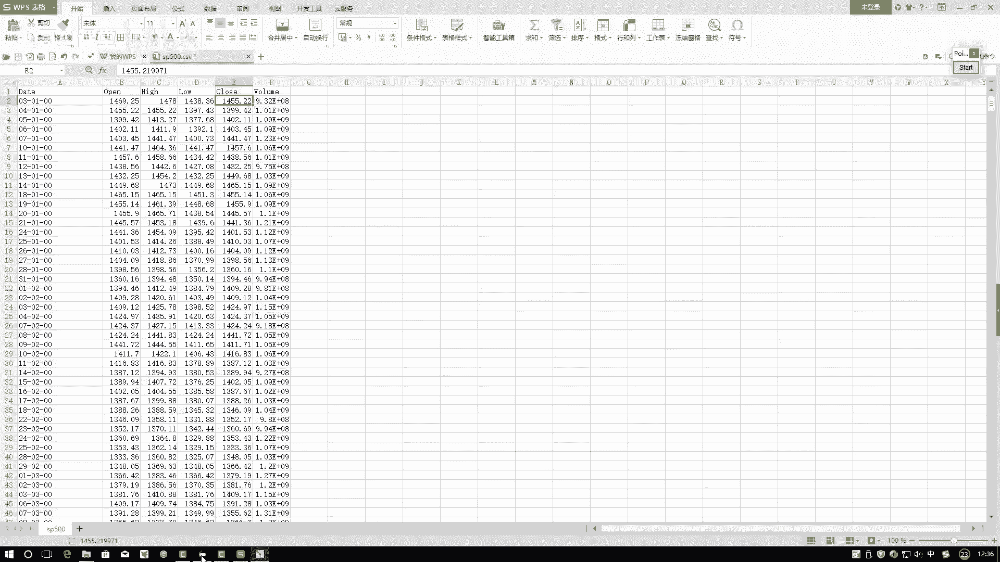

在这里啊，咱们先把这个代码打开啊，然后有一个点就是在这里。

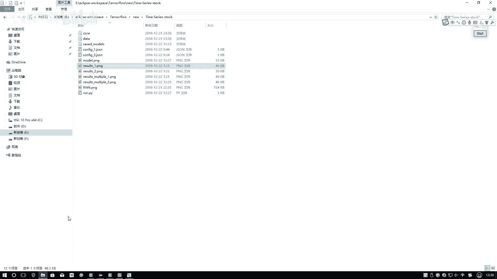

我重新写了一个configure，1config2，我点点开给大家看一下，这里边你看就是改了几个东西啊，首先就是我的这个嗯用的一个文件改了，我们不是用那个正弦函数那个数据文件了。

而是要用实际的某一个股票，在一定时间内它的一个走势的情况啊，这个点CSV文件，然后呢我选择当前的一个列嗯，咱们这样啊，就是这个CONFIG1列，我只选只用这么一列数据。

然后呢那个CONFIG2里边我们再用两列数据，咱们先说一列数据的情况，这是一列数据啊。

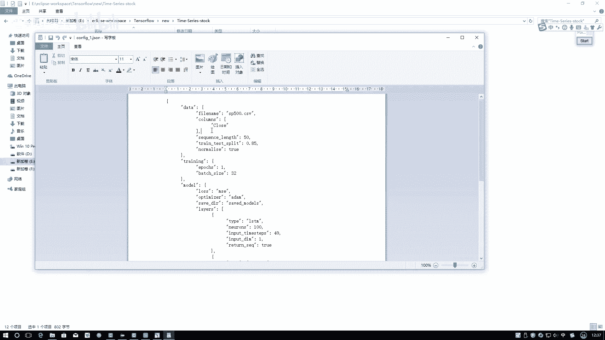

选的是close，哪个列，它的一个指标就在这里啊，咱们现在用的时候，我只用这一列东西。

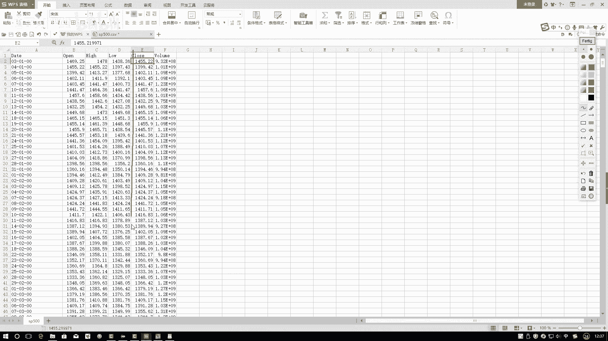

其他呀我暂时不去用啊，这个意思，然后呢再往下来看。

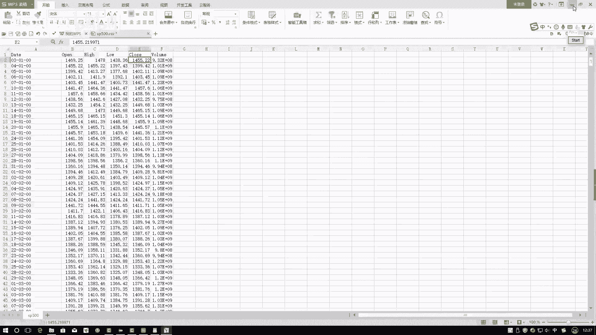

下面做了一些东西嗯，做些东西当中啊，这一块这些都跟之前一样啊，网络模型也跟之前差不多，整体网络模型啊比之前的一个区别，就是原来你不是L1L2吗，现在好多了一层，多了一个L3啊。

多了一个LTM网络相当于多了一层，这是LTM1LTM2，然后LNTM3啊，这个意思，然后呢注意一点啊，在这块我多加了东西，咱们之前啊在说那个正弦函数的时候，是不是没说有规划这个事啊，在这里啊。

我把归一化这个东西指定成一个处值，这样咱先不为它指定成处值，我现在给它指定成一个false值，再来看一下这个东西啊，它的一个结果会长什么样子，我指定成一个false保存一下。

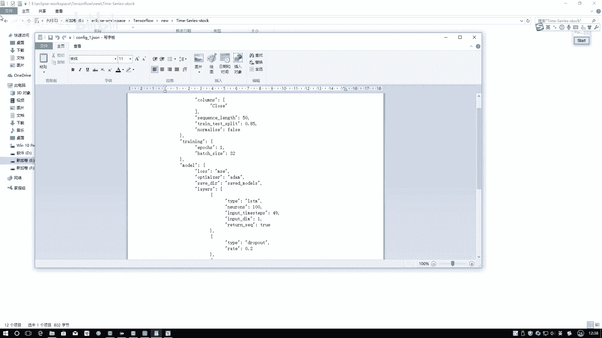

然后呢咱们来运行一下，这是CONFIG1是吧，然后呢在这里我把它改成个一呃，就在这一块，大家到时候大家自己做的时候，你用哪个配置文件，你把它改成哪个名字，我就改成一了，然后我们来运行一下。

咱们可以来看一看，如果说呀不做一些预处理，直接拿原始数据去做。

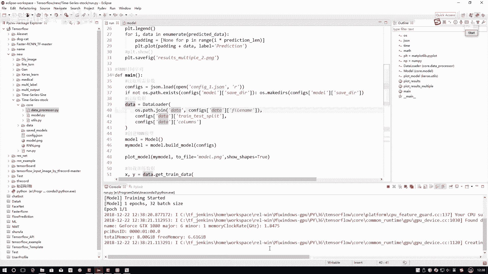

咱可以观察一下这个loss的变化，大家可以看这个lost怎么样啊，特别大的一个损失吧，这个就是咱不光损失比较大，而且你看收敛收敛的也是不是比较慢啊，这个损失大，因为什么，因为我们是用MSE去做的。

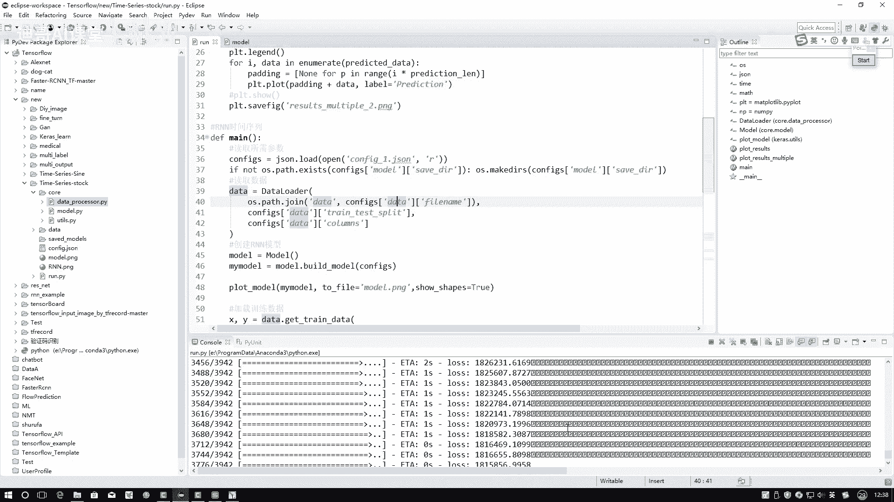

越大的数值肯定相对来说loss越大，咱们这个就是对于回归任务来说啊，不像你的分类任务有准确率，你可以直接来进行对比，在你回复任务当中啊，由于它是一些数值在做计算，然后得到它的一个loss。

这一回啊就是你数据当中数值越大。

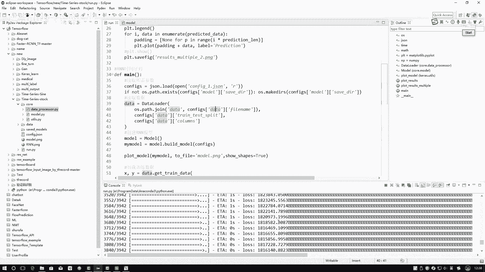

那肯定得loss值也偏大嘛，这个只是一个相对的，大家不要觉着一看这么大的数。

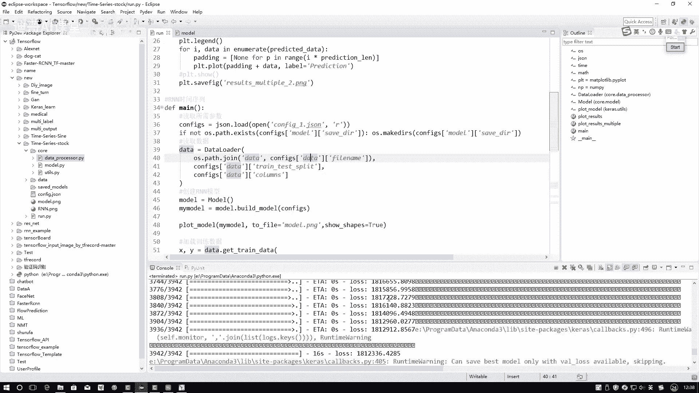

我觉得它特别烂，其实都是相对的一个过程啊，然后再来看看结果呃，下面它这个运行完之后会给我画，会给我保存两个图啊。

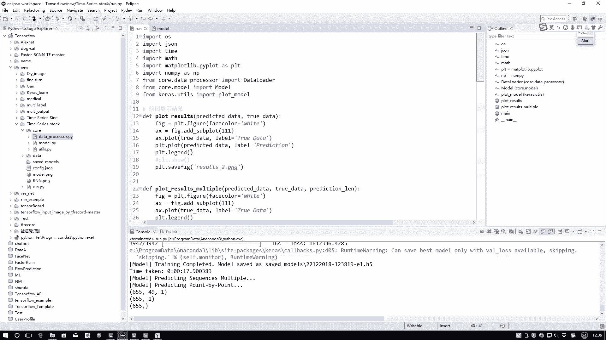

一个是result杠二啊，一个是这里，这就就是这个东西，我先给大家点开来看一下吧，这个呃一会跟大家说，我们有两种预测方法，这里边你来看一下它的一个结果，实际的数据TRUDA是这个蓝色的吧。

我预测值呢竟然预测成了一条直线，说明什么，说明这个事我做的是不是不好啊，网络上什么都没有去学到，为什么，因为我现在拿到原始数据当中，你看到这些数值浮动的范围都是比较较大的吧。

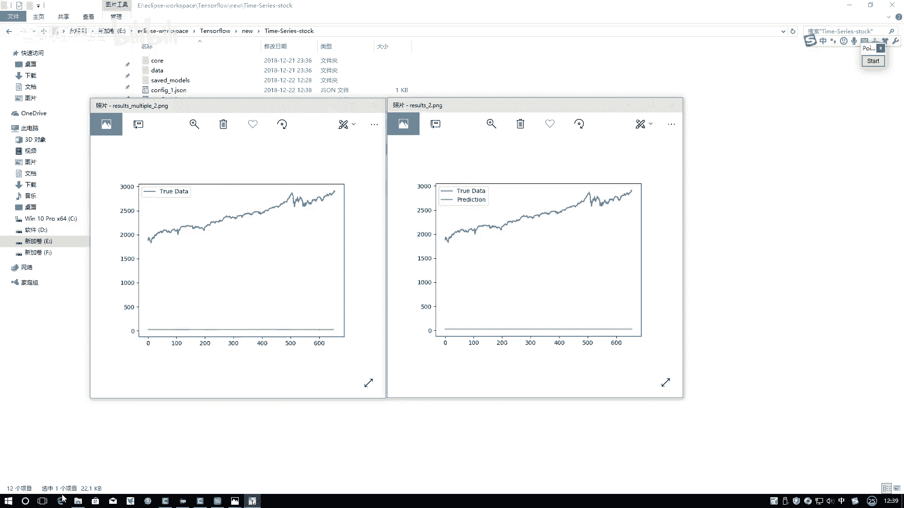

而且啊没有这样的一个具体的走势，感觉给我的感觉像是一堆随机数似的，是不是，那你想我怎么样能看出来一点走势啊，是不是说有走势，这个东西应该是一个相对的一个概念，比如说我们说我们学习我学习。

我说我第二天比第一天哎进步一点，进步了10%，第二天比第一天又进步了20%，第三天比第二天又进步了30%，是不是有这样一个走势啊，那在这里啊，当我们拿到一个时间序列任务的时候。

也需要啊对我们的数据进行一些预处理的操作。

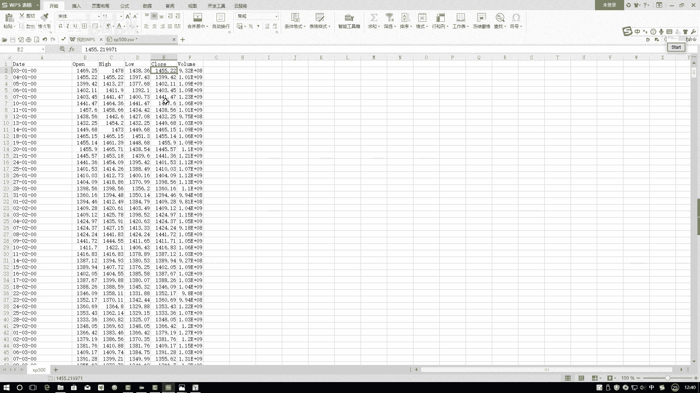

就像我刚才说的，我们可以干什么。

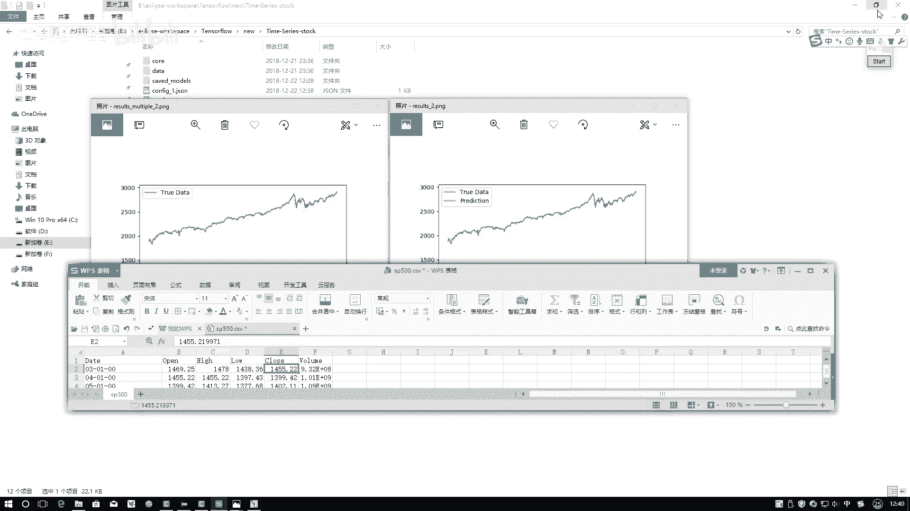

我们可以啊让数值进行什么，进行一个就是呃按照一种相对的情况，如果说你按照这些绝对的数值来看，好像像一随机数，但是按照一些相对的时候，是不是说我第二天的相对第一天的，第三天的。

相对于第一天的有这样整体的变化的趋势吧，比如说在这里我说我取了一个序列长度为50，在这里呢由第一天一直到第二天，一直点点点到第50天，现在我要做的就是，我要看第二天相对于第一天的第三天。

相对于第一天的这样啊，让我的模型能记住一下相对变化的一个趋势，而不是只仅仅看它是具具体绝对的一个值。

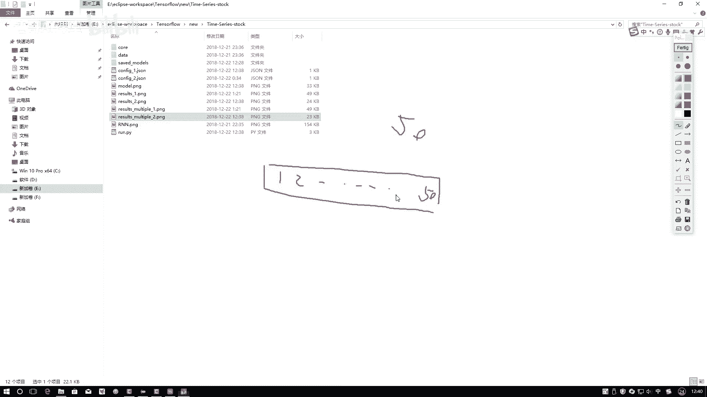

看值啊，给大家演示了它效果不好。