# B站强推！基于Python机器学习的金融分析量化交易实战居然被同济大佬老如此通俗易懂的讲解出来，三小时即可吃透！ - P70：7-数据预处理 - 迪哥AI课堂 - BV1hZ421W7u8

啊在这里我重新的指定一下。

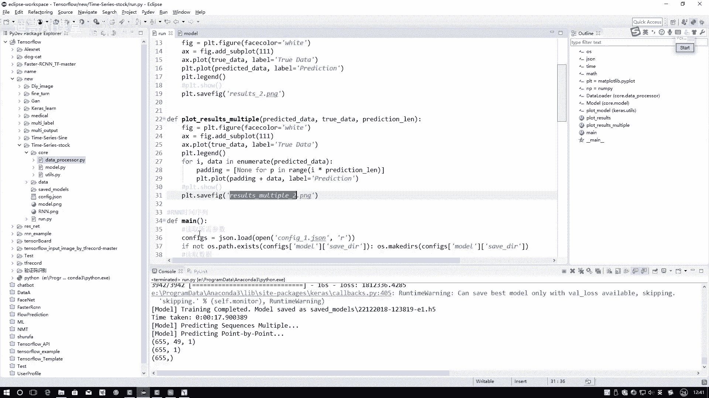

再来看一下，我把这里啊改成一个数值，额改成这个数值，然后呢保存一下。

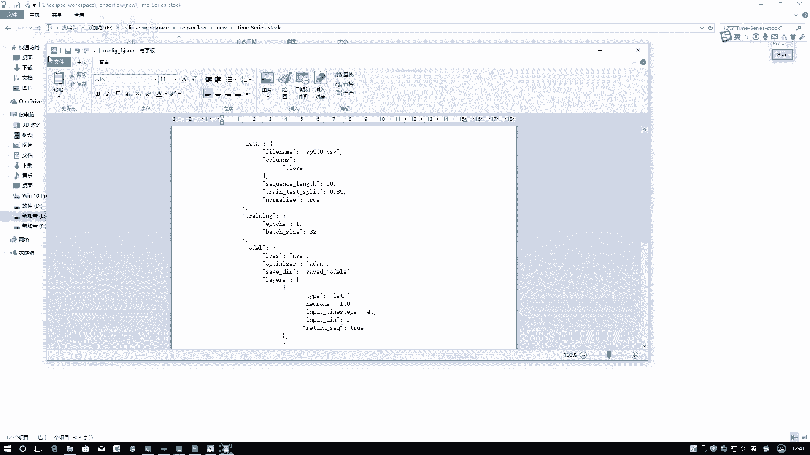

保存完之后，咱们再来运行一下，就运行啊，这样为大家看一下他做了一件什么事，我看下在哪去做的，应该是读数据的时候。

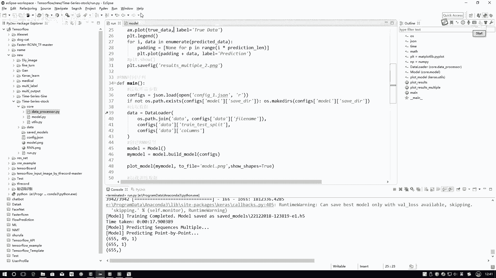

我来去在这块打上断点吧，其实啊就整体数据啊，它的做法都是一样的。

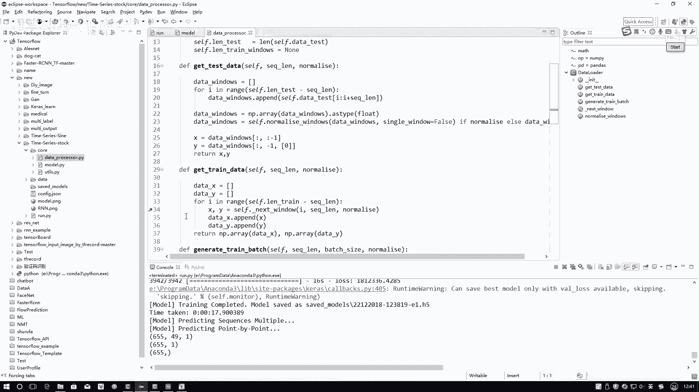

在这里打上断点就行了啊，next window的时候，其实整理代码没有任何变化，只不过说在这里我要加上一个归一化这个操作，在debug看一下他是怎么去做的。

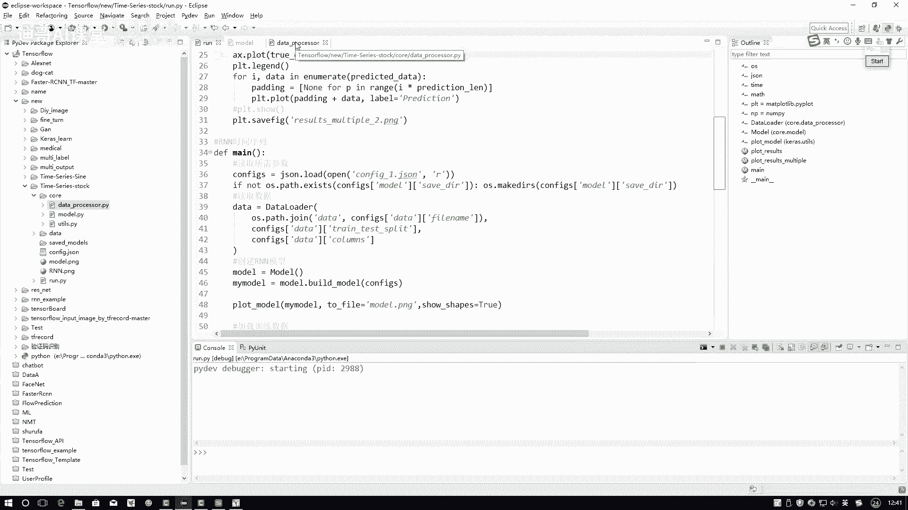

额这个nice window就是之前我怎么取序列都是一样的。

把数据拿过来，然后呢只不过说在我取窗口的时候，这个nice window里边他这块传建了一个normalize，这个东西吧，现在你看它的值是一个处值YF，我跳进去看一下，在这里F5推荐完之后。

首先第一步先把我window大小做好，I等于几0050，还是这样一个序列，这是我当前window把这个序列拿出来，接下来我对有序列要干什么，你看啊这个值是一个数值吧，所以说我要对这个序列做一些预处理。

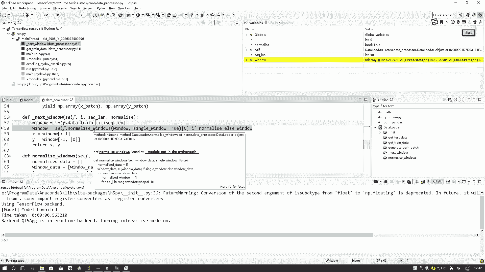

或者说你做一个归一化操作，类似这个F跳进去，在这里我们来看，首先啊他先把这个呃构造一个list，一会啊，要把构造好的数据传进去，然后这里是这样，就是一个single window。

还有一个window data，它是这个意思，就是接下来你要做的时候，你说啊咱现在用了一列，那你做一个归一化，那你说你传进来的数据是两列，是不是要对分别各自列做各自的。

如果说A这个列和B这个列表示两个指标，A表示的可能是收盘价，B表示的可能是交易的一个数量，你要对他俩做东西的时候，是不是分别去做A做A的，B做B的，他俩之间没有影响吧。

所以说在这里啊我们还需要写一个循环。

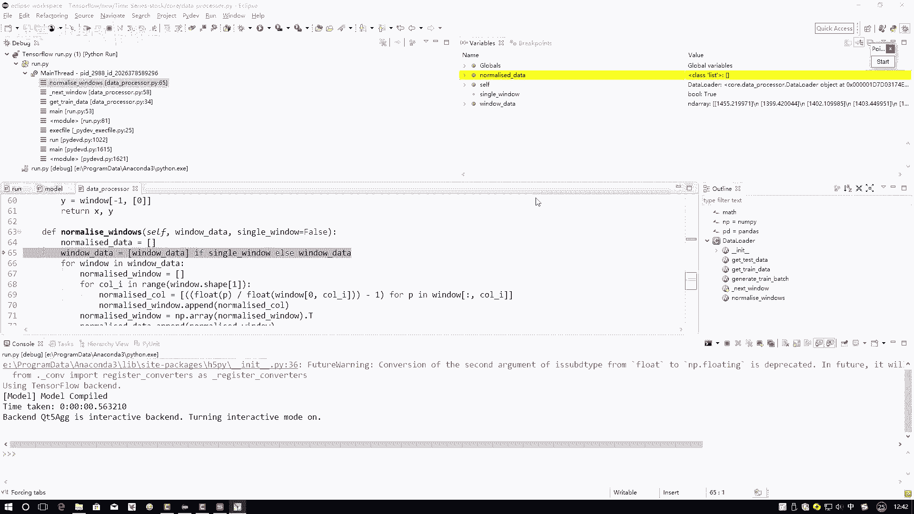

就是呃for window in window data，相当于啊，就是我们现在要对每一个列，分别做这样一个东西，然后呢做完之后啊，不是还没在还没做完，在这里啊我们要做的第一个事，咱们来看这个公式吧。

这个公式啊其实做的很简单，选择我当前这个数据，我当前这个数据当中啊，就是for p in我的一个window in window当中啊，这个指令成零，什么意思啊，现在你看在循环当中，第一次是DIOR。

你看啊for我的一个列in shape，1shape1是什么，shift当中零代表的是行数，一代表的是列数，所以说这里表示的是，要对每一个列都要执行这样一个操作，在对每一个列执行操作过程当中。

我需要取到当前这个列所有的数据，所以说window当中第一尾写上个冒号，表示着取该列所有的数据，第二个取上一个实际列的索引，表示着取当前这个列，那对于当前比如说我们现在只传下一列。

就是对close列当中所有的P表着所有的数据，所有data对所有data执行这样一个操作，首先第一步转换成flow类型啊，叫做一些数值计算，我当前这个数啊，P比上什么。

你看我的window是我当前的这个，我给大家看一下吧，这windows当中是我刚才传进来的这块哪去了，这个window data是吧，这个window在这里呢。

For window in video data，我们把这个一个个序列拿出来了，在当前这50个序列当中取第几个，第零个吧，第零个相当于什么第一个位置，所以说啊这里我做一件事相当于什么。

我每一个值都去判断一下，它相当于我的序列当中，第一个输入它相对变化的一个趋势，它的一个大小是等于多少的。

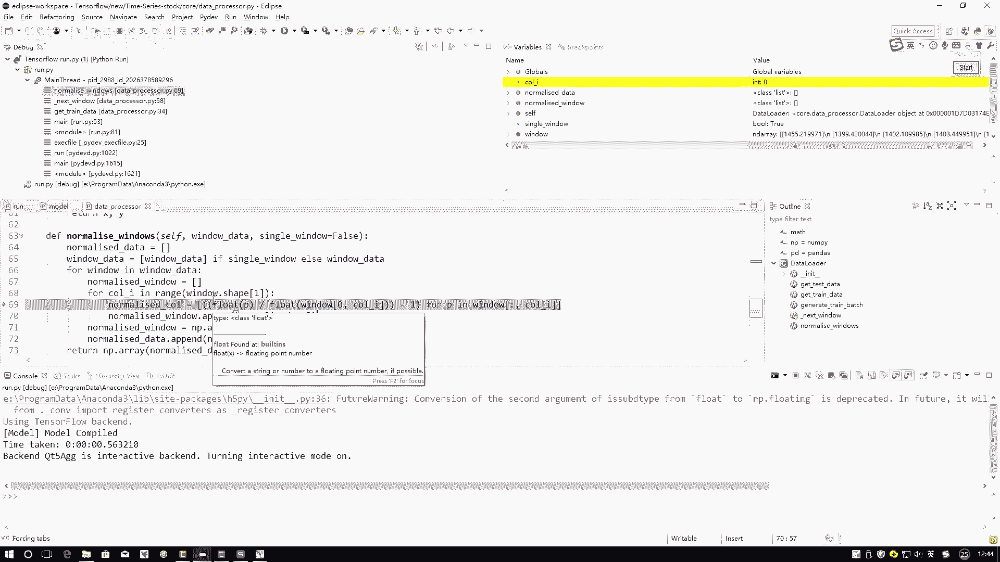

所以说呢你看我唉我F6放进去这些数值，这些数值啊，你看第一个数它是一个零，为什么哎，不要忘记最后还有个减一啊，让我数值变成这都是一个比较小的0。0几，负的0。0几这样一个概念，然后呢，接下来你看啊。

当我这个数值进行相对变化的时候。

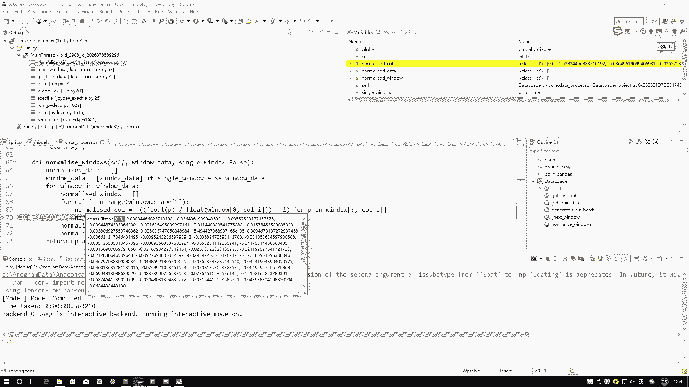

下面这些值都表示什么，都表示我当前的一个结果。

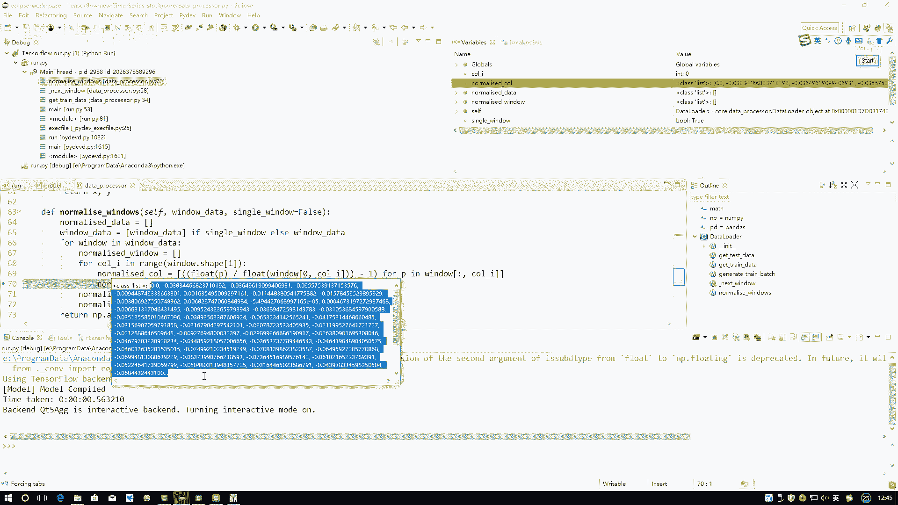

相对于我起始位置它变化的一个趋势吧，这样咱就完成了一个基本的预处理操作，所以说啊，当大家拿到了一份就是时间训练数据之后啊，你还得想一想，我拿到数据之后该怎么办，是不是要做一些预处理啊，你不能啊。

就是对于这些股票数据，你不能让网络看起来像学的，像一堆随机数似的吧，得让他学到什么相对的概念这样一个东西，在这里你做了一个预处理操作，那你说你最终预测出来的结果是什么，你数据长什么样。

预测出来结果就是长什么样，你预测出来结果也是它相对于第一个数据变化，的一个趋势，我们要预测结果也是一个趋势，让网络学到的东西也是这个趋势，所以说啊最终啊你把结果要进行还原的时候，也要把这个结果怎么样。

还原成它最终的实际的值吧，也就是说啊要用它的一个趋势，再还原回我真实的一个数据，这就是他要做的一个事情行了，把这些东西做完之后。

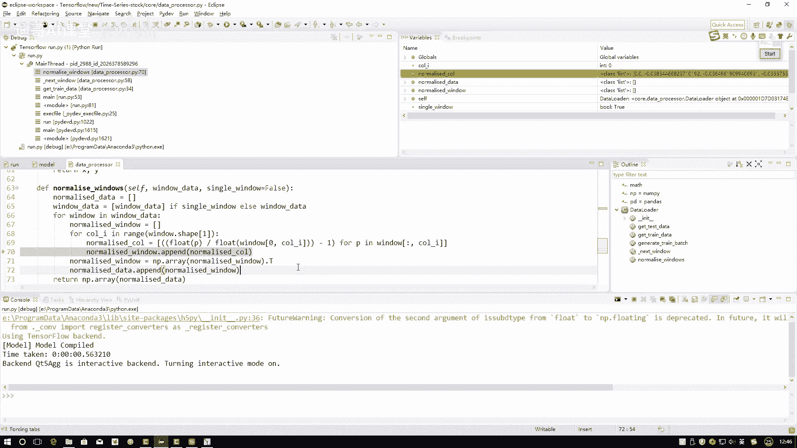

我们接下来啊当这个for循环执行完之后，我们还需要做一个转制的操作，也就是说啊现在你得到数，你得到的一个数据，它是什么，它是一个二维的数组吧。

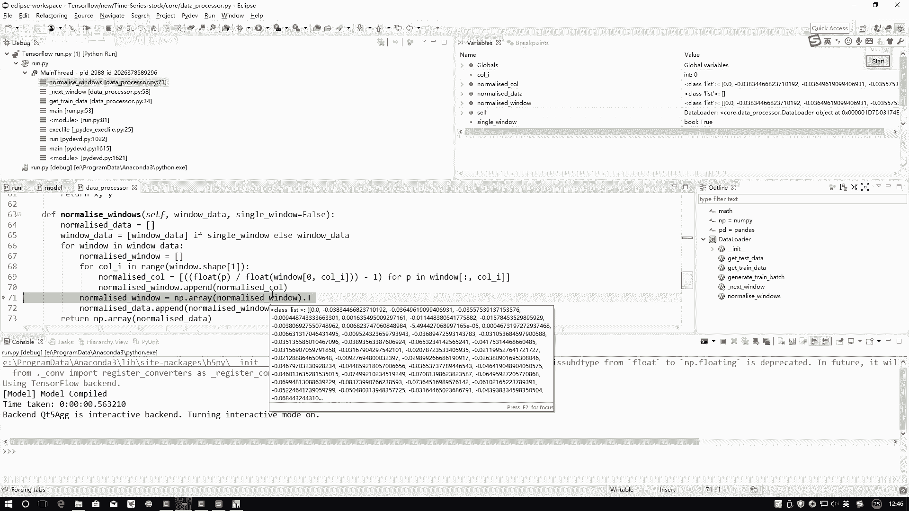

还得要把它转换成一个我们实际的一个列吧，你看正常应该转完之后，我的数据应该是这样传进第一列，这样传进来第二列吧，所以说啊你需要把这个东西再做一个转制，我们再来看一下，转制完之后。

你看它就变成当前的一列了吧，也就是说我把close这列拿过来哎，做了做了一个就是预处理操作，又转换成一列给他返回去，这就完事了。

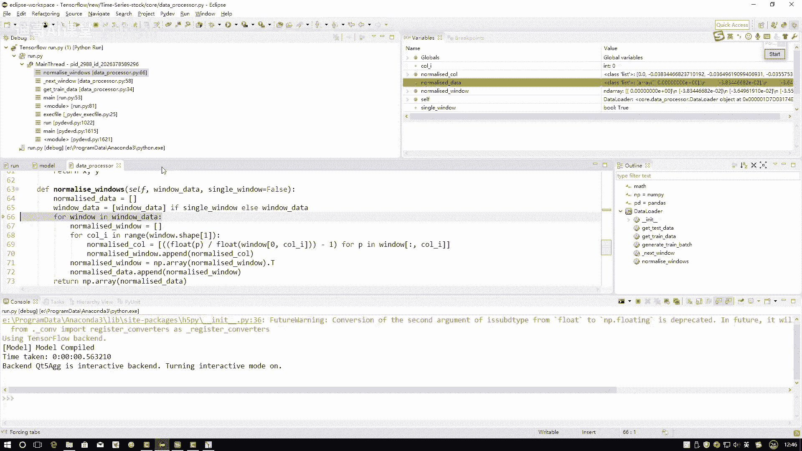

那现在这里啊我们做完了这个事，那这个window就返回去了，咱们把这个window就做好了。

下面我的X和我的Y做法跟之前啊，都是一模一样的。

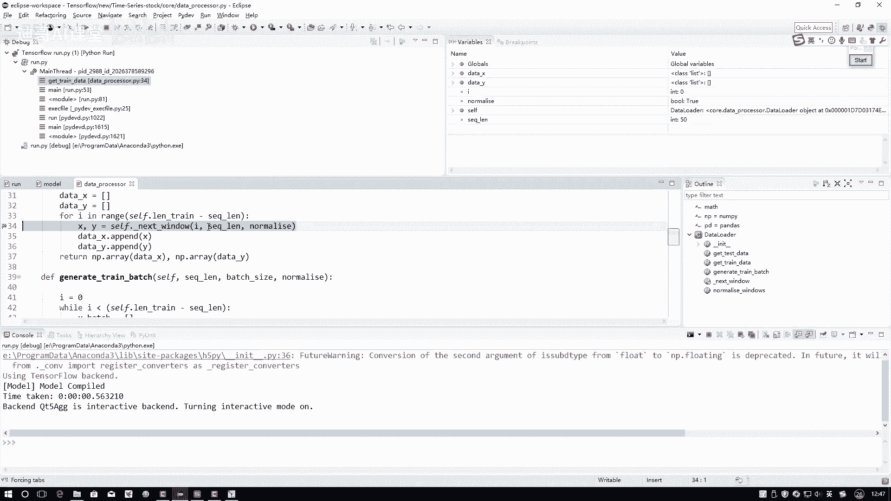

这个就不给大家一个去看了，然后这一块就跟大家说了一下，我们怎么样对数据做咱们的一个基本的规划啊，不基本的一个预处理的操作，然后在这里我们来看吧。

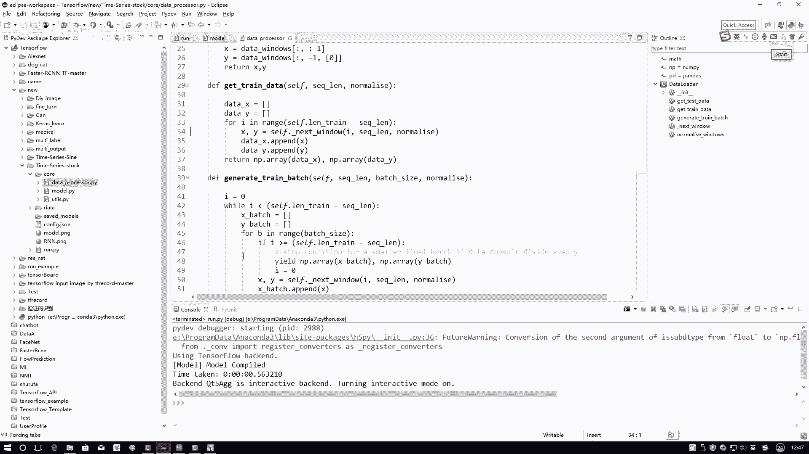

在这里我还是打开这个啊，杠1JASON。

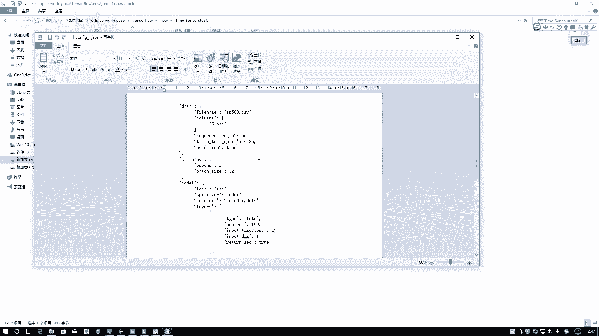

下面网络结构我们直接通过这个来看吧，这个model点PNG这个东西。

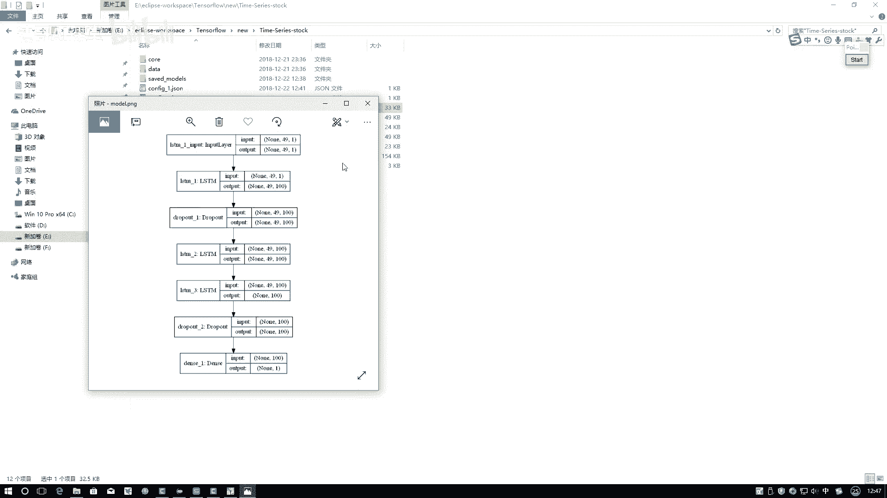

这里啊咱们可以看一下网络结构来说啊，其实上跟之前你看是不是都是一模一样的，还是四十九一吧，我当前选的是49个，49个，就是每一个time step值是49，每个数值是一。

那接下来我在这里只不说有了L1L2，还有L3吧，最终预测结果是不是还是一个值啊，这样咱就把这个事给他做完了吧，所以说啊下面整体流程跟之前都是一模一样的。

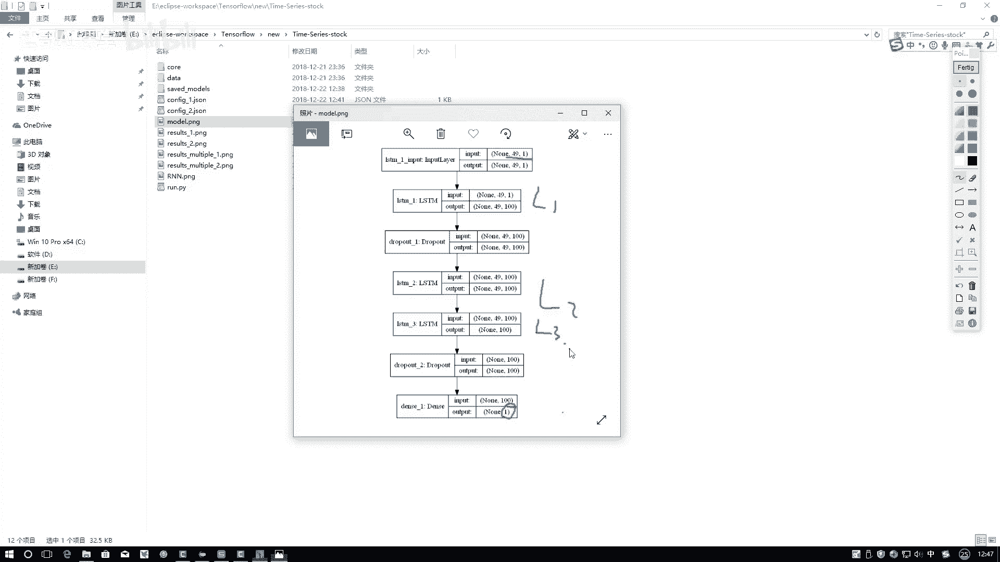

在这里啊就不给大家一个个去看了。

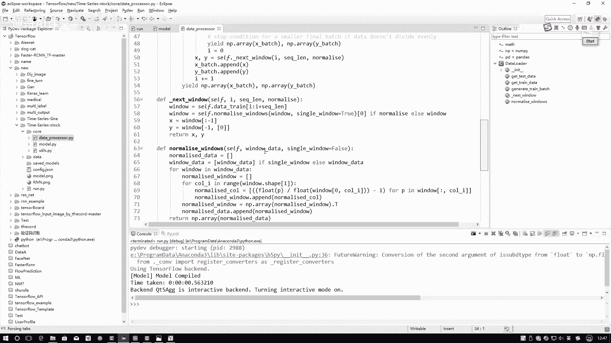

到时候大家感兴趣可以自己啊从头到尾debug，去看一遍怎么去做的，唯一有一点不同啊，就是咱们什么就是啊在这里的那个什么东西，那个预处理操作不太一样，然后我预测一下，再来看下结果啊。

在这里我先把这个结果换一下呃。

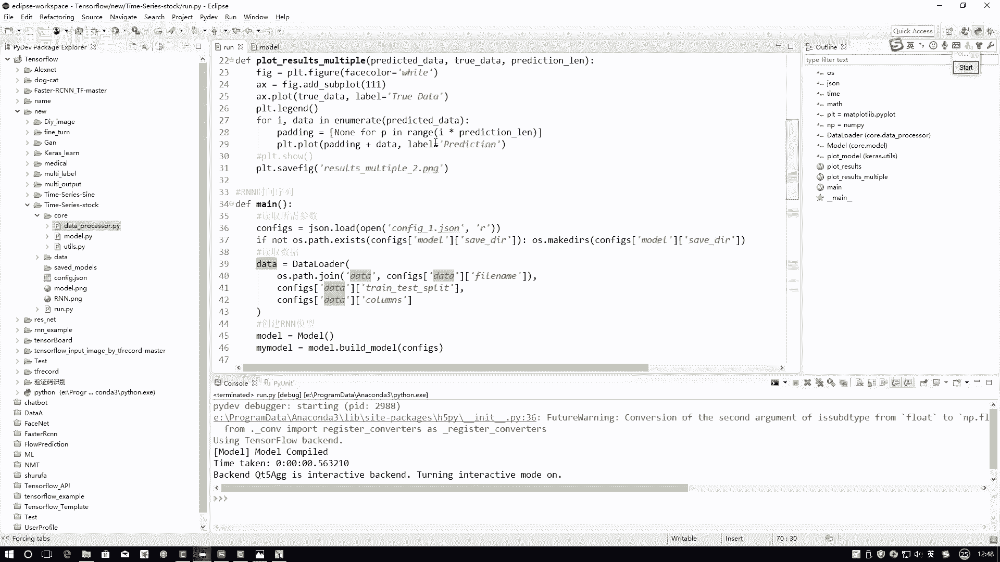

这是一个一，咱们是用JASON1去做的吧，所以说我写成个一表示，咱现在用一个变量，咱先执行一下，再看效果，在这里我画了两个图啊，这两个图分别这个意思啊。

就是呃这个result result这个那个MUMUTABLE这个东西啊，相当于就是我们要做的是跟之前一样的。

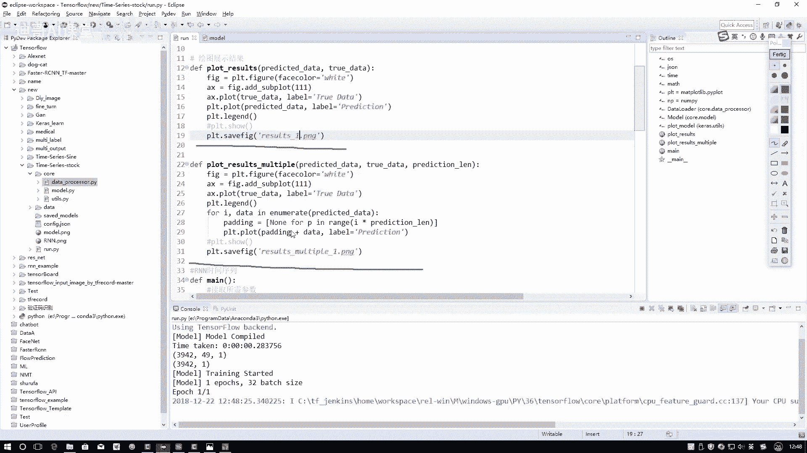

基于已有的序列去预测后面连续50点的序列。

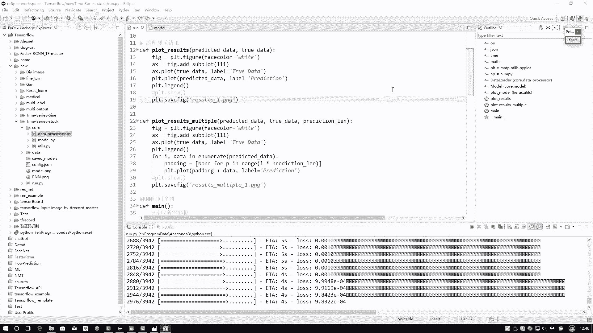

跟之前讲那个sin函数啊，它是正弦函数啊，是一样的，然后上面呢这个东西上面直接啊。

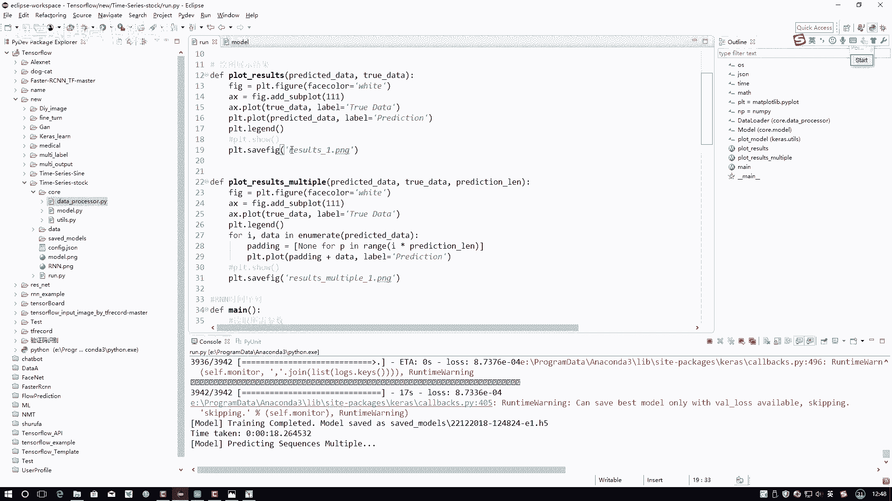

这个result这个东西相当于啊它是一个就在这里，一个是预测的是一个序列的，一个预测的是一个点预测序列，就像说的从0~50，你是不是把51预测出来了，把51拿过来，1~51去做52吧，跟之前一样。

那这个下面这个这个point by point，它是这个意思啊，通过0~50实际的数据去测51是吧，通过1~51实际的数据去测52，相当于这个意思啊，所以说第二个这个东西相对来说，做起来是不是简单了。

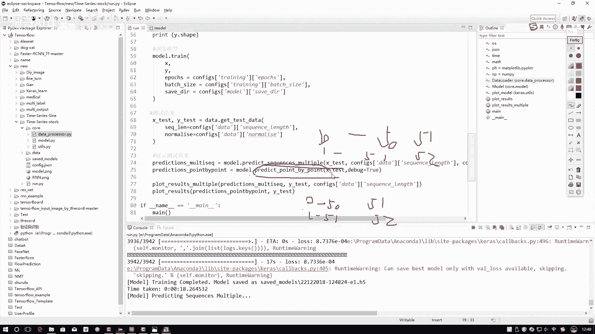