# B站强推！基于Python机器学习的金融分析量化交易实战居然被同济大佬老如此通俗易懂的讲解出来，三小时即可吃透！ - P71：8-预测结果展示 - 迪哥AI课堂 - BV1hZ421W7u8

在这里呃，它是什么result1是不是result1是什么意思啊，我该说的是一个点对点的吧，通过真实数据当中0~50这个点预测什么，预测51这个点，然后你这个51这个点你不拿过来。

你在真实数据当中1~51这个点，预测52这个点数，先来说这个任务比之前咱预测要简单啊，这是它得到的效果，蓝色的是真实的情况，然后这个黄色的是它预测的情况，看起来是不是比较简单的，能达到一个差不多结果吧。

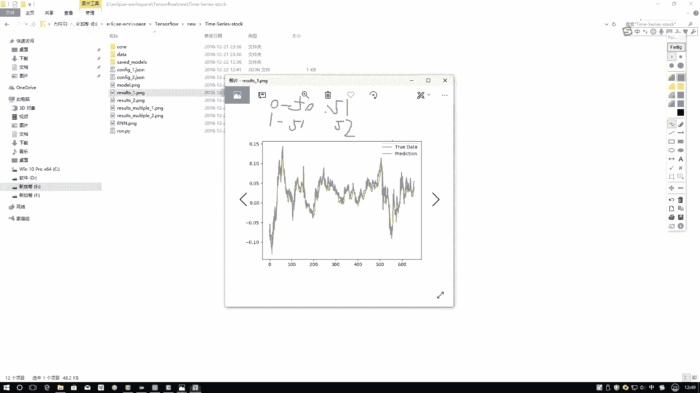

然后咱再来看另一张图，那张图在这个这个你看难度做起来，像是它相对来说效果就没之前那么好了，因为它是输入的是0~50，它预测结果是什么，预测结果我是想预测51到这100的结果，要做这样一件事吧。

要这样一件事，你看这一块它预测的结果你看不是特别好吧，这一块预测出来的结果，我感觉反正从整体上来说，大概有这样一个趋势的感觉，但是从你看这块他是不是预测错了，明明它还要它就是要进行一个上升。

这块它就进行下降了吧，所以说啊当我们用LITM来去做的时候啊，你用一个就是预测一个点，那比较容易，但是呢你要预测出来一个，接下来某一个时间长度，它的一个序列做起来难度就稍微有点大了。

这个是啊咱当前得到的一个结果，然后呢把这个关了。

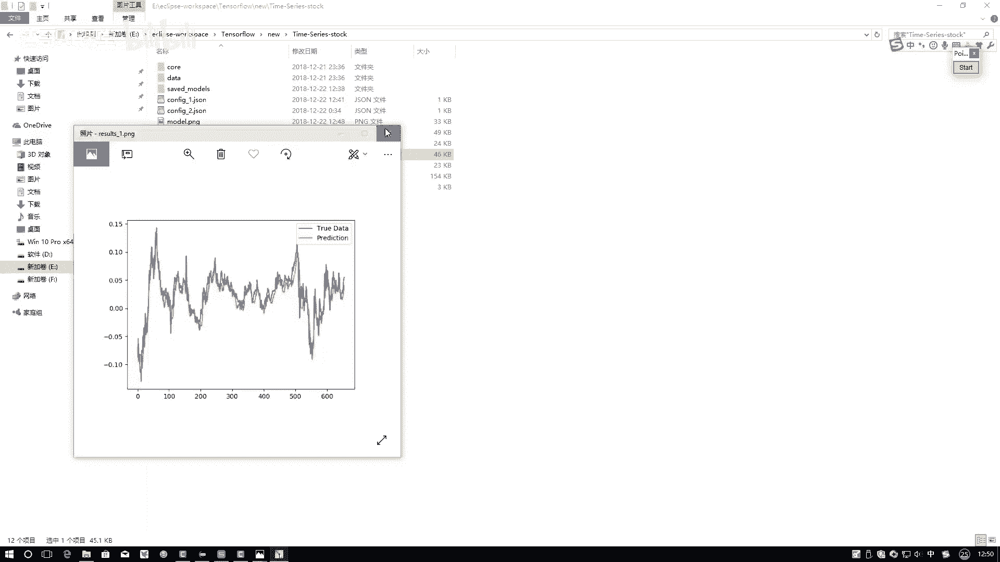

咱们再来看第二个事，第二事当中啊，我把先让它运行吧，然后我把这个东西得改成一个JSON2哦，在这里把它改成一个二。

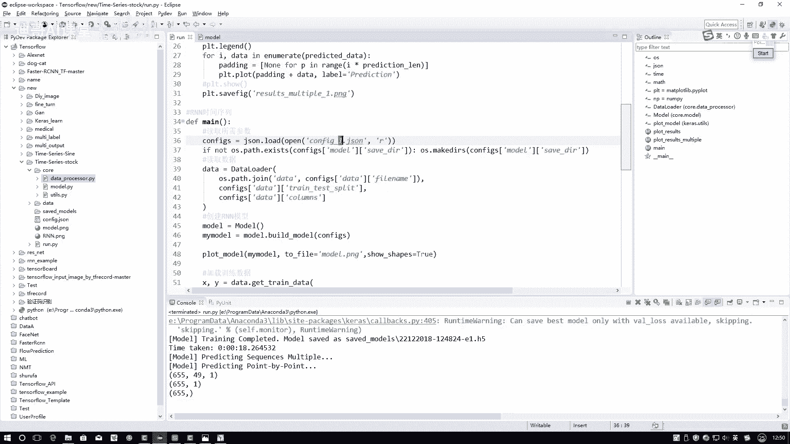

然后画图的时候咱都给标上一个二吧，然后再来执行一下。

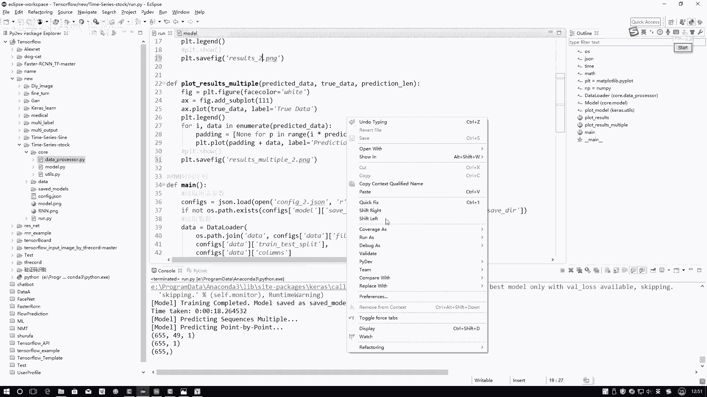

在这里啊执行完之后啊，我现在给大家看一下，他执行完之后，我会把那个网络结构图保存下来。

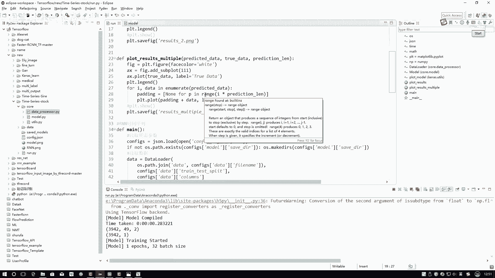

咱先执行，执行完之后，他会把结构图保存下来嘶。

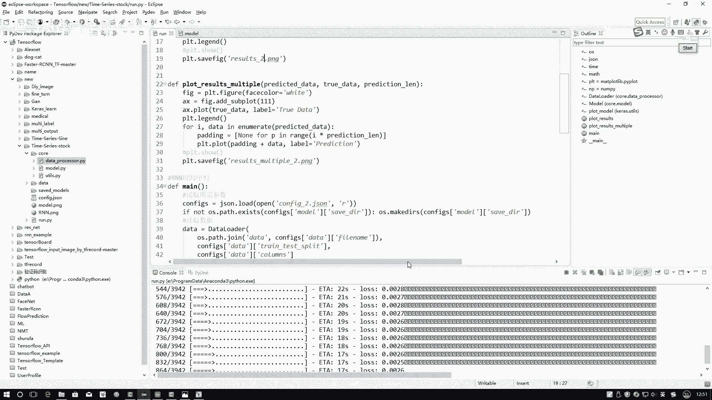

呃就是这个东西就是这个model点PNG啊，现在哎它已经保存下来了。

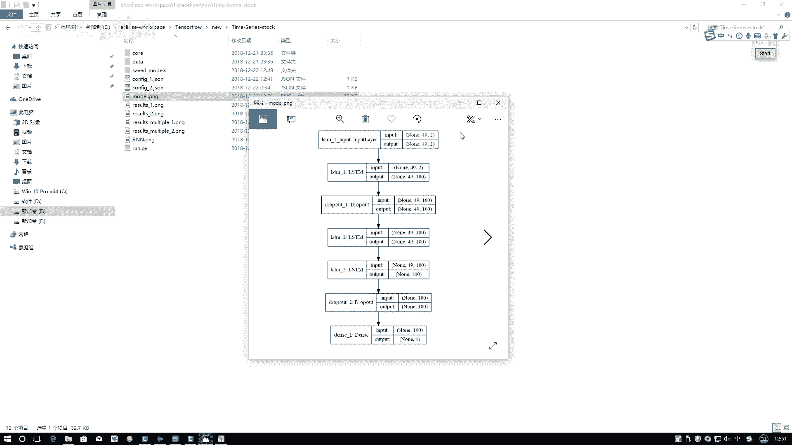

这点就是建完建立完模型之后，它自动出来了，这回啊JS2当中我们来看一下。

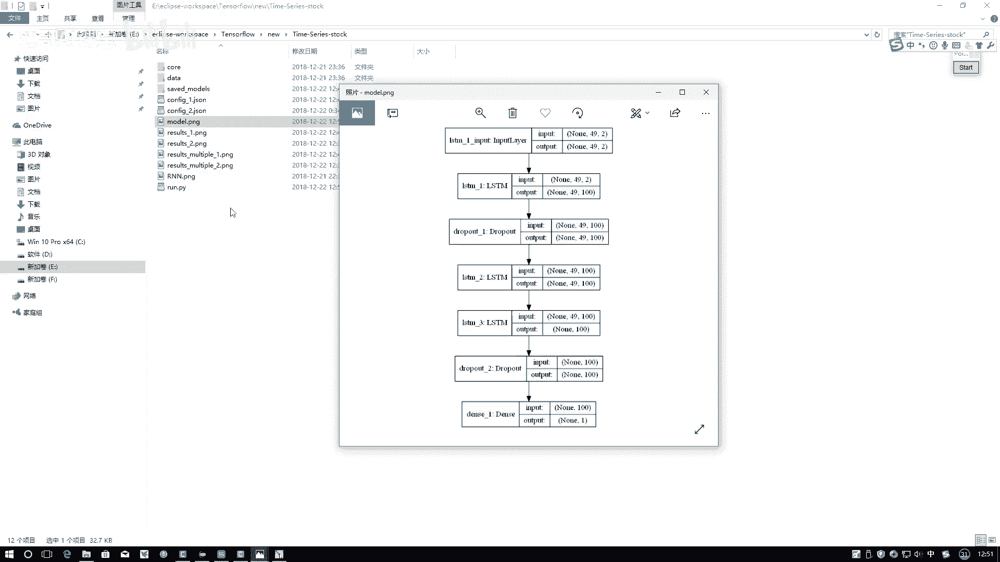

在这里你看唯一的不同是什么，其他都一样啊，在这里我的列是不是选了两个，那你说时间序列当中，你选择一个可以选择两个是不是也可以啊，别说选两个了，你甚至选择100个，那不都可以的吗，在这里我选择了两个。

只不过说你需要把你的X和你的Y对应好，X咱现在变成两列，那那个Y是不是还是一个值啊。

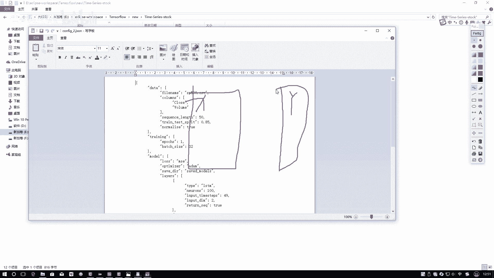

这个东西Y是不变的，这个东西，然后呢再来看咱网络结构的一个图，在这里，首先我的输入变成什么了，四十九二吧，49个时间序列，每个序列当中有多少个啊，每个时间序列当中啊，它是不是两个值啊。

这两个值分别到什么，我的close，我的一个收盘的价格，以及呢我交易的一个数量吧，所以说这块它变成了一个二，那后面呢你看中间变成49，100，四十九一百四十九一百，最后是不是还是变成一个值啊。

所以说啊我预测的最终结果还是不变的，只不过说啊我的输入有点不同了，现在啊我的一个输入当中，我传进来的是呃还是这样一个序列，序列大小是一样的，只不过说现在我要预测的是传进来，预测也不变。

传进来的是两个指标，这个意思啊，但是大家我问大家一个问题，你说咱现在要预测一个收盘价，我传进来多一个指标，效果一定好吗。

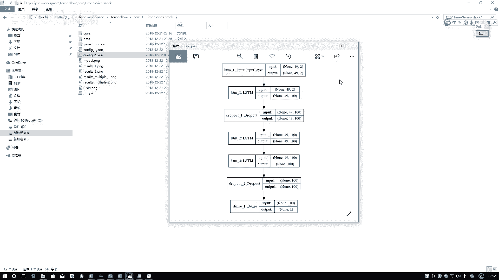

不一定吧，咱来看看结果，这个运行完了。

再来打开result2和result1来对比一下吧。

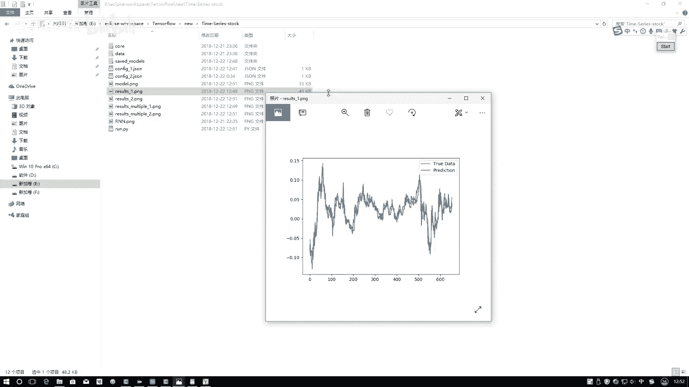

嗯这是result1，然后这个是result2，咱们可以来看看，你看哪个效果好，就是看它偏离的一个程度吧，给我的一个感觉，咱们来看哪呢，好像在这个result当中，哎呦我看的不是特别明显啊。

好像来说是整体来说是差不太多，是不是，但是我感觉result2这块好像拟合的更好一点，你看这个尖儿，这咱再看这个这个尖儿，这只露出来一点儿，这个尖儿这露出来一大块，是不是，你看这个区域这块。

你看我重新重给大家标一标，你看这个区域和这个区域是不是明显，result2更拟合一点，result1好像没有那么拟合吧，然后这一块再看一看，后面感觉好像差不太多。

但是你看在这里result2在这一块你看拟合不太好，但是result1在这块拟合的好像来说相对较好，因为这块出现了较大的缺口吧，所以说啊这个东西啊，你要从整体的去评估的来看啊，不是那么容易。

我没画这个loss的图啊，只画预测的结果了，这个就需要大家通过实际任务啊，你得自己来去对比了，我到底什么结果才是比较合适的。

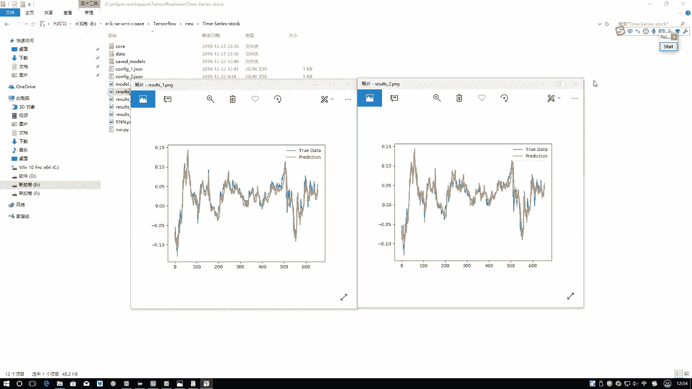

然后呢这个是一个指点对点的，一个点一个点预测，然后呢咱再来看一个序列。

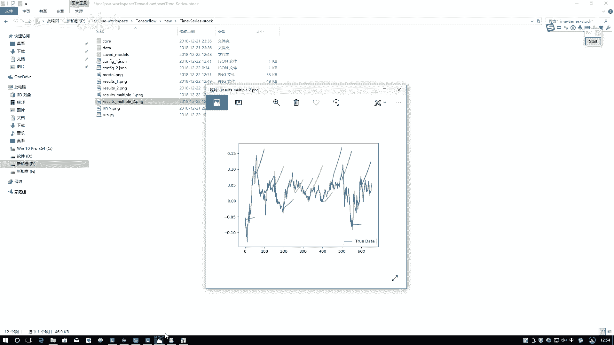

一个序列去预测的时候呃，这个一放左边，二放到右边呃，这个呃这个这个结果差异咋这么大呢，你看我在这里，这这个结果差异太大了，一共绿色600多个序列，600多600多个序列出来之后哦，这个接受差异比较大。

你看这块这个差异，这个铝造一啊，它预测出来是一个下降的趋势，result2预测出来之后，它却是一个上升的趋势，右边也完全不同啊，左边全预测成下降的趋势，右边全预测成出来上升的趋势，所以说结果上来说啊。

它的一个差异还是蛮大的，但我整体的感觉好像应该都是从这个点，应该都是下降的，result2好像不如result1做得好吧，你看RESUL一起码是下降的趋势是对的。

但result2在右半部分它趋势预测的是不太对吧。

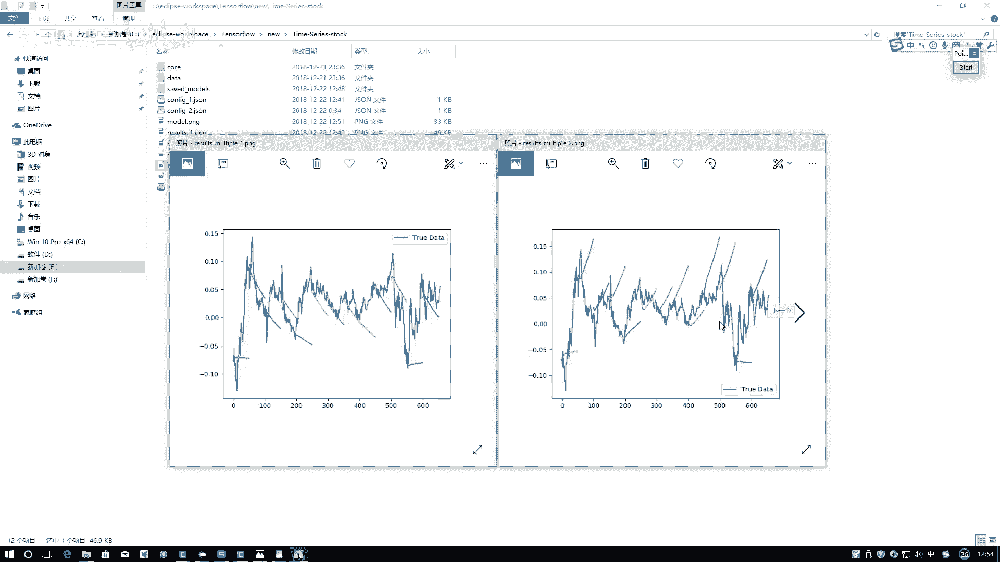

这个就简单给大家对比了一下，我们结果它造成的一个差异，等大家拿到实际数据之后。

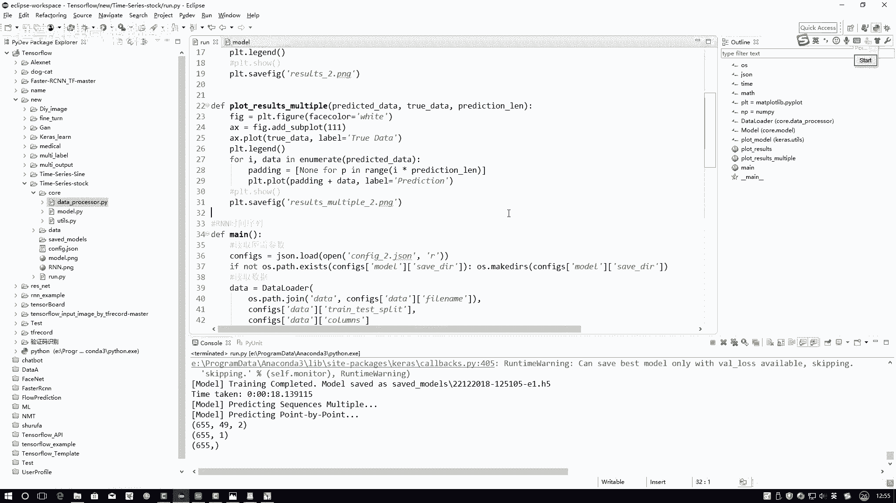

你还得想一想我到底需要哪些个指标，以及呢数据预处理我该怎么去做，其实啊时间序列数据很大程度上拼的就是什么，咱们的数据，它的一个值就数据当中你该怎么样执行操作，怎么样执行预处理。

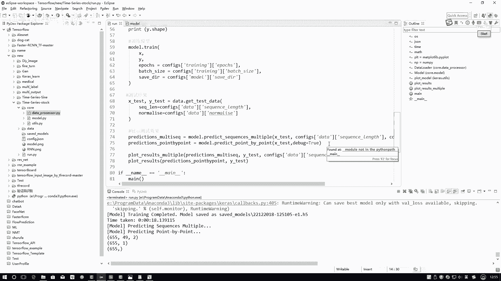

能够得到更好的一个结果了，那这个任务就给大家演示了一下，我怎么样啊。

用这个KERO的工具包，以及呢，RTM网络来去进行一个时间序列的一个预测，就是当做两部分点对点的那比较容易预测，接下来一个序列的，那可能还要用到你之前的预测的结果。

这个预测起来的一个效果可能就没有一个点，那么直接了啊，给大家分别演示了两种情况下。

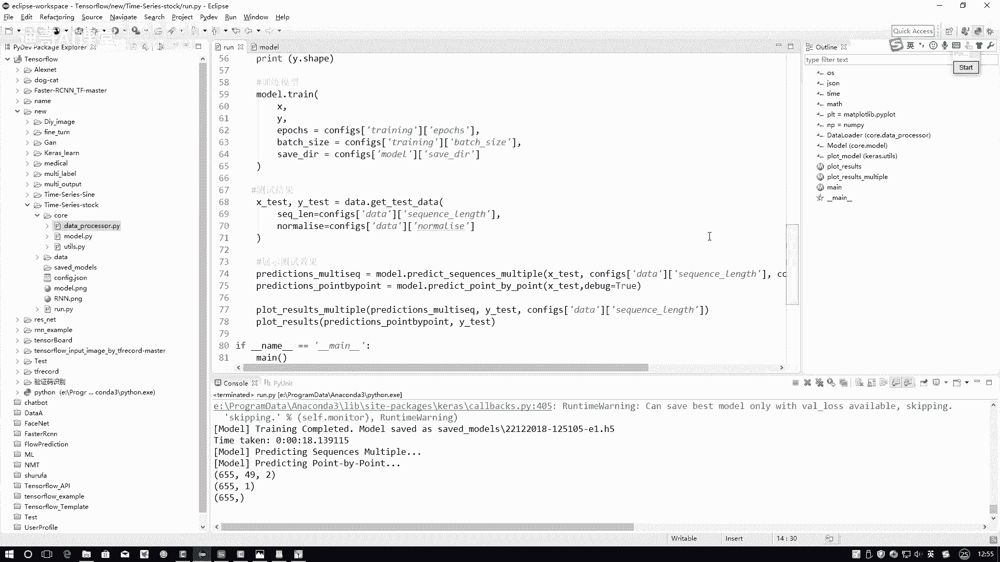