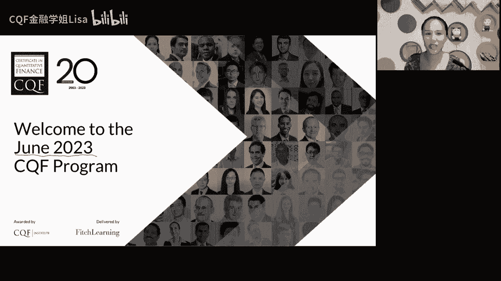
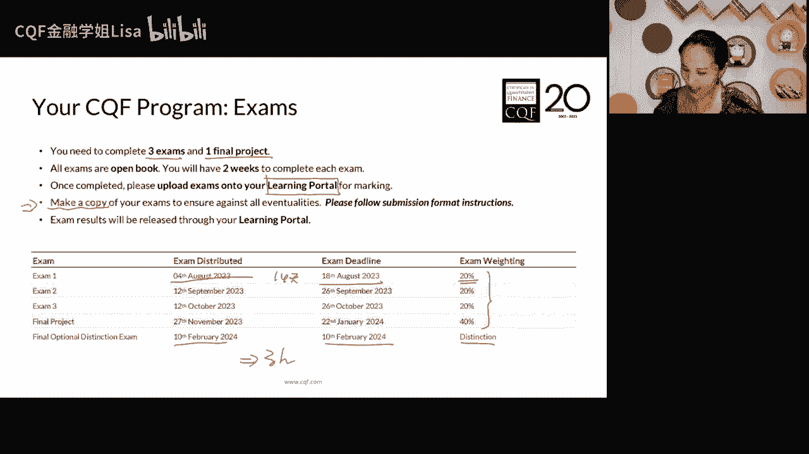
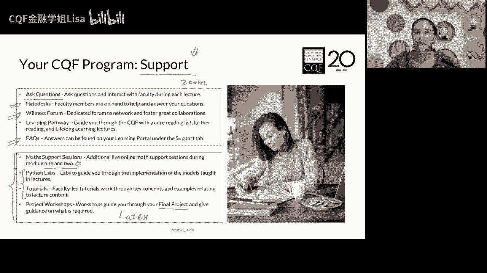
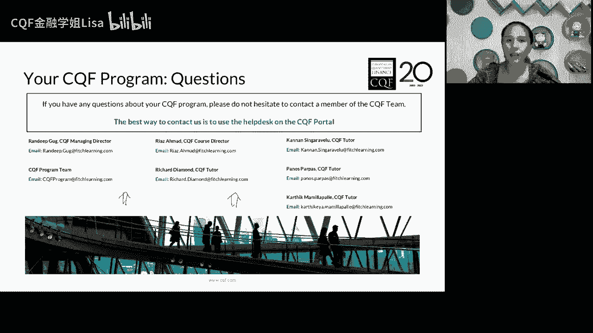
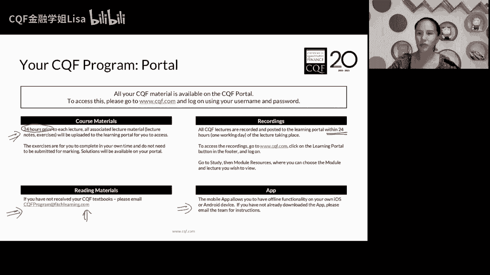
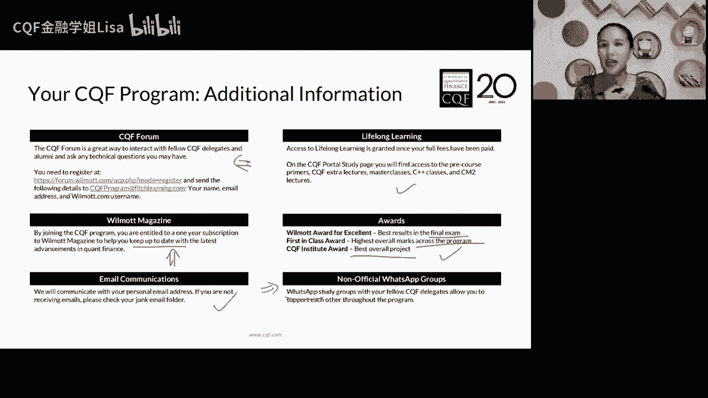
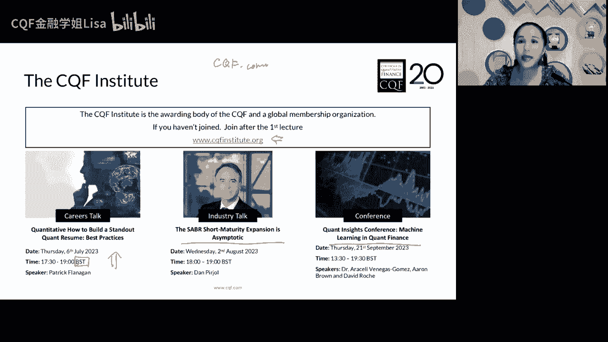
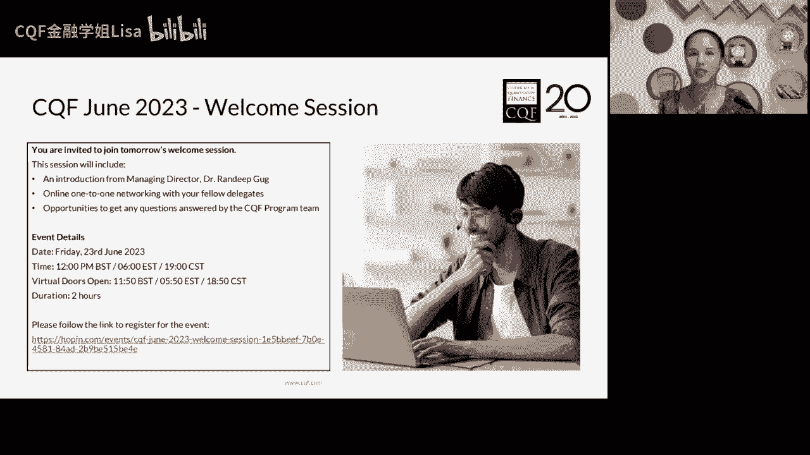

# B站最全量化交易入门课-第一讲：CQF介绍 - P1 - CQF金融学姐Lisa - BV1K1421S7KS

我调一下哈喽，大家可以可以看到我吗，Hello，可以吗，好的啊，虽然我也不知道为什么，我最近我的电脑看上去颜色特别暗，哈喽诶大家晚上好啊，大家看一下这个手工啊之类的，这些东西都拿来吧啊这个颜色啊。

嗯嗯哈喽晚上好啊，嗯我们马上啊七点钟开始还有2分钟啊，所以现在呢大家先看一下我们这个声音啊，然后画面啊是不是都OK啊，Hello，晚上好，还有一分钟的时间啊，看一下啊，能不能都都都OK啊，好。

非常好嗯非常的完美啊，我很喜欢这个词，好的啊，这个我们马上就要开始，我们非常fantastic啊，非常啊非常精彩的CPF，2023年6月份的这个课程呢，嗯今天是我们的第一节课啊。

我是觉得学CCF是一个非常fantastic的一，个过程啊，你会不断的去挑战自己，挑战自己的能力上限，不是这个意思啊，也许你们的能力上限还远不止此啊，对不能这么说啊，好了，那现在呢是七点整了啊。

那我们呢这个课程我就开始了，那首先呢先给大家鼓个掌啊，我们就在在连上六天班的一个周二的晚上啊，大家来听课了，那今天是我们呃中文阶段啊，我们2023年6月份的，我们CKF的第一节课了。

所以呢啊请允许我在刚开始的时候，大概用十到15分钟左右的时间呢，给大家来稍微的去介绍一下。

做一个welcome的一个内容啊，那首先的话呢呃这个呃不好意思，多点了一页，那首先呢我们呢呃半年一次课程，那今年呢非常的巧啊，正好是我们CCF协会的第20年，也就是这是第40个课程啊，每半年一个课程嘛。

正好是第40个课程，那我们呢一般来说呢，会有六个月的时间来去完成一套啊，当然大家不一定要在这六个月的一个时间啊，可以学着学着啊，这个没空了也可以呃，在明年的1月份也可以继续啊。

那我们今年下半年呢是有这样子，六个核心模块的啊，那正好呢这六个核心模块也大家可以看一下，它会有一个开始的时间，这是英文的直播的开始时间，所以英文直播已经开始了啊，那我们呢这个是他结束的时间。

那基本上呢除了可能模块稍微短一点点啊，基本上可能是不到一个月的一个时间，基本上就是一个模model一个月的一个样子，那会在圣诞节前夕，哈哈不会耽误大家过圣诞啊，主要就是教授们也要过圣诞。

我们会结束我们全部六个model的一个学习，那这六个model当中的话，第一第二个block，其实是相对来说比较打基础的阶段，因为我们第一个呢其实是来去讲一讲。

关于我们quantitative finance啊，我们量化金融当中的一些非常基础的部分，那比如说我们会用到的一些小的数学的基础，关于随机积分，关于转移密度函数等等啊，一些基础的数学部分也会了解到啊。

我们在量化金融的领域当中，对于比如说对于波动率啊，对于主要是对于资产是怎么来建模的啊，比较基础的一些内容，那第二个部分呢其实是比较偏传统的，我们量化金融的开端啊，就是传说中的马克维茨，然后非常不幸。

他昨天死了嘛，啊不知道大家知不知道，95岁高龄，昨天逝世了，在3DIEGO，然后就逝世了，就是我们呃有效前沿，马克维茨的有效前沿的那一套理论，他昨天试试了，二十二十二号是我们英文的课程啊。

英文的开班的课程，然后我们呢我们的中文是会稍微晚一点点，晚几天对马克维茨就逝世了，唉真的是今年真不是个好年份啊，95岁高龄，昨天逝世了啊，在那个去年的时候，我记得诶对，大概是去年夏天的时候过世的时间啊。

啊不好意思，昨天看到一个诶，不是昨天吗，啊好吧啊，可能是我昨天才看到新闻，我忘记看这个时间了啊，我记得去年8月份的时候呃，应该是可能对去年89月份的时候哦，22号啊，好的，去年89月份的时候。

他还参加了我们系科研副的一个论坛呢，啊作为嘉宾参加了一个论坛，唉，没想到今年啊，他就唉一个划时代的一个一个人物啊，因为我们一直认为，从马克威子的那个时代开始啊，就是进入到我们金融进入到量化时代了。

进入到量化时代了，因为他第一次提出了，把我们的对于风险和回报，来进行一个量化的这个过程，所以我们会在model2的时候呢，就是主要来去讲一讲资产组合的那些东西，来看看我们量化风险啊，量化呃收益啊。

怎么来去构建资产组合，所以其实这些都是比较基础的那些啊，相对来说，这还是刚刚开始进入到量化时代的时候，那我们3456呢其实就会分门别类了，我们知道我们做量化金融主要就是几件事嘛，一个就是投资啊。

就是投资管理啊，这是investment management，还有一个呢就是风险管理，当然风控跟投资啊其实是应该是交错在一起的，我一直会觉得他们不能随随便便的分开啊。

如果我们在投资的过程当中不考虑风险，那就是韭菜啊，但是如果我们只考虑风险的话，你就会发现你什么都不用投了，就不用玩了啊，就存存国债啊，就买买国债，然后存存银行就可以了，所以其实在这个过程当中。

我们其实是会针对资产类别来进行一个分类的，我们会在model3的时候，首先会去学一类，最经典的就是我们equity and currency，就是以股票为代表的一类资产。

这一资产其实是相对来说比较容易建模的，也就是说它的一种性质啊，这个资产的性质是我们呃相对来说发现诶，这个模型效果挺好的，预测能力各方面啊，这个其实是挺好的一种情况。

我们会在model3的时候来去涉及到这个内容，当然我们不是来去说啊，学了model3之后啊，我就会股票预测了啊，然后接下来A股上面我就可以驰骋了啊，就是随便买了啊，他并不是啊。

它其实是指的是基于我们equity，还有currency的这一类啊，最基本的一个生平就基于这两个标题当中，最重要的也是相对在化竞争当中，比较有代表性的一类就是期权啊，也就是说我们在model3的时候。

会重点的来去看一看期权啊，非常著名的期权嘛，LESHY是诺贝尔经济学的获得者，那么这一块就是相对来说还是可以说是呃，上世纪90年代的一些内容，那到了model4和model5呢。

其实就是我们会学到就比较新的了，也就是关于我们机器学习啊，然后大数据的处理，model4呢，主要会涉及到的是我们一些，关于监督式学习的内容，model5呢主要是非监督式的学习啊。

包括mod5当中还有很多比较新的一些内容，那比如说咳咳我们现在的自然语言啊，natural language processing的一些内容啊，比如说我们GPT啊，这些内容。

其实就是我们自然语言学习的一个应用，我们也会在摩点五的时候来初步的去了解一下，自然语言学习是一个什么样的啊，一种算法，那摩托六呢其实是一大类哈，摩登录也是现在这个时代。

其实是呃在整个投资界会比较关注的一个事情，就是关于我们信用风险，还有关于利率产品的一些内容，就是我们fix income啊，固定收益类的产品，因为大家都知道嘛，股票有期权这么好的变速的，这个没有啊。

股票这个没有啊，就是股票的话可能嗯多因子模型吧，相对来说可能多因子模型好用一点点啊，当然其实股票的话可以可以用，这里的就是监督式学习，监督式学习当中，是可以用比较好的来去预测股票的啊。

那我们啊因为股票比较比较相对来说，数学比较复杂一点点啊，好我们来看看啊，九model6fixing co fakfm，对不对，其实你会发现我们最近几年，传统的所谓的经济学的那些工具，都开始逐步的失效了。

哎我们在CF的模块当中，CCF的学习当中，其实我们是不太去看什么经济学的这些内容的，因为我觉得这把又有点扯哈哈哈有点扯啊，因为事实上我们会说有经济的很多的驱动力，比如说财政政策啊，然后货币政策之类的。

大家也可以看到，现在其实有很多时候，这些所谓的经济调控的政策正在逐步的失效，我们竟然可以处于一种啊，既高息又高通胀的时代啊，这就是现在美国正在经历的一些事情嘛，所以其实我们现在这个时代。

可能让人琢磨不透啊，就包括各种权益市场，然后经济的一个复苏也非常的困难，所以其实现在投资，尤其是欧美的投资界当中，他们会把很多的目光集中在固定收益和信用，信用类的产品当中啊，在疫情期间的话。

主要是大宗商品嘛，在疫情期间的话呃，那这种情况下，但是现在是属于一种后疫情的时代啊，其实这个复苏有很多的不确定性，那么这个时候风险呃相对来说，比如说相对来说比较少啊，就固定收益类的产品会大家比较喜欢。

但固定收益类的东西是非常非常难以建模的啊，尤其是fix income债券类，债券类的标的，或者说它的底层的一个驱动其实是利率嘛，我们知道是利率，但利率是一个嗯非常复杂，也很难去建模的。

事实上它的建模基础也不怎么好的，一大类资产，更不要说信用了啊，所以呢摩托六呢我们会介绍一些传统的模型，也会介绍一些新兴的模型啊，比如说现在会有一个叫做XVA的。

就是我们所谓的叫做value adgist的一大类模型，有根据credit之类的，它有很多的分类啊，就是一大类的模型，但是关于fixed income和credit当中，还有很大的发展空间。

还有反弹发展空间，因为没有哪个模型是主导地位的，说就用这个就这个好，哎，不像我们说期权定价啊，大家现在公认的就不管可以有很多的变形，但基本上它的形状就是BS的那一个啊，所以其实我们越到固定收益这里的话。

它的一个产品类型的模模型，就相对来说就比较复杂了，就很纷繁复杂，也没有哪个模型可以占主导地，我说就是这个好啊，这个是比较少的，所以其实我们可以看到，随着这个模块1~6的这个过程，它是从比较基础的。

比较传统的，历史比较悠久的，然后到现在啊比较话题度比较高的，然后比较新的啊，然后也比较有挑战的一些领域去发展的，所以它的难度呢是会逐渐的上升的啊，但是呢这个这个难度啊，就是我们的这个PAUL。

在开篇的时候就会有说他的learning curve啊，我们的学习曲线并不是说前期比较的平啊，不是说哎前面几个比较经典，比较基础，所以比较平，而到了后面之后再上升起来，他的人民客户是诶一开始是非常陡的。

到后来才会慢慢慢慢的比较平，因为刚开始的时候，其实大家可能会接触到大量的数学，可能会进入到大量的数学啊，这个其实是可能对大家在很短的时间内，可能就一到两个月的一个时间。

可能说应该说直接说到model3啊，可能就两三个月的时间当中，你要接触到大量的，你可能之前已经遗忘了啊，就已经扔在一边了，或者说是没有接触过的一些关于数学，关于建模啊，这一块就是量化的基础。

所以这一块刚刚开始的那一两个月，我们的learning curve是比较陡的，所以也请大家能够尽量的坚持一下啊，不要轻易的放弃，因为到了后面其实反而没有这么的复杂了，因为呃可能更多的是些发散的。

思考性的一些内容会比较有趣啊，但是前面几个内容的确是比较经典的，也就是会涉及到很多经典的数学，经典的模型，所以请大家在开头的几个月啊，反正夏天嘛对吧，夏天嘛出门也热，还不如找一个有空调的房间学习学习啊。

心静自然凉啊，嗯嗯好非常多的优势，因为GPT的一个内容啊，刚才也跟学到，他其实是自然语言学习的类型，也就是说他其实是一种非监督式模型啊，我们再跑开这些监督是不监督式的时候，我们再说一下它其实是什么。

它其实是一种数据喂出来的，也就是说他只能学习已有的东西，也就是说你给他一些模型，给他一些历史数据，它能够从中试图去找到规律，然后试图的去给出一些内容，我们都知道GPT其实你用的越多。

他就表现的看上去越聪明，但我们的CCF的一个内容当中，其实大量的是数学模型，而数学模型是逻辑推导，我们是有一些逻辑推导的东西的，我们可以说就举个小小的例子，如果你给到一个从一个新的方程。

GBT是不会解的，他是不会解的，因为他没有见过在他的数据库里面，他的学习路径当中没有见过这个库的解法，就像我们以前可能人工智能阿尔法狗之类，只要他的棋谱当中库当中没有这个，他就是解不了的。

但是我们可以我们因为我知道比如说二次方程，我们会知道二次方程是有公式的，叫做呃2A分之B2A分之A，两分之B平方减CCR根号DC口水一下子忘了，我们会是知道有一些些所谓的公式的，给你一个新的。

从从没有见过的方程，你是可以做一系列的分析和判断的，这个方程有没有解，怎么解，它代表是什么意思，但是G做不到，JPD做不到，所以其实我们包括在用，现在我们即使是用很多AI的功能。

我们说啊data science这一类的这些内容，其实它大量能做的更多，还是一种基于历史数据的分析，找规律这种逻辑，所以其实data science这一块。

machine learning这一块表现的比较好的一些策略，其实是偏技术类的策略，偏统计的策略的，但他没有办法去做数理模型的啊，这这这这是几种很很大的一个差距啊，也就是说我们GBT还只能是一个一样化。

葫芦的小学生的那种状态，如果你要他让他能够有极强的逻辑思维，能够根据你教给他的逻辑推理的方法来去呃，解决一些没有解决过的问题，他其实还是做不到的啊，所以这也是我记得有看到过一些报道。

说让GBT去什么考高考啊，考美国的set之类的，其实他在数学方面的表达并不好，因为如果没有做过这些题，他其实是没有办法做出来啊，好了，那就是我们的一个内容的介绍啊，稍稍花了一点时间。

然后呢就是一些常规的介绍，就是我们的考试啊，我们考试呢是三次啊，还有呢是一次最后的final啊，大家可以看一下，我们会在这一天啊。

就是我们在我们的learning p这个learning pod上面网站啊，不知道大家都应该都有注册了啊，我们这个课件应该都是从learning port上面下的啊，应该已经注册过了啊，他就会公布上去。

然后呢你会在你看14天啊，两周的时间当中去完成它，然后记得啊，完成的话是一个upload就上传的一个过程，那也会建议大家自己留一个copy啊啊，因为上传之后他可能批改完之后就没了，或者说批改完之后呢。

你的原始版本自己就不知道了，那么他的一个成绩啊都是这样子，60分万岁啊，不能这样子，我们要有点追求啊啊，然后呢，会根据这个权重给出一个最终的一个成绩，如果通过60分的话，我们就可以拿到CKF的证书了啊。

当然了，这个只是一个普通的一个证书，如果大家想要拿到，比如说啊有这种我们说啊award啊，就非常好的distinguish的，那么我们可以参加一个线下的闭卷考试，但我印象当中中国大陆是没有考试的啊。

是没有考点的啊，也许大家所在的地方或者离得不远的地方，是有考试的啊，可以考虑一下下啊，那这是一个你可以看到它就是一天，他是一个闭卷的三个小时的考试，对线下考试，这是一个线下的三个小时的闭卷考试。

然后就是大部分内容是数学，大部分内容是数学啊，如果大家有兴趣也有这个条件哈哈哈，可以考虑一下啊，就是呢就拿到这个呢，你就可以所谓的就拿到一个叫做first class。

就是就就比较比较比较比较比较厉害一些，小的一课啊，但其实这个是optional的啊，这个是optional的，不是必须要参加的啊，我们只要交完这四个作业，唉最后呢啊这个加起来能够超过60分啊。

我们就可以拿到CKF了，然后呢会有14天都是开卷考啊，都是开卷考，你手头所有的资料都可以用，甚至于你可以问别人好，这个是线下的考试吗，好好的，那可能现在改成线上了，因为我之前知道的是线下的。

可能疫情期间也都改了，好的，那就是限售的，那大家如果有兴趣的话，可以参与一下，但一般来说你是拿不到满分的呀，满分那是一个多棒的成绩啊。

哈哈好吗，但如果真的可以拿到满分，那那好像的确是这样啊，就你最后这个final可能就写个标题，随便写两页，随便交了，大致是差不多的啊，好了，那这个呢就是一些官方所谓的叫做support。

就是如果我们在学习过程当中遇到任何的问题，有很多的途径可以帮助大家去学习，那比如说我们可以直接啊，当然呃我不知道大家有没有去这个试图，晚上啊，我我反正是不能熬夜，所以我没办法看直播啊。

看直播的时候你是可以直接提问的，因为它是用zoom的，那它是用zoom的，大家可以随便下载一下，然后就直接可以去聊天，问问教授的啊，如果可以的话啊，如果时差比较合适的话啊，那这是关于课程的问题。

那如果关于其他的，比如说我们的呃，诶教材没有收到呀，诶为什么我上传的作业显示不了啊，或者说其他各种及其呃，呃这个learning pod上面一些问题啊，回放看不了啊等等。

任何问题都可以去找help desk啊，都可以去给到帮助，然后呢，还有一个这个呢是专门给的CQF的学员的，有一个formula foreign，就是一个小小的论坛，这个论坛呢是叫pol的说法。

就是一个secret garden，一个非常神秘的地方，大家可以直接先少呃，因为我不知道这个网址啊，具体没有打啊，大家可以直接去找到这个论坛的网址，直接先注册一下，直接先注册一下。

但是你直接先注册的话呢，你没有办法看到这个论坛诶，你先注册，注册完了之后，你不是有一个注册的用户名吗，还有一个注册的用户名，然后你的用户名和密码吗，来请把这个注册名的注册名和密码。

写成邮件发给feature learning啊，他要给你开通一个权限，一定要记得有这一步啊，否则的话你是没有办法的，你看上去就是就可能唉怎么都是一些网站的，介绍起来也找不到那个啊，呃没有这个论坛的。

没有这个权限可以看得到，你得把你的注册的用户名和密码，发邮件发给feature learning啊，然后他们验证了哦，你是我们CCF的一个学员啊，然后才给你开通那个权限，你才可以看到这个论坛啊。

所以大家可以去对，所以你如果直接注册完了之后，你是看不到的，你一定要发邮件的啊，记得一定要去发邮件啊，那么发邮件的时候稍微注册，要注意一下下这种什么gmail fox mail msn。

然后还有什么ISP啊，美国这些网站，就这些很大众化的网站有可能会被屏蔽，就被就是说你发给废除了，你，他可能不认，所以呢最好呢是用比如说学校的邮箱，或者说工作的邮箱也会比较好，哦还要注册问题的答案是吧。

哦是这样子是吗，嗯因为PO是直接他在课上的时候，他是说你注册完了之后，你是需要发邮箱发邮件的，就总而言之邮件是必发的，我不知道是先发还是后发，但是邮件是必须要发的，对就是啊，非常感谢曹同学啊。

曹静同学是的这种什么GMAILHOTMAIL等等等等，这种都不能用啊，不因为他可能会觉得这是一个垃圾邮件，所以呢就最好最好是一个这种，最好是学校的啊，或者是我们的这种呃咳咳咳，公司的这种邮件会比较好。

好吗啊，就记住啊，就这个论坛注册起来有那么一丢丢复杂的，有一丢丢复杂的啊，要记得啊，要有邮件啊，然后呢不要用你的局面发，然后会被当成垃圾邮件的，会被当成机器人的恶意注册啊。

好的那这个是一个非常好的一个论坛啊，然后呢，其次的话呢，就是如果我们在学习过程当中有任何问题，也可以去啊，比如说有些常问的问题，也可以直接去当中去FU当中去找啊，然后呢接下来的这些呢。

诶就是我们的一些支持性的项目了啊，可能CCF觉得大家的确数学很有问题，所以今年啊应该说是从今年上半年开始，增加了一个叫做mass support session，就是数学的支持部分啊。

其实就是跟我们数学前导比较类似的，我们之前的数学前导呢就比较的紧凑一点的，时间比较短，他这个呢就会讲的详细一点，拉的长一点点，这是一个录播课，这不是一个直播的啊，是一个录播课的。

所以大家如果有中间有任何的问题，哪些数学我们课上讲的比较快一点点，或者之前有些忘了，也可以去MAPLESSON当中随意的去看一下下啊，主要就是在一和二中间的，哎其实说穿了就那么点东西，微积分同微积分。

概率论，统计学，还有偏微分方程，线性代数啊，就那几个主要就是在一和二当中用到的数学啊，因为model当中主要就是线性代数的东西啊，model1当中是一些关于微积分的东西，啊啊啊微积分和概率了，咳咳好。

然后还有Python lab和tutor，这两个都是我们也会给大家去上的，大概每个model会有大概两到四个Python lib，然后呢会有那个印度小哥啊，然后呢呃把我们在课上学习的一些模型啊。

然后用Python的形式把它实现出来，代码是全部给到大家的，然后啊我们可以一起来看看这个代码，看看这个效果啊，当然啦呃lab这件事呢，它还有ti呢，不是一个强制性，必须要去做。

它属于support的阶段，所以大家可以看也可以不看，然后呢关于Python lab这一点的话呢，呃印度小哥口音口音极其极其的重，但是他会主力上模块四核模块五，所以大家如果对于模块四模块五的时候。

还是想要去听一听英文课程的话，可以在前面的Python lab当中先去听一听，习惯一下他的口音就非常可怕，至少我是这么觉得啊，就是他的口音非常可怕，现在还没有上来，就第一季课Python还没有上。

等回头上了之后，大家可以有有兴趣挑战一下印度口音啊，可以去听一下，蛮刺激的，对的就蛮刺激的，因为他是模块四模块五的主力老师啊，这个印度口音啊可以提前感受一下啊，好的就哎我我真的是一难二就一言难尽啊。

就也许也许大家会比较快的适应，我只能先提前预警一下啊，那我们最后一个project的1final一个project的话呢，也会在最后的课程之前，大概会有姐姐TORY啊啊。

会给到大家来去做一些基本的一些介绍，比如说啊写论文的一些latex的一些格式啊，可能我不知道今年还有没有这些以前都是有的，就是咱们来打工事呗，哈哈啊，然后会有一些机workshop，然后一些指导之类的。

大概会有4~6节课啊，在最后的一个啊这个课程当中，所以如果大家今年不打算做这个final，比如说我先学了啊，那我想明年再学，也可以，明年再去听这个workshop都是可以的啊。

这些是一些support好。

那么其他的还有任何的一个question，也是欢迎大家随便写email啊，这边都是一堆一堆的啊，地址都可以随便写歌去的啊，好了。

那我们的learning port啊，就是大家要习惯去用它啊，因为虽然我们中文课是有专门，我们会有一个呃高端，有个网站给到大家来去学习的，但是呢呃如果大家呃，想要看英文的课程的回放的话。

在英文课的24小时之后，就会可以就可以去看回放了，然后我们还有一些课件，那这些课件当中的话呢，我们呃会上传，我们这个就比如说我们现在上这个课间会有，但是有的时候我们的这个课程上面。

它还会有一些比如说exercises练习题，包括他配套的solution啊等等，还有一些额外的一些资料，比如说我们今天的课上就会有一个excel的文件啊，他会呃呃我不知道大家下下载了没有。

有没有去这个port，如果没有的话，我待会儿中间休息的时候，你也可以去下载一下，因为它会有一个标普500的SBX的，它有一个是呃呃价格的一个文件啊，放在excel的文件当中呢，我们呢今天会用到这个。

会给大家来做展示的，所以如果大家没有这个的话，当然我们上课的时候，你你可以看我做啊，你不用急着自己先弄，但下课的时候也可以去下载一下啊，那这个呢一般来说24小时之前，甚至于更值钱啊。

可能48小时之前都会有了，那大家可以没事上去看看有哪些啊，这种马特瑞斯可以去下载，其他的话呢就是我们还有教材，对不对，教材的话呢我们正式注册完毕之后，会从英国直接邮过来，所以到货时间不等。

大家可以稍微等等，如果可能过了一个月哈哈，一般来说如果一个月还没有收到，你可以去写个邮件啊，问一问啊，就这啊书怎么回事，怎么记丢了啊，再记一本啊，请大家稍微记一点点，有一点点耐心啊。

因为他可能会应该是嗯嗯我不是特别的清楚啊，应该是寄邮政包裹的，反正一刀的这么这么厚一坨书呢，啊或者所以请大家注意一下下啊，好那么还有呢就是我们这个app啊，自己可以去下载啊，但我觉得不咋地啊。

使用起来的体验非常差啊。

啊那还有就是哎这个forum啊，然后会有一年的纸质的杂志啊，大家看看有没有在网站上面啊，把你的邮寄地址都写上去，或者你觉得邮寄地址啊，有没有up to date。

或者改了之后都可以发邮件给help desk啊，去更新你的地址，它会直接邮寄到家的，然后还有其他的这种lifelong learning，对不对啊，这些我们都是有的，然后呢它会有一些awards啊。

大家可以看一下啊，这是考试成绩，就是以成绩啊论结果，就是如果你们在final exam当中拿到了最高分，哈哈或者说呢总分拿到了最高分啊，然后或者呢这个overall整个项目当中都很好啊。

他都会有些awards啊，就给到大家，然后呢这个会有一个what's happened的，what's happened的一个groups，这个groups呢是所有CQF的LM都在里面的。

现在这个群里面我今天听了一下，有1400多个人，所以大家也可以去加一个潜潜水啊，啊我不知道大家有，我这边应该中国不用翻墙就可以用，对对对，可以可以可以问一下薛同学啊，薛薛宇凡同学啊。

可以考进去潜个水也是可以的啊，这个非常庞大的群啊，就所有在路面应该基本上都在那，可以对对对，浅哥浅哥嘛就说不定回头又有啥就关系，就这么搭起来了嘛，对前一个前一个啊，好的啊，这个来啊。

这个大家可以勾搭一下，就是反正呢就加进去浅显啊，都是没什么问题的，那这个呢就是我们基本的些小小的介绍了啊。

好多印度人嗯，还有呢就是最后啊有一点点要跟大家去说的啊，我们呢我们不是大家应该这个learning port，应该知道是c cf点com，对不对，我们是在这个上面去注册的，下载我们的课件。

看我们的一些内容的，那其实还有一个网站呢叫做c c f institute the og啊，还有一个这样子的这个网站，也是建议大家可以去注册一下的，因为这个注这个网站呢就相当于有一些些哦，我会称之为啊。

我会称之为，这是一个就业导向的一个服务型的网站啊，因为这里面其实是会提供大量的这种资讯啊，但名师大家的这种这种talk，比如说有korea talks，这是7月6号，当然这些都是啊，大家可以看一下啊。

这个时间啊，就我们可能都是大半夜，然后呢还会有一些些行业前沿的一些topic啊，然后呢还有一些啊这种论坛啊，都是线上的，大家都是可以免费开给大家的，大家都可以去注册，可以有兴趣都可以去听一下下。

所以这个当中其实就是大量的这种，就业支持型的一些内容啊，所以啊反正也不要钱嘛，大家都可以去注册一下看一看啊。

好了，那最后呢就是因为这个welcome section已经过掉了，我们就不说了，好了。

