# Crypto量化：如何兼得Python的便利和C++的高效？ - P1 - TongsQuant - BV1aFhNeTELh

今天我们介绍一下火前量化平台，它是一个结合了Python的便利性，和C加加高效性的新型CRYPTO量化系统，回测完成可以立即实盘运行使用，它可以很快完成量化策略的开发，加上专属的GPT助理。

可以使普通开发者立即变身量化专家。

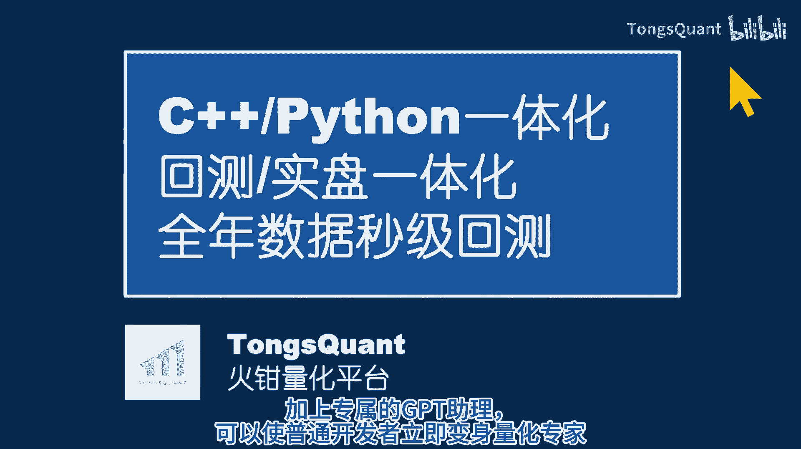

它有几个突出特点，第一回测和实盘统一代码，你可以写非常复杂的策略，使用各种第三方库，包括最新的深度学习技术库，回测完成也能立即实盘运行，第二它是本地化部署的，部署时只需要拷贝一个文件到目标计算机。

保证了交易所key和策略代码不共享，安全无忧，系统使用C加加开发，运行效率极高，在开放Python接口，用于实现具体策略算法，借用Python的便利性和丰富的第三方库。

实现了运行效率和开发效率的完美结合，TMQUANDY经在实盘得到了充分的验证，它实现了实盘所需的各种基本功能。

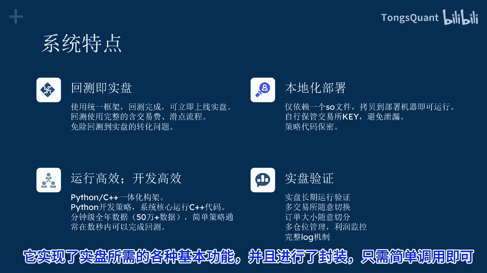

并且进行了封装，只需简单调用即可，现在我们来看看用它开发一个量化策略，有多简单，这一瓶就是要开始一个量化策略的所有代码，完成一个策略，主要是完成algorithm函数，加上一些策略所需的初始化数据。

然后继承鸡肋，直接运行即可，回测完成后把true改为false，就可以立即实盘运行，交易所切换也只用改一句初始代码，这段代码虽然没有实现特定的交易策略。

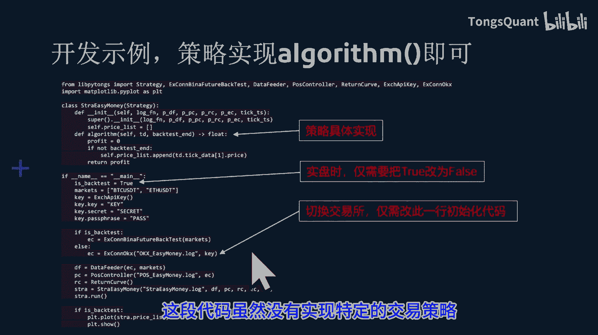

但是它是可以运行的，它利用了回测数据，展示了ETH的价格，如果运行一下GITHUB上的演示代码，你就会发现实现一个策略如此轻松，而回测研究效率竟然如此之高。

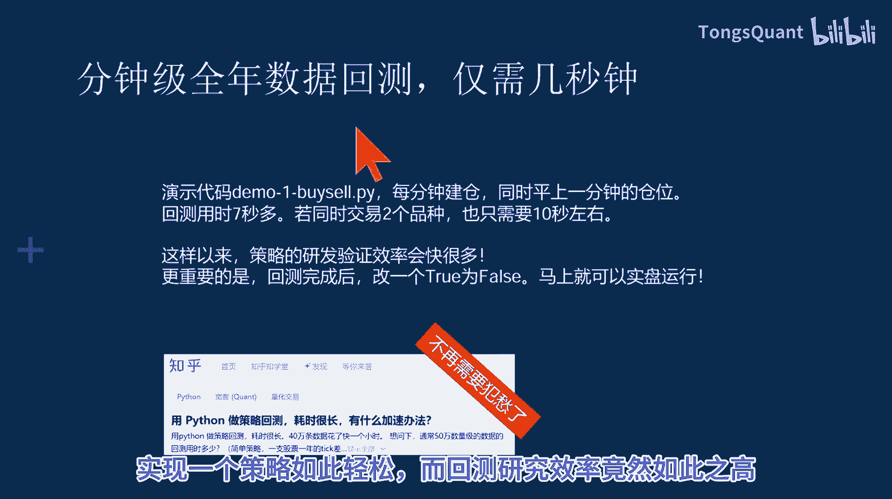

现在我们看一下合约开仓平仓的具体代码，开仓操作就是创建一个class，调用仓位管理的函数即可创建post set，需要有交易对象，时间下单数量，多空方向等参数，平仓也是直接调用函数。

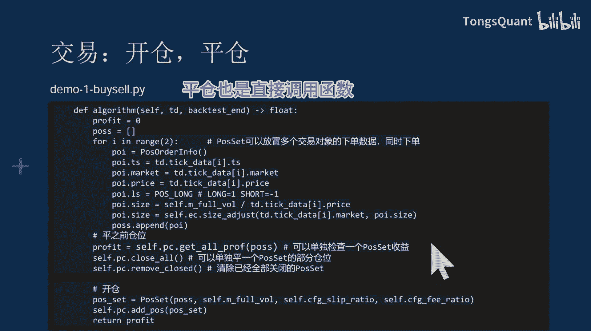

要想回测有效，一定要加入滑点和手续费参数。

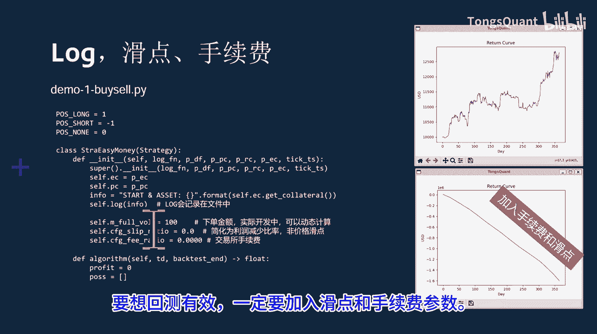

在开仓时需要传入滑点和手续费参数，用于计算收益。

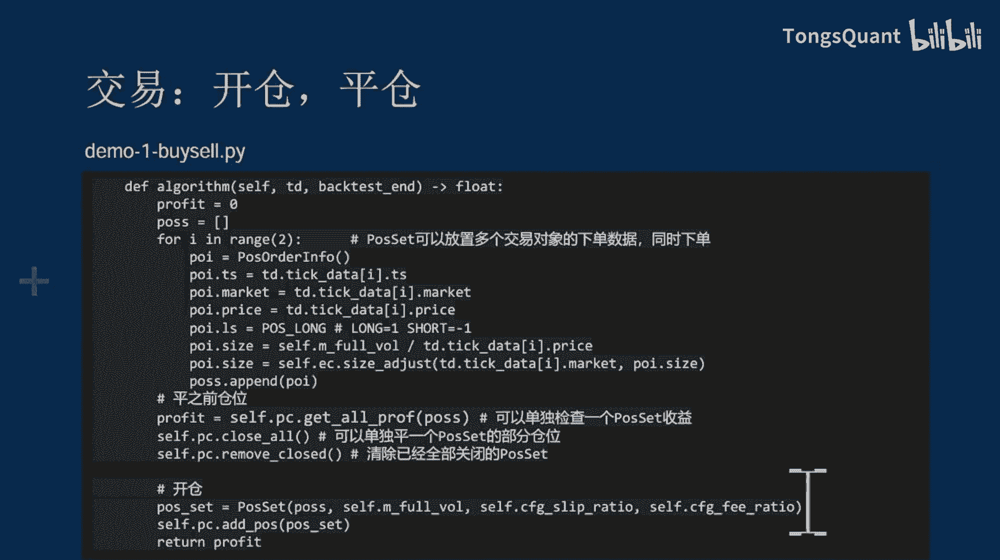

具体的细节和演示代码请查看GITHUB。

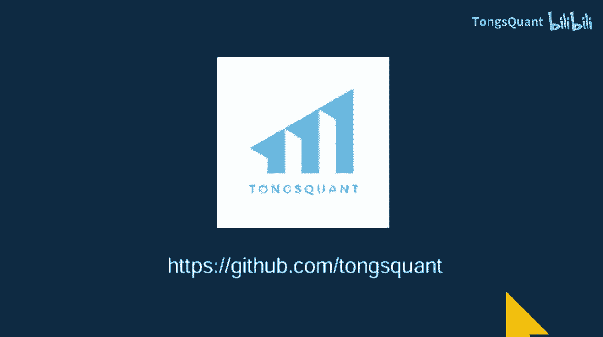

我们也可以使用GPT辅助我们进行开发。

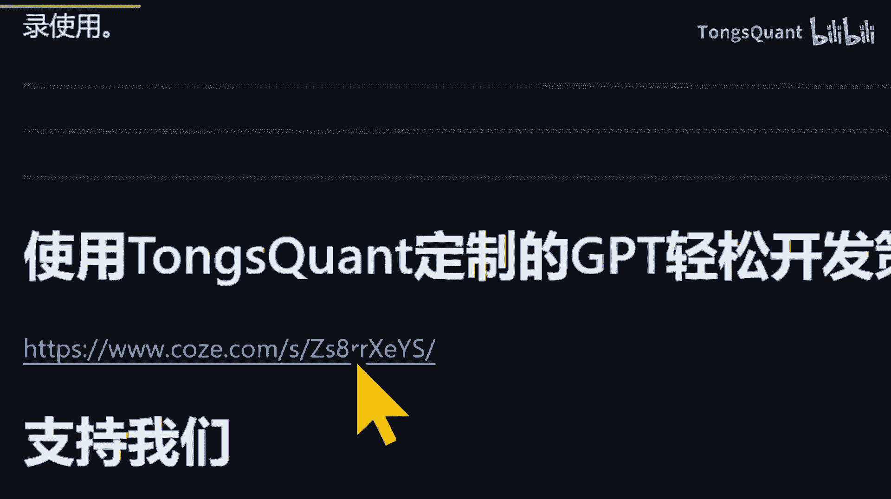

可以让tom quan定制的GPT直接生成代码。

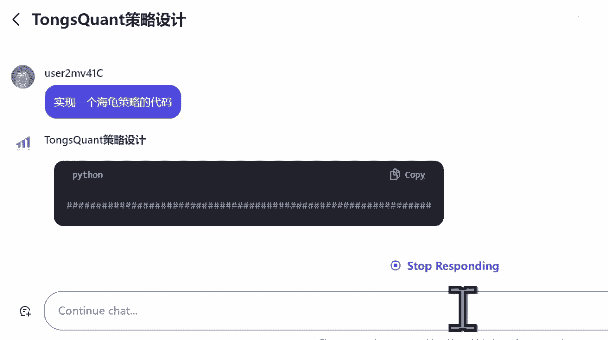

这里是基于最新GPT4O的，具体网址请查看GITHUB，或者在coo z e点com中搜索TMQUANT。

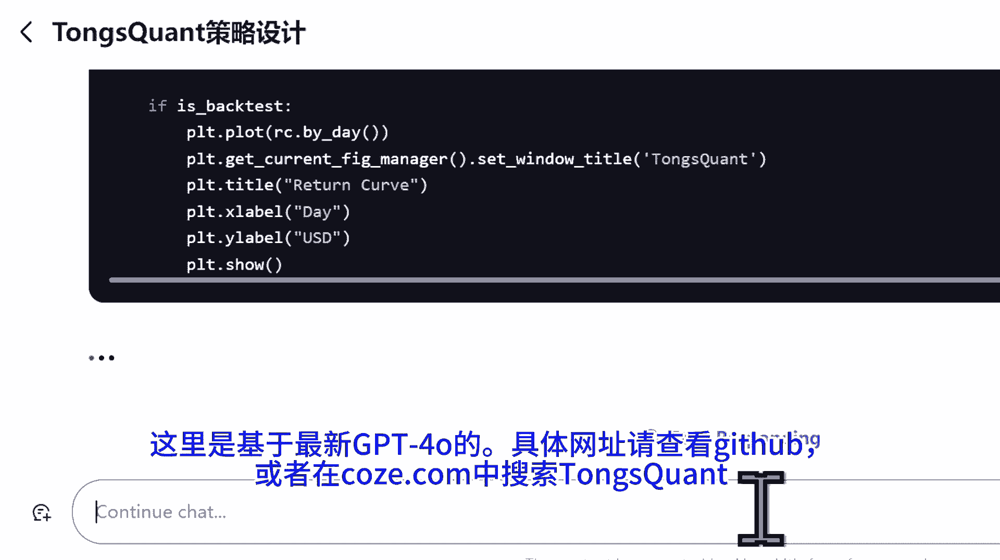

这个定制GPT生成的代码，基本上都可以直接运行，后面会出一个TMQUANT加gt结合开发的视频。

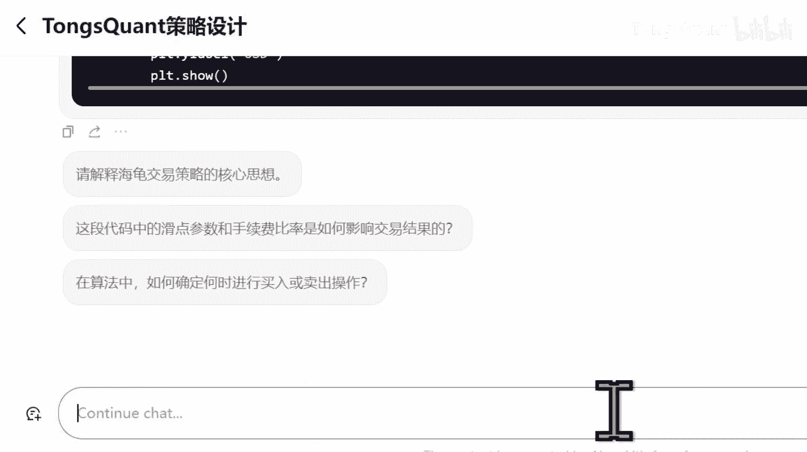

好了，这个视频简单介绍一下TASQUANZ的概要，文档说明以及示例代码。

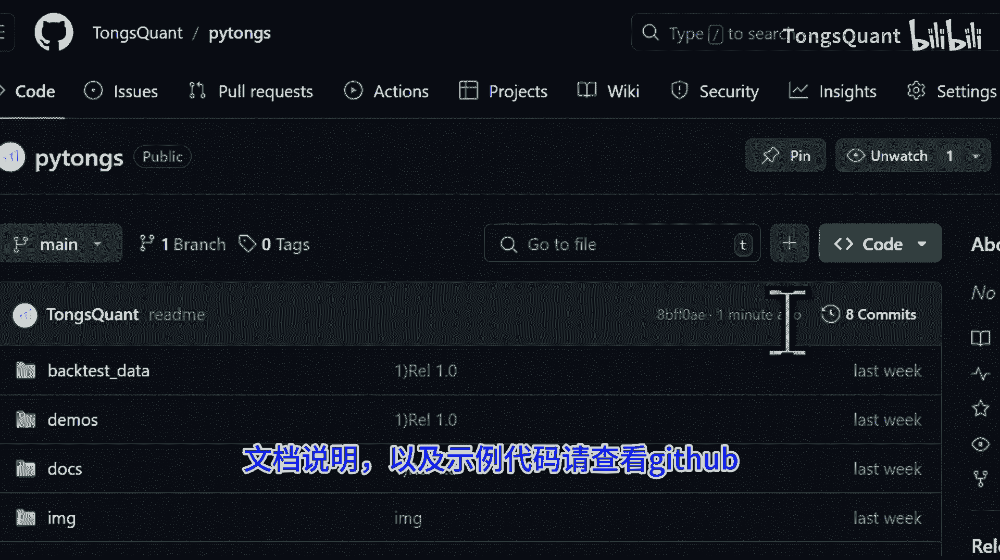

请查看GITHUB，感谢观看，TMQUANT是免费的，请多多支持，希望对你的交易有所帮助。

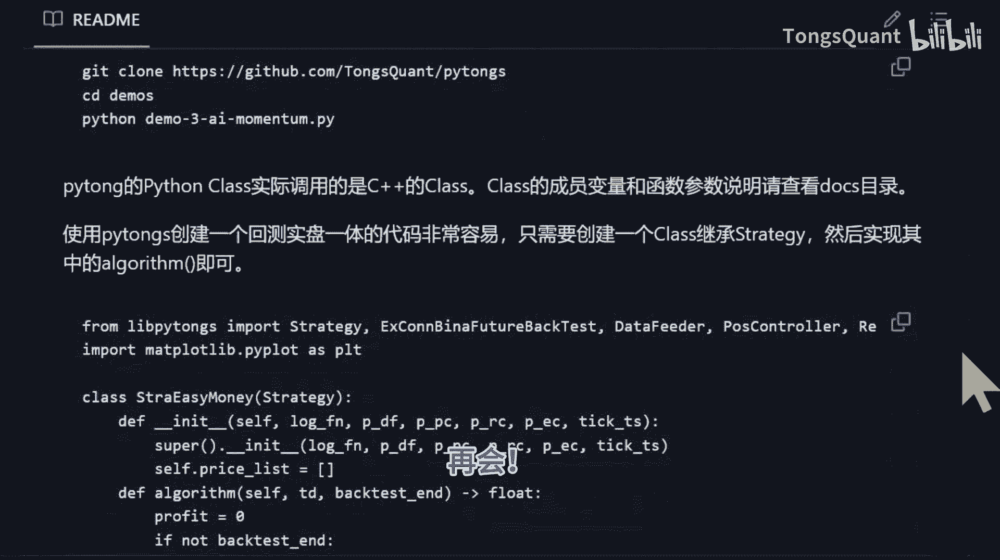