# Darts在股价预测中的应用｜深度学习算法｜时间序列预测-量化金融与机器学习2024 - P1 - 背包2004 - BV16z421879d

好吧，那呃这节课的话我们应该学习这个啊，学习我们的呃TV，啊哎并列预测啊，当然我们这这一小节先讲单变量的啊，单变量的实际上它可以单变量，也可以多变量，而且还可以加入相关的协变量。

这个工具是一个比较强大的一个工具啊，比较强大的工具，但是我们一开始先了解下这个工具啊，就为什么要引入这个工具。

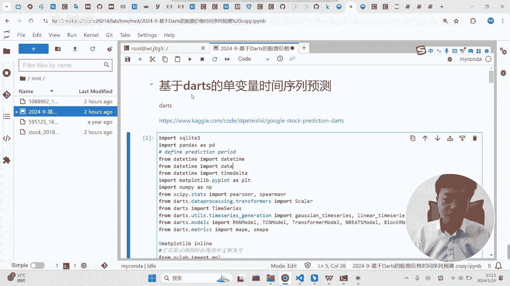

甚至为了引入这个工具，我都教同学们在这个里面啊，搭建这个呃深度学习的环境啊。

就是因为呃现在的时间序列预测要论效果的话，肯定是基于深度学习的效果好啊，传统的什么AARMA这些东西，其实是已经过时了啊，已经过时了啊，这个包的话它它的好处就在于什么呢。

呃它提供了非常多基于深度学习的实践，预测的一个函数啊，而且他把这些函数呢啊就这个包啊，他把这个函数封装的应该是非常好的啊，封装的应该是非常好的，什么叫封装的很好呢，其实大家如果学习过深度学习的话。

就知道就深度学习的算法，你要实现它的话是要做挺多的一些事情的，包括呃包括一数据的处理啊，还有什么呢，还有数据的分割以及神经网络的搭建等等，但是这个工具的话它应该是封装的挺好的，而且它所它的宗主宗旨。

也是希望大家在用做时间序列预测的时候，能够像我们之前用skin line那个标准流程一样，那么简单啊，那么简单，所以说大家在用这个工具的时候要注意点，它其实是对深度学习的算法，做了很强的一个封装的啊。

好吧，我们具体来了解一下这个这个东西，我们运行一下吧，好就当然用的话肯定要装这个包装的话呢，这个包的安装是有赖于你的电脑上有拍，torch啊，而且最好是拍，现在来看应该是拍torch22点，不要最新的。

应该是拍torch2。0。1哈，这个版本会好一点，因为它新的版本它还有点不太支持哈，有点不太支持，我们运行下这个啊，然后把我们的啊数据就传到这里的数据来，读入进来读入进来，读好了之后呢。

下面我们是选择注意下，我老是稍微改了改啊，就这个是不再是3000了，我说啊两两千五，3500的目的，就是为了选能够选比亚迪的股票啊，这应该是比亚迪的股票啊，比亚迪的股票代码，我们就选这一支股票，然后呢。

把这一支股票的日期和收盘价给获取到啊，这个代码大同学们都有，老师并没有把这些代码去掉啊，呃然后注意一下这个这个是干嘛呢，这个是我们深度拷贝，为什么要这里做一个深拷贝呢，如果不这么做的话。

呃这个只是一种切片切片，他还会让自己的数据依附于原来的架构，但实际上待会我们要转变这个东西的索引的，所以还是要做深拷贝要好一点啊，做一个深拷贝啊，这样弄好的话，大家可以看一下这个数据。

就是比亚迪的股票数据啊，啊就这个东西这个东西啊还要做一些处理，才能在在这个包里面使用啊，一个什么样的处理呢，首先的话这一列啊得是一个这个data这一列啊，它的类型必须是啊，不能是整数。

必须是一个daytime，所以说下面我们把它转换成字符串，然后再用data time做了一个处理，这样处理好了之后，你看它的类型就变成了一个这个东西，这是我们这个库它一个必须要求的，要做这样一个情况啊。

做这样一个事情啊，做了这样一个事情之后呢，还得做一个事情，还得做这个事情，这个事情是啥事情呢，这个事情是这样的，额，他设置了一个日期的起止点，然后通过这样一个循环啊，通过这样的循环。

然后把这个日期之间的每一天给append进去了，我们运行一下，大家看一下结果就知道了，最终的结果是什么呢，是这样的，你看他需要把我们要进行预测的这个范围里面，每一天的日期都加进去啊。

每一天的日期加一不能漏一天，为什么要这做这个事情呢，因为我们这里的数据啊，它是非交易日是没有数据的，能理解吗，但是啊这个包有一个很重要的一个需求，这个包它的时间序列要求每一天都有数据，不能缺啊。

它不要不能缺，他必须每一天都有数据，所以说为了呃为了满足这个条件，这里先做一个日期日期表啊，先做一个日期表，通过这个通过上面这个代码做一个日期表啊啊，啊无非就是每次加呃那个那个啊，每次把它加进去啊。

每次把它加进去啊，这个多的天数啊，做了做了这样一个日期表之后呢，他是干嘛呢，他是把这个，把这个日期表做成一个数据框，做成了这样一个数据框，做成数据框之后呢，然后，然后把这个日系表也转换成DTIME。

也转换成DTIME，转换成DTIME之后呢，啊和我们的比亚迪的数据啊，做一个merge，就是其实是一个合并啊，做一个合并，但是基于什么的合并呢，基于这个date这一列进行合并。

基于这date这一列进行合并，会产生一个什么问题呢，比亚迪这个数据里面非交易日是没有数据的，但是这个啊这个新产生的这个这个东西，它每一天都有数据啊，每一天都是有数据的，那么这里定义了一个方式。

它是以这个以这个新诞生的这个数据为准，这就意味着什么呢，他们两个合并的时候，一旦发生比亚迪这个股票没有数据，那么他就会啊那个地方会滞空，但是不会说是不要会滞空，能理解吗，他完全按照这个啊。

这个这个做的这个日期来来进行合并啊，这通做了这一步之后啊，我们可以，可以看看啊，假设做了这一步之后，我们可以看到，这里面肯定是会有很多非交易日被滞空的，一个时间，看到没有，你看这两天就滞空了，能理解吗。

因为他没有交易的数据嘛，但是我们刚才之前讲了，合并的时候又要求必须保留这些东西啊，啊那这样怎么办呢，做一个向前啊，这个位置啊，这些自空的用前面的字来做填补啊，用前面的词来做前补，我们运行一下啊。

然后你可以看到，你看是不是被前面的值做了一个填补，这样的话就填补好了，填补的目的就是为了让整个这个这个东西它，额是满日期的啊，不能缺啊，不能缺啊，不能缺，好那么data3就接近处理完成。

处理好了之后干嘛呢，要给到dot这个包特有的一个，要转换成这个包特有的一个一个数据类型，时间序列，这个数据类型怎么给呢，你看用这个方用用这个啊，用这个方法，然后把数据给到他那，并告诉告诉他时间是这一列。

然后呢我要的那个变量啊，变量是这一列给到他，然后，这样的话我们这个包所希望的这个东西就有了，你看他大概是这样一个形式，看见没有，是这样的形式，看你有点看起来很很复杂啊，就是他无非就是什么呢。

他告告诉你这个时间序列有你索引是date，他有一个comment，这个comment是什么呢，close就有一个一个变量啊，一个变量大概是这个意思啊，大概是这个意思，好吧，这是dot值。

这个时间序列是怎么来构建啊，怎么来构建，构建好了之后，其实就可以进入这个包的时间序列，预测的一个标准流程了啊，标准流程，但是他这里先做了一个啊标准化啊，先做了一个标准化。

这个标准化是所有的数据一起做的呃，但是注意点啊，这个这里的标准化不会有太多的什么问题啊，因为他这里的标准化是很简单的，什么意思呢，他无非就是让所有的这个close的这个值啊，把它除以了一个常数啊。

除了一个常数，就是除了一个具体的常数，就所有的值除了一个常数啊，他嗯他没有做别的标的话，我们可以运行一下啊，我们可以看一下，你看为什么他是它所有的值都在0~1之间，但实际上股票价格不会是在0~1。

他无非就是把这些值除了一个它的最大值作为，以这个最大值作为一个常数，把它处理一下啊，就所有的量除了一个最大值啊，除了一个最大值，就以这样的方式做了一个标准化，这老是有有这个东西啊。

啊其实完全不需要我不用这个吧，这是这应该是在windows下面他用的东西啊，windows下面用的东西。

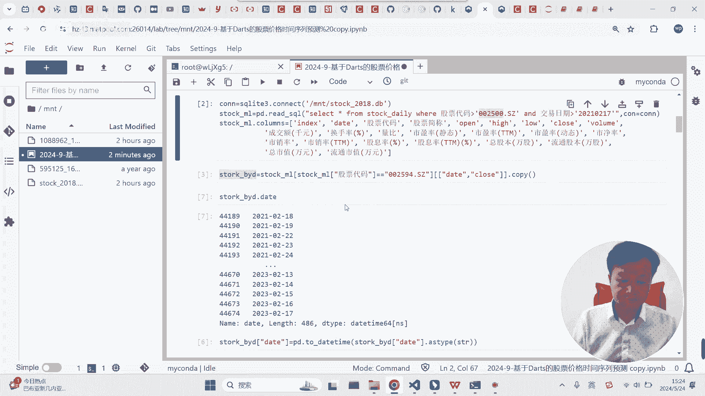

我这样是不是就还是有吗，算了吧啊就这样吧，他每次会会有这个，它主要是因为我们那个代码是在，老是在windows下用的，会调用一个东西啊。

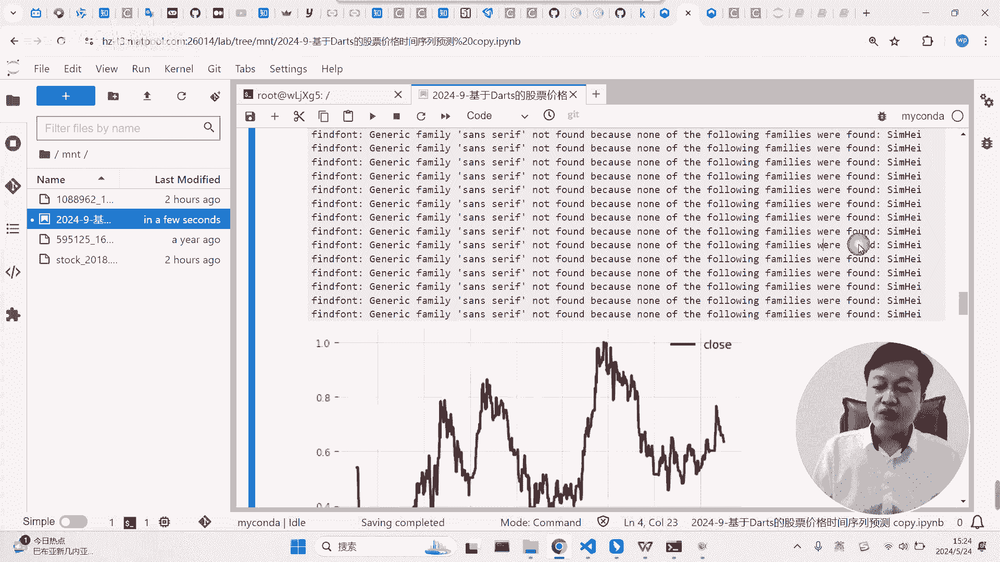

但这里没有没关系啊，主要这只是时间序列。

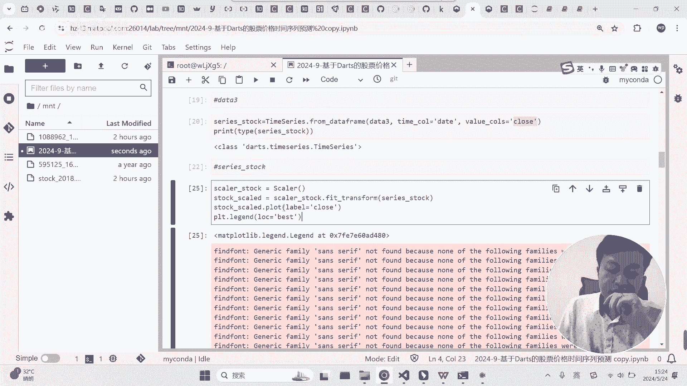

把它一个可视化啊，把它可视化掉，然后我们来运行它啊。

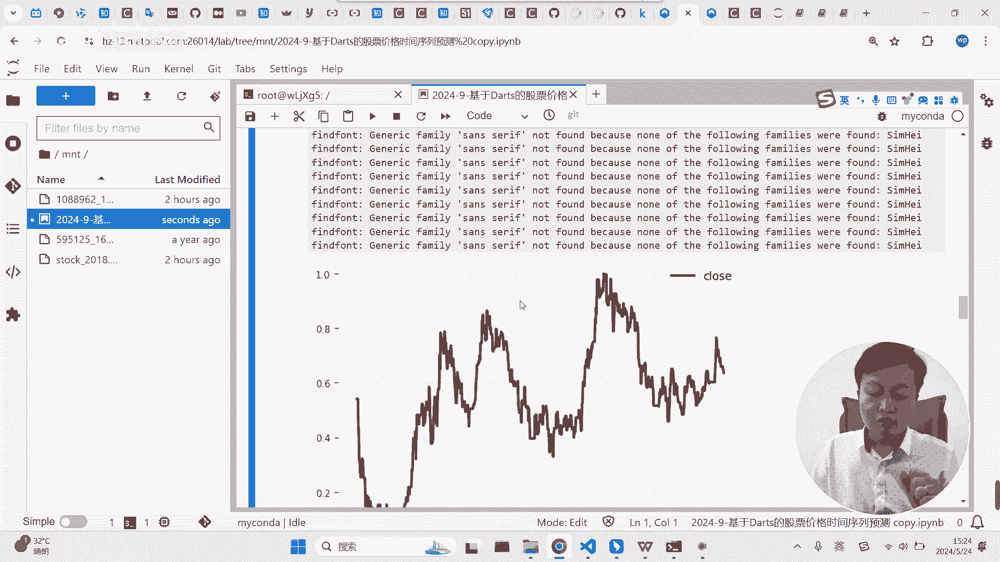

运行它，首先呢这是做训练集和测试集，因为我们这里的数据啊，这个数据应该是有700多个吧，这个数据应该是有看一下长度啊，这个时间训练应该是有720个，这里我们用用前600个作为我们的训练集，后。

剩下的作为测试集啊，是这样子，用的是这个模型啊，这个模型我也不知道是什么模型，反正是深度学习的一个模型啊，凡是深度学习学习的一个模型啊，实际上你可以用其他的模型，而且，你可以用一些别的模型。

实际上只需要替代一下这个函数就行了啊，只需要对这个函数做一个替代，我们这里应该导入了好多别的模型嘛，你看啊这些RNN还有这些这些模型啊，啊这都是很有名的深度学习里面，用来处理做时间序列预测的模型啊。

包括我们的transformer模型嗯，就你要用这些模型的话，多数情况下面函数做一个替代就行了啊。

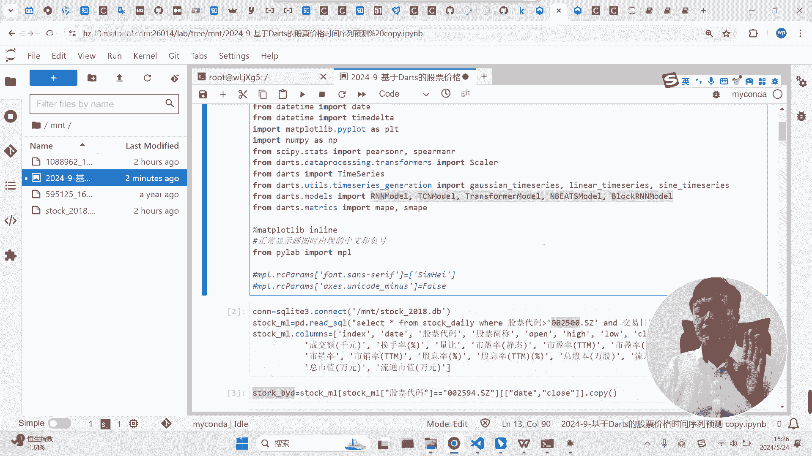

就行了，好我们运行一下，然后这里这里有几个参数啊，这个参数就是深度学习里面典型典型的参数，这两个参数是什么呢，这两个参数是指的是额你用多少用多少，用最近的多少个数据来作为特征，大家能理解吗。

就是用最近的24天的收盘价做特征，然后去预测什么呢，去预测未来的12天的收盘价，预测未来的12个值，就是用最近的24个值预测未来的12个值，能理解吗，啊是这个意思，这个呃这个EPOCH这个东西是什么呢。

是指的深度学习里面的，重复运行进行多少次，他自己讲重复重复进行100次哈，就它会迭代的，要迭代100次啊，迭代100次啊，这个是模型定义好了，然后你看是不是跟skin line是一样的。

就是把数据放进去进行训练就行了，我们运行一下啊，你看，这个会有一点点慢，我们要100次了，你看暂停一下吧。

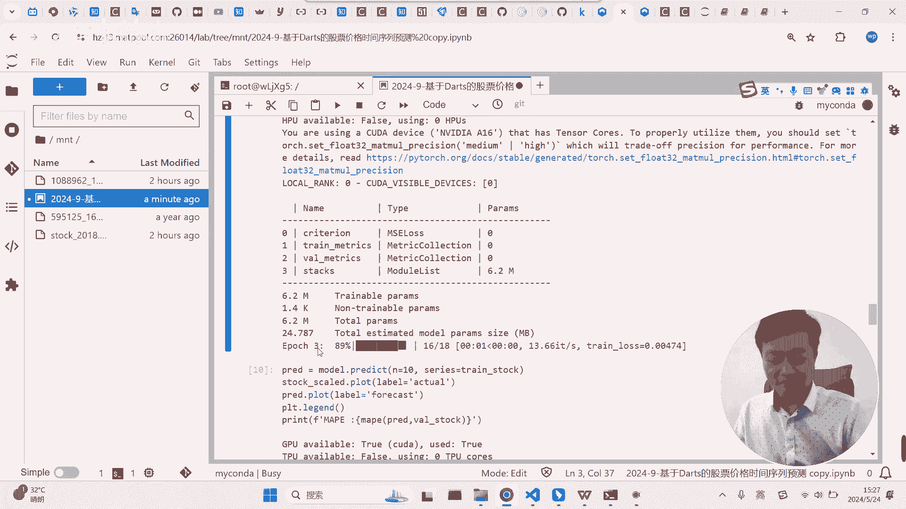

好那个。

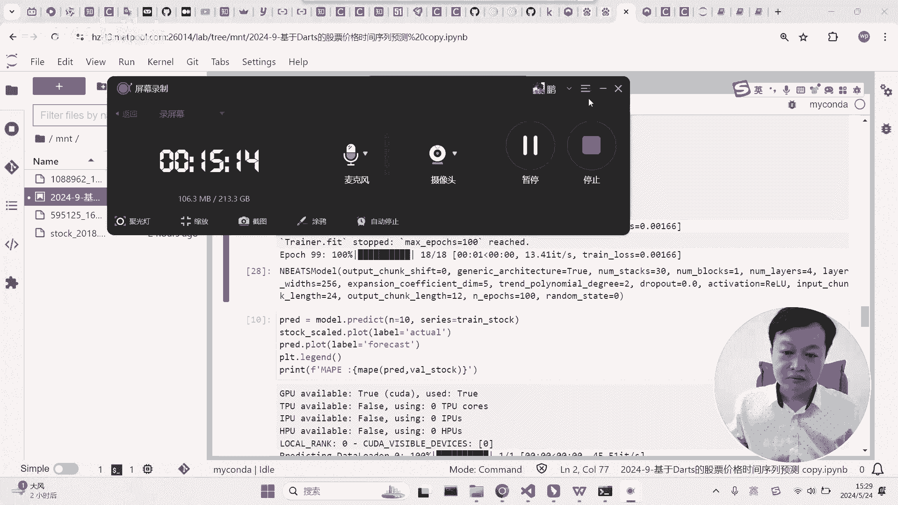

这个搞完了啊，搞完了，然后，模型训练好了的话，然后就可以用它做预测了啊，预测的话大家可以看到。

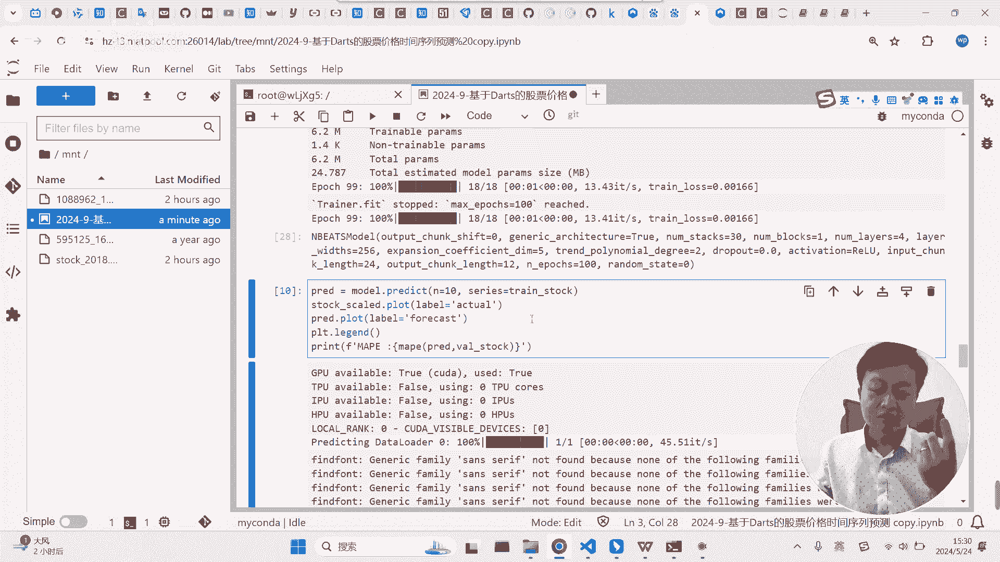

你看呃，其实和SIGNN是差不多的，也是predict，然后呢只不过是这里需要干嘛呢，需要你把训练集给放进去，然后呢N是什么意思呢，N是这个意思，就是以这个训练集最后一个时刻为为最，为为起点。

预测接下来的十个数据，能理解吗，预测接下来的十个数据，当然你也可以预测接下来的100个数据，但是看你个人喜好。

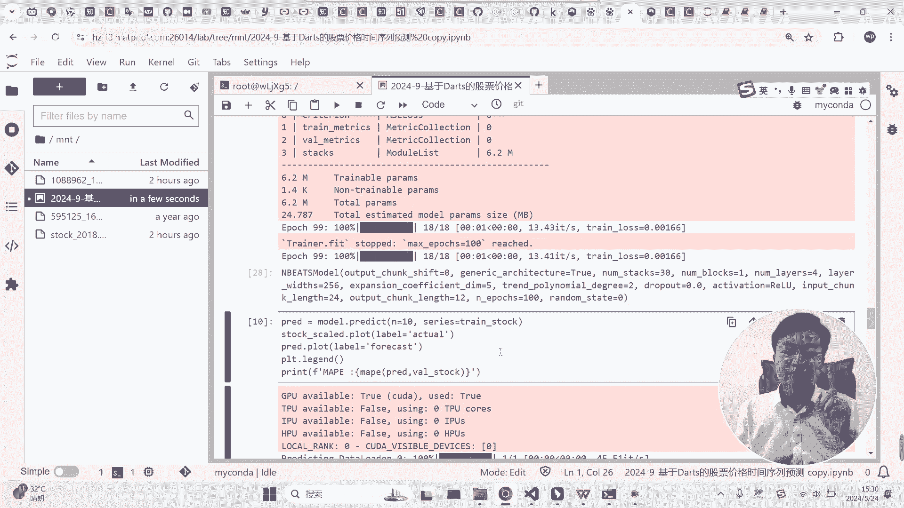

通常不不预测接下来100，为什么呢，因为你看我们的模型是这样的，我们模型是拿最近的24个数据做特征，预测，接下来的12个数据，如果你用。

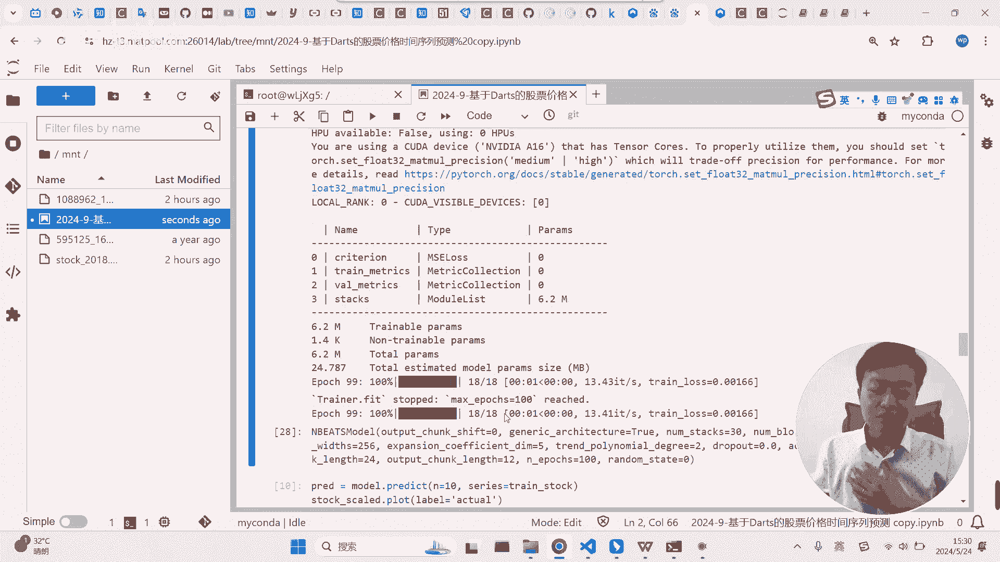

所以说最好你要你要考虑到你预测的一个呃，真实性的话，小于12是比较靠谱一点的，能理解吗，因为你的模型是专门搞，这是用24预测最近12嘛，但是你一样的可以可以预测很很久，他们他没问题。

他因为他会他会他会自己往前推进的啊，它会自己往前推进的好吧，这是这个预测，预测好了之后，然后可以把这个东西给做出来啊，你看这是作图啊。

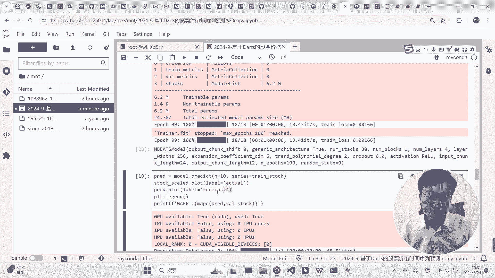

这是作图，我们运行一下吧，好大家记得大家运行时记得把这个去掉，记得把这个东西去掉，这两行导致我下面老是出这个这个这个警告，真是醉了，你看他在这里做了做了十次预测，看见没有啊，就有点看不太清。

但是实际上是做了一些预测，首先，股票的价格的预测，同学们不要期望模型能有多准确，大家能理解吗，股票价格的变化，从来不仅仅是跟它自身的股票有关系啊，跟很多事情有关系，所以他不准确是很不够准确。

这是很自然的啊，很自然的啊，我们可以可以尝试让他搞100个试试看啊，我们可以看一下他根据他的这个自己的预测，你看他大概是他为什么会这样啊，它显然是延续了你看这边变化的趋势啊，这边变化的趋势。

而且它根据什么呢，根据它这里曲线的波动情况，也尝试着去复现它这个曲线的波动啊，大概是这么一个情况啊，啊是这么一个情况好吧，这是一个最简单的额单变量的一个时间序列啊，单变量时间序列啊。

通过这个我们来了解一下呃，大S这个包啊，他的一个运作的基本流程啊，这里面其实最核心的在于什么呢。

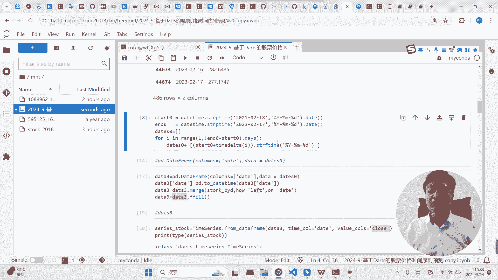

就是呃预测的流程本质上都是固定的啊，都是固定的。

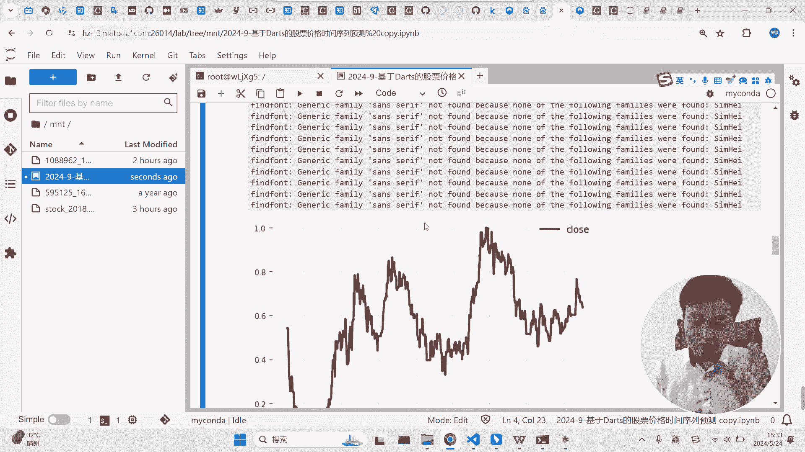

啊就像这样做一个拟合，而且这个流程和我们的CSKLINE是差不多的，唯一的唯一的难点在于什么地方呢，就在于呃这个时间序列怎么把它构建起来啊，怎么把它构建起来，就这里啊怎么构建起来，构建里面注意两点啊。

一点的话它里面不是不能有空值啊，不能有空值，就他的时间啊，他的时间必须是daytime啊，必须是daytime，然后呢不能有空值，你每一天都得有那一天的值，所以说你得把一些空值给填补上。

满足这两个条件就能很方便，用这个方法把你的额数据转换成他所满意，它所需要的这个时间序列嗯嗯转好了之后，下面的都是固定流程啊。

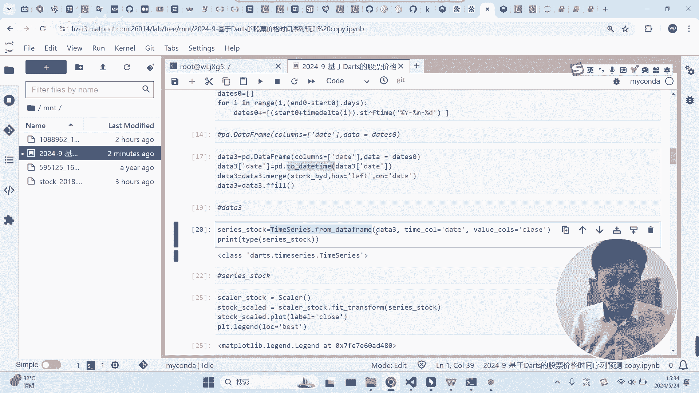