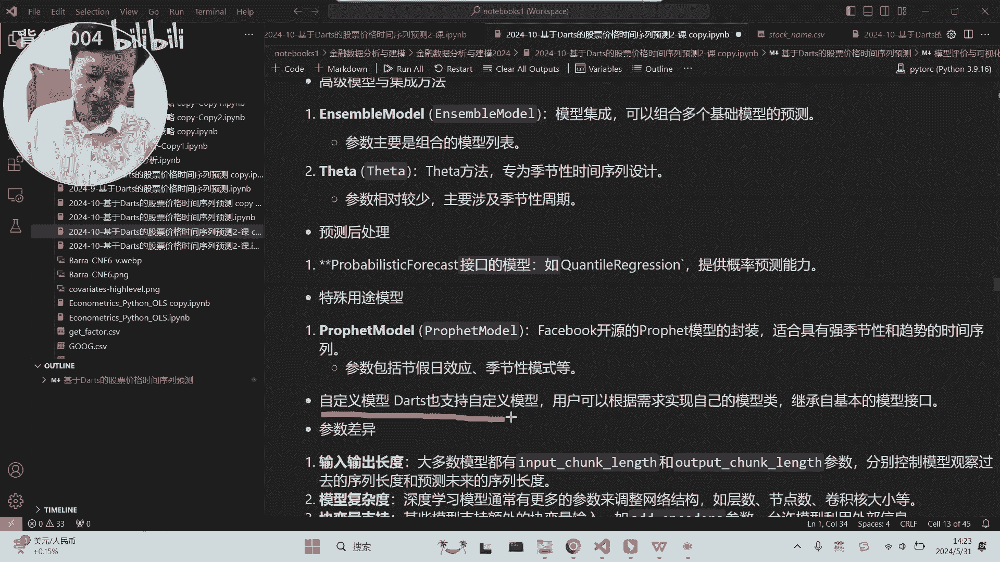
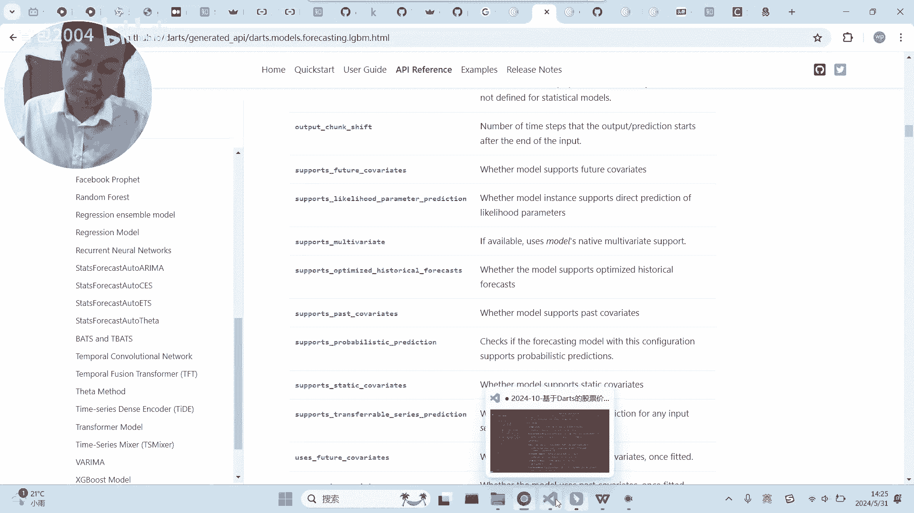
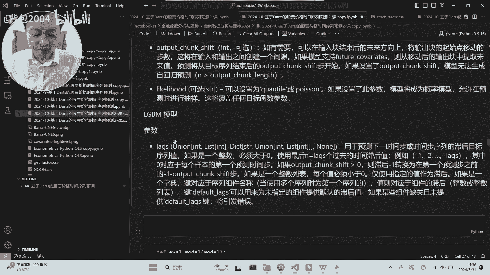
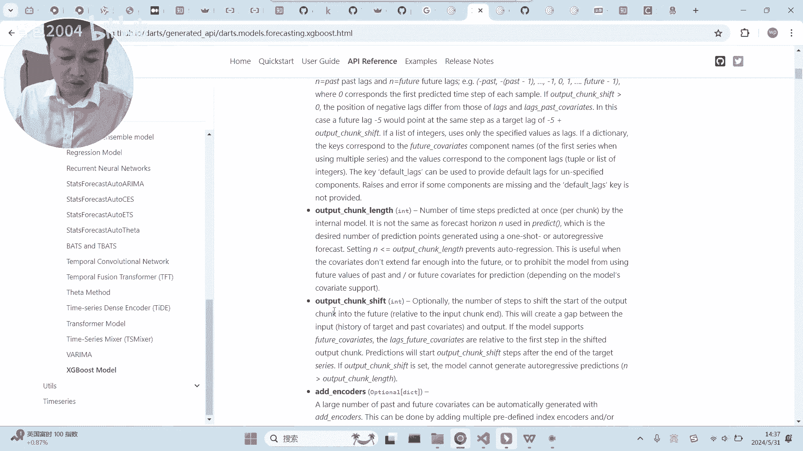
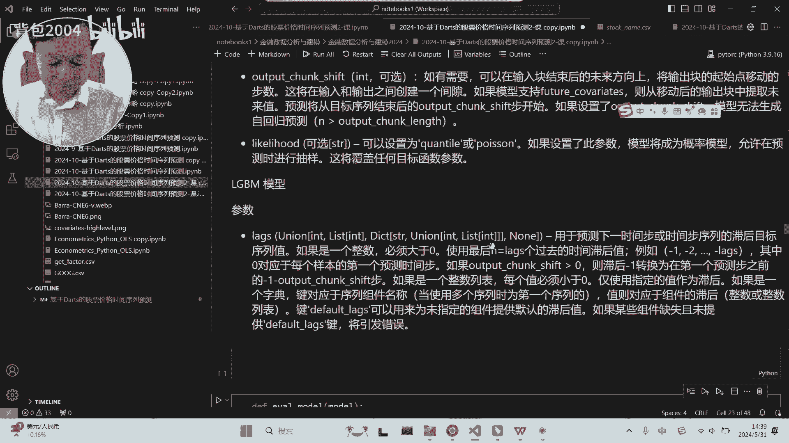

# Darts的模型分类及其参数｜时间序列预测-量化金融与机器学习2024 - P1 - 背包2004 - BV1Kf421R7HL

好，接下来我们讲一下这个dot这个库里面的，提供的模型大概有哪些啊，然后主要是这些模型的参数的一个，大概的区别啊，大概的区别，我们之前用的模型是啥模型，我看一下这个模型老师也不熟啊，我只知道他是啊。

就这个模型知道他是一个比较新的模型，深度学习的，他名字叫啥，我看一下它的中文名字叫，我看看啊，我有没有，你看他叫什么神经基函数展开分析模型，这是个啥，我我我我不太了解啊。

老师对时间序列预测可能就了解这一类哈，首先我讲一下，就大使他最亮点肯定是深度学习的模型，但是它也提供了一些经典的模型啊，当然经典的模型如果你只用经典的模型，其实完全不需要用DOS啊。

你用那个Python另外一个包就就够够的了啊，但他也提供了几个经典的常用的模型，首先这肯定是同学们都了解的啊，一个是ARMA啊，是回归移动平均啊，这个模型这应该是经济学里面最常用的。

号称经济学里面最好的模型啊，然后再是一个很简单的模型，这个指数平滑啊，就它会提供经典的一些模型，但是核心点呢还是它能够提供一大堆，深度学习的模型啊，这里他大概是举了一些例子啊，可能最用的最多的是RNN。

以及他一系列的东西啊，什么R基于RNN所实现的什么LOSTM，还有这这些东西啊，包括什么呢，呃时间卷积啊，时间卷积模型，还有这个transform好，这个也是很火的。

通过呃圈层虹膜应该是我们现在大语言模型啊，现在最火的这个深层次机，深层次机器学习里面核心的一个算法啊，核心的算法呃，而且现在把transformer用到时间序列里面，其实是有一些争议的啊。

有些人说其实效果不好啊，我看过一篇论文，说效果不好，但是不管怎么说，他他把他打包放在这个，在这里面大家也可以试一下啊，也可以试一下，它提供了非常多深深度学习的模型，除此之外的话。

他应该还提供了一些混合模型和一些集成方法，这个老师还没用过，坦率的说，我就我们就了解一下就行了啊，了解一下就行就行了，包括什么呢，包括一些很强大的模型，并且它把它封装好了，是这个啊。

这应该是FACEBOOK开源的，一个很强大的时序预测模型啊，啊他也把它封装到他的这里面了啊，具体老师也没用过，此外的话他这里还提了一下啊，当然这是我们那个生成的啊，他这里提了一下什么呢。

还可以自定义模型，其实我觉得这个挺重要的，因为用到了，如果用到了这个级别的时间序列预测模型的话，绝大部分人应该是搞学术的了啊，搞研究的了，就如果能用到这个级别的实验训练模型，所以说很可能是有需求的。

因为你首先呃这个这些人用这些包，很可能是为了什么呢，为了做，把这些模型作为一个基础模型来来验证它，发它创新的模型的一个有效性啊，就这也是一个非常这个包很重要的用途，就是如果你是一个搞学术的。

你是用来你是来研究时间序列预测的，你能提出你所提出一个新的一个，改良性的一个算法，然后你用他自己的这些函数呢呃来做基模型，然后你用用你的算法来进行结果结果对比，这其实是一个啊啊是这样的好吧。

所以说这个时候有可能就会用到什么呢，用到所谓的自定义模型啊，把你的模型也搞进去啊，用他的这一套方法来实现啊，这这一套语那个语言逻辑额。

和具体的那个这些模型的位置，大概就在这里看见没有，大概在这个链接里面，你看他他除了刚才讲的，其实有很多核心点呢，就是什么呢，核心点就是呃传统的这些模型啊，咳除此之外呢就是你看深度学习模型啊。

这是RNN啊，然后还有我们刚才的这个东西啊，就这一大坨啊，应该都是深度学习的哈，除此之外呢，他还封装了很多什么呢，封装的很有名的，封装了很有名的一些机器学习方法进来，他也是把这个方法用来做实验训练子。

你看这个啊，X级boost，是在45年前非常火的一个机器学习模型，45年或者56年前啊，78年前已经挺长了啊，除此外还有什么呢，你看还有这个NGBM，这也是一个经典的机器学习模型啊，是微软做的开源。

当年也很火啊，至少在非深度学习算法里面，这个模型应该是相对非常好的了，它是一个基于决策树的模型啊，还有这个这也是一个机器学习的模型，好吧啊，这是他所提供的模型，有这样一些，其实我觉得就三类吧。

一类是经典的传统模型，还有一类是来自于机器学习的模型，然后再一类就是深度学习模型啊，深度学习模型应该是最深的啊，最新的啊，最新的，咳额这些模型的不同呢，它其实还带来一个不同，什么不同呢，就是参数的不同。

当然我们这里的参数并不是指什么呢，啊并不是指额这个模型特有的一些构建参数，而是这些模型在使用的时候，其实它本身的参数就会不一样，我们这里可以举例子，你看啊下面这个啊。

这里是把那个把这里的机器学习的这个流程，封装了一下，看见没有，除非这里就是做训练，做训练，然后呢这里做预测，然后这里算出什么呢，算出他的那个评价的指标，然后把它封装好了之后，你看这里是用了这个模型。

这个模型和这个模型，这三个模型应该是基础模型哈，你甚至可以什么呢，甚至可以不输参数直接用啊，都可以啊，甚至说不不输参数直接用都可以啊，都可以，而且效果也似乎没有那么差，效果也似乎没了。

你看我们之前好像也到了十级，是不是我们其实可以把它拿出来看看，就他的结果结果拿出来看看，看一下这这种模型，它一般会是一个什么样的一个预测，什么样的一个预测，啊他已经弄好了，但是这个模型没有保存呀。

我们看一下他这个这些模型，预测后的几个结果吧，你看这是指数平滑，指数平滑，我们用它等于它，我们还是放到外面吧，放到放到外面，啊然后我们看一下，啊他就不需要了，指数平滑实际上就不需要这个东西了啊。

就指数平滑的预测，他是不需要这个序列的，它不像之前的啊，所以这也是不一样啊，这传统的模型只需要给他这个就行了，你看哈他就是这么搞的，这么搞呢，他的这个才才12%，是不是哈，你所以你看到指数平滑。

他的预测是非常平庸的哈，非常平庸，它它甚至没有什么呢，他没有去猜测这里面的波动性，直接就一条横线，这是这是什么呢，这是经典的模型，对于这种毫无规律的波动，非常常见的一个结果啊，因为经典模型它它是要看有。

它是要他预测简单的那种趋势，很明显波动很明显的，它可以，但是对于这种杂乱无章的这样一个东西，他他是不会去考虑这里面的细节的啊，包含你看我换一个别的吧，换这个看看，我们换这个试试看，按这个试试看。

好了好看，然后再看一下是是不是一样的，所以经典模型包括这个所谓的ARMA，它不会得出太多有什么变化的一个结果哈，不会得到一个什么有变化的结果，通常就是这样，他就是会在这个点做一条线。

这就是他的所谓的他的预测了哈，看到没有，其实都是一样的啊，额不同点在于什么呢，不同点在于我们刚才的，你看呃，这是我们刚才的模型啊，但是刚才的模型运行起来就有点，刚才这个模型我们已经已经运行过了。

我们就不搞了，好不好，会有点时间啊，会有点时间啊，我们可以运行这个，我们可以运行这个RNN模型，我们放到上面来运行吧，呃RNN模型呢大家注意点，大家可以看一看啊，你看我们这里还是什么呢。

还是用过去的24个时间预测未来的12个，但是你可以看一下他最后的一个情况啊，我们运行一下，你看他这里当你运行的时候啊，它会出现一行命令，这就是RN的一个特色啊，它是什么呢，就是这一个系列的深度学习啊。

他接受这个参数，但是呢它实际上这个参数它是固定的，始终是一什么意思呢，RN这一系列的这个循环神经网络，这包括LSTM这一系列的神经网络的预测，它始终是去会用之前的啊，之之前的数据来预测最近的那一步。

接下来那一步的一个结果，他不会跳的预测能理解吗，如果你要求他跳的预测，他无非就是把这个最近的这一步预测出来之后，然后又结合前面的真实数据，然后再预测下一步，然后你再让它预测这个呢。

他无非就是结合这两个他预测好的数据，来预测下一步，懂吗，他始终是要他不能跳着去预测下一下一步，它只能是一个个预测啊，一个个预测，而且每次都是预测这个数据里面最近的那个，这是所谓的呃RNN这一个系列模型。

所一个特一个特有的东西，所以说当你给它这个东西的时候，他实际上是对他来说没用的，所以说他说你看他这个嗯，他直接把它设置成它等于一了啊啊它等于一了，好吧，我们看一下它的结果，结果就是这样子啊。

结果就是这样子，我们也可以用用这个模型来做一做哈，来做一做，注意下，这个时候我们是让这个模型来预测什么呢，来预测接下来的所有值啊，他只能预测一个，他接下来的所有值的预测呢，显然都是什么呢。

显然都是自回归，能理解吗，他没有用真实数据啊，没有用真实数据，用的都是自回归啊，用的都是这就这里都是用次回归，我看一下他的那个，他的那个是多少，这个是14%，其实也好啊，其实也好，额这是这个模型哈。

这是我们的RNN，包括还有一些其他的模型，什么模型呢，我们可以看一下这个额net g b m额，这里面几个参数老师讲一下呃，这几个，就这个刚才的这个模型里面这几个参数，其实老师已经讲过了啊。

这个就是用之前的24个时间序列数据，来预测接下来的啊12个时间序列数据，而这个是什么呢，这个是我们的那个迭代的次数，要迭代啊，让他迭代50次啊，这是个随机的一个状态啊，你把它定一下就行了。

额对于RN他是不需要后面这个的啊，不需要后面这个的，但是对于什么呢，对于这里面还有一个量，大家我老是没用，但是我可以跟大家讲一下什么量呢，是这个，这个量这个是什么呢。

这个其实对我们股票预测实际上是更有用的，你想想我们之前做股票预测，我们通常是什么，还记得吗，我们用今天的这个数据，我们预测十天之后的涨跌，还记不记得，或者是用预测30天之后的涨跌。

我们并不关心它下一天到底是什么样子，能理解吧，这个时候呢有一些模型就会提供这样一个参数，当然RNN是提供不了的啊，就是RN这一系列，因为RN始终是会预测下面一步，再再通过下一步再预测下面一步它不能跳。

但是有些很多模型是可以跳的啊，而我们刚才用的这个模型呢，它是提供这个参数的啊，这个参数就是什么呢，就是你可以跳着去预测，就是啊，可以在输入输入快结束后的未来的方向上面，将输入快起始点移动移动的步数啊。

这将在输入和输出之间产生一个间隙啊，间隙就是你你用这24天的数据，不是预测接下来的几天，而是预测跳过啊，比如说预测十天之后的接下来的几天数据啊，你要预测这个啊，预测这个好吧，这个时候你就用它来进行定义。

当然你要你要你这个间隔间隔多少天，你是通过这个来让它，比如等于两等于二，那意味着你你的输入量和输出量之间，是有一个空隙的，这个空隙就是两天啊，这个空隙就是两天好吧，这是这个参数的一个意义啊。

这个参数的意义，嗯大部分的深度学习模型，都是具备这个这两个参数的哈，但是呢机器学习模型好像有这么一个参数。

就像LLGBM我们可以看一下，我们可以看一下它的机器学习，你看额这是x g boost，那他会有这个参数，虽然说他其实有这个参数，看到没有，他下面其实有这个参数啊，有这个参数，而且他在实际用的时候呢。

实际用的时候他直接定义这个参数就OK了，但是呢他还得定义这个呃，老师的感觉这个参数应该是是不是啊，是不是和，和这个是和这个input那个东西是一回事啊。

因为我没有具体示啊，老师也是跟着大家一起在学东西，就这个参数啊，他可能和我感觉可能和这个是差不多的事情，但是我我不确定啊，不确定哦，它可能和那个，和这个参数是差不多的，什么呢，它是用它，你看他这里讲过。

他是用来预测下一个时间步和，下和后时间部序列之后的一个目标，就是你要预测接下来的哪个目标，他是这个意思，这个和这个不一样的地方在于什么呢，这个它是可以定义多个目标的，但是这种机器学习他是只预测一个目标。

所以说他这里定的其实就是就是这个看到没有，就是就是你问你预测，你当你给了这个时间点的数据之后，预测接下来的过几天的数据啊，如果要过两天，比如预测接下来第三天的数据啊，还是接下来第四天的数据啊。

这是用这个来来来来定义的啊，但具体老师没用，我认为大概是这个意思，就是对于这种机器学习过了，转变过来的这些模型，这些实验训练模型，它通常只给出一个值啊，通常只给出一个值，而这个呢就是定义这个值。

你你你给出的你你的输入量呃，距离是多少啊，如果是就就预测输入量之后的一天，他肯定他也很可能就是一是吧，如果要隔一天的话，很可能就是二啊，可能是这个意思啊，可能是这个意思好吧，呃这是这三类。

一类是最简单的统计学模型，还有一类是深度学习模型，还有一类呢是来自于机器学习的模型啊，他们在参数上面有一点点不一样啊，有一点点不一样呃，机器学习模型呢主要通过这种参数来来弄啊。

然后呢呃不就是深度学习模型，主要是通过这种参数哈，然后机器学习呢它它应该是会利用这个啊，会利用这个，然后一般模型的话就就甚至不用参数都行啊，好吧，这是这里面模型的一个一个区分。

以及它模型对应的参数的一些意思啊。

