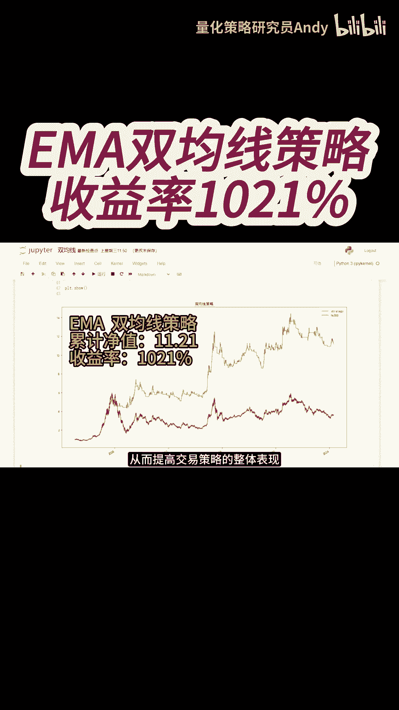
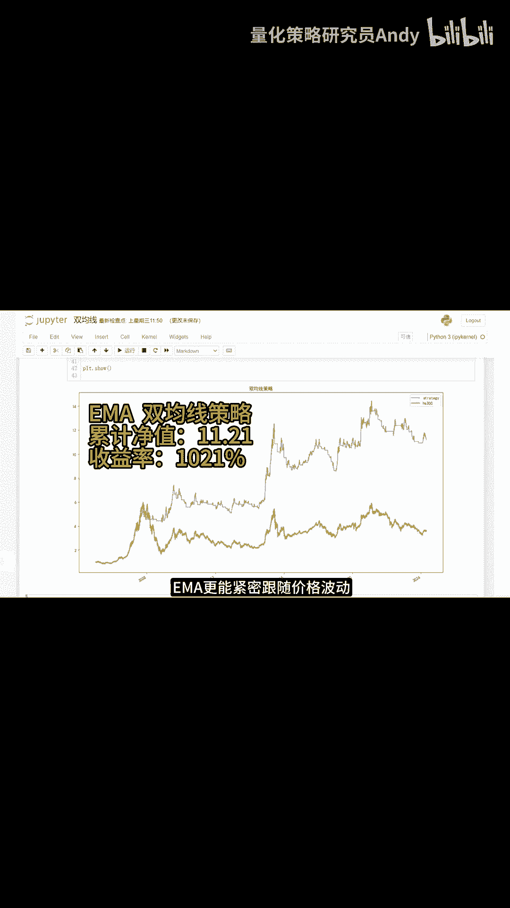

# EMA双均线策略收益率1021% - P1 - 量化策略研究员Andy - BV1uT421y7MG

下面我们把均线的算法修改成指数移动平均线，EMA再重新运行，代码回测一下，可以看到图中这条蓝色的曲线是，我们采用EMA双均线策略，累计净值为11。21，收益率为1021%，比简单移动平均线的策略。

多赚了420%，更是远远跑赢了沪深300指数，EMA由于其加权特性，对最新价格数据赋予更高的权重，能够在市场趋势初期更快的发出买卖信号，使得交易者能够更早的进入或退出市场，捕捉到更多的盈利空间。

当市场波动加剧时，EMA更能紧密跟随价格波动。

减少虚假信号的产生。