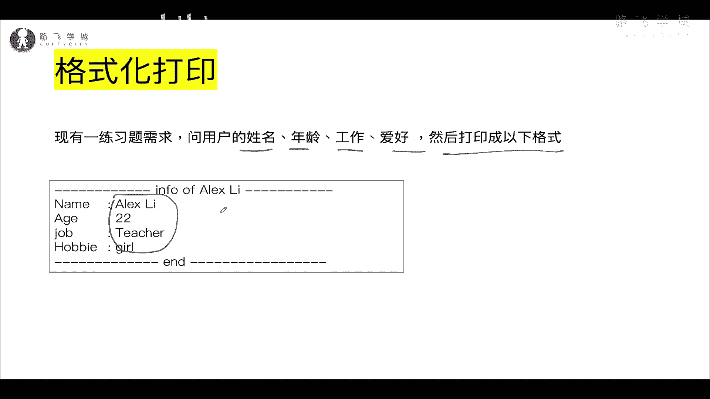
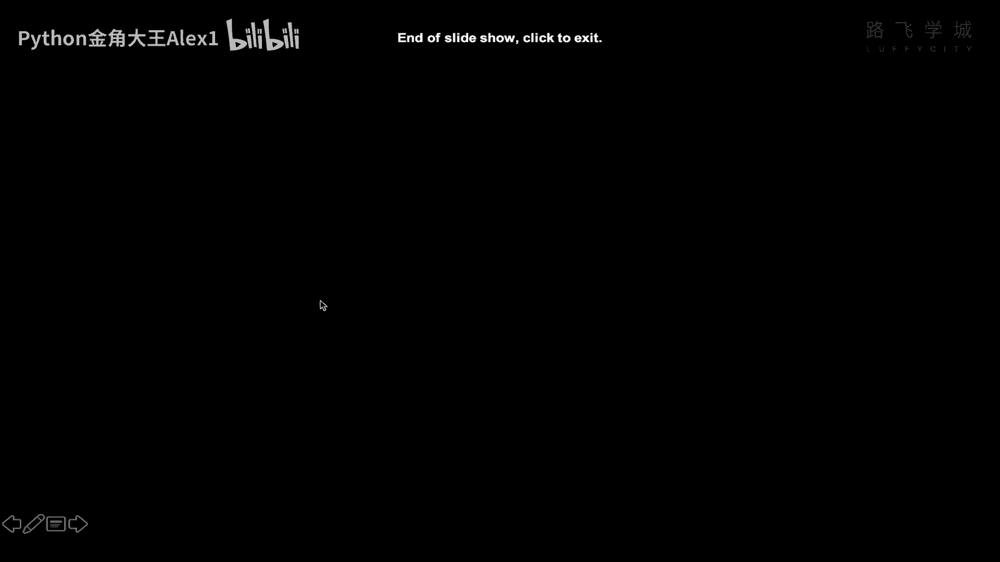
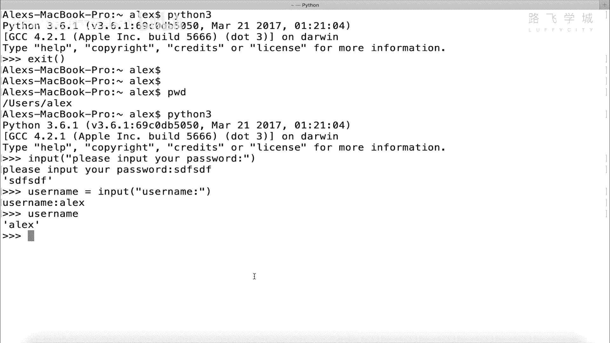
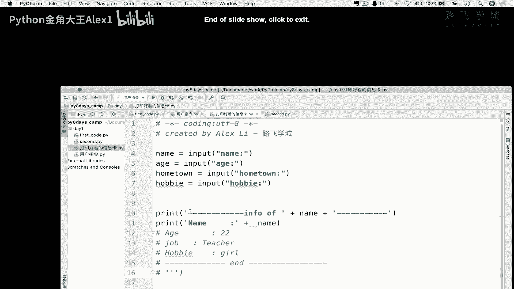
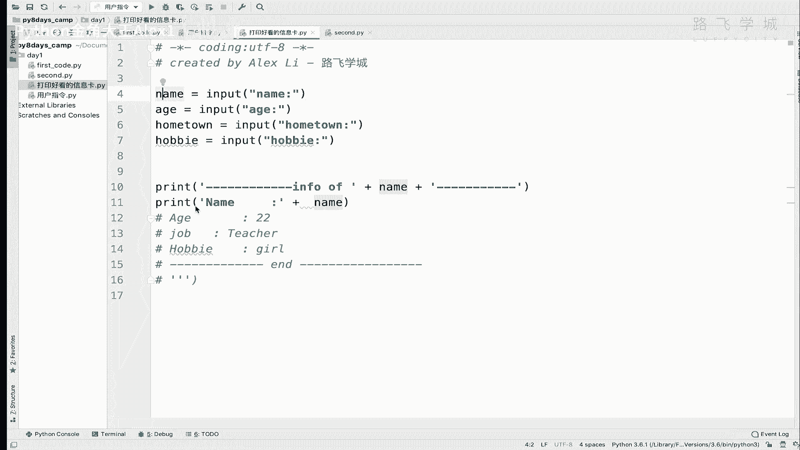
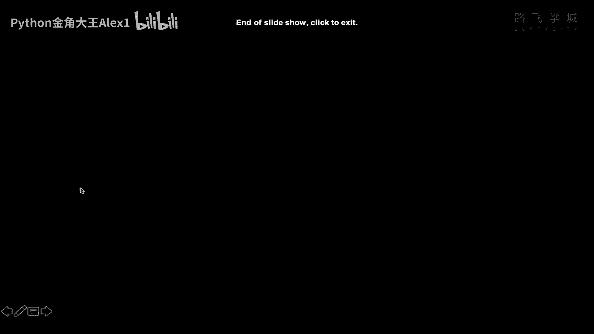
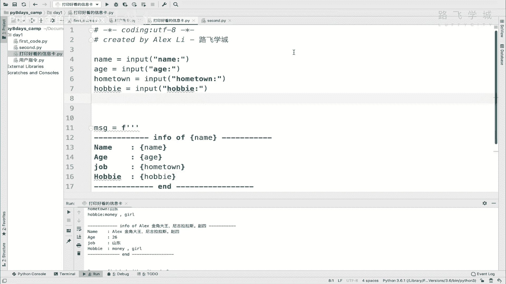

# 【2024年Python】8小时学会Excel数据分析、挖掘、清洗、可视化从入门到项目实战（完整版）学会可做项目 - P15：14 格式化输出-打印好看的个人信息卡 - Python金角大王Alex1 - BV1gE421V7HF

OK同学们，这节课咱们来学这个格式化打印，格式化打印干嘛呢，就是说把你这个呃输入的输出的东西，打印的可以好看一点啊，格式化打印吧，打印好看的个人信息卡，来看一下这个需求必须要有一个练习题。

我需要呢首先你根据咱们上一节学的啊，用户读取用户的输入，让用户输入姓名年龄，工作爱好啊，然后呢这个打印以下格式打印这个格式类似，除方框除外啊，就看到没有，这个这个里边首先一个波浪线对吧。

这个横线对波浪线，然后打印这几个信息，看到没有，把这个用户的这几个信息打印成这样，然后最后在一个结尾打印这个格式啊，你来吧，你怎么做，首先注意了这几个信息可是用户输入的。

所以就是说你用户输入的就是怎么讲，你你你你你应该把它先存成一个变量，最后把它放到这里来，对不对啊，不是写死的啊。

你怎么去打印呢，怎么打印呢，我直接给你揭晓答案，你可能现在能想到的。

你可能现在能想到的方式是这样的啊，是是哎哎哎在这里换挡。

换挡换挡，你可能想到的答案是这样。

看到没有，这个先让用户输入，这就不说了对吧，那打印的时候呢，由于你这个是不是用户输入已经存下名字来了，存下存储变量了，你要把这个你为了打印那个格式，对不对，为了打印那个格式，你要把这个前面的这个字符串。

跟你这个用户的变量，这个变量给它拼起来，对不对，给它拼起来，所以呢这个导致的一个什么，导致的一个就是这样啊，字符串拼变量加加变量名就是拼起来了，再加上后面这个波浪线，是不是，然后这是一行。

然后后面呢再打印你这个什么呀，再打印你这个内容也是一样的，对不对，再跟这个内容拼起来，后边也是一样，我就没写了，懒得写了，这样行不行，这样可以，但是这样太low了，这他妈的对不对，我现在只有四个值。

你要是有这个打印十行的话，你这么一个个的拼，这不应该是程序员干的活，这真的是码农，对不对，搬砖这么一点点垒起来的，肯定有更高效的方式，让我很容易的打印出这种格式，打印出好看好看的个人信息卡，明白吗。

肯定有OK吗，其实很简单，你这里是不是已经在这里存好变量了，我在这里就写那么一个完整的字符串，看到没有写就写什么。

就把这一整个，假如说把这一整个都copy不了啊。

Sorry，我把这一整个都给它copy过来，大家来看一下啊，我可不可以这样，我先啊，message等一个，我就直接给他copy过来，然后我在这里把这个先删掉，我把这个用户输入的这些变量直接在这里。

能不能在这个字符串里直接引用这个变量呢，直接如果能直接引用的话，如果能直接引用的话，我就不用那么拼接了，唉这是最好的方式啊，这是最好的方式，如果能直接引用，怎么引用，当然是可以的，直接在这里面写。

告诉你一个语法，看着看着看着一个大括号，然后里面直接写你的内容，好同志们，你只要这样写，你就相当于引用了外面这个变量，也就是在字符串里引用这个变量对吧，它程序解释器解析的时候一看见这个大括号，对吧啊。

就知道哦，这是引用的外部一个变量，能理解意思吗，但是这还不够，这还不够，你不相信的话，看一下啊，我执行一下，我print这个MSG，看着啊啊这个额执行，这还不够啊，你说这样是真的就能引用外面的了吗。

来看一下就行了，上海，然后大家来看，你看这个打印它没有任何引用啊，他直接把这个就当做一个普通字符串来打印了，能理解意思吧，直接普普通字符打印了，所以我告诉你啊，还差一小步。

你把在这里面写了中括号和大括号之后，同时在这个整个的字符串外面，前面加一个字符F，同志们加一个F，你看这个色儿都变了，是不是色儿都变了，你只要加了F就告诉解释器啊，这不是一段普通的字符串。

这个字符串里面包裹着，就是这个字符串里面包裹着外面的变量啊，包裹着外面的变量对吧，它这个包含变量，所以呢当你请你他就告诉解释器，请你在解释这段字符串的时候遇到，如果像大括号开始的这样的东西。

就知道就代表里面有一个变量OK吗，你把外面的变量给它带入进来OK吗，所以也就是说如果你不加F，它就当一个普通字符串处理了，如果你加了F其实是告诉解释器是这样的OK吗，这个是python3。

0的一个新特性好吧，PYON3。013点几以后的版本啊，一个新特性在python2里是不支持这样的，python2里是python2里要写很麻烦，Python里写什么百分号S是吧，非常麻烦。

咱现在就我就不教给你那种了啊，那个就是早晚会被淘汰，所以你就学这种就行了，所以这样的话我是不是就直接把我的A，然后我的hometown对不对，hometown对吧，然后我的这个啊什么hobby对不对。

然后在这里我的名字啊，哎你看可以引用多层面都放进去，这样的话同志们，你一打印就OK了呀，就可以把漂亮的信息卡打印出来了，ALEX啊，金亚历山大对吧，金角大王，金角大王啊，尼古拉斯赵四是吧，拉斯赵四。

OK然后我的age是26岁，然后我hometown是山东德州，shift哎哎五笔，然后我的爱好是money and girl，是不是大家来看，是不是就把我的这个信息打印出来了，明白吗，非常简单吧。

唉以后你就这样啊，就是加上F就可以引用外部变量，可以打开吗，打印好看的这个个人格式化信息好吗。

