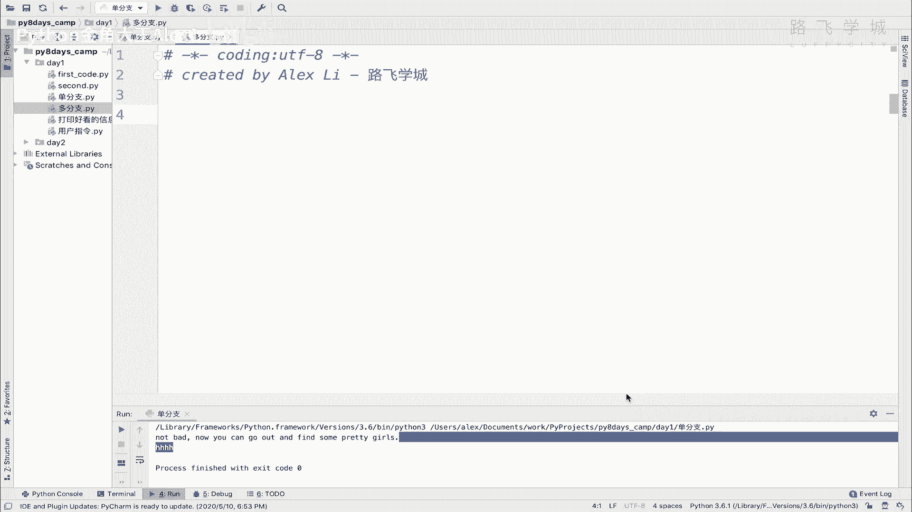
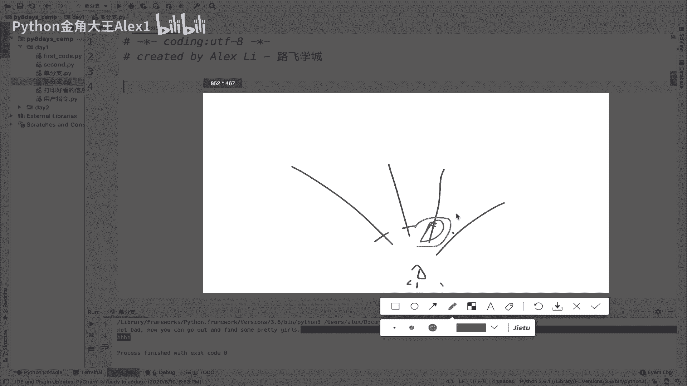
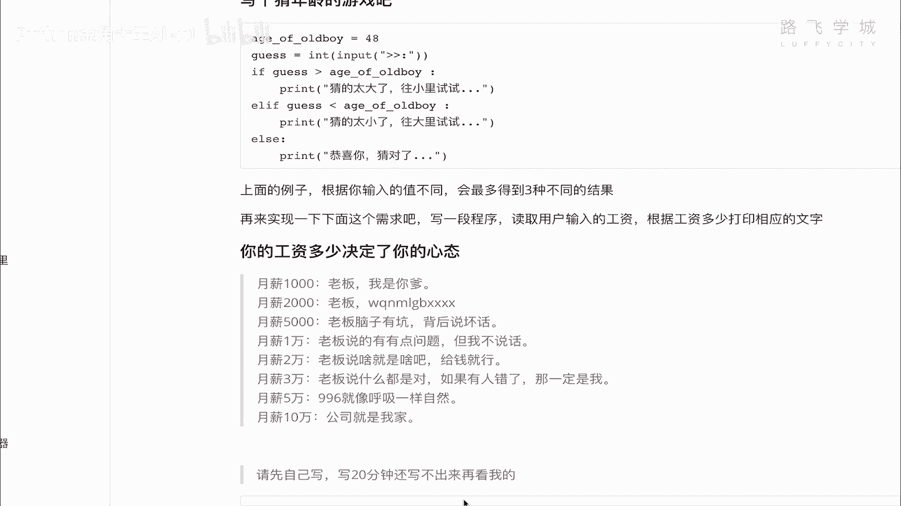

# 【2024年Python】8小时学会Excel数据分析、挖掘、清洗、可视化从入门到项目实战（完整版）学会可做项目 - P18：17 流程控制-if..elif多分支 - Python金角大王Alex1 - BV1gE421V7HF

OK同学们，这节课呢咱们来学多分支，多分支即指多个条件，也就是说你可以设置多个条件，满足哪个条件就走哪条路。

OK吧啊，满足哪个条件就走哪条路，这里相当于就是你在这个十字路口对吧，然后这里有一条路，这里有一条路，这里有一条路，这条路对吧，那你可以去依次判断啊，这个就每条路都会有一个条件对吧，满足条件走这条。

走这条，走这条不走这条啊，那但是注意了，你现在就你一个人，对不对，就你一个人，所以呢虽然有那么一条路可以走，但是你最终只要你做的决定，你只可以走其中一条，明白这意思吗，你不能说我这两条路一块走，NO啊。

你只能走其中一条，这是它的一个特点啊，你只能走其中一条，所以呢经过你的各种选择之后，你可以决定你可能说我决定走这条路对吧，哎走这条路没问题，那你就走这条路，其他的那些条件。

即便这个啊这就是啊这个东西怎么讲呢，就是你你你你总之你就只能走一条路啊，所以就是说这个多分支，你别看它有那么多条件，最终只有一个条件真正被满足。

能理解意思吗，先记住这个啊，那好我们来看它的语法，语法就是if对吧，然后满足这个条件，然后接下来如果满足条件执行，如果不满足，他就会继续判断判断这个叫elf，elf是else if的简写啊。

就是说如果这个不同，如果这个不成立，那么对吧，那么是不是，那么我们在判断是不是这个条件成立呢对吧，所以就是else if的意思啊，else if l他给简写了，那接下来具体条件这个条件如果成立。

就执行这段代码啊，但这里写了一个前提，前提是上一层的if条件不满足，什么意思，也就是说上面的条件不满足，它才会判断这个，那如果这个不满足，他就会判断这个对吧啊，那这个也不满足，他就会判断这个啊。

如果注意了上面这些条件都不满足，看到这里有一个else，看到没，上面都不满足，这里是最终的啊，上面都不满足，这里就是说那既然都不满足，总得走条路吧，这个就是else能理解意思吗。

这就if elf后面再加个else，看着啊，那相当于刚才我画的那张图，对不对，你那么多条路对吧，那你总是要选一条对吧，你不能哪条都不选，OK这个就是它的语法，那用这个语法呢。

我们就可以来写写这种多就判就有有多种，有多种结果，比如说我我我可以有多种选择的这种程序了，多种选择的程序了啊，那写一个什么程序呢，写一个猜年龄的程序啊，咱们刚才讲说啊，可以可以写一个叫猜猜这个我弟弟啊。

他媳妇儿黑姑娘的年龄对吧，假如说我在这猜他的年龄，假如说我在这里设一个啊black girl对吧对吧，它等于是个26岁，26岁，那大家咱们就来猜了啊，来猜了，你说如果让用户，你这时候让用户输入。

如果用户输入一个呃，就是他是不是可它有几种结果吧，第一个他是不是可以猜大对吧，他输一个30就猜大了，也可以猜小输一个18岁对吧，也可以什么呀猜对，所以它有三种结果，猜大了，猜小了或者猜对了。

所以就用这三种结果的情况下，你就得用多分支来实现，OK吗，用多分支，那我们就让用户来输入啊，让用户来输入，guess猜对吧，然后input这个呃，输入啊这个你的猜测对吧，然后呢注意了，他说的是一个数字。

对不对，他要输的是一个数字，所以但是input接收的都是一个字符串，所以我们把它转成一个数字，这个讲过了对吧，然后接下来判断如果用户的猜的值对吧，跟你是跟哪个值判断啊，是不是跟这个实际的值判断呀对吧。

如果用户猜测的大于一个black girl，什么意思，也就是说对吧，我猜我我猜成30了，那是不是代表猜大了，对不对，猜大了太大了的话，那我们是不是就可以执行啊，对吧啊，人家你讨厌对吧，人家哪有啊。

这么老啊，对吧啊啊，所以这个就是踩大了，对不对啊，太大了，然后呢是不是还可以裁小了，这个时候就用上LF了，注意了LF对吧，这个guess，然后如果猜小了，对不对，太小了也是这么判断，那猜小了的话呢。

太小了啊，啊，我看上去啊这个东西怎么讲呢，啊真开心啊，但真开心啊，我呃我我看着就是呃，但实际我比这个岁数要大呢，对吧啊，猜相当于这个是说他猜错了对吧啊，猜小了，然后这两个条件不满足，那你想又没猜大。

又没猜小，那就只能是猜对了，对不对，所以猜对了就是else，否则就行了，直接否则对吧，也不用加条件了啊，就这么三个结果嘛，那你直接是啊，恭喜你猜对了对吧啊是吧，这个可以，今天把我领回家了，对不对啊。

这个黑姑娘长得还是特别特别好看的啊，她结婚他俩他俩都要结婚了啊，这个这个这个这个这个唉可惜了啊，Anyway，那这个就是三分之啊，多分支多分支，对不对，这里咱们写了有三个条件。

三个分支相当于咱们来执行一下，好不好，执行一下啊，那大家看让我猜我输入了一个28岁对吧，他说你讨厌人家有那么老吗，重新来，我输了一个22对吧，哎他说实际上比这个大，对不对，我再输入一个26，同志们。

你看是不是根据我的啊，这个输入出现了三种结果，没错吧，哎这个就叫多分支好不好，哎，多分支大家自己默写一遍，默写不看我这个代码默写一遍好不好，哎大给你5分钟时间啊，你默写完了之后，接下来咱们再来学一遍。

你现在只有三个结果，对不对，我如果产生十个结果呢，八个结果呢对不对，那怎么写呢对吧，其实逻辑是一样的，去再怼怼更多的LF就可以了啊，更对更多的LOF，我们在这里还有一个小的练习需求啊，给你看对吧。

这个练习需求叫什么呀，你的工资决定了你的心态是吧啊，比如说你这个对不对，你工资1000的时候，你跟老板说，老板我是你爹对吧，2000的时候，老板我得得得得得去你妈去你妈的吧，5000对吧，1万啊。

当工资高到对不对，这个3万5万的时候对不对，什么加班啊，996大家为什么抱怨996，什么博士还是老板给的工资低吗，老板给一个月5万块钱，我可以住在公司，是不是啊，就是这样啊，所以这相当于就有多个条件了。

就是说你输入的工资是多少对吧，你也让用户输入你的工资对吧啊，这个你输入的工资是多少，然后这个产生的态度就不一样啊，产生的结果就不一样，所以它有多个条件啊，多个条件你自己先写，写20分钟。

如果你写20分钟还是写不出来的话。

