# Fama-French模型的因子计算与时序回归代码实现-量化金融与机器学习2024 - P1 - 背包2004 - BV1zH4y1H789

好吧那个那同学们先听老师讲啊，等他屏幕动了再说呃，至少现在我对的也是也是这个课件这个部分啊，首先我们这里来学习所谓的三因子模型啊，啊为什么要为什么要搞这个模型呢，大家在之前的那个礼盒就能看到。

其实CAPM是个非常理想的模型啊，他做了很多的理想的假设，而且而且抛弃了非常多，可能影响到整个市场的一些因素，所以所以说一开始大家觉得很兴奋，但是用了发现效果不好，所以说有很多人就会考虑。

是不是因为我们抛弃了一些别的因素都导致了，或者说还有一些其他的因素，决定了那个股票的一个预期收益呢，所以说呃有些人就引入了一些其他的因素啊，这里面最著名的啊，最著名的也就是这个所谓的三因子模型。

当然其实还有五因子还有很多啊，但是这是其中比较著名的一个，就是在CAPM这个模型的基础上啊，什么叫在这个模型的基础上，大家可以看到你看这个公式啊，就是之前的CPM模型不同点在于什么呢。

不同点在在于它加了这个部分啊，啊这个残差是一直都有的，因为相信以后都会有残差，所以说这个不用管，关键是它加到后面，在后面加了两个新的因子，这就是所谓的三因子模型的意思，就是这是一个因子，这是一个因子。

这是一个是一个因子，加了这后面加了两个因子，所以称之为三因子模型，这个模型目的很简单，一样的也是用来做资产定价的啊，只是说他是在前面的这个资产定价的基础上，来来搞这个事情啊，来搞这个事情。

关键是加了什么因子呢，加了两个，一个是所所谓的四只因子，还有一个是账面市值比账面四支笔是啥呢，其实就是我们之前学的四进率啊，是净率的一个是净率的导数，大家还记得四季历是是是怎么算的吗。

从名字能够听出来四进去怎么算的，是对应的就是整个市值是吧啊，不不是对对，对应的是跟市值相关，其实就是股票价格，是不是市值，无非就是股票价格乘以那个股票数量嘛，是吧嗯市值对应的市就对应的市值。

净呢对应的是净资产，能理解吗，所以市净率就是市值除以净资产，当然你也可以看到什么呢，可以可以看到每股的价格除以每股的净资产，也可以这么看啊，关键在于你成不成那个系数啊。

你就是它本质上就是市值除以除以净资产啊，除以净资产，这是所谓的市净率，而账面市值比呢是它的导数哈，它的导数，所以说你可以看成什么呢，是净资产，净资产除以市值啊，净资产除以市值。

呃他引了引入了两个这个因素啊，第一个因素呢对应的是所谓的规模效应，就是市值嘛，第一个第一个因素就是简单的市值，就是这个他认为呃，一个企业规模比较大和一个企业规模比较小，它是有不一样的地方，怎么不一样呢。

你看他这里讲的引入小市值效应，他这里注意啊，他不他认为其实不是市值越大那个越好啊，是什么呢，就是小市值公司相对于大市值有超额的收益，所以说小市值公司在市场上往往表现出，更高的一个风险和收益。

所以说它已引入了市值这个音质，而且他认为其实也是真的啊，其实也是对的，就在市场上面啊，市值小的企业很可能会有一些超额的收益啊，超额的收益，而且这个非常准，谈下来说，中国，中国证券市场。

在在2014年到2007年到2014年，这个时间，小市值这个因子真真是很很厉害，非常厉害，恋爱到什么程度呢，诶老师以前在B站上有一个学生，那个啊做过这个事情啊。

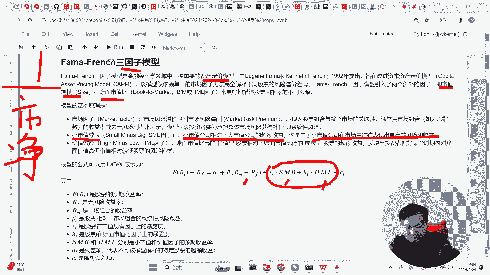

我记得是林俊伟同学。

这是一个已经毕业，已经已经毕业了好几年的同学啊。

也没好几年，就是前年去年毕业的吧，前两天我还跟他跟他见面了哈，找他那个有是在哪里去了。

我我我看看啊，已经把他的视频底下去了。

嗯嗯你说这个这个哦。

我今天看，你看他收益很高啊，诶怎么又黑了。

对你看啊，他这是几年啊，他这是13年到到14年，13年到14年两年的时间，小市值这个这个策略，它的它的收益就有400%。

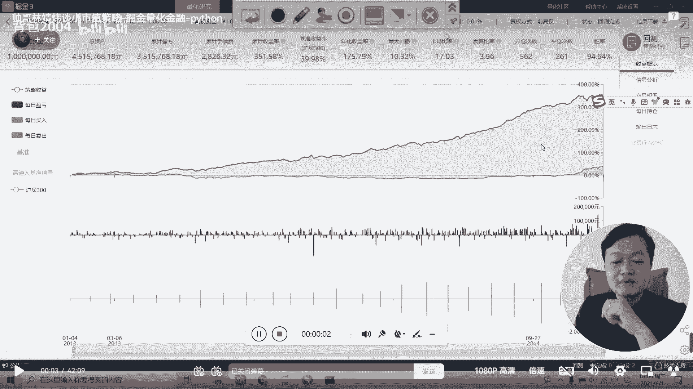

其实应该是007年到14年，整个大概7年还是10年时间，单单用小市值这个收益，能够让你成长到大概1000 1000%啊，能够翻十几倍，只用这一个一个一个一个因子啊，当然都是历史了。

我们现在在讲也没什么意义了，大家已经不就是你现在在靠市值已经不行了，但是在那个年代靠这个因子真能赚钱啊，赚很多钱啊，赚很多钱。

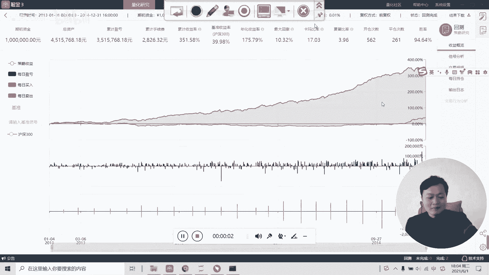

所以说啊小市值效应啊。

这个因子确实在很多市场是有很明显的，证明的啊。

就是被带被很多人观察到了啊，观察到了啊，当然这个是应该是呃在那个年代，他们在美国的市场观察到的，所以说所谓的小市值的企业，它的收益会超额，所以说呢他在这个公式里面，引入了一个市值因子这么一个概念。

注意一下，这里的市值因子并不是单纯的市值大小啊，这个待会我们继续讲，但是呢它是基于这个市值因子构建。

然后呢还有一个是价值效应，坦率地说价值效应我还真没真没证明过，单单这个东西音质会很好吗，但是不管怎么说，你看但我们想想这个因子是什么呢，这个因子是四进呃，供企业的净资产和市值的比率，这个代表啥。

代表你的净资产比较相相对比较高，会看一下账面市值比高的价值型股票，相当于账面市值比低的加，成长型股票有超额的收益，他的意思是什么呢，是指也就是说你这个企业，你账面上的钱相对来说比较多的话。

它的收益是要超额一些啊，就是你账面的这个资金的比率比较高，收益会得到一个比较超额的收益，他是这么个意思啊，这个意思嗯好吧，就是这两个因子的引入，大家了解一下，就是它背后其实有它实证的一个逻辑。

是在实际中被被大家观察到了。

因此才会引入这两个因子，现在的问题是什么呢。

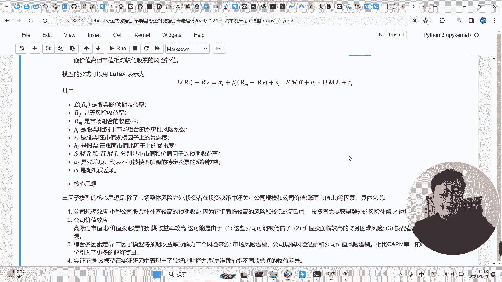

引入了这两个因子。

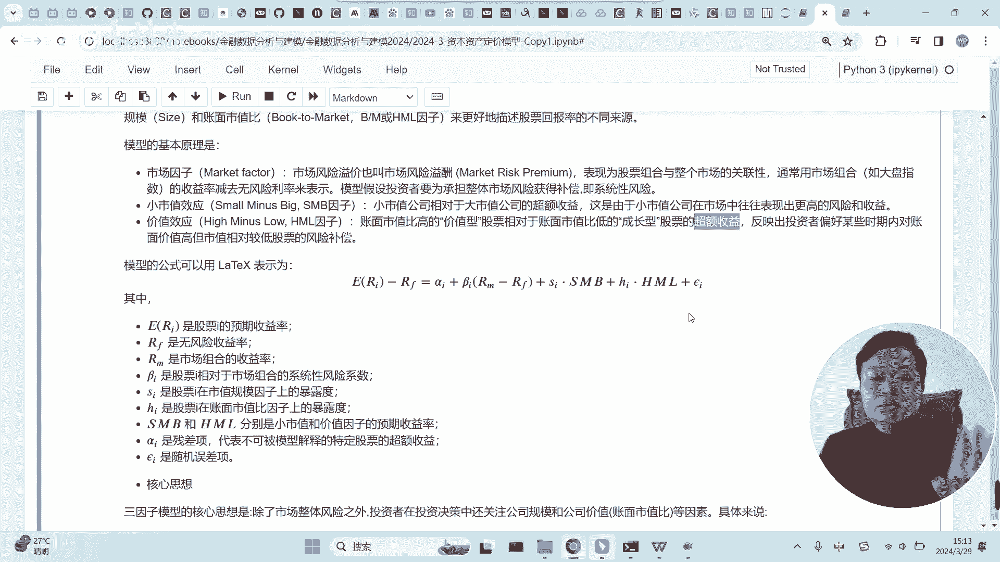

但是怎么去构建这两个因子，这是很大的问题，怎么调怎么去构建，大家注意点，在我们的资本资产定价模型里面，所有的因子啊，在我们之前的因子，大家想想那个市场那个整体的收益，减去无风险收益，就这个值。

本质上是一个收益率，是不是只不过是市场的收益率，这个东西和这个东西啊，呃这个学者在构建它的时候，也是希望把它构建成某种收益率，而不是仅仅是说把这个，直接把它的市值给放进去。

而是要构建什么呢，构建所谓的呃风险溢酬，风险补偿，他也想把什么呢，也想把这两个因子，按照所谓的风险一筹的方式来补偿，什么叫风险一筹，就是说如果你投小市值的公司，你对于相对于大市值的公司。

你的超额收益大概是有多少，它是以这样的思路去构建这两个因子啊，他要基于这两个因子来去构建，相对应的风险一筹，也就是相对应的预期收益，但是这个预期收益呢，是你在投资比较小的市值之后，得到的一个超额收益。

它是这个失误，正是因为这个思路。

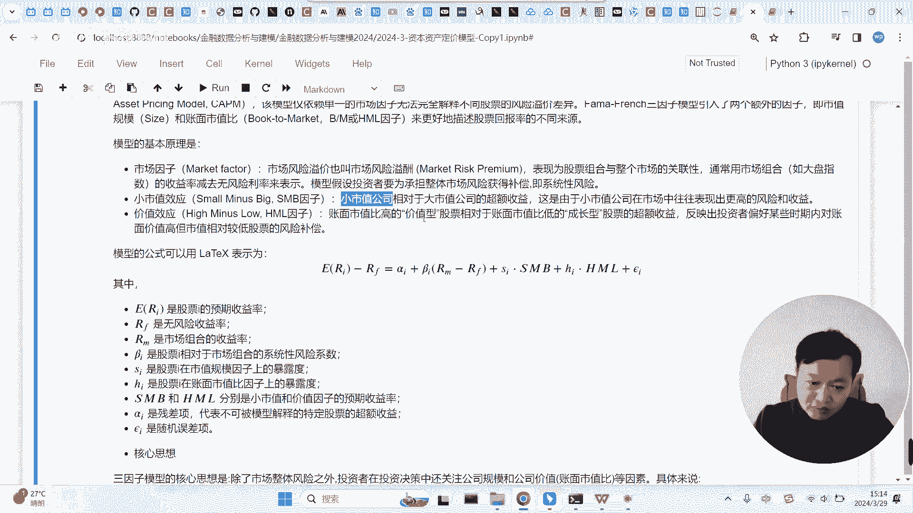

所以说在构建这个因子的时候，他要怎么算呢。

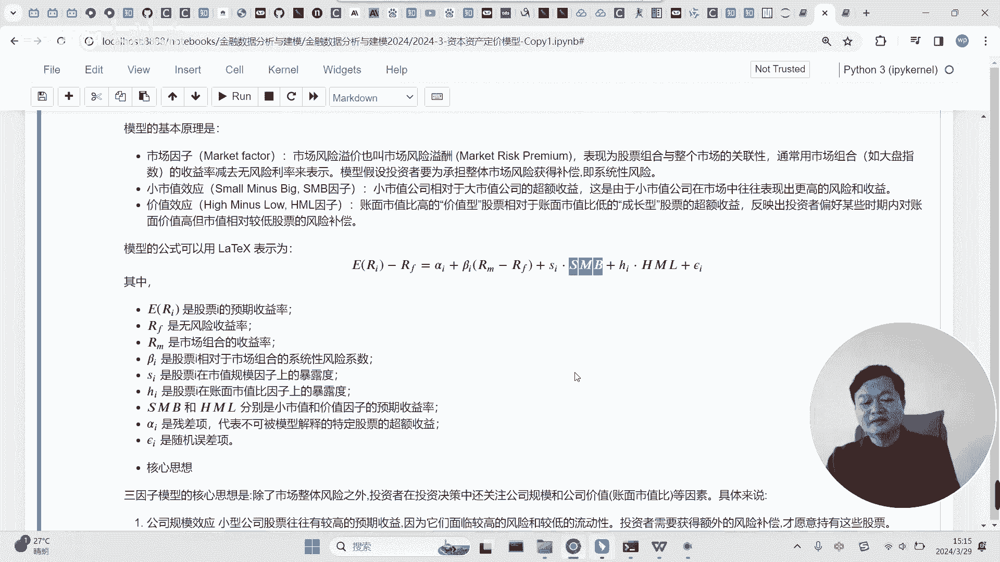

呃就就比较麻烦了啊。

什么麻烦呢，我看一下哪哪里会说的比较清楚一点。

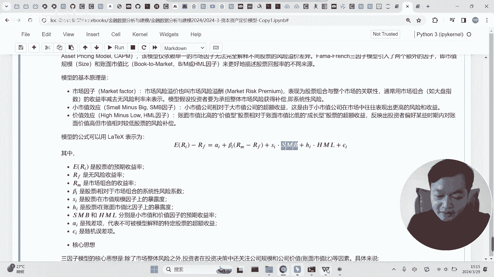

我找找这里吧，你看啊。

啊，你看他在构建所谓的，写这个第一个因子的时候呢，它是要做多市值较小的公司，然后做空市值较大的公司，然后把它组合起来求它的收益率，它是这么这么一个思路，就是用这样一个思路来去构建这个因子。

不是说直接用那个市值的啊，那我应该到现在，你用这个思路来去构建所谓的风险一筹啊，所谓的所谓的投资较小，德莱德额外收益的话，那什么是小市值，什么是大市值公司呢，那么他这里搞了一个定义啊，搞了一个定义。

什么定义呢，它是这样的，将所有上市公司的市值计算出来之后，从小到大排序，看见没排序之后呢，找到这个中位数，将低于中位数的公式定义为小公司，将高于中位数的公式定义为大公司。

能理解这个按市值对企业排序排序好了之后哎，中位数以上大公司，中位数以下以下小公司，这是这么一个现在的一个分组，注意下，现在只是分组啊，现在只是分组。

这这样的话呢它就分成了两组，是不是一个是S组和一个B组，S组和A和B组。

然后呢我们的市净率的导数啊，也就是所谓的是什么什么BBCM，这个公司思路跟上面其实是一样的，无非就是什么呢，要做空第一这个本本一笔的公司，然后做做空它，然后做多高的啊，多多高的，既然是这样。

那么实际上也存在什么呢，也是一样，计算出所有市值相对的那个那个市盈率的导数，叫这叫什么来着，本哎我也忘了哈，就计算出这个值之后呢，也按从小到大排序，然后呢前30%从小读一下，从小到大看见没有。

是要从小到大排序的啊，刚才那个是什么，也是从小也是从小到大啊，按照市值从小从小到大，所以说低于这个中位数的是石墨组，高于中位数的是B组啊，是这样的，那低于的实际上是什么，低于的实际上是大公司啊。

高的是小公司，大家能理解吧，但是这是从小到大排序啊是吧，你什么叫低高呢，小于中位数小于中位数的公司啊，好吧好吧，那就这样啊，这个也从小到大排序排在前30%的公司，应该是比较小的吧。

我想啊嗯应该就是9L组，中间30%是H组，后面40%是M组，看到没有，所以说它分成了把企业分，把公司分成了SBLH和M按这样的东西排序，分成了若干组。

分成若干组之后呢，他就得到了，然后一边是两组，一边是三组，那么它的排列组合太能理解吗，排列组合，这这样的话就形成了六组，能不能理解，能理解这个吗，啊不能，他，你这么想，你一开始把股票分成了两组。

那么每个股票是不是就有个标签，S和L这两个标这个标签是不是，然后又把这个股票按那个方式分成了LMH，是不是，所以说每个股票是不是又增加了一个标签，所以对任意一个股票，是不是就有就有两个标签了是吧。

然后再基于这个标签进行分进行那个区分，能理解吗，能不能理解啊，就是第一次分第一次排序分成两组，那么所有的股票是不是得到了一个两个，得到了一个标签，这个标签要么是S要么是B是不是。

然后第二次对这个股票又进行排序，那么他是不是又得到了一个标签，那这个股票的标签就有可能是L有可能是M，有可能H是不是，所以说对任意一个股票是不是有两个标签呢，他们就根据这两个标签把把股票就分成了六组。

能理解吧啊这这六组，分成六组之后，然后呢就要去干嘛呢，需要算的啊，需要算呃。

在这里比如说其中假设其中某一组，假设其中某一组某一组的这个收益率怎么算呢，注意一下，你想想我们把所有股票分到这一组之后，我们算这一组的股票的收益率，如果是均匀投资，是不是就是收益率的平均。

就是这些个股的收益率的均值，大家能理解吗，但是他认为我们在投资的时候不要去运投资，要怎么投资呢，你看他是要基于什么呢，基于市值的比例进行投资，基于市值的比例进行投资，看到没有。

所以说它是按照这个股票市值，占所有股票的总市值的比例来进行加权投资，所以说嗯嗯所以说是是是这么一个概念，能理解吧，所以说它是一个加权取平均，就得到了其中某一组的所谓的组合收益率啊。

得到了某一组的组合收益率，这个能理解，但是我们有六组，大家还记得吗，是不是六组，那我们就可以通过刚才这个加权加权的方式，就能够算出六个不同的组合投资收益率，是不是算出了这六个组合。

不同的组合投资收益率之后呢。

把它这么干，看见没有，对于这个因子用所有小市值的，看到没有，小市值的组合投资收益率，减去所有B组的所有大市值的，能理解吗，这样就得到了所谓的市值的风险一筹，或者是市你投小市值所带来的额外收益，能理解吗。

那么对于这个其实也是一样啊，这个注意一下，他应该是把这个M中间的那个去掉了，这是前30%，这是后40%，然后呢也是把呃我们认为U的那一组啊，U的那一组的那个平均收益率算出来，然后减减去什么呢。

减去我们认为呃不好的那一组，是不是就得到了，在这个逻辑下的一个所谓的风险一筹，或者在这个逻辑下的一个呃这个收益，超额收益率能理解吗，啊这就是这个东西算法，这样的话就得到了所谓的这两个因子的值啊。

就得到了这两个因子的值是这么算的啊，是这么算的，从我我相信其实也好理解啊，它的核心就是什么呢，核心就是要找到这个这个，我按照这个按照这个逻辑进行投资的时候，我我可能会获得怎样的，一个多大的一个投资收益。

他按照这个思想去构造这个东西的，而且他也保证了什么呢，而且他也保证了。

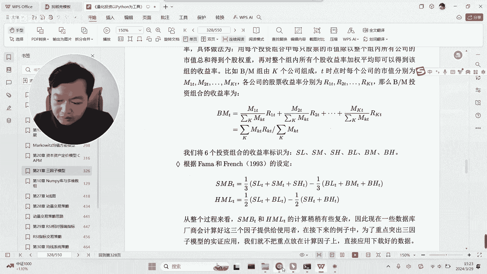

整个这个公司啊，他而且他也保证了整个这个公司里面，所有的这些东西，它的量纲是一样的，物理意义也是一致的，这个是非常重要的啊，你可以可以思考一下，你看首先这个是收益率，这个是收益率。

当我们之前的CAPM的时候，其实只看两者之间的关系，其实本质上分析的就是什么，分析的就是个股和整个市场的收益率，之间的一个正比关系，是不是因为他们两者，所以说把这些东西加起来，它其实也是有背后的意义。

无非就是这个个股在这个这个因子下的超额收，益和这个的比例关系，以及在这个因子下的超额收益的比例关系啊，它它有非常明确的一个意义在里面，这是这个这个东西为什么要这么臭的一个原因，他这么做的核心点。

就是让这几个因子都是收益率因子啊，都是跟收益率有关系，这是这个东西好吧，有了这些其实就是怎么算啊，怎么算算的方法呢，其实就是在这里我们应该是先先要干嘛呢。

先向之前先用这个，先用这个代码把把数据拿过来，用这个代码把数据拿过来，拿的是什么数据呢，拿的是，一样的也是拿这一年的数据啊，没拿多少，拿的是一年的数据，然后呢，这个代码同学们都有啊。

我也没期望同学们这么只要大家手打出来。

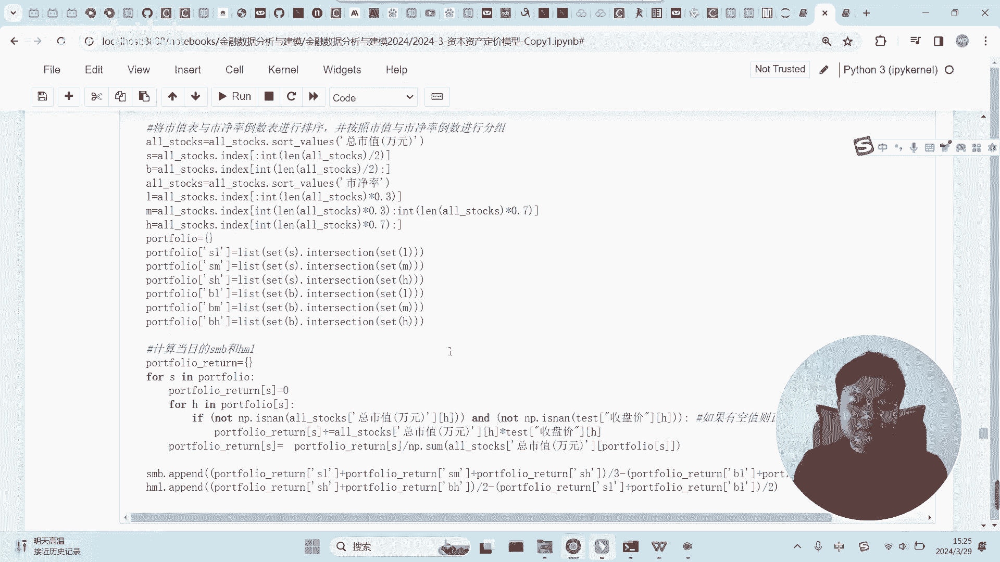

那太累了，我也觉得也没不至于这个代码老师也没有，也不是老师发明的，应该是我从以前的一篇论坛的帖子里面，改编过来的啊，就因为他的帖子应该是用来计算米框的，那个接口的东西啊，老师改没改啊，改了改，很可惜。

现在那个煤矿的论坛都已经不复存在了啊，不复存在了，老师在那里其实学了不少东西啊，呃我们稍微看看吧，啊稍微看看，当我们有了这个东西之后啊，有了这个东西之后啊，有了这个之后啊，无非就是要算什么呢。

算每一天注意一下啊。

还有一点大家注意点，对于不同的股票，这些因子的值都是一样的，大家理解吗，就同一个时间点，同一个时刻啊，同一个时刻不同的股票，这些因子的大小都是一样的啊，一样的，因为它是一个这些因子都是整个市场的因子。

能理解吗，不是属于不是属于某个个股的因子啊，它是整个市场的因子，所以说我们是实际上是可以额外的算出来啊。

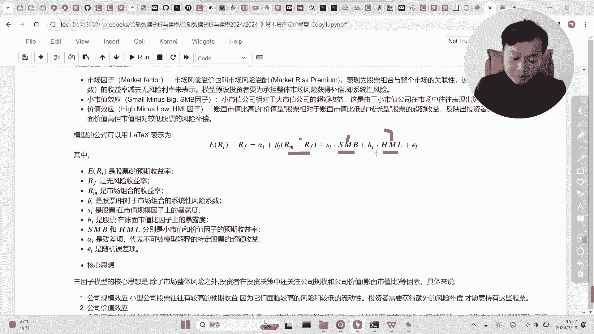

好我们看一下老师讲讲这个东西怎么算吧，讲一下这个东西啊，你看老师拿到了这个数据啊，这应该是我们那个数据里面的，拿到了这个数据之后呢，这个是获取这个这里面的交易日期啊，交易日期，然后来这里做循环。

去循环去算每一天的对应的因子啊，每一天的对应的因子啊，然后这个是干嘛呢，这个是为了下面构建那个每一天的啊，构建每一天的一个收益率来做准备啊，所以说这里先拿了一个啊，先拿了一个。

然后在这里拉就拿前一期的这个拿后一期的，这样的话呢就只能拿到了什么呢，拿到了呃收益率这个东西啊，拿到了收益率这个东西，每个股票的收益率有了每个股票的收益率的话，你看啊，这应该是因为老师的那个这个表。

里面是有四进率的，看见没啊，应该它它就是用丝巾女吧是吧，斯机率，而且也有什么呢，也有四值的市值，在这里看到没有，总市值，这两个表里面直接有了这两个因子的，对应的那个量的值，所以说呢，你看啊，这里的话。

应该是把对应的股票相关的，你看这这两个因子给拿出来啊，然后这里做了一个深拷贝，因为待会要涉及到索引结构的变化，所以说这叫做深拷贝，老师这里好像都做深拷贝啊，然后再重新编制它的索引，以什么呢。

以股票为代码，然后再以股票代码做索引，然后去去把这个市净率啊，求了个导数啊，求了个导数，这样的话呃，就就得到了我们刚才这里的要求的什么呢。

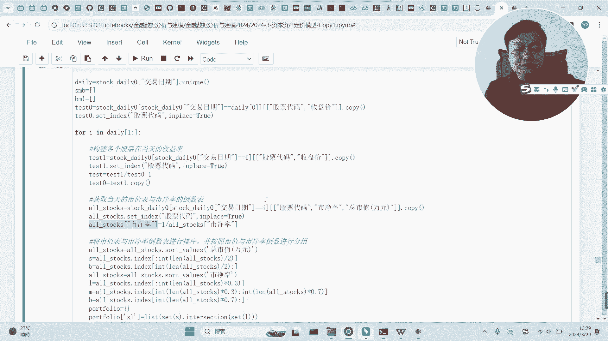

就是这个东西就是所谓的账面四支笔啊。

就是把市净率做了个导数。

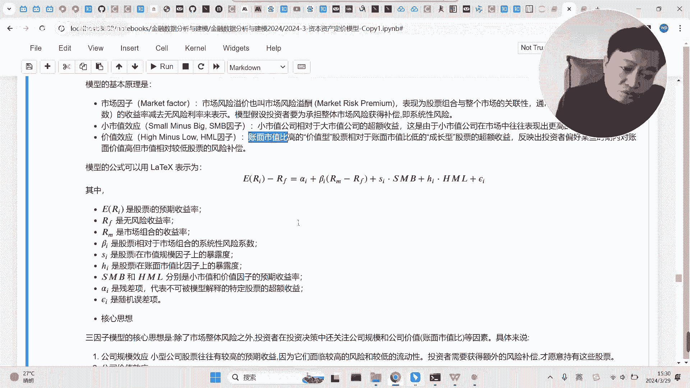

求得了账面市值比，这样的话我们就完成了账面市值比和总市值，这两个因子的计算，有了这两个因子计算的，你看所以这个因子做排序，看见没有，排序好了之后呢，前面12是我们的S组，那后面12是我们的B组。

然后再以什么呢，再以那个账面市值做排序，因为这已经取了导数了，所以说呢前面13是L组，后面40%啊，后面40%啊，是是H组H组，这样的话呢呃就是30%啊，后面中间是40%，中间用了40%啊，不管了。

然后呢做了分组之后，你看这里都是每个股票的集合啊，每个股票的集合，然后这里干嘛呢，用集合的方式，你看求交集就得到得到这两个这个组，每个都求交集，看到没有，这样的话得到了每个组的股票列表，因为是要六组嘛。

是不是就得到了这六个分组，有了这六个分组之后呢，然后每一个分组去做计算啊，你看这是，这里面的按照每一个分组去做计算啊，把每一个分组的什么呢，每一个分组的平均收益率在这里给算出来。

所以说他应该是对每一个分组都做了计算，然后呢这是算平均收益率，因为它涉及到按总市值的方式来进行投资的，所以说他做对总市值进行了加权，然后这是什么，这是之前算的那个每一天的收益率啊，每一天的收益率。

当然这里干嘛呢，这里还做了一个判断，如果是有空值的话，他就直接跳过去了，这是一个比较简单的做法，就是遇见空子就干脆啊不搞了，就就就这这个股票如果在这一天是个空的，就不去算这个股票的一个投资情况。

就这个意思啊，就这个意思，这个会引起一点点误差，但是问题不大啊，问题不大，然后把这个按照总市值和这个收益率，相乘之后呢，最后除以总市值的和啊，总市值的和就得到了，这个按照市值加权进行投资的一个收益率啊。

就得到了这里啊，就弄到这里。

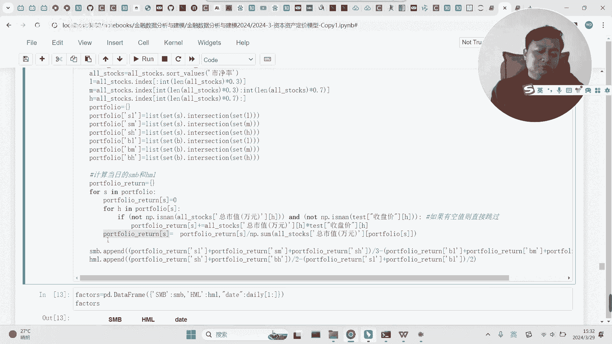

弄到这里之后，你看就根据刚才的这个公式看到没有，因为我们已经把每一个啊，把每一个小组六个小组嘛，每一个小组的这个收益率都算出来了，所以说只需要把它按照这个公式相减就行了啊，而这里其实就是按照你看到没有。

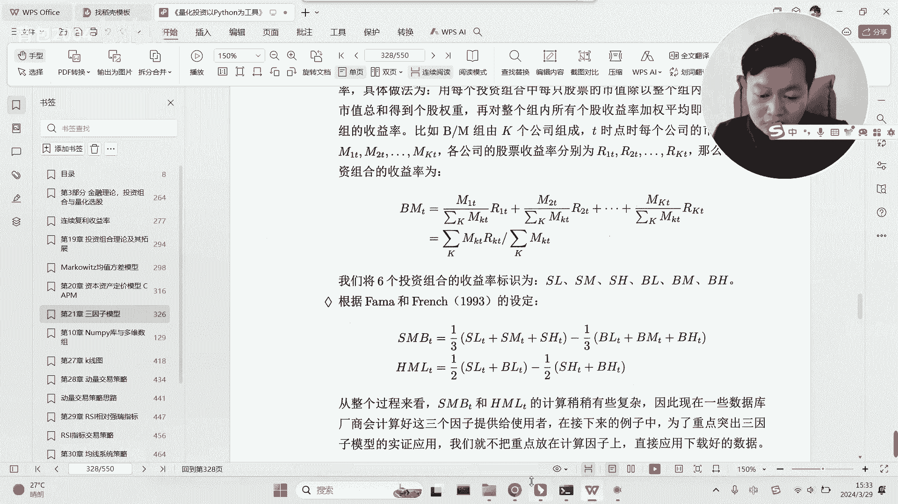

这是1/3，看到没，两个两组相减，就是1/2，两组的一个相减啊，两组的相减，大家代码懂了没，大概是这个意思啊，呃细节的话还需要同学们自己看一看啊，自己看看这一部分代码，我不要求同学们自己搞。

我应该也已经放到我们的课件里面了，老师运行一下啊，我们看一下结果就行了，我们看一下结果就行了，还有点慢嘛，好好，这样的话就得到这个东西和那个，我们可以看一下啊，就得到了啊，所有填的这个值和啊。

所有填的这个词，他分别对应的就是按照那两个逻辑进行投资，然后这是干嘛呢，这是把它弄成矩阵，弄成一个数据框，因为有了这么多天了啊，有这么多天嘛，啊弄成这样一个数据框啊，这样的话我们就算出了这两个因子啊。

这两个因子的风险一筹啊，这两个因子风险一筹。

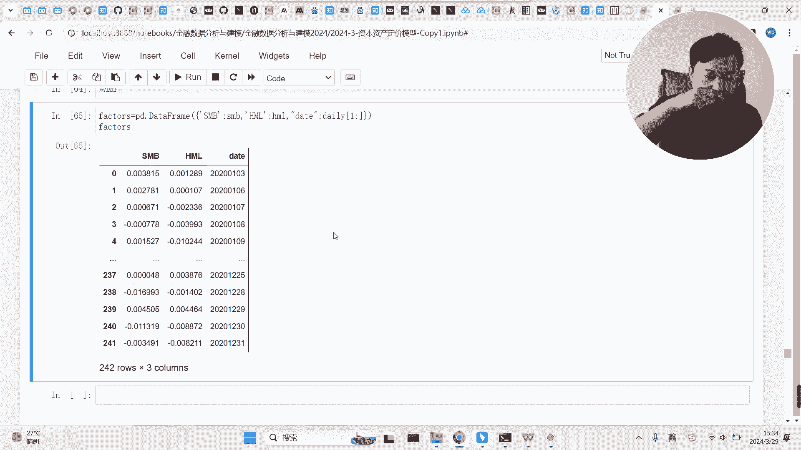

算错了它之后呢。

我们其实是可以尝试做什么呢，做我们的啊时间序列回归的啊，尝试做我们去时间序列回归的，这个我们要不要搞一搞啊，搞一下吧，你搞一下，呃，我们看看啊，我们获取某个时间段的啊，我们只做一个股票的啊。

做一个股票的，做某一个股票的，就行了，我把这个拿过来吧，这里可能需要。

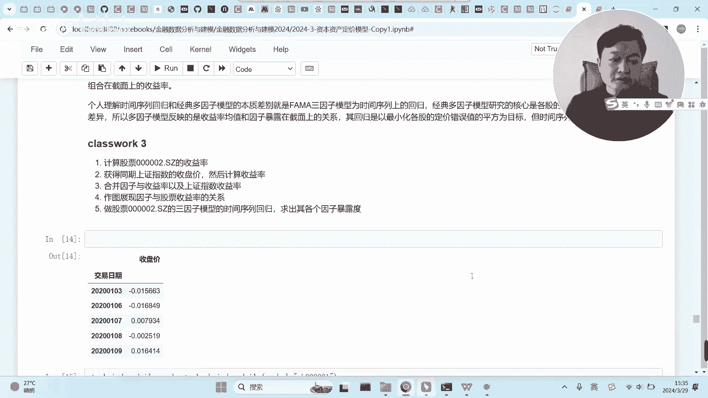

是不是因为他这里也需要所谓的整体的一个，额获得同期上证指数哈，这是同期上证的，然后，这是同期上证，就是这里的话我们求的那个整个大盘的组合，收益的话，是用这个方式获得的啊，没有自己求。

不像我们之前是自己交的，这里就拿直接拿吧啊直接拿啊，然后呢我们还要获得什么呢，获得这个的收益率，啊我们用用用我们的方式吧，用我们的方式啊，拿这支股票，我们的方式在哪里呢，我。

呃这是我们从之前的啊。

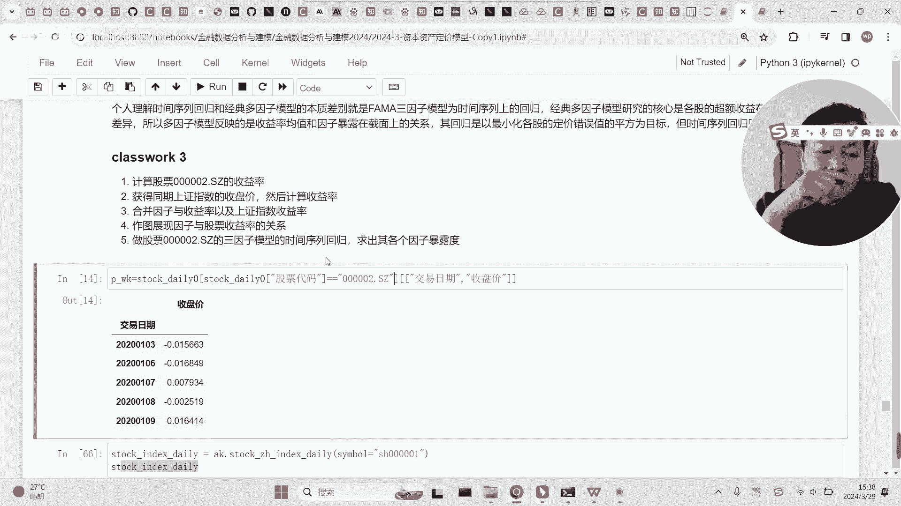

我们的数据里面获得这个东西啊，获得他的呃，交易对应的交易日期以及对应的收盘价啊，我们看一下，这是某一个这个股票的啊，这个股票的，然后呢再通过这个拿到整个上证的啊，整个上证的，这样的话呢。

我们最终是要干嘛呢，最终是要把它组合成这样一个数据框，组合成这样一个数据框呃，我们是可以这样，首先我们拿到了，这一天到这一天，然后我们用，用它用它做那个用交易日期作为，作为索引，你只要抑制器作为索引。

然后，替代它，这样的话我们得到了这个得到了，得到这个之后呢，我们把上证指数，上证这个东西拿过来，上证了什么呢，上证的收盘价，我看一下两个能够，上证的收盘价拿过来的话，我们要要要获得什么呢。

获得这两个日期的，一个是这个日期，他的上证的这个D，要大于，我看一下这个行不行啊，因为它有的时候他这个特征是是一个，是不行的啊，因为它是一个D，所以说呢这里需要干嘛呢，我，Input data。

这样的话才行啊，这样才能够把对应的东西可获取到对，这样是凯才能获取，但是我们那我们的这个东西的话，那几天是哪几天，我看一下啊，这个是2020年1月一月二号，2020，0112号这个，然后他要干嘛呢。

同时他要小于，并且还要小于，小于2020年1月31号，小于等于大于等于，12月31号，不是吧，就拿到了这个的什么，他要拿他的close，好拿到close，然后拿什么呢，拿他的。

那他的职拿了这个值之后干嘛呢，把这个值给到这个东西，好然后这个时候这个就我们可以看一下，这个就有两列了，你看他有index和这个是吧，这是收盘价，这是这个东西啊，这是这个东西，但是这个还这个还不够啊。

这个要干嘛，这两个是要去，呃要干嘛呢，这两个东西都要去要去求收益率的，所以说他要干嘛，他要除以WK点线，求单日的吧啊我们这里做单日的就行了，减一是不是要求收益率，然后呢求什么呢，他就把这个救不掉。

这就得到了这两个的收益率，但是呢其实还得干干嘛呢，还得捡一个东西啊，减什么呢，假设我们的假设我们的呃固定收益率是什么，那个无风险收益是0。03的话，0。03，那么他要什么呢，他要除以24243。

它应该是什么这个词，我让他减去这个值吧，同时都减去这个值啊，他应该都会减，这样的话就得到了啊，我们的什么呢，一个是得到了我们的Y也得到了，得到了我们的因变量和自变量。

这个我们给到一个给到一个YX等于给到他吧，呃然后呢把我们的刚才算的这个东西，大家注意一下啊，因为我们的这里算的这个东西，也是从这一天开始的，这一天是哪一天呢，我看一下1月3号，1月3号对，就这一天。

所以说我们可以直接把什么呢，直接把我们的这个这两个因子啊，SBM和H，不要直接拿过来，然后把他的。

LH这个也拿过来，因为他们两个东西的索引是对最好的，是不是，这样的话，我们的我们的这个东西就基本上完成了，你看啊，我们是需要什么呢，这个已经减去了那个无风险收益，然后这是我们三个因子，这样的话呢。

直接就是需要我们放到那个呃，那个那个函数里面做回归就行了，能理解吧，我们把上面那个代码拿过来，回归的代码，找一个回归的代码，我发好远啊，这个这个行不行，这个行吧，然后我们需要什么呢，需要它的收盘价。

我们这里其实已经减，这个是这个是Y是吧，所以说是什么呢，它的收盘价，他其实已经剪过了剪过了的，然后然后这边呢要什么呢，三个因子分别对应的是index，还有，SBMM和。

LNHML这样子那就完成了就完成了是吧，这至少是这个股票的这些系数，而且决定系数还挺高的嘛，都已经0。5了，是是我们之前来之前那几个最高的楼最高的，所以说其实从这里可以看出啊。

啊从这里可以看出这两个因子还是有效的啊，你看我们之前那个决定因子是0。2，然后CAPM全局的话都都都都快接近零了啊，都不靠谱了，但是这里还可以啊。

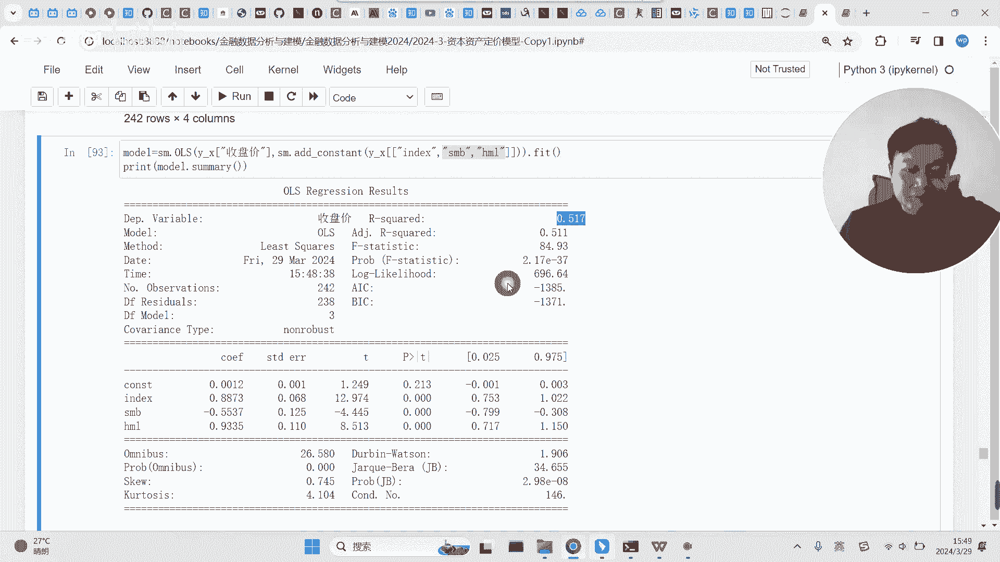

这里看起来还可以好吧，老师应该做完了吧，应该做完了啊。

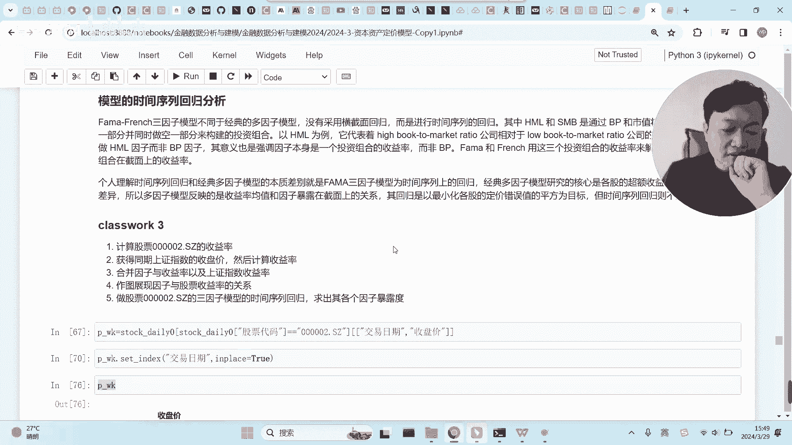

做短线因子和股票收益率的关系，这个我没搞这个，其实啊这个其实就把这个展现一下就行了，就是当然这个老师已经讲过了，那个无风险收益，但是一样的可以展现哈，PLLT点BRT，然后，X应该是这个，这个应该是X。

然后呢，这个应该是收盘价，是吧，当然不能不能用，这个要用点是吧，其实从这里看这个关系还看起来挺靠谱的，但是这显然是大盘嘛，大盘显然是比较靠谱，看下这个，看一下这个怎么样，好像不怎么样。

是不是正就是相关性不那么明显呀，看下这个，还是和大盘相关性最高，所以说啊，这个这个看起来还是有那么一点相关性的啊，有那么一点相关性的，还是和大盘的是相关性最高啊，这也是很明显的，就是CAPM。

他应该是整个收益率来源的一个，比较主要的部分啊，这个确实是这样好吧，呃应该就就这样子啊。

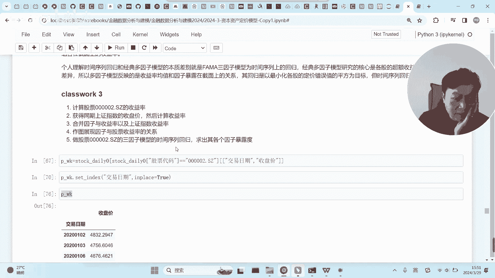

就这样子，同学们自己搞一个。

