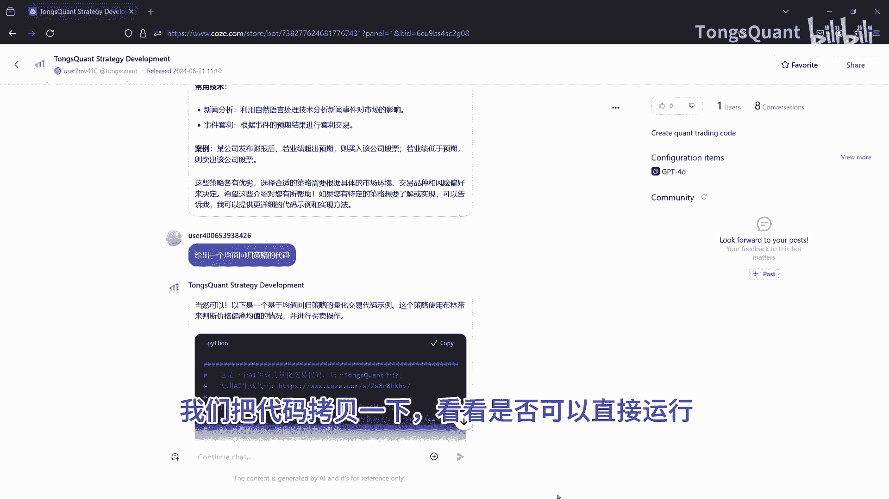
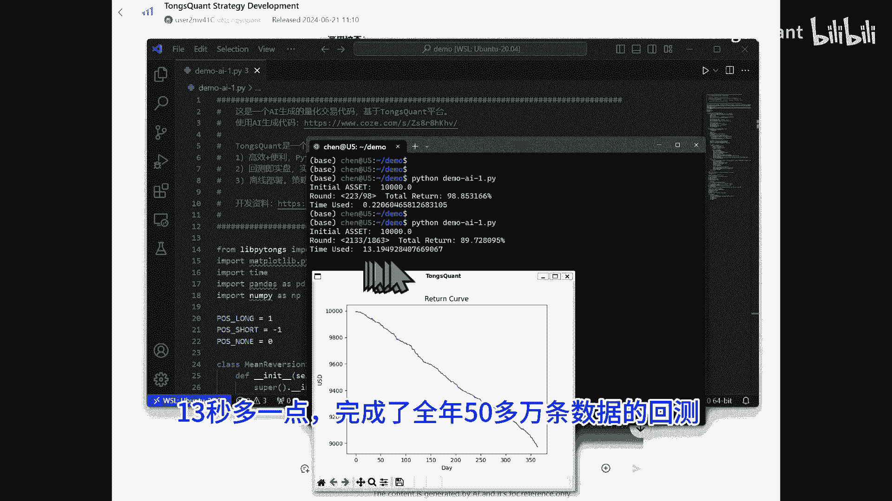
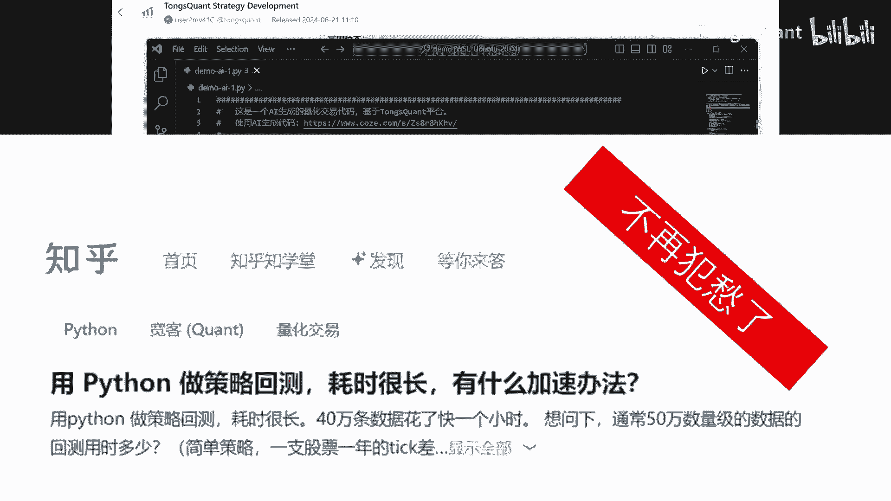
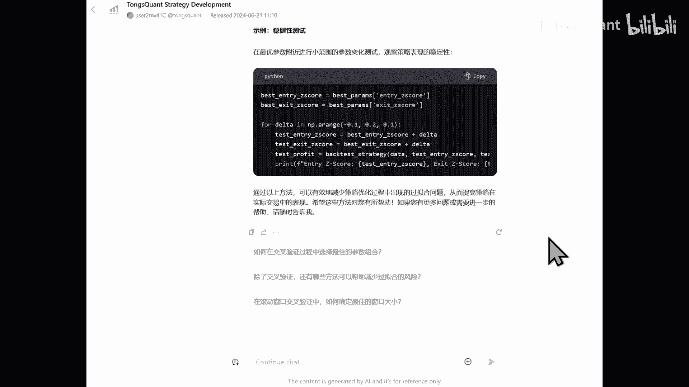

# GPT结合TongsQuant，一个人轻松做量化交易 - P1 - TongsQuant - BV1WjhNexEGU

tom squint建立了一个辅助代码编写的智能体，它使用cos的平台，基于chat gp t4O，除了具备量化交易的常用知识外，这个智能体还能编写出。

可以直接在tm square上运行的Python代码，我们现在看一下如何使用它，快速完成一个量化策略的创建，先在cost的store中找TSQUANT，或者借用上面的网址进入，进入之后。

系统会有些提示信息，也有几个选择性问题可以点击，这里的提示都是英文，我们可以要求他使用中文交互，现在就切换到中文了，我们可以点击一个它的提示问题，也可以输入我们想要他完成的具体工作，正常情况下。

我们要求他从简单的工作开始，输出的代码应该是没有错误，可以直接运行的，我们把代码拷贝一下，看看是否可以直接运行。

好这就是他输出的代码了，注释也加了，他这里基于strategy的积累，创建了一个新的class，设置了滑点和收费的参数回溯周期，这里它预设的是20开仓阈值，设置的2。0，平仓阈值为0。5。

注释都是它自动加上的，后面函数就是具体策略的时间代码，他这里选择的是以以太为例，这个周期选择的是60分钟，也就是一小时，代码总共130多行，好我们现在试着运行一下，0。2秒回测完成。

不过这个是以小时为单位的，每次回溯计算20小时的数据，我们看到回测结果是稳定亏钱的，当然还不能直接使用啊，我们现在调整一下参数到中级别，看看运算效率，把回溯周期也加大六倍到120，这里改为60秒。

运行一下看看效果，现在结果出来了，13秒多一点。

完成了全年50多万条数据的回测，以前那些回测号时，想尽一切办法优化的招数都不需要了。

我们还可以继续咨询check GPT，让他帮我们优化算法，我们看到他给了解释和具体的代码，我们就可以继续优化，直到完成赚钱的策略，好了，今天先介绍这么多TMQUANT是免费的。

请支持我们使用我们的交易所推荐码注册，您可以享受到额外的10%手续费减免，开发文档示例代码等，更多的信息请查询get up。

