# Kaggle竞赛Gresearch世界第三代码解读lightgbm调参与特征工程 - P1 - 高频交易dragon - BV1As421M7as

哈喽兄弟们，我们来看一下这个嗯，就是机research这个CRITTO的这个forecasting，然后看看他的排名第三的一个公布出来的，这个源代码，我们来看一下，然后呢，这个里面呢。

它还有一个就是参考的这个原来的这种啊，他是怎么参考的，怎么一个一个一个思路啊，就是可以去在这个里面呢去去看看啊，这个这个里面呢他也讲得非常清楚，大概是呃简单的一个打了个草稿吧，其实是这样的。

然后面的话他也比如说呃递交这种，最后的这种这种嗯结果是什么递交的啊，还有这种引八个CV啊，就是他要做一个交叉验证的一个一个一个东西，它需要一个loading3700对吧，50分钟，然后的他是怎么做的啊。

就不能让信息进行泄露啊，那么还有一个就是这个呃本地的这种就是local API，就是如何去调用一些数据啊，就是这个应该是cargo的和激励search的一些东西啊，这个这个你们他都有一个啊。

参考人家的一些代码嗯，然后我们来瞧一下它整个的一个一个一个people line，这个东西怎么样的，那么它首先呢把所有的库导入啊，那么这里面呢啊都是常用的系统啊，随机数。

那么pandas南派画图的有matt plot lib啊，Saber，还有当然他的训练的light的GBM，还有就是激励search crypal的，这个应该调用数据的，然后呢还有时间日期。

还有这个存储模型，当时用的用picker这样的模型，还有一个就是GC，那么GC这个库的话应该是在这里面的，就是做那个collection，就是一些垃圾数据的，不用之后就做回收的这个东西的。

还有就是这个TQDM，那么就是有一个载入的进度的图，那么OK那么下面他的是哦，CV这个就是那个做交叉验证的时候，把这个整个的每一个这个asset的id啊，每一个品种他都把100，比如说140万条数据。

那么每个呢就20万1条，20万1条，分了七个就去做到要验证，然后呢这个是随机数的种子，然后呢这个就是要用surprise，就是for chain，那么设置是ch的啊。

那么最主要它是这个就是不要去OVERRAP，它有时候会有一个就叫strict这个绿的CSV，也就是说不能就是训练跟教跟验证啊，就是训练跟test要分开的，那么它其实就是啊有一个这个作用。

然后呢他把chain csv，Surprichacsv，还有就是ss detail cs v，它其实就给了这三个东西啊，三个数据集他都把他的录呃呃捞的进来，然后呢在pandas这一块就是显示最大的行。

以及显示最大的COLLINCOLLINS是列，是350列，那么最大的这个行数是只只有六行啊，那么这个在特征工程里面呢，它有个LEX有六十三百九百，这个都是以秒来单位，那么就一分钟5分钟。

那么这个15分钟这样的，有一个这样的平滑的过程，那么很多的这个做时间序列的话，就是千万不要去打乱他的数据的顺序啊，因为这个所有东西时间序列，它就是根据时间的前后顺序进行训练的。

如果你打乱他的这个时间顺序的话，那就会发生巨大的错误，这训练出来都是没用的，那么这个里面的训练的参数，就是比如说最重要的就是alice stop rruns，就是早停，就是五分50轮次还没有得到提升。

就直接会就是停止训练，那么优化的这种objective它是用回归啊，那么评价这个这个使用RMRMMSE，就是好像是军方错误对吧，均方误差，那么boosting type使用的数模型叫做GBDT。

那么最大的树的深度是五棵树啊，然后呢这个verbals这个是一，就是不要输出任何信息，那么max bin是分箱啊，然后呢这个呃嗯mean data in leave，一个叶子上的这个数据。

那么这也是为了防止这个过拟合，这里用量50在了landing nate用了0。03啊，后来我们用这个训练的时候，这里0。03就太小了啊，嗯降低的太慢了，我都用了0。5啊，用了后面的不在这个数据上。

就用在其他数据上，这个是subtle semper，那么这些呢都是是关于这个，这个就是呃纸样的抽样的比例呀，然耗了这种这种那么用co的可以去看一下啊。

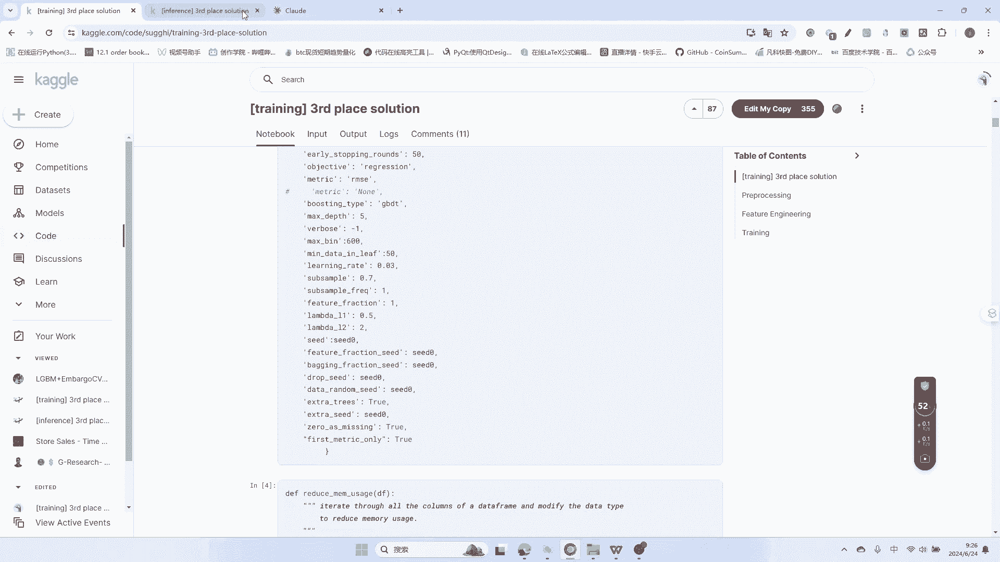

就是你们这个这个如果是呃，这个每次迭代随机选择70%的数据，然后呢每次迭代进行次采样都是一样，future fraction呃，就是每棵树随机选择百分百的特征啊，还有兰巴达呃，L1L2都是正则化系数。

都是为了这个防止过拟合的，那么随机式的整数对吧，特征分数，随机种子之类的呃，drop这个这一块都用来的，XJ在这使用额外的随机数。

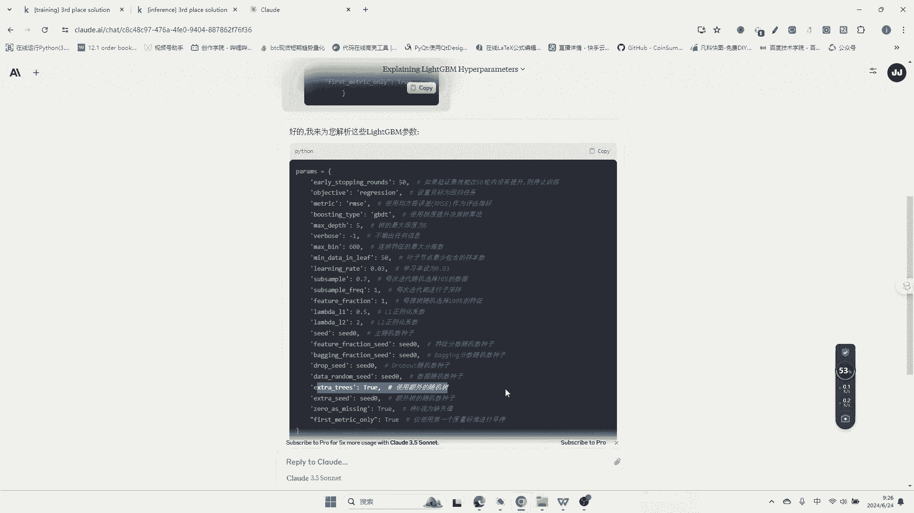

还有zero is Missing，那么将您视为缺失值，还有first magic only，那么这个里面的就是度量，这个一个度量标准呢进行近11个。

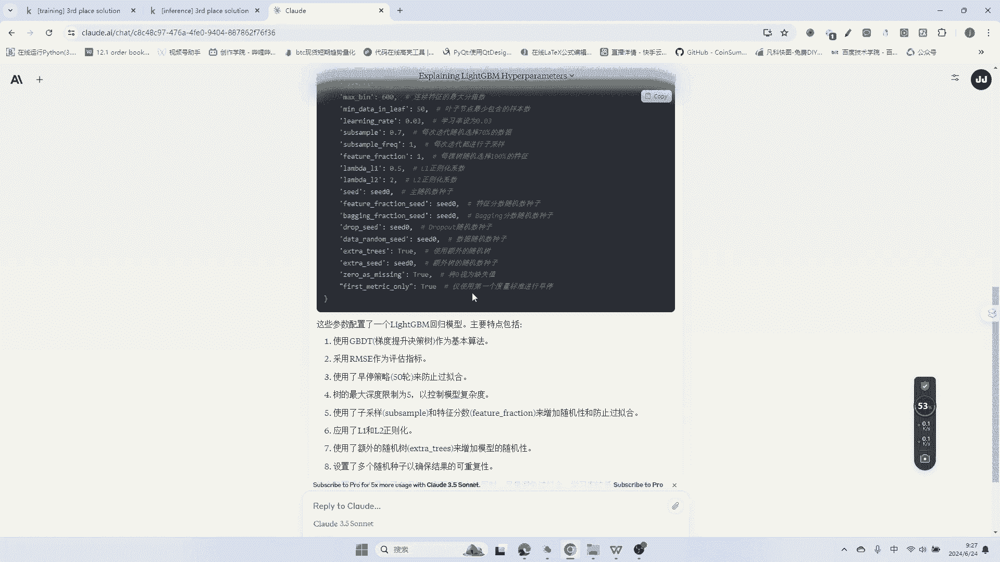

仅使用第一个度量标准进行找停。

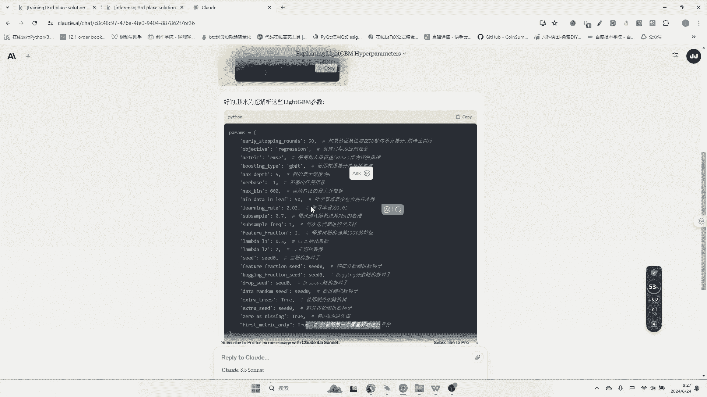

也就是说这个这个跟这个是这个，所以说因为JULYSECH给的这个早停的东西。

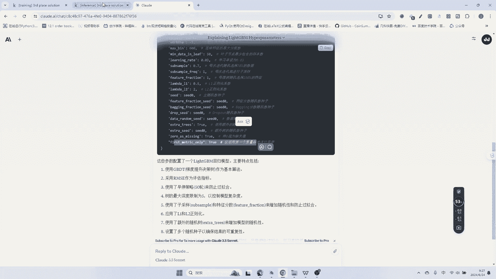

还是蛮有蛮有意思的啊，他是给了一个混合的这样的一个权重的东西啊，magic进行一个评估，他的这种嗯评估它的绩效吧，也就是说也就是说当时我们讲过，用利用它本身预测出来的数据。

和他的这种十几个14个品种组合的一个数据，进行一个残差的预测，很MONKE，那么第四个这个cell里面的这个写的这个函数，其实呃大家应该看一下，就是他是因为整个cargo是啊32G内存。

那弄一弄就崩溃了，那么就需要reduce memory usage，讲求是，其，其实就是这个也就是说能用八位整形装得下的，就不用16位啊，能用32位，高一下的也不用64了，也就是说能用八位。

用八位能能能用16位，16位能用32位整形，用32位整型，能用64位整形，所以说他把每一个值都用来这个c min，还有c max进行判定啊，那么就是这样的一个写法，还有一个就是六呃。

就float的这个数据一样的，能用16位的使用16位能用32位，32位对吧，装不下的再用64位啊，就是这样的一个一个一个东西，那么OK那么这样的下来memory它就减少了很多。

那么下来呢就就把这个呃呃detail，就是这个把这个每个资产的detail读读出来，那么后面再处理数据助理数据的话，他还做了一个就是魔法的，叫啥百分百分time，那么这时会显示处理数据的时间长度。

那么它就会在这里显示哦，大概一分钟左右吧，59。6秒，那么他把训练的数据读出来啊，那么读出来的COLLINS它有用的就是time stamp，Acid id，close和target对吧。

这四个数据而已，那么如果用这个surprise for chain的话，他也一样把df surprise给拿出来，而且把它两者之间慷慨的一下啊，也就把它拼接起来，那么这个里面的拼接完了之后。

所有数据读完了之后，他就在duce memory umemory的这个usage，就是啊减低这个用用，就是所有数据的这个这个占用内存的这一块，那么原来的是1G吧，大概102201G左右。

然后呢优化之后的话只用了一半左右啊，484，OK那么后面的一样的啊，就是去做每一个id啊，你看见没有去进行了一个location的data friend，点location。

然后呢把他的资产的id呃传进去，因为资产也是0~13嘛，然后呢，把其实就是把各个所有的这个，单独拿出来训练对吧，time stamp colin target的copy一下啊。

然后把它单独拿出来训练而已，其实这这句话就其实就这个意思啊，OK那么你可以看到拿完了之后，他的这个东西就变成了一个什么了，Tom stamp close0，他给的0close杠一。

他给的杠一基本上就是一个一个对应的起来了，你看到最后是啊，这个这个应该是close，实际上他给的市场，每一个每一个资产的，它的收盘价和它的呃目标预测的价，然后呢进行这样的对齐，然后呢进行训练啊。

他其实就是这样，然后呢这个是这个百分百这个调，就是用TQTDQD那个那个东西啊，TM那个那个东西，这个会显示这个载入的进度，也就是前面的这这个TQDM，这个这个这个库有一个这种。

会出来一个这种百分百loading的这样的图像，那后面的么，就是对这种缺失值的进行一些填充的问题，因为你看得到有很多是这种NAN，那么我们看到就是啊也是for id和range十四十四。

那么也就是对所有资产逐一填充，f close id等于就VANA，然后呢他是像for for for for就是往前走啊。

就forward的这种fever的field around limited是100个数据，然后现在就做特征工程了，做特征工程的话，那么他还把这种呃很确切的这种时间啊，应该转转换到秒数。

因为有个in bug后面的这一块的东西，那么他都很，就是这个是2021年3月12号啊，那么他的这个东西就是额，大于这个某一个数据的话，那么它就是应该来讲要给他打上这样的标签，不然的话那么这个里面呢对吧。

就是零和一来区分它是否就是啊，做这个这个这个测试用的还是怎么样的，还有一个就是surprise star window也是一样的，它就是9月22号对吧，这里这里这里的话是123月12号。

那么这个数据也也给他就是一起要训练，他们两个，因为contact一起要训练，他也给他做了一个这种呃呃标签啊，就是跌幅呃，chain杠flag这个这个这个东西，然后呢一样的这个里面呢就做了这种lag。

因为这个这个里面呢我们前面看到那个leg，366十三百九百，在这个里面呢就做了他的对数收益率，它的对数收益率和它的一段时间的这种平均，收益的这样的一个差值，那么你可以看到啊。

就是13对14个这样的asset id，然后呢flag in lex对吧，然后呢这样的话每一个都进行了三六呃三呃，这个这个就是刚才讲的lag有三个嘛，OK那么它进行了一个什么呢。

他用了lock close除以他的命lag id的这个值啊，也就是用的这个计算是MP点log，用它的收盘价除以它的loading啊，m p d loading看见没有，loading多久对吧，然后呢。

除了一个值会得到这样的，与他的这种BF close的这样除以，它的未来的这样一段值的一个，滚动的一个收益啊，然后这个里面呢就就会形成你看见没有，一个两个这几个这这样的就是做完了之后呃。

得到了这样的一个差值，这样的一个一个限制，对他的未来的一段收益的这样的一个一个东西，那么这边也是一样的，就是这个里面的你可以看看他loading多少对吧，先算了第一步再算第二波对吧，一个两个公式。

所以说它又多出了不少的特征值，呃，我觉得这个这一块还是它最有用的，因为我翻了很多都是用这个套路，用了这个legs才有用啊，就是这个这个用了这个这个有一用，他的这种收盘价跟V跟他的loading。

就是跟一段的收益之间一个比值对吧，才有用，这个里面呢应该是不是向后的，而是而是在这以这个close之前的，这一段时间的一个loading，那么这样的话就是不会去泄露未来的数据啊。

所以说这这个是不是不是未来的，这个刚才讲错了啊，应该来讲是这个呃往前推的一段时间，OK那么这个券等于等于TRU然好了，这个里面呢它就可以JP1些啊，这个这个这个叫什么close杠id什么什么什么的。

其实呢就是不能就泄露数据，然后呢，把这个呃有一些不用的，这个东西也是可以扔掉啊，扔掉一些东西，那么这个来看看他最后生成完的这种呃，future是什么样子，那么他们stamp是这样的，然后呢你看到没有。

他给的零，他给的一，他给的二，他给的三，然后呢你看见没有，到后面就是这个里面CHAFLAG这样的，11000，它到底是这个数据用还是不用，以及它的就是lock close和它的呃。

就是mini ten的60啊，就是这一段的loading的值的比值可以看啊，它每个数多添了好几好几个数据啊，你这个里面的你看它它又是积极组合，所以说他这个后面添加的这个，这个这个是就就蛮多的。

以下特征值全是原系的过去的，那么整个的就是从这个呃，就到了190个COLIN了，你可以去看看他原来的COLIN是有多少，是是是是没有多少的，一下子扩展了比较多的考量，那么这个里面呢就对他的这种呃。

这个这个什么就是要划分这种，就是说目标的一些东西，还有一些就是说要把the target的，跟这种就是future进行分离对吧，然后好了，就做了一些这样的一个一个一个一个一个东西，对吧。

你你看这个他就是把这个他给你的id啊，然后呢append的到到这个里面来，还有一个就是说呃这个把这个future drop掉，什么样的一个not use这个future chain啊。

做了把这个这个该用的的对吧，现在只剩个174，跟这边190有的东西丢弃了一些东西，那么同时的话DEL这样的不必要的占内存的东西，那么嗯这就是这样，然后呢现在就是劝的chat里面呢。

它最主要是因为要单独自定义一个，这样的评估的这样的magic，那么他就是一个CORRECORATION，那么这个里面的他也是抄人家的，这个官方给的一个东西啊，就是说这个这个资产之间的。

它的相关的这种呃皮尔森系数是蛮大的，所以说他会用一个这样的交叉验证的时候呃，这种分数的评估他还用了一个呃collection collection讲的score，还有一个是这样的。

就是总体的一个这样的waited的这样的score，这样的就是说的再直白点，就是这一段一大段就是一个自定义了，一个这个average metric而已。

然后呢这个aviation magic是可以塞到这个light的GBT的，这种就是参数里面的啊，所以你后面可以看到它是怎么塞进去的，然后呢这一段是四个格子。

就是讲这种就是他的future importance，就是最重要的划出20个最重要的啊，因为后面他传的这个就是plate top20啊，然后呢这个里面也没什么好讲的，就是画图很重要的这种呃。

看看是哪些呃，参数比较重要，那么这个get time series这个cross validation，然后spirit怎么样去猜，因为每个资产他要拆七次啊，这个CV是整除七，然后呢。

他把他的test spirit和它的这种，后面的这种就是test，还有交叉验证的这个数据啊，啊就是训练的，还有test的，然后呢经过这一堆的处理，因为他要做这种就是in8个是3750，因为做的很仔细。

他还成立个60秒啊，就是该不要的东西就要剔除出去，就是要分的界限非常明确，每一段数据它的训练集啊，他的测试及以及他的这种loading啊，3750要去丢掉，这个可能开始的没有。

这个3750的这种这种这种训呃，这种这种数据集和测试集都要去做到呃，非常的严谨的去丢掉这个这个因为你要做loading，肯定有3750个数据是这个NAN的啊，所以说这个里面的。

其实就是做了这种数据局的划分，那么后面就就是对这个东西进行调用，而且你划分了之后要传sd id啊，就是他把这种就是每一个数据怎么样去传对吧，他的他的写的非常清楚，然后呢。

这个里面呢就是调用这个上面的这个这个函数，去划分这个这个级集合，然后呢同时他把这个每个东西的这种啊特性啊，啊分了三个这个list进行存储，Importance，还有o o f pd。

还有OOF这个married这样的，然后呢这个里面呢你看见没有，他就进行了这种，就是真正在啊划这个训练集之后，然后呢把他的这个数据丢到这个light gbt的。

这个light gbt的DATASET里面呢，OK那么这个里面呢对吧，已经开始在动作了，这个里面全是在做这个light g p t的，这个准备工作，那么做完了之后他就嗯拉好了。

就是每一段大概是对吧的长度是什么样子的，它的TRA的数据和他的validation，这样的东西的数据大概是多少，那么后面的话这个里面就塞罗模型，所以说这个你可以看到这个赛罗模型。

那么它的前面的这个呃参数parameters，是这个塞进来了，第二个它的圈杠set是怎么样塞到这个set里面，还有一个就是这个里面呢，就是它的用这种来做评估的这种value set，这个里面呢。

它的圈就是其实就是用了这个，就是测试的这个两个东西啊，来评估它的这种，评估他的training和他的validation的，这样的要拿到这个值，然后呢这个lame boost long的5000。

还有WEBOSAVL100，还有这种就是看见没有，他的这种呃FEVVAL，它的这个就是啊叫做correlation，他就是自己的这个这个叫什么。

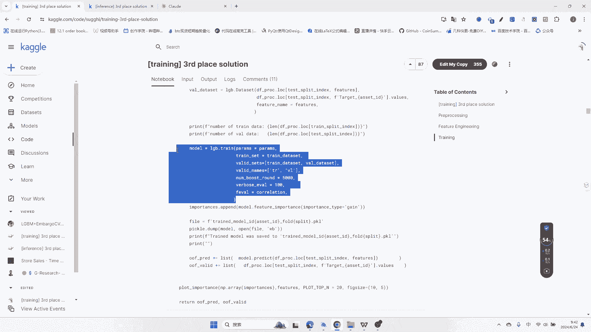

自己自定义的这样的一个magic，如果说有有有有不熟的这个参数啊，可以用这个KIMI。

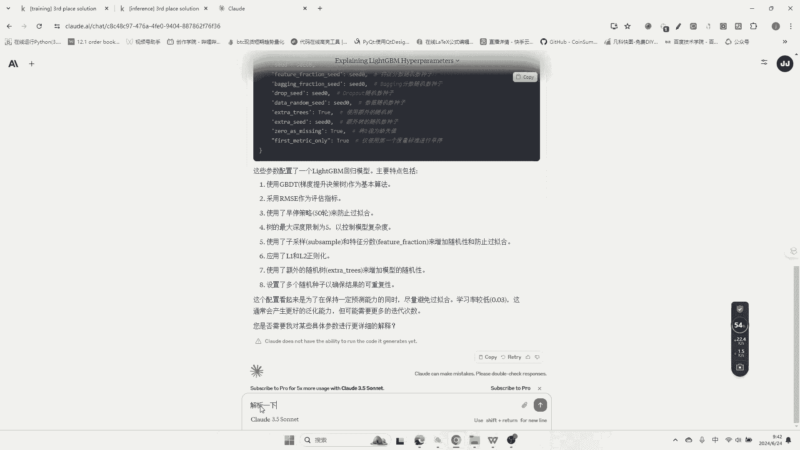

或者是去去去看一下这个这个里面呢对吧。

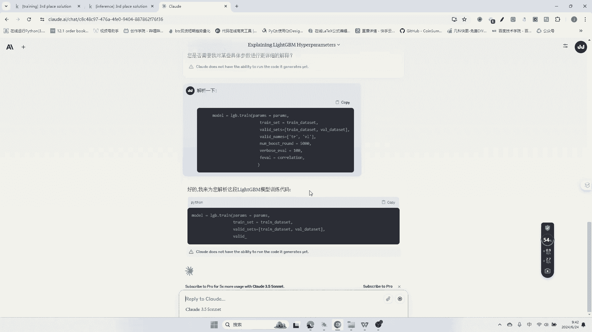

这个里面，啊chain set是吧。

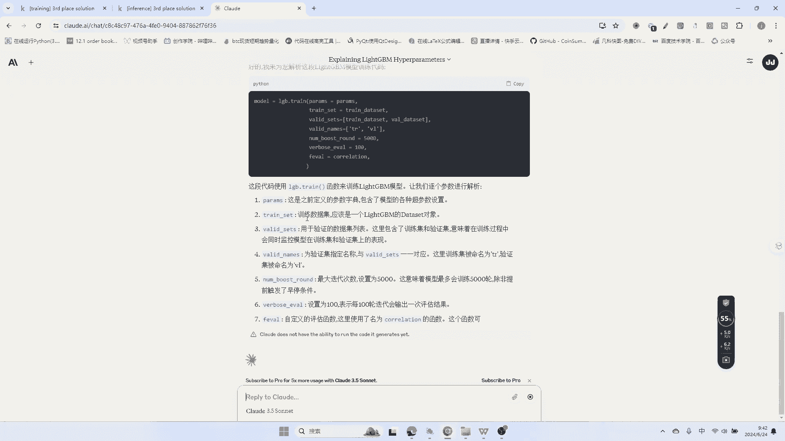

你可以看到这是训练对吧，这样的一个列表对吧，TL的验证啊，就是两个集合，一个叫training，一个叫VVL，最大迭代次数是多少对吧，就是5000次，除非你你很早把它停停止掉，然后呢。

每次这种嗯100就每100轮的迭代会输出一次，这种评估的结果，那么他自应了自定义的一个评估函数，这里命名为coloration这个函数对吧，计算其实就是计算这种预测和真实值之间的，一些相关性啊。

OK那么这个里面呢，同时在训练底下就是有评估模型性能，有助于兼空过早拟合，设了一个早停的话，就不会就是没有提升，他就会直接暂停了，那么100轮输出一次结果对吧，所以说我们把这个这个会进行详细的。

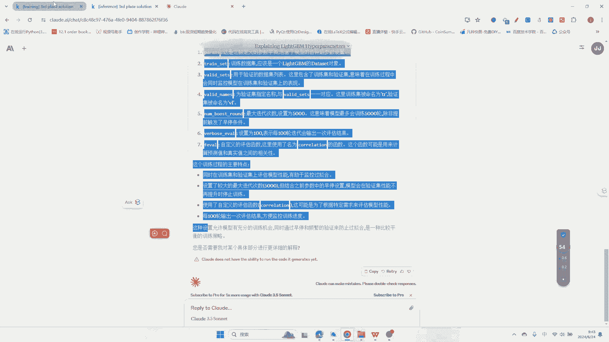

这种往下走走，那么把他一炮点式the append，因为importance是它这里上面就是跟你讲的，他设立一个列表，它把它最重要的一些特性特征，会把它到放放进去对吧。

它importance的type gain呃，也就是说这样的，就是其实就是能不能得到正向大于零的，这样的一个一个提升模型的提升，那么然后呢后面就是呃存模型到picker文件对吧。

这样picker点dump mode mode，open file wb对吧，这是write，就是可写对吧，WB可写可以追加的这种模式，OK那么后面的话就去存了，存了之后的话，那么他会把他的模型的这种。

predict的这样的一些东西啊，还有一个模型的这个交叉验证的这个东西啊，都会进行这个呃，加等于的话就是一条一条的话进行训练，一条一条会啊，塞到这个这个原来定义的这样的这种呃。

这个list里面这样的列表里面这三个列表，这样的话以后它会传到其他地方进行，你看见没有，这个就part就是pilot这个importance，把这个importance这个东西。

就传到画图的那个函数里面进行画图，然后最后的话就返回它的呃，predict和他的validation的值，那么这个就是这样的，那后面就开始这个这个又又又来了，你看见没有，就是把这个权重啊。

这个valid predic，然后呢就是跟你讲的，你看这个OFF一个空的for id in链接14，也就是说这个OFF里面呢有14个，这个这个这个列表啊，其实就这个意思，OFFOOF啊。

这个这个里面还蛮有意思的啊，但我没想到他是这样子生成这么多空列表，其实就是这个诶其实是为了塞数据进去，存进去对吧，这个做了一个这样的容器，那么它是一样的啊，就是你看见没有，他这个这个里面对吧。

就是SSS链小什么什么小于16，什么东西小于二对吧，这个里面呢你看有for s s i d s s链，in他一个zip函数，把这个这个他的id，还有这个链呢它进行了缝合对吧，就要那个zip。

然后呢这个里面呢就开始去读取它的这种数据，其实就是这样的，把那个数据对吧，Get xy，还有model for assets，把它读读，读进来之后，然后呢还有一个是这个什么。

他有一个详细的就是资产的detail的那个weight，那么这是给定的啊，那么他就是把他这个weight temp啊给给给给过来，每一个资产把它呃放进去，把它一个weight读出来，读出来之后。

最主要是他为了这个最最后的话，去做模型的评估，然后呢这个里面呢对吧，加等于加等于加等于啊，这个还有一个乘对吧，乘以这个也就是说把它weight，每个每个品种所占的weight，以及就是刚才讲的啊。

就是这个每一个就是塞到这个这个这个list里面，也做的这样的一个一个一个工作，你看见没有，这三个又是要把它塞到里面，然后呢开始去做一些这样的嗯啊，就做一些这样的评估。

你的collection on score，对他的两个就是这两个数据，nb d err进行一个一个啊，做到OOOF里面的一个评估，最后打印一下啊，开始就开始整个下来就开始训练了啊，这个里面呢对吧。

呃对于你看也可以看到打的，打印出来的这种日志就可以做了，就是对第一个资产对吧，做了这种CV就是交叉认证七回，然后呢这个呃券的数据是多少条，然后呢validation的数据多少条。

然后呢这个这个OK那么这个里面呢就会50次，没有到的就会早停，然后呢他把他的training的RMS1，以及training的correlation，以及training的IMS1这样的数据打印出来。

训练完了他就会存一下对吧，存到这个这个id0for啊，fold0点PKL的文件，那么做第二次一次一次这样去去做，第三次，第四次，第五次，第六次，第七次，但七七次他好像都没有没没有没有早停啊。

就是说证明这个什么training until redition，scdon't improve for啊，Fifty lungs，那也就是说他在5000字的训练里面。

他还没有到达那种就是不继续下降了哦，还甚至有返返回来的那种现象，是没有的，那证明就是吴签制还没有到达最佳的状态，那么他把他的这个分享图的这样，这种importance的图给给给拿出来了。

而且的话你可以看到他的importance对吧，那么具体的importance，你看这个log300什么什么的，我在其他的呃，CRYPTO的训练也是这样的啊，就是log300啊，几多少多少啊。

都是这些非常有用哦，其他的给到的非常多的，这种就是这种就是深度不平衡啊，还有很多不平衡，还有这种这种协力呀，还有包括ORACBOOK的这样的东西，我做的all book book的训练啊。

都没有这个大啊，然后呢他就长这个样子啊，你可以看到啊，就是有的有的有的有的时候有的权重啊，训练的每一个每一个特性的权重的大小，你看这个就非常非常他的标准差也是非常小的，你可以看到呃特别特别好。

那这个最后的这个权重，你比如说是lock里ten300，比如lock雷ten的300点命哦，然后呢和lock里ten300去比的话，那么它就是你看你们十的-1+-2次方，它的标准差的有点晃动比较大。

那么还是这个排排序最重要，他就是认为是这样的，所以说啊大概是这个这个这个样子，那么他就会最后得出一个什么样子呢，他就说最后得出了一个呃评分是什么，0。05844，然后呢他的await weight是4。

3啊，那因为它占的是4。3，我忘了这个是BNB还是哪个B啊，他占的是这样一个情况，那么就是在这最ID等于一的进行训练，那么一直等到这个呃七它有14个品种，再乘以14个品种乘以七个七折啊。

Photo of7，那么大概训练了98次对吧，今年八次然好了，一直会去拿到这样的数据，那拉的数据最后的话那么就比较简单了，那么就其实呢它就最后的做了一个结果对吧，把它waited。

这个这个这个这个这个这个就是啊点sum，然后呢，其实就是最后的话，其实就是递交这个这个数据啊，要评估完的这个数据啊，呃最后啊做一个什么样的一个呃，结结论一样的啊，那么他这个这个里面的所有的评分啊。

训练过程的评分就是这样的，OK整个的话就是这样的一个一个所有的东西，接下去的话有空我会讲一下，light gbm和调参的这一块，我觉得呃就从这个里面呢，也我们也学到了一些很多的技巧。

比如说有一些生成特性的技巧啊，层层特征的习技巧，第二个训练呃，保存打印这些的一些技巧，包括这个里面早停的这个里面，就自定义自己的这个呃，自定义自己想要的这样的magic对吧，这个里面的都给到我们呃。

非常有益的一些启示啊，那么就就看起来这个就这么点啊，我觉得还是蛮有蛮有意思的行。

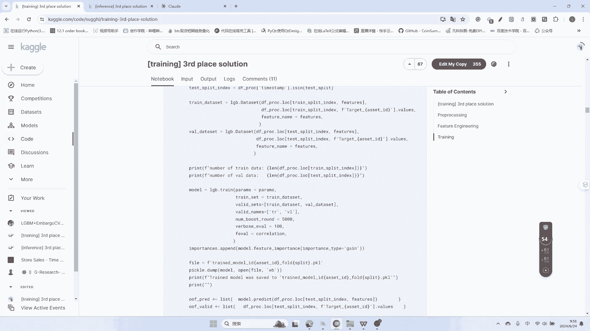