# Kaggle竞赛Gresearch对数收益率残差预测机器学习预测--赛程说明 - P1 - 高频交易dragon - BV1Lz421z7Gw

楼兄弟们，有一段时间没有给大家汇报，这个量化研究的一些情况，然后呢这次呢哦我看很多人在高频做事，做一些预测类的东西，无论是用a as模型还是用GP模型，呃我认为的话就是在高频里面的话。

一定会用到机器学习，所以说最近一段时间呢，呃也是用机器学习在在在做一些事情，然后呢我们看到这个cargo，那么也提供了一些竞赛，那么这个竞赛的话，那么会给一些奖金，那么也是有知名的这种矿的机构。

然后来出这个钱来进行赞助，那么无论是怎么出题，包括怎么样去做这个竞赛，怎么样去递交呃，整个的过程也有可能呢有几千名啊，呃这种嗯机器学习的高手来参与这样的竞赛。

然后呢我们来看看其中的一个叫基里search，做的一个CLIPAL的这样的竞赛，然后呢我们把它的题目啊从前到后录一遍，然后呢再找一个打金牌的这种方案，从前到后跑一遍嗯，OK那么我们废话不少说。

然后我们看一下，就是它整个的这个他的给了一个，加密竞赛的一个教程啊，就是嗯讲解一下他的数据呃。

他的target啊，这样的东西是怎么样长，长什么样的，那么我这边呢就采用了这个，有一部分呢我就用了翻译啊，那我们看看他的这个这个这个教程，就crypto forecasting啊。

这个里面呢它大大概的数据是一分钟的啊，一分钟的数据去预测，大概是15分钟后的这个呃log里turn，他这个logo里turn呢又又又做了一个这个东西，做了一个什么呢，它一一定要减一个残差，减一个。

我个人认为就好像是市场指数，也就是说这个这个里面呢具有多少的这种，就是我们说的就是超额收益啊，那么没有超额收益，他就觉得对吧，这个东西就没有意义对吧，去做多或者做空，那么它的里面呢在分离某一个品种里面。

那就要比整个市场大概要好很好多少对吧。

大概是这样的，呃我们来来看看呃整个的教程怎么讲的啊，呃这个里面呢他就是说了，就是呃给了我们这些相关的概念啊，就是这个就整个的notebook了，就是描述的数据集和一些相关的统计的属性。

然后呢给了几个简单的machine learning的这样的一个，baseline的模型，那么这个baseline的话也相当于业绩基准，也就是说他随便用个东西搞搞对吧。

用的skr land这样的东西搞搞，你能不能跑赢他的这种比较基准对吧，那么大部分的我看了一下，大部分的这里边的用的模型都是用了这种啊，回归的模型啊，那么呃有的人大部分可能呢用的是这这几个啊。

叉叉ge boost，还有这种呃叫rider gbm，怎么也是差不多的数模型，还有的可能呢会用到这种LSTM啊，类似于这样的模型有很多，但我们呢肯定讲不了那么多，我觉得的话我们这个为了追求速度。

要投入到生产，快速学习这个这个差距，boost的这个内存的占的比较大，那么这个LIDERGBM的话就比较小呃，包括我们要去上这种CPU去学习的话，我觉得直接用呃，节省内存呃，速度比较快的。

用这个这个rig b m做一个案例。

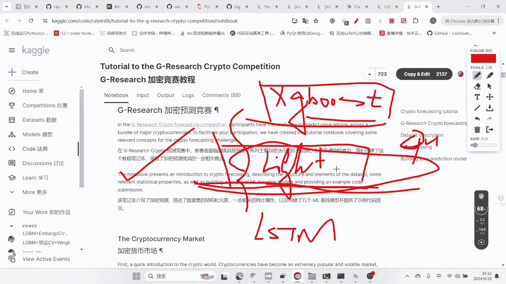

去去找一个案例来聊一下，OK那我继续往下走啊，那么他就是介绍了这个比赛的整个的background，这个background是一个什么呢，那么他就是说呃，就就是数字货币，成了一个非常欢迎的一个市场啊。

那么首先呢有几千种的这样的货币，那么主流的货币它就是说比特啊，以太呀，呃他这个里面呢因为两年前的东西，你像现在的Sol这啊，这样的东西都都会比狗狗，这个排名的权重会更高啊，瑞夫啊等等。

OK我们具体的就不再看了啊。

也就是说他就说一天有400多亿美金的，这样的交易额，那么肯定到现在也不止了，这是因为它截止到2021年的数据啊，这两年前发布的，那么现在的话已经已经已经对吧，也市场也发生了比较巨大的这种变化。

那我们再往下看啊，也就不同的货币之间的价格变化是高度的，这样的皮尔逊系数相关的这样的一个东西啊，那么嗯最主要他介介绍了比特币和以太坊的话，可能是主要的驱动力，也就是说占的权重。

因为它的市值和交易的这种这种这种，大概你自己看看啊，这个比特币一项，大概可能占50%左右的权重啊，那么现实呃以太坊拿走了20%左右啊，那么这两项就基本上就是占，占用了市场75%左右的这个权重。

所以说这个这个两个的，它是可能会单独有自己的行情的，所以说他把有一些这种呃，其他的都会做一些权重的东西，那么这两个了，好像是他没有去做这个权重的这个预测，OK往下走，那我们呃预测的回报啊。

那么他的做的这个东西就是对这个将来对吧，一个东西到底呃是上涨还是什么，就是我们说的这个这个这个forecasting return啊，那么他就是做的这个这个log，因为log的话他就是说比如说这个P啊。

T加这个这个15分钟后除以这个现在的pt，那么它的这个只要是上涨的，那么这个数据它肯定是大于一的，大于一的，整个log一起的话，那么他肯定就是大于零的对吧，大于零的话，那么如果说它变小的话。

他肯定就小于一的话，就可能会有负数啊，那么就是说可能呢整个就就就就是他这样，一个logo的这样的返回的值的话。

可能是一个我们说的，可能是一个可能会达到比较高哦，可能达到好几倍吧对吧，就是跟你讲的我们说的这个好几，这个是数学上的啊，不是真实世界情况，他的这个图像是可以成，可以从这个负无穷到正无穷的这样的一个东西。

那么而且的话log还有可加性啊，所以说这个就用log的这样的嗯，应该我们说的这种回报对吧。

这个这种这种就是日子这种回报，来做这个这个预测的这个target的啊，那么就是资产回报率，那么这次比赛呢，就是设计了14种的这种代币啊，那么他的这个是比较有意思的是什么，就是说比赛结束后。

就是就是看您的模型对吧，在真实市场上的表现如何对吧，收集真实的市场来评估它的这种预测的效果，也就是说你当时这种呃，无论是训练集还是测试集，以及这个交叉验证做得好都不算数啊，可能他就是说就预测结束。

评估期内收集的真实数上的相关性来进行评估，也就是说你做的好的话，可能呢要在磁盘里面的真实未来的数据，看不到的啊，不会泄露的数据来进行那个，所以说他这个很多数据，你是可以当load下来进行自己训练的啊。

所以说这个跟有一些比赛还不太一样啊，那么OK那么这个来来讲呢，就是说呃加密货币及其挑战的一个预测任务，就考虑到资产的极端的波动性，因为原来没有做非常多的这种呃比特币啊，或者是以太坊的这个ETF的产品。

那么这个这个这个产品当时是没那么多的啊，那么所以说两年前跟现在的不一样，那么现在我们都中国的国际，这个在香港市场的，发了这个将近800亿的这种啊，七八百亿的这个一美金的这个ETF。

所以说现在的这个整个的市场的容量，包括这种还是有所变化的，所以说它就没有那么多的这个这个波动性啊，波动性就特别是这个BTC和以太坊的，波动性不会那么大了啊，那么就是说进行预测的话，因为数据也是非平稳的。

山寨币肯定是这样的啊，市场和这个这个这种市场操纵啊这种东西啊，那么就是说他的就是变化非常快的，作为machine learning的设计来说，预测嘛就是说都都喜欢对吧，能挣钱对吧。

就是我们怎么样去发现这样的规律啊。

做出这个模型来模型过来，那么OK那么首先就进入到这个数据集的描述啊，就是它提供了几个样的什么样的数据集。

放在什么样的地方，那么我们来看一下，首先的话把所有的pandas啊，南派和daytime的引入进来，然后我们来看看它的这个里面的，是一个是有一个这种input下的g d search。

creepy to flocasting这样的一个目录的，那么这个目录下面呢啊这里有个点啊，这LS那么这个是是LINUX的命令对吧，那我们都知道这个里面是，就LS某某下面的目录有什么样的呃。

呃文件我们看到有一个CSV这个asset date details，是CSV，它就是表示了后面会看到啊，它是表示的代号是什么，B比如说是BB安B啊，类似的啊，B安B那么一是什么样的B我随便写写啊。

这个这个里面你可以看，二是什么以太坊啊，ETH等等对吧，三是什么什么什么叉叉RPS什么的类似的啊，就是这个这个detail文件，那么他给了一个sample test的这个cs v啊。

还有一个就是嗯这个supplemental这个chain，那么你可以看到这个chain你肯定是训练的啊，还有一些呃是这样的，上这个这个递交的啊，SUBPERMISSION这样的一个CSV。

就是如何把你的模型给递交上去啊，那么还有一个就是DBSCURRECURREAL，将来好像是一个文件啊，还有一个是圈点CSV，那么那么我们拿来训练的东西的话，你可以看到它其实就是券点。

CSV是可以拿来训练的，还有这个supplement的这个这样的，这样的一个券的，这样的CSV是可以直接去拿来做这种，做做做这种训练的啊，所以说你可以看到他的会长什么样。

那么他首先把这个券点CSV拿出来看一下，那么你可以看到它会长什么样啊，第一个第一列哦，你可以看到它是一个叫什么，我们说的这个time stamp，Time stamp，它有十位的。

十位的这个time stamp，它一般我们都知道它是以秒为单位的UNIX时间，对不对，如果是13位就是毫秒，所以说啊而且你可同时看到啊，这里面是第零个资产，那么这一行列也是第零个资产。

而且你看到了这是4920，这是4680，就差60秒，差60秒，其实就是这个这个一分钟的行情，对不对，其实就是一分钟的行情啊，然后呢他把所有的这样的asset，asset id都拼在一个CSV文件里面。

到时候你还要根据这个这个里面呢，根据这个SSID去把它们分开出来，进行这个训练，OK我们可以看到这是这样的一个数据，Count，就是呃在这一分钟发生了多少次的交易啊，这个开会开高低收。

这个都是我们我两都是我们很熟悉的，开高低收一分钟的这种K线的数据，还有个v up，那v up就是这一分钟里面发生的这种平均的，这种一个成交价，那么它是带有权重的啊，那么就是这样的一个一个权重的成交价。

还有target target的话，它就是你看见没有，他给的，他有的，你看这是可能是第一个数据，它它给的就是n a an了，那么他给的数据，它这个里面呢其实就是就是就是什么。

就刚才我所说的这个logo det，他一肝险弃了，还有一个是什么，来自于比较远的这个这个市场的，整个的一个来自于市场的这个，这个，这个这个应该，我觉得他有点像这个权重指数一样，那么这个里面一减的话。

应该来讲他这个其其实我认为是预测它的，对整个市场来讲呢，它的超额收益啊，这个里面因为他带了一些权重，我个人认为的话，他这个里面呢整个对整个市场的贝塔来讲。

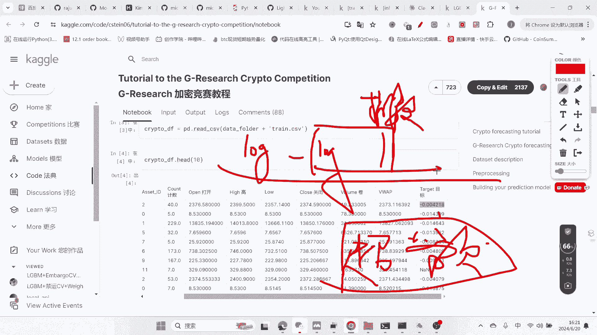

它具有什么样的超额收益，OK那我们大概的这个数据啊。

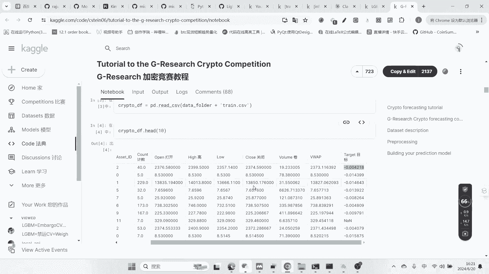

后面也会讲到，那么这个数据特性也讲完了。

讲完了target的他用了一个什么，在这个里面的用了一个这个叫残差的log eternal，什么样叫残差啊，这就是预测15分钟后的，15分钟之后的残差的超额收益，或者这样来讲。

OK然后我们继续往下走哦，哦OK那么我们首先呢他就把这个detail文件呃，拿出来打印一下看看啊，Ss detail。

那么这个TTL文件的话，我们来瞄一眼它，它这个里面的，就其实这个里面已经有一些权重了，看见没有，那么waited什么样的东西啊，那么这个里面呢表示它的像BMB对吧，叫bitcoin cash。

还还还有这种bitcoin coin哦，那么它的每个都不一样啊，还有比特币对吧，所以说这个这个这个它每个都有权重，还有EOS以太坊等等啊，以太坊经典以太坊莱特门罗恒星啊，这个我也不知道波场吧。

应该TRON是吧，类似的就很多狗狗呃，类似这样的，他给他的SSD都编了号，大概有14种，这样的一个一个B对进行一个一个预测和测试，好大概是这样的呢。

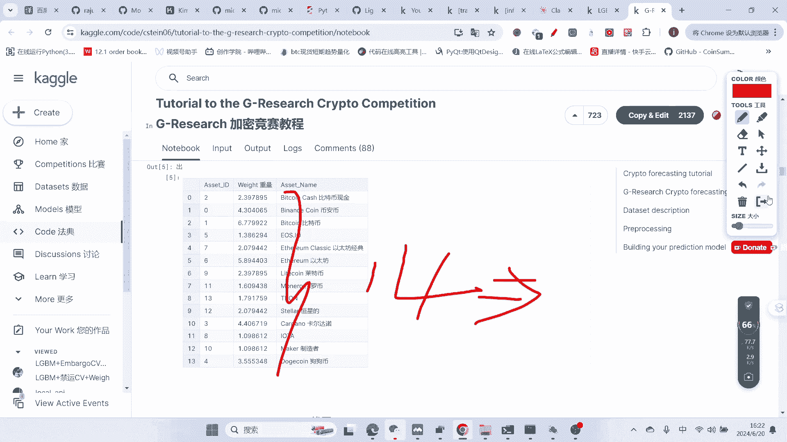

任务那我们来看看它的K线图对吧，长什么样，那首先的话它就是你看见没有，他这里里面用pandas，把这个SSID等于等于一，就是拿了第一个品种出来来看看哦，他是比较了一下比特币和以太坊的。

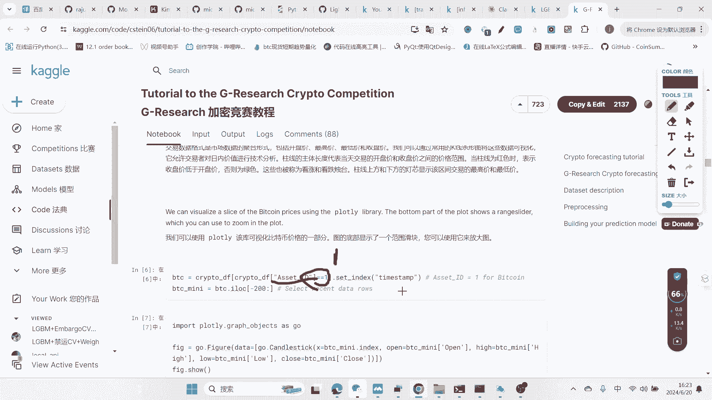

这个这个数据长什么样啊，就看了一下这个图啊，这个这个莱奥用的这个priory这样的库。

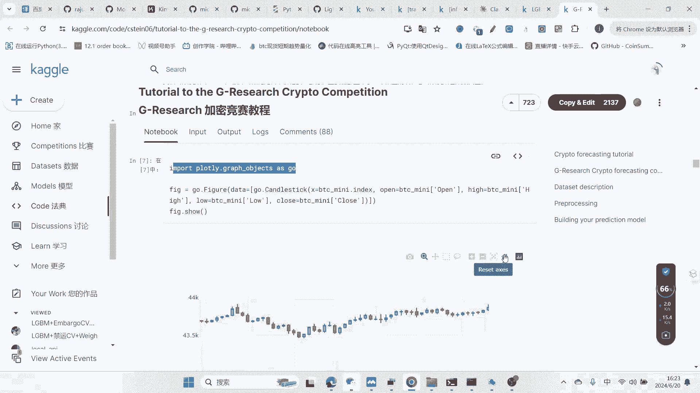

进行画图，那politely它的画图的，你就知道它是有下面的这个小方框了，然后呢你看见没有，它是可以可以进行这个拉动和放大，某一个某一个图的细节对吧。

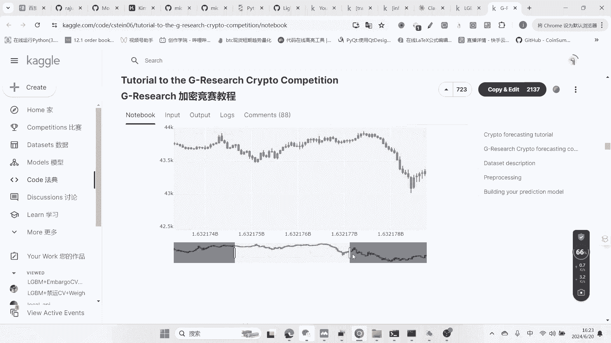

它其实是这样的，O呃他的他的已经交代你怎么样去看啊，那么对数据呢也会进行预处理，有的数据会丢丢帧了，我们说的一分钟整个丢了，他的丢帧呢你可以看到啊，就是你包包括您自己录制数据的时候。

是否呃查询API的时候是否有丢帧，他给了一个方案给了我们来看看它，首先呢呃首先是已有的数据，它看看有没有丢丢掉，这样的丢丢丢掉这个数据来，是不是有NAN的这个情况，那么首先呢它就是拿了这个SSAD。

等于等于六啊，然后呢把他的这个set index的times tap，然后呢这个里面的setting dex，就是把它time stamp作为这个什么。

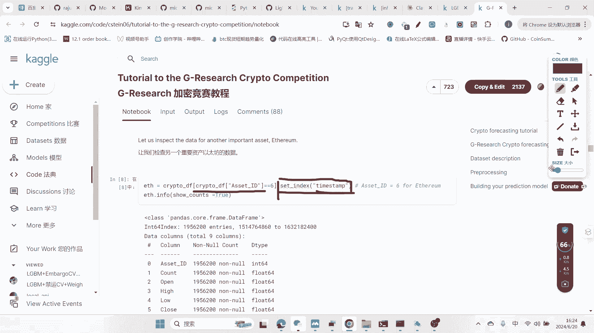

作为这个我们说的这个这个索引，对不对，然后来看看它，首先呢首先它是已经有的数据里面，我们看到就是非空的啊，就是没有看到有有newer这样的的，NULL这样的数据。

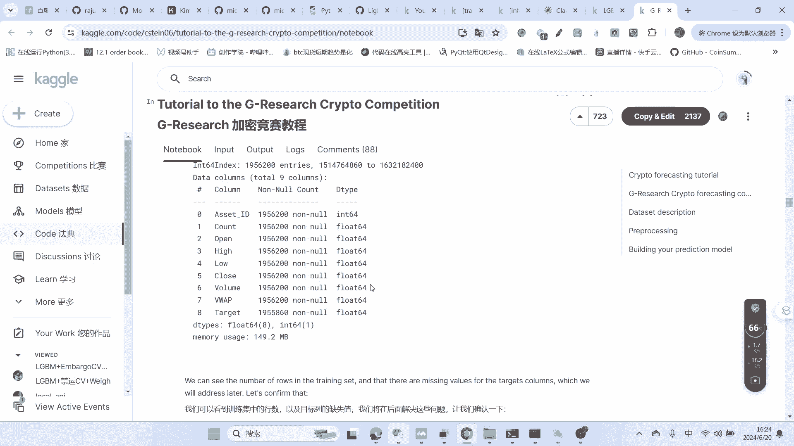

然后我看到是占的内存是149兆，那我们来看看呢。

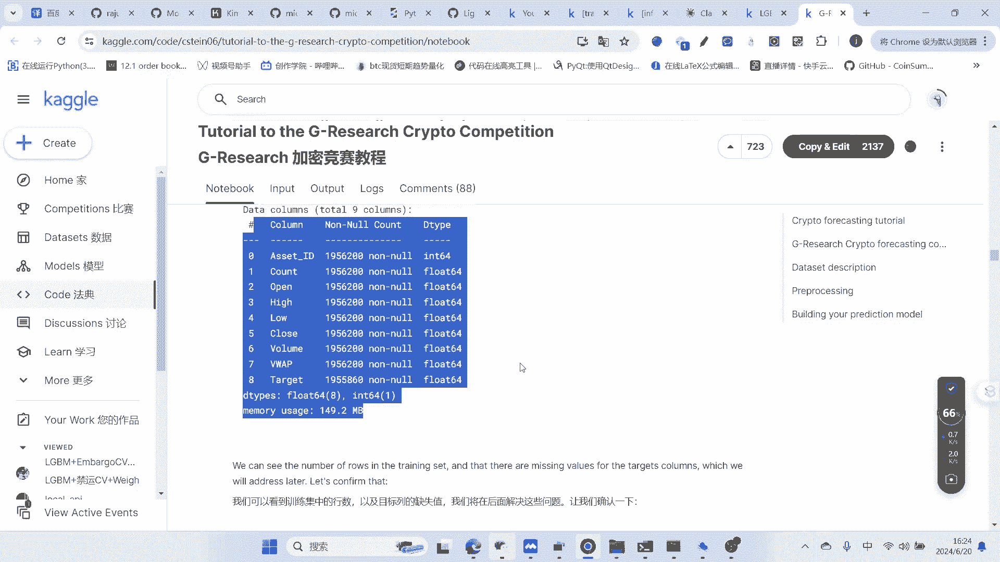

就是说这个里面的已有数据是没有非空的，然后呢看看呢整个的啊，他的用了这个ECNA点sum也是没有看见。

但它有一个问题是什么呢，就是有可能整整条给丢掉了啊。

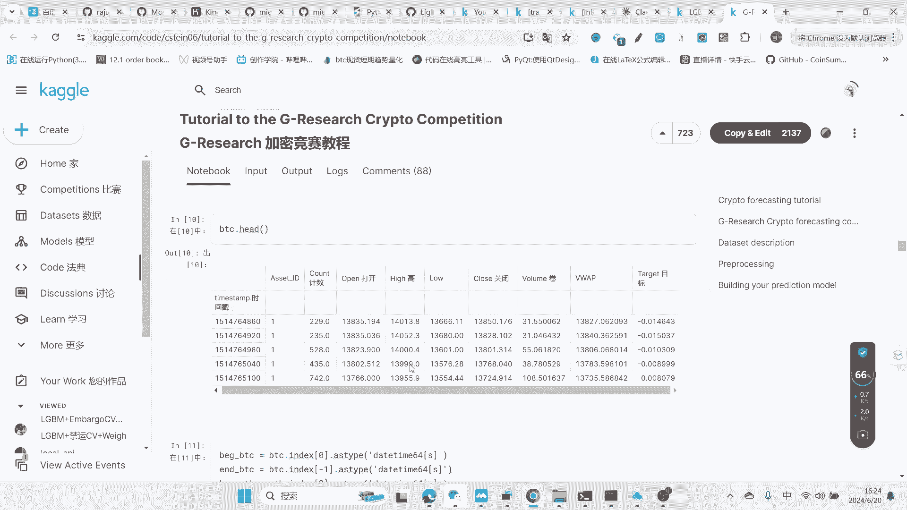

整条丢掉了，首先他把比特币的这个数据拿出来，让我们来看啊，那么比特币的数据开高低收。

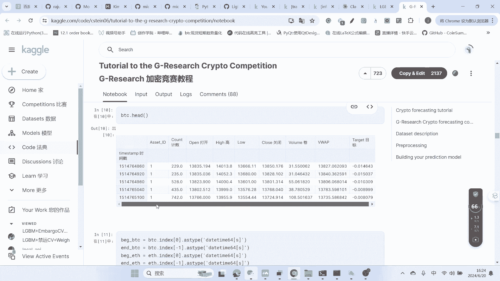

warn web pop他给的等等，那么这个里面呢，他就把这个整个的话，就是做的这个64位的数据，进行了一个转转秒的东西，然后呢去计算这个时间，到这个时间大概有多少根的这个一分钟的线呢。

然后呢用两个之间的数据进行shift一下啊，其实就是两两，然后呢把两个数据的这种时间戳，就是其实就是上下的时间戳一减，是否有这种这个这个叫什么，因为我们一般的你的数据一，如果说是非常非常一根没丢的话。

这两个time stamp之间的差值是60秒，对不对，如果发现的有120的，有180的或者干嘛，那么这么这个数据绝对就是整个丢帧了。

我们说的啊，那么这个里面呢你看见没有，它进行的这个操作啊，就是把这个这个这个里面的，你看一到最后一个就是一个，以及从前到最后一个，也就是其实就是做了一个，做了一个这种这样的数据的，这种这种这种一样长。

然后呢进行一相减，其实就是上下的这个这个index的进行相减，然后我们来看到出现的120秒，100次，180秒，20多次都要等等，那么你看最最出现个540秒，那么就有就有四次，你看看这里就是60对吧。

695百四也是丢了9分钟啊，这个这个里面出现四次。

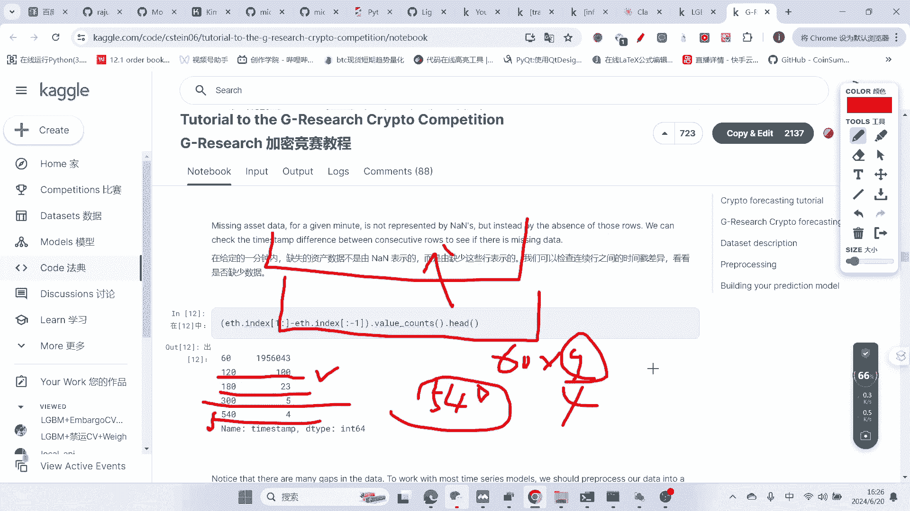

也就是丢帧还是比较厉害的，然后呢就如何去进行这个填充数据，那么在这个里面呢，它还进行了一个LINDEX的，这样的重新重重新填充，然后呢怎么样填充呢，你可以看见没有。

他把这个这个in in index的重新来过一遍啊，因为它这个里面的按照60秒，然后呢这个步长对吧，按照这种方式去填充，然后呢。

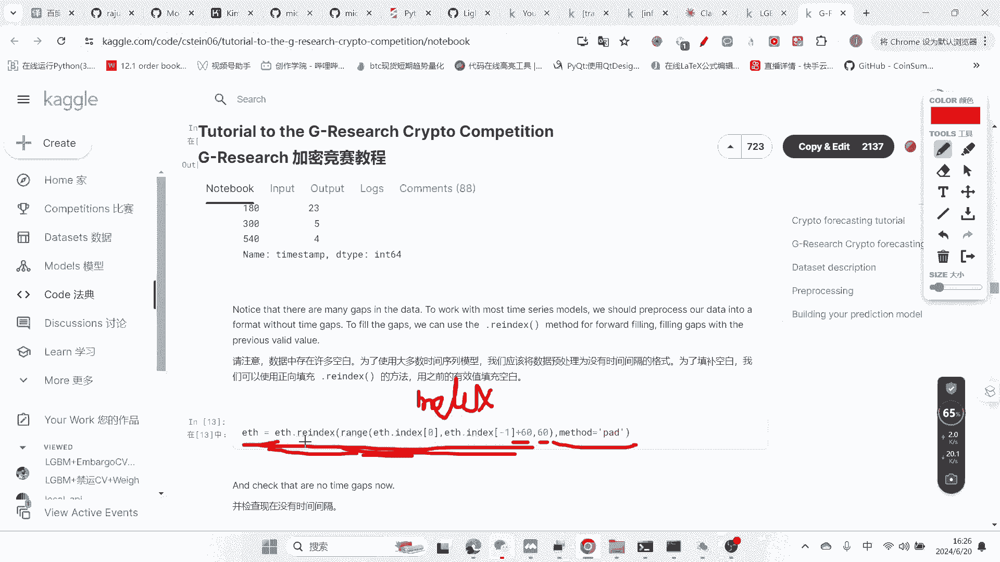

把这个啊重新这个这个这个这个这个数据，因为它是这个time stamp。

是一个技术连续不断的交易的，因为它是24小时的，所以说按照这种就可以把它重新填完，然后呢用这个全覆盖的方式，pet的方式进行填充，OK这个里面呢再把它的数据进行可视化，然后呢看他们长得是怎么样啊。

然后你看比特币和ETHH呃，看起来大差不差对吧，可能呢这个呃这个这个时候呢这个地方尖一点。

然后这个地方呢宽一点而已，那么这个里面呢，再把它拉到最近的一个时间来看看啊，那么因为它就是一天嘛，这个是一天，你可以看到他的他的这个就非常之相啊，你看见没有，他是这个这个你看见没有。

因为这个这个是01072021，你看见没有，它是day放前面，也就是说7月1号啊，6月1号到7月1号，那么就是一个月的啊，那么一个月的数据它对比下来长得是非常像啊。

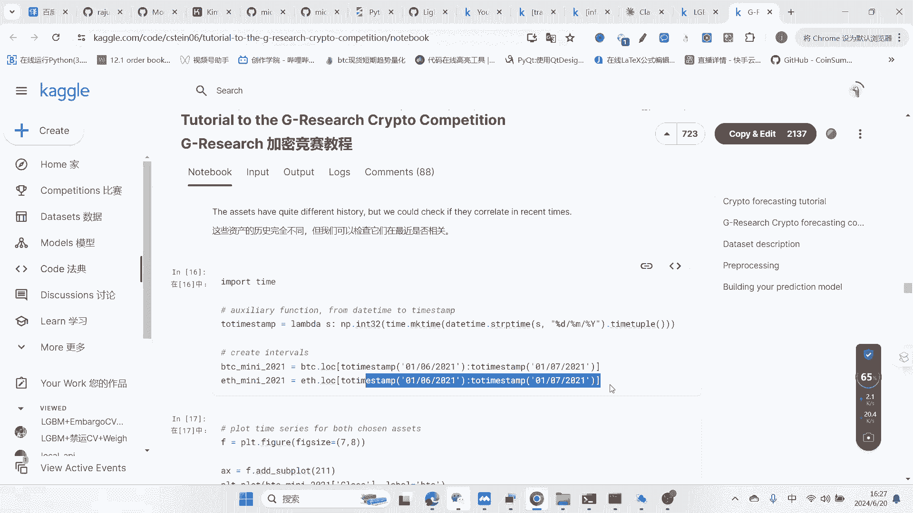

那么后面来讲到这个lockly ten的一些问题。

lock里ten就刚才说的是这个对数的收益啊，那么对数收益的话，因为呢还有一个对数收益的话，刚才讲的它的对数收益它是没有，这个它是负无穷到正无穷的啊，它不会像有的有的一样啊，收益可能呢。

这个这个里面呢只能从零或者到哪里为止啊，那么所以说他取对数收益，有可能呢就就就就回报率啊，就不可能就是还有的不能低一负百分百嘛对吧，因为他有的爆仓漏着干嘛就-百分百了，那么在这个里面呢。

可能那就不会有这个这个东西这种这种收益，那么他就是按照这种这种不可能是第一。

所以lock里ten是他的一个很好的一个选择啊，那么包括它log里面有空值的一些东西，包括第一个值有空值或者是有全，是因为它有第一分钟到15分钟，那么肯定有十五六个空值。

那么怎么样处理它都要删掉啊，这些数据都做得非常详细的介绍，所以老外的东西还是介绍的非常详细，那么我们来看看他的这种收益率，是长什么样子的，那么这个呢就相当于白噪声了，它就相当于这样的一个东西。

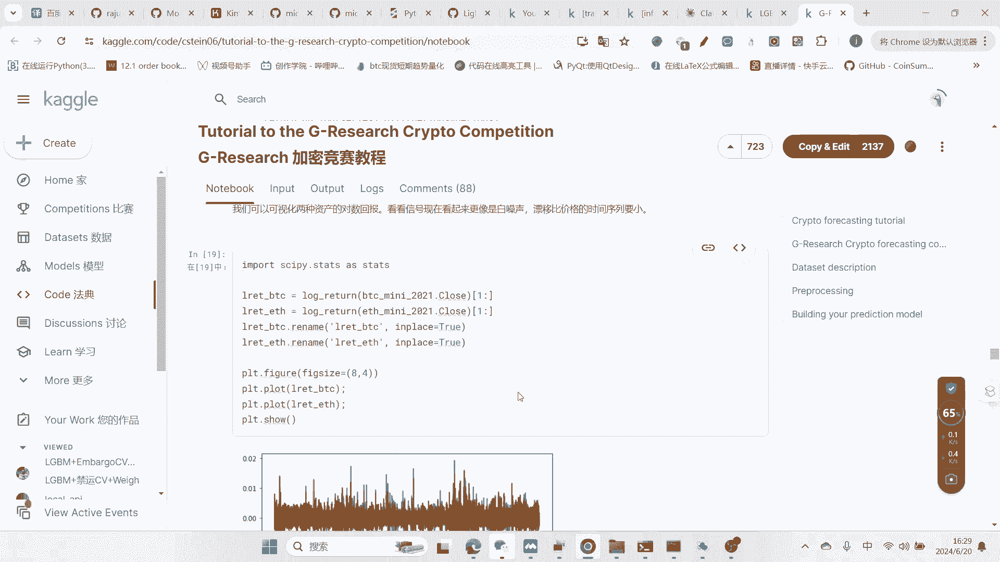

那么它整个的就是对吧，他两个你看他是围绕着一个什么样的价值曲线，来回来回残杀对吧。

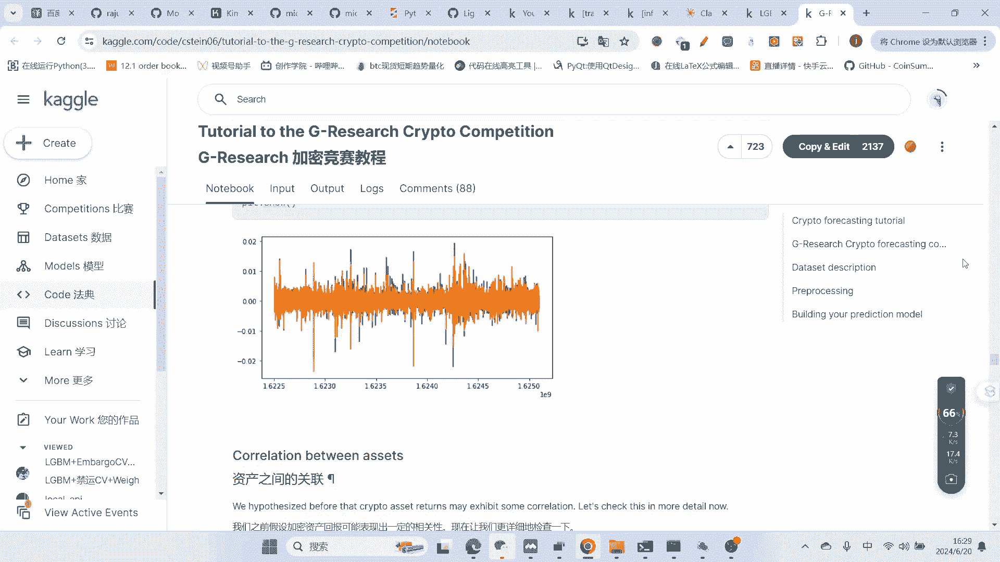

他的就这样的一个意思，OK那么他就再讲讲这个资产之间的关联。

关联性是什么样的啊，那我们来看看他的做了一个什么呢，做了一个gloop by，然后做了一个皮尔森系数的collection，这样的一个一个东西，你可以看到它它的这个啊，也就是说你pd这两个资产呢。

这个data frame的这个这个CEORR加一个括号，就知道这两个系数的这个这个皮尔逊，皮尔逊系数啊对吧，系数好像还有个什么系数下忘了，这个里面呢，他就是去做了一下他两个人的这个相关性啊。

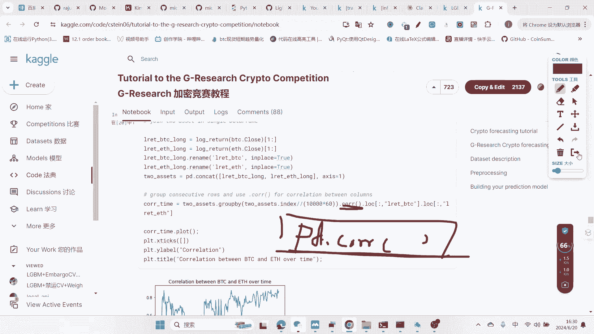

那么这个里面呢你可以看到它的相关性是什么，虽然有时候你看相关系数在0。8亿，这个以上单呢，它有时候瞬间就就变得不那么相关了啊。

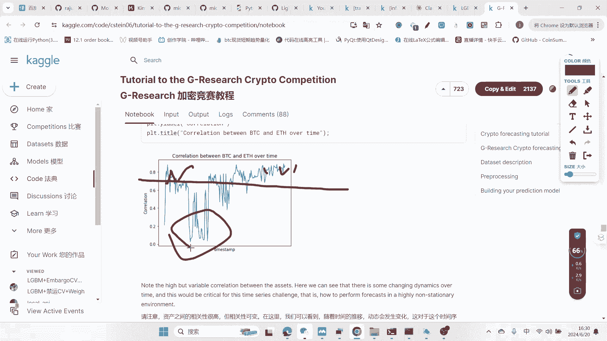

他就是说是啊，这个就是他的这种。

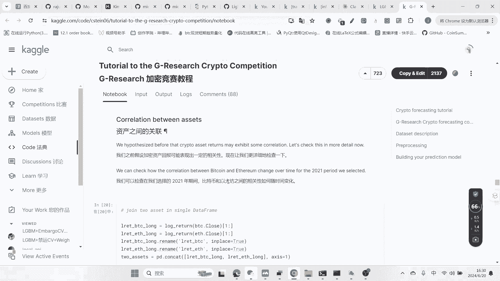

这个这个这个就是有比较大的这种数据的变化，对吧，就是非平稳对吧，就是这样的一个东西呃，如何在非平平稳的这个数数据里面呢，进行这个找到这个预测的方法哦。

OK那么它还可以进行这个矩阵的方法，原来是看了比特币和以太坊，那么我们有14种对吧，那么14种那里面的两两组合，14个取一个，然后十十三个取一个除以二，那么这个里面呢对吧，你可以看到啊这个里面的七对吧。

372 11有90多种这种组合的这种系数。

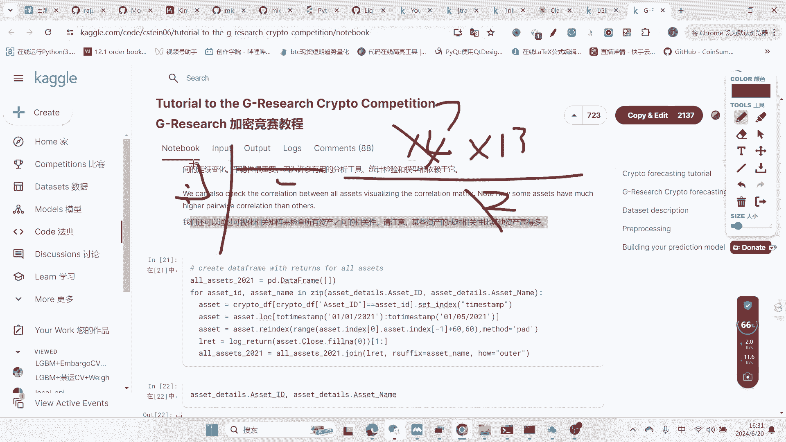

我们可以去看一下他们会长什么样子。

几十种啊，那么这个这个里面呢你可以看到这个这个系数，因为自己跟自己就是这种这种中心的，这一块就是等于一了，你可以看到这个这个里面呢就是一，那么啊比较黑的就是系数相关系数比较低的啊。

因为这里是有14个品种，那么这边呢一样的是14个品种，在那边消叉的格子啊，你可以看到谁跟谁会有比较大的相关性，谁跟谁会有比较小的相关性，你看这个你像bit going in跟跟以太坊之间啊。

你看这个是这边是以太坊，那么这个是bit going对吧，这个这个偏点黄色的，你看这个这个这个地方偏点黄色，你可以看到啊，它的系数，因为这是一个乐图啊，OK所以说他为什么要用权重的问题啊。

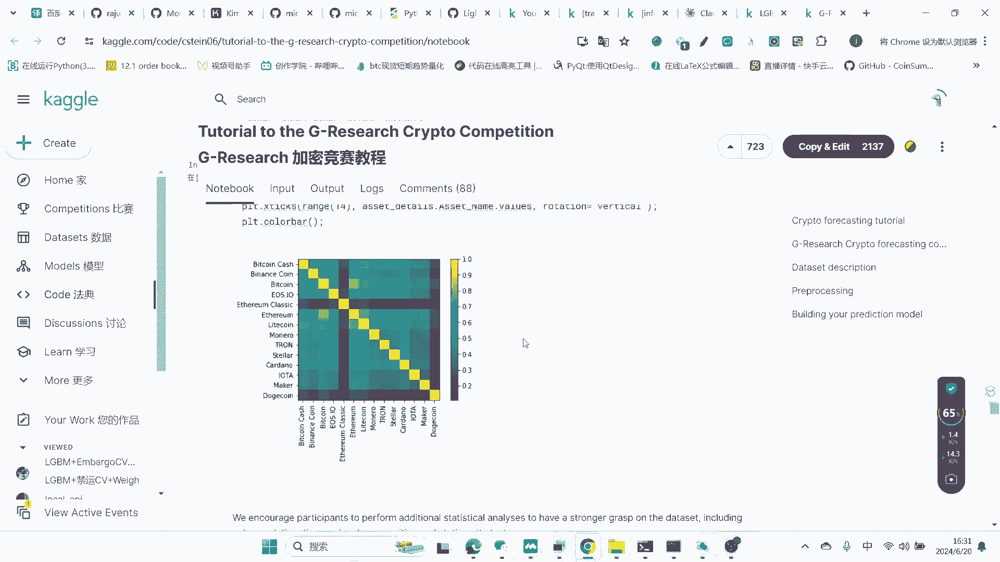

也是这个这样的一个问题，拿来后面来build your prediction mode。

然后呢，而且还告诉你这种target和这种评估的方式啊。

那么它这里里面呢就是这个里面呢。

呃这个里面已经讲的很清楚，他的这种，他的这个我们说的这个里面，其实就是LOCATTEN对吧，P的A啊，这个这个这个这个A的话，无论是对吧，我们说的这个一个资产的一个回报。

等于它的log p p a时间就是加上现在的时间，这个这个向后推16个时间周期，和现在的这个移除，那么它就是称之为这个资产的一个log里ten。

15分钟的log里ten，然后呢他还有一个什么东西，有一个这个wait这样的一个东西，那么这个这个有一个wait这样的，就是在它的detail里面，你刚才看到了这个VT的这个东西的话。

就是他的这个这个这个这个这个符号啊，这个称之为如果是读希腊文，应该是欧米伽是吧，欧米伽，然后呢乘以它的这个这个R的A的这个T次方，然后呢除以它整个权重的欧米伽，那么这个称之为它就是什么。

整个的市场加权平均的回报，我觉得就是说，如果你市场市场的这个这个回报对吧，然后呢他真正的最后的他给的它等于什么，他给的这我认为就超高收益的这个东西，等于他的自己的这个回报，15分钟的回报。

它减掉了一个整个的这个贝塔，贝塔的话，这样的一个东西，我认为就是你就你对我们这市场上的，这个这个称之为这种市场波动的这样的东西，它是M的平方，这个MM的话，就前面的这个整个什乘以什么。

乘以它的权重乘以它的这个回报，回报是什么意思啊，你看的回报拿好了，平均去滚动滚动多少，3750个实验窗口啊，那么就是把他的这个这个这个这个回报，这个去去做这个loading对吧。

loading很长的一个时间，楼龄一个3750个分钟的时间，大概就是这样的一个东西，称之为市场的这个他的这个这个资产，在市场那个贝塔的系数，再乘以它的mt用R2去减。

那么它就是这个这个我认为就是一个后面的，这个是比较长期的这个这个指数收益，用于R1减的，我认为这个东西有点像超额收益一样。

OK那么这个东西就是这样的呃，大概这个里面就讲解完毕，所以说你们就好好看看，这个是它的本身的这个这个这个这个收益，后面的贝塔阿尔法，这是贝塔，这这个这个里面呢它的是MM。

就是它的这个整个的这个这个平均回报的这个，权重去滚动一下对吧，然后呢称之为这个这个这个单单个就是贝塔，然后乘以个这个这个M它本身的mt，再用LE去解，这个就是它的target。

所以说他他给的是比较有意思的，如果我们自己去做这个东西的话，我认为没那么复杂对吧，如果你自己去做的话，可能就直接要要一个啊，做一个这个就就就就拉倒了啊，就是做一个平均的这个。

这个这个这个就是十五十五分钟后的lock里，ten就得了吧对吧，这个里面的就没有很多的这个这个计算权重的。

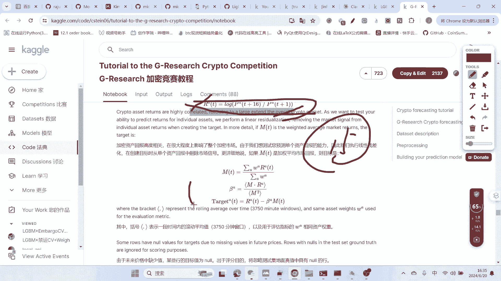

这个事了对吧，OK这个里面呢嗯就是简化使用，就是无关无权重进行评估的，就是两种资产，就比特币和以太坊，他认为这个以太坊和比特币啊，他应该来讲可以走自己的独立行情的，你们去看看这个这个两个。

它原来是可以走自己的行情的。

它就是大概这个意思，其他的都要考虑到整体的市场收益，能不能就是有超额收益，大概这个意意思啊，那么这个里面呢，呃首先他就给了一些他自己生成的一些这个。

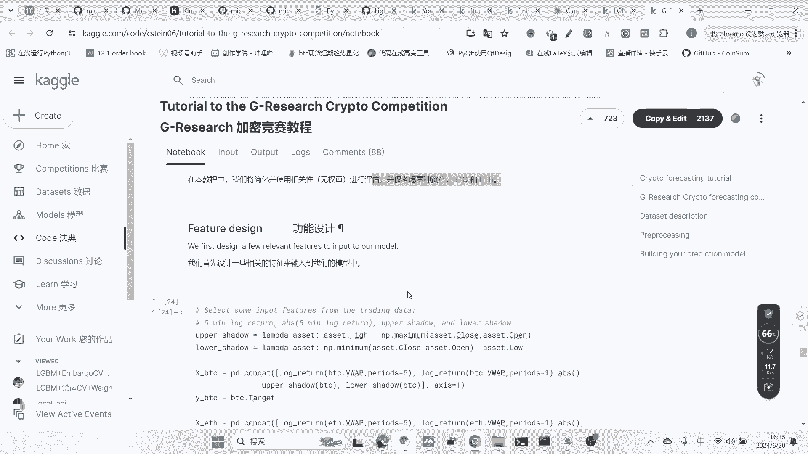

特征工程啊，那么因为它是有K线的，那么它就是搞了一个上影线，搞了一个上影线，你可以看看这个up shado，Low shado，是怎么样去去去去评估它的，这个这个它的最高价啊。

和它的这个这个啊这个这个叫什么close open的，这个这个呃最大，然后呢这个里面呢如果有的话，那么他的其实其实的就是可以看到，它其实就是会会形成一个这个上影线，也就是说对吧，这个这个里面呢。

这个上上面这个东西有一个什么，我们说的会有一个这种针呐，那么lower shaw也就是在这个有有有没有增对吧，其实就是这个，然后呢把他的这个去contact一下他的v rap，五个周期的v rap。

还有一个周期的这样的东西，然后呢还有UPSHADER，以lower shader，然后呢按照这种就是以列的方式把它给拼起来，然后呢去做了一个他的这种啊特征。

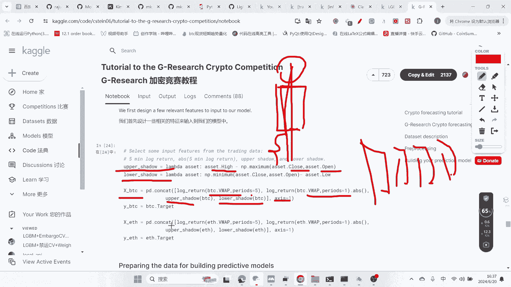

然后呢去去进行一个特征和他的TK的进行呃。

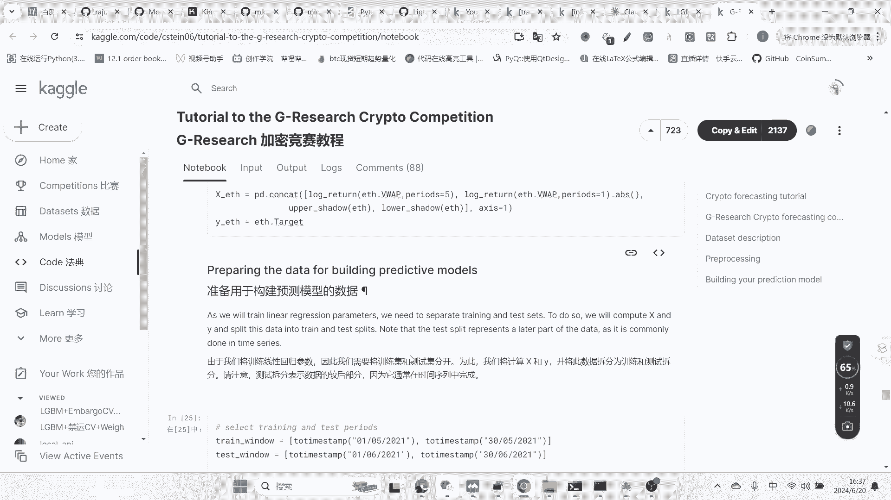

自建立线性的这样的一个模型，那么它的建立线性模型的话，那么他就把这个这个预测的时间啊，那么这个就5月1号到5月30号，做了一个月啊，那么后面的test的时候。

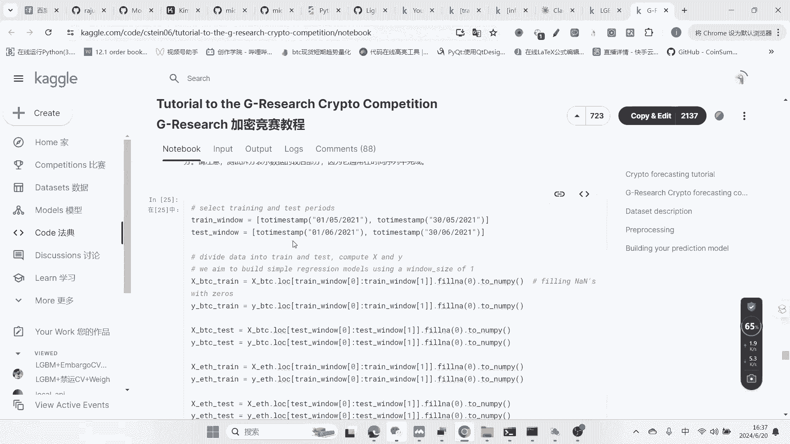

就是由6月1号到6月30号，然后进行的一个预测啊。

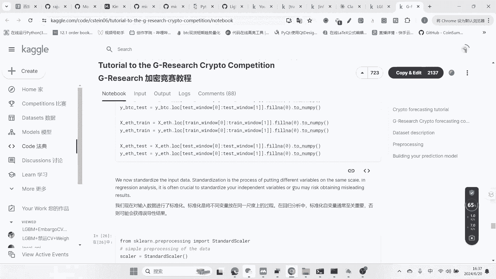

那么这个预测之前呢，那他他做了一个东西，就做了一个这个叫standard的这样的缩放啊，那么标准缩放对吧，它其实有的叫归一化的东西啊，那么这个里面呢他还做了一个这样的规划，规划之后呢。

这个里面呢就把他的数据对吧，这个这个fit进来对吧啊，然后进行一个一个缩放，缩放之后就进行这个呃叫做什么线性的回归。

那么这个线性回归的话，其实就是其实他的逻辑线性回归的话，其实就是我们有这么多的这种，这种这种这种数据对吧，这个有多少维的一个数据得点点点点，那么有一个什么样的这种欧米伽一。

欧米伽二这样的一个数据拿来发生点层，那么会推导到他的这个target的这样的，一个数据对吧，这个只因为它有一一堆比特币的，一堆的这个这个这个数据对吧，这个这个里面呢可能是因为一个月嘛。

一个月它就会是30天乘以多少，乘以这个这个24小时吧，再乘以一小时有60分钟，那么差的维度在这个列上啊，就这么一个长度，那么在这个里面呢对吧，你得有个矩阵乘法就知道，那么这个欧米伽一。

它它它可能有五个五六个特征，还是几个特征对吧，乘以就是这样的这个一维的这样的一个东西，那么这个里面呢你就知道它也是一个很长的，一个一个很很长的一个一个一个一个数据，应该是应该是这个这个是只有六维的长度。

然后了可能这里面的就是一样的，30×20，4×60，这样的一个一个叫做什么，我们说的啊有很很长的一条一条数据链啊，这个啊讲错了，这个是这个这个是这个数据的长度是这个，然后呢它的这个是只有666列啊。

那么这个每个给他配一个欧米伽，然后呢乘出来到会得到一个这个target的建立。

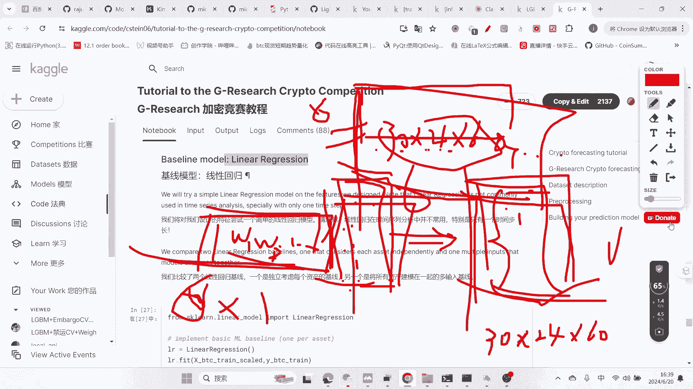

这样的一个多多元化的线性回归模型，对，就是这样的一个意思，然后呢。

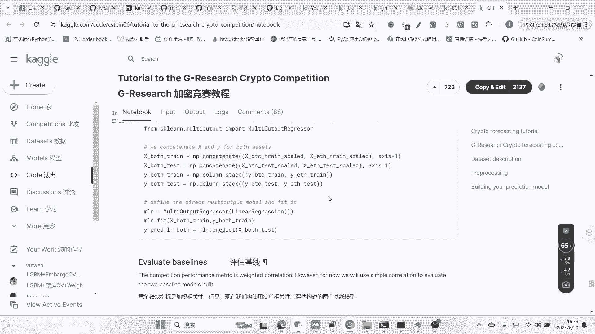

最后到去看一下他的这个得到的预测的，一个baseline，那么当然是数值的话，就是跟你讲的就是要要要包括标准差呀，包括什么呀，越小越好，对不对，然后呢，这个里面呢，这个这个他呢把两个多元的这种东西啊。

然后做了一个评估，你可以看到有的是单独的进行计算的啊，所以说所以说你可以去看看啊，这个里面呢呃最后的话他把两个联合在一起，去进行了这样的一个预测，比特币0。01以太坊，这个是0。05。

还有一个是这个这个score，这个l r b DC-0。01，还有一个以太坊是0。02，他做了一个这样的一个一个一个对比，所以说大概是这样的一个意思。

所以先他就把整个那个model给大家，还有一个就是这样的呃。

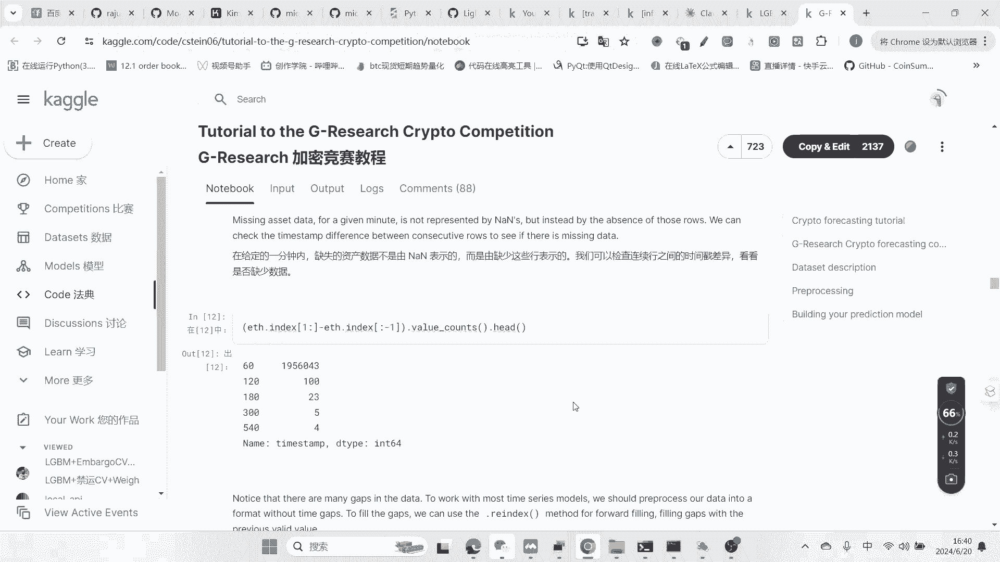

教程给人家，就是整个的做了一个他的数据的介绍。

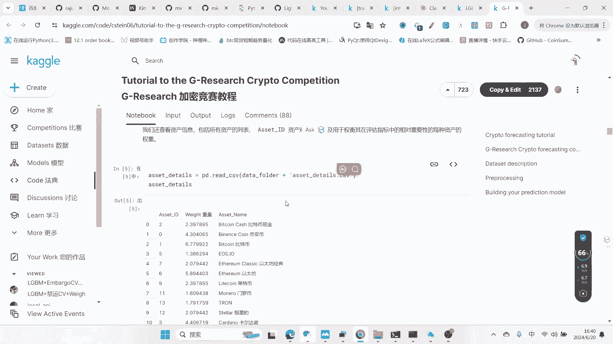

那么我们第一部分就读到这里，然后呢后面呢我们来看看。

就是找一个预测的方法啊，和怎么样去预测，能拿到这个金牌。

