# Kaggle竞赛Gresearch预测目标的说明与代码解读 - P1 - 高频交易dragon - BV1ZJ4m1M7au

OK那我们来看一下就是这个他的TKETING啊，就是如何去进行额复现一下，就是呃如果是他没有告诉他可以，如果说随着新的时这个时间推移，你怎么去拿到这个新的TAKET，那么OK这个里面呢有一个群主跟我们。

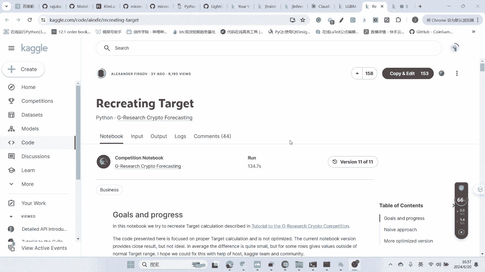

就是去看了一下，他是怎么样一步一步去求出这个targeting的，然后呢怎么样去拿到新数据啊。

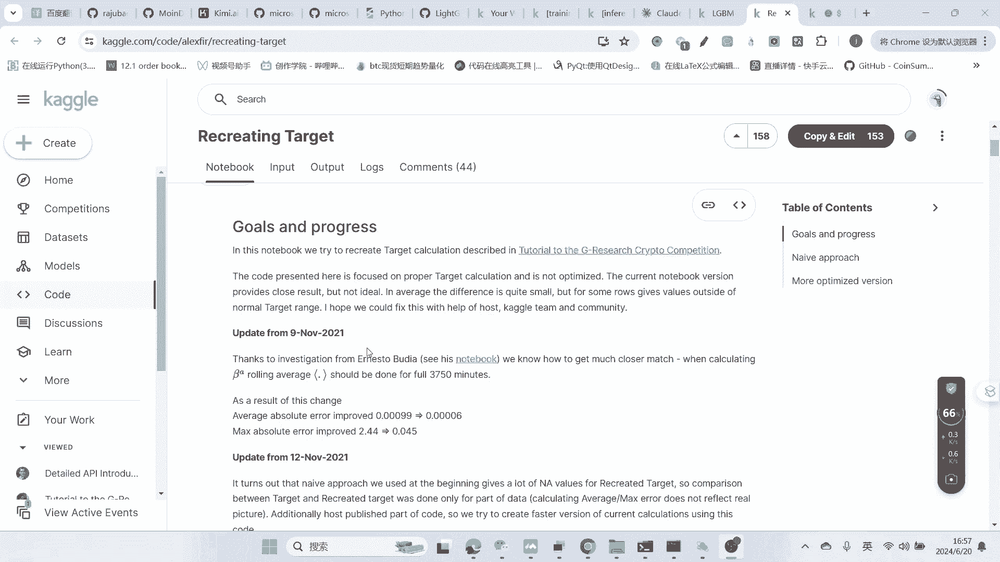

这个数据他都有自己的这种去去去拿的啊。

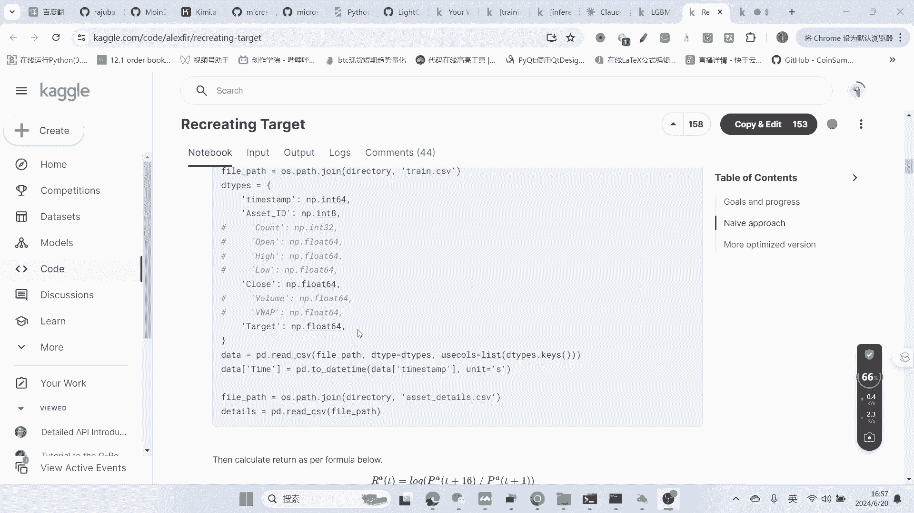

就是有这样的API，那么我们来开始去讲一下这个呃，去创建的这样的东西，那么首先呢他一样啊，去去拿到他的这种呃chain的CCSV。

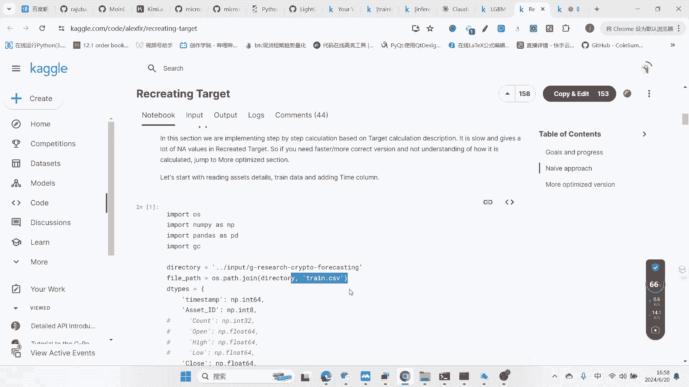

就拿到这个目录下面的东西，那么把他的呃tap的改了一下啊，这个这个里面的就是啊他们stamp拿好了，A都是变成了有的能变八位数啊，有的能变整形64位啊，那么close是64位还是干嘛。

那么这个里面的他都给了一个DETAPES，那么以后可能因为在cargo里面竞赛，它都要内存比较紧张，所以说可能能能尽量变小就变小，那么他现在就把这个呃data，就是先把它给弄弄出来。

然后呢把他需要的这个这个这个COLLINS，在这个里面呢都把它给load进来，然后了还规定的这个类型，那么我们就是拿到了这样的一个东西，而且把他的这个同时，把他的这个资产的详细情况。

也其实就是拿他的资产对应的wait，这种权重拿出来了啊，拿出来之后呢。

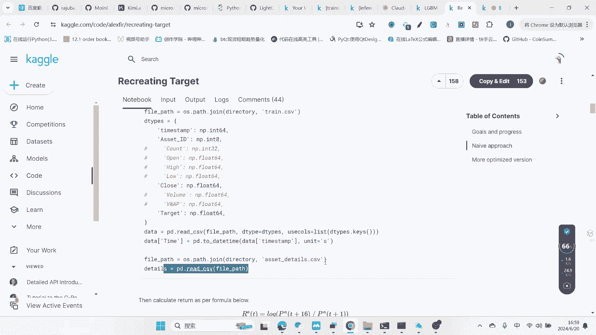

首先第一步大家要求这个东西啊，就是lockly ten，对不对，LOGITTEN其实比较容易啊，也就是说我们先拿到现在的T，再拿到这个T116对吧，呃这个这个这个东西一除个T，再去做logo就完事了啊。

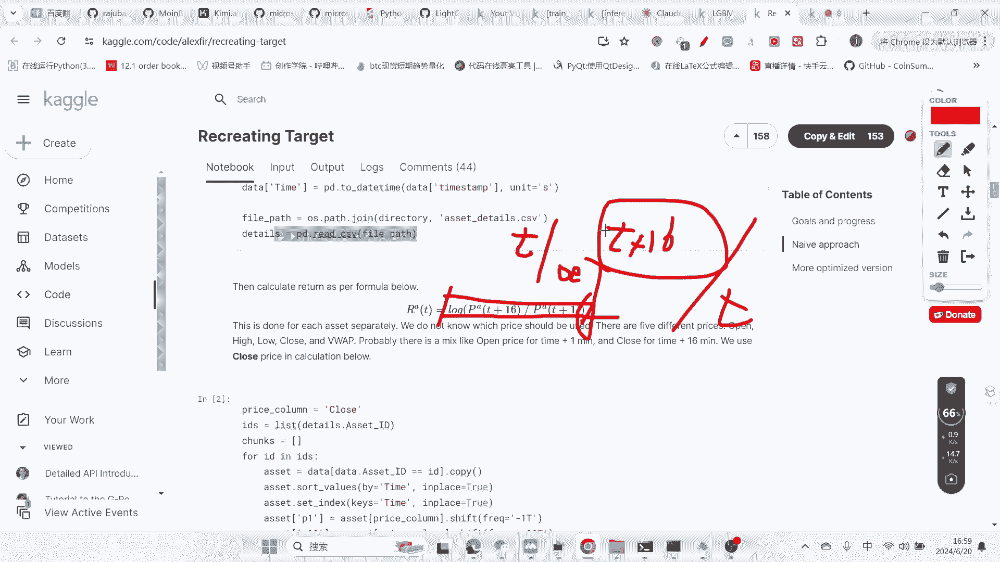

那我们来来来看看他是怎么拿到的这个东西，首先他就是跟你讲的，就是用那个columns有了一个这样的price，用了price去做这个东西，因为我们肯定就是用普莱斯去做这个这个，这个东西，我们来看看啊。

然后呢他用那个霍循环，他把所有的资产如果是data拿出来之后，它一定是什么data的，它它的这个东西啊，把他的这个这个id啊，从0~13，要给他那个那个就是每一种资产要拿出来。

因为等于等于这个之后就把它选出来之后，还做了一个copy，不要去去去冲突原来的数据，那么他把他的values就by time的values，还有啊重新set index都重新做了一下，做了一下之后。

你看见没有，他把P1啊，这个时时间的这做了个做了一个什么，你看见没有，a price colum点shift对吧，就是推那个负ET对吧，这个里面的，然后呢有一个-16题，-16t。

也就是把未来的这个这个地地往前推了，16格对吧，有的现在的这个数据对吧，那个向前推了一格，反正还是就是有15个差距差距而已，然后这两个这个这个这个，这个就是它每个资产的十六十五分钟后的收益。

就MP点lock s ss s点P16除以SS点P1，因为这个里面的原来是这种括号啊，点的话也是一样，可以选择这一个变成serious吧对吧，他是可以去这通过点的方法来写的。

然后把这个P1跟P46用完了之后，把它DP掉，job掉之后呢，把chunks点append，也就是说这个chunks是一个列表，把每一个资产和他的这种收益率对应起来，把它append起来。

append起来之后呢，然后呢又把它这个pd点康康的，把它直接又组合在一在一起啊，把它给组合进去，OK那么我们往下走的话，就是data在做他的这种就是又重新把它做了一个，做了一个这个这个这个short。

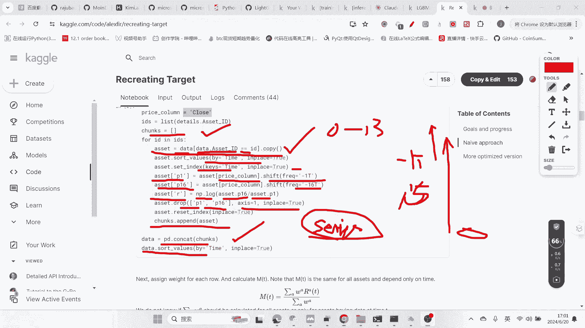

这个做完了之后呢，这是第一步求了他的这个R呃。

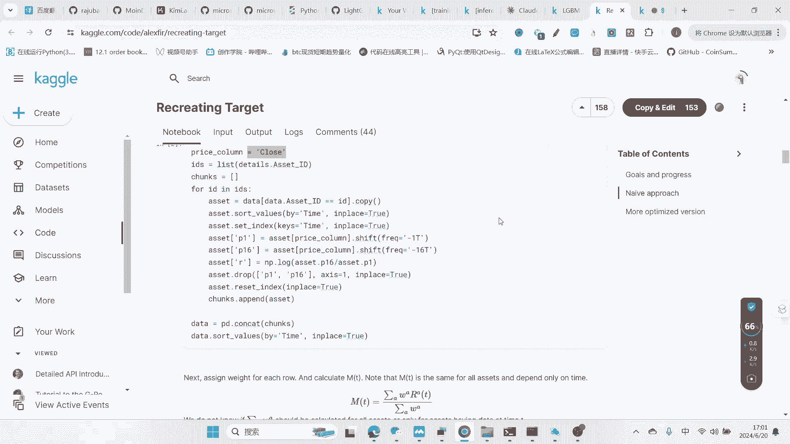

Lock liten，那么第二步要求整个市场的这个这个，它的这个这个M对吧，我们来看看他是怎么求这个这个M呢，那首先呢第一个呢，它是要把它的每一个资产的权重给读出来之后，读出来。

这首先第一步他就用那个这个用那个映射啊，把每一个data的SSAD，把它的SSAT对应的WEIT的拿出来了，这第一步就是拿到拿到它的权重，第二个呢对他的这种details啊。

然后呢对他的这个权重做了一个求和对吧，做了一个权重的求和，那么这就是一个权重的求和，那么权重的求和你可以看到是不是，就是这这下面这个东西，OK那我们再再往下看，那么他还做了一个什么，就是data的W。

它的data下的这个W，也就是说这个是每个权重的东西，求于它每个权重的回报，那可以看到好像就是上面的这个WA，乘以IA对吧，然后呢可能呢这后面就少了一个西格玛而已，然后呢你看见没有，马上就来了。

拿马马上就来了，这个M等于什么，M是不是等于它的这个这个wait的这个，这个东西，那么他没有刚才讲的啊，他没有做西干嘛，那么现在就做了一个sum的这个东西，再除以这个tom杠group下的这个这个W啊。

那么W点上，那么其实就是就把这个mt其实就是求完了，这个里面的其实就是这个就把这个mt求完了。

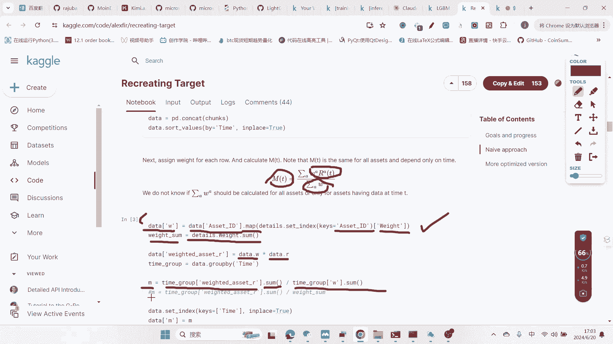

OK那么mt求完了之后呢，然后呢啊这个后面的做了一些其他的处理啊，就是把它给复制到data大于M等于M，把它赋值赋值里面到里面去了，OK那么我们这个就知道这个求完了之后，然后呢就求他的贝塔这个这个东西。

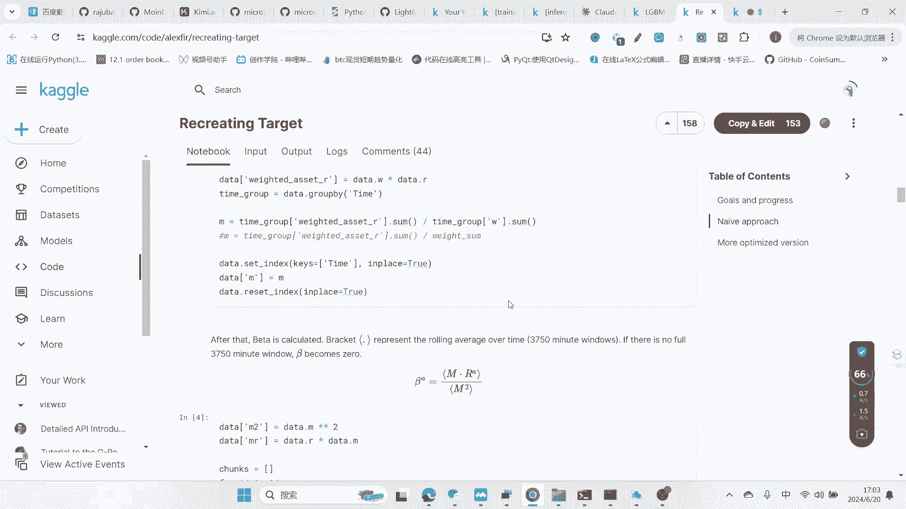

那么贝塔的这个东西的话我们去看看啊，因为我们这个有的东西已经求求出来了，这个贝塔的这个后面的下面的这个M的平方，也就是DA的M是星星二啊，那么这个就是把下面的求完了。

那么上面的有个是呃一个R跟M之间的乘积，DR乘以DM也有了，但它有一个逗号，这个逗号它要loading3750，对不对，那把他的MMR要求loading一下啊，那我们来看看它其实又又又做了一个。

就是chunks，然后for i d i d啊，然后呢其实就是0~13个资产吧对吧，已经14个资产也就data ss da i d0copy一样的啊，故技重施再来一遍啊，然后把这个这个里面的ch。

然后呢把它的进行loading一下啊，那么它是什么，你看把MR去loading一下，loading到什么3750，这个这个这个命点命啊，把那个均值给给给给拿到啊，第二个是M2，M2是什么。

M2的话也去loading一下M2，我们可以看到M2杠loading是等于这个值，这个是上面求到的这个这个这这一块的值，这个M2就是DM星星二，这个是M2，去LOING一下啊，点命。

然后呢这个里面呢一样的把它给包包裹起来，然后呢诶这个debug我不是很清楚啊，他这个这个来了个debug等于一，是不是这个这个里面呢会有那个吗，会有零吗，不是特别清楚，这个这个不然的话这个如果有零的话。

或者是只会成成这种这种NAN的这个值的，这个情况，那么这就是把它的整个的啊，这个这个这个去做了3750的，这个这个这个整个的一个loading的一个，我们知道他就是给的题干。

就是这个这个啊代表loading，那下面也就是要loading的啊，因为你这个下面有个括号，所以M2要进行loading，MR就上面这个M乘以RA括号，然后进行low3750，然后呢。

最后的话他两个人这个这个要进行这个这个，这要要进行这个这个对吧，ss append要把它喷的一直在一起对吧，然后呢在最后的话用你用用这个啊，就是贝塔的值就求出来了。

是M2rolling mr2loading，就是上面这个值除以这个MR2loading，就这个值整个就求完了啊。

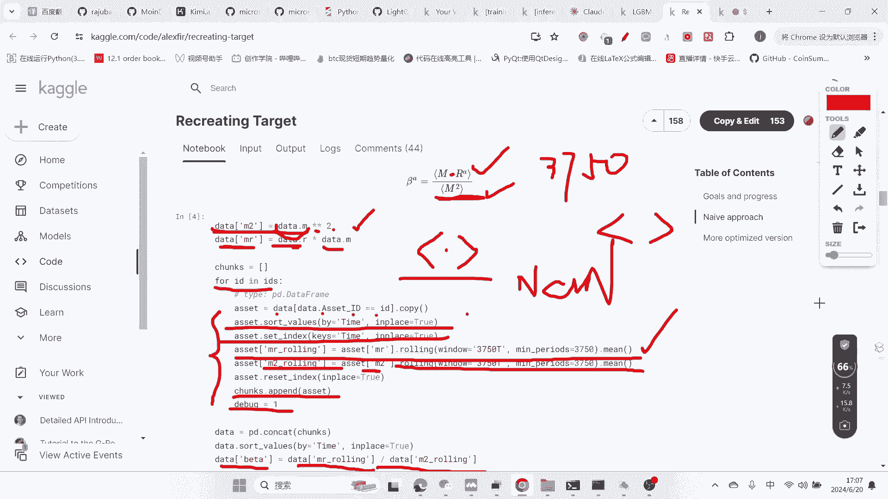

所以说这个里面的就把贝塔这个值求完了，贝塔的话你看见没有，再还要乘它的mt啊，那么贝塔也有了，RA也有了啊，第一步就求了这个15度的log，那么R也有了这个这个贝塔也有了，再乘以DADM。

那么整个的这个东西就求完了啊。

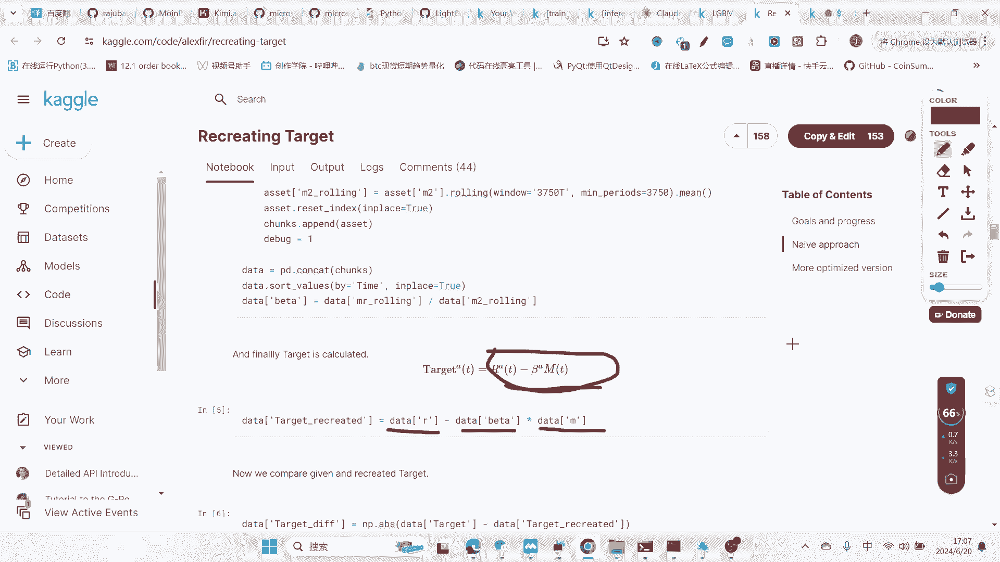

所以说这个这个都要很清楚，知道这个这个目标的targeting。

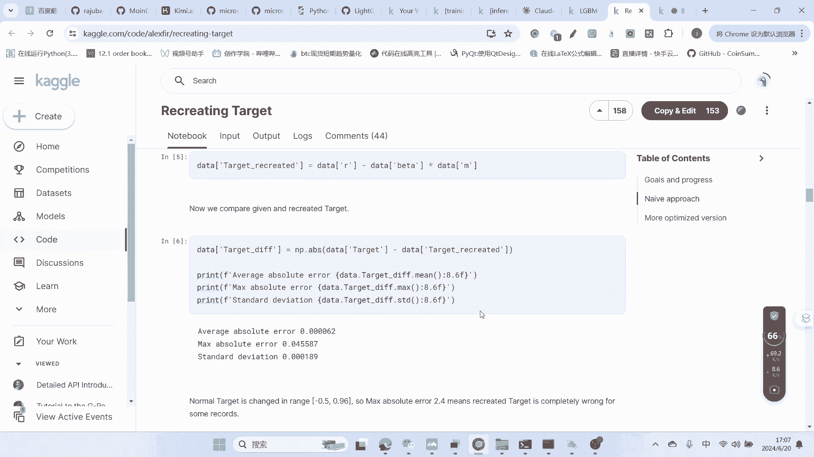

他是怎么样去拿来的啊，OK那么整个下来的话。

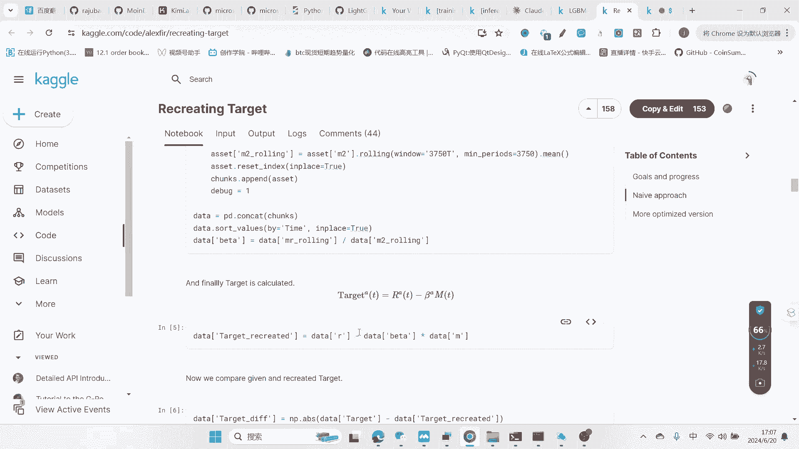

后面的话就没什么好讲的了对吧，这个这个他给的地府啊什么什么的。

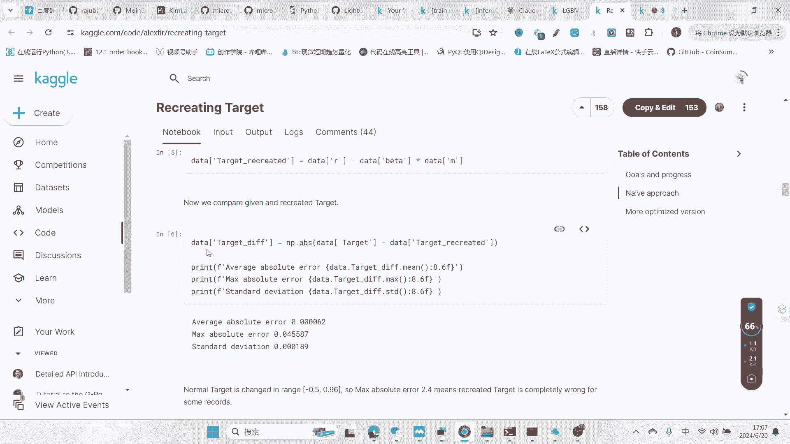

然后呢就可以看到他为什么要这样做啊，就是这个里面呢好像会提高它的这个整体的。

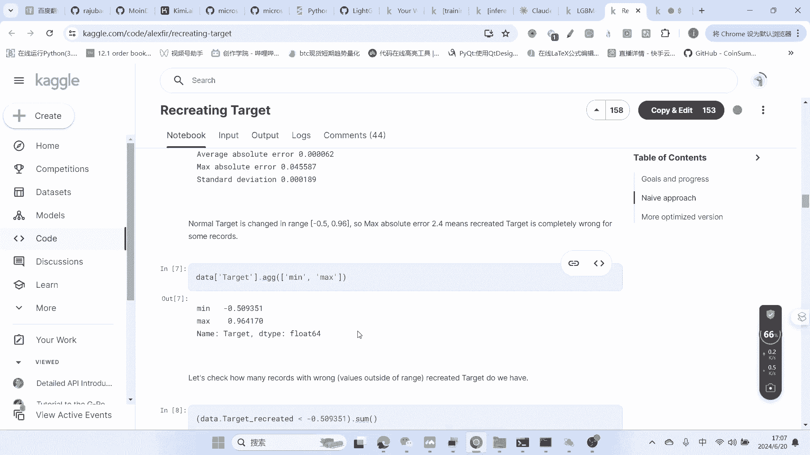

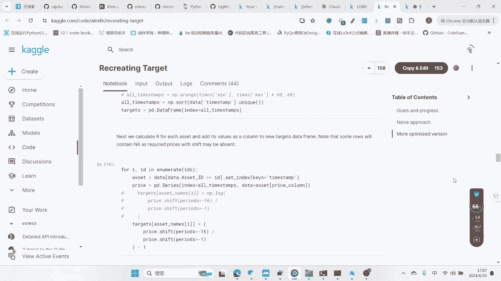

这个预测的呃，这个L就是就是整个的预测的。

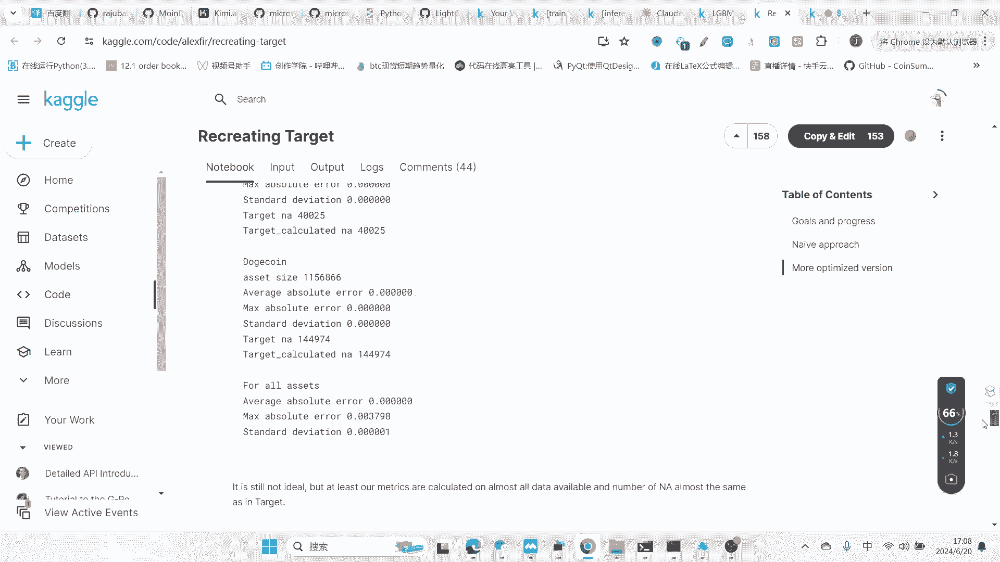

就是目标只会越来越小啊，也就是说这个错误越来越小。

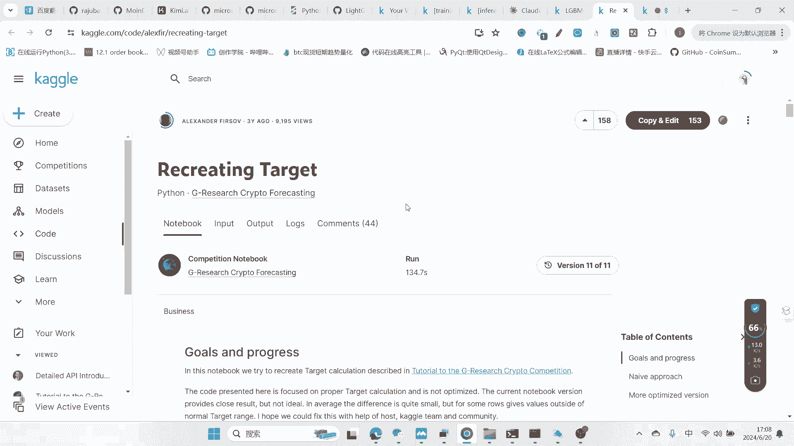

可以看到它是怎么样去提高的，呃这样的一个方法。

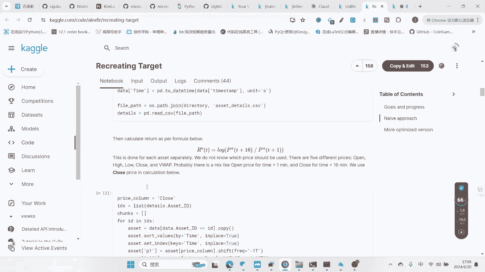

那么他就把这个这个目标值，预测值怎么样逼近的。

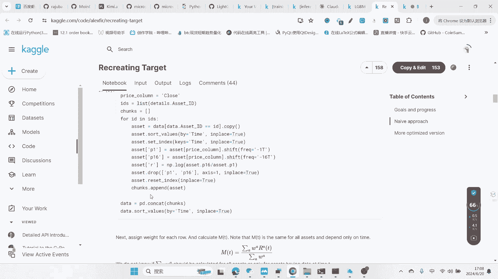

就是减少那个什么减少错误的，大概是这样的。

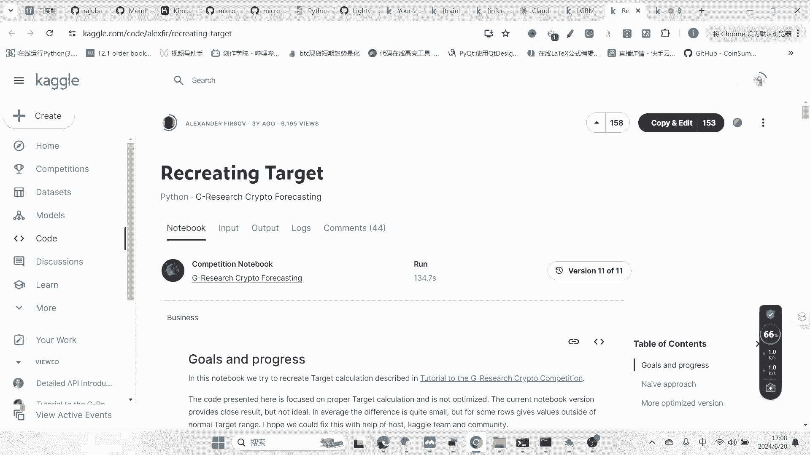