# MLRUN一个量化交易的机器学习平台的介绍 - P1 - 弯曲的时间 - BV16x4y1t7tR

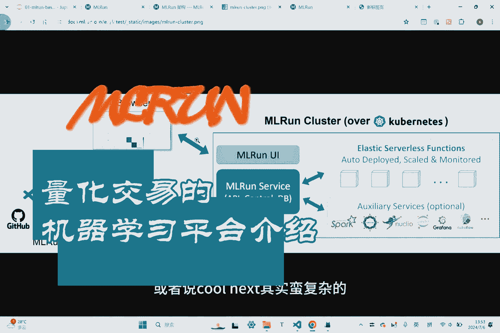

各位大家好，今天呃2024年7月6日，已经已经有几个月没有跟呃，大家一起分享一些所见所得的一些知识，经过几个月的时间，最近我在呃机器学习这个方面有一些收获，所以今天就做一个呃工具类的分享。

就是呃电脑桌面上我们今天要分享的内容，M l run，M l wrong，嗯是，是一个开放的AI的一个编排平台，是一个生命周期内快速构建和管理的，一个机器学习的平台工具，从数据模型训练啊，懂不懂啊。

都有全方位的一个管理的过程，减少了我们为了机器学习的训练，需要做的非常多的工作，并且呢这个工具可以在本地的计算机啊，也可以在云上额使用，最最重要的是，它是一个开源的工具。

那么我们就呃看一下啊他的一个架构，我们看一下架构，我们通过架构呢呃看一下它的设计思路，那么M2run呢最初呢是一个社区工作，实际上就是一个开源的工作，它是将呃机器学习项目生命周期中的不同组件。

然后呃上下的耦合，并且形成一个自动化的操作过程，嗯嗯最近这段时间我也在试用，虽然没有那么传手啊，或者说是一个刚刚的开始，这也是我最近一直在研究这个方面的一些认识，我个人觉得除了这一款工具之外。

其他的工具都不太容易得到一个好的体验，包括m l flow，啊前面就是做了一些相应的介绍，他是一个无服务函数的技术，前面我们就略过，那么他在正面重点说了一些内容。

他说他的服务呢是在cop nets上运行的，当然也可以用docker部署，不过它天然的是跟cube ex是相融合的，客户端的话是可以安装在开发环境当中的，然后可以用Rest API调用它的整个的壶呢。

架构图呢大概是这个样子，我们可以放大看一看。

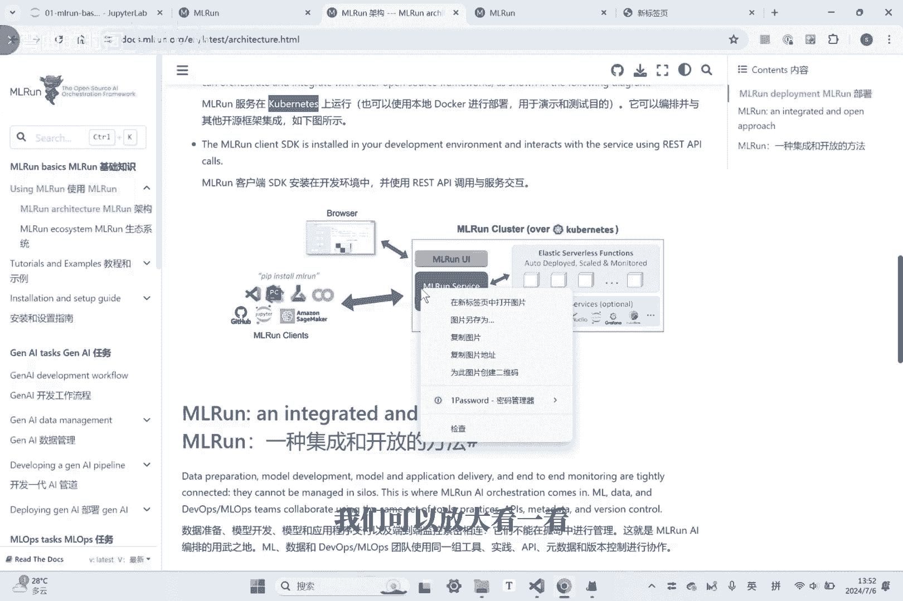

它右边是一个服务性质，就是通过service a p a啊，Control d b，然后它的下游呢是像spark nuclear，Graphruby flu juper，还有它的弹性微服务函数。

自动部署，自动扩容和自动监控，按他的基础呢是在这个COBI以上搭建的，左侧的话它可以用啊，浏览器也可以用vs code啊，开charm，然后GITHUB和JUPITER这些和工具来使用。

当然我们一看到他是部署在cop net上的时候，就会有些担心，那我自己的电脑可能没有cube nice，或者说库be nice，其实蛮复杂的，对于初学者来讲，个别的有压力，会有一些困难。

这也是前期一段时间在尝试这一块的。

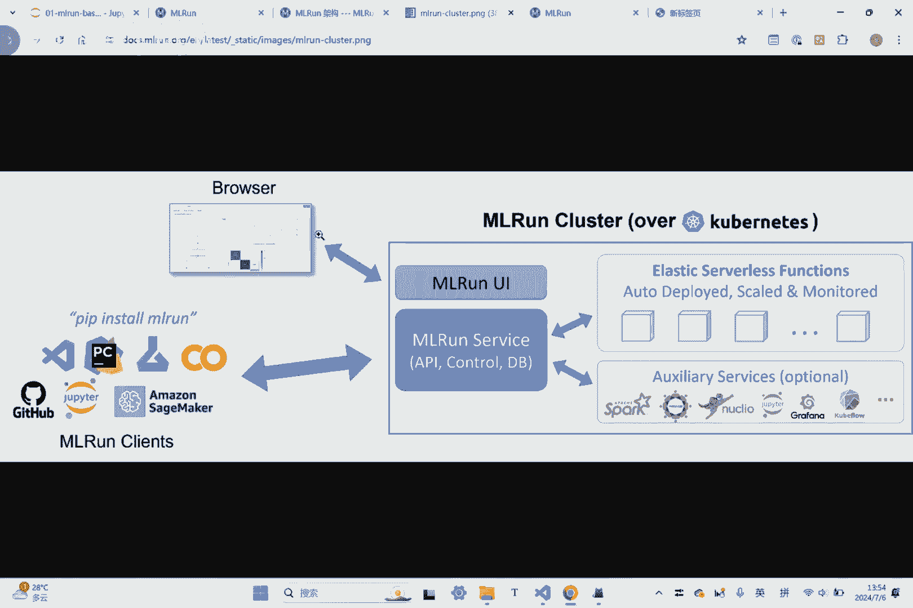

所花的时间方面上最多的，那么再往下看的话，它其实是一种集成的方法，把相关的一些内容把它集成进来，额大概是这样，然后下一趴呢就是介绍一下它的生态中泰，他的数据源呢呃会包含object文件。

还有我们熟知的pandas，还有spark，当然还有呃国外比较流行的，比如说谷歌的，还有sniff flakes，It breaks，当然还有一些数据库叫REDIS，还有v three IO。

这个这是这个m l run，就是这家公司生产的，天然的支持自己的这个服务嗯，除了支持数据源之外，它也支持事件的来源，比如说HT TP run，还有卡不卡哎呀，也支持自己的呃。

那么执行框架呢它支持nuclear，Spark mask，还有HARO，还有库巴斯job，开发环境呢就刚才也说了，支持pd charm vs code devier，Colab。

机器学习的框架呢支持at pin，R g b l g b m tensorflow，KERAS还是torch啊，VNX平台的话支持啊，Coinese role，但是他这里边比如说这个本地的话。

就是用docker去装一个cos的引擎，当然它原生也支持docker linux，英伟达也支持CRCDJENKINS啊，Github actions，还有GITHUBCRCD啊，这是一个基本的介绍。

因为本期呢我主要是介绍他的额使用的过程啊，具体安装的过程我啊这一期就不做具体的介绍，有兴趣的话，大家可以啊，在这个网站上去找它的安装的方法嗯，他这个里面也做了一些内容的介绍，当然也包括。

定义啊下面的一些一些操作，然后我们继续往下看一下啊，OK这是它的整个的安装的过程，然后下面是一些内容的介绍，我稍后我给大家来演示一下嗯，当然他因为大模型的一些原因啊，他也天然的最近做了一些迭代。

去支持大模型的一些内容，这个也不是作为我们本期的重点，然后也介绍了在docker下面的一个安装过程嗯，也非常简单，就是你下载下来这一个compose的一个文件，然后按照他这个命令执行就好了啊。

它这里面安装了几个组件，初始化的都可以啊，他的服务m l run杠API，还有他的UI，还有尤克里尔微服务，大概就这些加上一个网络环境，提前设置一下他的IP地址，然后特别说明的时候。

不要用local host或者是127。0。0。1，这样的话就创建了三个服务，一个是8080，一个是8060，一个是API，一个是UI，还有一个叫dashboard，8070。

如果你想装一个主配件就方便去开发的话，那你就用这一套方法，还额外就加了一个主配件啊，然后安装方法也是一样的，用DODOCKERCOMPUTS来去安装，那么就会产生四个服务，Oppeter api ui。

还有DETABLE，OK那我们今天就是，我假设我们是已经安装完成的情况下，天然的是会有一个TUTORIOUS，就是一个样例，今天打开啊，这个也能看到是我本地的电脑啊，Local host。

那么我们这边这是它需要呃一些呃，circling和NI的一个具体的版本，这个我已经安装好了，安装好了之后呢，首先import是吧，最基础的，然后他这边，然后明确的就是需要创建一个project项目。

或者叫工程，你可以给他随便起一个名字叫贝克特ORIA，用这一个工程，这是第一步，就是，先创建一个工程，创建完工程之后，它这里就显示了project loaded，Successfully。

Project name，Fake torial，创建完成之后呢，我们需要编辑自己的function code函数代码呃，这个代码呢看起来非常简单，第一行是把下面的这些代码。

然后转成本地的data parade pi的一个文件，下面呢就是一个传统的机器学习的代码啊，这个就不详加赘述了，就是import pandas，然后包括增加了一个额circle line的一个数据库。

包括导入m l run，这里面加了一个句柄啊，这个句柄的意思是他要对这个数据做一下处理，定义叫DATASET，他的标签呢叫label ko，下面就是非常简单的，就是引入了这个肺癌的数据，然后用PK读入。

读入完了之后啊，然后做一个返回，就是label这个数据，然后以句柄的形式，然后屯起来，你会发现呢多的两个数据呢，就是这两行，其他的实际上都是与传统的机器学习的方法，都是一样的，编写完代码之后呢。

然后我们去运行它叫set function，这里面这是第一行呢，就是他已经上面的这个代码存到本地的，就是这几个来给大家看一下，就是这样，跟刚才那个代码一模一样，它其实是为了方便写法。

第二个呢就是这个在这个工程上上面的，这个节点的名字叫data a break，换一个就是做了一个job，image是m i wrong，M i wrong，这一个呢其实是一个呃。

你如果用的是docker的话，它实际上会给你起一个docker的镜像，你如果是open ex的话，他会给你起一个cube ex的boss，这是句柄，然后保存，其实这就是一个配置文件，形成了这个工程。

然后下面呢就是去执行，不行，Run function，run function的话，那么实际上就是project run function，名字叫data prey local，本地。

如果是本地执行的话，那我们就可以运行一下它，可以运行完了，大家就会发现他在调用8080这个服务，然后执行的UID名字，然后他的UID咱们可以点开看一下，你来看一下它的工程。

就是quick turtle sreal的这个看一下，OK就是这个这个名字，Data apprebreast generate，就是数据产生，进来了之后我们发现它的内容非常丰富，包括它的启动时间。

更新时间，U i d，还有它的函数，他的tag啊，function的tag，结果就是刚才这个我们的代码里面写的label库，label finder是local owner，就是我的名字boost。

这是我服务器的名字，它都会做一些标记啊，然后数据的话会输出到这个里面对，因为他是从云端的话，所以他是没有直接的数据，但它会有一些文件，文件的话，我们看一下哈一张这是他的文件是吧，他是以pk的形式存储的。

点开它大家就能看到这个文件的形式，OK然后大小，然后这是路径对吧，这个是展示细节，但是细节的时候它就会跳到这个DATASETS里面，会有一些详细的信息review对吧，就是刚才的这一个原数据。

其实就是它的对于各个字段的统计，还有分析分析，不过是没有哈，OK结果结果就是打了他做了一个标签啊，日志日志是没有的，也大概是这个样子，就是我们把这个数据啊处理好了，这只是机器学习的第一步啊。

处理完了之后呢，我们非常直观的，可以看到自己的数据长什么样子，然后基本的分析，而这些工作呢实际上都不是我们自己处理的，而是这个平台本身的能力，我们无需做这些任何的工作，包括可视化，包括分析等等。

这些都不需要啊，包括版本的管理，数据版本的管理，OK我们继续往下啊，然后你如果想查看一下他的状态的话，那么你就写state执行一下，OK也写着就是completed，就是完成了。

如果你的呃任务一直在跑的话，那么这个地方它可能就会写running，当然你也可以通过SDK的形式做输出啊，它的label对吧，reset是传到这里面去了，然后如果你想在主BER想展示的话。

你也可以去调用它的artifact，就刚才我们展示的artifact，然后把它转换成那个呃pandas的一个格式，然后你可以输出个五行，它的内容就跟刚才我们看到的内容是一样的，OK这是第一步。

第二步呢呃我们可以看到我们要进行机器学习，那么它这个里面它是有一个生态的内容啊，啊他说ml run呢提供了一个叫function hub。

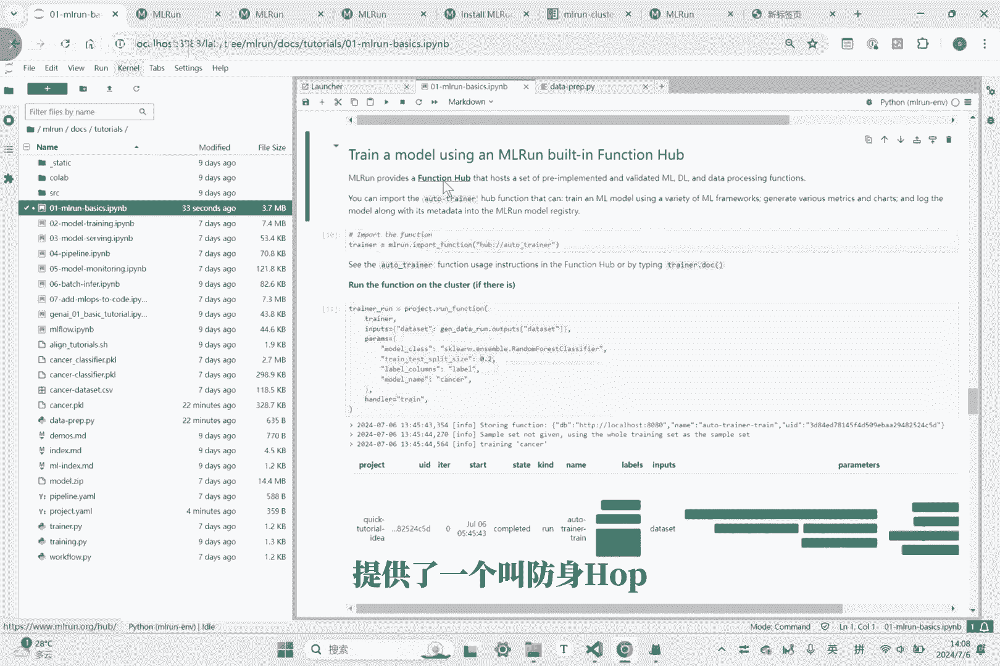

各种各样的。

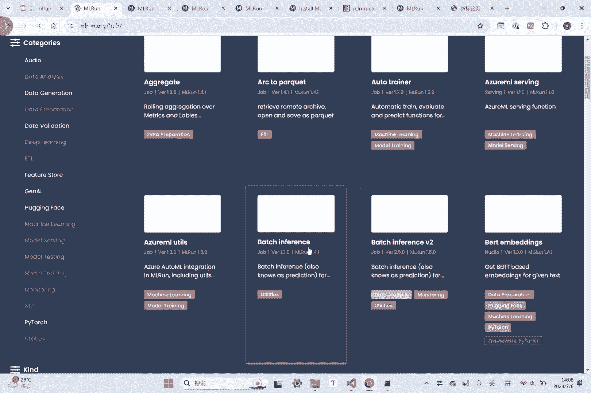

模型啊，训练啊等等，这些内容都有你比如说你想研究一下啊，机器学习，你可以选一下machine learning。

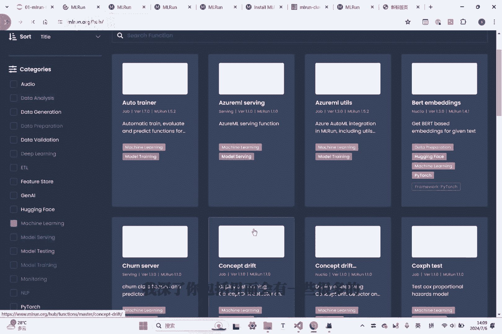

包括里面会有一些很多的这样的模型。

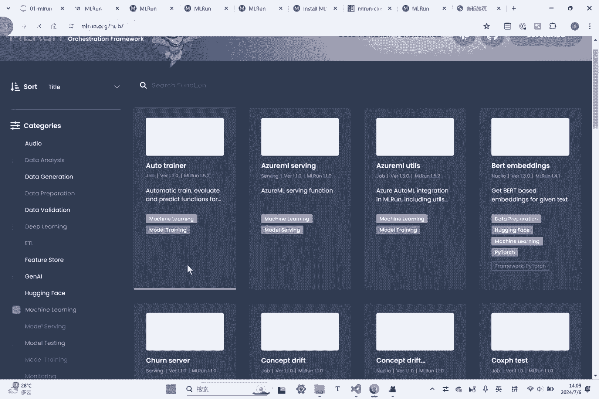

呃那么我们要导入叫auto trainer的东西。

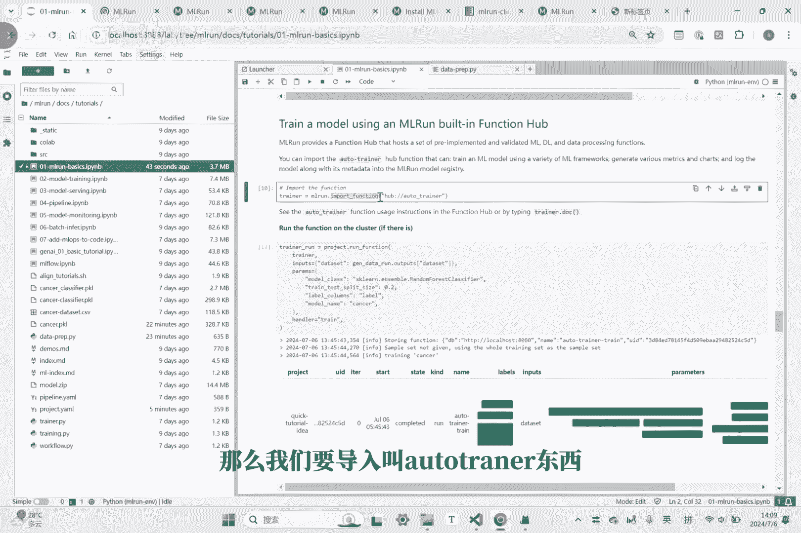

实际上就是这一个对吧好的。

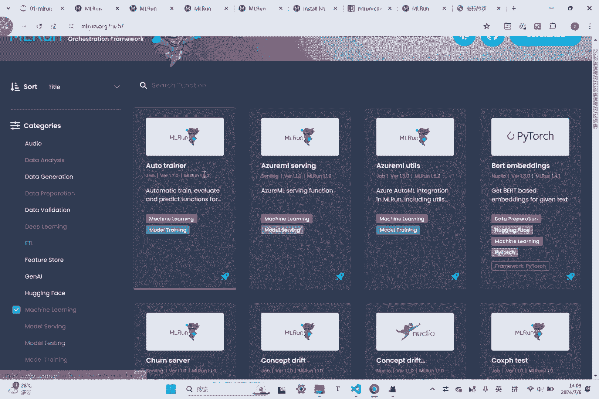

现在我们打开看一下它这个里面是个什么内容，这就是他的文档，auto trainer实际上是一个自动训练的一个函数，然后他有一个案例，自动化机器学习的训练的一个函数包，如trainer的例子。

用的是CIPLINE随机森林分布的对吧。

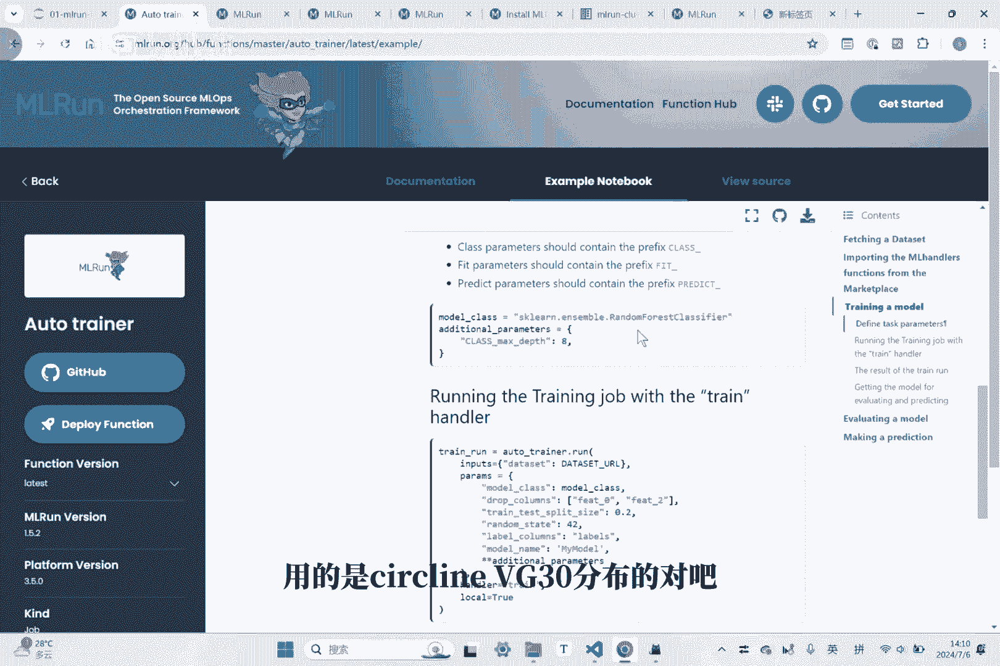

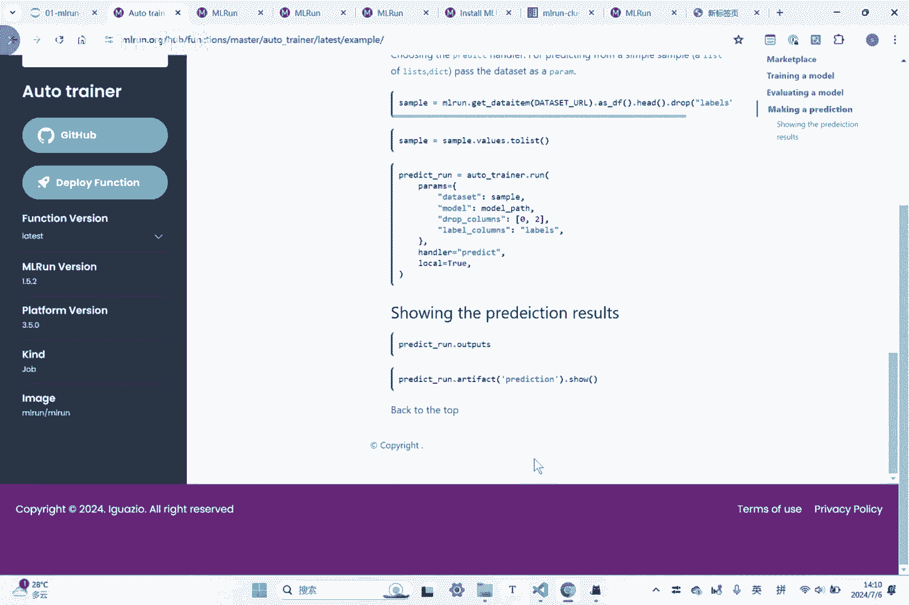

也是左键即所得，然后他的开源的代码左边它会有一个GITHUB。

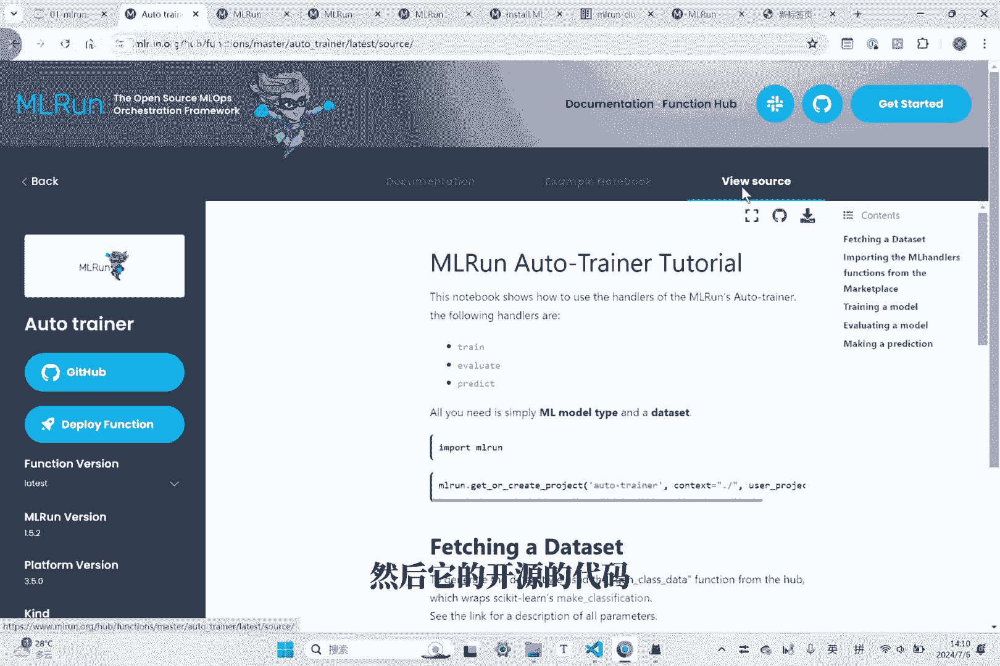

我们可以跳过来。

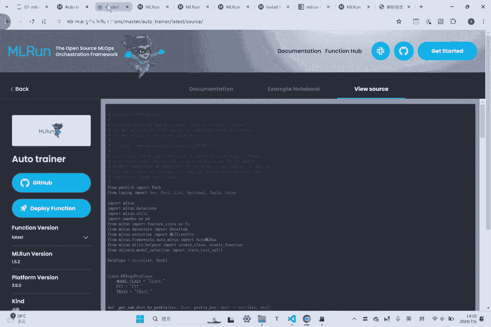

但在GITHUB上它实际上也会呃详细的说明，auto trainer它也在不断的迭代和更新，现在是1。7。0的版本啊，OK那我们把它加载进来，就是import一下，其实就是。

然后嘞我们就去做run做训练，这是trainer，我们的数据就是刚才我们处理的那个数据，data set的数据，这个模型的训练的参数，我们把它配好，训练集和测试集的比例，0。

2标签label模型的名字是pencil，聚丙chain，然后我们执行，又开始训练，OK训练完成，它会有一个UID，我们打开它，那这里面就有一个叫auto train train。

auto train a train的一个训练的，结果开始时间用了六秒钟对吧，最近更新时间11。31062点啊，36啊，然后参数给你标识出来函数用的是什么函数，结果准确率F1值啊，精确率，召回率。

源头自动化的给你搞掉输入，现在有输入了，因为它的输入是数据嘛，输入的数据，展示细节啊，哦往后看一下，然后这是他的附件，我反产生了大量的附件，有一个是calibration的曲线，你再看哈。

OKALLIBERATION的曲线，混淆矩阵，每个特征的重要性，也就是传统机器学习的评估的结果，为了证明也有比较好的呈现，其实这个里面它我们要重点看一下，实际上他的这个auto trainer的函数。

那题其实在这里面就比较好的已经写出来了，写入之后我们就用了这个函数来去使用，结合完了之后的结果，就会在这个里面做一些无线啊，结果刚才我们看到的。

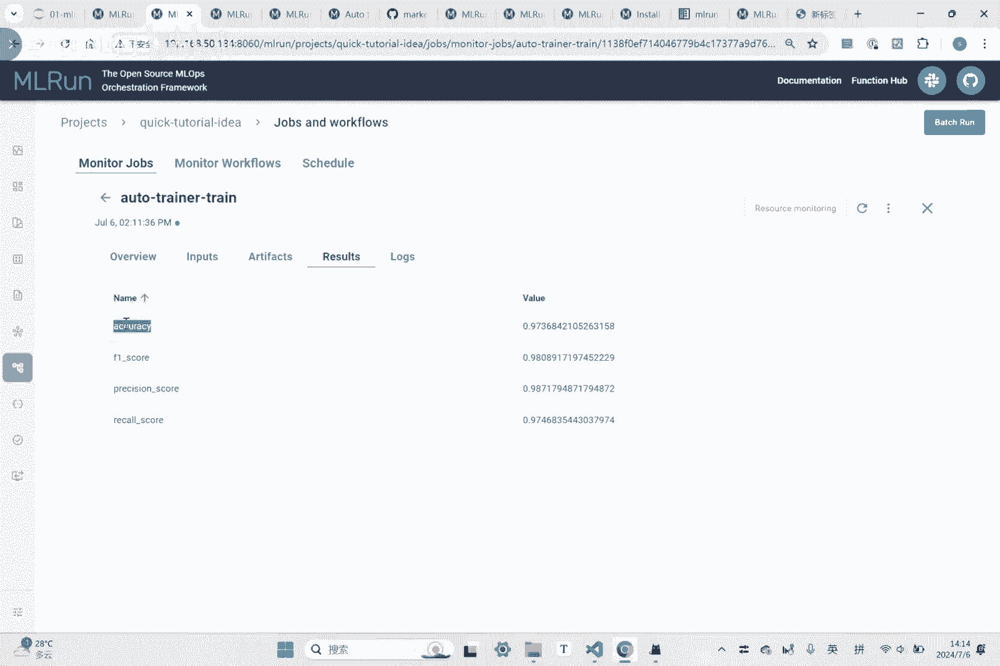

日志这有个日志啊。

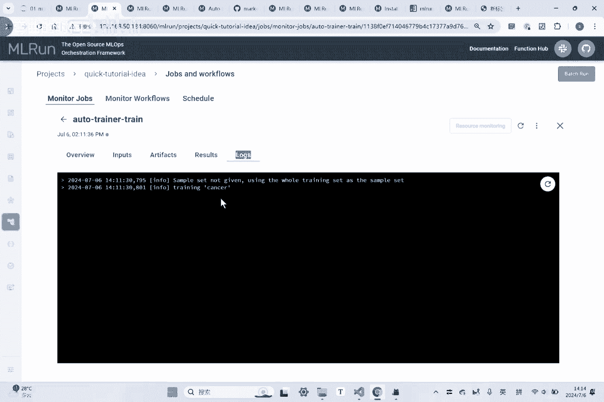

这是我们跑完了一个训练结果，这是他做了一个相应的展示，如果我们不想看这个UI的话，那我们可以打印out of boost，结果跟我们刚才的结果是一样的，测试集混淆矩阵，你会把它都存起来。

然后我这里写的是存到了本地，然后你想展示混淆矩阵，那你在储备这里也可以做展示，下面这一个呢是部署，就是我们读了数据，做完了机器学习的训练，用完了之后呢，我们想部署一个函数，一个API，我们用来预测。

那么它还提供这个部署的，可以啊，新店建了一个函数，然后就增加了这个模型，我们训练的模型，然后去做啊，验证性的服务部署也可以，我们自己配置一个API，然后去做部署，然后我们去看8080的一个服务的命令。

大概是这样，这就是它最基本最简单的操作，另外呢我们也看一看他的呃，模型训练的部分跟前面的过程是一样的导入，然后定义一个工程，跟刚才是一样，然后第二个呢就是呃填写我们的自己。

本地的处理数据的代码那种本地的文件，本地的文件名称叫trainer，叫pen tl pen，就这一个我们可以看一下，大概是这样嗯，china的pad呢嗯内容呢也比较简单，就是我们把数据输入，然后训练。

就是然后到fit传统的机器学习的方法来去使用，唯一需要的就是增加这一行应用到m l run，其实MLR是一个什么呢，我理解它有一个非常大的功能，就是呃做记录，把你中间过程产生的结果。

中间的参数数据等等都给你记录下来，你就唯一能加的就是加这一行数字，然后你设置这个工程，设置这个函数叫什么china job啊，然后我们去去什么呢，创建一个训练的数据集，保存名字，保存了一个CSV。

OK我们就开始跑这个训练，它的输入是这个CSV，实际上就是你本地的CSV嘛，我们可以看看一下我们本地啊，这就是我们存到本地的一个CSV参数啊，多少步学习率最大深度本地运行。

这个呢就是意思我们要为了啊训练，我们设定它的目标，然后他就执行之后就开始训练，训练会有一个结果，训练完成的结果，然后他就outputs，然后它的重要性。

然后它模型你可以输出分成the model deep的一个文件，这一个对吧，然后下面就是叫超参数，hyper parameter的tune啊，然后就是调参嘛，我们这里。

用的数据呢就是用这个cancel it set，这个里面我们要调参，这里包括他的数据，超参数学习率呢是-1~-3，最大深度是2~8的，好运行，这个时候他就是为了寻找它的超参，那会多次运行啊。

我们就它在运行的过程中，我们就可以看到它这个里面的应该是这个吧，这一个，然后看一下，要china对吧，应该是这，状态时running还在运行过程当中，模型是五个模型，还没跑完呢，等他一下，是吧。

还在运行过程中，哎呀它设计设置的工程是哪一个，是turtle对吧，额头，OK跑完了跑完了，我们看一下，Turtle，Turtle idea，应该是这个啊，哎状态结束了，啊10~100学习率0。1到0。

001，深度是2。8对，就是这一个，然后他的最大的inte integration，准确率F1，精确率和召回率输入就是这个输入目录啊，我们可以看一下，在这里打开，我们看一下啊，他是训练了12次准确率。

你如果想看F1，然后看precision每一个的变化对吧，他的学习率从0。001到我放大看哈，对然后整个的变化最好的结果是什么，最大深度是什么，然后precision，record对，然后看它的结果。

训练了12次，每一个结果都非常详细，它的准确率，你选一个最好的，HILIBERATION曲线，混淆矩阵，重要性，然后你刚才跟刚才一样，你要输出，然后你想展示你训练的模型，训练的你的12个模型啊。

然后你想打印这个比较的结果，在主BER里边都有非常好的这个呈现，然后你想选择一个模型，然后来部署，这是就是一个相对完整的一个过程，我们看第三个就是呃，传统机器学习模型和深度模型的一个里面。

也是你要TUTORIA对吧，用这些方法circling torflow，然后他这个还是用的的circling，然后你可以去log log一下这个模型，然后你去部署它，然后你去做mock。

啊这个是pipeline端到端嘛，也是在这个里面先导入，解模型搞数据，然后是设置模型，设置工程，然后保存，保存完了之后呢，用git呀或者用什么的，然后你load一下，保存完了你可以load。

然后你写一个workflow的一个，唯一的就是增加了这一行对吧，创建了一个grp floor pipeline cobi斯，在云原生的一个机器学习的一个工具，或者叫平台啊，玩个flow，然后运行它。

还在运行对吧，OK运行完成了呃，我们看一下哈，就是这个o two是这个吧，26对，这是它的数据，从采用的数据，我看一下，然后我们看一下它的，训练，它的准确率啊，F1啊，精确率啊，召回率啊等等。

用的workflow对吧，我好像打不开，OK然后我们再往下的话，是我做了一个相应的展示啊，就是modify workflow，我这个应该是打不开，等一下，应该是打不开。

这个可能有一个连COBANIZE有一点点问题，这是他做了一个PAPIM，下面就没啥了，然后这一个是模型监控的呃，前面也是引入这些啊，然后定义了一个函数，一个工程，这个就是轻车熟路的。

然后这个是设定启用啊，模型的监控，这个我应该是会报错啊，没有找到，应该是没有找到库斯这个，那这一个呢就是批批处理的这一个，这个是导入这个工程是吧，这是得到一些相应的数据，然后这个是读pocket的数据。

按一下啊，OK这个是他的预测的数据，再一个呢是记录这个模型，然后circling读它对吧，它的URL在哪里，那我这些都存到本地啊，其实你可以呃，我们建建设一个mini。

有一个用object或者是用阿里云的OSSS都可以，然后这一个就跟刚才描述的一上一样，在他的一个超市里面去把这一个下载下来，然后我们把它运行这个网上有报错啊，应该是呃有报错，应该是有一个异常。

没有找到这一个，应该他应该是取消了，这是S3的一个一个模型，叫猫到零，然后这个版本号好像有问题，我我本地的代码，这个地方有点有点点问题，他应该是没有这个文件，然后，哦对这一个这个可能有一点点问题。

然后下面就是这个MLOPS，然后是创建，然后这个里面是这个没啥用啊，这一个这一个呢说是呃有这个东西没注册，他这个是掉了什么呢，掉了理论上他应该不报错，但这地方可能有点问题，他这个是用那个。

docker来去执行，但是说是没有设置额docker的这个环境变量，如果把它设置了，反正也报错，没有输出对吧，设置也没有用，这地方还是有有一点点报错，然后这个是用MLFLUBREAKER安装XDB呀。

先安装一下，然后，因为我刚才评价说他跟m l flow，他的能力要远远强于MLFMFU，可能就相对比较简单啊，就是一个模型训练模型的一个跟踪器吧，然后就是开启这个跟踪的，然后是创建，然后是运行。

运行这个可能是暴徒啊，没有报名，这就是执行了差距毕，哦这是跑完了，我们看一下啊，这个是他的建的工程是MLFU是吧，所以可以用一个帐篷，我们看一下，啊这个对吧，我看一下它的参数，一目了然啊，准确率啊。

Loss，然后他的输入输入应该是从云上过来的，然后他的附件不建的话，有几个参数F0F1，然后是这一个，这是重要性啊，然后是它的模型，模型应该是有一个报错啊。

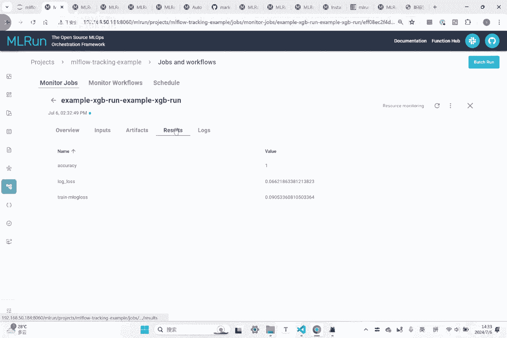

结果对吧，都有打印。

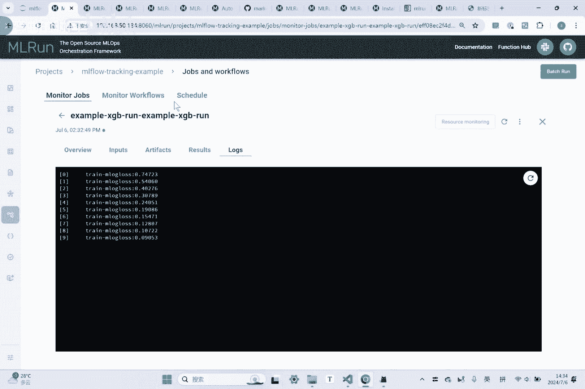

然后就是不出我就不打了啊，然后是结果，就刚才说的这个结果好，下面这个是把这一个呢load进来，然后去做一个预测性的函数呃，我们跑一下不一定能跑得通网游戏，增加这个模型mock啊，这就是个mock了一下。

然后是部署了一个API啊，然后他的结果，大概是这样好了，今天因为时间的关系，我们就简单的介绍一下这个平台，我介绍这个平台的一个很重要的原因呢，就是说他对于机器学习来讲，真的是一个蛮重要的一个方法论啊。

比较好的一个这个可以我们快速去啊训练，我们不会受到其他的问题的干扰，然后一心一意的去做模型的训练就好了，然后我们也可以用这个和QD部，来进行一个相应的融合嗯，去打造我们量化交易平台的一个。

基础的一个版本，好今天就到这里，下一次再见吧。

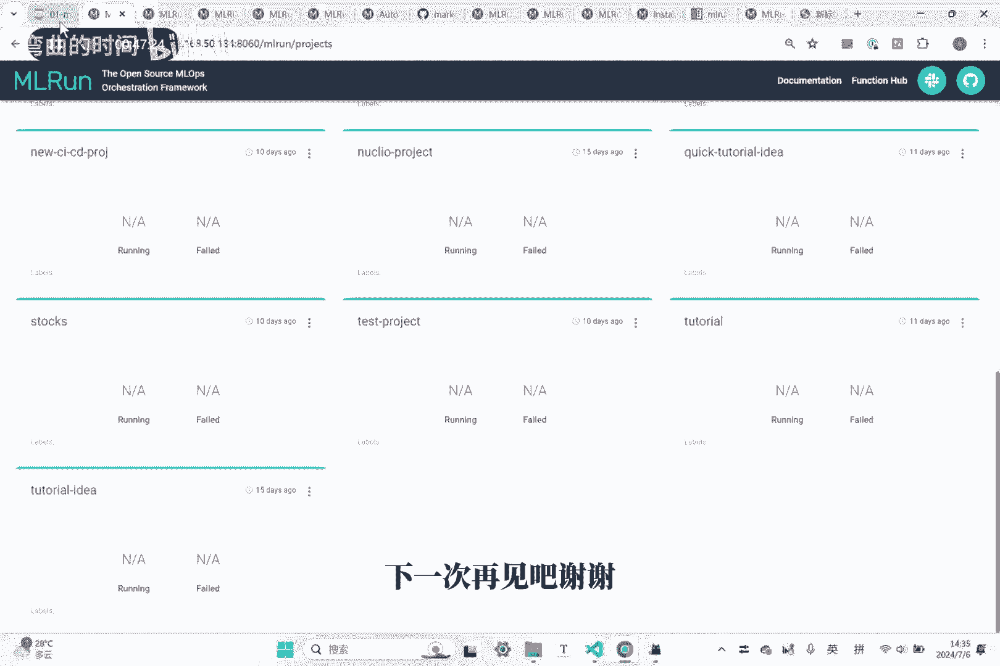