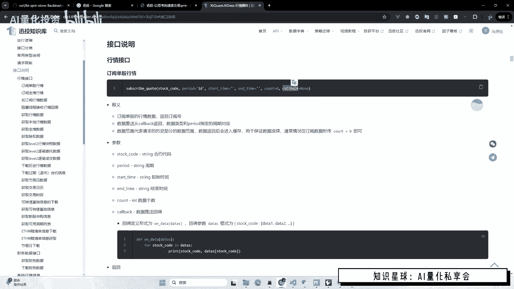
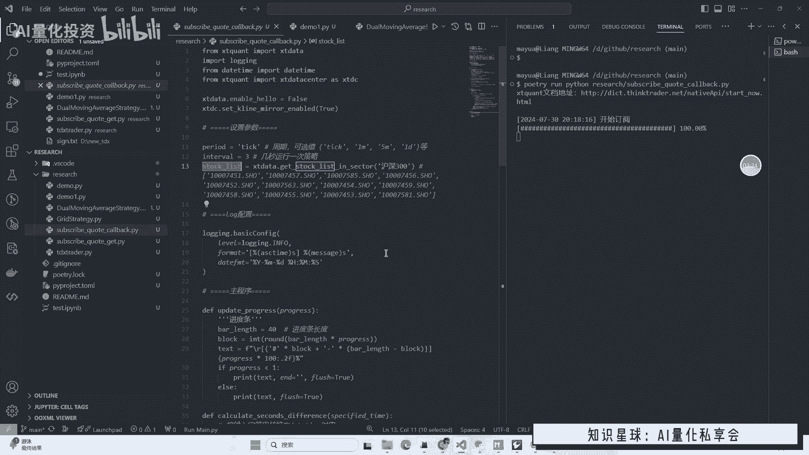
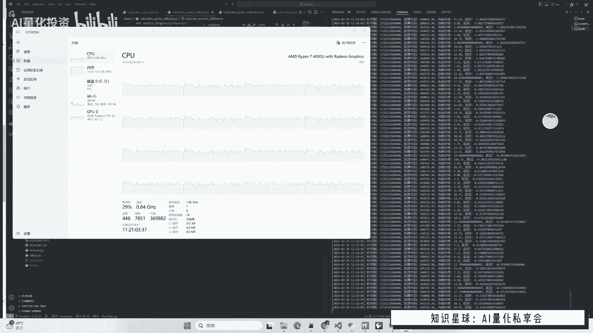
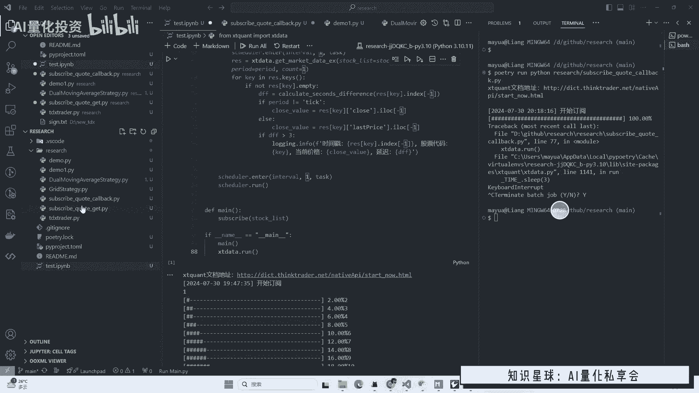
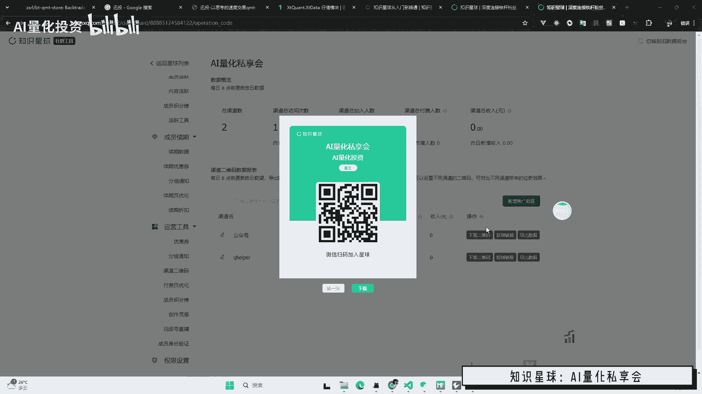

# MiniQMT如何优雅的订阅多股实时数据？（内含数据延迟测试） - P1：7月30日 - 量化投资技术 - BV1AJvCekEDz

大家好啊，这个视频呢介绍一下，如何用mini q mt获取实时数据，呃据我了解呢，这块也是大家问题比较多的地方啊，因为这个订阅模式啊是从编程角度实现起来呢，并没有那么简单啊，它不是一个顺序执行的代码啊。

我们需要啊相当于起一个小服务，把这些订阅呢啊一直运行在那里，然后再呃起另一个小服务，然后嗯呃去获取数据啊，大概是这样，大概是这么一个流程，或者是你基于这个呃。

呃他的这个接口里面的这个call back的函数，去获取数据啊，这两种方式啊，但这个执行起来呢嗯都单，但需要一定的编程难度，所以今天呢我写了两个小例子，给大家逐行介绍一下，并且嗯运行一下。

看一下结果啊，嗯然后这里呢我做了两个例子，一个是呢使用call back获取这个订阅的实时数据，一个是用组队轮询的方式，获取这个额实时数据啊，然后呢给大家简单的运行一下，试一下啊。

呃我们用这个命令运行一下这个call back，试一下啊，可以看到呢这里我们的QMP是启动着的，然后呢他就会开始订阅我这里呃，为了方便这个呃就看查看结果呢，我做了一个小的进度条啊。

这个进度条呢就是它目前在开始订阅，可以看到呢这个订阅是需要耗一定时间的对吧，因为这里的是这样的，我这里是为了演示独舞订阅呢，我这里写的是沪深300，也就是我现在一共定了300只股票啊，嗯这个例子呢。

也是为了给大家分享一个这个多股的啊，这样的话呢它的可用性更高对吧，嗯然后这里大概我们就完成了订阅啊，但是因为现在是这个收盘时间嘛，所以他不吐数据嗯，这里正好要说一下，就这个订阅接口呢。

嗯要是进行测试的话，必须要在开放时间进行测试，因为当收盘之后呢，这个接口就不会再从服务器请求数据了啊。

嗯但是我这里现在是收盘时间，我之前录了一个例子给大家看一下啊，啧这里的话呢，是我之前用这个脚本录的一个例子可以看到啊，他真正呃运行起来的话呢，就是这个样子啊，就会有这个数据的返回啊。

从call back里可以看到，这里我打印了一些呃信息，包括它的延时时间呢，还有他的时间戳等等啊，还可以看到呢，我这里额的CPU和带宽呢是一直在被占用的啊，呃这里呢如果你订阅的股票越多呢。

你的CPU占用率肯定就会越高，你的带宽使用率也会越高，那它它的原理其实就是在你本地启动了很多的，呃县城或者进城吧，啊然后一直在从额服务端获取数据啊，那这个获取数据的过程，就相当于额实时的下载数据嘛。

那你肯定需要带宽的啊，然后当你订阅我设置的一个最极端的情况呢，就是我订阅了沪深A股5000多只股票啊，我的电脑呢也能运行。

但运行起来呢就比较卡了啊，就比较卡了，嗯嗯大概的现象是呢，如果我放在这里呃不动啊，就是我什么其他的程序都不动啊，它还可以啊，正常的运行，但一旦比如说我在这里放个视频啊，或者是操作一下别的网页呢。

那这个是这个订阅的程序就开始卡了啊，嗯嗯就他卡完之后的现象呢，就是反馈数据会比较慢啊，然后延迟呢就会显示很多秒啊这么一个状态啊，所以呢这个呃他的结论就是什么呢，如果你要进行大量的这种订阅的时候呢。

嗯要选一个比较好的这个啊性能比较好的电脑，并且一个稳定的环境最好呢，这个电这个计算机呢不要做其他的事情啊，否则会影响这个相当于CPU的抢占嘛，对吧，你你抢占了CPU呢。

那你这个额订阅的程序呢就会呃延迟会变慢啊，这是一个这是一个最终的效果，然后给大家看一下这个代码是怎么写的啊，我简单的逐行讲解一下，上面呢就是一些包的引入啊，这上面是必要的。

这个i it date之前都说过，log呢是用来做这个日志打印的，就刚才我们所有打印的命令行，打印的东西都是用它打印出来的，然后呃这个就是一个时间处理的函数对吧，然后这个呢这个date呃。

x date center呢这个东西其实是VIP行情用的一个东西，但是我也给他写上了，因为我我现在不确定它有没有用啊，但是至少不报错，那我们就写上，如果你是VIP的话呢，他会开启这个叫K线全推啊。

会呃官方说呢它的这个性能啊，还有什么的会哎更好一点啊啊反正就写上，然后下面的是一些参数啊，这个参数呢第一个周期啊，周期的话呢是额额可以选，就是这个sk date里面那些周期啊。

就跟官呃讯投官方网站上对应的啊，玩意这里的嗯，呃这个这个参数在这个call back这个脚本里，其实是目前是没有用的，嗯然后下一个就是股票列表，可以看到我三这是300只啊，好下面呢就是呃呃配置了下日志。

然后这个呢就是刚才我的这个电阻条的打印啊，下一个呢就是计算这个呃延迟的时间，跟当前的系统时间戳呢进行一个对比，然后算一下到底是有没有延迟多少秒，正常来讲的话呢，呃如果你用call back的话呢。

就是他这个返回的时间戳呢，都会比当前的时间稍微提前一点点，也就是说你最后算下来时间差是负的啊，负的零点几秒或负的一秒啊，大概是这么一个状态是就是对的啊，啧，然后下面就是这个订阅的这个。

实实体的这个接口了，这个订阅你可以看到我刚才那个啊进度条，走进度条是因为这里做了一个for循环，然后for循环其实就是在呃先不看这个on date啊，这下面这on date其实是个回调。

是这个呃单股订阅的这个call back这个参数啊，就相当于它的意思就是什么呢，这个定位成功之后呢，呃所有的每次啊就会这个，比如说我们定义订阅了一个这个嗯，贵州茅台这个定位好了。

然后呢随着这个开盘时间的这个推移呢，呃它会tick数据就大概三秒返回一回嘛对吧，那你这个on date呢就会被三秒就会触发一次啊，那当然我这里呢是呃多股订阅，那也就是说其实是一个一个股票列表对吧。

那它每一个股票的这个on date呢，都会三秒执行一次啊，叠在一起呢就会一直在刷新这个输出，对不对，然后最后呢这个是打印这个进度条啊，进度条啊，进度条没有什么实际的意义啊。

就是为了让这个输出结果好看一点啊，然后这里呢做了一个简单的控制，就是当所有股票订都订阅完之后呢，我们再打印这个结果啊，否则我就返回啊这个on data里边呢，因为我这里没有做实际的这个相当于下单啊。

或者什么操作，我只是嗯为了测试一下时间啊，那比如说你真正实盘的时候呢，你就可以把这里换成你的这个交易代码对吧，程序化下单的代码啊啊然后得到了实时数据，然后产生你的买卖信号，其实就就能形成一个简单的对吧。

这个这个实时的这个程序化交易的这个小脚本，对吧，嗯额这个这大概就是这样，然后这里的话呢，其实就是呃这个注释的没有用了，呃就是慢，就是调了一下这个接口，然后最后呢主要说明一下。

就是这个x date run，这个是必须有的，因为我们刚才我也说了，订阅这个事呢，其实你要保证这个程序一直在运行，订阅成功之后呢，嗯你这个程序不能终终止啊，终止之后这个订阅就就不再生效了啊。

所以呢你需要阻塞这个程序，然后x date它本身内置了一个阻塞的方法，就叫就是run啊，这样的话呢，你就可以看到你的这个程序启动之后呢，它在终端命令行里是一直在运行的啊，大概就是这么一个这么一个意思啊。

啊然后这个脚本呢是有两个问题需要说明的啊，第一个呢就是这个方式跟call back的区别啊，因为我们是主动轮询的，也就是我刚才讲的三秒执行一次这个脚本，啊对吧。

那这时候呢我们是不管这个call back，到底是什么时候返回的，对吧啊，刚才那个脚本是呢11call back，只要一返回对吧，数据我就打印，那这时候呢这个时间是呃，跟呃他的获取时间是完全对应的啊。

所以你可以看到没有延迟，而且甚至延迟是负的啊，那在我们这个呃，三秒一次循环的打印的过程中呢，你就会发现它的时间如果没有延迟呢，大概是在三秒以内啊，可能是一秒，可能是两秒都有可能啊。

因为你不知道他call back是什么时间返回的，不管你什么时间返回，我都是三秒轮询一次对吧啊，然后这里也有一个问题，就是有些我们A股的一些小票啊，啊包括沪深300里面的一些一些小票啊。

他都是很可能三秒之内就是没有声调啊，就是啊比如说啊它的交易量频率很很低啊，他在这个三秒或者六秒或者九秒，它都没有成交，然后在mini q mt的逻辑里呢，嗯它的数据反馈是这样的，如果没有成交呢。

它就不会啊从服务器传回来一条新的数据，那这时候呢你就发现嗯，你的这个额本地的时间戳呢是没有更新的，那在这个轮询的这个程序中呢，你会因为我们不管你返没返回数据，我都是三秒查询所有所有的数据。

这时候呢你会发现有一些股票是延迟就变大了，比如说他十秒内都没有数据，你这个延迟时间就大于十秒了对吧，但实际上呢实际场景呢是，这个股票并没有真正的成交啊，然后导致这个时间戳不更新的啊，这是第一点啊。

第二点呢就是我们这个额获取数据，获取这个历史数据，这个函数呢它本身也是占用时间的，因为这个循环三秒一次，这个时间并不是很长啊，啊我们这个获取这个呃历史数据。

不加实时数据的这个get market date这么一个接口呢，它大概就要占大概，如果你只是获取比较少的话呢，它就会占零点几秒，如果你获取数据比较多的时候呢，比如你这个写的很多count。

等于1000或者1万等等啊，这个时候呢，你这个本身这个函数就会阻塞时间啊，当你这个东西嗯大于三秒，或者是需要几秒钟的时候呢，你这个整个的这个循环就是延迟的对吧，那也会造成你这个实验所的打印啊。

有有问题啊，所以这些东西呢我讲那些就是也可能是朋友们，你们也会遇到，就是你在做这个程序中嗯，你打印出来那个延迟时间嗯，嗯最后打印结果是延迟的，但是这个延迟的原因是什么呢。

嗯可能跟你的编写的这个程序是有关系的啊，就是我说的这两点原因嗯，然后就这个mini camp订阅这个接口的本质来讲呢，它其实就是这个每从服务器返回一条数据，然后就会触发一个call back啊。

嗯然后这个call back，这个时间戳呢其实是没有延迟的啊，没有延迟的啊，但是有时候他就是急，比如说呃五秒钟十秒钟，他这个股票都不会触发这个call back的，因为他没有新的声调啊。

嗯所以造成了这个嗯你你对比之后，你发现这个跟系统时间一对比，发现最后打印的时间是延迟的啊，有这么一个问题啊，但是从最严谨的角度呢，其实我现在只是测试了这个它返回的数据的，时间戳有没有延迟。

但是我其实没测试这个他是否有丢失的情况啊，因为我刚才说的这个嗯嗯没有实际没有成交，它不返回是正常的对吧，但这里有一个不可验证的点，就是到底有没有真正的丢失啊，这个不太好验证啊，当你大量订阅的时候啊。

这个需要更多的数据去验证了啊，有有兴趣的朋友可以自己去再去试，深入的去研究一下啊，他如果要是这个call back呃，真的丢了的话呢，那你可能就会少一条数据啊，嗯但这个呢我就是我需要我们嗯做一些预防吧。

啊因为这个其实在做量化的实际的实盘的时候，这些东西都是风险啊，你不可能虽然这个软件呢嗯他应该是稳定的诶，他他的目标肯定是它应该是越来越稳定的，但是实际情况呢就是我们不能忽略这些风险啊。

他如果真的丢数据的话，那他就是就是要去啊想到这个事情啊，所以呢这个mq amp的监听呢，其实呃呃实时数据的监听呢，建议大家尽量如果不需要那么高频率的话呢，尽量别用tick的啊。

还是用一分钟的分钟线比较好啊，然后这里再多说一句呢，就是这个其实不管你订阅分中线还是小时线，还是日线啊，当你用这个单股订阅这个实时订阅的，这个接口去嗯，做的时候呢，嗯他都是几秒钟触发一次。

只要有成交的话啊，就刚才说有成交的话，他都是会几秒钟触发一次啊，嗯比如说日额一分钟线，他也是这样的啊，他会他会每次更新他那个最新价格，然后然后但还是三秒钟触发一次啊，但这个呢需要大家自己去试一下啊。

因为这个脚本如果大家有兴趣的话呢，可以来我的知识星球，然后分享给大家啊，呃然后最后说一下这个取消订阅的事啊，就是其实这个订阅呃成功之后呢，如果你终止情绪啊，就像我刚才这样用CTRLC去终止的话。

他会呃它会自动的呃取消这个些订阅，但如果你用这个JUPITER呢，就notebook去呃启动这个脚本的时候呢，呃如果你这里订阅成功之后呢，呃你把它停掉之后呢，你要重启一下这个notebook的环境啊。

这样的话呢才能把那些嗯，之前的订阅呢取消掉啊，要不然呢，你就得手动的去调这个取消订阅的接口，其实在我们平时测试的时候啊，其实最好啊不用自己去调那个取消订阅，你就把整个因为你就是测试嘛。

你把你本地的这个运行环境重启一下，就可以了啊，然后真正你要是说呃，那那做一个这个比较成熟的系统的时候呢，你再去考虑这个取消订阅的时候呢，嗯可以，嗯所以结论就是你在终止这个程序之后呢。

要把成环境重启一下啊。

嗯好的，那这个视频呢就到这里，然后还是宣传一下我的这个知识星球啊，嗯AIAI量化思想会啊，然后这个视频的源码呢都会在这里分享啊，有兴趣的朋友可以加入啊。

