# Monte Carlo Simulation for Option Pricing with Python (Basic Ideas Explained) - P1 - tiandiao123 - BV15t42137CS

YouTube和欢迎回到ASX投资组合频道，今天，我们实际上会看到一些与，我在屏幕上，如果你还记得前阵子，我实际上做了一个资产组合，我们使用蒙特卡罗模拟来得到一些度量和投资组合统计数据，比如看风险价值。

以及给定投资组合的条件风险值，所以相比之下，在今天的视频中，我们实际上要学会如何利用风险，期权定价蒙特卡罗模拟方法中的中性方法，你们要学习如何给欧式期权定价，我们将以一个现实世界的英联邦为例。

澳大利亚银行，以及将于2022年3月17日到期的期权，所以如果你想学习如何在现实生活中实际期权价值和期权合约，那就加入这个视频吧，你会学到理论的，你会学到它的应用，你将学会如何模拟。

然后你就会知道什么样的风险或错误与，实际上为这个期权定价，所以让我们潜入视频，所以今天的课，我们将通过木星笔记本，我面前有，所以蒙特卡洛作为金融数学的工具，现在我们要学习如何给导数估值。

你在这里看到的所有符号和例子基本上都来自，嗯克里斯·德里伦斯和莱斯·罗拉的书，实现导数模型，金融衍生工具估值，通过蒙特卡洛模拟只有使用风险中性定价的金融数学才有可能，我们实际上将模拟风险中性资产传递。

这是非常重要的区别，布朗尼情绪不是身体上的，与这些资产相关的风险，它是风险中性的，我们在这个过程中加入的变化，现在呢，我们现在会更多地解释它是什么，但如果我提请你们注意这个公式。

这是连续时间的风险中性预期定价公式，本质上我们所做的是，我们要离散化，这是因为围绕风险中性预期定价公式的数学，在连续的时间里，他们实际上能够近似并通过风险中性概率空间，概率测度Q。

我们实际上可以在大量的样本路径上得到期望，把它折现到现在，计算出我们的选择和价值，所以让我们首先，今天导入依赖项，我们将使用数学笨蛋熊猫约会时间，SCI PI统计模块。

我们将用matplotlib进行一些绘图，我会给你们看一个投资组合真实数据的例子，所以熊猫数据阅读器，我们以前用过，那么什么是蒙特卡洛模拟井，本质上，它涉及模拟，嗯，一种解决概率问题的方法。

通过数值模拟许多可能的场景，这样你就可以计算结果的统计性质，如期待，某些结果的方差和概率概率，所以在金融衍生品的情况下，这给了我们一个非常方便的工具，嗯，我们可以为复杂的衍生品定价，无法得到解析公式的。

所以在很多情况下，因为回报的方式，或者因为它是一个回顾，或者我们试图在样本路径上取平均数，嗯，实际上不可能得到一个公式，解析解，嗯，合同估价，我们试图解决的问题，波义耳在1977年首次使用。

蒙特卡罗模拟提供了一种简单的方法来处理这些随机的，不得不预测，我们必须模拟多种随机因素，并纳入一个更现实的资产价格过程，比如如果我们想增加跳跃，你知道资产价格。

Sda，所以蒙特卡洛作为一个工具，我们可以解决两类财务问题，一个我们已经谈过的，我一开始被模拟的是什么，这就是投资组合统计，所以这就是我们用布朗运动来衡量风险的地方，在真实概率下，所以在这个p测度下。

本质上，你知道的，我们可以评估一个投资组合，我们对所有潜在的um资产都有不同的模型，然后我们可以看看预期回报，风险措施，就像我们以前用var和siva做的那样，我们可以考虑下行风险，所以提款指标。

然后其他感兴趣的概率，也许我们想看看我们投资组合的不同条件概率，随着时间的推移，第二种方法，我们将蒙特卡洛作为金融工具的第二个原因，是为衍生品定价，这就是我们今天要讨论的，这是使用风险中性定价。

我们在上一个视频中经历过，所以如果你对连续时间中所有这些背后的数学感兴趣，请去看那个视频，所以记住这里，布朗运动代表了q测度下的风险中性概率。

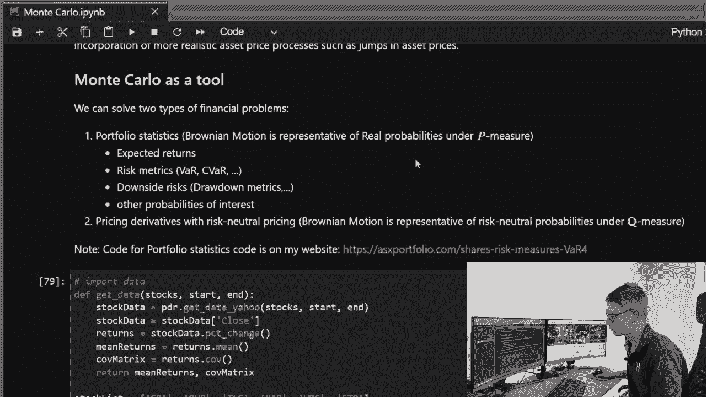

所以现在投资组合和统计代码的所有代码，所以我们在我的网站上看到R和C酒吧，你可以点击那个，你可以去那个链接。

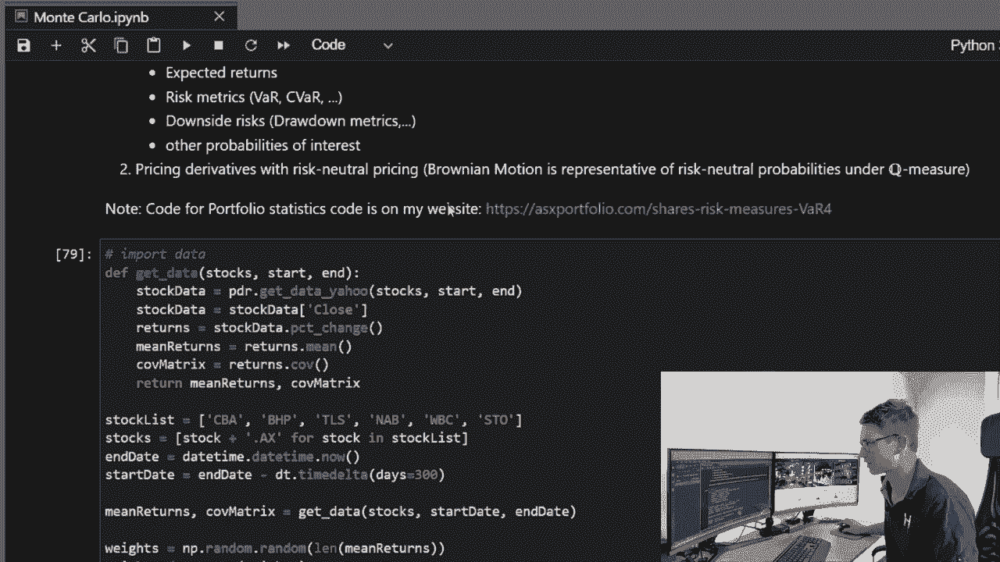

我会把它写进描述里，本质上，我们不会看代码，但我只是让你看看。

这是我们观察资产组合的第一种方法，我在这个投资组合里有很多资产，嗯，起价一万美元，我想模拟一百天，这个投资组合，我想看看在这个时间框架内的风险价值，在第五百分位数处有风险的条件值。

所以这就是我们使用蒙特卡洛的第一个原因，记住这只是一个工具，这不是建模技术，我们还是要用，嗯，你知道的，就像资产价格建模的对数正态分布，所以你知道，这就是模型，这是一个工具。

我们可以在这里获得有用的信息，我们用它来统计投资组合。

现在我们实际上要用它，最近衍生品的初始定价，所以最大的事实之一是，嗯其实，虽然上周，我说过它在计算上比高维解法更有效率，高维，在PDS方面的变量，解决PDS和高维--这是真的，但是，在它的底部。

与仅仅使用一个简单的分析公式相比，嗯，对于某些确定性PDS，例如布莱克斯科尔斯模型，嗯，你知道，对于欧洲的选择，蒙特卡洛在其基本形式上是相当低效的，因为我们现在要做的。

我们必须从数据中模拟出所有这些不同的随机变量，生成过程，然后嗯，是啊，是啊，取平均数，所以本质上它本身就是一个A，在任何情况下，我们可以通过做两件事来提高准确性，我们可以用方差缩减法。

我们可以添加我们可以使用和美学变体，我讨厌发音和控制变体，另一个我们可以改进蒙特卡洛作为评估方法的方法，让它更准确，使用尽可能少的变量是使用准随机数而不是伪随机数，现在在单独的视频中。

我们将解释什么是方差缩减方法，如何使用它们，如何落实，那为什么，在蒙特卡罗过程中使用准随机数而不是伪随机数是很重要的，模拟估值，这真的是它的症结所在，所以不用担心，我们很快就会把它弄到代码上。

但我们需要经历这一切，风险中性定价方法告诉我们期权的价值是，其贴现收益的风险中性预期，所以我们能做的就是，我们可以通过计算来估计这个期望，一个特定的大量贴现收益的平均值，所以对于一个特定的模拟。

我们有这个公式，我们已经得到了它的折扣过程的预期，现在我有一个变量，利率可能会改变，我们得到了一个特定模拟在时间t的收益，如果我们假设就在黑浅滩的方法论下，然后我们有恒定的速率。

那么它就是折扣率在这段时间内的指数，乘以个人模拟的收益，所以现在如果我们重复模拟m次，我们可以取这些结果的平均值，所以1/m加上所有这些特定的衍生品价格之和。

现在标准误差变得非常重要，所以现在我们实际上有了一个估计，你知道C帽子这个导数帽子，嗯，在时刻，零只是对期权真实价值的估计，带误差的C零，因为我们实际上是取随机生成的样本的平均值，所以计算本身是随机的。

所以这个误差的一个度量是衍生产品价格的标准差，这就是所谓的标准误差，这是，这可以估计为核心价格的标准差，所有这些模拟路径都折现了，除以样本数，所以这里我有西格玛，它只是表示折现资产过程的标准差，嗯。

所以你会认识到这个公式，就像一个随机变量的标准差，这里我们有标准误差，它只是由m的平方根归一化，现在，我将在下面发布一个链接，为什么我们使用这个公式。

所以现在如果我们在这里看到一点代码，我们在努力做好什么，本质上，我们将对一个特定的股票价格进行蒙特卡洛模拟，说是一百多年过去了，我们将采取这些最后的步骤，我们要把它折现回来，我们要去。

我们将计算出在每种情况下的看涨期权。

取平均数，这是我们的估计，所以对于黑壳世界的欧洲看涨期权来说。

所以在这里我们有恒定的折现系数，指数减去r乘以t，然后是股票动态，当然啦，是用几何布朗运动来模拟的，几何布朗运动是，我们得到的漂移项，然后是波动加权的随机项。

所以如果我们想用许多变量来模拟这个GBM过程，最简单的方法是通过自然对数过程，所以我们要做的是，我们将定义这个称为xt的过程，也就是股价的自然对数，现在我们这样做，因为它是正态分布的这个股价的自然对数。

因此，它变得非常容易模拟，自然对数过程动力学，你得记住，我们需要使用伊藤的微积分，所以请看视频，嗯，如果你不明白这一步，我会在上面放一个链接，但本质上，我们使用江户演算来检查实际的导数动态。

自然对数过程动力学，x t在这里，我只是在写公式，但很明显，我们从微积分中使用e推导出了这一点，所以dxt等于这个新的dt，这是漂移项，用r减去波动率的平方，加上波动性，现在我用dzt作为我们的新变量。

嗯，布朗运动，所以我们现在可以离散这个随机微分方程，那么我所说的离散是什么意思，我是说，我们要从无穷小，所以这个DTDZ DX，我们实际上要把它分成小的时间步长，所以你可以看到在三角洲。

所以我们实际上从一个时间步到另一个时间步有了变化，现在我们在做有限差分法时必须这样做，我们也要在这里做，嗯，当我们试图让SD进入我们可以使用的东西时。

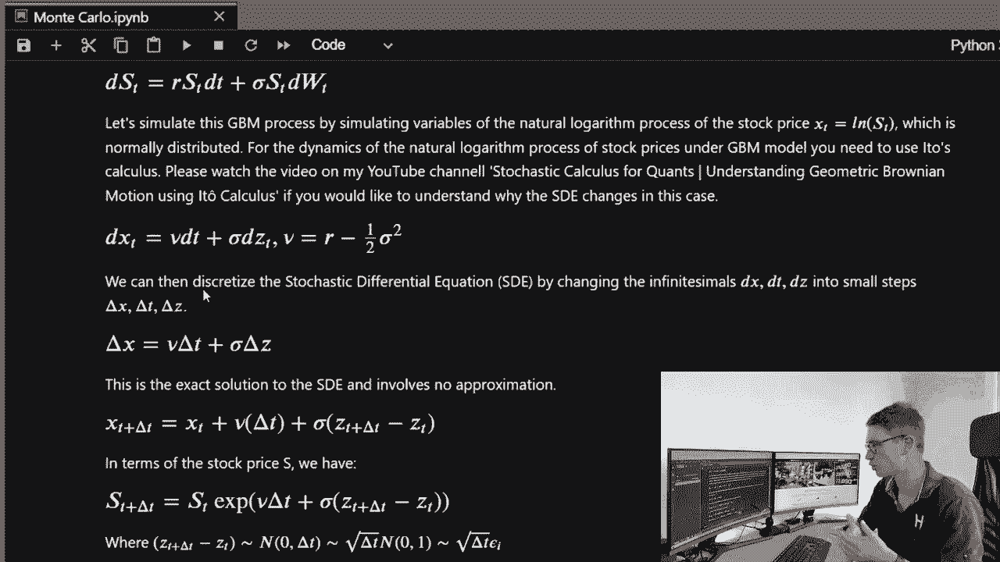

随着时间的推移，现在这是特定sde的精确解，因为它不涉及近似，为什么它不涉及近似，是因为这里独特的情况，在一个非常简单的几何布朗尼运动模型下，那个，我们实际上接触到的所有风险都来自布朗尼情绪。

在一定的时间内，Um有独立的增量，因此，我们可以缩放，这样我们就可以从开始到结束，通过模拟几何布朗尼运动尺度，随着时间和波动，我们将得到确切的解决方案，好像我们走了不同的时间步，所以在这个特殊的时期。

我们不必担心时间步数，但这是要记住的，然而，当它是更复杂的模型时，您不能离散到，有时你不能将SDA的精确过程离散化，你在做什么，你在用近似值，每次你迈出一步，所以你就这样分手了。

你在整个过程中走了多少步，那个模拟很重要，所以说了这么多，现在呢，我们有离散化的，x的变化等于t的新变化加上波动率，Z中的变化，这是精确的解，SDE，所以我们有x，新的时间步长等于先前的x，记住。

这只是我们现在股价的日志，加上时间的新变化加上增量，然后这些随机变量在股票价格方面的变化，我们要做的就是取指数，所以你把xt带到另一边，你会改变变量st，你最终得到的是，在这个过程下的下一个股票价格。

等于之前的股票价格乘以这个项的指数，所以新的ΔT加上sigma，布朗运动下的这些增量，它们是正态分布的，好啦，方差为ΔT，所以我们所做的是，我们只是模拟他们，我们只是拿，我们从正态分布中取项。

方差为1的标准正态分布，我们用平方根t来衡量。

那我们该怎么办，我们将通过一个真实世界的例子。

如果你现在在屏幕上看到，我有CBA在我们面前，我们将关注欧洲期权的时间范围，3月17日到期，所以在这里，如果你看，我们实际上有，嗯，我们只有一个交易期权看涨期权在97。01，作为现在的执行价。

一共是四块四十五，如果我们把股票价格，我们能做的就是，我们可以找出隐含波动率是多少，现在呢，我把它放在我的计算器在ASX选项网站链接在描述，我计算出隐含波动率是9。9%。

所以现在如果我真的采取不同的期权价格。

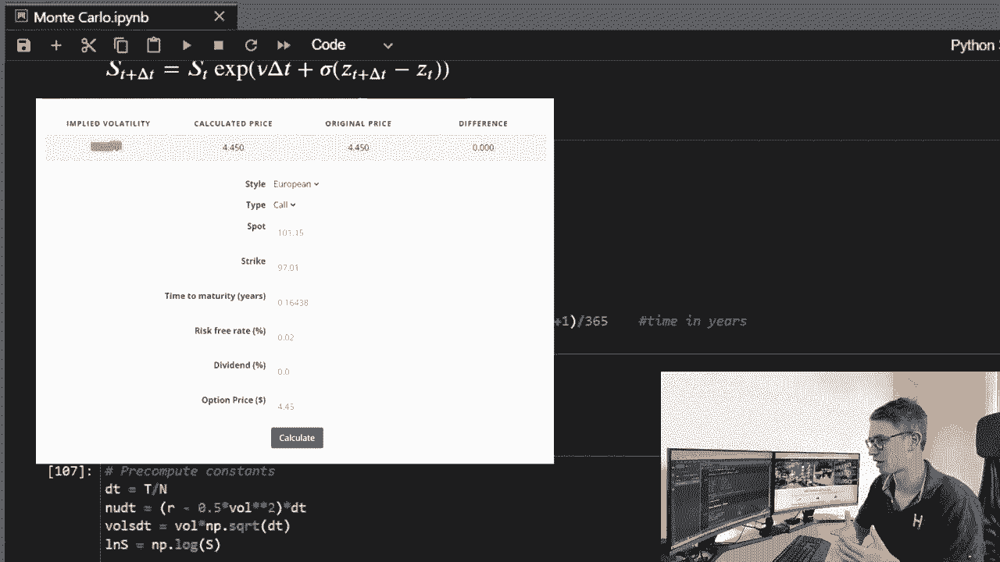

做市商设定的隐含波动率。

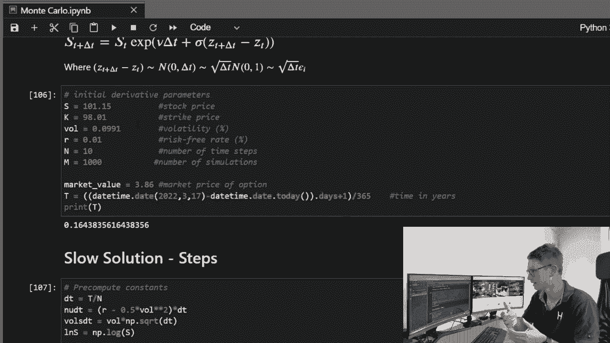

假设我们接受执行价，九十八点零一，所以现在我可以用这些信息来实际定价。

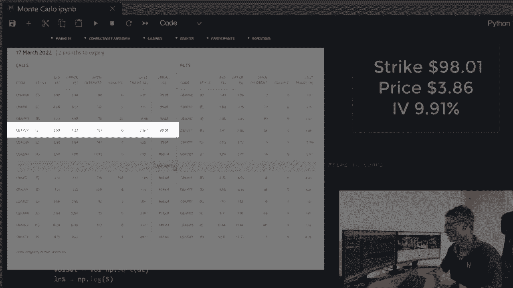

在蒙特卡罗模拟下，我们的公允价值是多少。

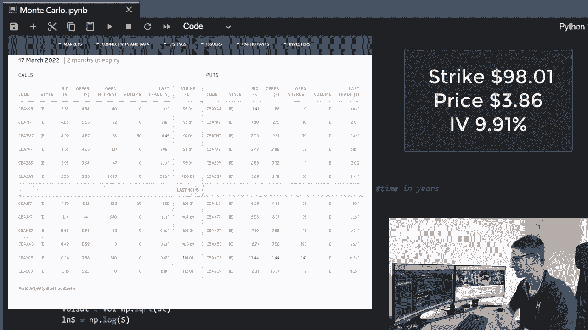

如果我们现在跳回木星笔记本，我们可以看到，我必须指定的参数的初始导数，是股价，所以1 0 1点，一五，我把执行价定为九十八点，零一，我将把体积作为百分比，九十九点，百分之九点一。

然后我们得到百分之一的无风险利率，然后时间步数是十个，模拟次数为一千，现在呢，请记住，我实际上不需要离散到时间步长中，因为我没有任何近似值，是的，这是完美的一个对一个，我在这里做，因为我很想让你们看看。

在代码方面从一步到一步，当我们开始评估，更复杂的过程不仅仅是欧洲的选择，随着时间的推移，我们将需要这些路径，所以这就是为什么我这么做只是为了向你展示嗯，但我也会告诉你我们只走一步，折扣回来。

反正我们得到同样的价格，所以这次罢工的新期权的市场价值，九十八点零，一个是三八十六，从十七日到三月到今天，基本上你所需要做的就是去玩，将日期插入日期，那里的时间，嗯，减去日期时间点日期点今天从它。

我加了一个，因为市场还没收盘，我们实际上在探索的那天，那一天你还可以交易，所以我在那里加了一个供辩论，但是是的，除以365，我们得到的时间是以年为单位的，好啦，所以慢解，现在我们要预先计算罐头，常数。

所以我们的时间步长等于，时间除以n，我们有很多，也就是漂移项，减去半卷的平方乘以dt，我们有vol sdt，即波动率乘以时间的平方根，在金融界很常见，我们得到了对数s，这只是s的自然日志。

记住Numpy默认情况下是自然日志，现在标准错误占位符，这就是t和t的平方之和，我们将用它来计算我们的误差，然后是Ct的和，得到我们的期望值，所以他们只是占位符。

所以现在让我们一步通过我们的蒙特卡洛方法，我们有一个模拟，我在M中的总模拟，我们需要做的就是初始化这个log st，然后我们需要在时间步中迈出一步，所以对于j，在时间步数n中，也就是十个，嗯。

我想做的是，我只想计算下一个st变量的st对数，所以在这个过程中，所以我们要加上新的漂移项，我们要把波动率的平方乘以随机变量，所以随机变量我们将使用Numpy随机点法线，那是默认的，方差为1 um的零。

所以我们要穿过，我们将继续提高价格，最后我们得到了Innt在时间步长中的位置，所以请记住，我们可以在这个简单的过程中一步完成所有这些，但我们在这里做是为了把它分解为你会做什么，如果你需要。

所以现在我们取期末考试的指数，我们所做的，收益是什么，所以让它回到股价，我们只需要取指数，因为它是自然对数，所以你用指数来恢复股价，然后我们看最大值，在股票价格和执行价格之间，我们要做的就是取T的和。

所以我们把之前的T，我们把它添加到TS中，得到平方和，你所需要做的就是把这两个相乘，把它们加到t的平方之和，所以现在计算期望值，你所需要做的就是我们接受折扣，这就是那个因素。

折扣因子乘以t之和除以m模拟，你现在得到了你的期望，你可能会在这里看到标准差西格玛的公式，可能会有点困惑，但这里实际发生的是，两个公式结合在一起，基本上就是标准差公式，然后是蒙特卡洛方法。

所以你在这里得到的是折现的平方因子，到了指数，是rt的负2倍，你所拥有的，是我们在整个过程中计算的平方和，减去c t乘以之和乘以t除以m之和，因为在这个过程中标准差的分母，现在就除以m-1。

所有这些都是平方根，你所需要做的就是，然后将其归一化为m的平方根，也就是变量的数量，本质上你得到的，你得到一个调用值和进程值三点八三，标准误差为正负零点现在是1，如果你一直按下去。

当然看到你得到不同的值，但你会注意到标准误差在这里或多或少保持不变，原来这就是蒙特卡洛，我们实际上是在模拟随机变量，因此，当我们取平均值时，因此，我们的结果是随机的，所以记住这一点很重要。

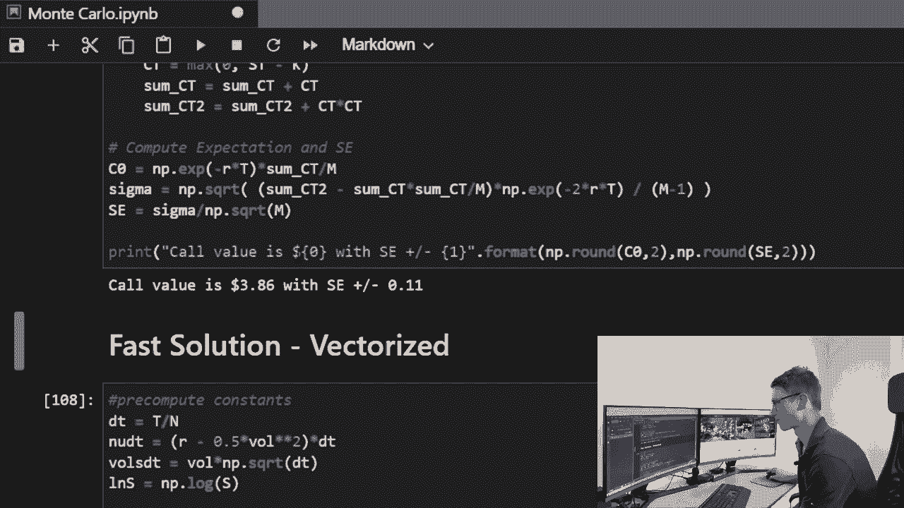

我怎样才能很好地降低这个精度，如果我增加变量的数量。

这样我就可以减少我计算的标准误差，但这是有计算成本的。

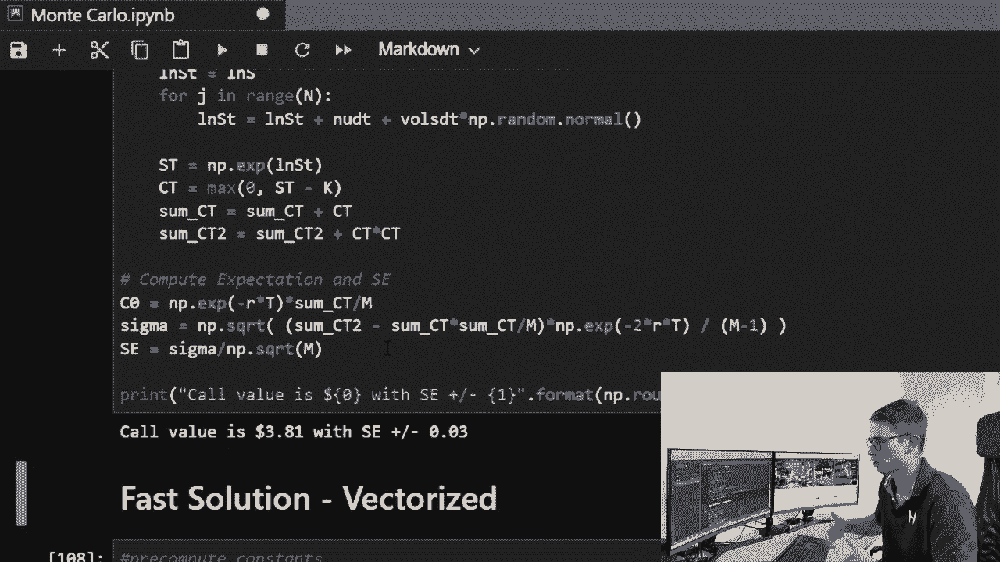

所以我们要做的是，我们希望得到这个近似的最佳精度，嗯。

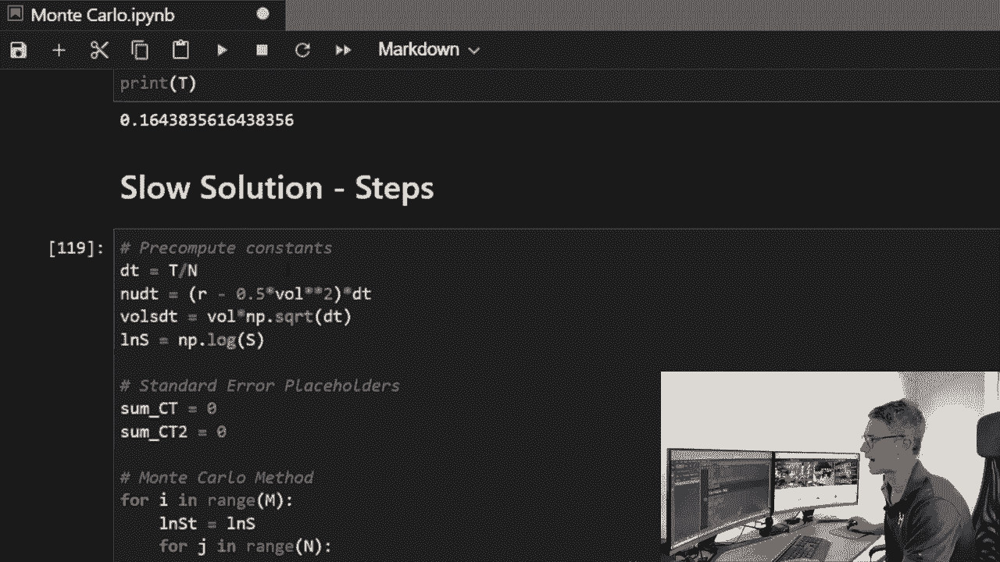

用最少的模拟变量。

现在第一个解决方案，我会更快地解决这个问题，所以本质上这里，我们所做的就是，我们将一次模拟所有的随机变量，嗯也适用于不同的时间步数，虽然如此，我们仍然会做时间步数，嗯，我们要一次做完。

我们将以矩阵的形式来做，所以预先计算的常数保持不变，但现在蒙特卡洛方法，我们有这个z矩阵，也就是大小时间步长，嗯，通过模拟次数，我们就能同时得到所有随机样本的正态分布，我要做的是，我要拿。

我要得到一个新的矩阵，也就是st过程的xt自然对数的增量，这将等于我们的漂移项，SDT，所以这是标量，卷乘以时间步长，时间步长的平方根，乘以这些随机因素，所以这些是我们在时间上移动的小增量。

所以这只是一个矩阵，那么我要做的是，我要把这些路径变化的累积和，在这个轴上x轴等于零，沿着小路，我想得到这些三角洲的累计总和，我们要加上原来的对数，ST价格自然原木，所以xt变量，所以我们实际上得到了。

我们沿着这条路开始的代价，所以我们想要每一步的累计价格，然后我们要做的，我们将串联一个简单的形状数组，乘以填充值的模拟次数，也就是st的自然对数，我为什么要这么做，因为当我之前做那个图表的时候。

我希望它保持在我们开始时的股价，不只是从下一个模拟时间步骤开始，所以是的，那只是为了完整，但本质上我们不需要这些变量，除了最后一栏的模拟器股票价格，我们只在乎回报，就在最后，股价到了哪里。

所以我们要做的是，我们把这里所有股票价格的指数，但你只需要最后一栏，然后我们将使用Numpy最大值，零圣减去k，所以我们需要使用Numpy最大值，现在不仅仅是max函数，因为我们在研究数组。

然后我要做期末考试，你用这个ct变量，我只选最后一栏，现在我们要把它的总和，我们将得到平均收益的折现收益，所以把所有这些煤炭价格的总和除以m模拟，以这个价格折现，现在这里更直观，平方率。

西格玛现在正好等于我们以前的公式，对于标准差，这就是这些，模拟结束时的实际衍生品价格，减去平均数，这只是期望，我们要取平方和，我们将它除以m-1，所以我们得到标准差，我们用m个模拟的平方根来归一化它。

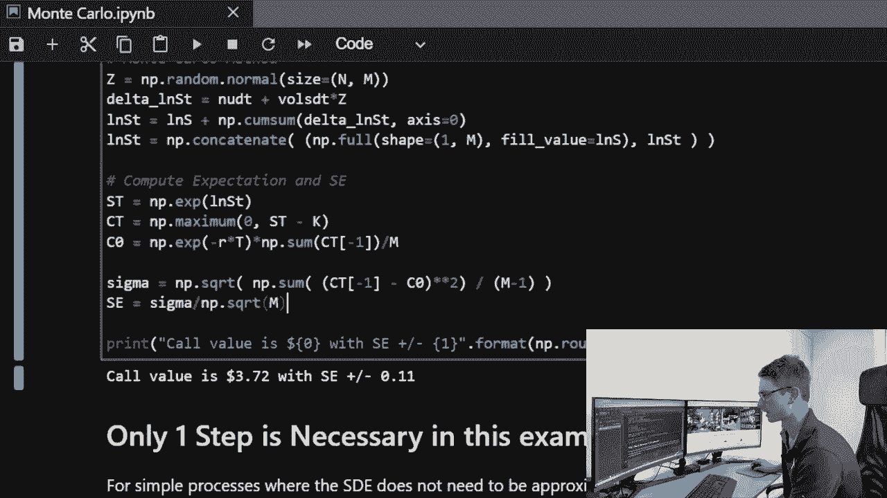

你可以看到我们得到了和以前一样的结果。

再一次记住，现在会随着时间而改变。

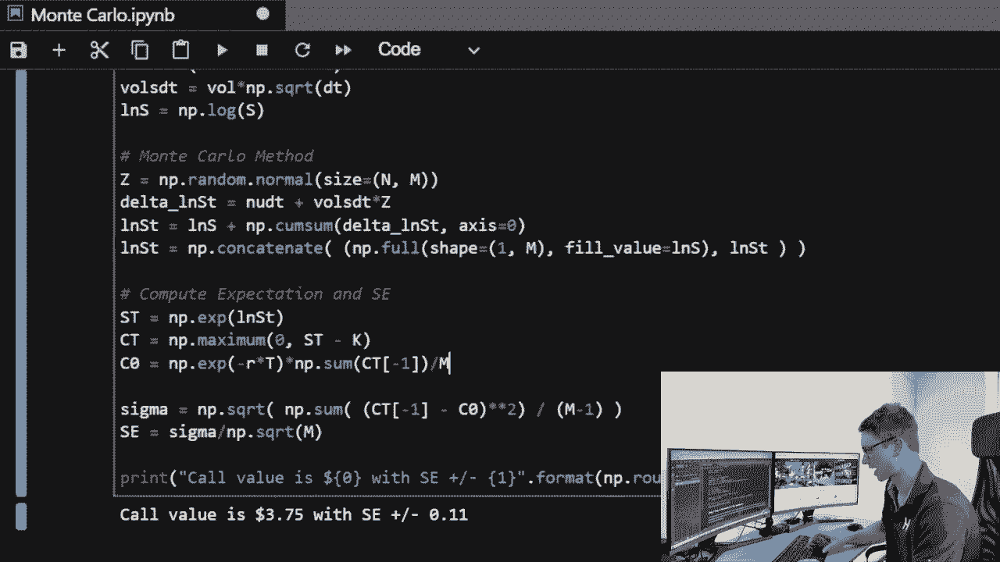

我要再次强调，因为我仍然会在它的底部得到问题，是呀，你只需要走一步，嗯，当你有一个简单的过程，当sde不需要近似值时，就像在几何混乱的情况下，嗯，用于计算欧式看涨期权或期权价格，所以我们能做的就是。

我们可以模拟最后一次的变量。

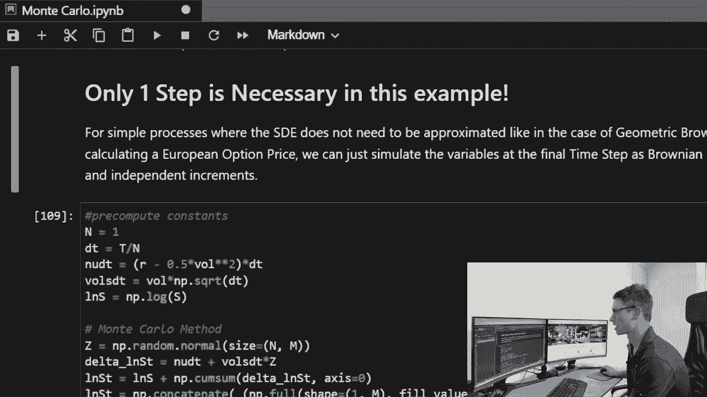

具有时间和独立增量的白兰地运动标度步长，所以在这里我所做的就是，我把n等于1。

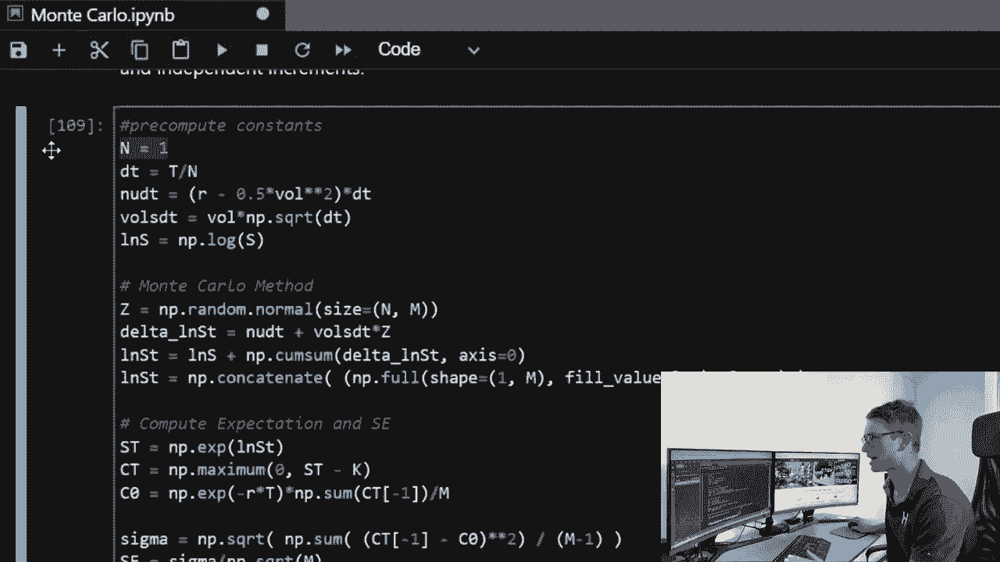

我只是给你看砰的一声，我们可以直接走到尽头，折扣返还，找出收益，取平均值得到预期，打折的。

所以我要做的是，我要告诉你，如果我增加。

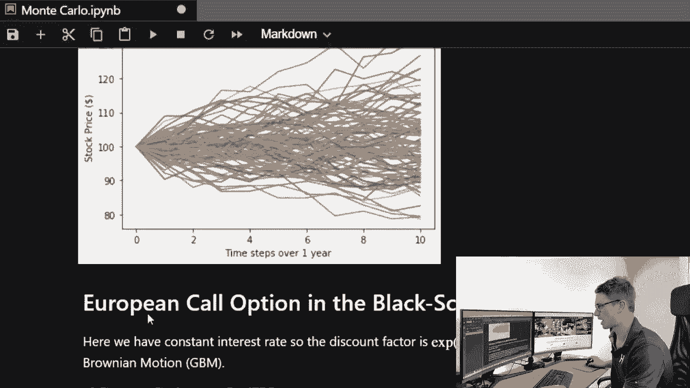

我的变量在哪里，如果我把这个数字增加到一万。

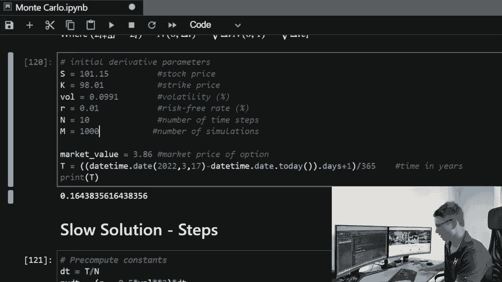

现在我在减少标准误差，如果我做十万，让我们看看这有多慢。

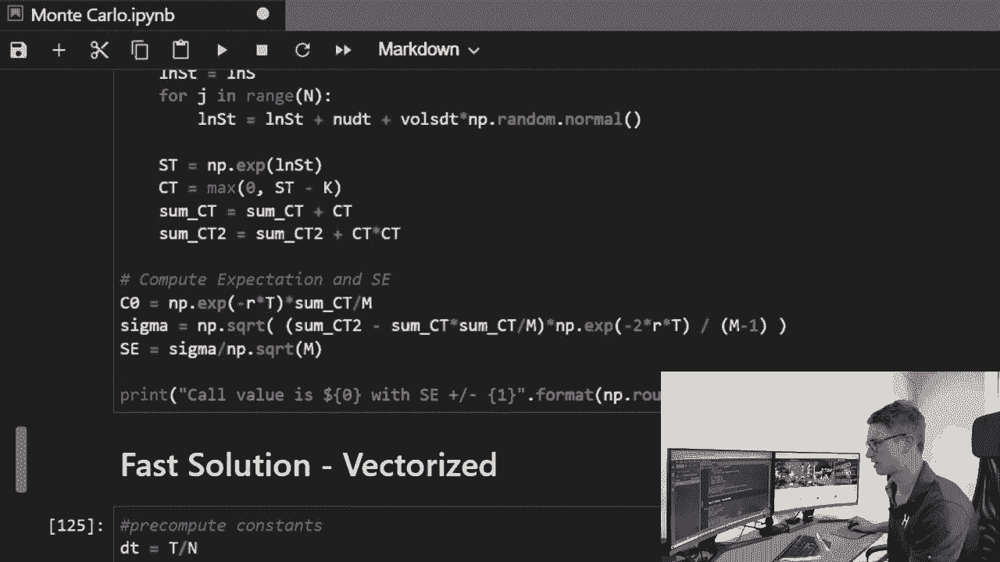

还没有计算，可能花了五秒钟，现在呢，我们本可以计时的。

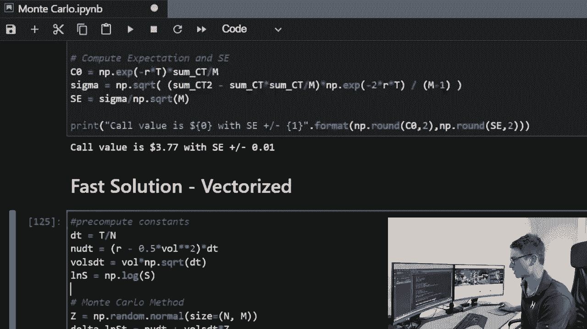

但让我们用一个矢量化的版本来做，砰的一声几乎是瞬间的，所以矢量化代码总是比通过。

Python中的时间和模拟。

所以这就是为什么我们要向量化我们的代码。

所以现在我想给你看最后一件事，我们将把这个过程和收敛形象化，所以我在这里所做的一切。

你可以在我的网站上看这个代码，但主要事实是，本质上我们所做的，我们只是通过蒙特卡洛模拟计算出了理论值，我们得到了CBA期权的隐含波动率，那实际上是一次不同的罢工，我们这样做是因为这实际上是交易产品。

现在我们采取了一个非常接近的打击，然后我们看了做市商在他们的要求中的位置，隐含市场价格是它的中点，所以我们用这个价格，嗯，作为市场价值，现在呢，使用隐含波动率，然后在电话上的下一次罢工。

我们看到的是98。0，然后我们可以用蒙特卡洛来评估期权价格，你可以在这里看到，在一个标准差内，5。我们对市场价格已做了初步的估计，所以当然，如果我在这个实验中使用更少的模拟，那么我的理论值可能会更远。

更重要的是，以美元价值计算，那里的标准差会大得多，所以这是一个非常有用的方法来直观地表示标准标准误差是什么。

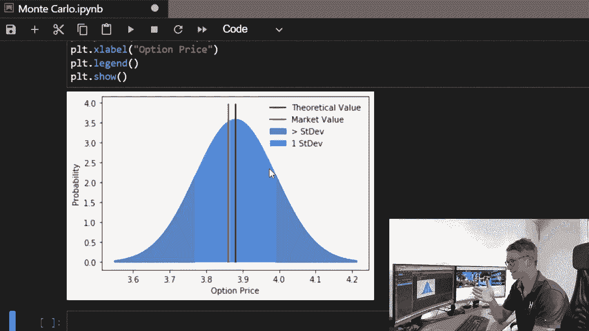

关于模拟的数量，如果我们现在把它改成10，或者我们做50。

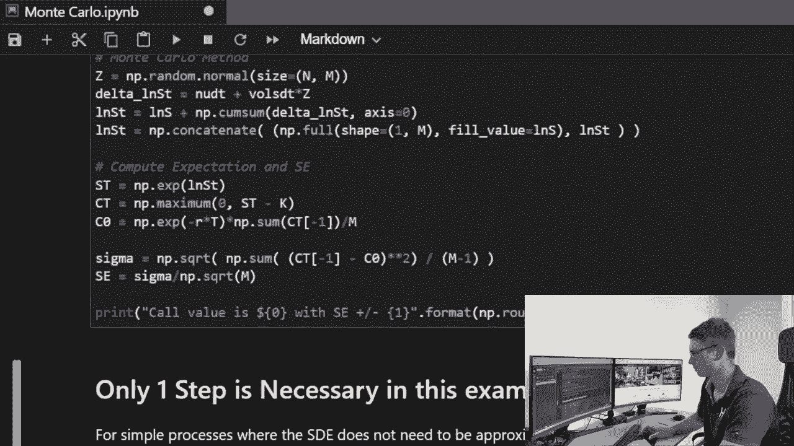

你可以看到现在我们有了更大的差异。

我们只取了五十个，嗯模拟，因此我们得到了一个，你知道的，一些我们赚了很多钱的右尾活动，这推动了蒙特卡洛模拟中的理论值，最多4美元50，当然，我们知道市场价值价格在这里，很明显。

那么我们的标准误差是相当大的，所以这真的突出了你需要做的是提高准确性，增加模拟次数，但请记住，这在计算上是非常低效的，所以我们将在接下来的几个视频中看看还有什么其他的选择，所以使用控制变量之类的。

我们实际上可以减少，最大限度地减少我们必须采集的样本数量，所以我希望你真的喜欢，如果你在视频中做到了这一点，我真的很感激，如果你给这个视频点个赞，然后呢，嗯是的，在评论区删除。

如果你想找到关于蒙特卡洛的更具体的材料，在接下来的几个星期里，我们将继续讨论这个话题，希望我们能在YouTube上建立我们的集体知识，所以非常感谢你们的收听。

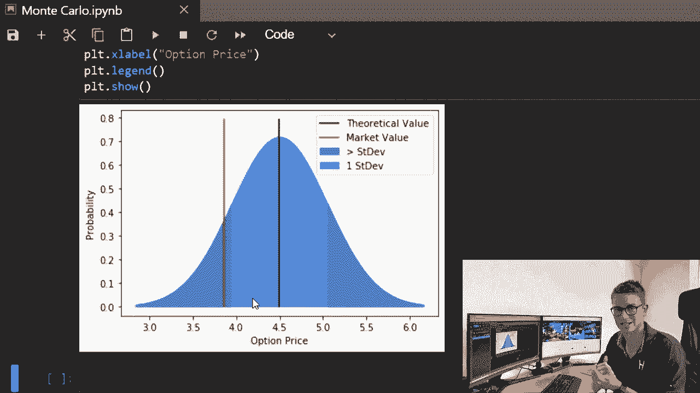