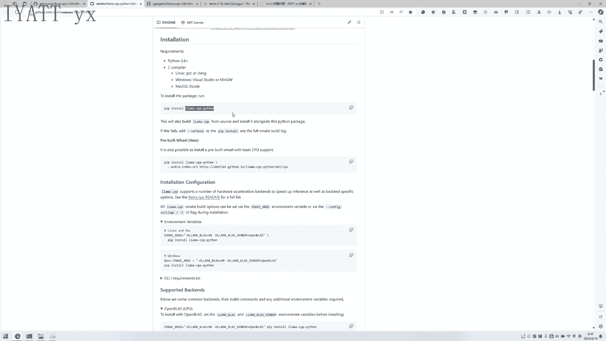
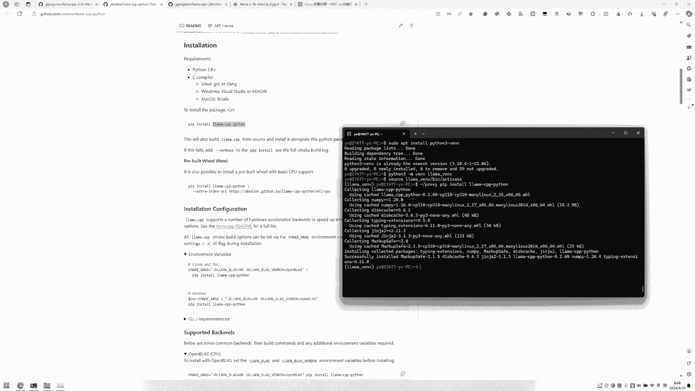
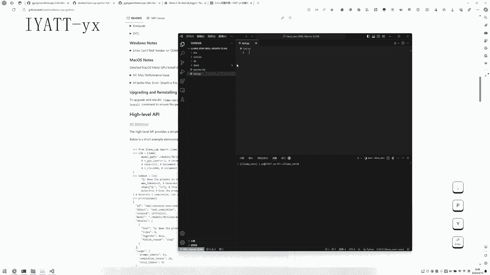
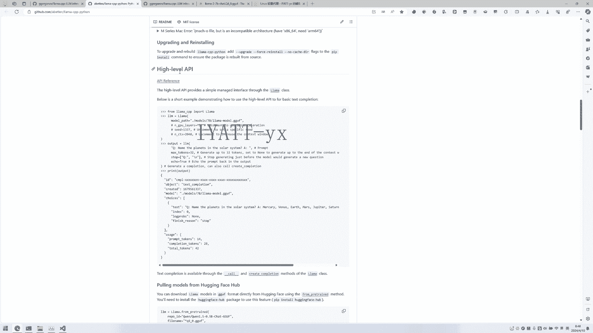
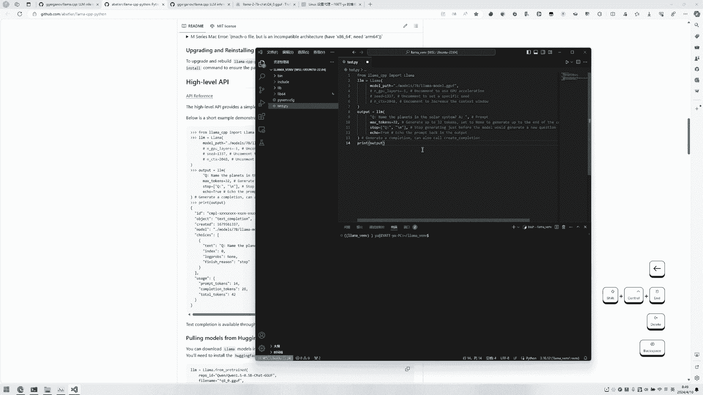
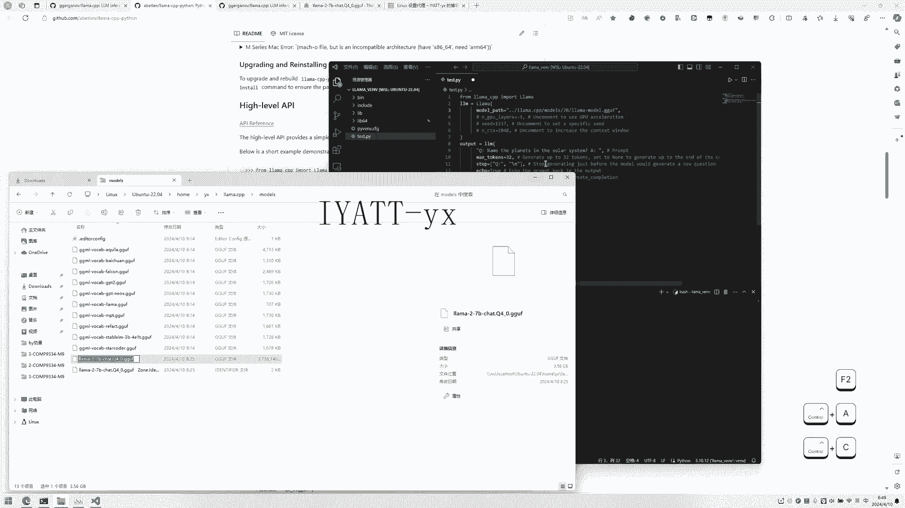
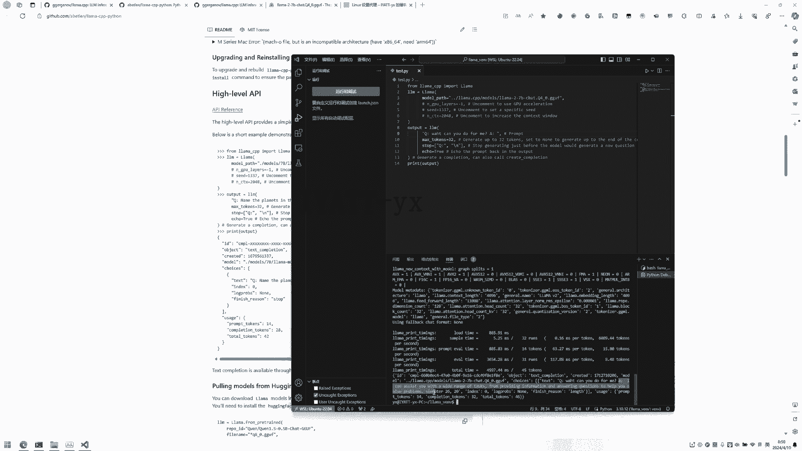
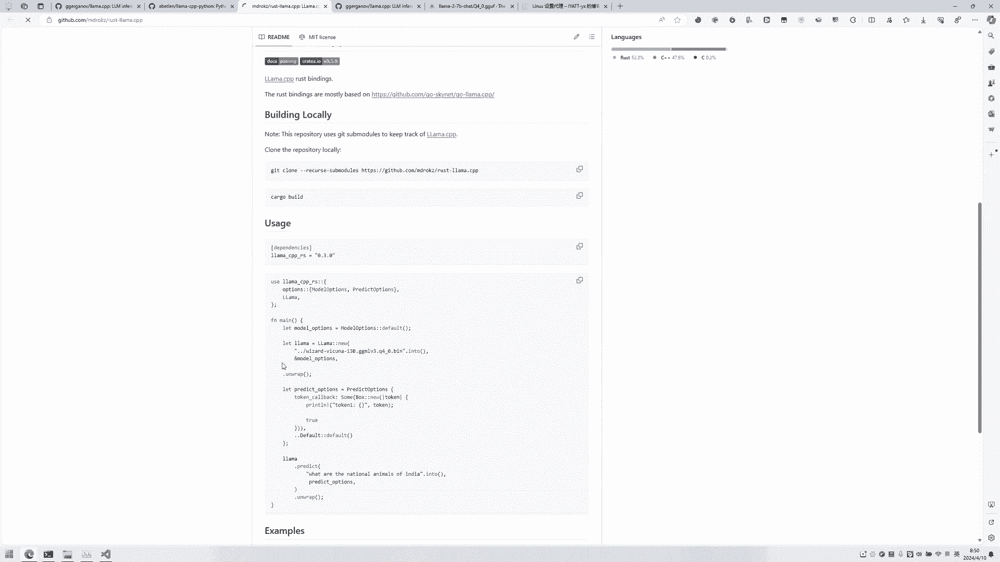

# Python 使用 Llama 演示 - P1 - IYATT-yx - BV1fE421g7nT

这个项目也提供了多种语言的绑定支持，可以用这些语言来向大模型传递来，我这里演示一下Python的，就按照他这个说明安装一下这个库。

建议的话使用虚拟环境，这个LINUX下可默认没有安装这个虚拟环境的模块，还剩三个VNV就可以与全局环境独立开，然后创建一下虚拟环境，叫拉玛，进入虚拟环境，在里面并目录activate，然后再安装这个库。

可以换成国内的源来安装，这样速度会快一点，或者我这里就使用代理。

然后我这里用vs code来编辑演示一下，他这里有那个案例，现在是年禁止系统了，然后找一下这个目录虚拟环境，然后选择一下解释器，就选这个虚拟环境里面创建的Python，然后创建一个源码文件。

他这个他这个high level API的视力粘不粘进去。

他这个是在交互环境演示的，把这些箭箭头删掉，这个是他演示的输出。

然后这个模型的路径要改一下，要改成这个相对的路径来看，这个你是现在是在这拉马岗位，因为里面所以就是上层目录，然后是这个拉点CPP目录，然后里面的models目录，然后就直接在里面了。

就是这里，然后可以运行一下视力，这里就是向大模型的提问，然后执行，就可以看到这个按照这个格式传递的，这是问题，然后是回答他能做什么回答的。

其他语言的其实也可以参考这个，它都会有说明的，比如怎么用。

