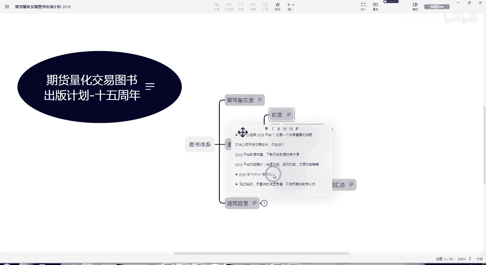
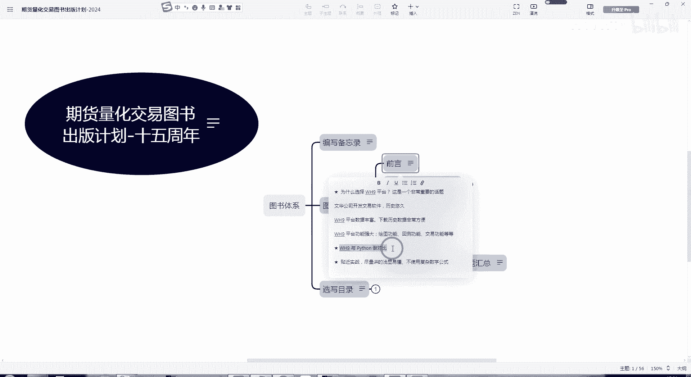

# Python 和 WH9 做些比较，分析总结 - P1 - Ada-Xue - BV19dqoYHEoi

那么我们在这个部分里面后面就说要考虑一下，比如WH9和这个Python做一些对比，在前言里面可能做一些，就可以把这份对比放进去，比如说像Python他这种通用语言的话呢，做各种各样的东西非常多。

写游戏也好，写网站也好。

或者呃开在科学计算里面使用也好，等等的那些功能是非常非常丰富了，在这上面使用好处，但是很多的，但是坏处来说，因为它不是专用的针对量化交易的平台，交易的语言，所以说呢相对来说要实现很多功能的话。

还得自己一点点的去写，当然现在也有很多的库包这些东西模块来做，但总体来说我们觉得呢W不是九，毕竟是比较成熟的平台了，那么在这个基础上面做二次开发。

