# Python 在量化交易风险管理中的实务应用-张士欢-量化行业从业者 - P1 - PyConChina - BV1R9iUYoEcU

嗨大家好，很很高兴能有这次机会和大家多交流，所以我不知道在场的会有多少，是我们商科类的学生，应该也应该也不会太多了，呃我们我本次演讲的主题呢，主要是关于这个Python在这个量化交易。

风险管理中的事务应用。

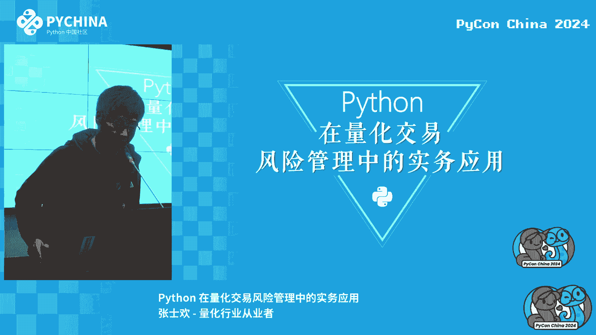

那么首先做一下自我介绍啊，先介绍一下我们这个专业背景吧，因为我本科是这个金融工程专业，然后研究生读的是公司治理以及合规审查专业，相当于我是一个跨界的人，呃，当时我在读本科的时候呢。

那时候教的还是Mac net，还没有用到这个Python，那么这个Python呢属于是我个人在这个工作之后，因为相关的一些需要，所自觉的这方面的编程的技巧，啊对这个是我公众号。

如果说大家对这个风险管理啊，相关的一些工作啊，比如说相关的一些知识感兴趣的话，可以加个关注吧，我会不定期的在我的公众号上，分享相关的一些新的感悟。

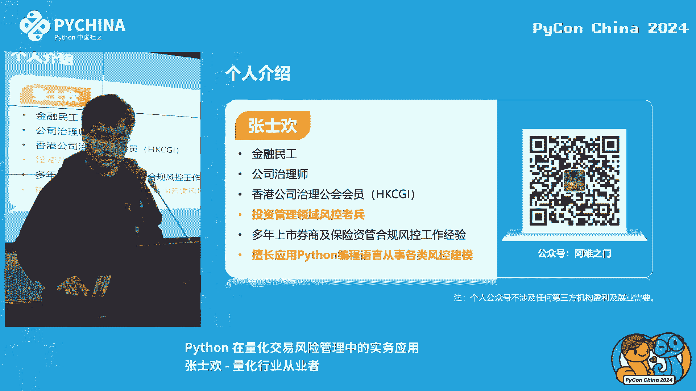

那么本次呢我主要想分享，有有四个这么大的一个主题，那么第一个呢是就是Python，在第一个呢，就是这个Python，在不同风险管理领域中的这个运用差异，第二个是Python基于量化交易。

它是一个不可或缺的工具，那么第三点是投资风控中常用的这个分分，第四点呢是用Python实现量化风控中的风险计量，让我们一个一个来看。

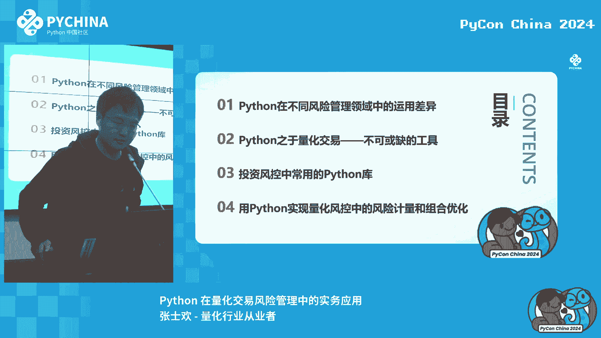

额，第一个课题呢是Python，在不同风险管理领域中的内部差异，呃，像我的话，我是就毕业之后呢，就在这个金融机构呢，一直从事合规与风险管理工作，大概业务好多年的时间，那么包括像市场风险啊，像信用风险。

也包括像操作风险啊，个人也都也都在事故中接触过，那么就我个人的这个经验来看的话，Python在这个金融领域啊，包括在这个动态管理领域，它的主要应用场景，第一个这是市场风险，那么第二个性风险。

其他的也包括说像操作风险，还有一些生育风险，其实据我了解的话呃，应该是对，对我们这个岗位的要求不是不是特别大，就是说你可以不懂不懂编程，但如果说你是想日后要从事，有关于这个市场风险。

有关于这个信用风险相关的一个管理工作的话，那么这个Python的话是你一个必备的技能额，那么下面我来分别的说一下，那首先市场风险的话，它是基金，包括这个公募和私募，还有这个券商他们所进行的分析呃。

但是一般来看的话，这个券商它也有一些职信并行类的岗位，比如说他有一些应用的评估师，这个这些个性定公式呢，它是可能来的这个投研部门对吧，他是一个研究类的岗位，也会有，比如说看一下债权人信用网这些。

但是总体来看的话，尤其是像基金公司向券商啊，这种，就是从事二级市场这个交易的，这么一个，为为主要这个领域特色的金融机构的话，市场风险是他所面临的主最主要的风险，那么它所依据的是经典金融学模型。

那什么是经典金融学模型，就是如果说大家是那种呃，比如说有有一些商科类型的话，应该是可以大致举出几个例子，你比如说像什么有效市场假说呀，叫什么那个呃投资组合的有效前沿啊。

包括依据那个前沿上面画一条ZML线，这些地方都是学校里面的必考内容，然后在那条线上我们去寻求那个最优的下属吧，你比如像那个鸡犬呃，期货相关的，比如机械外窗口模型啊，相关于数的资产模型。

这些都是我们可以做出经典的建模球模型呃，第二个应用的方面，就是比如说您对这个嗯感觉兴趣不大，然后想要从，但是呢呃又对风险管理呢，总体而言还是比较有兴趣的，那你可以选择一条就是另外一条道路。

那就是信用风险，信用风险呢是和我们这市场面对应的第二条线，那么它的主要部分运营可以分选，机构呢是银行和保险，这个大家应该是比较比，这个市场目前应该会更有感触，因为即使你没有去做一些股票交易啊。

一些证券交易，但是我心想你个人啊，基本上你每次呃走在校园里面可能会被拦下来，去去去办理一张信用卡，那么那么不知道大家有没有想过，就这个信用卡这个额度额度的由来，就说他是通过什么来给你批下的这个额度。

那么那么这个它的背后就是由我们在信用风险，我们的近代工作人员，所做出的主要的一个工作业绩，他是我们的现代人工作主要的一个工作重点，包括还有像保险跟保险，他业下面有资产管公司给他的资金增加运动呃。

一般来说的话，针对于项目风险，它有两个模型，两类模型，那么第一类的话，工厂模型它主要是在企业近代里，企业信贷就非企业贷款，那么它的特点相对于这个个人信贷的话，金额更高，而且集中度也比较高，很多情况下。

他给一个企业，给一个企业放贷的规模可能会大于百亿呃，那么那么他和这个就是个人信用卡业务，包括还有一些零售业务，他的区别在就是它采用的这个模型不一样，那么什么是打通打模型，打通打模型其实很简单。

就是我们要去了解这个，但有可能是那种学会计的呀，他会有一些时间的几张报表吧，比如说还有一些资产负债表，还有一些利润表，还有现金标表，上面有各种不同的课题，然后打分表我就是在左边一列列出各种各样的。

这个他为什么要用这个时候看战力，线性流量比例这些，然后你右边啊给一列分数项，然后的话就是那个比如说是呃，还有些选中，然后你可以把它汇总起来，最后得得出一个分数，然后他那个分数在不同的评级。

他会呃有一些范围，你比如说像什么样的分数，它可以化为3A级，那什么样的分数可以化为2A，然后乘上的分数可以化为B，这，嗯我我不知道大家有没有考虑过这样一个问题，就是说为什么在企业信贷领域。

他就是反而说这Python渗透的会比较少，就是说你你从来没有一个银行的放贷员，然后你会要求他需要一定的喷起来，为什么，就是为什么，反而说这种个人信贷给你发发信用卡，甚至说还有一些特别特别数量比较多的。

一次性那种快闪电带给消费起，就是为什么这些反而对他这种，因为实际上其实说白了还是一个数据源的问题，就是呃像企业现在他的好好用的，他的坏样本做的太少，非常少，就是大家可能关注到，比如说近期会有一些与额对。

可能也会有一些企业，它有一些这个违约的这样负面一起，但是你总体而言的话体量非常少，尤其是一些公开的勇敢，比如说可能会有实体店的，近十几年来对，有有十几家比较比较初中的，然后他的肱骨的话可能会有些增加斜。

那是你的堆积，前家像你这样的数据量，是没有办被我的数据提升处理，没有进行一个，没有必要进行一个大规模的这个训练集，那么只有在C端的时候，你包括，呃都，他可能是以数10万起。

那么这个体量就非常适合用来用来做模组，模型的训练，你可以通过Python的那个呃，SK的那个图呃，对他发那个图后，你可以比如说调用一些直接证明模型嗯，来个GDP差差地步提取一个函数。

然后对它进行额买一个西装，那么机器学习模型啊，它主要解决什么问题，它主要解决的是分类问题，就是它和我们之前提到的那个质量问题，因为像我们做二级市场交易的，它的本质在于你要你要预测未来对吧。

你要你要根据你的一一方面的逻辑去判断，这个在之后的一个增长率，所以说它是带有预测性质的，非模型，其实是更多的会用到里面的线性模型呃，当当当然要是做到量化的话，其实现在也有一些个呃观点。

就是过滤到经理金融学模型的范畴，就单单从机器学习的这个角度去出发去呃，构建属于他们自己的一套逻辑，这个像这种应用方法的话，其实就我个人的从业经验来看，基本上应该是在整个量化行业里面，可以占到4%。

实际上看的话还是用的比较少，因为多多少少里面都会有那么一些主观的成分，因为因为像你的父母公司的话，他们也善于说是在对外的时内，就比如说我们的策略是学生机器跑出来。

但是这样对我们分工来说是一个比较比较难的，因为机器模型它的总体而言的话，我们都知道他是个推箱子，你比如说像是那个是个神经网络，然后就比方说你投投资经理，他搞出一个特点，然后然后他要发给医生。

所以你要问他，你这个数就这么还没哎，你要你要想和这个特别啊，就说这个是我用神经网络模型里面跑出来的，那那对于你来说，你就你就比较尴尬对吧，就是当一个事情你不清楚的时候，你就很难把握其中的风险。

所以我感觉这个也可能也是我们量化风控，未来可能要提升一个方向呃，对我们刚刚说到就是那个机器学习模型的话，它主要是解决一个分类的问题，它的主要目标呢是在于，区分一个好样的和一个坏样本。

那么它的主要改变应该有两种，第一个风险策略，风险策略和一个一家公司里的风险偏好啊，这叫明智，然后就是你要接受的最低的一个风险要求，你要和公司的收益做一个整体的变换与平，那么第二个还能，那它就是供点建模。

分享建模的话，主要是如何更高效更有效率的去区分，好样的话，好像这是模型需要做工作啊，那么这个主题呢主要就是讲这些，所以说就是这就是零备有志于从事金融相关的，一个风险管理工作的话。

一般来说这两条路线是难有所交叉的，对如果说您想您更想听这种券商，或者想听基金的话，额我建议是可以多看看市场性的内容，对如果呢如果您是比较喜欢放贷的，你名字的直接给别人放贷，很开心。

也可以从这家现在的平方工作，这个是比较比较具有平行的两条线。

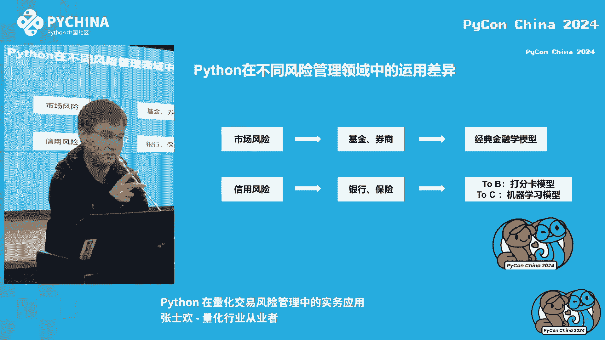

那第二个呢是讲一下这个Python去量化交易，是一个不可或缺的工具，首先什么是量化交易呢，就是现在很多人都是把这种高频交易啊，等同于量化交易，那告密交易嘛，那就是每秒每天累计2万米。

但是实际上额高频交易，占我们这个量化交易的例子很少，很少会有会有这样的一个需求，所以说你用到的精子这种高频因子，那你就肯定需要额这方面的一个交易，执行的效率就可，实际上这个电网交易的话。

就是等于因子的投资方法和程序化交易，那么什么是因子投资方法论，那现在看是不是因子，因子的话就是市场上的某种风格，比如说是呃，我们简单来说的话，像比较因子，像视觉因子啊，像这样好像于中性粒子。

像第二个因子，还有像动两因子，这是这些都是大家比较常见的名字，另外比如说有一可能会有同学说说，我自己把股价的10分钟或者说5分钟的波动率，或者说收益率设置为一个因子可不可，这当然可以。

那么这就是量价因子中的一种对，因为它不仅包含于市场中的因素，呃我们可以先来看一下，我们可以让那个KIMI来，我来给我们生成一个特点，是的可。

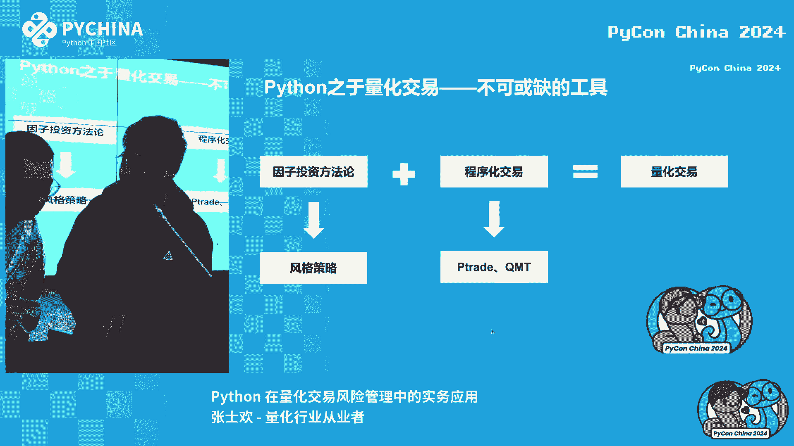

我想知道这首我只想法肯定会上的。

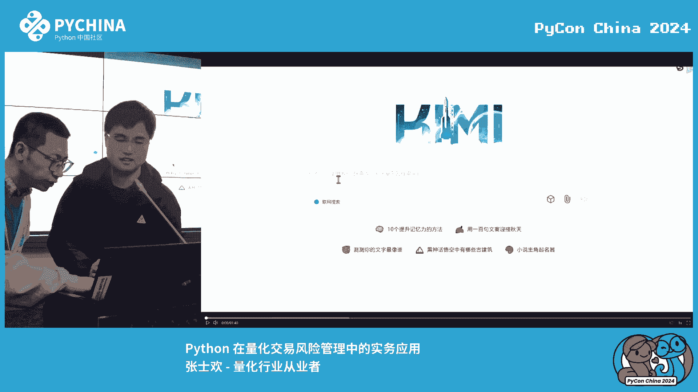

要不我们带过好这个我们后来解决了这个问题，好好好好好哈喽，大家可以看一下啊，对这个是我打开频率之后，你让他随机编写一个程，随机编写一个流量化的，所以请为我编写一个基于小市值选股模型的，运行数。

我们可以看一下他的反应，啊这想的还蛮快的，好在这里取的是50亿人民币，就是他对于他那个角正值是50，小于50亿人民币，那么它实际上就是构建了一个组合度和路票时，股票池。

这个股票时他是按照什么一个筛选分类的标准，就是说如果说可以判断强度，这个股票的市值它远大于50个亿，那说明加加百把声音啊设置提掉，如果他力然小于一，那就来啊，实际上这是一个非常非常简单的一个错误。

特别简单，那么那么那么大家可以看到，现在都可以用这种盖亚来来来自动生成策略，实际上就是根据我个人经验的话，这种特别是你是不可能让他让他上线给我，我们公司的特别这种需要很多方面的考虑。

啊对他还考虑了教育成本和保利的话，就是在市场剧烈波动的情况下，你买到的那个股价不一定是你想要，就是我感，我感觉现在AI的，大概感觉就是他考虑的变量之道，但是它的深度还是需要进一下。

所以就说呃我我也建议大家可以理性的干训，练出属于必点，你可以给大家投入配一些相关的一些知识，来应该学习。

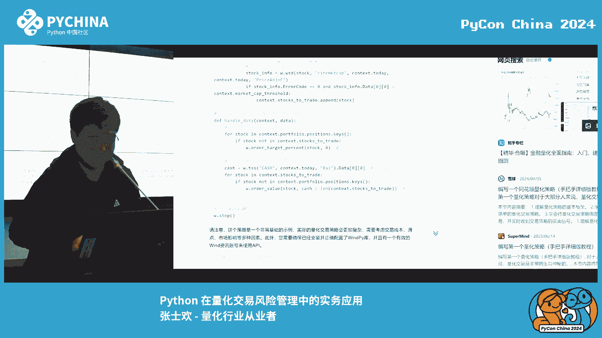

额对我们我们可以看到，这刚刚是有一个非常简单的策略，就是一个小提示，说这个策略如何给他做交易的执行呢，因为实际上这样，我们现在一般来说买股票的，你可能是打开APM打打开某家券商单。

然后然后输入一支表示开仓，暂且你要买多少股，你要买SD，或者你描述一个数量给你点下盘，点一下点下单，一般这种操作，但是对于量化推理来说，你刚刚也看过，已经验，也知道就是它是一个代码形式。

而我们知道原来A股小于50亿市值的股票，有毫无作家，你说你拿着这个手机点开，看一个一个往里面出那些代码，然后你再敲下，那那我那我估计你等等，你这个我们可能你可能买不到那个股票才能涨。

所以说这是我们就需要有一个工具，这都说是工欲工欲善其事，必先有利其器，但是这个气呢，就是这个我们的重心化交易的软件，就是P出来的，前者只有这个生产，后者只有这个军队，就这样这种能其实差不多。

一般来说你去擅长申请的时候，他都会他有自己的一些内部要求，如果你能满足他其他那些要求，就可以让他给你开通，那么这个软件的使用权限，它是那么这两个呃软件它的主要的一个使用的，我们说英雄用的编程语，对啊。

当然这个PMP的是微编，但微编我我记得从小学数学，所以估计现在应该续循环也比较少，所以Python Python是这个PC和pm的主要的电向语言呃，所以大家可以看到，无论你是说你是要写一个策略。

还是说把这个策略落实到在交易执行层面，这个Python都是必不可少，所以基本上我们在这个领导行业，对这个要求比较高的。

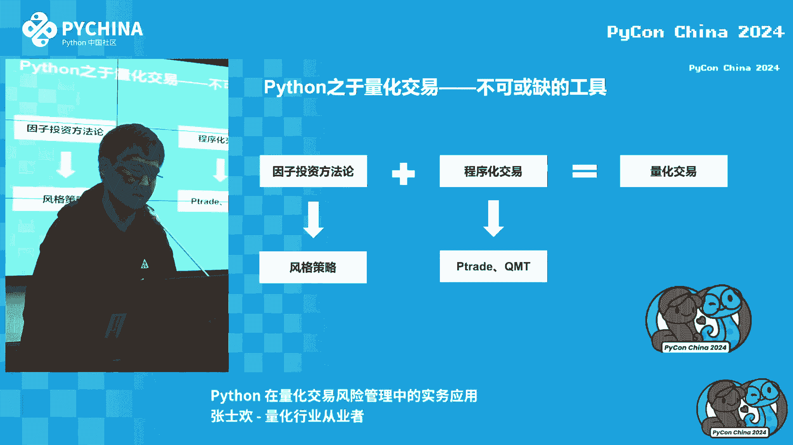

然后呢我来简单介绍一下，就是这个投资风控中啊，这个常用的PON库，那么根据我的个人经验呢，主要是我是这么几个，第一个呢是那个威哥派，那威哥大家都知道，这个是在金融机构里面。

非常非常常见的一个专业的数据源的工具，三，你包括像比东方超越，则还有相同同花顺，但是问题的这个市场占区别大，它有一个接口，就是winner派，可以通过这HI接口与搜索取，这个提取你想要的一些的生产信息。

哪怕是一些股票的基本面信息，或者是这个股票都可以提取到，第二个就是pa pa，这个它是一个非常经典的一个数据处理工具，你可以把它理解成这个excel啊，还有一些不足，你可以就是操作excel。

面对一个矩阵来进行数值的变换，可选嗯，Is that as a rat，rat的话要做科管理自己的实力，你是经常经常需要运用的，就是因为我们要算一个增减价，减价值就是那个80半折的话，你也可以看到嗯。

右上角的这张图，那这张图呢它是正态分布的，但但是现在我们用的一般都是类型的，这个是基于正态分布的一个原因呃，然后你你再看这个bug的时候，你要常用的一个函数是这个N派等等，分条这个函数。

那么这个number派点和增tax1的那个，就意味着你的投资组合，大未来的一天有99%的概率，而做的最大的损失，那个一般人进就那么30天的话，那你乘以根号十就可以了，呃，第第四个的话。

像那个SKN那个模型编辑工具，SKN是期待一个通通新概率的风控，现代率的公共环境，不像那个阿里巴巴呀，他一些消费金融啊里边你做静态风控的话，那这个分认识，你必须要必须要走那个模型方法呃。

你像我们这种的话，在做也不会讲里面需要用到回归分析，回归分析的话也需要调用里面的一个库，就是这个in the regression，这就是一个最高，我们看到这OSOLSS的位置，就是用的最小转法。

嗯那最后一个是指METROID，这个词要单设置一个图表的数据，相当你要把你计算出来的数据进行一个可视化，嗯你可以用这个来生成一些报告，会会比较在工作中也也是比较好常用到的，呃下面就着重来说一下。

这个用配平台时间量化风控中的风险界点，和这个组合优化包装mod，因为其实我们这个风控来说的话，还有很多问题问题，你包括像额市场风险管理里面的规则模型，规则绩效规定模型，还有这八二小。

还有包括像这个债券投资领域的呃，肯定等于这个集合并模型，但是它的模型有很多，但是因为今天讲的主题是这个量化投易，所以还是要落实到应层面去，这个来讲话对，那那对于本质的东西还是玩二了。

如果说您在以后想代码和以往这个模型，也是你必须要需要化的问题，那么我们来讲讲实战的包装，就是一般来说在上世纪的中叶，大家都普遍认为市场只有一个金属大，那就是贝塔。

根据依据这个第一个资本资产定价模型这名字，贝塔后来到了70年代的时候，那么有一些专家学者就发现诶，这个按照市场上的某种的风格进行打包，打包的股票，它往往可以一定程度上，这个事情。

他还会拥有更高的收益和更稳定的这个收益率，由此他们就开发了这种三因子的东西，资产带来各种资产定价模型的基础上，加了一个市值因素以及这个价值因素，就是这个公司里面所提到的BH是MM，那么什么是市值因子。

就是简单来说就这个票的规定的多少，你是十个亿，20个亿，50个亿还是100个亿，那么价值因此就市盈率比你的每股股价，比你的这个每股的净资产，那么这个公式里的FI和这个hi。

就是分别是对应了两个因子的敏感度，可以说他是把你于是把一个贝塔因子保存库哦，包含一个十英六因子单怎么写，嘿嘿那么后来呢等着我，我们这个电脑技术的发展，包括世界上的一些股价的信息啊，一些行情信息啊。

都越来越丰富，我们这个数据的质量，还有这个数量都起来了之后呢，然后我们的金融的机构，我就发现可以做一些更多的事情，那么里边呢就要提到一家公司，都是比较知名的民政民政公司，这可咋样。

那么他就开发了这个二型，它将就是从上世纪的一个贝塔因子的模型和，呃呃呃和这个包含有视频因和价值因素，三连等模型到有六个有八个一级因子，六个二级因子的这么一个分子模型，这种。

那我们可以看到最下面的这个公式，它反映的就是资产的收益，那K呢是因子K的收益，那必然来看的是资产行业对地太，因此暴露被动案是资产行业的特别性收益，所以说你可以简单的把八卦描述给固定的，八个一级分隔因子。

以及16个二级分隔因子，这样的一个模型分析方法。

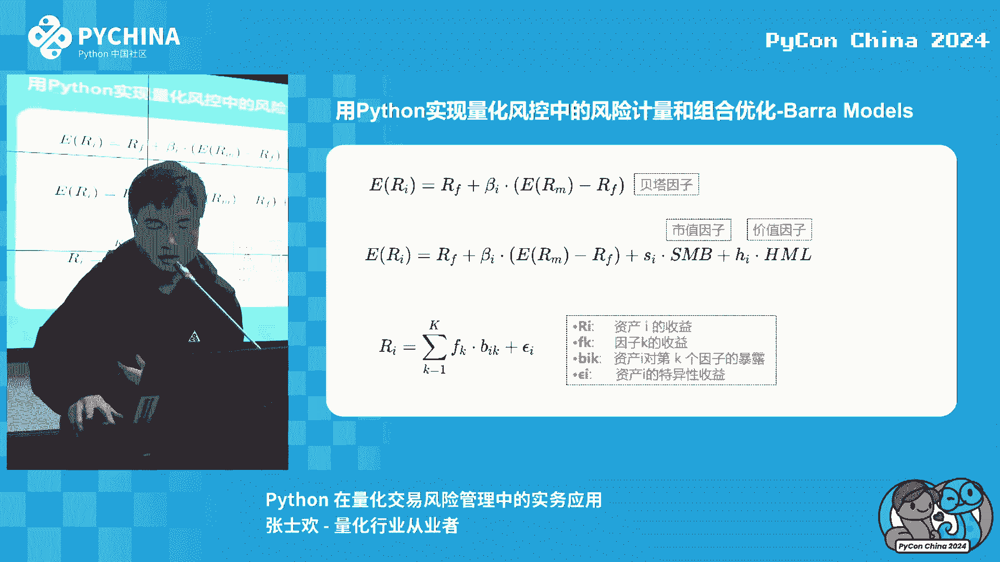

那我们来简单谈一下，就是如何来进行一个，通过这个八二多子多因子模型来来回整，这那么这块我首先和大家说的是，我个人是不太就是不太建议明智，就是单枪匹马的去进行一些因此构建工作。

因为就是里面会有一些非常细微的地方呃，首先你要你要依据不公开的这个官方的，这个方法很大，然后同时还有一些相互需要调节的一些，细微支付呃，你的零上上我家电上的构建这个模型，当时是花了差不多大半年的时间。

来进行一些因子的检验和考虑，但如果说您是那个在我当时比较希望，可以在作为一个毕业的，给三五个人，三五个人一起来合成的其中的一个因子哦，可合成一个音，哎，你们说也也算是可以体体验一下。

这个因子的一个合成的方法，首先他有一个30 1米3级因子的计算，就包括这个分隔因子因子啊，他是依据一定的算法文章来来进行复制的，然后呢有了30英语之后呢，你要进行一个麦的去机制一个过程。

然后你要对这个分子离子，进行一个有效性的检验，包括一些方法，一点点这个学统计学的应该都不陌生，还有一个机体系数法，还在IT的话，就是因子也照镜因子要性，它实际上就是人物因子啊。

对他的下一个呃周期的周瑜率的关联度，然后给它算出来额，另外还有一个就是英特的稳定性含量，它实际上是对这个C的就是唯一标准差，然后你从这个三级因子有了之后，你要把它分成二级，二级因子的话，成这个一级因子。

那么其中我提到的就这个全日制的处理，对他有些股票它不定时定都有对吧，他有些可能是缺失的处理，我们一般的处理方法是呃，从实务上来说的话，我们可以选呃同个行业，然后不同市值的股票，他他有无这个因子。

我们进行进行一个替代就可以啊，我一般怎么处理呃，另外的话你在合成一级一级因子的时候的话，也有三种方法，第一个是填充严重就比较简单，这个它某个因子它等于是三个因子，我比每个因子给它分3。3呃。

然后第二个尝试就会出一点，这个你这个你你就需要判断，你比如像那种贝塔因子，贝塔因子我们说一般来说如果你的市值越大，公司你的你的股价的变动，对于整个市场上的影响可比市值小，对于市场市场很小大。

所以说理论上来讲，我们可以给大市值的来增加更高的深度额，第三个是你还得加钱，这个就是你可以看你可以根据有不同啊，不同股票的一个关联度，一个不同的程度，呃然后的话你就会得到那么一堆因子因子的值。

然后由机因子说话都可以做一些应用，那么它的应用我们主要分为两个方面，第一个方面呢是因子收益率的分析，第二个可选性理，我们知道我们刚刚这么一系列，得到的是因子的实力是因此的暴露，但是从粒子的暴露。

因子收率第一我们依据的是加权最小，实际上我们可以把一个股票的这个收益拆下来，收益率加上他所在的这个行业的收益率，加上它所包含因子的收益率，加上能够对上述三种我解释的剩余部分，我们称之为特质性收率。

呃然后其中你还要为了方便计算，你可能需要对行业做一些中性化，说是这个行业，你把那个系数变成一，那么是那个行业，你把系数改成零，然后构建一个违规矩阵，这样的话就可以得到因子的值域，额。

然后有的因子的收益率在三分子的暴露时，那么我们就可以进行一些分格权重的优化嗯，他的最核心的在那，这个代码相对于真正的技术大佬大佬来讲，这个代码我没有看到任何额，如果就是我们这个日常工作中，可能小平板呃。

首先呢就是要提取这个因子的包容度，然后再获取因子之余额，怎么计算它的因子的贡献率是什，他的这个作业占它的暴露值就对。

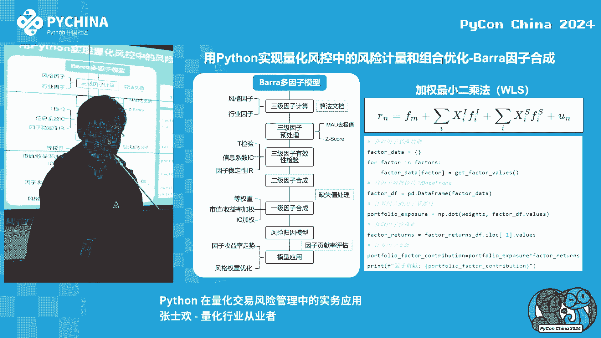

呃然后的话就是我可以给给大家举一些实例，对啊，你比如说在这个今年的7月份，我今年的9月份，我们大家可以观测中等视频，就是这个黄色的这个系和这个视觉因素，就来自这个线，它基本上是存在着一种相当的东西对。

所以说如果说我们合成了因子之后，得到了这个因子收益率，我们实际上是可以做一定的预测额，就是比如说你的业务人员，给你任何一个策略实测，比方说它是一种红利的策略，是聚焦给公司的符号，然后认为你教你什么。

后以结合当下的因子的思维，那你一般会给他提供很大的建议，不能在有绝对分时，那么毫无疑问你可以提这样一些建议，因为当下这个中等市值的因素，否则比是零主，否则比小市值公司要好。

所以做这就是你可以在在干加一种，他这个等取一些中等式的嗯，嗯中等市值的，比如做第二道事情，第二种事情啊，这是你可以说的一些关联化理解呃，第二种呢就是比如说你每天跟踪这个弧度，然后你发现像你这个组合的话。

在你的音准上，他是暴率比暴露比较重的，但你音上暴率比较低，我们可以看，因为这就是模拟一真实的情况，就是说他可能在这样，在这个贝塔这个生长因子上面，他也有多高度，他也给他贡献了。

所以呢是这个价值因子以及这个是原子，所以说我们可以要求他的竞价值，在接下去调整中，可以要简化这个视频因子以及这个价值，因此呢对他的负面影响，这个我们上述这些点，就是比如说你可以在供应管理数据中。

给你的其他同事提供了一些相关的一些方法。

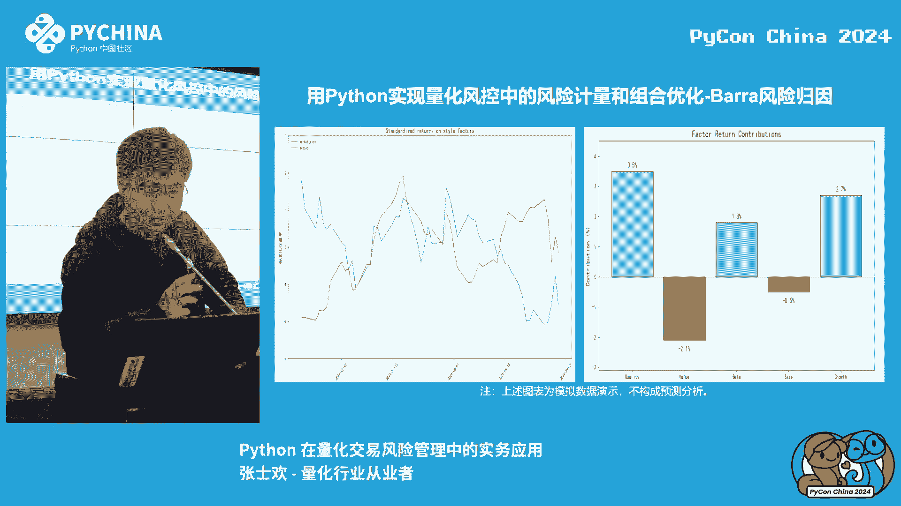

嗯好的，那最后呢我们来看一下这个书籍的推荐，前两本是不是要做A吗，那你是肯定要同样的，就是那个就是石川老师那个离子投资的方法，这个这个让你去哪个地方能听，进行一个量化教育，他都给你推荐的呃。

第二个如果是你要是做风控，然后去继续开始进入分区域位置管理，那比如说像上上面有的，他可能就对二题不感兴趣，他可能还是比较喜欢放贷的，那么如果说你要是只对于放贷的话，那你可以就是想做一个静态分红的话。

那我就推荐你第三种智能风控时间指南，我请客着急啊，这个理解是错的，这个以上就是这个这本书，大家可以去看看，可以自动看一下呃好的。

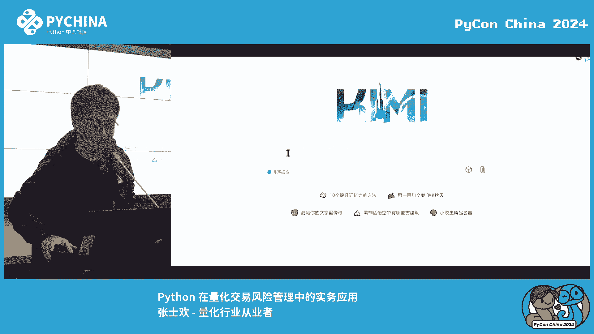

反正以上就是文字内容，然后大家有什么问题的话。

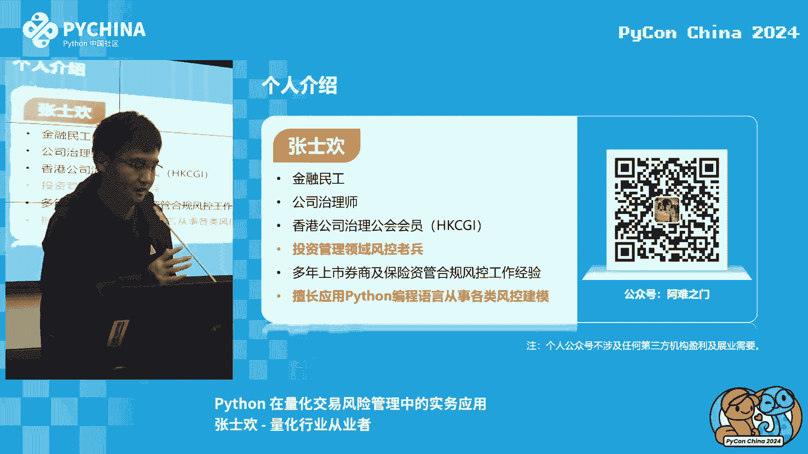