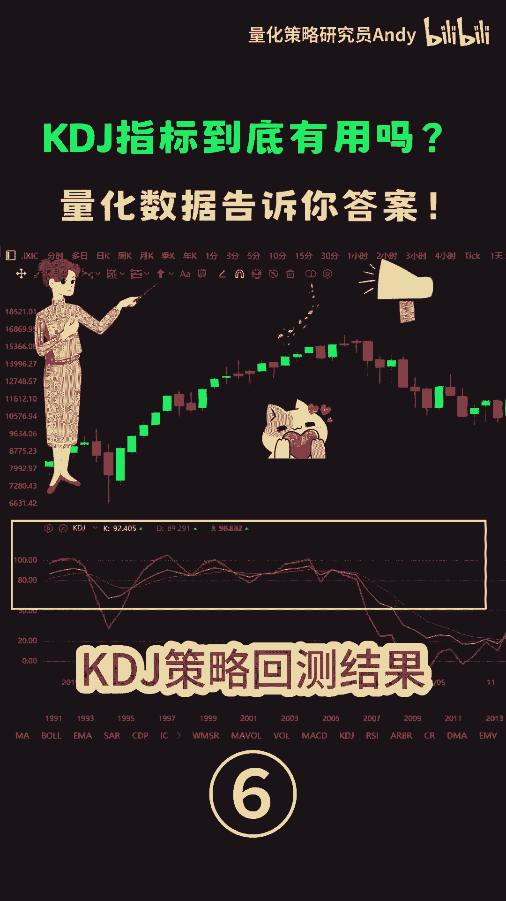
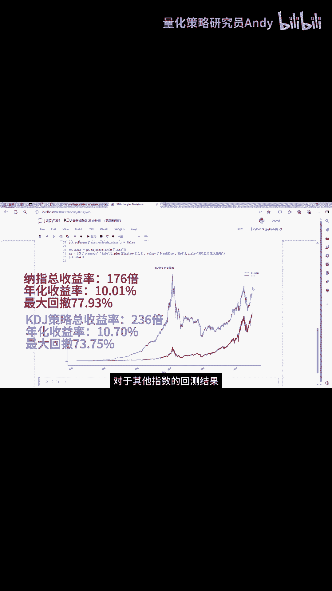

# Python代码回测KDJ指标策略 - P1 - 量化策略研究员Andy - BV1kZ421M7Yf

我们定义一列KDJ下划线cross，用来判断金叉和死叉，下面就是根据金叉死叉来构建交易信号，并计算策略的收益率，我们运行一下完整的代码，可以看到图中这条红色的曲线，是那指有史以来的走势，图53年的时间。

整体的收益率是176倍，年化收益率10。01%，最大回撤77。93%，图中这条蓝色的曲线就是KDJ策略的收益率，总收益率达到了236倍，年化收益率是10。07%，但是这个策略在2000年的互联网泡沫。

以及2008年的金融危机，最大回撤累计达到了73。75%，从以上数据可以看出，KDJ指标简单的金叉，死叉策略并没有获得显著的超额收益，反而还出现了巨大的回撤，当然同期纳指的回撤更大，但是总体来看。

这个策略只比那只稍微好一点点，仅仅只是一点点而已，对于其他指数的回测结果也是大同小异。

