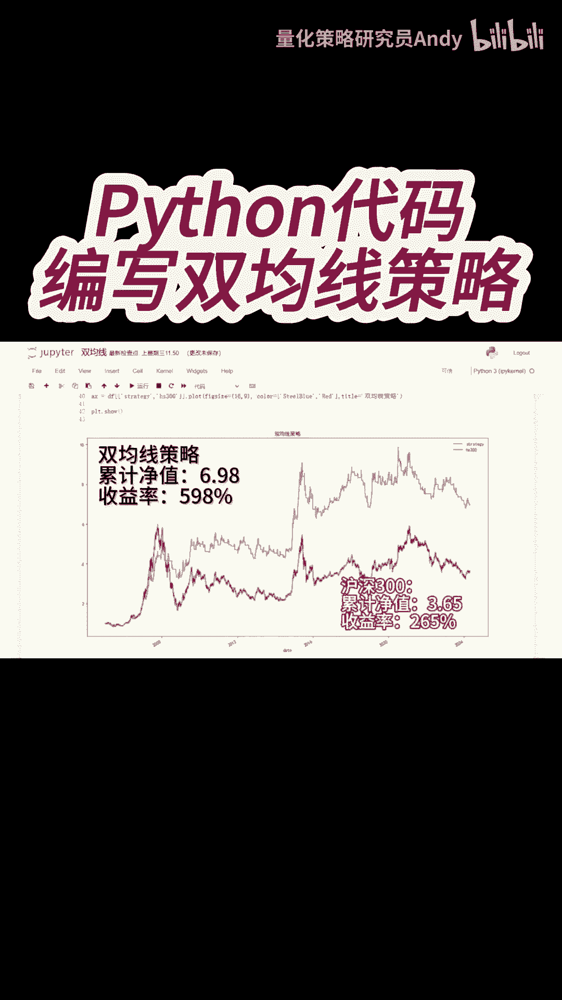
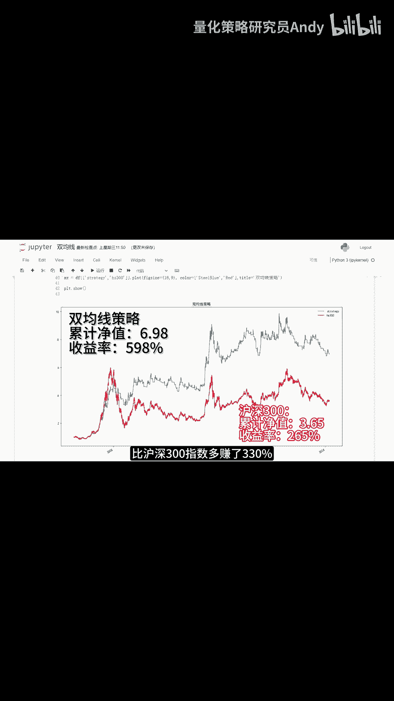

# Python代码编写双均线策略 - P1 - 量化策略研究员Andy - BV1iE421j75D

现在我们构建如下的量化策略，当5日均线上穿20日均线时买入，当20日均线下穿5日均线时卖出，好，下面我们来看一下代码，第一部分是获取沪深300每天的收盘价，接下来是计算5日均线和20日均线。

这里的均线是用简单平均的计算方法，然后再计算二者的差价，因为下面我们是会这个差价来判断策略的信号，这里是计算沪深300每天的收益和净值，并初始化仓位标记，接下来就是根据两条均线的差值，来构建交易信号。

最后计算策略每天的净值，并画图显示，我们运行一下代码，可以看到，图中这条红色的曲线是沪深300的净值曲线，从2005年至今的累计净值是3。65，也就是说收益率是265%。

而图中这条蓝色的曲线是我们的双均线策略，累计净值是6。98，收益率598%，比沪深300指数多赚了330%。

