# Python前端DASH实时输出可视化金融数据，全程干货，代码分享！ - P1 - 爱吃海南鸡饭的磊哥LG - BV166sheVEbT

大家好，我是爱吃海南鸡饭的磊哥。今天呢想跟大家分享一下，我写的一个代码是在这个油管上看到的啊，这个作者呢是叫呃factory。我给大家找一下他的这个照片啊。s。🤢，Acur。对。

这就是他在油管上那个这个。我也不知道他是这这个照片我是怎么截的啊。😡，本来挺帅的一个小伙，而且也是个大佬级别的。他我是订阅了他的这个。😊，啊，它的频道嘛，然后它有很多这个好用的东西啊。

我也我我现在目前的话也在用啊，而且效果非常的不错啊。然后呢，它其中一个。作品的话呢就是咱们这个今天想跟大家分享的这个dash。呃，有些同学可能了解，有些人可能不太了解这个dash到底是什么东西啊。

它是flask的一种，它是属于pyython的前端设置。

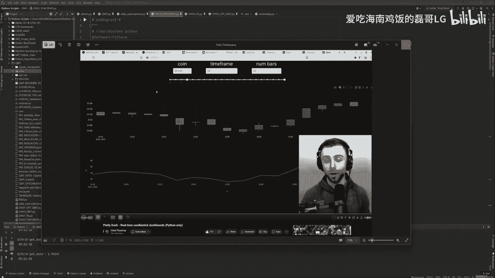

嗯，我给大家展示一下。这个就是我根据secary的这个。代码，然后呢又结合了一下我喜欢的东西啊，喜欢的指标，然后呢进行了一个呃加工制作。那大家可以看一下，我这边的话呢是一个10分钟的柱状图。😊。

然后看的是沪深300的ATF。因为我平常是做这个期权交易，所以说而且这个底层资产的话呢，是这个沪深300。所以呢我就是默认沪深3000分钟频率啊。然后大家看一下这个蓝线啊。

这个蓝线的话呢就是阻力位和支撑位。这个呢也是这个factorckerary的代码，是通过机器学习的。😊，机器学习的这种。变换方式这个怎么是上上涨下跌的一个转角啊。找这个区间的这个minma和mimma。

这是minimma，这是maximma，然后呢进行这个机极学习的一个运算。然后它自动生成的这么一个阻力位支撑位，这并不是我画的啊，这不是我画的。个人画的话跟这种机器算出来的还是不太一样的啊。嗯。

大家感兴趣的话，我也可以把这段代码的话呢也录一个视频跟大家分享一下。然后下面的这一个呢是就是volume啊，大家可以看到volume是这个交易量。在上周五收盘的时结尾的时候呢。

我们这边的话呢大兄弟有一波好操作啊，大家可以看到这个从。😊，下午2点附近啊，2点2点10分左右就开始放量。啊，感兴趣的同学呢可以在这块加1个ETF呃，300ETF这块加一个。100万。

在10分的钟图上啊，在这个100万这个交易量这块可以加一个横线，或者说给自己做个提醒。哎，如果他这个交易量超过100万的时候的话。😊，可以提醒一下是吧？然后我们可以看一下。

今天早上直接放量了到这个300万的量，因为什么呢？因为今天早上有这个。😊，降低这个房地产。那对房地产有这么一个利好啊，咱们这个贷款利率有下调啊，这前一阵子已经有小作文了，但是今天的话直接坐实。

然后明天的话呢，就是期权交割日，今天是准备直接打爆空头啊。😊，早晨就来这么一剂猛药啊，然后我们可以看一下，昨天的话呢，它基本上也没有下跌。在这个。😊，3。2块。233。283这块啊。

一直是有一个非常强的这么一个阻力位。支撑位啊，对不起，是支撑位啊，哎呀不下跌啊，代表说什么呢？咱们市场还是非常强劲的。然后昨天收盘前大兄弟也没有出来，就代表说什么呢？😊，嗯，发射了一个信号。

就是周五的时候，大兄弟觉得。这给出来的信号非常明确，而且它跟以往不一样的一点是什么呀？它是从2点到2点10分开始拉升，一直呃拉升到收盘。😊，哎，一直拉升到收盘，它都没停，一直在放量的走。对。

所以说这也是不一样的一点吧。在近期的这么一个观察啊。😊，然后下面的这个的话呢，是我自己。通过一些个人的喜好吧，是RSI14频率，然后结合CCI25和CCI50啊这么一个。

indicator就是这个技术指标。对嗯，我是怎么做的呢？我是把RSI啊，从传统的20到80这个区间啊，我直接减了个50下去。😊，嗯，因为RSI的最高是100，最低是0嘛。我减了50的话。

其实就是上下50和-50是这么一个波动哎。😊，如果他要在零线以上的话呢，就50以上嘛，就是以前的50以上，现在变成零了嘛。哎，50以上的话呃，零以上的话呢，它就是一个。嗯。

一个bullish的一个一个一个信号，50以下就变成了一个beish的这么一个信号。嗯，这个的话其实跟MACD有点像，但是我不是用MACD的代码吧。😊，比较繁琐，我也懒得去写这个了。正好前一阵子的话呃。

在有看到有人分享这个RSSI和CCI的这么一个组合。我也说准备尝试一下。然后今天的话呢也是做一个可视化的一个实现吧。😊，然后CCI25和CCI50的话呢。

它它其实它也是跟这个短期跟长期的这么一个呃结合的一个使用。我们看啊这个CCI他这个。教程里面是写的什么呢？CCI这个比较明显的一点是在这也是在周五的那个收盘前，我们看看啊CCI短期25上穿长期50哎。

过零线。😊，然后RSI也是above zero啊，零线以上。量交易量放开趋势往上走。哎，这一波的话，如果要是说。哎，通过咱们这个有一个小小的这么一个。是吧量化分析嗯，然后看我们这边有个筑底，这块有个3。

25块。的一个阻力位，哎，过了阻力位建仓止损。3。237，然后我们止盈的话呢是在。呃，突破这个阻力位，然后。变成了支撑位下调，也就是在昨天的。10点10分左右的话，其实咱们就可以止损了。

咱们这一波的话呢，可以是抓到大概。呃，三个价位那差不多三个价位嗯三分钱。相对来讲还是不错的啊。呃，那我们现在看一下我这个代码是如何实现的哈嗯然后1。1点给大家介绍嗯。😊。

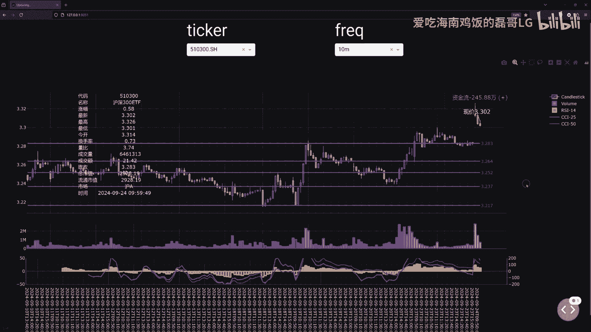

那我们可以看一下。首先啊首先一点，我跟大家想说的是什么？第一行你的代码的第一行一定要把这个写进去。因为咱们有些同学也也包括我啊呃，我有我在代码里面有包含中文。😊，有中文文化的的确是个问题。

所以说第一行一定要把这个声明coding等于UTF杠8GBGBK也可以啊，不可不用有这个空格啊，就是coding等于UTF杠8或者GGBK。😊，这样声明以后，咱们的这个。

pyython的文件才可以正常的运行，要不然的话是运行不了的。大这个这个问题困扰了我半个小时，最后解决掉了啊。然后我们再看一看其他的嗯，我们。有这个dash的库啊。

然后inport dashDCCHTML嗯input output啊，然后这后面的话我我们会一步一步来。然后还有一个库是什么？dash booststr component。

这个是下面可以看到这个是一个这个themees。然后这个sme叫syborg啊，这也就是我跟大家分享的这个纯黑的啊syborg这么一个主题，呃，视觉看起来还不错啊。感觉还可以。当然了。

喜欢喜欢这种东西的同学呢可以弄一下，不喜欢的话也无所谓啊。这个不影响咱使用啊。来我们去网上看一下。呃，至于这个dash的安装的话呢，其实还蛮蛮简单的。如果你没有装这个或min的话。

你就 store在你的这个环境内啊， store那个就可以了。如果咱们是装的是minicon或者的话，它是自带的啊系统自带的。所以说我们就不需要这个呃更多的安装啊。

然后呢我们看一下minicon3最新版本的话，是。😊，康达24。7。1，然后python的是3。12。4。这个版本我试过了，不建议大家使用，为什么呢？

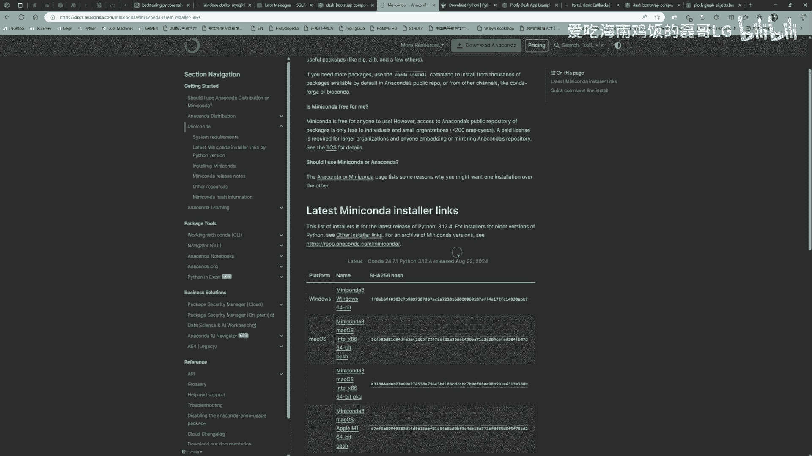

3。12。4，它还是bug fix，那3。12是bug fix。不稳啊不稳不要用。我建议大家用是用3点。10。15这个版本可以3。11。10这个版本也可以。这两个版本都可以用，很稳定啊。

为什么10和11是security版了啊，它不是这个bug fix版。所以大家这一点的话也要注意啊。😊。

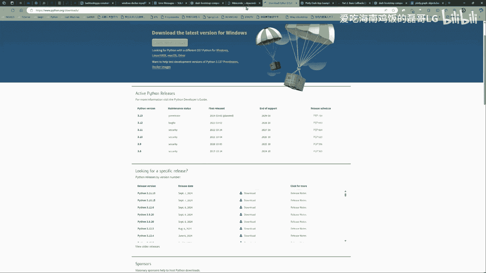

然后我们再看一看，这是prop和这个dash，他俩是一个一家公司出来的啊。然后在大家可能在可视化的话，更多的是用这个map和这个sboard。还有可能还有一些其他的库啊那。相对来讲，如果要是这个网络。

就是前端输出啊这种前端的互交这种的话，最方便的最好的平台。目前的话也就是dash，它是flask这个底层代码啊，然后呢通过pudly来进行这个画出来的对，后面的代码。

我我的这个可视化输出的代码也都是pud。这个dash和这个pau亚还是非常方便的。我们可以看一下，它这里面有很多个这个介绍，还有video。image video audio的这么一个。

然后还有 machineine learning啊，然后还有sport analytics。这些都是这个数据可视化的一个非常好的一个方向啊，感兴趣的同学的话可以往这方面发展。咱们这边是finance啊。

😊。

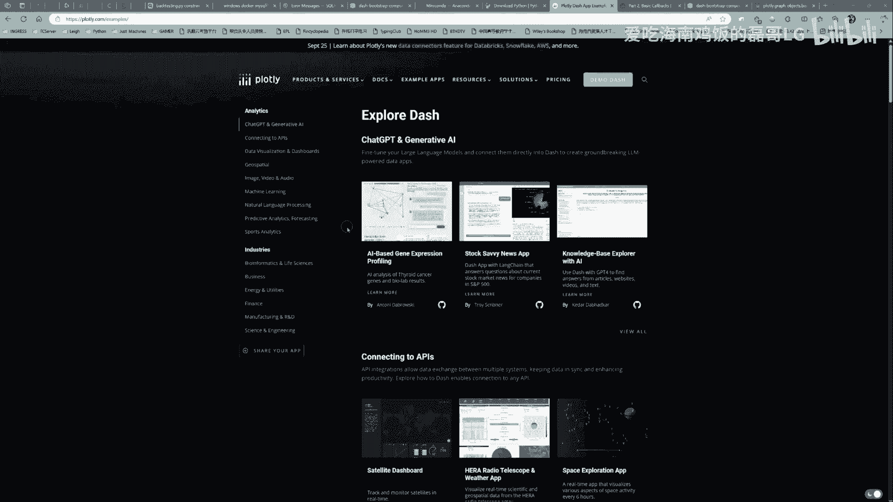

就是可视化嘛。我们再看一看他的这个documents，但这里面教的也是非常的细的啊。😊，你需要的哪一块的代码，然后他这边的话都有详细的这个给你呃解答解读啊。

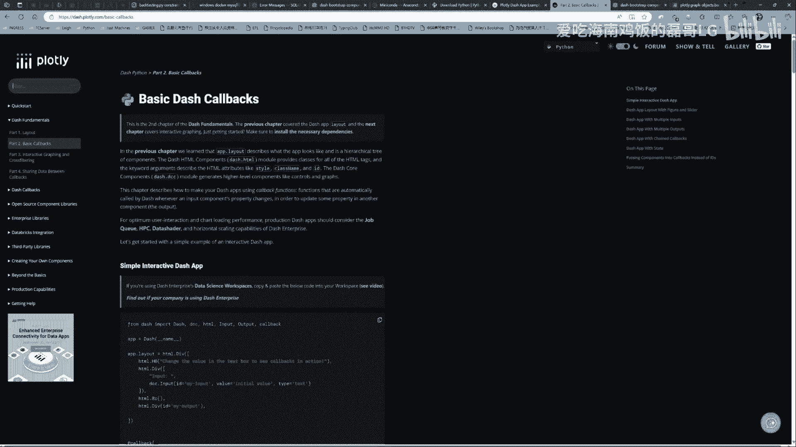

然后刚才跟大家说的这个嗯bootrap component，现在是1。6。1的版本，然后你就复制粘贴到你的环境里面，它就安装好了啊，非常方便。😊，然后这是我之前那个在看。之前跟大家分享的嘛。

这个RSI我是从线变成了瓣儿的形式。那它每一个瓣的颜色的话呢，其实它也是通过。这个line这个参数来进行一个传递的啊，它是在下面嗯，给大家看一下。啊。

找到了这个参数bar mark line line下面有什么呢？有个叫al autoto color scale，就是咱们这个呃。

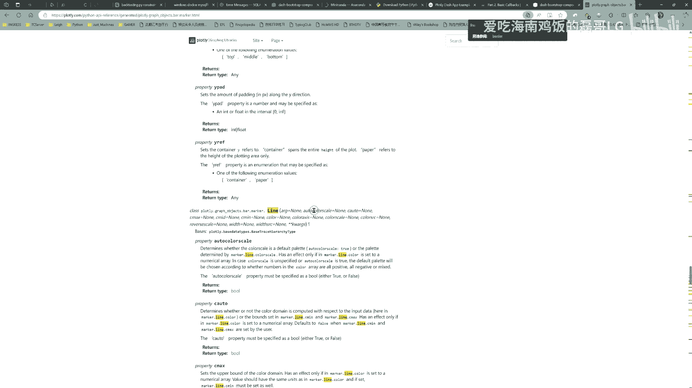

Liangyu。这个RSI我是通过了这个。渐变色啊。就是如果他要是有这种明显的变化的时候的话，他这个颜色是跟着渐变的。这样的话对于我们这个。呃，在短时间内需要做出判断的时候的话呢。

是有一个非常好的一个视觉的冲击啊。我当时是出于这个考虑来来来看这个参数。一会儿的话呢，我们在代码里面也会看到啊。😊。

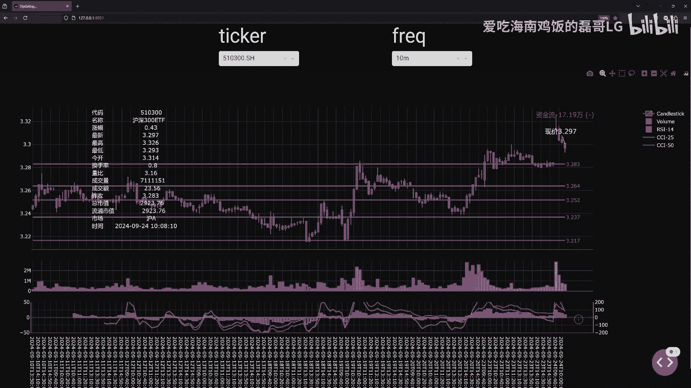

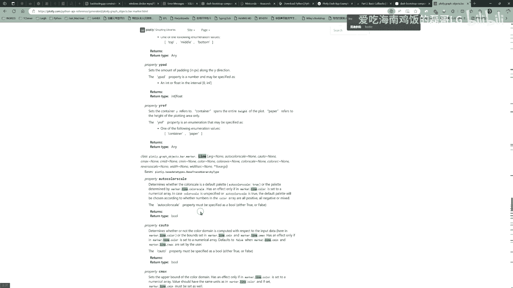

好，那我们再接着回到代码上面啊。然后这个普通的库大家就都很熟悉了啊。😊，哦，对，这上面 polygraph。object啊这个一般的话大家都用go啊graphra objects用够来来这个。然后呢。

我是用了，咱们是用了三三个这个suppl。

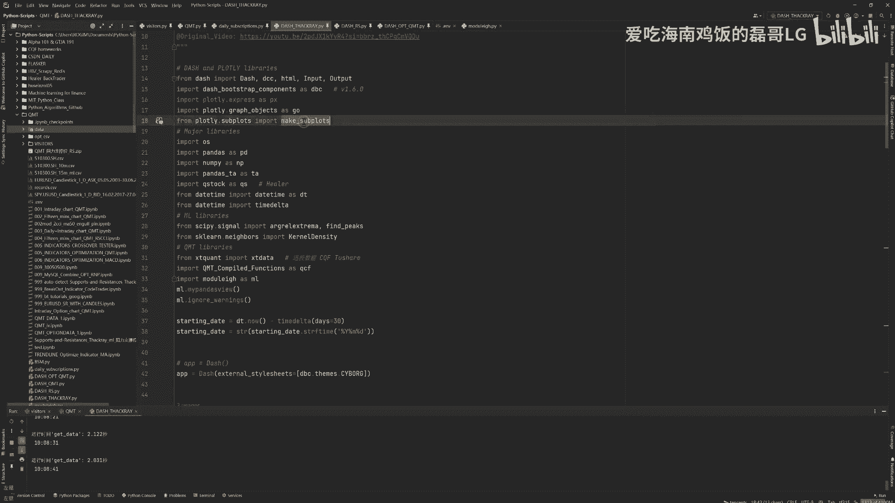

一个两个三个啊，这是三个图啊。

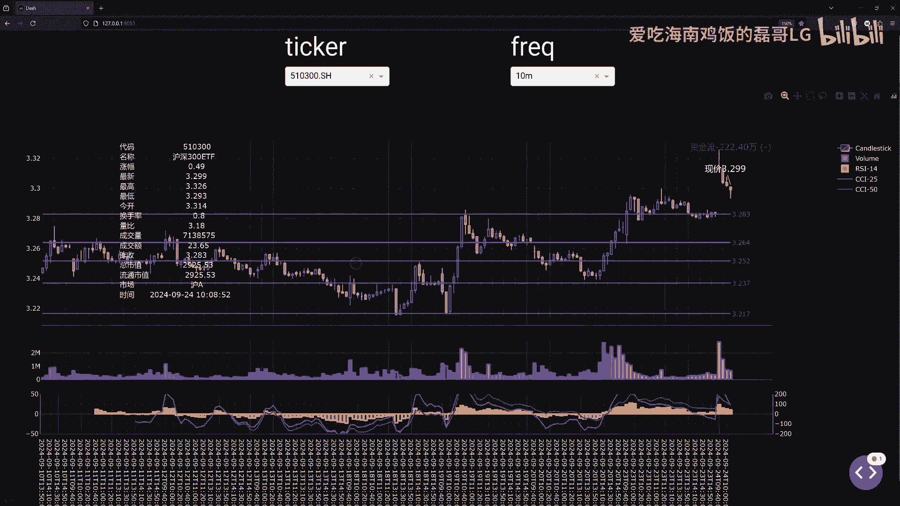

所以说我们要用这个suppl这个参数啊，然后下面的话呢是OS panda panda TA这个主要是做这个技术指标的一个计算。Qstock的话呢是我的这个量化导师呃，heer。

他的那个微信名叫hiler，我一般都管他叫heer他的。他自己写了一个库非常好用的他的一个金融库啊。我们在后面的话，下面的这个代码里面有用到他这个实时数据的这么一个呃参数。

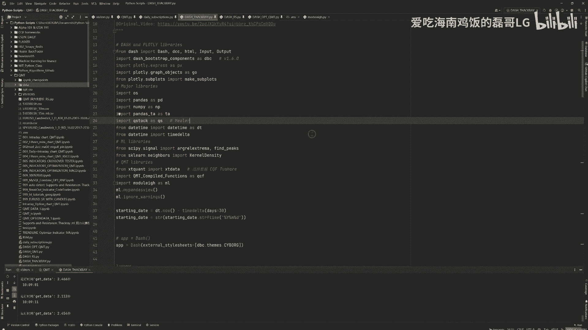

函数啊。放在哪儿了呢？这是一个这是一个啊。另外一个的话是在这儿。啊，另外一个是在这儿。对，这两个是通过Q stock来实现。

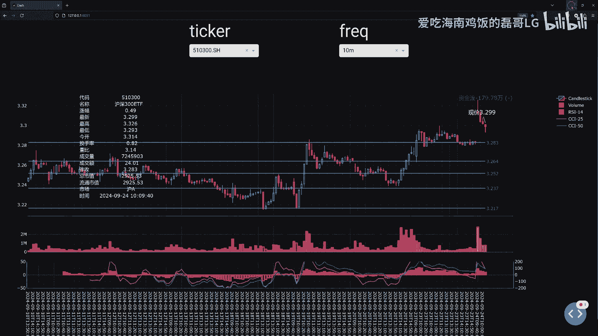

然后下面这两个就是这个机器学习的这两个库啊，一个是s拍 signal的。Our。argument relative extreme啊这么一个库啊，RX R dream啊哎呀。

然后这个呢还有一个是fine picks啊，fine picks picks是什么？就是。picks这就是一个上P，这就是一个下p啊，ps然后from。啊，这SK learn的一个neighbors啊。

我们要算这个denity，它的一个概率嘛啊这是 kernelnal density。这这个是我们是来算这个。😊，这个pak。和他的这个。波浪我们给smth以后，他这个波浪的单磁铁，它是通过一个呃。

函数来进行计算的啊，正态函数哎。然后下面的话呢，就是我的这个量化库。我的主数据的主要来源是从那个讯投啊，他之前的话呢是跟我们CQLCQF协会啊有这么一个。互动。然后呢，我是看到了他们的这个。

看到了他们这个路演，我觉得还不错。然后之前是用to share来来做这个分析的。但是to share在这个期权上面的话，它是只有收盘的时候才有这个数据分析，在盘中的话是没有的。

所以说后来的话我也就是转投了。但是当然了to share还是很优秀的，我也一直在用啊，目前也在用。但是付费的这个大头这块的话，是转到讯投这边啊，感兴趣的同学的话可以留言。

然后到时候我们我可以我我也可以出一其实关于讯投这边做这个期权的一些代码的分析啊，然后毛竹力，我姓李，毛主正好跟李这个重叠了。这是我自己写的库啊，这个大家可以看一下，这我自己写的一个库，主要就是一些参数。

😊，我不想在每个代码里面都重新打一遍，我这些参数什么的乱糟糟的是吧？看着不美观，那我直接封装一个自己的库，然后这样的话就会方便很多，然后直接导入就行了，是吧？😊，嗯，我们看看啊。

我用的这个staring date是在30天的啊，你也可以自己调，因为什么？因为我们是要streaming，对吧？我们是要实时的这个数据要进来啊，大家可以看一下这块。😊。

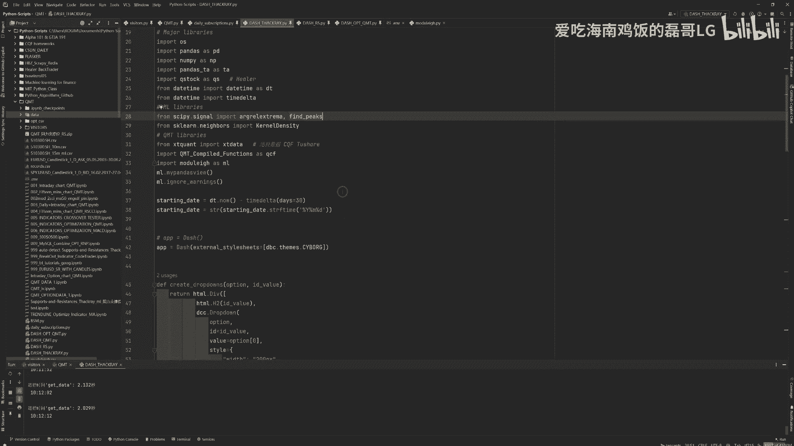

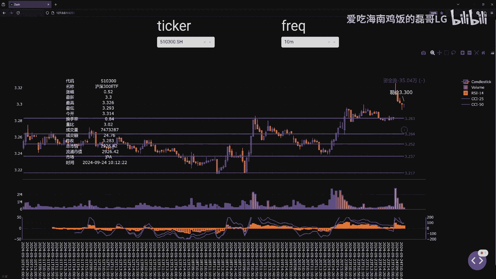

我设置的是每3秒一次每3秒一次。那如果你的数据太大的话，它是不是时间会就是他的这个。量会太大，量大的话，肯定输输药的时间也会更长，对吧？所以说。也要看好也要看好啊。这个判断就是说设置好这个时间啊。

哪捏好别。

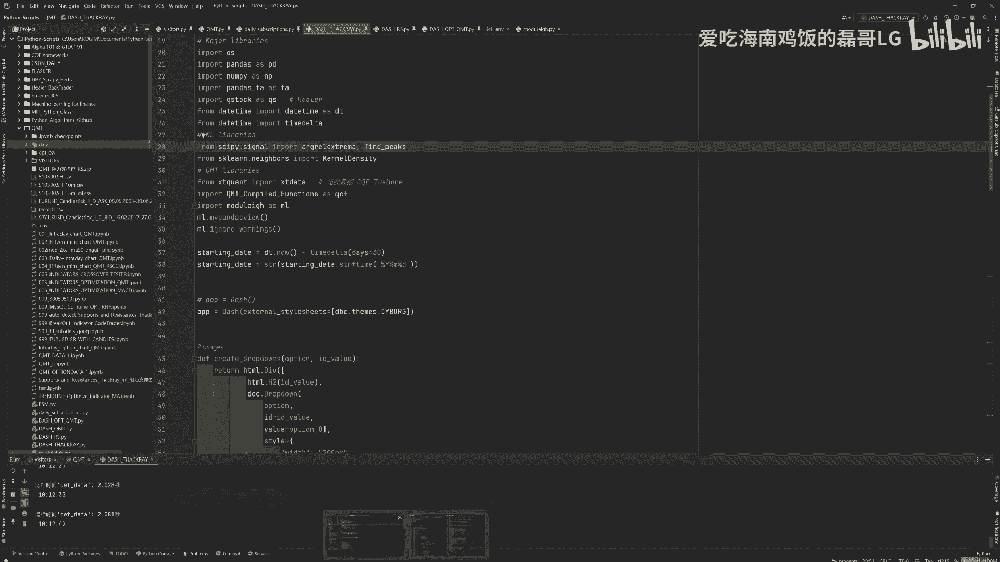

也别整太大，当然了也别太小，太小的话，我们需要分析的这个。😊，还是需要一定的量的啊，也不能太小，也别太大，刚刚好就行。其实我也可以尝试设置成两秒或者一秒。当然了，那这个如果要是代码跟不上的话，它就会。

😊。

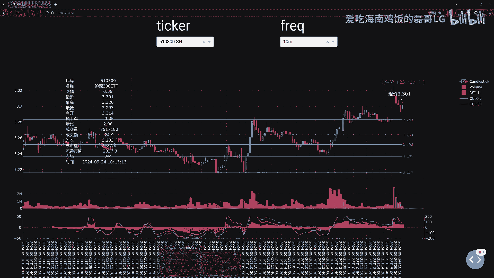

爆掉是吧？看自己啊看自己。然后我们看一下，这是这主要的部分，其实是在。其实这块是一个dash的一个主要的部分。这我们首先的话先声明这个app等于dash。然后括号就行，你要不喜欢theme的话。

你就括号就可以了。然后主要的部分其实在这儿app点 layout等于HTML点。这个。Dive啊。这懂这个互联网代码的同学的话，肯定不陌生是吧？这些都是其实这个就是啊d的话，其实就是把这个。😊。

把这个互联网这个网站的代码。通过java的形式，然后又又编译成这个pyython的这么一个输出形式。然后进行一个打爆。其实其实懂的人的话，这些都不陌生啊。我们先看看这个DCC的一个重要的是什么呢？😊。

interval这个的话，因为我们要更新的嘛，我们更新的频率是5秒钟一次，这是毫秒，所以要乘以1000。然后N interval是更新多少次？0零的话就是无限啊，这第一第二一点的话。

这些参数我们后面都要用到啊。第二一点的话呢是我们要更新什么？我们更新graphra。😊，那么更新life chart对吧？这个life chart也是一个重要的一个参数啊。

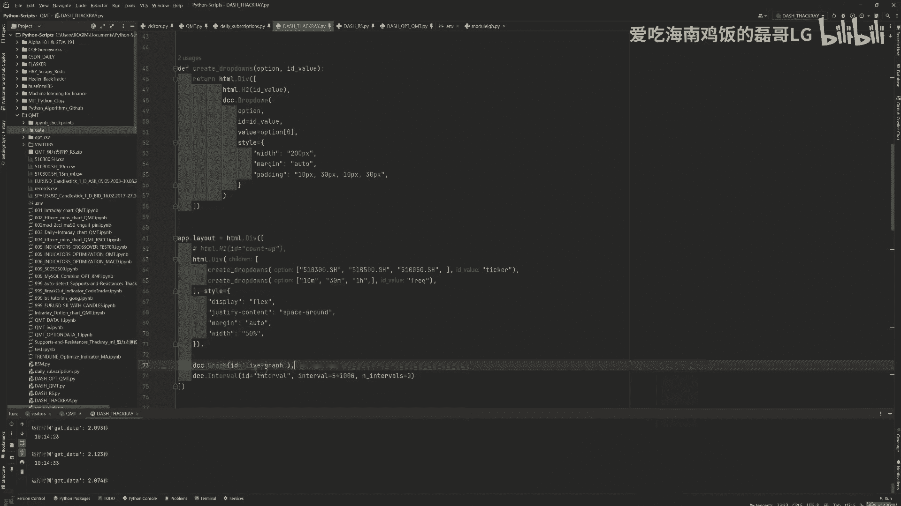

然后呢，我们还要做这个。下拉哎，这个下拉对。这两个的话呢就是create，这叫什么？这叫drop down。哎，jorop。drop down啊。就一个小菜单啊，是吧？😊。

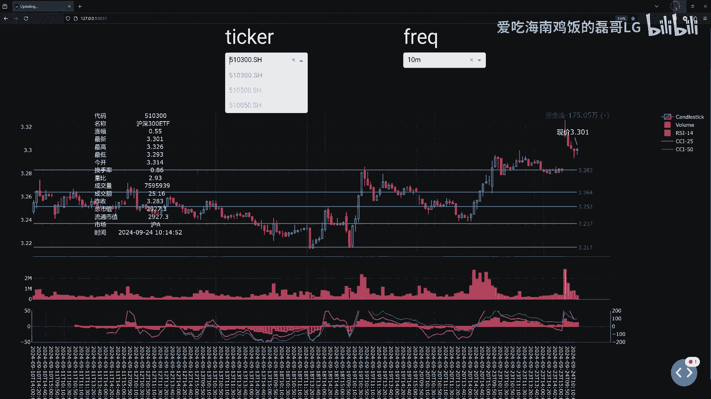

那这个job done我们里面放什么了呢？放了这些参数，然后他的ID我们每个都要给个ID啊，这个叫tickker，tickker就是咱们的交易代码。然后这个的话是叫fr啊。

就是频率10分钟30分钟1个小时啊。😊，然后这些的话都是一些参数，你你可以自己微调，具体参数是什么？你可以上网自己搜一下啊。然后这边的话我们是做了一个函数啊，专门是为这个。😊。

drop down做了一个函数啊，然后。他的话呢也是一个d的这么一个函数，它是这个H2啊，就是H1有没有也所谓，后来被我注销掉了，注释掉了。然后这个DCC的 down。

我们第一个传的参数是option这个op啊，第二个参数I ID什么啊，这给大家举个例子啊，第三个呢value它默认value是谁啊？option里面的零0就是第一个嘛沪深300。😊。

style这个就宽度，然后它的marin有多少，然后它的padding是多少，这个都可以自己。自己来设置。然后当你看到底层代码的运行时候，你看到底层代码的时候，其实它就是个javascript啊。😊。

很有意思啊。然后这个gedata的话，其实这个。先跟大家简单说一下吧。我用的是这个讯投嘛，然后讯投这边的话，我得订阅，订阅完了以后的话，我要我要什么信息啊，然后。

open hellloclo volume哎，4个tickker的话传到这儿，然后starting day我们刚才说了30天嗯。com负一就是最新的给我。然后他这个你拿到的数据格式的话。

它是一个dictionary。然后把我们把这个dictionary里面的。😊，A valueue。的通过点ites。

把这个dctionary给给分开T的话就是沪深300value的话就是你的data frame。那我们把最后一个data frame拿出来，这样的话我就得到了data frame。然后下面的话把hi。

😊，history data放到data frame里面，然后呢，我们再把da frame通过pandadas to day time进行一个把day time做成str。哎，做成str。

然后form的话是年月日小时分钟秒。然后这个air是吧是。coursese course的话是这个。如果是数字的话，它conver。如果它不是的话，他会给你个NAN啊。

这个这这个对于airs的这个处理形式，这个还是相对来讲比较友好一些。这样的话降降低咱们的报错。然后呢，我们再把这个第一个字母capitalize啊。😊，因为国外有些人打包它是大写，国内的话它是小写。

有些时候我们会用到国外的代码，那这样的话就提前吧给大家做个提前量啊，这个看你你习惯给他改就改，你不习惯给他改，不改啊，都一样啊，最后return呆了。😊，这边的话呢是有一个decorator。

这主要是计算我的时间的啊。大家对戴克这感兴趣的话，也可以啊看一看一下我的这个视频。哦，对不起，我是这个在CSDN上。对，CSDN上我有写一个关于decorator的一个是一个一个一个博客啊。

感兴趣的同学可以看一下啊。😊，然后第二个代第二段代码的话就是咱们这个计算。呃，机器学习的方式来计算这个阻力位和支撑位的。呃，今天这个不是重点啊，感兴趣的同学的话可以给我留言。

然后的话我可以做一期来跟大家分享这个代码啊。😊，然后。剩下的两个函数的话，就是我刚才说的这个Q store。第一个的话是获取。实时的数据。第二个的话就是获取日内的现金流的这么一个流动啊。啊。

这是我一个简单的一个计算什么的啊，这个都不重要啊。然后我有趣的一点是什么呢？我把这个超大主力信号，超大主力符号这块我自己做的NPware就判定了。😊，判定什么呢？主力净流入加超大单净流入。

如果他俩是大于零的话，给我个加号。如果不是的话，给我个减号，这说明什么呢？如果他俩要是大于0的话。😊，那代表说有主力资金在流入啊。然后在我们每次我们需要update figure是吧？

因为我们每3秒每5秒3到5秒钟要更新一次嘛，对吧？然后我们得把参数传进来，我们用到的参数哎。😊，让我们看这个是机器学习的那个的，然后顺便把数据也传进来。然后gas that就是这个数据。

然后money flow是这个咱们的这个资金流。这个都准备好了以后，然后我们分成3块啊，make up plot这块fiig，我这下划线按自己的习惯性来写啊。😊，这个就不做过多的赘述。

有这就是一个书写习惯。😊，主要是跟如果我要是用到fake在任何函数之外或者。或者这个在最后这个name goes main这块，如果要是如果我要是有一个fiake函数。这个参数吧，参数。

那它不就是跟这个函数里面的fiake会有冲突嘛。所以说我一般在这个函数的书写里面的一些关键的这个参数啊，赋值方面的话，都会加一个前面加一个或者后面加一个。这样的话以是区别啊以示区别。

这样的话也给咱们降低这个烦恼。因为它这个会经常报错，会有一个也不是说报错吧，就是提醒，有个叫sle name的一个提醒。😊，就说哎你这参数可能在外面有用到，有可能会影响到你的这个代码运算。

所以说为了避免这个第一是避免它这个提醒。也是给咱们减少这个不标的麻烦啊。😊，那我们看第一个数据，我们传进来的是什么呢？是dedata的这个candlestopen helllo close我就叫can。

然我就叫candlestick名字。然后我们是在。三个图表的第一行第一列啊。啊，然后第二一点呢，我们是把这个。ATM是什么？

at the moment啊at the moment哎这ATM这个缩写他有很多个说法。😊，你想叫到什么就叫到什么啊，然后我们做了一个annotation，把他的这个。

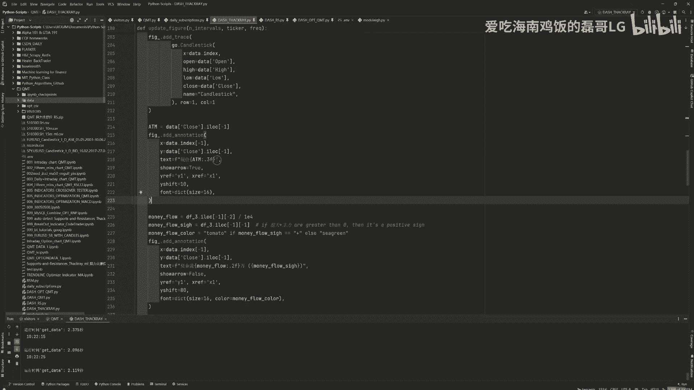

目前实时的交易价格以这种形式体现给我们啊这块。

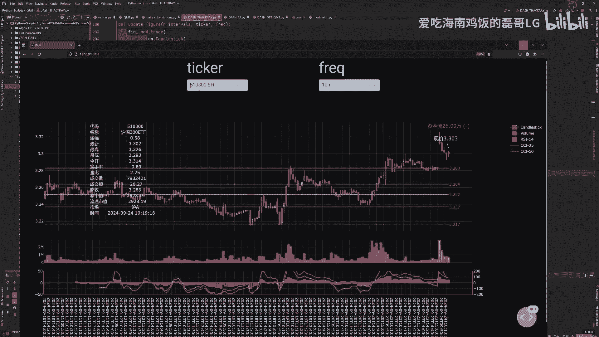

然后呢，下面的话呢，就是他上面这个。money flow 啊。money flow这块呢。我不有个加减号吗？对吧？如果他要是加号的话，就是。😊，tomato啊，西红柿红，如要不是的话。

你就给我see green啊。然后这一块的话，我想提醒大家一点的话呢，是这个你可以去下一个。下一个。这个东西哎。哎，这什么啊，不是这按错了。哎，就下一个这个东西，这是什么呢？

这是m live的所有的颜色的这么一个名称的一个表啊。5而且呢这些东西的话呢，基本上都是通用的啊，所以说。一劳永逸，你存一个在电脑里面，你甚至可以把它做成你的背景图案是吧？用的时候直接拿来主意啊。

这些颜色他们都是通用的啊。😊，就在那边随便抓一抓两个哎，是吧，就过来了。嗯，然后我们再往下看，这第二行的第一个我们有画的是volume啊，画的是volume。它这个书写格式的话，你想加什么东西。

都是因为fiig你在上面已经定义好了是吧？然后剩下的所有的都是fiig点ad trace。😊，然后什么trace go点儿，这是candlestick。这个是bar是吧？volume是半。对。然后呢。

我们给他的这个颜色用的是daarmagenta的一个。

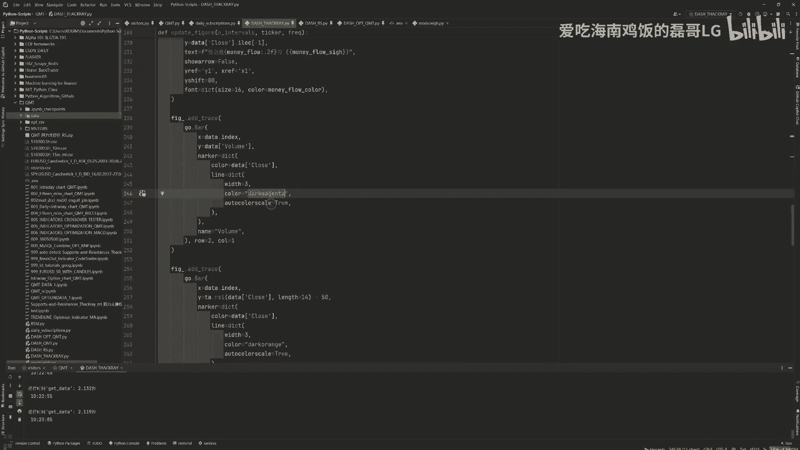

auto color scale就是颜色我需要它变化。更醒目啊。哦，市场现在又在发力。看他会实时计算。刚才注意到的同学可能哎，你看他这个。又不见了是吧？刚才出现了一个阻力位，还是一个支撑位啊。一条线。

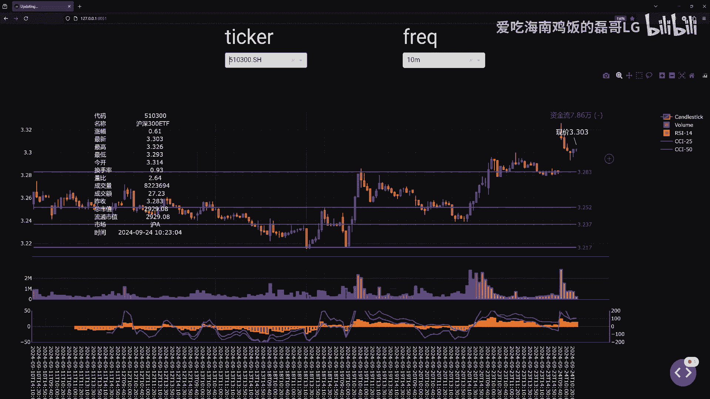

停了吗？停了。这种就怎么说呢？今天也跟大家展示一下，如果他要是出现了卡顿啊或者。😊，一些莫名其妙的事情的时候，哎，我们就直接给它停下来，然后呢重启是吧？

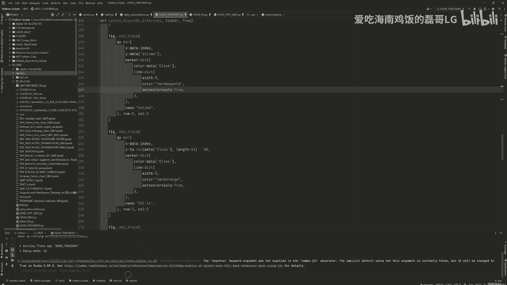

然后在这边的话，我们也可以。

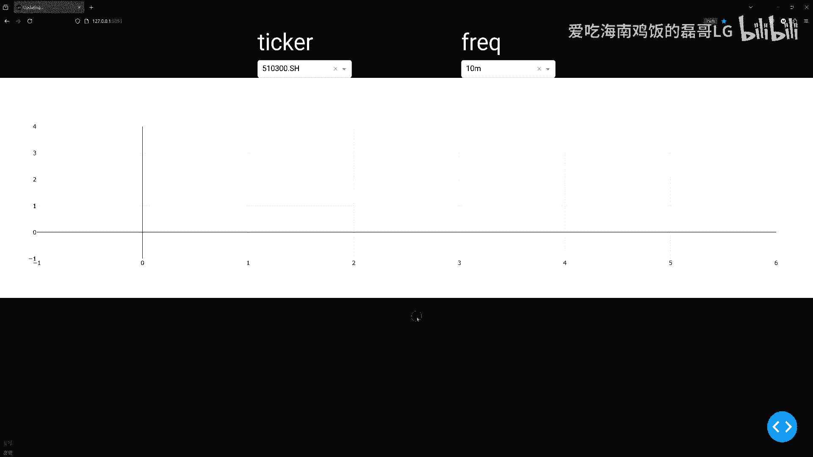

进行refresh啊，这都是重启它的一个办法。

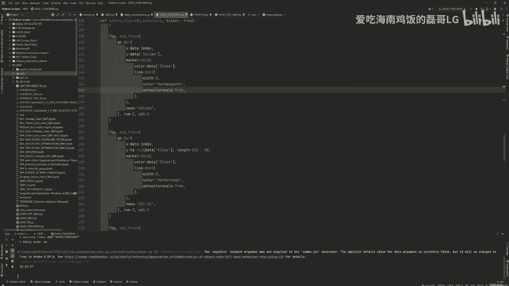

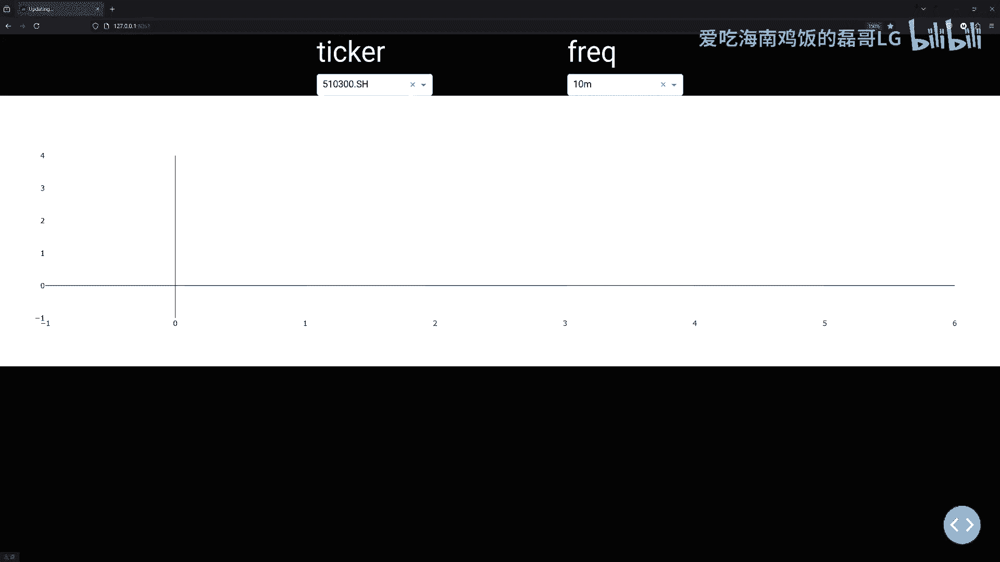

那我们先不管他啊，先让他一会儿自己再跑一会儿。然后剩下的话呢，这就是我的RSI的啊，跟才也跟大家说了，我是把它从0到100改变成。😊，-50到正50之间，然后并且呢给它改成半的一个形质。

而不是line的形式啊，这是我的一个代码。啊，我们给它放到第三排啊。😊，第三排对。然后。剩下这两个就是。CCI的啊CCI的代码。对。这样的话，我们的这个图图出来了吗？还没出来啊。等会儿吧嗯。还不出来。

然后下面的话呢，这个是一个是根据。根据这个RSI和CCI的这么一个。调整啊，对Y axis的一个调整。那我们这个RSSI的话呢，是取值是从-50到正50。那CCI的话。

一般来讲的话是从-200到正200。那我们想给它对齐，左边和右边对齐。而且我在我把CCI的话用了这个secondaryY这么一个。还不出来啊。英le doY这么一个调整啊。所以。我需要把它俩对齐。

然后我们看我们尽量把这个就是说这也是一个小技巧啊。大家如果要是有平时有用到这个sary one，然后你可能觉得左边和右边看着有点不是很舒服的这种情况下的话呢，你可以给它进行一个。😊，呃。

symmetrical第一对称。第二的话呢也是成比例的这么一个调整。这样的话他会看着会更舒服一些啊。

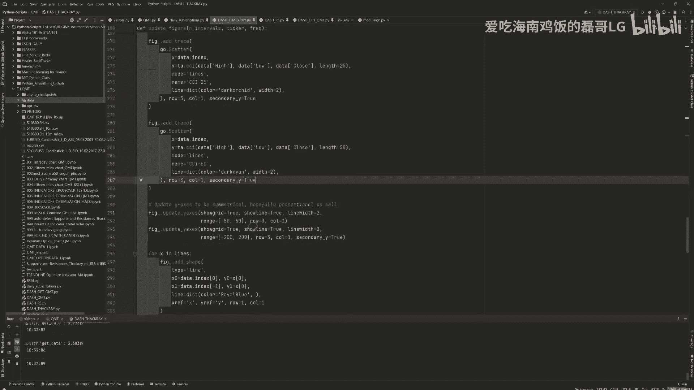

这个是真打脸呢，这数据员是怎么了？嘿感觉我电脑也没什么问题啊这个。怎么还不敢先出来？

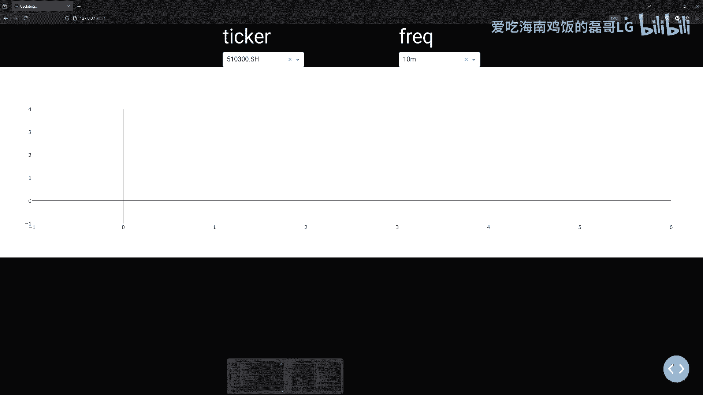

哦，出来了。然后我们的数据这个在动。现在是3。2298块哎。这块没动啊，可能是出了一些什么，哎，动了动了，现在动了。anyway呃，对，刚才说到这个这块，你看这边是50。正5是负1。

这边是正200到-200。那这样的话，我们就给它变成了一个成比例的，是吧？成比例的这么一，这样的话看起来会更舒服一些。

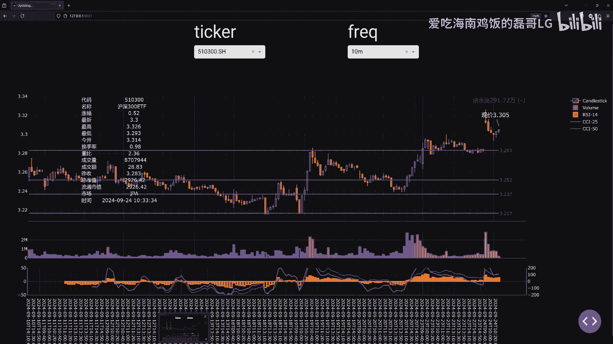

呃，这两个的话呢是为这个。阻力线和支撑线来进行那什么的啊。

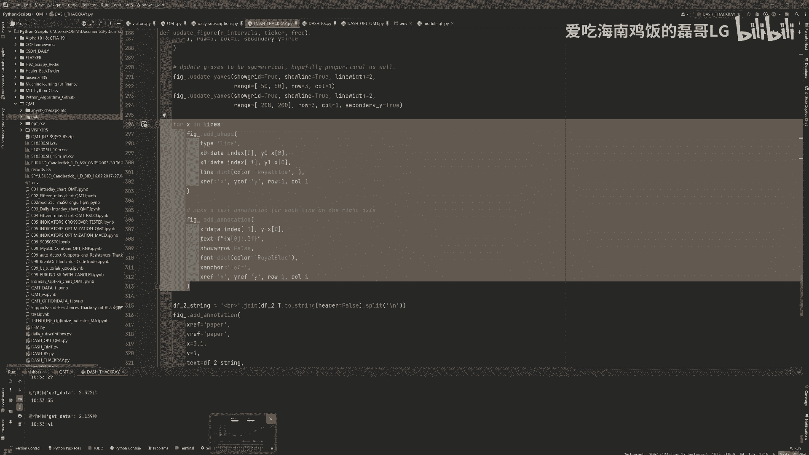

来进行设置的对。我们通过那个函之前的那个函数啊，然后给它计算出来这几个这几条线，然后呢。

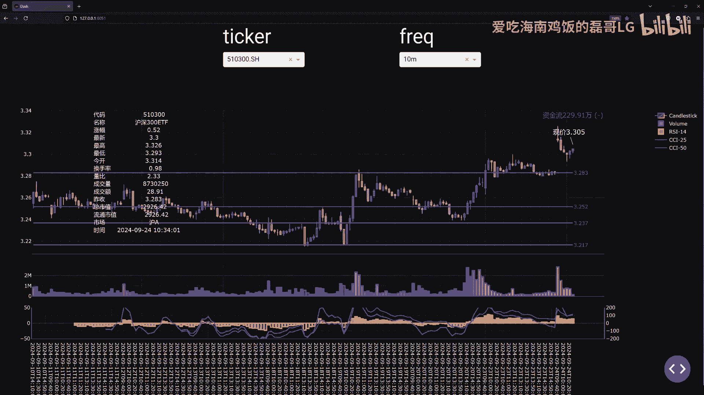

我们再用一个for loop for x in lines啊，或者fly in lines都行啊，然后它会逐逐条的给它画出来。然后被画出来以后呢，并且在左边会给出了一个annotation。

就是他先这个这条线是在什么价位？对。然后呢，这一个的话呢，就是。

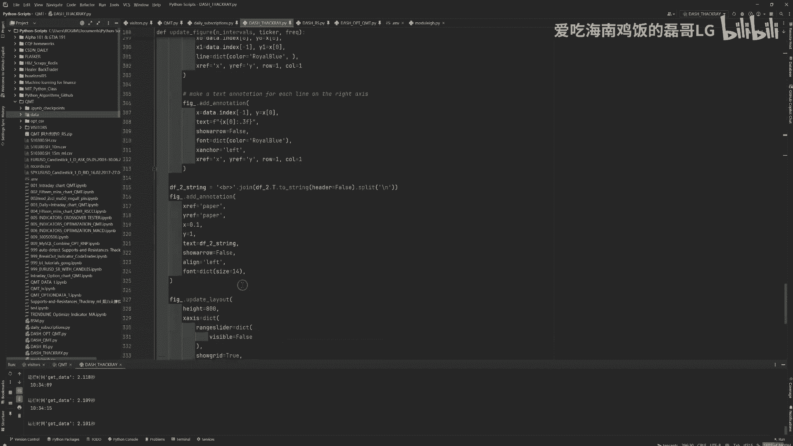

这块啊。

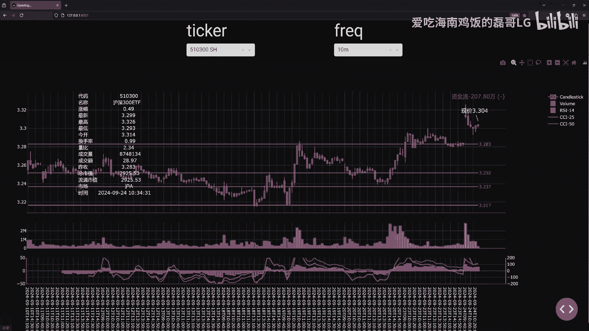

这个书写格式的话，大家感兴趣的可以可以参考一下，可以看一看。😊，我们通过break来join什么呢？B。这个data frame做一个transpose啊，就横着变成竖着。然后给它变成什么呢？

变成str啊，我们要给它变成str。变成字符，然后呢并且给它拆分，拆分怎么拆分的呢？然后每一行哎来进行拆分，这样的话，它就12345678。哎，看看是不是这样，也是这样。哎，它是这么拆分的。

而不是说横着代码名称涨幅那样看的话会。

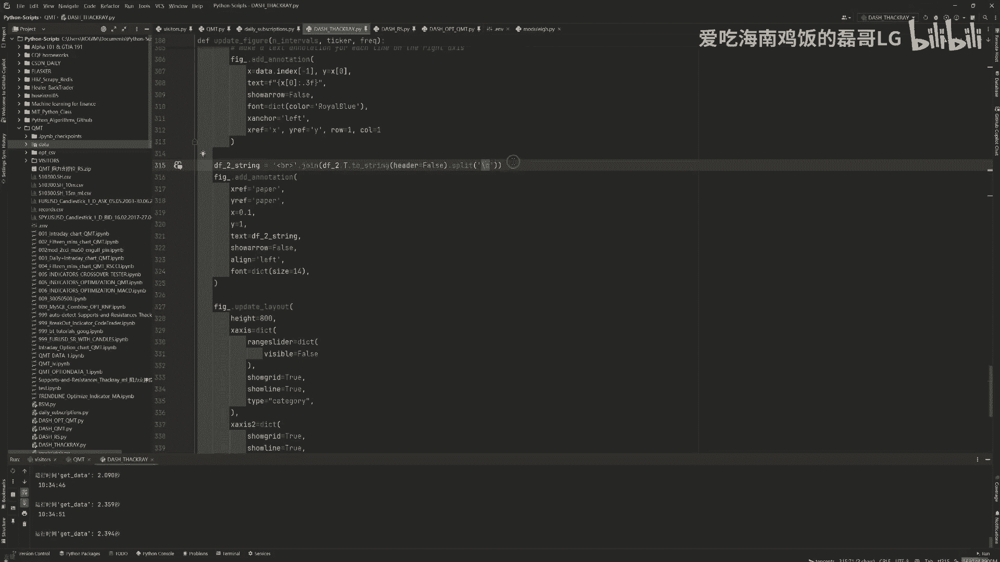

不舒服啊，这样的话反而会视觉效果会更好一些。

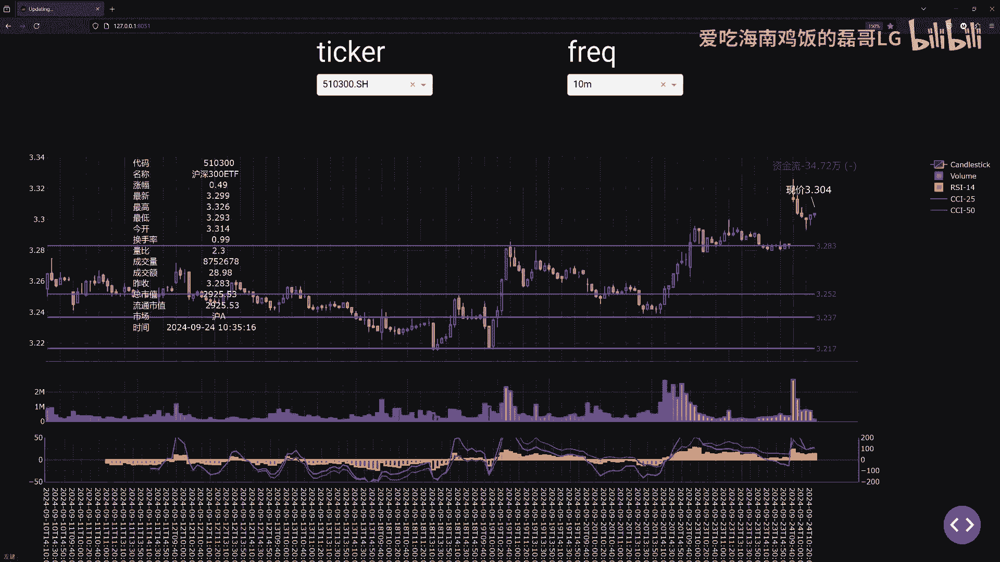

然后下面一点的话呢，就是我们要把整个图进行一个upupdate，这叫update layout是fiig其中的一个。函数啊，那我们把高度调成800，这个高度调成800，我觉得还是不错的。但是什么呢？

它这个有一点。

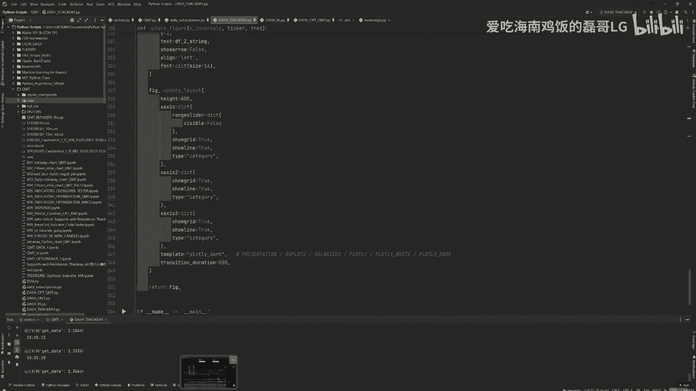

比较好一点啥，你看你调比例的时候，它会自动帮你调整。哎，这个是非常人性化的啊。😊。

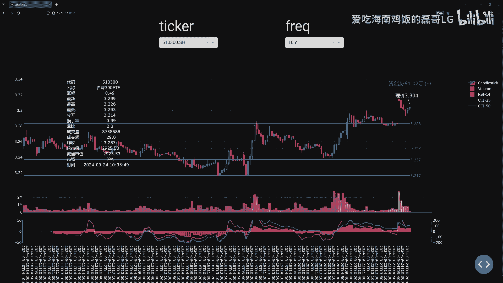

然后这一点的话，我需要大家就是注意啊，就是咱们这个股市啊。中国的金融市场它是中间是有。区间的就是不开盘的，它不像美国9点半到4点，人家是连续性的，所以说不会存在这问题。那国内这个断开了是吧？

那我们画的时候要要注意啊，就把XX就是我们的X坐标。

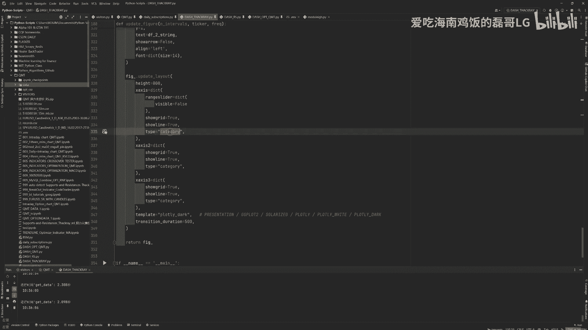

进行一个调整。进行一个调整，调整什么呢？XX哎123，我们有三组图嘛，那么他咱们就有三个X坐标，那么都给它改成type等于category啊，这样的话他就会把所有的这个。这个缺口。就给抹掉了，去掉了啊。

这是一个非常好，这个我也是找了好久这个。我并没有在这个m live和这个Cboard上尝试尝试用这个，只是在那个p上实现了这个功能啊，还是不错的。另外两个库的话，大家想弄的话，可以自己做一下功课啊。

看看如何来实现。然后最后的话呢，我们就是up点。runun server debug to port等于OS点ge environment呃，哪个参数呢？dary。

这个我都已经写入到了一个叫ENV的文件。大家呢感兴趣的可以在B站上搜一位呃up主啊，他是专门分享了这个ENV的这么一个视频。我去带大家找一下吧啊，咱们就先不找了。😊，嗯，然后今天的分享呢大概就这么多啊。

感兴趣的同学的话呢。😊，可以，你给我留言。然后我也会把我这个代码的话呢。呃，分享给大家，毕竟人家也是免费分享出来的，我也会免费分享给大家出来的，这个大家可以放心，然后嗯。😊，你可以给我留个言。

然后我给大家这个发过去。或者我也会这个在这个描述当中的话，把我这个。文件可以共享出去啊。然后另外给大家一个建议是什么呢？就是大家可能看我这个代码比较乱是吧？其实有一点是什么呢？我们可以把一些函数是吧？

我们可以把下面这些。😊，哎，封装成一个可视化的函数，把上面的数据呢。也放到一个独立的这个。文件当中。然后通过导入的形式来导入进来。这样的话呢就会让咱们的这个dash看起来比较清澈一些。还有一点什么呢？

如果你要是想调整。输入的这个函数和这个制图的函数，你可以去一个pyython文件去弄去。如果你想调dash的函数，你可以来dash的这个文件来进行调整。哎，这样的话呢。

把他们都是有效的呃合理的给它分散开。这样的话，对于我们这个管理也会有很大的帮助。这也是一个经验之谈呢啊。行，那今天的分享呢就到这儿了，感谢大家。如果喜欢的话呢，希望能给我一个一键三连啊，谢谢大家。😊。

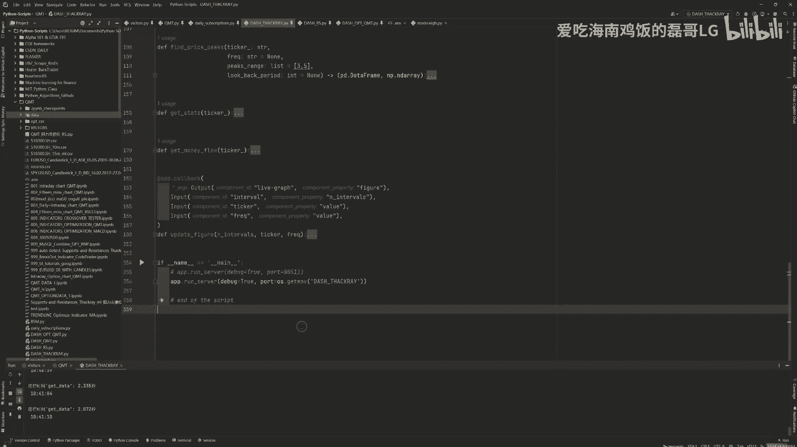