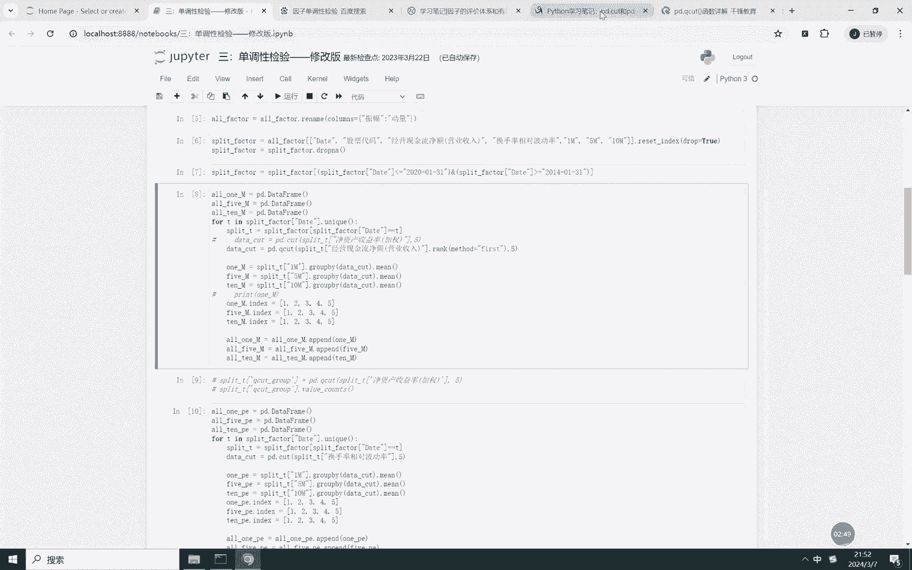
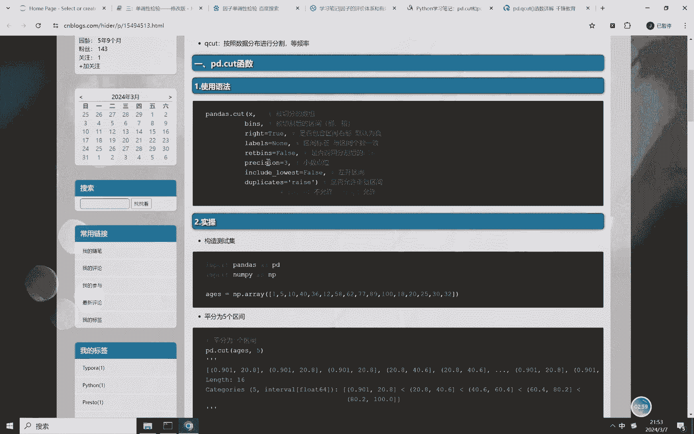
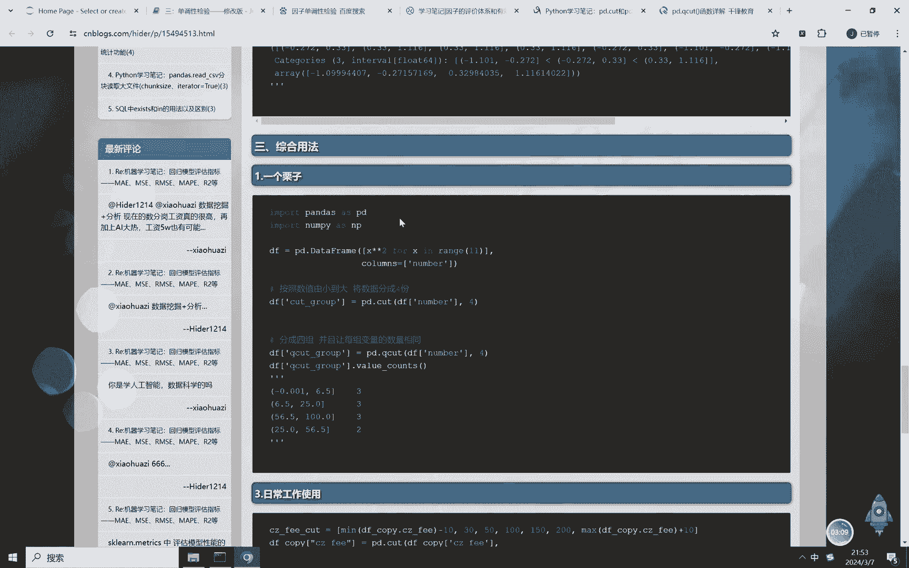
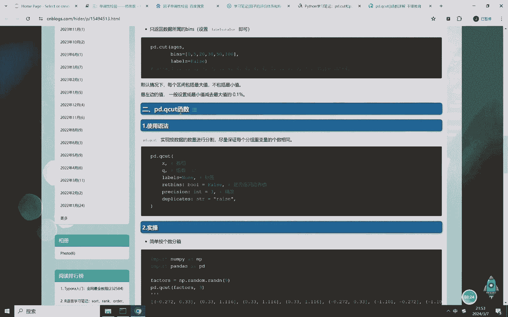
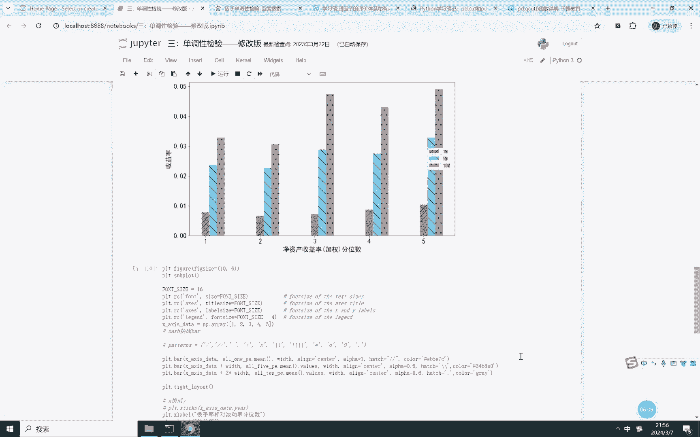

# Python多因子量化选择全流程 - P2：因子单调性检验 - 代码解析与论文精读 - BV1JfDLYjEdL

哈喽各位小伙伴们大家好，今天我们更新量化投资，多因子选股与机器学习系列的第二集，就是因子的单调性检验嗯，如果各位小伙伴还不知道因子什么叫做因子，单调性检验的话，我找到了一篇博客。

大家可以去参找雪球网这篇博客，讲解了因子评价体系和有效性的评价方式，这些我们后面都会讲到，我们今天讲的这一节呢，就是因子的单调性检验，什么是因子的单调性检验呢，就是将股票因子值从小到大进行排序统计。

每组在下一未来时刻的收益，看看是不是收益率存在单调性特征，也就是说对因子值进行分组，分完组之后，因因因子越小的因子，它的收益率越小，越因子越大的因子收益率就越大，看看是不是存在这种单调性特征。

但一般情况下是存在的，但也有可能存在非线性特征，就是因子值越大的收益率不好，因子值越小的收益率不好，只有因子值处于中间的收益率才好，所以它未必一定一定是这种单调性的，他有可能是非线性的这种关系对吧。

所以后面要用到那种机器学习的那种方法，特征，呈现出非线性好，这个呢代码呢我们跟随上一节课讲代码，这个代码已经经过数据处理了，包括啊缺失值处理，异常值处理啊，数据标准化，还有中心化，全部处理完了。

处理完这过程之后呢，这个最后一列呢就是未来一个月，三个月，五个月十个月的收益率，那么我们判断一下这个因子值的啊，分完组之后看看他和未来一个月三个月，五个月十个月之间收益率之间的关系是不是呃。

收益率是不是因子值越小，收益率越小，因子值越大，收益率越大，呈现的出这种单调性关系，那我们首先选择的一个因子呢，就是这个啊经营现金流净额和换手率，相对波动率，这些数据都是从万德里面下载的。

那也就是说这个里面代码不难难的，就是唯一的一点就是给大家讲的一点，就是讲一个函数，这个PD点q cut，这个函数对这个因子值进行分组，分组完成之后呢，把它分成从小到大分成五组，最后的那分成五组。

那这个pd点q cut呢的用法呢。

是可以参照这篇博客，就是说啊嗯把因子值输进去，可以输入这个呃beans。

就是你到底想要分多少组，分多少组呢，就可以点B啊，BD点q cut。

这个是q cut，PD点，Q card，是进行尽量保证每个分组里面的因子数相同，也就是说是股票数相同，我们使用的是pd点q cut。

不是使用的是pd点cut，PT点cut呢是等间隔，pd点q heart呢是等频率，所以大家注意一下是等频率，q cart是每个分组里面的股票数相同，那分完组之后呢，我们判断一下未来一个月。

五个月十个月的收益率是是怎么样的，求一个均值，我们每一个日期都，我们每一个日期都变了一次呃，这个月就是当前T时刻，未来一个月五个月，30个月，当前T时刻，当前因子值，当前因子值的未来收益的情况。

那我们对它进行分组，12345分成五组，那五组完之后，我们就可以求解呃，未来，每一组的收益率额，那这个代码我们就不一一讲了，所以唯一的一个啊核心函数就是这个pd点q heart，其他没有什么要讲的啊。

唯一的就是PD点q cut，那我们对它的这个收益呢进行一个排序，我们发现嗯它的收益大致是呈现递增的，这个经营现金流净额，就是他的这个一就是是第一组就是数据比较小，这个五就是第五组数据比较大。

所以它是呈正相关的单调递增，而这个换手率波动率呢这个比较明显，它是呈单调递减的，就是它的波动率越高，它的收益越高，收益越小，而这个是那个净资产值越高，它的收益率越大，那这个是它的一个单调，要学检验嗯。

唯一的一点区别呃，唯一的一点就是嗯讲了一下啊，这这节课基本上就讲完了，那主要给大家讲了一个概念，什么是单调性检验，然后呃怎么样进行分组，分完组之后哦，求未来一个月五个月十个月的收益率的平均值。

然后对它进行画图，画出直方图，判断一下是不是呈单调性好，这些那个数据和代码会放到视频正下方，大家有意向的可以自行领取，谢谢大家，今天就讲到这里，那今天我们讲的是单调性检验。

后面一节课我们接着讲IC值IR值分析，ICIR值分析好，今天就讲到这里，祝大家生活愉快啊。

