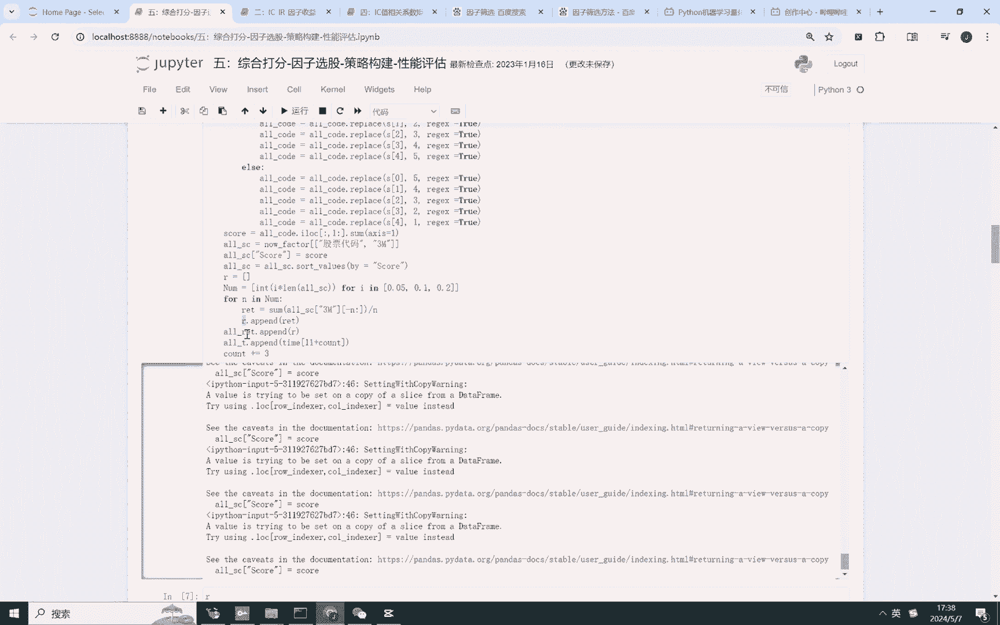

# Python多因子量化选择全流程 - P5：策略构建／性能评估 - 代码解析与论文精读 - BV1JfDLYjEdL

Hello，各位小伙伴们大家好，经过前面几期的铺垫呢，我们讲解了数据的预处理，我们讲解了单调性检验，我们讲解了因子的IC值，IR值，因子收益率，我们讲解了因子筛选，那么今天这一节呢。

我们开始讲解最重要的最核心的选股操作，那么就是综合打分法，因此选股策略构建以及性能评估。

今天我们一口气讲完这四部分，首先呢我们还是导入我们之前的因子。

处理后的结果就是换手率，波动率啊，市净率，市现率，市盈率等因子值。

那接下来呢我们来看一下，我们因子选股是怎样进行操作的，首先呢我们嗯还回顾一下上个视频讲解内容，就是对每个因子进行过去一，过去11个月的因子呃，计算IIC值，选择IIC值大于0。03的因子。

经过这个操作呢，我们就得到了，当前时期应该选择哪个因子进行股票，就是呃哪个因子作为股票选择的依据，那我们假如选嗯，我们带大家回顾一下吧。

嗯也就是说2012年1月要选择波动率，收益率，涨跌幅，成交量震震动指标来作为最终选股的因子。

看到没有，那呃我们要对每一个因子进行划分。

比如说那既然要选择这几个因子，作为我们最终投资的一个参考依依据，嗯我们对每一个因子呢干嘛呢。

划分成五组，如果这个股票对应的因子值比较，就比如说如果如果这个IC值是正的，这里是一这个逻辑是什么呢，IIC值是正的，大于零，AC值大于零，看到没有，AC的值大于零，代表着AC值大于零。

代表着因子值越大，股票未来的收益率就越高，那么我们就给当前股票因子值比较大的股票，给予较高的分数，看到没有，如果因此值大于零，并且我们对这个因子进行划分成五组，对于因子值较小的股票，我们给一分。

对于因子值较高的股票，我们给予五分，那到底有多少个因子进行打分呢，我们进行一个便利。

相当于在这里我们相当于是呃换手率波动率，对所有的股票进行打分，净资产收益率也进行打分，涨跌幅也进行打分。

成交量也进行打分，我们来看一下它的打分后的一个结果。

好这里的这里是警告，不是报错。

没有关系的，他还在运行好，运行完了，我们来看一下哈。

我们来看一下股票的这个soccer到底是什么。

给大家一个看到没有，就相当于是这个股票它的分数是四分。

而这个股票呢分数是19分，就根据这个因子打分。

19分就是总和是19分，四分呢就是呃分数较低嗯。

而19分的代表分数较高，我们就选择分数较高的，排名前5%，前10%，前20%的股票，由于我们是季度选股对吧，我们就是选择未来三个就是我们选择三个月，持有期为三个月的收益率，作为我们投资组合的收益率。

那肯定不选择前5%的股票，我们要除以个N，就相当于是等权重投资，假如选择20只股票，那么对二只对这20只股票进行等权重分配，那么最终的收益率呢，就是呃就是这20只股票收益率的一个平均数。

就是这个rate好，这个count加三呢就是季度选股。

每一个季度进行选择好。

那接下来我们要哦，我们就计算这个这个rate。

我们来看一下这个rate r，这个R呢就是一组收益率值。

Orrit。

我们打印这个ORRIT，这个这个就是500%分之十。

20%的收益率值，就是在这个投资期限上的收益。

我们打印这个ORRATEORR，看到没有，就相当于是嗯。

嗯相当于是2012年1月的收益率，2012年4月投资的收益率。

17月10月一月的投资收益率。

然后呢，我们然后呢，我们开始我因为我们要画收益率图嘛。

就是要画这种收益率图，我们要导入这个沪深300作为我们基准。

作为我们的基准。

然后呢我们来换绘制一下500%分之十。

20%的一个收益率曲线。

这个是持有5%，这个是持有10%，这个是持有20%的股票，的一个收益率走势，大家可以看到，选择前5%票的五的股票的，收益率是最高的。

这个也是符合我们的常识，就是你根据这个打分。

你根据这个打分分数越高，证明他未来的上涨的可能性就越高。

这个就叫做综合打分法。

因此打分法。

然后我们嗯绘制下这个收益率图，大概是这样的一个结果，这个是沪深300，这个基准收益率呢是沪深300，上面是500%分之十。

20%的一个收益率图，而从2012年到2022年上涨了接近六倍。

六倍667倍哈，就翻了六七倍。

这是我们综合打分法的一个结果，那超额收益率怎么算呢。

超额收益率就是投资组合收益率。

减去基准收益率获得的那个值呢，就是超额收益率。

看到没有，就是前5%收益率减去基准收益率，我们这个阴影部分的面积就是阴影部分在上面，它的超额收益率就是正的，阴影币部分在下面超额收益率就是负的，那很显然我们的超额收益率都是正的。

因为5%的收益率要远远超于基准收益率，所以这个阴影部分的面积始终在零以上。

这个就是我们的一个阴影部分的面积。

那呃那我们也可以，大家可以把这个5%改成10%。

和20%，画一下他这个超额收益率的一个一个一个分布。

那接下来我们要计算几个指标。

最大回撤，累计收益率，年化收益率，夏普比率所提的比率和阿尔法贝塔信息比率。

我们最终得到了一个这样的一个图。

就是累计收益率，年化收益率，夏普比率所停的比率，最大回撤，阿尔法贝塔信息比率。

呃这个所有代码均在视频正下方会呈现。

大家感兴趣的可以去下载，如果大家不感兴趣，也可以仿照我这个视频嗯。

就不感兴趣的就别管了，就可以仿照这个视频嗯。

了解一下就可以了，好那这个内容呢就是讲的呃。

这个内容主要是做了一个呃核心的。

中的核心就是这个地方就是这个综合打分法，打完分之后才能计算收益率。

计算收益率完之后才能进行绘图，那么我们这个收益率这个图是怎么算的呢。

我们使用的是。

使用的是这个呃呃come come，come pro的函数就是累积相乘，累积相乘就是一加R11加R。

21加R3计算的一个累计收益率。

然后下面就是年化波动率的算法。

年化我们嗯，还有这个下铺年化收益率的一个算法。

最终我们发现那个呃，这个这个基准收益率呢是呃一呃11个点，而四个额不是，这这个是一个点，四个点，六个点。

九个点，就是14699个点。

而这个5%的这个呃下铺比例是最高的。

他的这个额最大回撤呢是基准收益率，最大回撤最小20%的这个最大回撤最高，代表他的风险越高。

就是风险越高，好今天我们就讲到这里，大家感兴趣的话。

可以去反复的去呃看一下我这个视频，然后如果想要代码的话。

可以在视频正下方进行领取，好今天我们讲到这里，祝大家生活愉快，成果多多，工作顺利好。

