# Python强化学习量化交易框架-FinRL-Meta - P1 - 代码解析与论文精读 - BV1Nf421q7e5

哈喽各位小伙伴们大家好，今天给大家分享一个Python量化强化学习，量化的一个包呃，一个开源框架吧，应该叫做这个框架的名字呢叫做financial RL meta嗯，基于数据驱动的强金融强化学习。

市场环境和基准元宇宙这个名字哈，这个概念听得很新，咳咳其实就是做过投资交易的一个框架，但是我不建议大家做强金融强化学习，尤其是做量化投资呃，强化学习是非常难的，而且开源的非常少。

就是基本上大家一旦做出来之后，基本上都是闭环，就只有小团队，小梯队，甚至是同行和非常熟的人才，愿意把这个代码共享出来，这也就是为什么说在金融领域做强化学习很难，但是可以做深度学习，相对来说比较简单呃。

强化学习包括环境设计，包括动作，包括奖励，对吧，都111环欠一环，他这个流程其实是非常复杂的，稍微有一个地方写错了，整个代码就运行运行不了呃，在金融强化学习领域呢，开源开得最彻底的。

就是这个哥伦比亚大学的刘晓阳。

刘晓阳团队就是这个名字，就是刘晓洋。

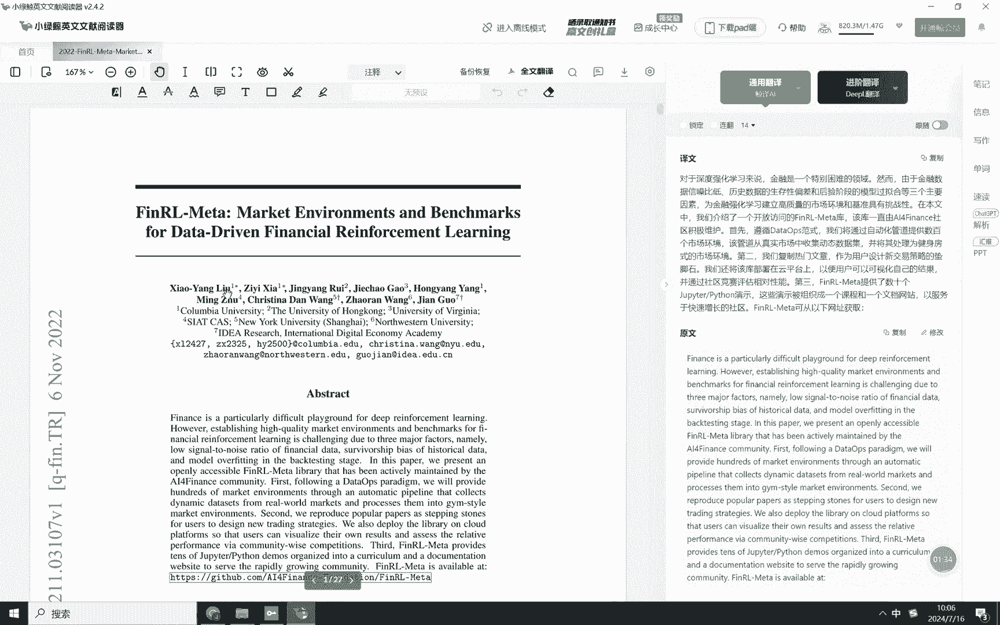

哥伦比亚大学的，好像这个哥们儿，好像这个这个这个大牛呢，这个这个厉害的这个这个这个大学霸，这个布鲁斯杨啊，他好像开公司了，大家可以去他的主页上面看小主页上面看什么，致远致远金融科技创始人兼总裁。

有自己的小团队，有自己的公司了嗯，哥伦比亚大学的研研究研究生研究导师。

我去已经是导师了吗，这么牛，这个这这人这么牛的吗，已经是导师了。

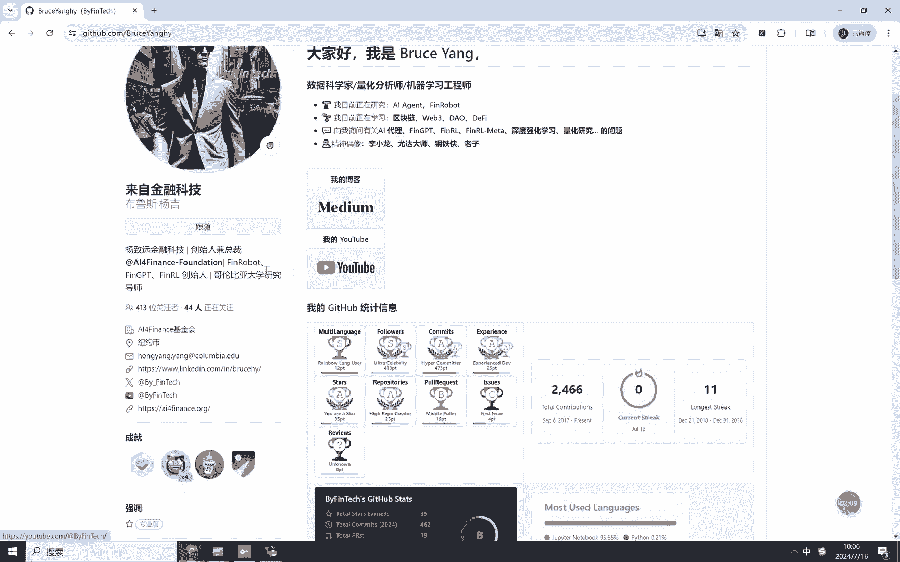

然后呢他开源过反ancir l elegant RL，还有反弹CIGBT，就是什么热点都都都都经过了，而且都开源了，真的厉害，大家可以去关注一下这个嗯，这个这个这个这个团队。

这个团队发的文章基本上基本上全部开源了，想跟着复现的都都能够都能够进行复现，好那我们来看一下它的内容吧。

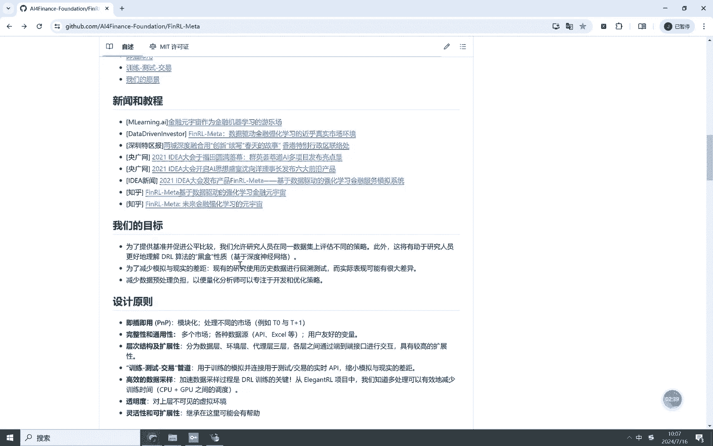

那这个模块呢分为数据层，环境层和啊，这个是智能体，数据呢包括数据处理，数据清洗和数据的特征，工程环境啊，什么状态动作奖励，然后这个呢呃agent呢包括training，Testing，Trading。

Trading，还有validation。

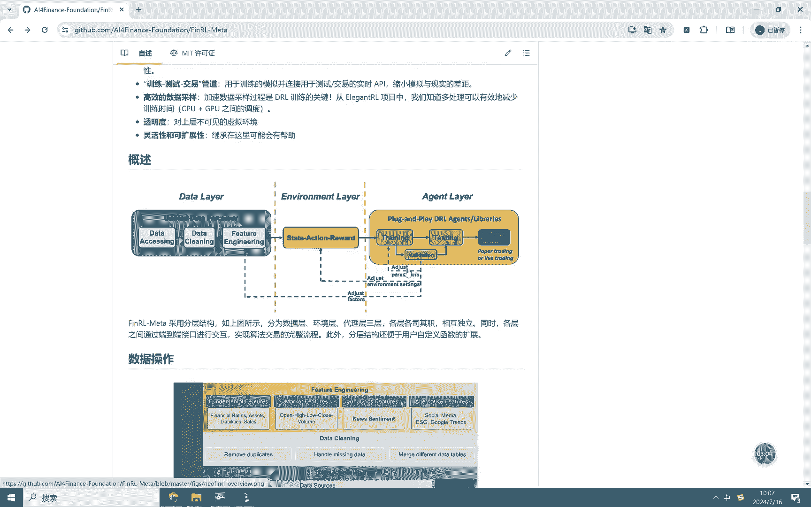

呃，这个呢就是它的一个文章的一个框架，的一个核心，它其实是一个集成集成框架，就是把把把各种各行各业的内容，全部给全部给打包了，这个里面是美美股ETF。

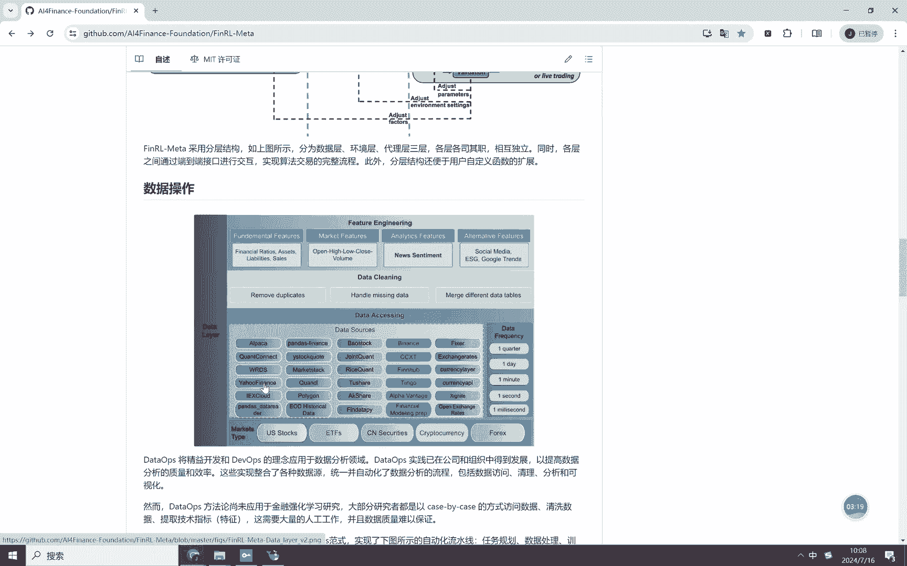

中国股票加密货币，还有外汇，包括这种一分钟的一一天的一秒的啊，这是数据频率，这个是数据来源，包括AK10页，包括two share，包括米框，包括b by by finance。

还有包both stick。

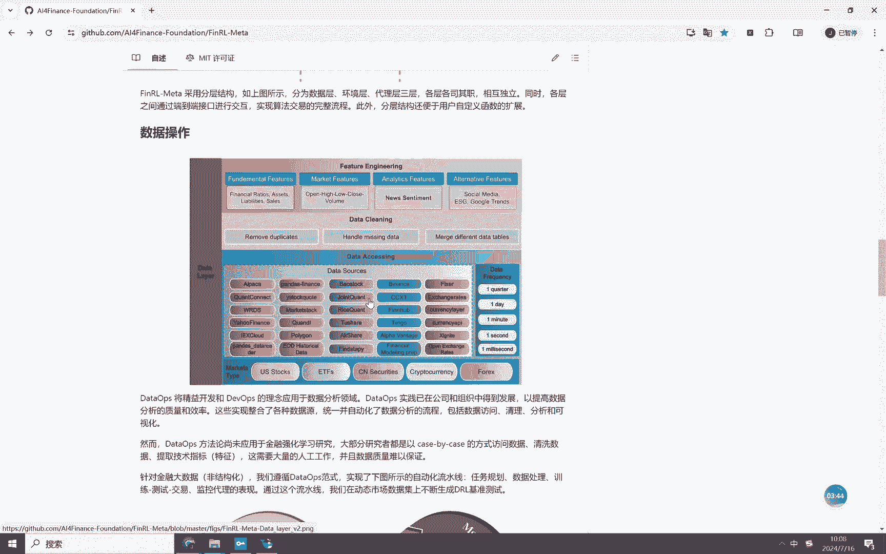

这些就是那个相关的数据来源包，然后呢这个是他的一个数据源，大家可以点进去看一下，我把它翻译成英文，这个BIRTHSTICK，我们点击看一下，然后这个是boss stick的那个界面，有这么多个因子。

什么复权因子，点进去这个就可以查看到这些因子，就是BOSTICK，还有还有我们所熟悉的呃，什么ak share，还有two share，这些two sher就是中国的那个。

但是这个to sher也要积分，反正就是这是数据来源，这个是他的一个一个训练测试，还有回测的一个框架。

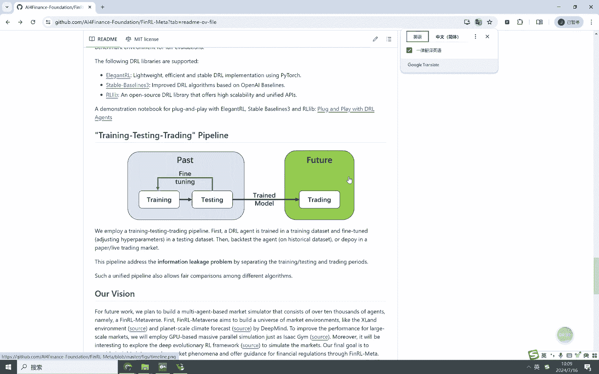

我们来看一下他说的是什么，反正这个嗯就是他的未来的计划是构建1万多。

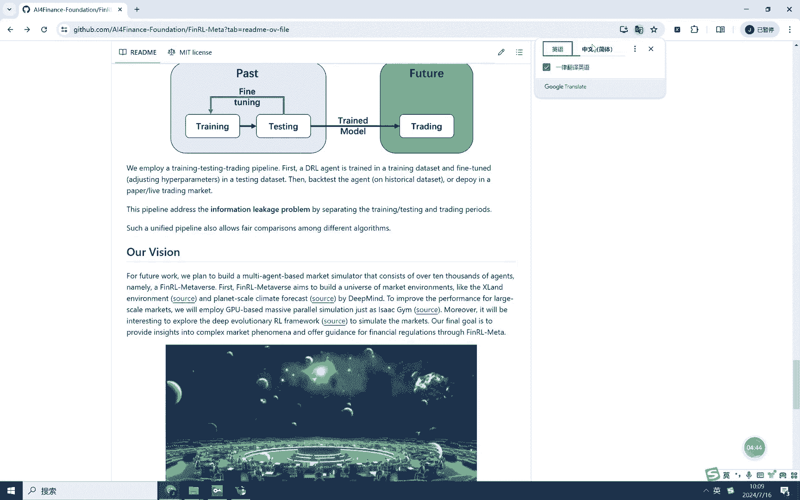

构数万个代理组成的市场模拟器呃，元宇宙嘛就是相当于是什么都包括加密货币，股票ETF，还有外汇。

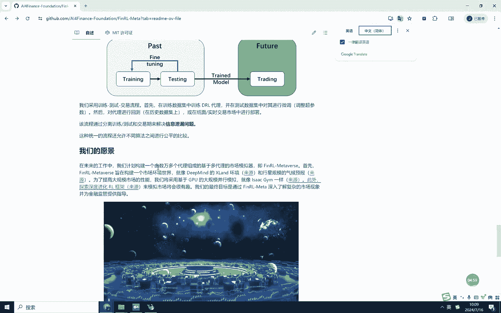

把这些东西都融在一起，它其实是主要是提供了一个框架。

相当于是你你你你的数据集。

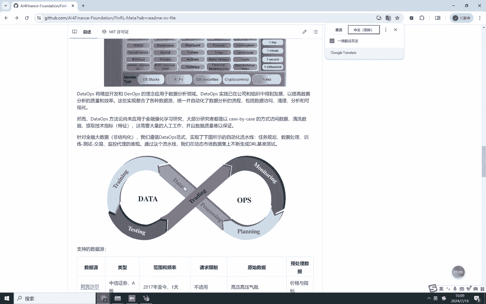

数据集用什么都可以，都可以在我这上面进行训练测试和和那个回测。

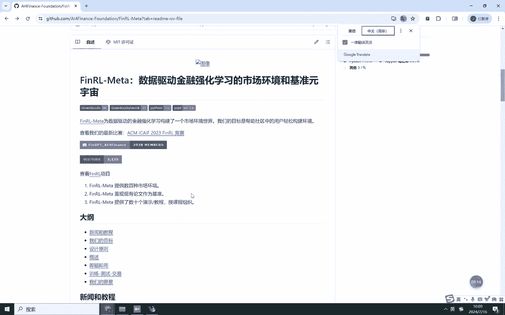

那让我们看一下他的论文里面，他为了论文里面写的更详细状态，包括什么动作，包括什么reward，包括什么环境，包括什么，那这个reward呢就是呃包括夏普比率，包括累计收益率，那动作呢包括买卖和持有。

这个状态呢包括什么呃，市场状态，还有什么股，情绪状态，就是情绪数据，市场数据，还有股票的交易数据，然后这个是他的那个计算技术指标的，计算市场环境的一个包嗯，这个相当于是stock states。

这个是计算什么MACD啊，rs这个就是市场特征，什么MACD啊，什么CCIADX啊，就是那个计算技术指标的库，还有TLAB也是计算技术指标的，这个NLTK是计算文本数据的情绪数据。

相当于是相当于这些东西都是都是在介绍的，什么数据处理，数据清洗，还有特征工程，那特征又包括哪些什么基准的数据，什么市场特征情绪呃，分析数据，还有这个什么什么ESG数据，然后它的优势是什么。

然后这个是它的一个呃回测技术指标，交易指标包括累计收益率，年化收益率呃，年化波动率项目比率最大回撤，这个是他做的一个结果嗯，在哎在这个什么在四用了几种强化学习。

I s a c a to c p p o d d p g t d3，做的一个结果，然后这个是呃，做的是一个额那个量化的一个指标，包括年化收益率，年化波动率下，普比率所提的比率最大回撤。

大家都可以去看一下，这个他这个做的这个回测的这个结果呢。

是在这个地方，我先翻译成英文，是在这个example里面，example里面，大家可都可以去看一下，这个是，这个是example里面的这个结果，基本上都是可复现的。

完全按照他这个他这个流程来都能够进行啊，进行复现，然后呃还有一个，还有一个这个paper trading，就是他这个paper里面，就是他这个论文里面的结果，的代码是这样的。

他论文里面的结果就是这个结果，这个图没这个图没有加载出来，估计是不可复现，为什么给大家讲一下，就是为什么这个论文里面的这个图啊。

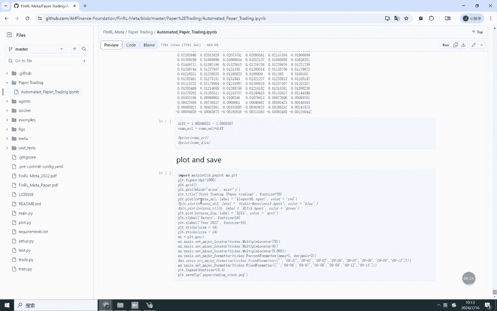

为什么没有加载出来。

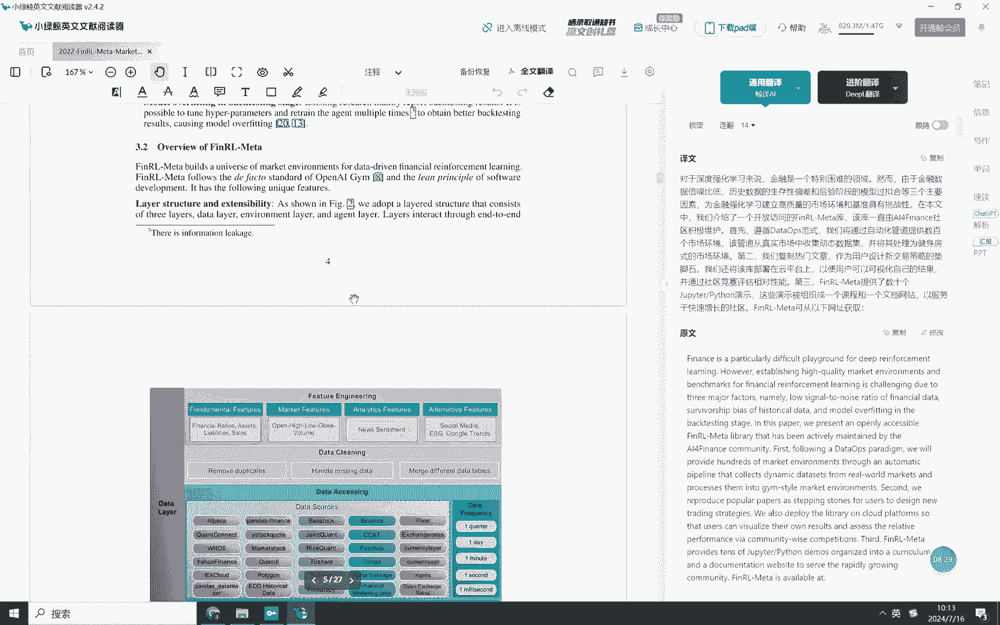

为什么没有贴出来。

我猜啊八成是不可复现，因为强化学习是一个不稳定的，就比如说你第一次跑和第二次跑的数据，完全就有可能不一样了，所以他这里是故意的，就是这里没有没有展示出来，这个plot没有把这个图展示出来，就是故意的。

因为他怕就是不版本不对，很有可能不对。

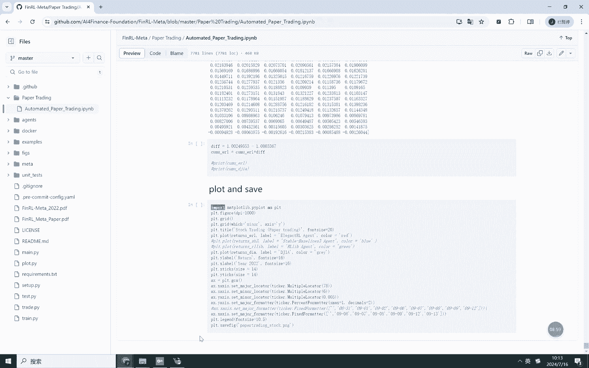

就是这个数据和这个文论文里面的这个图，很有可能对不上，因为强化学习它不稳定。

就是我们每跑一次结果都会变好，重点看一下他这个呃进行的内容吧，就是说我们在就是他们这个啊financial RL metal呢，在什么央广网，什么IDEA新闻，知乎哦，看下他这个知乎吧，就这个布鲁斯羊。

这个布鲁斯羊嗯，在知乎里面说他参加这个会议。

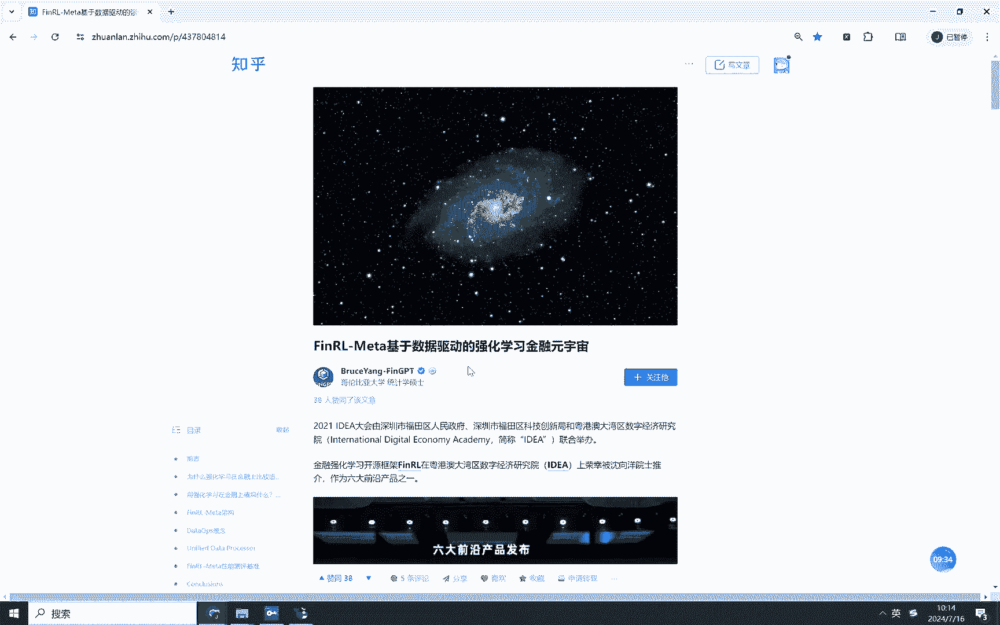

什么IDEAIDEA。

这什么灰呀，IDA会议，international哦，Digit economic act，这个也看不到大湾区数字经济研究院。

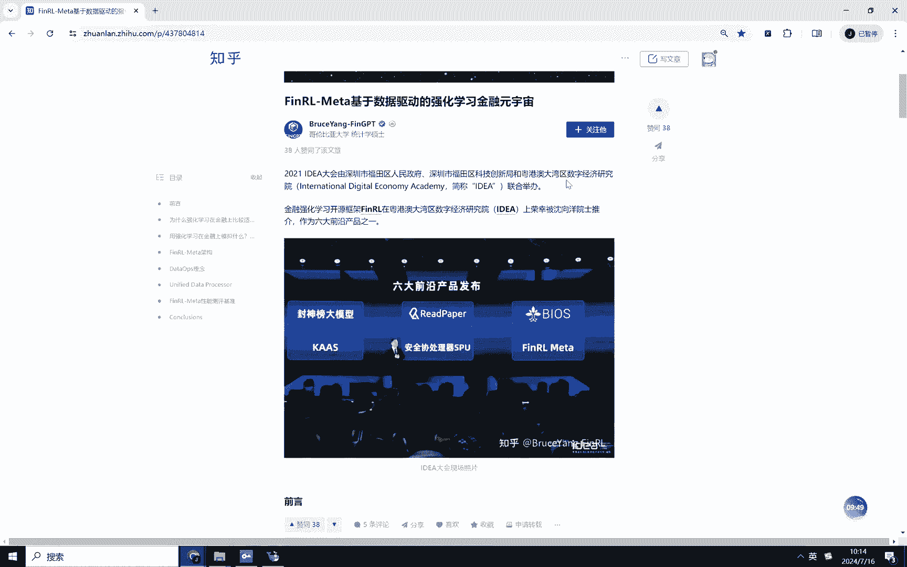

说他这个反弹时meta反弹时RL，meta呢是上了这个六大前沿产品的这个榜单。

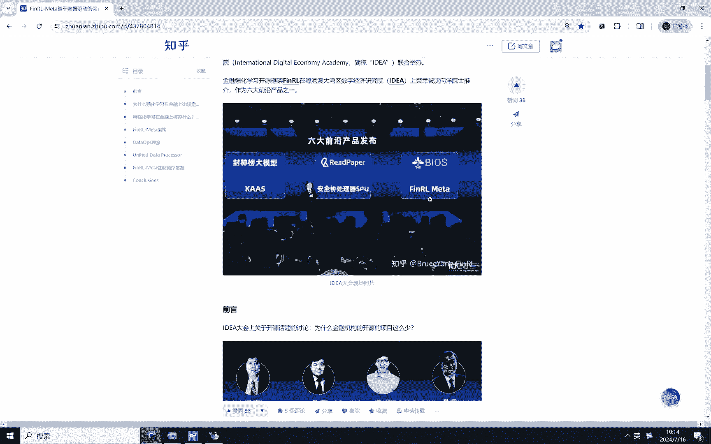

然后最后有人问说，反弹受RL meta比反弹受RL有什么不同呢，就是说反弹少RL meta呢更侧重于框架，而这个financial RL呢更侧重于是训练，就是侧重于模型，算法就是赶时髦。

但是他这个确实是为开源做了极大的贡献。

目前来说所有的论文里面开源的框架非常少，他这个能能做到开源真的就很很难得呀，大部分做强化学习的基本上都不开源，好不容易啊，吭哧吭哧做出来的，我怎么可能可以开源，所以要么就是。

要么就是很多人把自己代码开源了，要么就是运行不出来，要么就是数据残缺，要么就是代码残缺，反正就是给那个给大家复线设置很多障碍，他这个很友好，非常友好，还可以去看一下呃，他那个嗯的其他的主页。

他的主页还设置了很多，其他的那个金融强化学习的这个反弹，CIRL已经有9。4颗星了，九就是9400多颗星了，然后这个elegant呢也有四三千多颗星，这个反弹时这批呢已经已经有12万颗星了。

这这得多火呀，反弹数值BT，估计是大模型金融大模型微调，然后这个是他的一个一个框架，大家可以自己去看一下呃，今天呢主要是给大家介绍一下，如果想要做强化学习和量化投资的，可以看一下这个这这个这个作者。

这个团队基本上主流的就是开源的，开的最彻底的就是这个团队，其他团队或者说我想要去找哦，那个啊源代码怎么去找都没有它这个开源的好，甚至是压根儿开源的不彻底，设置很多障碍，很多人很多人就是那样的。

大家可以去参看参看参考这个作者的主页，然后去浏览一下它里面的语言代码。

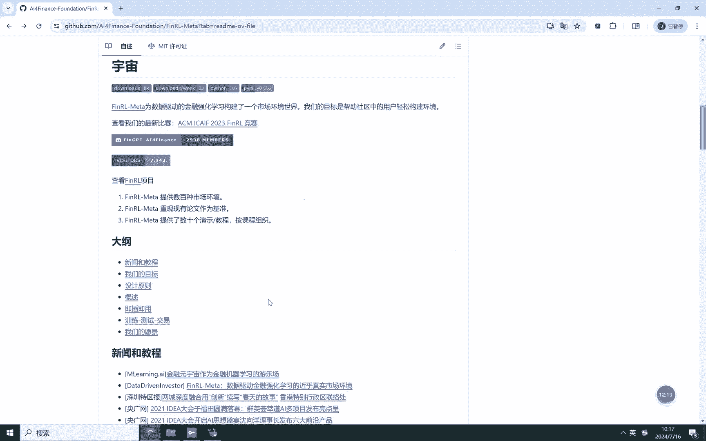

今天就是主要给大家做一个介绍，想去做的伙伴就可以去看一下他的主页。

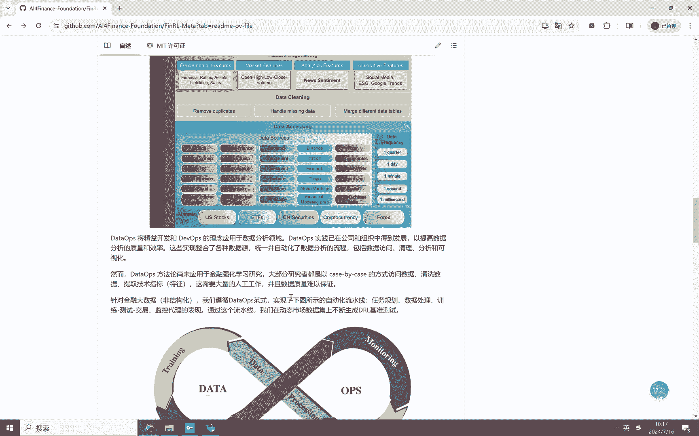

然后怎么样去调用数据，怎么样去构建特征。

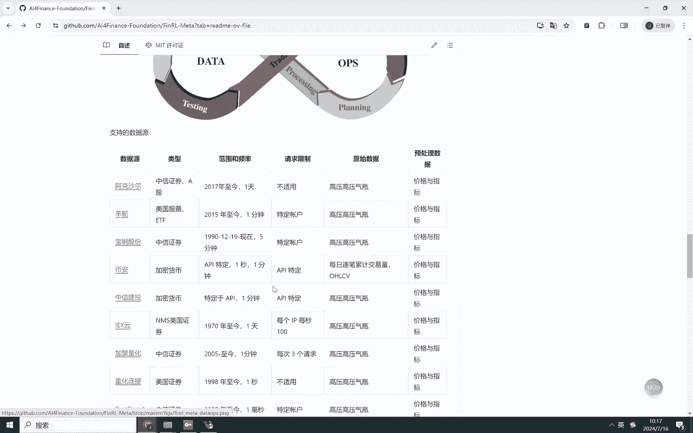

怎么样去跑回测，怎么样去跑模型好，今天就讲到这里。

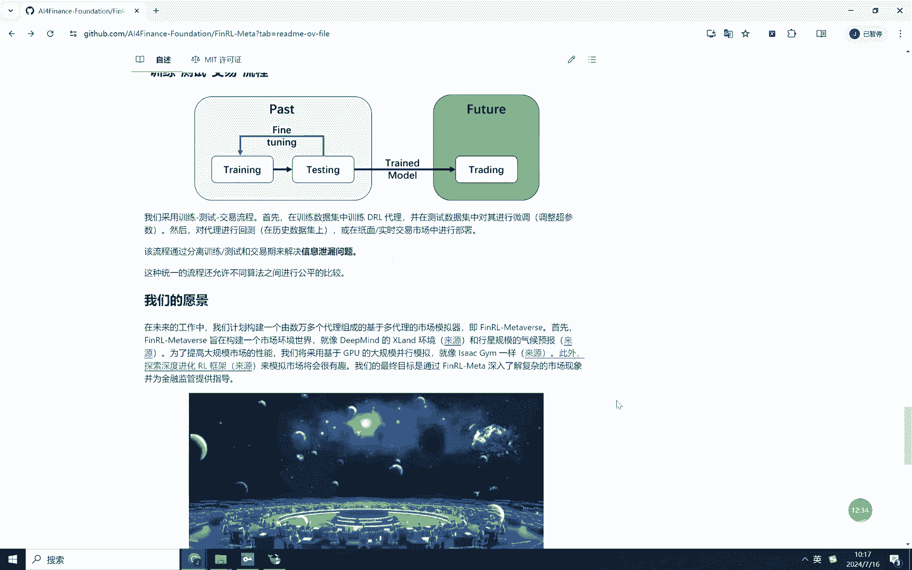

祝大家生活愉快。