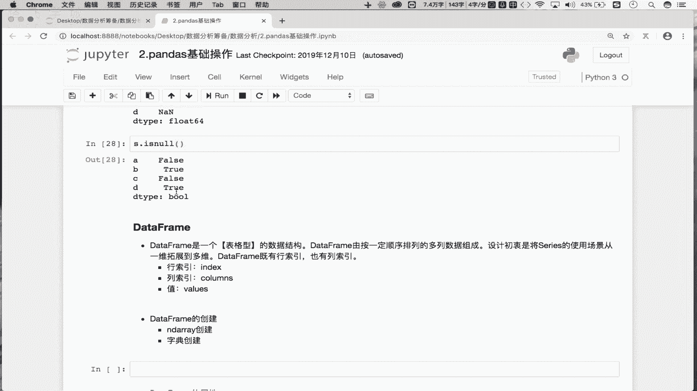
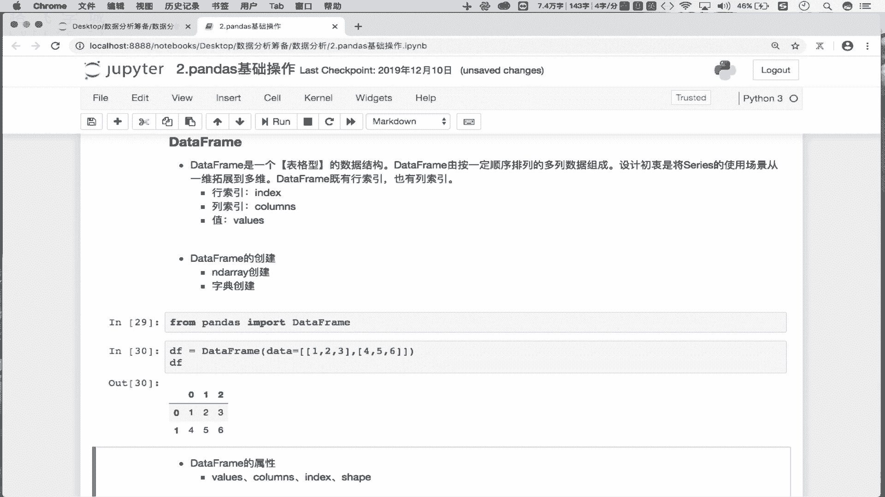
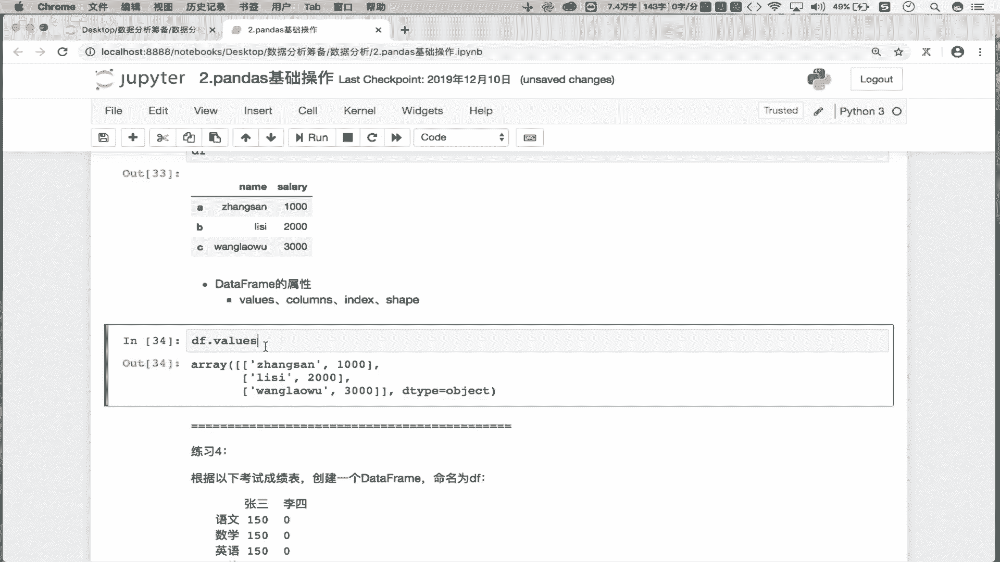
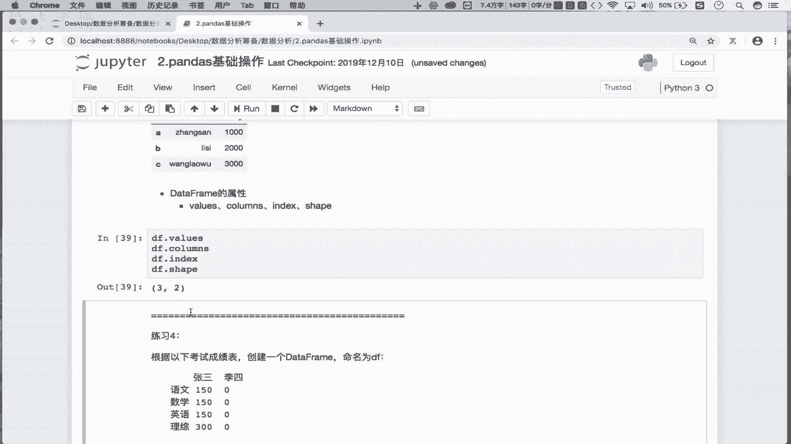
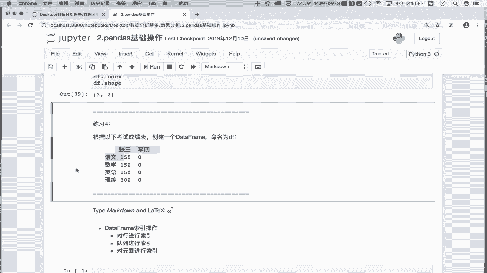
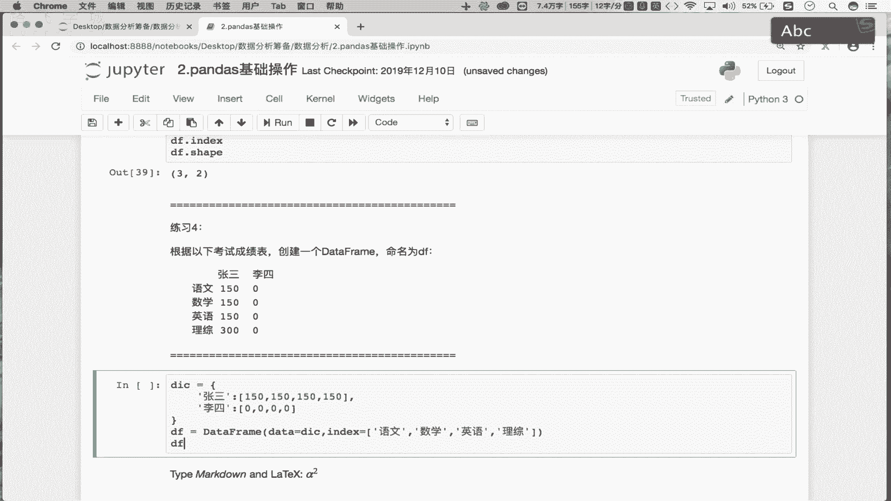

# Python数据分析数据清洗，金融量化投资分析与股票交易实战 - P8：02 Series的进化之DataFrame - IT研究生 - BV1RqzBYzEnB

O啊，那么这一小节的话，咱们就来看一下这个date frame它的一个基本使用哈。那么在上一小节呢，咱们最后呢遗留了一个问题。我们说这个sious呢它是一个一维的数据结构。

是不是而我们又说这个date frame是由s组成的那你说这个date frame它应该是一个几维的数据结构呢？O吧那这个问题各位是怎么思考呢？好，那我们就来看一下哈，那通过我们上节课的一个演示。

我们如果创建了一个date frame对吧？这块显示的是不是一列的数据啊，对吧？那这一列表示的是一个一维的数据结构吧，那如果哈如果有多个s组成的话，就有多列吧，那多列凑一起的话。

不就是形成了一个表格型的数据结构了吗？那么表格型的数据结构是几维的，是不是两维的呀，对吧？是不行列是二维的一个数据结构啊。

所以说咱们的d frame其实是一个表格型的数据结构O吧那么这个表格一定是由行列组成的，是不是那所以说。

咱们这个date frame啊，它的一个设计的初衷就是将s它的使用场景从一维拓展到多维。这个多维指的是我们的二维的意思O吧？所以说啊我们的serv啊它是一个一维的，它是只有我们的这个一个缩引啊，对吧？

但是呢在我们的d frame当中，它是一个二维的，所以说date frame应该是有两种不同形式的索引吧，分别是行列索引吧。那么意味着我们整个的这个date frame它的组成元素是由三个组成的。

第一个是我们的行缩引。第二个是列索引，第三个是行列索引所定的值吧，对？那所以说我们的date frame就是一个表格型的数据结构，你就可以完全把我们的date frame当成mys数据库当中的一库表。

那那mysq的库表不就是表格型的数据结构吗，对吧？是由行列组成的吧，它也会有行列索引是不是啊那么这个date frame它就是一个表格型的数据结构O吧那么接下来咱们知道了date frame是什么之后。

我们再来看一下date。

怎么创建吧，对吧？首先看一下啊，那想创建的话，在这我们需要先导一下date frame这子类吧，怎么导呢？from还是从我们的panda里边import。

我们需要导入一下这个date frame就可以了，O吧。那么接下来咱们去创建dta frame啊，首先第一种方式看一下，我们定要用date frame的构造方法进行创建。那构造方法用体参数呢？

data是不是我们的数据源数据源是1二维的数据源啊，对吧？好，index是我们的函数引 column类索以de type是元素类型，对吧？咱们意思去试一下。比如说这块的话，data。

我首先给它复一个什么呢列表行不行？

比如说这是123，这个是456OK吧，那现在我所创建的是一个二维的表格啊，对吧？我们再来打印，看现在我找看这返回的不就是一个两行三列的一个数据结构嘛，对吧？是一个表格型的数据结构吧，对吧？

那这是一种创建d方式是使用二维列表啊，对吧？除此之外还可以使用什么呢？d frame啊，我们的数据还可以是我们的py吧点点那这块就是从0到100size是一个6行5列6行四列吧O吧六行四列的一个表格那这返回的是一个六行4列所对应的表格当数据结构吧。

对吧？所以说第二种可以使用我们的充当我们的数据吧，对吧？那此之外还可以使用我们的字典充当数据D字典比如说啊这我有一个字典这个是什么呢？比如说是一个name啊，后边跟的是。

一些人名吧，比如是一个张三好李四王老吴okK吧。好，那么第二个啊兼值它所表示的是它的一个sary吧，工资是不是好，工资分别是123000OK吧？好，那字典创建好之后。

我们看一下DF就等于data frame，那么我们的数据源data就等于我们的DIA好，然后的话来这看一下我们创建好的data frame看一下，那现在我们创建的也是一个表格型的数据结构吧，对吧？

你看是不是有name跟sary这两列，对吧？name这列只能是名字，sary这列只的是工资OK吧。

那现在我们这儿会发现我们字典当中的T是不是作为了我们date frame当中的列缩引啊？你看这块的话，行缩引还是012，是不用的是隐视缩引。而我们的name salary就变成了显示缩引了吧，对吧？

所以说使用字典创建我们的这个什么呢？创建我们的这个daate frame的话，字典的key啊，就是我们date frame的列索引吧，对吧？你想给它指定行缩吧。

对吧那我们说这个col里蒙斯这三数是列索业吧，这不是有列索业吧，不需要指定了吧，是不是只需要指定核作以啊，对吧？好，我们叫做AB。C对吧？走，那现在我们这个date frame它的一个行列。

所以都变成显示的了吧。

对不对？好，那么通过我们的这三种方式。

我们就可以创建出来啊，我们的一个二维的表格形式的数据就够了吧，对吧？叫做data frame，是不是？

好，那么下边的话看一下date frame常用的属性啊，这个属性的话就简单了。首先DFDRvol返回的是不是我们date frame存储的二维形式的数据啊？

是不是返回的是一个二倍1的内倍数，是不是好，那DF点Rcollums的返回的一个是列索引吧name是不是DF点 indexex返回的是不是好作以ABC啊，对吧？好。

那还有DF点Rship返回的是不是形状啊，是吧？两横三列什么形状对吧？当然也有什么DF点什么的de type看行不行。

你看这个DF点det是不是报错了，对吧？为啥报错呢？是因为你的这个什么的date frame是由行列组成的吧，对吧？你到底是想看哪行或哪一列的类型呢，对吧？你这选取了吗？

没有吧你因为你的这个d是有两列组成啊，对吧？你看第一列都是字符串类型，第二列是不是整数类型啊，对吧？那你整个的d数的元素是不有字符串有整数啊，那怎么算它类型了，算不了吧，是吧？只能是说取出其中的什么呀？

只能取出其中的某一列或某一行单独去看某一行或某一列的个什数据类型。因为我们date frame的某一行或某一列取出来之后，它所回的就是一个s，我们知道s能看数据类型吗？能看吧？

因为s所存储的数组元素的类型是一致的对吧而date frame你看每行跟每就是行跟行或列列之可以存储不同类型的数据吧，对？你取出来之后，这列取出来是一个单。

的ze是万，它取出来之后也是一个单独的ze4万，这两个ze是不是可以存储两种不同形式的数据啊？对不对？所以说在这儿你不能直接去看data frame的类型，只可以去看data frame某些行或某些列。

它的数据类型吧。O吧，后边我们再看啊，后边再看。

那所以说停就在这儿啊，我们就已经知道这个daate frame怎么创建了，是不是啊，并且它所常用的这几个属性，我们都知道什么意思了吧，是吧？并且我们在创建daate frame的过程当中。

这个data index column de type这几个构造方法参数我们也能够知道啥意思了，是不是好，copy不用管它啊。

好，那么这个创建方式我们知道之后呢，那么接下来我们来看一个练习说我们需要在这干啥呢？需要在这去创建这样的一个形式的date from，是不是由四行两列组成的呀，对吧？那这个怎么创建呢？

你可以使用npy作为数据源，也可以使用字典，也可以使用列表作为数据是不都可以啊，对吧？那这怎么比较方便呢？这不使用字典作为数据源比较方便。因为我们知道字典它的key作为的是不是我们这个。

da frame当中的列索引啊，对吧？那这儿就是我们的什么呢？张三呗是吧，是不是第一列，后面跟的值是谁？是不是150。150。150150啊，对不对？好，第二列是不是李四啊，李四啊好，李四的话。

那这块跟的是不是点啊？

对吧字点有了吧，好第二幅就等于。data frame好，我们的数据源data就等于是不是DSA那我们的张三李四是不是作为data frame的六存眼啊，那行损有吗？没有吧。

我是需要在这指定一下行酸引index等于啥呢？等于语文。是吧。还有数学、英语、理综是不是？好，现在的话我们来看一下DM整你那现在就创建好了吧，跟上边是一模一样的吧，对吧？

所以说在这儿使用字典创建我们的date form更加的灵活和便捷，是不是OK吧？如果你这用的是我们的这个npy作为数准的话，你还得手动的去声明它的显示的行缩音跟显示的列作音吧。

OK吧。好，那这个是咱们date frame的一个基本创建的形式。OK啊，那么这一小节先到这里。

