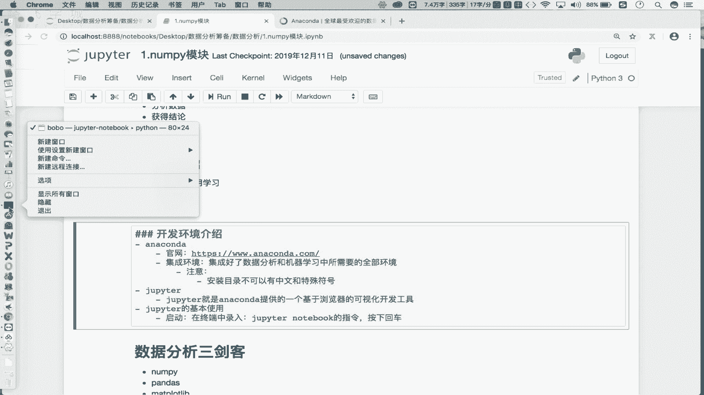
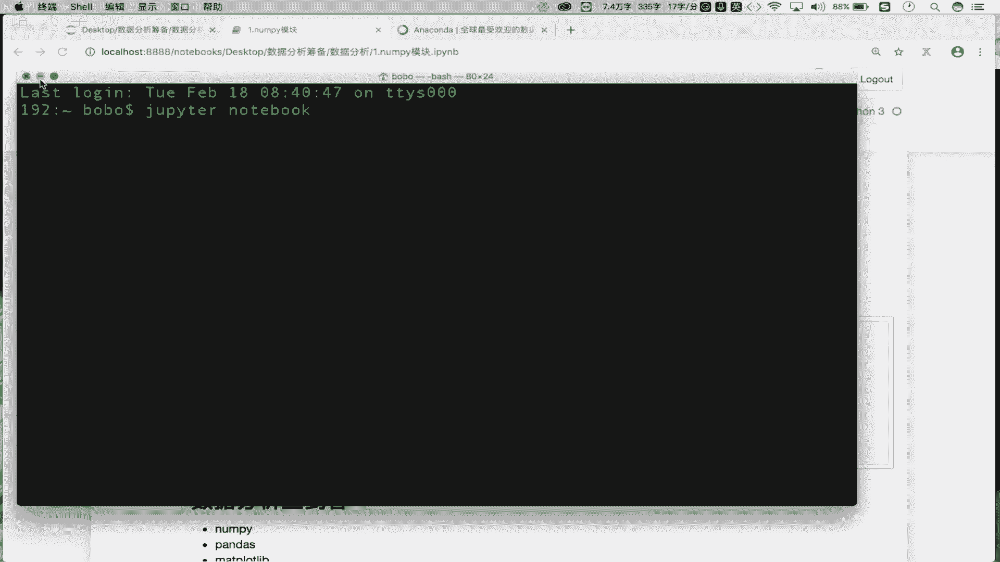
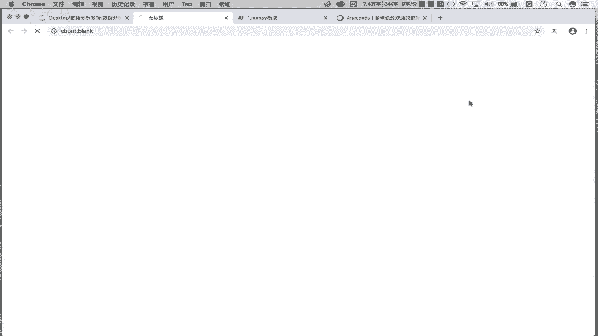
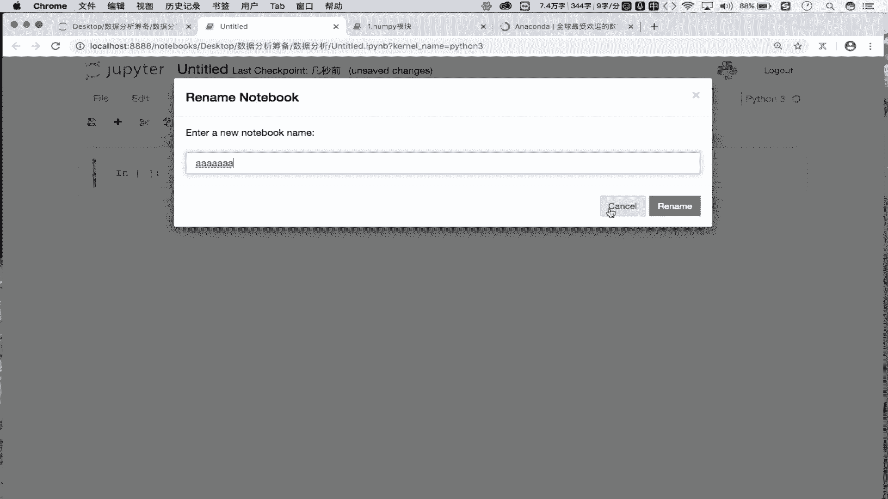
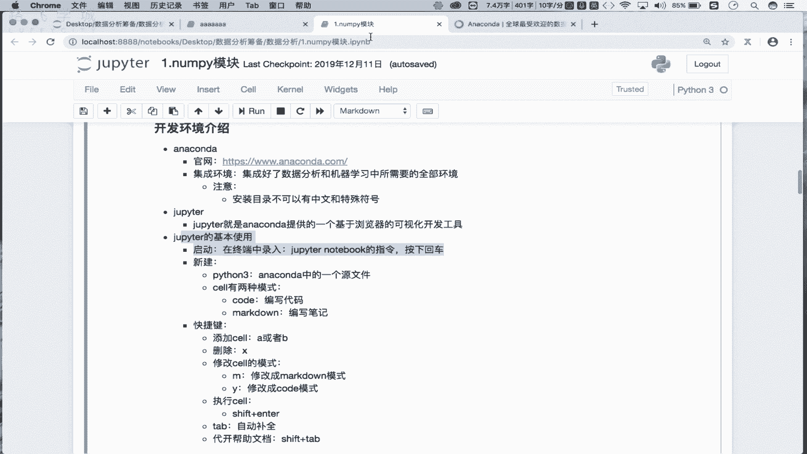

# Python数据分析数据清洗，金融量化投资分析与股票交易实战 - P2：02 修炼前的准备-环境搭建 - IT研究生 - BV1RqzBYzEnB

对这个数据分析呢进行了一个初步的介绍，包括对我们整个的一个课程内容也进行了一个介绍。OK吧。那么这一小节咱们就来看一下咱们数据分析所对应的一个开发环境搭建的一个流程。OK吧。

那么首先大家看到哈我的屏幕当中所显示的这个工具，就是我们数据分析开发的一个环境，对吧？我们在这并没有采用使用我们的这个py charm，对不对？而使用的是一个叫做主pytter的一个开发环境。

那么这些开发环境各表示的是怎样的一个含义呢？我们逐步的来进行一个讲解。首先。我们先来看第一点啊，第一个叫做ancount啊， an calendar它是一个什么东西呢？

首先这个啊我把它的官网呢已经给大家粘到这了，大家可以打开这个官网去看一下这个andcount它的一个基本的一个介绍。那这块的话，咱们就不领着大家逐一的去看了。

这我只需要对an counter进行一个初步的介绍就可以了。好吧。那么首先我们要知道an counter它是一个集成环境。集融环境O吧。那首先大家能够理解什么叫做集成环境，是不是？

那就是说这样的一个undercount，这样的一个环境已经给我们集成好了很多这个数据分析，包括机器学习开发的一个环境了。OK吧。所以说集成环境。

这个under encountercount只就是说它已经帮助我们这个集成好了数据分析。和机器学习中啊所。需要的。全部。环境。那就是说如果我们想要进行数据分析，包括机器学习的一个开发工作。

首先我们需要先在自己的本机当中安装好undercount。那么这个undercount是一个集成环境，它帮我们集成好了数据分析和机器学习所需要的全部环境。

那就是说如果在你的本机当中已经安装好了undercount。那么意味着我们就可以使用我们本机集成好的undercount这样的环境进行我们的数据分析，包括我们机器习相关的开发工作。OK吧。好。

那所以说undercount它是一个集成环境。那么各位啊，我们需要从官网当中啊，这有一个下载就是点击下载去下载undercount这样的一个安装包。下载安装包之后呢，然后双击对其进行一个安装就可以了。

OK吧。那么这个细致的一个安装流程，稍后我会给大家上传一个这个word所写的一个安装流程，大家也可以根据安装流程进行指定形式安装也可以。那你需要注意哈，我们所使用电脑的这个操作系统的环境不一样。

你需要下载不同的undercount。比如说你用的是m克版，用的是linkux版，用的是windows版，需要在这去下载指定操作系统对应的undercount这样的一个安装包OK吧。那么好。

那么安装包下载好之后，其实就是我们的傻瓜模式进行安装，只接是下一步下一步就可以了。OK吧。那么在安装的过程当中，需要有一些注意事项。第一个啊你的这个安装目录啊，安装的一个目录。目录啊。

这个不可以有中文和特殊符号，那就是最好你就把它装到我们的C盘或装到D盘某一个盘符的根目录下就可以了。OK吧，你的安装目录不可以有中文OK吧，否则这样的一个集成环境在使用的时候会有问题的。好。

首先是under的一个介绍跟它的一个初步的一个安装，它的一个安装流程，直接是下一步下一步点击就可以了。OK吧。那么细致的安装流程，我会给大家上传一个word形式的安装流程的一个文档。

大家也可以照着文档去安装，OK吧。好，那么接下来是主拍tter，那主拍tter是什么呢？我们接下来一下啊主。pitter或者叫做杜比特啊。

它就是我们的under counter提供的一个基于浏览器的可视化开发工具。那首先我们有了开发环境之后，我们还需要有可视化的开发工具，是不是啊？那么这个可视化的开发工具。

就可以基于它进行我们相关数据分析，包括机器级的一个代码的编写，包括代码的一个执行都是OK的。所以说当我们的undercount装好之后。

其实它已经帮我们集成好了这样的一个基于浏览器的可视化的开发工具叫做主pyerO吧。那所以说主pyer是不需要我们单独安装的，只需要把undercount装好之后，我们就能用主pyer了。OK吧。

所以说你只需要知道主pytter就是我们的undercount，帮我们提供好的一个基于浏览器的可视化的开发工具。我们需要在主pytter这样的一个开发工具当中进行数据分析相关代码的一个编写。

包括执行OK吧。好，那么这个主tter怎么去用呢？看一下它的一个使用哈使用。首先它的一个使用的话，是第一步是我们要知道怎么去启动啊，怎么去启动。那启动的话，我们只需要在我们的这个终端中啊录入。

录上的录一个叫做主peer noteote。note book的指令啊，然后的话按下回车即可。你比如说在这儿的话，我可以打开一个什么呢？

打概有多车。OK吧好我录入主note book按下回车即可按下回车之后，它会帮你启动你默认的浏览器。OK吧？浏览器启动好之后，会发现它可以显示这样的一张页面，对吧？

这张页面里边所显示的就是你当前的一个指定目录下所对应的一个目录结构，O吧。那这个是我们主pyer的一个启动。那所以说这个主pyer是一个基于浏览器的可视化开关工具。

所以说当这个指令在终端当中录入好了之后，它会给你启动一个服务，并且将你的浏览器打开，并且在浏览器当中访问指定的工具啊，你所看到的就是这样的一个界面，OK吧。

那这个界面所表示的是某一个目录结构下对应的一个。

对应的一个这个目录是不是？那这个工具怎么去使用呢？首先啊在这儿的话，我们需要进行一个什么呢？进行一个新建。我们主要新建什么呢？好，看一下，那我们启动好之后，这有一个new。

是不是我们可以new一个什么呢？new一个pyon3即可啊，这个pyon3所对应的是我们undercount这个集成环境，帮我们新建的一个原文件，OK吧？一个原文件，你看下边这是什么。

你看是这个 folderer就是帮我们新建一个文件夹是吧？这个是帮我们新建一个任意后缀的文文件吧，对吧？我们最主要新建的是python3OK吧？好，写一下，在这我们需要新建一个python3。

它所表示的是我们的啊那。康的。中的一个什么呢原文件OK吧原文件我们需要新建一个原文件，在原文件当中写代码进行执行。OK吧。那这儿的话你看一下，我点击判断3走，它就会给我新建这样的一个文件吧。OK吧。

那在这儿是它默认的一个文件名，我可以给他改一下，比如叫做AAAAAA可以吧？改完之后呢，然后我rename一下，然后返回上机目录，看一下，这块多了1个AAAA点IPYNB的文件啊。

那这个hold缀是点IMB，它指的就是我们新建好的一个基于under counter的一个原文件。OK吧？那原文件新建好之后，你看这里边的话默认是不是只有这么一行，对吧？

这行我们给它起个名字叫做sellO吧，叫做sell。那么这个sell干嘛使的呀。你看这个sell里边呢，我们是可以给它写指的内容的吧，对吧？写指定的相关的内容啊，那么内容写好之后。

我们就可以在这去只行我们所写好的内容，OK吧？那是不是意味着我们可以在这写代码呢？不知道试一下，看我这是一个print。BUB我们是不是可以执行一下怎么执行呢？你看前边这块有一个run，是不是点一下吧。

走哎，你看执行，看到我们的执行结果了，对不对？所以说我们可以在cell当中进行相关相关代码相关笔记相关注释的一个编写吧。编写完了之后，咱们可以对其进行一个执行，是不是OK吧？好。

那么然后呢还有点需要我们注意一下啊。那就是说我们sell呢是分成不同模式的啊。sell有。两种模式。一个是code模式，一个是什么呢？mark。down模式OK吧，那我们看一下，那怎么去更改。

怎么去查看它的模式呢？你比如说在这儿我选中了excel之后，你看这儿那这儿默认显示是不是code呀，那么意味着我现在所新建的这些excel都是code模式吧，对吧？都是code模式。

那我想修改这个模式怎么办？好，我点一下这个下箭头，把它改成mark down。看一下，那么第二个cel就被我修改成了markdown模式，那么这两模式有什么区别呢？对不对？

写一下code模式啊是用来用来编写代码，就是编写我们程序的吧，而markdown模式的seel是用来编写笔记的是有区别的对吧？那各位你在编写笔记的时候也应该用过markdown，对不对啊。

所以说这个markdown就是我们之前下好的一个编写笔记的一个软件叫markdown，只不过它已经被集成到我们的主拍点当中了吧，对吧？那咱们去试一下吧。好，那现在你看这有一个什么呢？这个cel。

我们一点击它会发现这是markdown模式吧。那我就编写一个笔记吧。基于我们的这个呃markdown它的一些个操作指令，我们可以在这去制定笔记的样式吧。比如第一小节，我们讲的是什么呢？基础指令，对吧？

然后呢我们去执行一下，走看一下这块基础指令就根据指定的样式制定好了吧。对吧所以说甭管是markdown模式的seel还是code模式se，是不是都需要进行一个运行才可以啊，对吧？进行运行才可以啊。好。

那这个是我们的一个sell的模式。那然后的话我们还可以去新建se。比如说我在这儿点击一下这个加号点就可以在这去新建一个cel，是不是那新建的sell默认情况下。

是不是markdown是一个code模式的se啊，对吧？我们还可以把它选成mark down，把它修改成markdown模式的seel，是不是都可以啊？对吧？好，那接下来的话哈在这我们重点是讲解什么呢？

讲解一下我们的一些个快捷键。有哪些呢？第一个。添加。cllO吧，那在这儿我想去新建ex个cel的话怎么办呢？我只需要按一下A或者按一下B即可。你看我按A是不是在当前选中sell的上方创建excel。

对吧？那我选B的话，是不是在当前sell的下边插入excel啊，对吧？所以说在这儿插入se，我们可以用一下A。或者B这样的一个快捷键吧。能添加就能删除吧，对吧？删除我们就用什么就用我们的X就可以了。

X就指定删除了。OK吧，删除seel。那然后的话还可以去修改sell的模式。好，怎么改呢？我们可以看一下哈。比如说现在我选中的最后ex个cel，它默认是code模式啊，我按一下M。

走是被修改成了mark模式，我再按一下Y就修改成了code模式了吧，对吧？所以说修改模式，一个是什么呢？M一个是什么呢？Y是不是啊？那么点击M是说这个将sell模式修改成什么呢？

mark down模式吧。对吧b down模式啊，而我们的one是说将我们seel修改成。扣的模式。对不对？修改成code模式啊，这个是markdown模式。好，接下来的话还有快捷键是什么呢？

就是我们的一个执行赛啊。我们说甭管是markdown模式的sre，还是我们的这个。这个这个code模式虽然是都得执行啊，怎么执行呢？统一的快捷键是什么呢？shift加enter招是不执行了。

早不又执行了，对吧？叫做shift加enter啊，到这儿。shift加enter。好，还有一个快捷键就是我们的type type什么意思呢？type指的是自动补权吧。对吧代码的一个自动补全功能啊。

我们之前是不用过呀，还有最重要的一个叫做什么呢？打。开帮助文档OK吧。那这块的话就是我们的这个shiftft加上什么的？type就可以了。咱们可以去试一下。你比如说在这哈我写了一个什么呢？

写了一个print是不是那我不知道print怎么用怎么办？看我选中print，然后按一下shift加t就可以打开这个print这个函数它的一个帮助文档吧。

根据帮助文档介绍我们就可以知道这个print这函数怎么去用，是不是O吧那这个就是我们所常用的基于主tter的快捷键O吧？那么快捷键咱们掌握之后，那么我们接下来就可以使用这些个快捷键进行指令操作了吧。

对吧？比如说在这我想新建一excel怎么办按下A吧，新建了一个code模式，是不是在这我就可以编写代码了吧。那ex个cel里边只能写一行代码吧，不是excel里边你写一行也行写多行也是可以的O吧？

都是可以的，那就看你的一个个人喜好吧，对吧？所以说这个是咱们主tter的一个积分使用。那么意味着接下来。咱们就已经掌握好了我们数据分析整个的一个开发环境搭建的一个流程了吧，对吧？再回顾一下。

第一是需要让我们去官网当中下载一个undercount的安装包，然后对其进行一个安装under counter它指的是咱们机器学习和数据分析所对应的一个集成环境吧。集成环境装好之后。

我们就可以使用集成环境当中，给咱们提供好的一个基于浏览器的可视化可视化的开发工具叫做主pyer是不是主pyer这个基本使用。下边我们是不是说了O吧？所以周各位，那么接下来你们一定要根据我的一个介绍。

将我们整个的软件开发啊，所涉及到的环境进行一个安装安装好之后，接下来咱们就正式的介入到咱们整个数据分析代码实战环境当中了。

OK吧。好，那么这一小节先到这里。