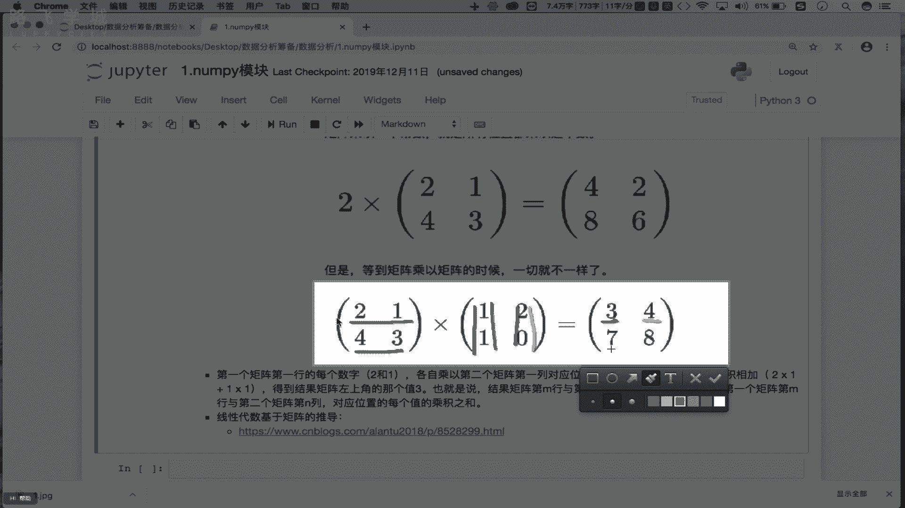
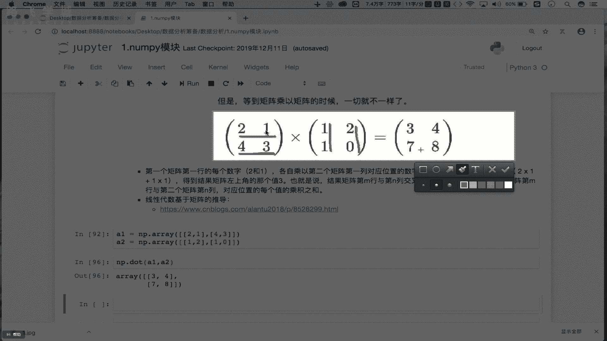

# Python数据分析数据清洗，金融量化投资分析与股票交易实战 - P6：06 统计&聚合&矩阵操作 - IT研究生 - BV1RqzBYzEnB

咱们继续ny模块的一个讲解。接下来我们来看一下ny模块变形的一个操作啊，这块的形指的是我们所谓的形状吧，对不对？不是形状。你比如说现在我有一个eror，那 error目前它的形状是什么呢？

是不是一个二维的形状啊，对吧？它是由这个五行啊，五行六列组成的吧，对吧？五行六列组成，那这块的话啊，我们先写一下，那现在原始的aror啊，是一个五行啊，六列的二维数组吧。是吧二维数索。

那接下来我们可以对其进行一个形状的一个变化啊，什么意思呢？比如说我现在就想将什么呢？将。加。二维的什么呢？数组变形成一维的OK吧，那变形指的是改变形状吧，对吧？我们可以将一维变成多维。

也可以把多维变形成一维吧，对吧？到底都是一样的，那我们就把二维变形成一维去试一下，怎么变形呢？是原始数组吧。第一个什么呢？V shape啊，V是不是重新制定形状啊，这里边看一下它就有一个什么呢？

ship的一个算数吧。ship是你重新制定好那个形状到底是什么吧，对吧？好，那我们制定好的形状是啥呢？你看原始的二维啊，原始的二维，我们需要给它变形成一维，那甭管是你的维度是多少。

你最终所对应的数组的这容器，一定需要将所有的元素都进行一个成放吧。那我们原始的二维数组一共是有5行。优变是五六30个元素吧，那变形成一维的话，那是不是需要让一维它需要有30个位置去盛放这30个元素啊？

走看一下，那现在的话我们就对其进行了一个变形的一个操作。就在这儿变形完了之后返回的不就是一个一维的数组吗？看到吗？是一维的数组啊，那这个一位数组它内部是不是有30个元素啊，对吧？那我如果这把它改成31。

行不行？就原始有30个元素把它放到31的一个位置当中，行不行呢？不行，这只能是刚好不能多，也不能少。OK吧，这个是一个基本的变形的一个操作。当然，一维也可以变形多维是吧？比如说在这啊。

现在我有一个eror是erer杠1。L-一是不是一个一味的数度啊，对吧？那接下来啊将。一维变形成什么呢？多维吧，那怎么变呢？好，er杠1点reship，是不是好，我重新给它指定一形状吧，是吧？

K是什么呢？K是两行15遍。这吧？因为2乘以15乘30啊，两行15列吧，对吧？也可以是什么呢？可以是六行。五裂吧。对不对？可以任意去指定它的形状吧，对吧？

只要最终你变形之后的容器也是由30个元素组成即可吧。OK吧？这个是我们所谓的一个变形。那么这个变形在我们的机器学习当中会用到那么在我们这个LP的基础当中啊。

我们几乎是不会用到变形的那我们只需要有变知道有变形这样的操作即可，OK吧。好，下边呢有一个机连，机连是啥意思呢？好，我们这写一下啊，这个所谓机联的操作指的就是说江上么的江。

多个啊将多个这个nP数组进行横向或者纵向的拼接。那么咱试一下什么叫拼接呢？你比如说现在啊我这有一个什么呢？aror，它是一个五行六类的二维数组啊，对吧？那我们就可以对两个ar进行一个横向或纵向拼接。

比如说NP点。concatenate使用这样的一函数进行级连啊。好，它的参数一是一个什么是元组吧，这里边需要放即将进行机连的数组。比如说我就将er跟er进行一个极连吧，那进行横向级连还是纵向极连呢？

我们要知道横向级呢就是说拿这个arrow rule组跟另一个arrow rule组是横行放一起拼接啊，纵向是不是变经列放一起拼接啊，那么这个这个级连的方向怎么指定呢？通过第二个参数叫做acs进行指定。

X如果X等于零，好，看一下走是不进行了什么呢？是不是进行列跟列的拼接啊。听了吗？是不是第一个I，是不是第二个按是不是列列拼起来，对吧？那落实意义呢？说指定的方向是函量是不行行并以写啊，二是啥呢？

二级报错了，因为没有第二个轴项，O吧。所以说这块X表示是轴向的意思吧，对吧？那零和一分别表示啥意思呢？零表示是列列是不纵向的意思呀，是吧？一是行是不是横向的意思啊，对吧？

所以说我们这可以通过X进行这个积连方向的一个指令吧，对吧？是横横接连呢，还是列跟列极连呢，O吧？啊，当然我们现在积连呢是不是两个二维数组啊，那二维数组只能是有两个轴向吧，是吧？

就想我们的二维坐标是有X轴和Y轴两个轴向，对吧？那如果是一个三维立体的空间的话，是不是有三个轴向，对吧？如果我们这积连的是以两个三维的数组，那么意味着轴向就可以选择二了吧，对吧？因为它有三种可能吧。

对吧？好。再讲那我们的二维数组能不能跟三维数组进行一个横向或纵向的极点呢？不可以啊，这儿的基点只能是同一维度进行极点操作，O吧，同一维度进行极点操作。O吧。然后大家也可以想一个问题。

如果是同一维度进行横向或纵向的拼接。那如果拼接的这两个数组维度一样。那它的行跟列的个数不一样，会怎么办呢？各位自己去试一下，O吧，自己试一下，所以在这儿我我会保留一个问题啊。问题。

也就是说这个吉联的两个数组维度一样啊，但是行列个数不一样。会如何？各位自己去试啊，比如说有一个数组是五行三列是吧？另一个数组是五行四列，那么这两个数组是不是列不一样啊，那能记连吗？对吧？

各位自己去试一下啊，自己试一下。好，那这块几点有什么用呢？比如说几点我们可以做一个什么呢？做一个三宫格，就三张图片可以给它拼一起，对吧？你想三张图片拼一起的话，可以横着拼一起，也可以竖着拼起吧。

那到底怎么拼呢？这咱们去试一下，比如说在这啊，我们看一下image error是不是咱们之前所加载的那个那个那个卡通图片的一个数组数据啊，对吧？那在这儿的话，我们就可以这样看NP点。Conca。你看好。

在这儿的话，我们就把什么呢？把image array跟image array跟image array进行一个什么呢？比如说我们进行一个这个横向的拼接吧，对吧？那这块返回的是拼接之后的大的数组啊。

你看在前边的案例当中，我们进行积累之后，返回的是一个新的数组吧，对吧？好，我们叫做er杠3okK吧？那现在我们就来把PRT点M进行er杠3的一个显示总体显示的是三张图片拼写了，对吧？

因为你看这是一张图片，两张图片数据，三张图片数据是以轴向为一的就是拼写啊，对吧？那果是里呢是竖着拼写啊。对不对？你能做三宫格，能不能做九宫格呢？是不是也可以啊，对吧？也是OK的啊。

那么这个是我们的1个YIP数组基点所对应的一个操作，OK吧。好，那么基点完事之后呢，下边来看一下我们常用的聚合操作啊，聚合操作。那从聚合操作开始。

我们就需要啊需要去学习我们nP数组当中所给我们封装好的一些基于数值运算的相关的操作。你比如说现在我有一个什么呢？原始的数组是R它是一个五行六列的数组吧，对吧？那如果哈我在这儿点一个什么呢？s干嘛使？

走是不是求所有的数组元素之和呀，对吧？那s当中还有一个axs轴向的意思吧，是吧？那如果axs等于一个零啥意思，是不计算出零是不是列呀，是不是计算出二维数组每一列的和啊，那一呢不计算出每一行的和啊。

这是s吧，那后边的me max是不都是一样的呀，是不是求最大值最小值和求平均值啊，我可以求所有元素的最大值，最小值平均值，也可以求某一行或。一列它的最大值最小值平均值吧，对吧？

some会用到后边的三个是不是都会用了？OK吧？啊，比如说在这儿求一下最大值吧，er点Rmax早求出所有元素的最大值，O吧。那我能不能求出每一行的最大值呢？走求出了每一行的最大值啊。

只需要指定一下轴项是不是就可以了，O吧？好，这是我们所常用的聚合操作。接下来是常用的数学函数啊，那这些常用的数学函数有哪些呢？比如说在这儿啊i还是我们的一个五行六列，五行六列的一个二位数组吧，对吧？好。

那么在这儿的话，我们可以点一个什么呢？第二1个算求一下什么呢？求一下我们的这个。仲结。MPDR。晒。O吧，第二下NT。3，这传啥呢？我们在这儿呢需要给它传入一个传入一个数组吧，比如传入一个ar。

走看这儿返回的是说对我们数组当中的每一个数组元素进行了一个正弦的计算，是不是包括有我们的余弦和和这个ts都有啊，对不对？都有啊，然后呢。当然你看这块有散，除了散之外的话，还有什么呢？还有我们的这个。

还有这个嘛还有什么，还有这个3C，对不对啊，3C啊。3CsC求的是我们的反增量函数啊，对吧？好，都可以自己的去试一下啊，试一下。我这不放按l，比如放1个2。点5。是不是也可以啊，对吧？也可以啊。好。

然后呢，接下来还有一个是什么叫做aroundaround，是说可以返回指定数字4舍五入的结果，对吧？试一下啊，看一下NP点R。Around。好，比如说这我传入一个什么，传入1个3。1。4OK吧好。

走执行，你看返回的值是不是三是不进行了45度啊？那如果是1个3。84呢，返回的不就是4了吗，对吧？好，那它还有一个参数叫做什么叫做DC对吧？D看它可以等于零也可以等于一OK吧？那这个零跟一啥意思呢？

如果是零的话，那么就意味着我们舍弃小数的位数，对吧？那如果是负数的话，那就是说它可以将整数进行45入到小数点左侧的一个指定位置吧，对吧？你各位啊也可以自己在这传入一个什么呢？正数跟负数去试一下。

比如我这传入一个什么，它一个0它是一个一吧。对吧是3。8，这下来的一个结果吧，乘以2呢，3。84吧，对吧？那传说一个负1呢，返回是0。08，就是基于我们的整数进行的45度吧。OK吧。好。

自己呢去适当的理结一下就可以了啊。好，下边是常用的统计函数，这个常用的统结函数，我们重点就来看一下咱们的标准差跟方差O吧，看一下标准差跟方差。那剩下的就不是特别重要了。OK吧。

你看比如说前面有一个叫做am命跟max，它就可以返回我们数组当中指定轴项的最大值最小值。那这个am命跟 maxax其实跟我们的上边的聚合当中的max跟命操作是一样的呀，对吧？一样的啊。那么这个PTP啊。

它可以返回我们数组当中的最大值跟最小值的一个差O吧，试一下PPP吧。NP点。NP点R叫做什么的PTP是不是？啊，我们来看一下啊PTP啊PTP好，这我们传一个 error走看这儿我指定一下走向吧。

X等于0，它就可以返回我们每一列最大值最小值的一个差O吧？好，重点在这我们看的是什么呢？看的是我们的方差跟我们的标准差，O吧？那首先看下我们的标准差。那各位你知不知道什么叫标准差呢？所谓的标准差。

它指的是需要计算一组数据平均值的一个什么的分散程度的度量啊，对吧？那比如说咱们举个例子哈，比如说那我们如果一个班是吧？期末考试整体出来了，咱们能不能对期末考试成绩的语文成绩进行一个标准上的计算呢？

如果标准差比较大，说明咱们班同学的语文成绩，有的人考的特别高，有的人考的特别低，是不是对吧？那么这个高低指的就是我们的这个。语文成绩对应的什么呢？平均值分散程度的一种度量，是不是？

那么这个标准差它的计算公式是什么呢？看一下啊，这个是它标准差的一个计算公式。O吧？那在这的话，我们需要先让我们的什么呢X减去X点幂X是一组数，对吧？一组数减去这组数当中的均值OK吧？

然后再进行一个均值计算，在平方再开根号，这个就是我们标准差，它的一个计算公式。那最终这个公式返回的结果指的就是X对应这组数据平均值分散程度的一种度量啊，O吧？咱们去试一下吧。

你看现在我这有个 array是不是 array啊，假如这个就是我们的一组数据呗，对吧？一组数据啊。啊，这样吧瑞一啊，这是一组数据，我们想计算这组数据的一个标准差怎算的第二1个STD即可走看这反复的26。

就是我们这组数据的标准差还是比较大的，是不是O吧？标准差啊，那标准差，你知道了之后，接下来看方差方差跟标准差其实表示的含是一样的，只不过啊只不过你看我们的标准差在这开的根号。

是不是我们的方差只有后边的部分，没有开根号的部分。OK吧？所以说我们的这个什么呢标准差去除根号指的就是我们的方差也是一样的。一先拿到一组值，是不是好，我在这的话就不STD的第一个什么呢。第21个报。

VR啊。看一下，这就是我们的方差。你会发现711不就是26的一个平方吗？对不对？OK吧？这个是我们的方差跟我们所谓的一个标准差对应的一个衡量计算。OK吧？所以说标准差跟方差是比较重要的。

各位一定要懂什么意思。OK吧，在我们的数学统计当中，我们的标准差跟方差是最常使用的工具。好，那么最后一块内容就是我们的一个矩阵啊，就是我们矩阵。那npy模块当中，我们重点要掌握矩阵的乘法运算即可啊。

掌握矩阵的乘法运算就可以了。OK吧。那首先什么是矩阵呢，对吧？这个矩阵在我们的信性代数当中，是是是不是一定是基于咱们的矩阵进行了一个实现啊，对吧？所月这块啊，我就不再对矩阵进行一个系统介绍了，OK吧？

各位如果懂的话啊，你就接着往下听，如果矩阵它的一个含义或概念不懂的话，你只需要掌握接下来我讲的矩阵乘法怎么运算就可以了，OK吧。那么首先在这儿的话，我们可以干什么呢？

可以在这儿呢啊使用我们的这个啊对应的工具去创建一个单位矩阵，可以吧？我们先创建一个矩阵啊。好，那这块的话，我们的矩阵怎么创建呢？可以NP点一个什么呢？mat。买车 lab。我皮垫儿买车。那吧。日 i。

整体啊这样啊这样吧，NP点I吧？你看它吧，这个比较简单啊，就在这儿啊，看一下我给它传入一个什么呢？比如说我传入一个。乘认1个6。看一下，那现在这儿返回的就是一个标准的单位矩阵。OK吧，我们就不用它了啊。

我们这儿就换一个吧。用这个I啊。EYE可以返回。一个标准的单位矩阵OK吧？单位这个单位矩阵就是说我们的行列是一样的，包括对角线都是一，其他都是0，它是一个标准的这个单位矩阵啊，那么单位矩阵。

你看起来它是是一个这个二维的一个数组啊，对吧？所以说我们的矩阵它就是一个表格表格就是一个这个二维的数组，是不是OK吧？那我们在这儿就创建好一个矩阵啊，创建好了一个二维数组。

接下来矩阵的转制可以用下点T转制啥意思呢？你看一下转制就是说我们可以把我们的行变成列列变成行就是转制O吧，那怎么转制呢？在这的话看一下在这儿我就点一个什么呢？点一个大T即可。看一下。

现在你看这儿返回的是说把行列进行了一个方向啊，对吧？把行列进行方向。你看在这儿把行列进行方整好像效果不明显，是不是？那么换一个啊，比如说我在这有1个NP。I吧。E error的话是原始的数据吧。

是不是69是第一个呀？80是不是第二个元素，第一个T走看行变成列列就变成了行，这个叫转制O吧，转制啊，好，那么这个转制也是一个常用的一个操作，O吧？它不光能够用在我们的矩当中。

也可以用在咱们的数字里边吧，对吧？那这个矩阵乘法到底是算的。首先咱的这个矩阵的加法啊，加法跟我们的一个常数乘以矩阵，咱们就不说了，这个比较简单，看这个图就可以了，重点是说两个矩阵进行相乘。

它的一个含义是什么？OK吧，那两个矩阵啊，这这块看一下两个矩阵如果相乘的话，最终它得到的结果是啥呢？比如说这有一个什么呢？2143它有一个什么呢？1210，这两个矩阵如果进行相乘的话。

得到的结果是3478，怎么算的呢？对吧？它的算法是这样啊。

这样的，首先让第一个矩阵的第一行okK吧，乘以第二个矩阵的第一列。就是让2乘以1加上什么呢？一乘以1是不是得到的是3对吧？就得到了三这样的一个值了吧，对吧？再怎么做呢？

再让我们的第一个举证的第二行乘以第二个举证的第二列吧，对吧？相乘相加就是4乘以2加上3乘以0，最终得到的一个值，这样啊。这样。这样你看我们一开始说第一行是不是乘以第一列啊，是吧？

再让我们的第一行乘以我们第二列啊，再让第一行乘以第二列啊，就是2乘以2加上一乘0吧，是不是我们的4啊，主要是4OK吧。那就说第一行啊，第一个矩证第一行依次乘了第二个举证的第一列和第二列了吧。

那接下来呢既然就是说我们的第一个举证第二行依次要乘以第二个矩证的第一列。跟第二列吧，线上增加是不是得到几，是不是4乘以1加上3乘以1是不是得到7？

对吧然后的话是不是3乘以2加上这个3乘以0得到我们的一个8，对吧？那这样的话就进行了一个线乘先得到了一个结果吧，对不对？好，在这啊在这首先是我们的第一行乘以第一列是吧？

然后第一行是不是乘第二列是不是得到三次这两个值，第二行乘以第一列，第二行乘以第二列是不是得到78这两个值，对吧？这可能写错了啊，不是七8，这可能写错了，OK吧？这个图啊大概是这样的意思。

那么咱们接下来去算一下子啊，算一下子，比如说在这儿啊。

我们需要有两个矩证啊，好，A一等于I等于1个NP点R。A瑞。OK吧？好，这里边我们就放谁呢？就放我们的这个跟上图一样，放1个21和1个43，可以吧？好，A2就是NP点啊瑞。好，这里边我们就放12。

和一0。OK吧，那现在我们的A跟A2是不是都有了啊，我看这是不是少个括号啊。嗯，这是括号是做的。OK啊，看一下A一是不是他对吧？A2是不是他。对吧好，那么现在我们的A1A2都有了。

那么我们让A1乘以我们A2看一下结果是什么啊。那这个矩阵相乘的话，咱们用的是什么？用的是我们的这个DOT这样的一个方法啊，那这块就是NP点。DOT好，这传入我们的A跟A2就可以了。A1和A2好。

走返回的结果是不是3478呀，对吧？那现在我们就拿到了这个矩阵相乘对应的一个结果了吧，对吧？矩证相对应的结果啊，在这我们再看一下啊，怎么算的呢？是不是第一行乘以第一列2乘以1加上一乘以1啊。

是不是得到了这个三，然后第一行是乘以第二个矩证第二列是吧？2乘2是4吧，对吧？然后的话。然后4乘以一是0，对不对？啊，好，那这个举乘法就先到这里啊，先到这里。

这块啊第一行再说一下第一行乘以第一列是不是2乘以1加上1乘以1，是不是我们的3，对吧？第一行是不是乘以第二列，2乘以2加上1乘以0是不是4啊，对吧？然后第二行是不是乘以第一列是吧？

4乘以1加上3乘以1是不是7啊，对吧？好，第一行是不是乘以第二列，是不是4乘以我们的2，然后加上3乘以0是不是我们的8，对吧？所以说这个再说一下啊，刚才我说的有点乱啊，再说一下，那这块的话就是什么。

就是我们的第一行。

第一行啊乘以第一列是吧，加上第一行。乘以第一行乘以第六的值是不是3对吧？3啊，然后第一行乘以第二的值是2乘2，加上1乘0，是不是4，对吧？好，然后第二行是不是乘以第二行是不是乘以这儿第一行？

对吧然后这块是4乘以1，加上一个3乘1是7。对吧然后的话是这一行乘以第二列是吧？就是4乘以2加上我们的这个3乘以0是我们吧，对吧？这个就是我们所谓矩证的一个乘法，OK吧。那么至此的话，咱们整个的这个。

n模块啊到这儿就已经结束了。所以说在nP模块当中重点有这么几个。第一个是我们的矩阵乘法，你要知道它所表示的含义是什么。因为矩阵乘法在我们的机器学习当中会经常会被用到啊。第二个重点就是说我们的这个什么呢？

我们的这个nP数组，它的常用的统计函数，包括它的聚合函数，你也知道它有哪些okK吧。第三点就是说我们的这个nP模块它的一个所以跟切片的操作，你也要知道它的一个常规的用法是怎样的。O吧。

这个就是我们整个n模块，它对应的几个重点OK吧。好，那么至此的话，咱们nP模块的一个讲解就先到这里啊，先到这里。

