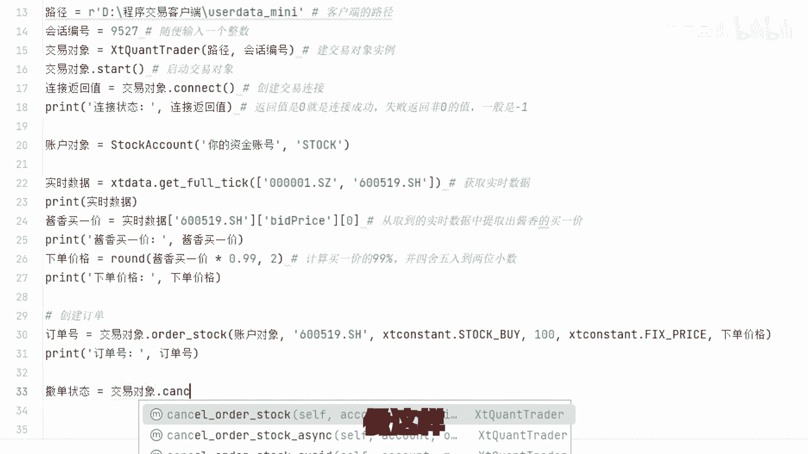

# Python炒股自动化（4）：通过接口向交易所发送订单 - P1 - 财云量化 - BV1PD42177sr

🎼实现股票的程序化自动化交易，需要找券商申请API接口权限，实现过程可以简单分为三步，获取数据提交订单查询账户。前面讲了如何获取历史和实施数据。今天我们讲一下提交订单。

只是需要API交易接口的大佬看置顶评论或者后台留言即可获取。这些内容是给新手看的程序交易中取数据有很多公开方法和模块可以取到第三方的实施数据有缺陷凑合着也能用，这些不重要。

重点是交易也就是下单是需要权商的接口权限的。现在有部分权商可以给个人申请接入，很多种接入方式，我前面后面举例的接口都是以此为基础，最适合个人账户的没什么门槛，一般散户都能打到，不要用第三方外挂。

不要用第三方外挂，不要用第三方外挂，原因不一而足，比如严重延迟出错，资金不安全，最重要的违法违规。以前我分享过篇幅有限，这里就不细说了。现在我们来演示如何向交易所发送订单。

前面获取数据的部分都是直接获取就行。交易接口不行，需要和交易中心建立连接代码如下。

🎼建立连接这一步一般不会出什么错。连建成功后，我们就要为交易账户创建对象，让交易所知道是你的账户发送过来的订单。🎼账户类型默认stauck表示股票涨，也支持期权、期货、港股通等。

前面两步做好了就可以开始下单了。比如你现在想买入易售嘉乡科技，以当前买溢价99%的价格挂单，等待成交。首先取当前实施价格再计算买溢价的99%，然后以这个价格提交订单。🎼现在我们成功创建交易连接。

并根据盘口的价格提交的订单，目前是挂单等待成交的状态。但如果市场变化不是预期的方向，我们就要收回资金，等待下一次机会，所以就要撤销这个订单。像这样，这一节本来会很复杂，我一直想着怎么简单点。

让新手看着更直观，更容易阅读。结果写完发现很多东西都没必要现在去理解。但是新手也要预想到实际操作过程绝不可能这么简单。你现在如果要测试就死板的照抄一遍，让程序跑通给你正反馈才有意愿学下去。

现在不要想那么多，将来遇到问题了，自然是有办法解决的。目前你只要理解了程序的原理就知道怎么提问题，有问题就一定有答案，有大模型辅助，相关交流群里也有大佬们指点12，只要你愿意写复杂的策略并不是什么难事。

好了，今天的分享就到这里，对股票量化成序挂自动交易感兴趣的朋友可以关注我，有任何相关问题也可以留言讨论，或者私信与我交流。

