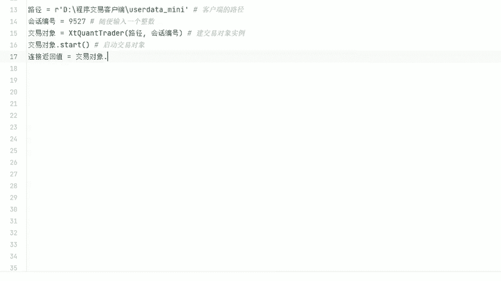
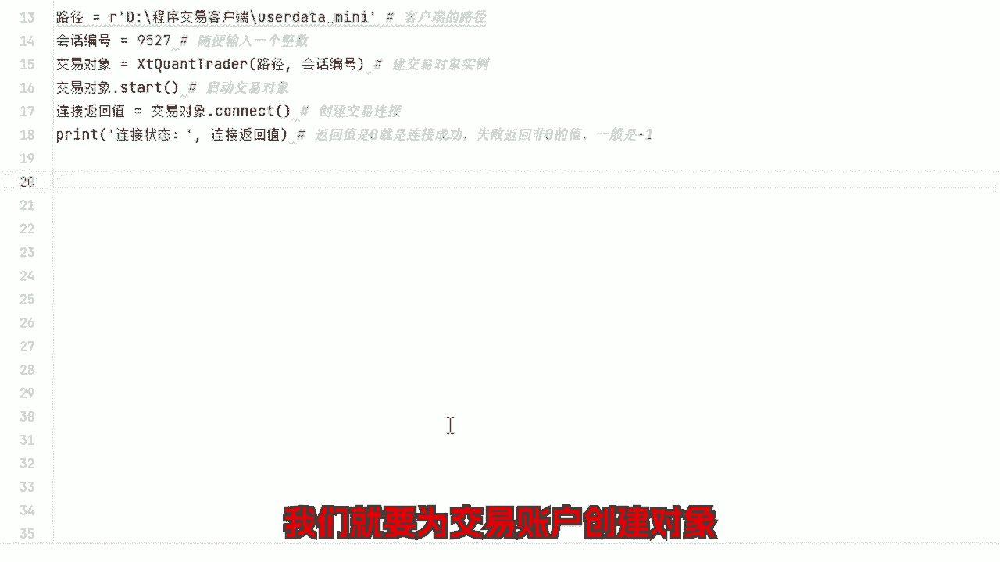
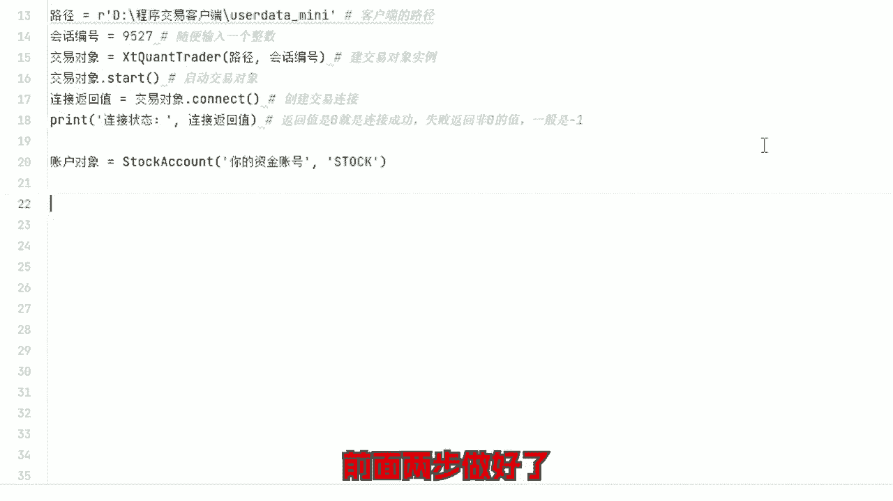
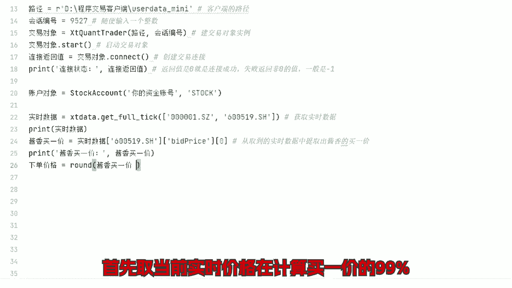
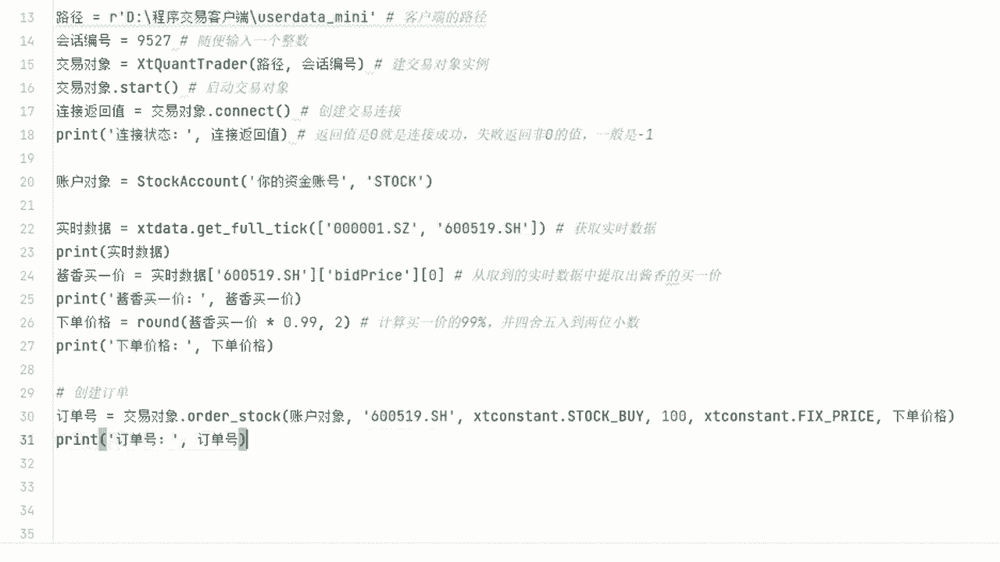
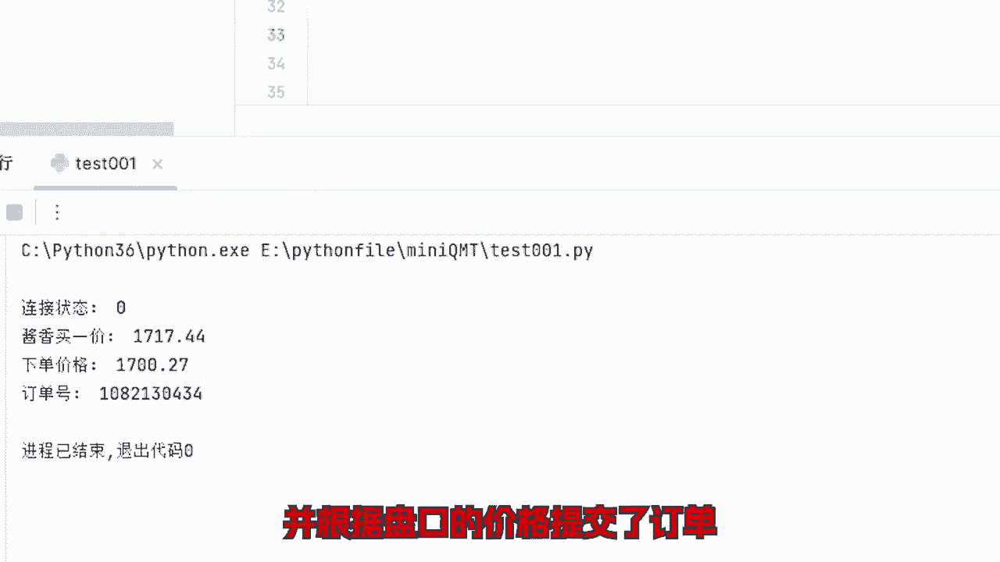
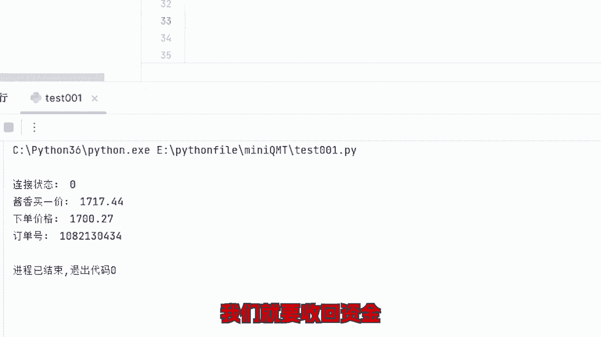
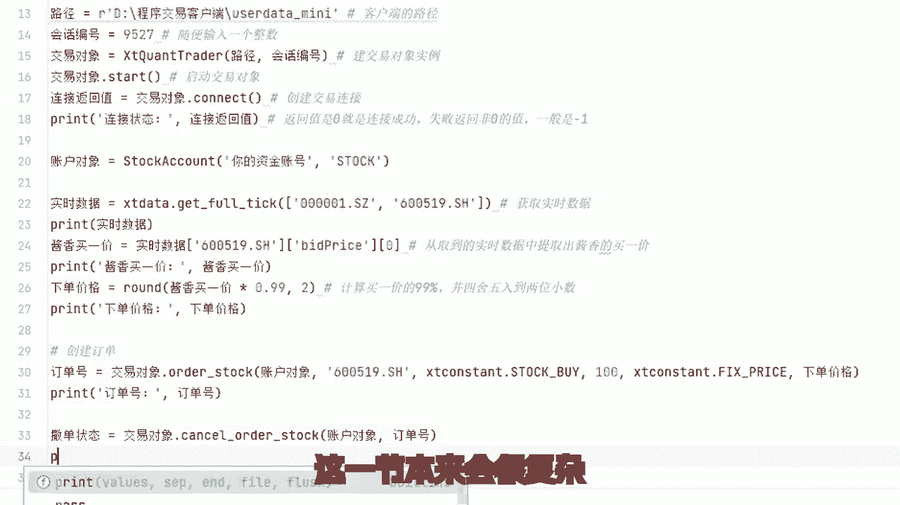

# Python炒股自动化（4）：通过接口向交易所发送订单 #量化交易接口 #股票API接口 - P1 - 无限超人Infinitman - BV1BntAePE2M

实现股票的程序化自动化交易，需要找券商申请API接口权限，实现过程可以简单分为三步，获取数据，提交订单查询账户，前面讲了如何获取历史和实时数据，今天我们讲一下提交订单程序。

交易中取数据有很多公开方法和模块，可以取到第三方的实时数据，有缺陷，凑合着也能用，这些不重要，重点是交易，也就是下单是需要券商的接口权限的，现在有部分券商可以给个人申请接入，很多种接入方式。

我前面后面举例的接口都是以此为基础，最适合个人账户的，没什么门槛，一般散户都能打到，不要用第三方外挂，不要用第三方外挂，不要用第三方外挂，原因不一而足，比如严重延迟出错，资金不安全，最重要的违法违规。

以前我分享过，篇幅有限，这里就不细说了，现在我们来演示如何向交易所发送订单，前面获取数据的不困，都是直接获取就行，交易接口不行，需要和交易中心建立连接，代码不下。

建立连接，这一步一般不会出什么错，连接成功后，我们就要为交易账户创建对象。

让交易所知道是你的账户发送过来的订单，账户类型，默认stark表示股票账户也支持期权期货，港股通等，前面两步做好了。

就可以开始下单了，比如你现在想买入一手家乡科技，以当前买溢价99%的价格挂单。

等待成交，首先取当前实时价格，再计算买溢价的99%。

然后以这个价格提交订单。

现在我们成功创建交易链接，并根据盘口的价格提交的订单。

目前是挂单等待成交的状态，但如果市场变化不是预期的方向，我们就要收回资金。

等待下一次机会，所以就要撤销这个订单，像这样，这一节本来会很复杂。

我一直想着怎么简单点，让新手看着更直观，更容易阅读，结果写完发现很多东西都没必要现在去理解，但是新手也要预想到，实际操作过程绝不可能这么简单，你现在如果要测试，就死板的照抄一遍，让程序跑通，给你正反馈。

才有意愿学下去，现在不要想那么多，将来遇到问题了，自然是有办法解决的，目前你只要理解了程序的原理，就知道怎么提问题，有问题就一定有答案，有大模型辅助，相关交流群里也有大佬们指点一二。

只要你愿意写复杂的策略并不是什么难事好了，今天的分享就到这里，对股票量化，成体化自动交易感兴趣的朋友可以关注我，有任何相关问题也可以留言讨论。

